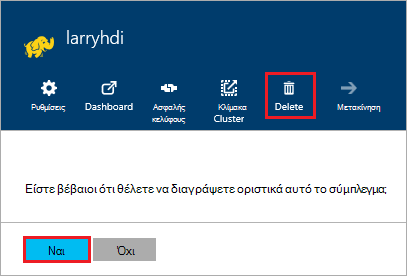

<properties
pageTitle="Πώς μπορείτε να διαγράψετε ένα σύμπλεγμα HDInsight | Azure"
description="Πληροφορίες σχετικά με τους διάφορους τρόπους που μπορείτε να διαγράψετε ένα σύμπλεγμα HDInsight."
services="hdinsight"
documentationCenter=""
authors="Blackmist"
manager="jhubbard"
editor="cgronlun"/>

<tags
ms.service="hdinsight"
ms.devlang="na"
ms.topic="article"
ms.tgt_pltfrm="na"
ms.workload="big-data"
ms.date="10/28/2016"
ms.author="larryfr"/>

#Πώς μπορείτε να διαγράψετε ένα σύμπλεγμα HDInsight

Χρέωση ξεκινά μόλις ένα σύμπλεγμα δημιουργείται και σταματά όταν το σύμπλεγμα διαγράφεται και είναι αναλογική ανά λεπτό, επομένως θα πρέπει να διαγράψετε το σύμπλεγμά σας πάντα όταν δεν είναι πλέον χρησιμοποιείται σύμπλεγμα HDInsight. Σε αυτό το έγγραφο, θα μάθετε πώς μπορείτε να διαγράψετε ένα σύμπλεγμα χρησιμοποιώντας την πύλη Azure, Azure PowerShell και το Azure CLI.

> [AZURE.IMPORTANT] Διαγραφή ένα σύμπλεγμα HDInsight δεν διαγράφει τους λογαριασμούς αποθήκευσης Azure που σχετίζεται με το σύμπλεγμα. Αυτό σας επιτρέπει να διατηρούν και να χρησιμοποιήσετε ξανά τα δεδομένα αποθηκευμένα από το σύμπλεγμα.

##Πύλη του Azure

1. Συνδεθείτε στην [πύλη του Azure](https://portal.azure.com) και επιλέξτε το σύμπλεγμά σας HDInsight. Εάν το σύμπλεγμά σας HDInsight δεν είναι καρφιτσωμένο στον πίνακα εργαλείων, μπορείτε να το αναζητήσετε με βάση το όνομα, χρησιμοποιώντας το πεδίο αναζήτησης (εικονίδιο Μεγεθυντικό φακό), στη δεξιά πλευρά της γραμμής περιήγησης.

    

2. Μόλις ανοίξει το blade για το σύμπλεγμα, επιλέξτε το εικονίδιο __Διαγραφή__ . Όταν σας ζητηθεί, επιλέξτε __Ναι__ για να διαγράψετε το σύμπλεγμα.

    

##Azure PowerShell

Από μια γραμμή εντολών του PowerShell, χρησιμοποιήστε την παρακάτω εντολή για να διαγράψετε το σύμπλεγμα:

    Remove-AzureRmHDInsightCluster -ClusterName CLUSTERNAME

Αντικαταστήστε __CLUSTERNAME__ με το όνομα του συμπλέγματος HDInsight.

##Azure CLI

Από μια ερώτηση, χρησιμοποιήστε τα ακόλουθα για να διαγράψετε το σύμπλεγμα:

    azure hdinsight cluster delete CLUSTERNAME
    
Αντικαταστήστε __CLUSTERNAME__ με το όνομα του συμπλέγματος HDInsight.
