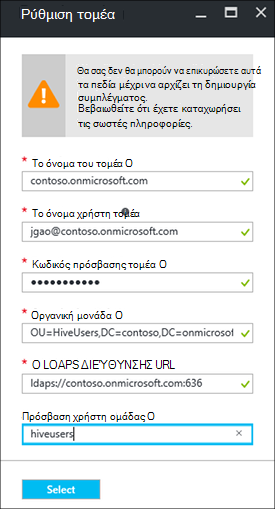

<properties
    pageTitle="Ρύθμιση παραμέτρων του τομέα HDInsight συμπλεγμάτων | Microsoft Azure"
    description="Μάθετε πώς μπορείτε να εγκαταστήσετε και να ρυθμίσετε τομέα HDInsight συμπλεγμάτων"
    services="hdinsight"
    documentationCenter=""
    authors="saurinsh"
    manager="jhubbard"
    editor="cgronlun"
    tags=""/>

<tags
    ms.service="hdinsight"
    ms.devlang="na"
    ms.topic="article"
    ms.tgt_pltfrm="na"
    ms.workload="big-data"
    ms.date="10/26/2016"
    ms.author="saurinsh"/>

# Ρύθμιση παραμέτρων του τομέα HDInsight συμπλεγμάτων (έκδοση Preview)

Μάθετε πώς μπορείτε να ρυθμίσετε ένα σύμπλεγμα Azure HDInsight με το Azure Active Directory (Azure AD) και [Apache Τζακ](http://hortonworks.com/apache/ranger/) για να επωφεληθείτε από αυστηρό έλεγχο ταυτότητας και τις πολιτικές πρόσβασης βάσει ρόλων εμπλουτισμένου έλεγχο (RBAC).  HDInsight τομέα μπορούν να ρυθμιστούν μόνο σε βάσει Linux συμπλεγμάτων. Για περισσότερες πληροφορίες, ανατρέξτε στο θέμα [συμπλεγμάτων Παρουσιάστε τομέα HDInsight](hdinsight-domain-joined-introduction.md).

Σε αυτό το άρθρο είναι το πρώτο πρόγραμμα εκμάθησης μιας σειράς:

- Δημιουργήστε ένα σύμπλεγμα HDInsight συνδεδεμένοι Azure AD (χρησιμοποιώντας τη δυνατότητα υπηρεσίες τομέα καταλόγου Azure) με Apache Τζακ με δυνατότητα.
- Δημιουργία και εφαρμογή πολιτικών ομάδας μέσω Apache Τζακ και να επιτρέπεται στους χρήστες (για παράδειγμα, επιστήμονες δεδομένα) για να συνδεθείτε με ομάδα χρησιμοποιώντας βάσει ODBC εργαλεία, για παράδειγμα, Excel, Tableau κ.λπ. Η Microsoft συνεργάζεται σχετικά με την προσθήκη άλλων φόρτους εργασίας, όπως HBase, τους και καταιγίδας, με τομέα HDInsight σύντομα.

Παράδειγμα η τελική τοπολογία έχει ως εξής:

Επειδή Azure AD προς το παρόν υποστηρίζει μόνο κλασική εικονικών δικτύων (VNets) και HDInsight που βασίζεται στο Linux συμπλεγμάτων υποστήριξη μόνο από διαχειριστή πόρων Azure με βάση VNets, ενοποίηση HDInsight Azure AD απαιτεί δύο VNets και μια διεισδύουν μεταξύ τους. Για τις πληροφορίες σύγκρισης μεταξύ των μοντέλων δύο ανάπτυξης, ανατρέξτε στο θέμα [Διαχείριση πόρων Azure έναντι κλασική ανάπτυξης: Κατανόηση των μοντέλων ανάπτυξης και της κατάστασης των πόρων σας](../resource-manager-deployment-model.md). Τα δύο VNets πρέπει να είναι στην ίδια περιοχή ως Azure AD DS.

Τα ονόματα υπηρεσιών Azure πρέπει να είναι μοναδικό καθολικό. Τα ακόλουθα ονόματα που χρησιμοποιούνται σε αυτό το πρόγραμμα εκμάθησης. Το Contoso είναι το όνομα του φανταστικά. Όταν ξεκινήσετε το πρόγραμμα εκμάθησης, πρέπει να αντικαταστήσετε *contoso* με διαφορετικό όνομα. 
    
**Ονόματα:**

|Ιδιότητα|Τιμή|
|--------|-----|
| Azure AD VNet|contosoaadvnet|
| Azure AD εικονική μηχανή (Εικονική)|contosoaadadmin. Αυτή η Εικονική χρησιμοποιείται για τη ρύθμιση οργανική μονάδα και αντίστροφη ζώνης DNS.|
| Azure AD καταλόγου|contosoaaddirectory|
| Azure AD το όνομα του τομέα|Contoso (contoso.onmicrosoft.com)|
| HDInsight VNet|contosohdivnet|
| Ομάδα πόρων HDInsight VNet|contosohdirg|
| HDInsight συμπλέγματος|contosohdicluster|

Αυτό το πρόγραμμα εκμάθησης παρέχει τα βήματα για τη ρύθμιση των παραμέτρων ενός συμπλέγματος HDInsight τομέα. Κάθε ενότητα περιλαμβάνει συνδέσεις με άλλα άρθρα με περισσότερες πληροφορίες φόντου.

## Προϋπόθεση:

- Εξοικειωθείτε με [τις υπηρεσίες τομέα AD Azure](https://azure.microsoft.com/services/active-directory-ds/) τη δομή [τιμολόγησης](https://azure.microsoft.com/pricing/details/active-directory-ds/) .
- Βεβαιωθείτε ότι η συνδρομή σας είναι whitelisted για αυτήν την προεπισκόπηση δημόσια. Μπορείτε να το κάνετε με την αποστολή μηνύματος ηλεκτρονικού ταχυδρομείου hdipreview@microsoft.com με το αναγνωριστικό συνδρομής.
- Ένα πιστοποιητικό SSL που έχει υπογραφεί από μια αρχή υπογραφής για τον τομέα σας. Το πιστοποιητικό απαιτείται από τη ρύθμιση των παραμέτρων ασφαλούς LDAP. Δεν μπορούν να χρησιμοποιηθούν πιστοποιητικά αυτόματης υπογραφής.

## Διαδικασίες

1. Δημιουργήστε ένα Azure κλασική VNet για το Azure AD.  
2. Δημιουργία και ρύθμιση παραμέτρων Azure AD και Azure AD DS.
3. Προσθέστε μια Εικονική την κλασική VNet για τη δημιουργία οργανική μονάδα. 
4. Δημιουργήστε μια οργανική μονάδα για Azure AD DS.
5. Δημιουργήστε μια HDInsight VNet στη λειτουργία διαχείρισης Azure πόρων.
6. Το πρόγραμμα εγκατάστασης ζώνες αντίστροφη DNS για το Azure AD DS.
6. VNets ομότιμης σύνδεσης των δύο.
7. Δημιουργήστε ένα σύμπλεγμα HDInsight.

> [AZURE.NOTE] Αυτό το πρόγραμμα εκμάθησης προϋποθέτει ότι δεν έχετε ένα Azure AD. Εάν έχετε ένα, μπορείτε να παραλείψετε το τμήμα στο βήμα 2.
    
## Δημιουργία μιας Azure κλασική VNet

Σε αυτήν την ενότητα, μπορείτε να δημιουργήσετε μια κλασική VNet με την πύλη Azure. Στην επόμενη ενότητα, μπορείτε να ενεργοποιήσετε το Azure AD DS για το Azure AD στο την κλασική VNet. Για περισσότερες πληροφορίες σχετικά με την ακόλουθη διαδικασία και με άλλες μεθόδους δημιουργίας VNet, ανατρέξτε στο θέμα [Δημιουργία εικονικών δίκτυο (κλασική), χρησιμοποιώντας την πύλη του Azure](../virtual-network/virtual-networks-create-vnet-classic-portal.md).

**Για να δημιουργήσετε μια κλασική VNet**

1. Πραγματοποιήστε είσοδο [πύλη του Azure](https://portal.azure.com). 
2. Κάντε κλικ στην επιλογή **νέα** > **δίκτυο** > **εικονικού δικτύου**.
3. Στην περιοχή **Επιλέξτε ένα μοντέλο ανάπτυξης**, επιλέξτε **κλασική**και, στη συνέχεια, κάντε κλικ στην επιλογή **Δημιουργία**.
4. Πληκτρολογήστε ή επιλέξτε τις ακόλουθες τιμές:

    - **Όνομα**: contosoaadvnet
    - **Χώρο διευθύνσεων**: 10.1.0.0/16
    - **Όνομα δευτερεύοντος δικτύου**: Subnet1
    - **Περιοχή υποδικτύου διευθύνσεων**: 10.1.0.0/24
    - **Συνδρομή**: (επιλέξτε μια συνδρομή που χρησιμοποιούνται για τη δημιουργία αυτό VNet.)
    - **Ομάδα πόρων**:
    - **Θέση**: (επιλέξτε μια περιοχή για το σύμπλεγμα HDInsight.)

        > [AZURE.IMPORTANT] Πρέπει να επιλέξετε μια θέση που υποστηρίζει το Azure AD DS. Για περισσότερες πληροφορίες, ανατρέξτε στο θέμα [προϊόντων που είναι διαθέσιμα ανά περιοχή](https://azure.microsoft.com/en-us/regions/services/). 
        >
        > Η κλασική VNet και το VNet ομάδα πόρων πρέπει να είναι στην ίδια περιοχή ως Azure AD DS.

5. Κάντε κλικ στην επιλογή **Δημιουργία** για να δημιουργήσετε το VNet.

## Δημιουργία και ρύθμιση παραμέτρων Azure AD DS για το Azure AD

Σε αυτήν την ενότητα, θα πρέπει:

1. Δημιουργήστε ένα Azure AD.
2. Δημιουργία χρηστών Azure AD. Αυτοί οι χρήστες είναι οι χρήστες του τομέα. Μπορείτε να χρησιμοποιήσετε τον πρώτο χρήστη για τη ρύθμιση παραμέτρων του συμπλέγματος HDInsight με το Azure AD.  Οι δύο χρήστες είναι προαιρετικό για αυτό το πρόγραμμα εκμάθησης. Θα χρησιμοποιηθούν στο [Hive ρύθμιση παραμέτρων πολιτικών για συμπλεγμάτων HDInsight τομέα](hdinsight-domain-joined-run-hive.md) κατά τη ρύθμιση παραμέτρων πολιτικών Apache Τζακ.
3. Δημιουργήστε την ομάδα των διαχειριστών ελεγκτή Τομέα AAD και προσθέστε το Azure AD χρήστη στην ομάδα. Μπορείτε να χρησιμοποιήσετε αυτόν το χρήστη για να δημιουργήσετε την οργανική μονάδα.
4. Ενεργοποίηση Azure AD τομέα υπηρεσίες (Azure AD DS) για το Azure AD.
7. Ρύθμιση παραμέτρων του LDAPS για το Azure AD. Το πρωτόκολλο πρόσβασης καταλόγου (LDAP) ελαφρύ χρησιμοποιείται για την ανάγνωση και εγγραφή σε Azure AD.

Εάν προτιμάτε να χρησιμοποιήσετε μια υπάρχουσα Azure AD, μπορείτε να παραλείψετε τα βήματα 1 και 2.

**Για να δημιουργήσετε μια Azure AD**

1. Από την [πύλη του Azure κλασική](https://manage.windowsazure.com), κάντε κλικ στην επιλογή **Δημιουργία** > **Εφαρμογή υπηρεσιών** > **Υπηρεσίας καταλόγου Active Directory** > **καταλόγου** > **Δημιουργία προσαρμοσμένης**. 
3. Πληκτρολογήστε ή επιλέξτε τις ακόλουθες τιμές:

    - **Όνομα**: contosoaaddirectory
    - **Το όνομα τομέα**: contoso.  Αυτό το όνομα πρέπει να είναι μοναδικό καθολικό.
    - **Χώρα ή περιοχή**: Επιλέξτε τη χώρα ή την περιοχή.
4. Κάντε κλικ στην επιλογή **Ολοκλήρωση**.

**Δημιουργήστε ένα χρήστη Azure AD**

1. Από την [πύλη του Azure κλασική](https://manage.windowsazure.com), κάντε κλικ στην επιλογή **Υπηρεσία καταλόγου Active Directory** -> **contosoaaddirectory**. 
3. Κάντε κλικ στην επιλογή **χρήστες** από το επάνω μενού.
4. Κάντε κλικ στην επιλογή **Προσθήκη χρήστη**.
4. Πληκτρολογήστε το **Όνομα χρήστη**και, στη συνέχεια, κάντε κλικ στο κουμπί **Επόμενο**. 
5. Ρύθμιση παραμέτρων προφίλ χρήστη. Στο **ρόλο**, επιλέξτε **Καθολικό διαχειριστή**; και, στη συνέχεια, κάντε κλικ στο κουμπί **Επόμενο**.  Απαιτείται το ρόλο καθολικού διαχειριστή για να δημιουργήσετε εταιρικές μονάδες.
6. Κάντε κλικ στην επιλογή **Δημιουργία** για να λάβετε ένα προσωρινό κωδικό πρόσβασης.
7. Δημιουργήστε ένα αντίγραφο του κωδικού πρόσβασης και, στη συνέχεια, κάντε κλικ στην επιλογή **ολοκληρώθηκε**. Παρακάτω σε αυτό το πρόγραμμα εκμάθησης, θα χρησιμοποιήσετε αυτόν το χρήστη καθολικού διαχειριστή να συνδεθείτε στην ο διαχειριστής Εικονική για τη δημιουργία μιας μονάδας εταιρεία και τη ρύθμιση παραμέτρων αντίστροφη DNS.

Ακολουθήστε την ίδια διαδικασία για να δημιουργήσετε δύο περισσότερους χρήστες με το ρόλο **χρήστη** , hiveuser1 και hiveuser2. Οι παρακάτω χρήστες θα χρησιμοποιηθεί στη [Ρύθμιση παραμέτρων Hive πολιτικών για συμπλεγμάτων τομέα HDInsight](hdinsight-domain-joined-run-hive.md).

**Για να δημιουργήσετε ομάδας διαχειριστών το AAD ελεγκτή Τομέα και να προσθέσετε έναν χρήστη Azure AD**

1. Από την [πύλη του Azure κλασική](https://manage.windowsazure.com), κάντε κλικ στην επιλογή **Υπηρεσία καταλόγου Active Directory** > **contosoaaddirectory**. 
3. Από το επάνω μενού, κάντε κλικ στην επιλογή **ομάδες** .
4. Κάντε κλικ στην επιλογή **Προσθήκη ομάδας** ή **Προσθήκη ομάδας**.
5. Πληκτρολογήστε ή επιλέξτε τις ακόλουθες τιμές:

    - **Όνομα**: οι διαχειριστές AAD ελεγκτή Τομέα.  Μην αλλάξετε το όνομα της ομάδας.
    - **Τύπος ομάδας**: ασφάλεια.
6. Κάντε κλικ στην επιλογή **Ολοκλήρωση**.
7. Κάντε κλικ στην επιλογή **Διαχειριστές AAD ελεγκτή Τομέα** για να ανοίξετε την ομάδα.
8. Κάντε κλικ στην επιλογή **Προσθήκη μελών**.
9. Επιλέξτε το πρώτο χρήστη που δημιουργήσατε στο προηγούμενο βήμα και, στη συνέχεια, κάντε κλικ στην επιλογή **ολοκληρώθηκε**.
10. Επαναλάβετε τα ίδια βήματα για να δημιουργήσετε μια άλλη ομάδα που ονομάζεται **HiveUsers**και προσθέστε δύο ομάδα χρηστών στην ομάδα.

Για περισσότερες πληροφορίες, ανατρέξτε στο θέμα [υπηρεσίες τομέα AD Azure (έκδοση Preview) - δημιουργία της ομάδας ' διαχειριστές ελεγκτή Τομέα AAD'](../active-directory-domain-services/active-directory-ds-getting-started.md).

**Για να ενεργοποιήσετε Azure AD DS για το Azure AD**

1. Από την [πύλη του Azure κλασική](https://manage.windowsazure.com), κάντε κλικ στην επιλογή **Υπηρεσία καταλόγου Active Directory** > **contosoaaddirectory**. 
3. Κάντε κλικ στην επιλογή **Ρύθμιση παραμέτρων** από το επάνω μενού.
4. Κάντε κύλιση προς τα κάτω, **Υπηρεσίες τομέα**, και να ορίσετε τις ακόλουθες τιμές:

    - **Ενεργοποιήστε τις υπηρεσίες τομέα για αυτόν τον κατάλογο**: Ναι.
    - **Όνομα τομέα DNS του τομέα υπηρεσιών**: η επιλογή αυτή εμφανίζει το προεπιλεγμένο όνομα DNS του καταλόγου Azure. Για παράδειγμα, contoso.onmicrosoft.com.
    - **Υπηρεσίες τομέα σύνδεση σε αυτό το δίκτυο εικονικού**: Επιλέξτε την κλασική εικονικού δικτύου που δημιουργήσατε νωρίτερα, δηλαδή **contosoaadvnet**.
    
6. Κάντε κλικ στην επιλογή **Αποθήκευση** από το κάτω μέρος της σελίδας. Θα δείτε **σε εκκρεμότητα...** δίπλα στην επιλογή **Ενεργοποίηση υπηρεσίες τομέα για αυτόν τον κατάλογο**.  
7. Περιμένετε έως ότου **σε εκκρεμότητα...** εξαφανιστεί και λαμβάνει συμπληρωμένο **Διεύθυνση IP** . Θα λάβετε συμπληρωμένο δύο διευθύνσεις IP. Αυτές είναι οι διευθύνσεις IP από τους ελεγκτές τομέα παρασχεθεί από τις υπηρεσίες τομέα. Κάθε διεύθυνση IP που θα είναι ορατό μετά το αντίστοιχο ελεγκτή τομέα την προμήθεια του φακέλου και είστε έτοιμοι. Καταγράψτε τις δύο διευθύνσεις IP. Θα χρειαστείτε τα αργότερα.

Για περισσότερες πληροφορίες, ανατρέξτε στο θέμα [υπηρεσίες τομέα AD Azure (έκδοση Preview) - υπηρεσίες τομέα AD Ενεργοποίηση Azure](../active-directory-domain-services/active-directory-ds-getting-started-enableaadds.md).

**Για να συγχρονίσετε τον κωδικό πρόσβασης**

Εάν χρησιμοποιείτε το δικό σας τομέα, πρέπει να συγχρονίσετε τον κωδικό πρόσβασης. Ανατρέξτε στο θέμα [Ενεργοποίηση συγχρονισμό κωδικού πρόσβασης στις υπηρεσίες τομέα Azure AD για ένα μόνο στο cloud Azure AD καταλόγου](../active-directory-domain-services/active-directory-ds-getting-started-password-sync.md).

**Για να ρυθμίσετε τις παραμέτρους LDAPS για το Azure AD**

1. Λάβετε ένα πιστοποιητικό SSL που έχει υπογραφεί από μια αρχή υπογραφής για τον τομέα σας. Δεν μπορούν να χρησιμοποιηθούν πιστοποιητικά αυτόματης υπογραφής. Εάν δεν είναι δυνατό να λάβετε ένα πιστοποιητικό SSL, επικοινωνήστε επικοινωνήστε με hdipreview@microsoft.com για μια εξαίρεση.
1. Από την [πύλη του Azure κλασική](https://manage.windowsazure.com), κάντε κλικ στην επιλογή **Υπηρεσία καταλόγου Active Directory** > **contosoaaddirectory**. 
3. Κάντε κλικ στην επιλογή **Ρύθμιση παραμέτρων** από το επάνω μενού.
4. Κάντε κύλιση στις **υπηρεσίες τομέα**.
5. Κάντε κλικ στην επιλογή **Ρύθμιση παραμέτρων πιστοποιητικού**.
6. Ακολουθήστε τις οδηγίες για να καθορίσετε το αρχείο πιστοποιητικού και τον κωδικό πρόσβασης. Θα δείτε **σε εκκρεμότητα...** δίπλα στην επιλογή **Ενεργοποίηση υπηρεσίες τομέα για αυτόν τον κατάλογο**.  
7. Περιμένετε έως ότου **σε εκκρεμότητα...** εξαφανιστεί και έχετε συμπληρωμένο **Πιστοποιητικού ασφαλούς LDAP** .  Αυτό μπορεί να χρειαστεί έως 10 λεπτά ή περισσότερο.
 
>[AZURE.NOTE] Εάν ορισμένες εργασίες φόντου που εκτελούνται σε Azure AD DS, ενδέχεται να εμφανιστεί ένα σφάλμα κατά την αποστολή πιστοποιητικό - <i>είναι μια λειτουργία που εκτελούνται για αυτού του μισθωτή. Δοκιμάστε ξανά αργότερα</i>.  Σε περίπτωση που συναντήσετε αυτό το σφάλμα, δοκιμάστε ξανά μετά από κάποιο χρονικό διάστημα. Η δεύτερη IP ελεγκτή τομέα ενδέχεται να χρειαστούν έως 3 ώρες για να παρασχεθεί.

Για περισσότερες πληροφορίες, ανατρέξτε στο θέμα [Ρύθμιση παραμέτρων ασφαλούς LDAP (LDAPS) για τις υπηρεσίες τομέα AD Azure διαχειριζόμενων τομέα](../active-directory-domain-services/active-directory-ds-admin-guide-configure-secure-ldap.md).

## Ρύθμιση παραμέτρων μια οργανική μονάδα και αντίστροφη DNS

Σε αυτήν την ενότητα, προσθέστε μια εικονική μηχανή για να το VNet Azure AD και εγκαταστήσετε τα εργαλεία διαχείρισης σε αυτό Εικονική, ώστε να μπορείτε να ρυθμίσετε μια οργανική μονάδα και να αντιστρέψετε DNS. Αντίστροφη αναζήτηση DNS απαιτείται για τον έλεγχο ταυτότητας Kerberos.

**Για να δημιουργήσετε μια εικονική μηχανή στο εικονικό δίκτυο**

1. Από την [πύλη του Azure κλασική](https://manage.windowsazure.com), κάντε κλικ στην επιλογή **Δημιουργία** > **τον υπολογισμό** > **εικονική μηχανή** > **Από τη συλλογή**.
3. Επιλέξτε μια εικόνα και, στη συνέχεια, κάντε κλικ στο κουμπί **Επόμενο**.  Εάν δεν γνωρίζετε ποια από τις δύο για να χρησιμοποιήσετε, επιλέξτε την προεπιλεγμένη, **Windows Server 2012 R2 κέντρου δεδομένων**.
4. Πληκτρολογήστε ή επιλέξτε τις ακόλουθες τιμές:

    - Όνομα υπολογιστή εικονικές: **contosoaadadmin**
    - Επίπεδο: **βασικές**
    - Νέο όνομα χρήστη: (Πληκτρολογήστε ένα όνομα χρήστη)
    - Κωδικός πρόσβασης: (Πληκτρολογήστε έναν κωδικό πρόσβασης)
    
    Σημειώστε το όνομα χρήστη και τον κωδικό πρόσβασης είναι το τοπικού διαχειριστή.
    
5. Κάντε κλικ στο κουμπί **Επόμενο**
6. Στην **Περιοχή/εικονικές δικτύου**, επιλέξτε το νέο δίκτυο εικονικού που δημιουργήσατε στο τελευταίο βήμα (contosoaadvnet) και, στη συνέχεια, κάντε κλικ στο κουμπί **Επόμενο**.
7. Κάντε κλικ στην επιλογή **Ολοκλήρωση**.

**Για να RDP για την εικονική Μηχανή**

1. Από την [πύλη του Azure κλασική](https://manage.windowsazure.com), κάντε κλικ στην επιλογή **εικονικές μηχανές** > **contosoaadadmin**.
3. Κάντε κλικ στην επιλογή " **Πίνακας εργαλείων** " από το επάνω μενού.
4. Κάντε κλικ στην επιλογή **σύνδεση** από το κάτω μέρος της σελίδας.
5. Ακολουθήστε τις οδηγίες και χρήση του τοπικού διαχειριστή όνομα χρήστη και τον κωδικό πρόσβασης για να συνδεθείτε.

**Για να συμμετάσχετε σε Εικονική στον τομέα Azure AD**

1. Από την περίοδο λειτουργίας RDP, κάντε κλικ στο κουμπί **Έναρξη**και, στη συνέχεια, κάντε κλικ στην επιλογή **Διαχείριση διακομιστή**.
2. Κάντε κλικ στην επιλογή **Τοπικό διακομιστή** από το αριστερό μενού.
3. Από την ομάδα εργασίας, κάντε κλικ στην επιλογή " **ομάδα εργασίας**".
4. Κάντε κλικ στο κουμπί **Αλλαγή**.
5. Κάντε κλικ στην επιλογή **τομέα**, πληκτρολογήστε **contoso.onmicrosoft.com**και, στη συνέχεια, κάντε κλικ στο κουμπί **OK**.
6. Εισαγάγετε τα διαπιστευτήρια του χρήστη τομέα και, στη συνέχεια, κάντε κλικ στο κουμπί **OK**.
7. Κάντε κλικ στο **κουμπί OK**.
8. Κάντε κλικ στο **κουμπί OK** για να συμφωνείτε να επανεκκινήσετε τον υπολογιστή.
9. Κάντε κλικ στο κουμπί **Κλείσιμο**.
10. Κάντε κλικ στην επιλογή **επανεκκίνηση τώρα**.

Για περισσότερες πληροφορίες, ανατρέξτε στο θέμα [συμμετοχή σε μια εικονική μηχανή Windows Server σε διαχειριζόμενες τομέα](../active-directory-domain-services/active-directory-ds-admin-guide-join-windows-vm.md).

**Για να εγκαταστήσετε τα εργαλεία διαχείρισης υπηρεσίας καταλόγου Active Directory και εργαλεία DNS**

1. RDP σε **contosoaadadmin** χρησιμοποιώντας το λογαριασμό χρήστη Azure AD.
2. Κάντε κλικ στο κουμπί **Έναρξη**και, στη συνέχεια, κάντε κλικ στην επιλογή **Διαχείριση διακομιστή**.
3. Κάντε κλικ στην επιλογή " **Πίνακας εργαλείων** " από το αριστερό μενού.
4. Κάντε κλικ στην επιλογή **Διαχείριση**και, στη συνέχεια, κάντε κλικ στην επιλογή **Προσθήκη ρόλων και δυνατότητες**.
5. Κάντε κλικ στο κουμπί **Επόμενο**.
6. Επιλέξτε **εγκατάσταση βάσει ρόλων ή με βάση τη δυνατότητα**και, στη συνέχεια, κάντε κλικ στο κουμπί **Επόμενο**.
7. Επιλέξτε την τρέχουσα εικονική μηχανή από το χώρο συγκέντρωσης διακομιστή και κάντε κλικ στο κουμπί **Επόμενο**.
8. Κάντε κλικ στο κουμπί **Επόμενο** για να παραλείψετε τους ρόλους.
9. Αναπτύξτε το στοιχείο **Εργαλεία απομακρυσμένης διαχείρισης διακομιστή**, αναπτύξτε το στοιχείο **Εργαλεία Διαχείριση ρόλων**, επιλέξτε **AD DS και εργαλεία AD LDS** και **Εργαλεία διακομιστή DNS**και, στη συνέχεια, κάντε κλικ στο κουμπί **Επόμενο**. 
10. Κάντε κλικ στο κουμπί **Επόμενο**
10. Κάντε κλικ στην επιλογή **εγκατάσταση**.

Για περισσότερες πληροφορίες, ανατρέξτε στο θέμα [Εργαλεία διαχείρισης εγκατάσταση υπηρεσίας καταλόγου Active Directory στον υπολογιστή εικονική](../active-directory-domain-services/active-directory-ds-admin-guide-administer-domain.md#task-2---install-active-directory-administration-tools-on-the-virtual-machine).

**Για να ρυθμίσετε τις παραμέτρους αντίστροφη DNS**

1. RDP να contosoaadadmin χρησιμοποιώντας το λογαριασμό χρήστη Azure AD.
2. Κάντε κλικ στο κουμπί **Έναρξη**, κάντε κλικ στην επιλογή **Εργαλεία διαχείρισης**και, στη συνέχεια, κάντε κλικ στην επιλογή **DNS**. 
3. Κάντε κλικ στην επιλογή **όχι** , για να παραλείψετε Προσθήκη ContosoAADAdmin.
4. Επιλέξτε **τον παρακάτω υπολογιστή**, πληκτρολογήστε τη διεύθυνση IP του πρώτου διακομιστή DNS ρυθμίσατε νωρίτερα και, στη συνέχεια, κάντε κλικ στο κουμπί **OK**.  Μέλη μπορείτε να δείτε το/DNS του ελεγκτή Τομέα προστίθεται στο αριστερό τμήμα παραθύρου.
3. Αναπτύξτε το διακομιστή DNS/ελεγκτή Τομέα, κάντε δεξί κλικ σε **Αντίστροφη Lookup Zones**και, στη συνέχεια, κάντε κλικ στην επιλογή **Δημιουργία ζώνη**. Ανοίγει τον Οδηγό νέου ζώνη.
4. Κάντε κλικ στο κουμπί **Επόμενο**.
5. Επιλέξτε **κύρια ζώνη**και, στη συνέχεια, κάντε κλικ στο κουμπί **Επόμενο**.
6. Επιλέξτε **σε όλους τους διακομιστές DNS που λειτουργούν σε ελεγκτές τομέων σε αυτόν τον τομέα**και, στη συνέχεια, κάντε κλικ στο κουμπί **Επόμενο**.
6. Επιλέξτε **Ζώνη αναζήτησης αντίστροφη IPv4**και, στη συνέχεια, κάντε κλικ στο κουμπί **Επόμενο**.
7. Στο πεδίο **Αναγνωριστικό δικτύου**, εισαγάγετε το πρόθεμα για την περιοχή δικτύου HDInsight VNET και, στη συνέχεια, κάντε κλικ στο κουμπί **Επόμενο**. Θα δημιουργήσετε το HDInsight VNet στην επόμενη ενότητα.
8. Κάντε κλικ στο κουμπί **Επόμενο**.
9. Κάντε κλικ στο κουμπί **Επόμενο**.
10. Κάντε κλικ στο κουμπί **Τέλος**.

Η μονάδα εταιρείας, μπορείτε να δημιουργήσετε επόμενο θα χρησιμοποιηθεί κατά τη δημιουργία του συμπλέγματος HDInsight. Χρήστες συστήματος Hadoop και οι λογαριασμοί υπολογιστή θα τοποθετηθούν σε αυτήν την οργανική Μονάδα.

**Δημιουργήστε μια οργανική μονάδα (OU) σε μια διαχειριζόμενη τομέα υπηρεσίες τομέα AD Azure**

1. RDP σε **contosoaadadmin** χρησιμοποιώντας το λογαριασμό τομέα που βρίσκεται στην ομάδα **Διαχειριστών ελεγκτή Τομέα AAD** .
2. Κάντε κλικ στο κουμπί **Έναρξη**, κάντε κλικ στην επιλογή **Εργαλεία διαχείρισης**και, στη συνέχεια, κάντε κλικ στην επιλογή **Κέντρο διαχείρισης Active Directory**.
5. Κάντε κλικ στο όνομα τομέα στο αριστερό τμήμα του παραθύρου. Για παράδειγμα, contoso.
6. Κάντε κλικ στην επιλογή **Δημιουργία** κάτω από το όνομα τομέα σας στο παράθυρο **εργασιών** και, στη συνέχεια, κάντε κλικ στην επιλογή **Οργανική μονάδα**.
7. Πληκτρολογήστε ένα όνομα, για παράδειγμα **HDInsightOU**, και, στη συνέχεια, κάντε κλικ στο κουμπί **OK**. 

Για περισσότερες πληροφορίες, ανατρέξτε στο θέμα [Δημιουργία μια οργανική μονάδα (OU) σε έναν τομέα υπηρεσίες τομέα AD Azure διαχειριζόμενων](../active-directory-domain-services/active-directory-ds-admin-guide-create-ou.md).

## Δημιουργήστε μια VNet από διαχειριστή πόρων για το σύμπλεγμα HDInsight

Σε αυτήν την ενότητα, θα δημιουργήσετε μια VNet διαχείριση πόρων Azure που θα χρησιμοποιηθεί για το σύμπλεγμα HDInsight. Για περισσότερες πληροφορίες σχετικά με τη δημιουργία VNET Azure που χρησιμοποιούν άλλες μεθόδους, ανατρέξτε στο θέμα [Δημιουργία μιας εικονικού δικτύου](../virtual-network/virtual-networks-create-vnet-arm-pportal.md)

Αφού δημιουργήσετε το VNet, θα μπορείτε να ρυθμίσετε τις παραμέτρους του VNet από διαχειριστή πόρων για να χρησιμοποιήσετε το ίδιο διακομιστές DNS, όπως για το VNet Azure AD. Εάν ακολουθήσατε τα βήματα που περιγράφονται σε αυτό το πρόγραμμα εκμάθησης για να δημιουργήσετε την κλασική VNet και το Azure AD, οι διακομιστές DNS έχουν 10.1.0.4 και 10.1.0.5.

**Για να δημιουργήσετε μια VNet από διαχειριστή πόρων**

1. Πραγματοποιήστε είσοδο [πύλη του Azure](https://portal.azure.com).
2. Κάντε κλικ στην επιλογή **Δημιουργία** **δικτύου**και, στη συνέχεια, **εικονική δικτύου**. 
3. Στην περιοχή **Επιλέξτε ένα μοντέλο ανάπτυξης**, επιλέξτε **Διαχείριση πόρων**και, στη συνέχεια, κάντε κλικ στην επιλογή **Δημιουργία**.
4. Πληκτρολογήστε ή επιλέξτε τις ακόλουθες τιμές:

    - **Όνομα**: contosohdivnet
    - **Χώρο διευθύνσεων**: 10.2.0.0/16. Βεβαιωθείτε ότι η περιοχή διεύθυνση δεν είναι δυνατό να επικαλύπτει με τη διεύθυνση IP του την κλασική VNet.
    - **Όνομα δευτερεύοντος δικτύου**: Subnet1
    - **Περιοχή υποδικτύου διευθύνσεων**: 10.2.0.0/24
    - **Συνδρομή**: (επιλέξτε τη συνδρομή σας στο Azure.)
    - **Ομάδα πόρων**: contosohdirg
    - **Θέση**: (επιλέξτε στην ίδια θέση με το Azure AD VNet, δηλαδή contosoaadvnet.)

5. Κάντε κλικ στην επιλογή **Δημιουργία**.

**Για να ρυθμίσετε τις παραμέτρους DNS για τη διαχείριση πόρων VNet**

1. Από την [πύλη του Azure](https://portal.azure.com), κάντε κλικ στην επιλογή **περισσότερες υπηρεσίες** -> **εικονικές δίκτυα**. Βεβαιωθείτε ότι μην κάνετε κλικ σε **εικονικές δίκτυα (κλασική)**.
2. Κάντε κλικ στην επιλογή **contosohdivnet**.
4. Κάντε κλικ στην επιλογή από την αριστερή πλευρά της το νέο blade **διακομιστές DNS** .
6. Κάντε κλικ στην επιλογή **Προσαρμογή**και, στη συνέχεια, πληκτρολογήστε τις παρακάτω τιμές:

    - 10.1.0.4
    - 10.1.0.5

    Αυτές οι διευθύνσεις IP του διακομιστή DNS πρέπει να συμφωνούν με τους διακομιστές DNS στο το Azure AD VNet (κλασική VNet).
7. Κάντε κλικ στην επιλογή **Αποθήκευση**.

## Ομότιμη το Azure AD VNet και το HDInsight VNet

**Για να ομότιμη τα δύο VNet**

1. Πραγματοποιήστε είσοδο [πύλη του Azure](https://portal.azure.com).
2. Κάντε κλικ στην επιλογή **περισσότερες υπηρεσίες** από το αριστερό μενού.
3. Κάντε κλικ στην επιλογή **εικονικού δίκτυα**. Μην κάνετε κλικ **εικονικές δίκτυα (κλασική)**.
4. Κάντε κλικ στην επιλογή **contosohdivnet**.  Αυτό είναι το HDInsight VNet.
5. Κάντε κλικ στην επιλογή **Peerings** από το αριστερό μενού από το blade.
6. Κάντε κλικ στην επιλογή **Προσθήκη** από το επάνω μενού. Ανοίγει η **Προσθήκη διεισδύουν** blade.
7. Σε blade **προσθέσετε διεισδύουν** , ορίστε ή επιλέξτε τις ακόλουθες τιμές:

    - **Όνομα**: ContosoAADHDIVNetPeering
    - **Εικονική μοντέλο ανάπτυξης δικτύου**: κλασική
    - **Συνδρομή**: Επιλέξτε το όνομα της συνδρομής σας χρησιμοποιούνται για την vnet κλασική (Azure AD).
    - **Εικονική δικτύου**: contosoaadvnet.
    - **Να επιτρέπεται η πρόσβαση εικονικού δικτύου**: (ανατρέξτε στο θέμα)
    - **Να επιτρέπεται προωθούνται κίνηση**: (ανατρέξτε στο θέμα). Αφήστε τα άλλα δύο πλαίσια ελέγχου απενεργοποιημένο.

8. Κάντε κλικ στο **κουμπί OK**.

## Δημιουργία HDInsight συμπλέγματος

Σε αυτήν την ενότητα, μπορείτε να δημιουργήσετε ένα σύμπλεγμα βάσει Linux Hadoop στο χρησιμοποιώντας την πύλη του Azure ή [πρότυπο διαχείρισης πόρων Azure](../resource-group-template-deploy.md)HDInsight. Για άλλες μεθόδους δημιουργίας σύμπλεγμα και κατανόηση τις ρυθμίσεις, ανατρέξτε στο θέμα [Δημιουργία HDInsight συμπλεγμάτων](hdinsight-hadoop-provision-linux-clusters.md). Για περισσότερες πληροφορίες σχετικά με τη χρήση προτύπου για τη διαχείριση πόρων για να δημιουργήσετε συμπλεγμάτων Hadoop στο HDInsight, ανατρέξτε στο θέμα [Δημιουργία Hadoop συμπλεγμάτων στο HDInsight με τη χρήση προτύπων από διαχειριστή πόρων](hdinsight-hadoop-create-windows-clusters-arm-templates.md)

**Για να δημιουργήσετε ένα σύμπλεγμα HDInsight τομέα με την πύλη Azure**

1. Πραγματοποιήστε είσοδο [πύλη του Azure](https://portal.azure.com).
2. Κάντε κλικ στην επιλογή **Δημιουργία**, **ευφυΐας + αναλυτικών στοιχείων**και, στη συνέχεια, **HDInsight**.
3. Από το blade **σύμπλεγμα νέα HDInsight** , πληκτρολογήστε ή επιλέξτε τις ακόλουθες τιμές:

    - **Όνομα συμπλέγματος**: Πληκτρολογήστε ένα νέο όνομα συμπλέγματος για το σύμπλεγμα τομέα HDInsight.
    - **Συνδρομή**: Επιλέξτε μια συνδρομή Azure που χρησιμοποιούνται για τη δημιουργία αυτού του συμπλέγματος.
    - **Ρύθμιση παραμέτρων του συμπλέγματος**:

        - **Τύπος σύμπλεγμα**: Hadoop. HDInsight τομέα είναι αυτήν τη στιγμή συμπλεγμάτων μόνο υποστηρίζεται σε Hadoop.
        - **Λειτουργικό σύστημα**: Linux.  Τομέα HDInsight υποστηρίζεται μόνο σε συμπλεγμάτων βάσει Linux HDInsight.
        - **Έκδοση**: Hadoop 2.7.3 (HDI 3.5). Τομέα HDInsight υποστηρίζεται μόνο στην έκδοση σύμπλεγμα HDInsight 3.5.
        - **Τύπος σύμπλεγμα**: PREMIUM

        Κάντε κλικ στην **επιλογή** για να αποθηκεύσετε τις αλλαγές.

    - **Τα διαπιστευτήρια**: ρύθμιση παραμέτρων τα διαπιστευτήρια για το σύμπλεγμα χρήστη και ο χρήστης SSH.
    - **Αρχείο προέλευσης δεδομένων**: Δημιουργία νέου λογαριασμού χώρου αποθήκευσης ή να χρησιμοποιήσετε έναν υπάρχοντα λογαριασμό του χώρου αποθήκευσης ως του προεπιλεγμένου λογαριασμού χώρου αποθήκευσης για το σύμπλεγμα HDInsight. Η θέση πρέπει να είναι ίδια με την δύο VNets.  Η θέση είναι επίσης τη θέση του συμπλέγματος HDInsight.
    - **Τιμολόγηση**: Επιλέξτε τον αριθμό των εργαζόμενου κόμβους του συμπλέγματος.
    - **Ρυθμίσεις παραμέτρων για προχωρημένους**: 

        - **Συμμετοχή σε τομέα & Vnet/υποδικτύου**: 

            - **Ρυθμίσεις τομέα**: 

                - **Το όνομα τομέα**: contoso.onmicrosoft.com
                - **Το όνομα χρήστη τομέα**: Πληκτρολογήστε ένα όνομα χρήστη τομέα. Αυτόν τον τομέα, πρέπει να έχετε τα ακόλουθα δικαιώματα: συμμετοχή σε υπολογιστές με τον τομέα και τοποθετήστε τα στη μονάδα εταιρεία που έχει ρυθμιστεί παλιότερη έκδοση. Δημιουργία υπηρεσίας αρχές μέσα στην εταιρεία μονάδα ρυθμίσατε παλιότερη έκδοση. Δημιουργία αντίστροφη εγγραφές DNS. Αυτός ο χρήστης τομέα θα γίνετε ο διαχειριστής αυτού του συμπλέγματος τομέα HDInsight.
                - **Κωδικός πρόσβασης τομέα**: Εισαγάγετε τον κωδικό πρόσβασης χρήστη τομέα.
                - **Οργανική μονάδα**: Εισαγάγετε το αποκλειστικό όνομα του το δημιουργίας OU ρυθμίσατε νωρίτερα. Για παράδειγμα: OU = HDInsightOU, ελεγκτή Τομέα = contoso, ελεγκτή Τομέα = onmicrosoft, ελεγκτή Τομέα = com
                - **Διεύθυνση URL LDAPS**: ldaps://contoso.onmicrosoft.com:636
                - **Πρόσβαση χρήστη ομάδας**: Καθορίστε την ασφάλεια ομαδοποίηση των οποίων οι χρήστες που θέλετε να συγχρονίσετε με το σύμπλεγμα. Για παράδειγμα, HiveUsers.

                Κάντε κλικ στην **επιλογή** για να αποθηκεύσετε τις αλλαγές.

                
            - **Εικονικού δικτύου**: contosohdivnet
            - **Υποδίκτυο**: Subnet1

            Κάντε κλικ στην **επιλογή** για να αποθηκεύσετε τις αλλαγές.       
        Κάντε κλικ στην **επιλογή** για να αποθηκεύσετε τις αλλαγές.
    - **Ομάδα πόρων**: Επιλέξτε την ομάδα πόρων που χρησιμοποιείται για το HDInsight VNet (contosohdirg).

4. Κάντε κλικ στην επιλογή **Δημιουργία**.  

Μια άλλη επιλογή για τη δημιουργία συμπλέγματος HDInsight τομέα είναι να χρησιμοποιήσετε το πρότυπο διαχείρισης πόρων Azure. Η παρακάτω διαδικασία σάς δείχνει πώς:

**Για να δημιουργήσετε ένα σύμπλεγμα τομέα HDInsight χρησιμοποιώντας ένα πρότυπο διαχείρισης πόρων**

1. Κάντε κλικ στην παρακάτω εικόνα για να ανοίξετε ένα πρότυπο από διαχειριστή πόρων στην πύλη του Azure. Το πρότυπο διαχείρισης πόρων βρίσκεται σε ένα κοντέινερ δημόσια blob. 

    

2. Από το blade **παραμέτρους** , πληκτρολογήστε τις παρακάτω τιμές:

    - **Συνδρομή**: (επιλέξτε τη συνδρομή σας στο Azure).
    - **Ομάδα πόρων**: κάντε κλικ στην επιλογή **Χρήση υπάρχουσας**, και να καθορίσετε την ίδια ομάδα πόρων που χρησιμοποιείτε.  Για παράδειγμα contosohdirg. 
    - **Θέση**: Καθορίστε μια θέση ομάδα πόρων.
    - **Όνομα συμπλέγματος**: Πληκτρολογήστε ένα όνομα για το σύμπλεγμα Hadoop που θα δημιουργήσετε. Για παράδειγμα contosohdicluster.
    - **Σύμπλεγμα Type**: Επιλέξτε έναν τύπο σύμπλεγμα.  Η προεπιλεγμένη τιμή είναι **hadoop**.
    - **Θέση**: Επιλέξτε μια θέση για το σύμπλεγμα.  Τον προεπιλεγμένο λογαριασμό χώρου αποθήκευσης χρησιμοποιεί στην ίδια θέση.
    - **Καταμέτρηση κόμβο συμπλέγματος εργασίας**: Επιλέξτε τον αριθμό των κόμβους εργασίας.
    - **Σύμπλεγμα όνομα σύνδεσης και τον κωδικό πρόσβασης**: το προεπιλεγμένο όνομα σύνδεσης είναι **διαχειριστής**.
    - **SSH όνομα χρήστη και τον κωδικό πρόσβασης**: **sshuser**είναι το προεπιλεγμένο όνομα χρήστη.  Μπορείτε να τη μετονομάσετε. 
    - **Αναγνωριστικό εικονικού δικτύου**: /subscriptions/&lt;SubscriptionID > /resourceGroups/&lt;ResourceGroupName > /providers/Microsoft.Network/virtualNetworks/&lt;VNetName >
    - **Εικονικό υποδίκτυο δικτύου**: /subscriptions/&lt;SubscriptionID > /resourceGroups/&lt;ResourceGroupName > /providers/Microsoft.Network/virtualNetworks/&lt;VNetName >/δευτερεύοντα δίκτυα/Subnet1
    - **Το όνομα τομέα**: contoso.onmicrosoft.com
    - **Εταιρεία μονάδας DN**: OU = HDInsightOU, ελεγκτή Τομέα = contoso, ελεγκτή Τομέα = onmicrosoft, ελεγκτή Τομέα = com
    - **Σύμπλεγμα χρήστες ομάδα D Ns**: "\"CN = HiveUsers, OU = AADDC χρήστες, ελεγκτή Τομέα =<DomainName>, ελεγκτή Τομέα = onmicrosoft, ελεγκτή Τομέα = com\""
    - **LDAPUrls**: ["ldaps://contoso.onmicrosoft.com:636"]
    - **DomainAdminUserName**: (πληκτρολογήστε το όνομα χρήστη διαχείρισης τομέα)
    - **DomainAdminPassword**: (πληκτρολογήστε τον κωδικό πρόσβασης χρήστη διαχείρισης τομέα)
    - **Να συμφωνούν με τους όρους και προϋποθέσεις που αναφέρονται παραπάνω**: (ανατρέξτε στο θέμα)
    - **Καρφίτσωμα στον πίνακα εργαλείων**: (ανατρέξτε στο θέμα)

6. Κάντε κλικ στην επιλογή **αγορά**. Θα δείτε ένα νέο πλακίδιο με τίτλο **ανάπτυξης για την ανάπτυξη προτύπου**. Διαρκεί περίπου περίπου 20 λεπτά για να δημιουργήσετε ένα σύμπλεγμα. Αφού δημιουργηθεί το σύμπλεγμα, μπορείτε να επιλέξετε το σύμπλεγμα blade στην πύλη του για να το ανοίξετε.

Αφού ολοκληρώσετε το πρόγραμμα εκμάθησης, που μπορεί να θέλετε να διαγράψετε το σύμπλεγμα. Με το HDInsight, τα δεδομένα σας αποθηκεύονται στο χώρο αποθήκευσης Azure, ώστε να μπορείτε να διαγράψετε ένα σύμπλεγμα όταν δεν είναι σε χρήση. Επίσης, που θα χρεωθείτε για ένα σύμπλεγμα HDInsight, ακόμα και όταν δεν είναι σε χρήση. Επειδή οι χρεώσεις για το σύμπλεγμα είναι πολλές φορές περισσότερες από τις χρεώσεις για χώρο αποθήκευσης, έχει οικονομικών νόημα για να διαγράψετε συμπλεγμάτων όταν δεν είναι σε χρήση. Για τις οδηγίες της διαγραφής ένα σύμπλεγμα, ανατρέξτε στο θέμα [Διαχείριση Hadoop συμπλεγμάτων στο HDInsight, χρησιμοποιώντας την πύλη του Azure](hdinsight-administer-use-management-portal.md#delete-clusters).

## Επόμενα βήματα

- Για τη ρύθμιση παραμέτρων πολιτικών ομάδας και εκτέλεση ερωτημάτων Hive, ανατρέξτε στο θέμα [Ρύθμιση παραμέτρων Hive πολιτικών για συμπλεγμάτων τομέα HDInsight](hdinsight-domain-joined-run-hive.md).
- Για την εκτέλεση ερωτημάτων Hive με SSH στην συμπλεγμάτων τομέα HDInsight, ανατρέξτε στο θέμα [Χρήση SSH με βάσει Linux Hadoop σε HDInsight από Linux, Unix, ή OS X](hdinsight-hadoop-linux-use-ssh-unix.md#connect-to-a-domain-joined-hdinsight-cluster).
