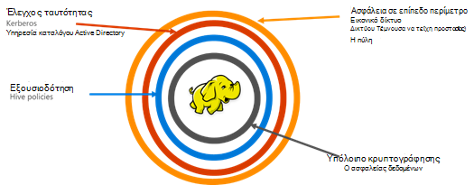

<properties
    pageTitle="Επισκόπηση HDInsight ασφαλούς | Microsoft Azure"
    description="Μάθετε..."
    services="hdinsight"
    documentationCenter=""
    authors="saurinsh"
    manager="jhubbard"
    editor="cgronlun"
    tags="azure-portal"/>

<tags
    ms.service="hdinsight"
    ms.devlang="na"
    ms.topic="hero-article"
    ms.tgt_pltfrm="na"
    ms.workload="big-data"
    ms.date="10/24/2016"
    ms.author="saurinsh"/>

# Παρουσιάστε τομέα HDInsight συμπλεγμάτων (έκδοση Preview)

Azure HDInsight μέχρι σήμερα, υποστηρίζεται μόνο ένα μεμονωμένο χρήστη τοπικού διαχειριστή. Αυτό χρησιμοποιήσατε Εξαιρετικός για μικρότερες ομάδες εφαρμογής ή τμήματα. Καθώς Hadoop με βάση φόρτους εργασίας που αποκτήθηκε περισσότερες δημοτικότητας στον τομέα της εταιρείας, την ανάγκη για μεγάλες επιχειρήσεις βαθμού δυνατότητες όπως η υπηρεσία καταλόγου active directory με βάση τον έλεγχο ταυτότητας, υποστήριξη πολλών χρηστών και έλεγχος πρόσβασης βάσει ρόλων γίνεται αυξανόμενη σημαντικές. Χρησιμοποιώντας συμπλεγμάτων HDInsight τομέα, μπορείτε να δημιουργήσετε ένα σύμπλεγμα HDInsight συνδεθεί σε έναν τομέα της υπηρεσίας καταλόγου Active Directory, να ρυθμίσετε τις παραμέτρους μιας λίστας των υπαλλήλων από το εταιρικό ποιος μπορεί να εκτελέσει έλεγχο ταυτότητας μέσω Azure Active Directory για να συνδεθείτε στο σύμπλεγμα HDInsight. Οποιονδήποτε εκτός της εταιρείας δεν είναι δυνατό να συνδεθείτε ή να αποκτούν πρόσβαση στο σύμπλεγμα HDInsight. Ο διαχειριστής εταιρείας μπορεί να ρυθμίσει τον έλεγχο πρόσβασης βάσει ρόλων για ομάδα ασφαλείας με χρήση [Τζακ Apache](http://hortonworks.com/apache/ranger/), επομένως, ο περιορισμός πρόσβασης στα δεδομένα μόνο ό, τι χρειάζεται για να. Τέλος, ο διαχειριστής μπορεί να ελέγχετε την πρόσβαση σε δεδομένα από υπαλλήλους και τυχόν αλλαγές που πραγματοποιήθηκαν για τις πολιτικές ελέγχου πρόσβασης, την επίτευξη υψηλού βαθμού διακυβέρνηση της τους εταιρικούς πόρους.

[AZURE.NOTE]> Τις νέες δυνατότητες που περιγράφονται σε αυτήν την προεπισκόπηση είναι διαθέσιμες μόνο στην βάσει Linux HDInsight συμπλεγμάτων για ομάδα φόρτο εργασίας. Τα άλλα φόρτους εργασίας, όπως HBase, τους, καταιγίδας και Kafka, θα είναι ενεργοποιημένες σε μελλοντικές εκδόσεις. 

## Πλεονεκτήματα

Για μεγάλες επιχειρήσεις ασφαλείας περιέχει τέσσερις μεγάλο πυλώνες – περίμετρο ασφαλείας, ο έλεγχος ταυτότητας, εξουσιοδότηση και κρυπτογράφησης.

.

### Περίμετρος ασφαλείας

Ασφάλεια περίμετρο στο HDInsight είναι δυνατό χρησιμοποιώντας εικονικών δικτύων και υπηρεσία πύλης. Σήμερα, ένας διαχειριστής εταιρείας να δημιουργήσετε ένα σύμπλεγμα HDInsight μέσα σε ένα εικονικό δίκτυο και να χρησιμοποιούν τις ομάδες ασφαλείας δικτύου (κανόνες εισερχομένων ή εξερχομένων τείχους προστασίας) για να περιορίσετε την πρόσβαση στο δίκτυο εικονικού. Μόνο οι διευθύνσεις IP που ορίζονται στο τους κανόνες εισερχομένων του τείχους προστασίας θα μπορούν να επικοινωνούν με το σύμπλεγμα HDInsight, παρέχοντας έτσι περίμετρο ασφαλείας. Ένα άλλο επίπεδο ασφάλειας περίμετρο είναι δυνατό με υπηρεσία πύλης. Η πύλη είναι η υπηρεσία η οποία λειτουργεί ως πρώτη γραμμή άμυνας για τα εισερχόμενα αιτήματα στο σύμπλεγμα HDInsight. Το αποδέχεται το αίτημα, επικυρώσει το και μόνο, στη συνέχεια, επιτρέπει την αίτηση για τη μεταβίβαση σε άλλους κόμβους σύμπλεγμα, παρέχοντας έτσι περίμετρο ασφαλείας σε άλλο όνομα και τα δεδομένα τους κόμβους του συμπλέγματος.

### Έλεγχος ταυτότητας

Με αυτήν την προεπισκόπηση δημόσια, διαχειριστής εταιρείας μπορούν να προμηθεύσουν ένα σύμπλεγμα HDInsight τομέα, σε ένα [εικονικό δίκτυο](https://azure.microsoft.com/services/virtual-network/). Οι κόμβοι του συμπλέγματος HDInsight θα συμμετάσχετε στον τομέα που ελέγχονται από την επιχείρηση. Αυτό είναι δυνατό μέσω της χρήσης [Υπηρεσίες τομέα Active Directory Azure](https://technet.microsoft.com/library/cc770946.aspx). Όλους τους κόμβους του συμπλέγματος είστε συνδεδεμένοι σε έναν τομέα που διαχειρίζεται την επιχείρηση. Με αυτήν την εγκατάσταση των υπαλλήλων της εταιρείας να συνδεθείτε με τους κόμβους σύμπλεγμα χρησιμοποιώντας τα διαπιστευτήριά τους τομέα. Μπορούν επίσης να χρησιμοποιήσουν τα διαπιστευτήριά τους τομέα για τον έλεγχο ταυτότητας με άλλα εγκεκριμένα τελικά σημεία όπως απόχρωση, Ambari προβολές, ODBC, JDBC, PowerShell και REST API για να αλληλεπιδράσετε με το σύμπλεγμα. Ο διαχειριστής έχει τον πλήρη έλεγχο πάνω από τον περιορισμό του αριθμού των χρηστών αλληλεπίδραση με το σύμπλεγμα μέσω αυτά τα τελικά σημεία.

### Εξουσιοδότηση

Βέλτιστη πρακτική ακολουθούμενο από οι περισσότερες εταιρείες είναι ότι δεν κάθε υπαλλήλου έχει πρόσβαση σε όλους τους εταιρικούς πόρους. Παρομοίως, με αυτήν την έκδοση, ο διαχειριστής μπορεί να Ορισμός πολιτικών του ελέγχου πρόσβασης βάσει ρόλων για τους πόρους συμπλέγματος. Για παράδειγμα, ο διαχειριστής μπορεί να ρυθμίσετε τις παραμέτρους [Apache Τζακ](http://hortonworks.com/apache/ranger/) για να ορίσετε πολιτικών του ελέγχου πρόσβασης για ομάδα. Αυτή η λειτουργία εξασφαλίζει ότι θα μπορούν να έχουν πρόσβαση μόνο τους υπαλλήλους όσα δεδομένα πρέπει να είναι επιτυχής σε εργασίες τους. Πρόσβαση στο σύμπλεγμα SSH επίσης είναι περιορισμένη μόνο για το διαχειριστή.

### Έλεγχος

Μαζί με την προστασία τους πόρους συμπλέγματος HDInsight από μη εξουσιοδοτημένων χρηστών και διασφάλιση των δεδομένων, τον έλεγχο της πρόσβασης όλες οι πόροι συμπλέγματος και τα δεδομένα είναι απαραίτητο για την παρακολούθηση μη εξουσιοδοτημένη ή αθέλητο πρόσβαση από τους πόρους. Με αυτήν την προεπισκόπηση, ο διαχειριστής μπορεί να προβάλετε και να αναφέρετε όλη την πρόσβαση στους πόρους σύμπλεγμα HDInsight και δεδομένων. Ο διαχειριστής μπορεί να επίσης να προβάλετε και να αναφέρετε όλων των αλλαγών για τις πολιτικές ελέγχου πρόσβασης κάνει στο Τζακ Apache υποστηρίζονται τα τελικά σημεία. Ένα σύμπλεγμα τομέα HDInsight χρησιμοποιεί το οικείο περιβάλλον Εργασίας Τζακ Apache για να πραγματοποιήσετε αναζήτηση αρχείων καταγραφής ελέγχου. Στον υπολογιστή στο παρασκήνιο, Τζακ χρησιμοποιεί [Apache Solr]( http://hortonworks.com/apache/solr/) για την αποθήκευση και την αναζήτηση των αρχείων καταγραφής.

### Κρυπτογράφηση

Προστασία δεδομένων είναι σημαντικό για την ασφάλεια εταιρικό σύσκεψης και απαιτήσεις συμμόρφωσης και μαζί με περιορισμός πρόσβασης στα δεδομένα από μη εξουσιοδοτημένα τους υπαλλήλους, αυτό πρέπει επίσης να διασφαλιστεί, κρυπτογραφώντας την. Το αποθηκεύει δεδομένα για συμπλεγμάτων, Azure χώρο αποθήκευσης Blob και αποθήκευσης λίμνης δεδομένων Azure HDInsight υποστηρίζει διαφανή διακομιστή [κρυπτογράφησης των δεδομένων](../storage/storage-service-encryption.md) στο υπόλοιπο. Ασφαλής HDInsight συμπλεγμάτων απρόσκοπτα θα λειτουργεί με αυτό κρυπτογράφηση πλευρά του διακομιστή των δεδομένων στο υπόλοιπο δυνατότητα.

## Επόμενα βήματα

- Για τη ρύθμιση των παραμέτρων ενός συμπλέγματος τομέα HDInsight, ανατρέξτε στο θέμα [Ρύθμιση παραμέτρων του τομέα HDInsight συμπλεγμάτων](hdinsight-domain-joined-configure.md).
- Για τη διαχείριση ενός συμπλεγμάτων τομέα HDInsight, ανατρέξτε στο θέμα [Διαχείριση τομέα HDInsight συμπλεγμάτων](hdinsight-domain-joined-manage.md).
- Για τη ρύθμιση παραμέτρων πολιτικών ομάδας και εκτέλεση ερωτημάτων Hive, ανατρέξτε στο θέμα [Ρύθμιση παραμέτρων Hive πολιτικών για συμπλεγμάτων τομέα HDInsight](hdinsight-domain-joined-run-hive.md).
- Για την εκτέλεση ερωτημάτων Hive με SSH στην συμπλεγμάτων τομέα HDInsight, ανατρέξτε στο θέμα [Χρήση SSH με βάσει Linux Hadoop σε HDInsight από Linux, Unix, ή OS X](hdinsight-hadoop-linux-use-ssh-unix.md#connect-to-a-domain-joined-hdinsight-cluster).