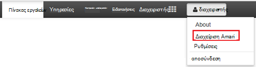

<properties
    pageTitle="Διαχείριση συμπλεγμάτων τομέα HDInsight | Microsoft Azure"
    description="Μάθετε πώς να διαχειρίζεστε τομέα HDInsight συμπλεγμάτων"
    services="hdinsight"
    documentationCenter=""
    authors="saurinsh"
    manager="jhubbard"
    editor="cgronlun"
    tags=""/>

<tags
    ms.service="hdinsight"
    ms.devlang="na"
    ms.topic="article"
    ms.tgt_pltfrm="na"
    ms.workload="big-data"
    ms.date="10/25/2016"
    ms.author="saurinsh"/>

# Διαχείριση τομέα HDInsight συμπλεγμάτων (έκδοση Preview)

Μάθετε τους χρήστες και τους ρόλους στο HDInsight τομέα και το πώς μπορείτε να διαχειριστείτε τομέα συμπλεγμάτων HDInsight.

## Οι χρήστες τομέα HDInsight συμπλεγμάτων

Ένα σύμπλεγμα HDInsight που δεν είναι συνδεδεμένος τομέα περιλαμβάνει δύο λογαριασμούς χρηστών που έχουν δημιουργηθεί κατά τη δημιουργία συμπλέγματος:

- **Διαχείριση Ambari**: Αυτός ο λογαριασμός είναι επίσης γνωστή ως *Hadoop* ή *χρήστης HTTP*. Αυτός ο λογαριασμός μπορεί να χρησιμοποιηθεί για να συνδεθείτε με Ambari στο https://&lt;clustername >. azurehdinsight.net. Μπορεί επίσης να χρησιμοποιηθεί για εκτέλεση ερωτημάτων σε Ambari προβολές, εκτελεί εργασίες μέσω εξωτερικά εργαλεία (π.χ., PowerShell, Templeton, Visual Studio) και τον έλεγχο ταυτότητας με το πρόγραμμα οδήγησης Hive ODBC και τα εργαλεία Επιχειρηματικής ευφυΐας (δηλαδή Excel, PowerBI ή Tableau).

- **SSH χρήστη**: Αυτός ο λογαριασμός μπορεί να χρησιμοποιηθεί με SSH και εκτέλεση εντολών sudo. Έχει ρίζα δικαιώματα για να του ΣΠΣ Linux.

Ένα σύμπλεγμα HDInsight τομέα έχει τρία τους νέους χρήστες εκτός από το διαχειριστή Ambari και SSH χρήστη.

- **Διαχείριση Τζακ**: Αυτός ο λογαριασμός υπάρχει λογαριασμού του τοπικού διαχειριστή Apache Τζακ. Δεν είναι ένας χρήστης τομέα της υπηρεσίας καταλόγου active directory. Αυτός ο λογαριασμός μπορεί να χρησιμοποιηθεί για ρύθμιση πολιτικών και να κάνετε άλλες διαχειριστές χρηστών ή πληρεξούσιων διαχειριστών (ώστε οι χρήστες να διαχειριστείτε πολιτικές). Από προεπιλογή, το όνομα χρήστη είναι *admin* και ο κωδικός πρόσβασης είναι ίδια με τον κωδικό πρόσβασης διαχειριστή Ambari. Ο κωδικός πρόσβασης μπορεί να ενημερωθεί από τη σελίδα ρυθμίσεων της Τζακ.

- **Σύμπλεγμα διαχείρισης τομέα χρήστη**: Αυτός ο λογαριασμός είναι ένας χρήστης του τομέα υπηρεσίας καταλόγου active directory που έχει οριστεί ως διαχειριστής συμπλέγματος του Hadoop, συμπεριλαμβανομένων των Ambari και Τζακ. Πρέπει να παρέχετε διαπιστευτήρια αυτού του χρήστη κατά τη δημιουργία συμπλέγματος. Αυτός ο χρήστης έχει τα ακόλουθα δικαιώματα:

    - Συμμετοχή σε υπολογιστές με τον τομέα και τοποθετήστε τα μέσα στην οργανική Μονάδα που καθορίζετε κατά τη δημιουργία συμπλέγματος.
    - Δημιουργία υπηρεσίας αρχές μέσα στην οργανική Μονάδα που καθορίζετε κατά τη δημιουργία συμπλέγματος. 
    - Δημιουργία αντίστροφη εγγραφές DNS.

    Σημείωση Οι άλλοι χρήστες AD έχουν επίσης αυτά τα δικαιώματα. 

    Υπάρχουν ορισμένα τελικά σημεία μέσα στο σύμπλεγμα (για παράδειγμα, Templeton) το οποίο δεν πραγματοποιείται από Τζακ και επομένως δεν είναι ασφαλείς. Αυτά τα τελικά σημεία είναι κλειδωμένη για όλους τους χρήστες εκτός από το χρήστη σύμπλεγμα διαχείρισης τομέα. 

- **Κανονική**: κατά τη δημιουργία συμπλέγματος, μπορείτε να παράσχετε πολλές ομάδες της υπηρεσίας καταλόγου active directory. Οι χρήστες σε αυτές τις ομάδες θα συγχρονίζονται Τζακ και Ambari. Αυτοί οι χρήστες είναι οι χρήστες του τομέα και θα έχει πρόσβαση μόνο Διαχείριση Τζακ τελικά σημεία (για παράδειγμα, Hiveserver2). Όλες τις πολιτικές RBAC και ελέγχου θα ισχύουν για αυτούς τους χρήστες.

## Ρόλοι τομέα HDInsight συμπλεγμάτων

HDInsight τομέα έχει τους εξής ρόλους:

- Διαχείριση συμπλέγματος
- Τελεστής συμπλέγματος
- Διαχειριστής υπηρεσίας
- Τελεστής υπηρεσίας
- Σύμπλεγμα χρήστη

**Για να δείτε τα δικαιώματα από αυτούς τους ρόλους**

1. Ανοίξτε τη Διαχείριση Ambari περιβάλλοντος εργασίας Χρήστη.  Ανατρέξτε στο θέμα [Άνοιγμα της διαχείρισης Ambari περιβάλλοντος εργασίας Χρήστη](#open-the-ambari-management-ui).
2. Από το αριστερό μενού, κάντε κλικ στην επιλογή **Ρόλοι**.
3. Κάντε κλικ στο μπλε ερωτηματικό για να δείτε τα δικαιώματα:

    

## Ανοίξτε τη Διαχείριση Ambari περιβάλλοντος εργασίας Χρήστη

1. Πραγματοποιήστε είσοδο [πύλη του Azure](https://portal.azure.com).
2. Ανοίξτε το σύμπλεγμά σας HDInsight σε μια blade. Ανατρέξτε στο θέμα [λίστα και εμφάνιση συμπλεγμάτων](hdinsight-administer-use-management-portal.md#list-and-show-clusters).
3. Κάντε κλικ στην επιλογή **Πίνακας εργαλείων** από το επάνω μενού για να ανοίξετε Ambari.
4. Συνδεθείτε στο Ambari χρησιμοποιώντας το όνομα χρήστη του συμπλέγματος διαχειριστή τομέα και τον κωδικό πρόσβασης.
5. Επιλέξτε το αναπτυσσόμενο μενού **διαχείρισης** από επάνω δεξιά γωνία και, στη συνέχεια, κάντε κλικ στην επιλογή **Διαχείριση Ambari**.

    

    Το περιβάλλον εργασίας Χρήστη έχει την παρακάτω:

    

## Λίστα με τους χρήστες του τομέα που συγχρονίζονται από την υπηρεσία καταλόγου Active Directory

1. Ανοίξτε τη Διαχείριση Ambari περιβάλλοντος εργασίας Χρήστη.  Ανατρέξτε στο θέμα [Άνοιγμα της διαχείρισης Ambari περιβάλλοντος εργασίας Χρήστη](#open-the-ambari-management-ui).
2. Από το αριστερό μενού, κάντε κλικ στην επιλογή **χρήστες**. Βλέπετε όλους τους χρήστες που έχουν συγχρονιστεί από την υπηρεσία καταλόγου Active Directory στο σύμπλεγμα HDInsight.

    

## Λίστα με τις ομάδες τομέα που συγχρονίζονται από την υπηρεσία καταλόγου Active Directory

1. Ανοίξτε τη Διαχείριση Ambari περιβάλλοντος εργασίας Χρήστη.  Ανατρέξτε στο θέμα [Άνοιγμα της διαχείρισης Ambari περιβάλλοντος εργασίας Χρήστη](#open-the-ambari-management-ui).
2. Από το αριστερό μενού, κάντε κλικ στην επιλογή **ομάδες**. Βλέπετε όλες τις ομάδες που συγχρονίζονται από την υπηρεσία καταλόγου Active Directory στο σύμπλεγμα HDInsight.

    

## Ρύθμιση παραμέτρων δικαιωμάτων ομάδας προβολές

1. Ανοίξτε τη Διαχείριση Ambari περιβάλλοντος εργασίας Χρήστη.  Ανατρέξτε στο θέμα [Άνοιγμα της διαχείρισης Ambari περιβάλλοντος εργασίας Χρήστη](#open-the-ambari-management-ui).
2. Από το αριστερό μενού, κάντε κλικ στην επιλογή " **προβολές**".
3. Κάντε κλικ στην επιλογή " **HIVE** " για να εμφανίσετε τις λεπτομέρειες.

    

4. Κάντε κλικ στη σύνδεση **Προβολή ομάδας** για να ρυθμίσετε τις παραμέτρους της ομάδας προβολές.
5. Κάντε κύλιση προς τα κάτω στην ενότητα **δικαιώματα** .

    

6. Κάντε κλικ στην επιλογή **Προσθήκη χρήστη** ή **Προσθήκη ομάδας**και, στη συνέχεια, καθορίστε τους χρήστες ή τις ομάδες που μπορούν να χρησιμοποιούν Hive προβολές. 

## Ρύθμιση χρηστών για τους ρόλους

 Για να δείτε μια λίστα με τους ρόλους και τα δικαιώματα, ανατρέξτε στο θέμα [συμπλεγμάτων HDInsight ρόλους του τομέα](#roles-of-domain---joined-hdinsight-clusters).

1. Ανοίξτε τη Διαχείριση Ambari περιβάλλοντος εργασίας Χρήστη.  Ανατρέξτε στο θέμα [Άνοιγμα της διαχείρισης Ambari περιβάλλοντος εργασίας Χρήστη](#open-the-ambari-management-ui).
2. Από το αριστερό μενού, κάντε κλικ στην επιλογή **Ρόλοι**.
3. Κάντε κλικ στην επιλογή **Προσθήκη χρήστη** ή **Προσθήκη ομάδας** για να εκχωρήσετε στους χρήστες και ομάδες για διαφορετικούς ρόλους.
 
## Επόμενα βήματα

- Για τη ρύθμιση των παραμέτρων ενός συμπλέγματος τομέα HDInsight, ανατρέξτε στο θέμα [Ρύθμιση παραμέτρων του τομέα HDInsight συμπλεγμάτων](hdinsight-domain-joined-configure.md).
- Για τη ρύθμιση παραμέτρων πολιτικών ομάδας και εκτέλεση ερωτημάτων Hive, ανατρέξτε στο θέμα [Ρύθμιση παραμέτρων Hive πολιτικών για συμπλεγμάτων τομέα HDInsight](hdinsight-domain-joined-run-hive.md).
- Για την εκτέλεση ερωτημάτων Hive με SSH στην συμπλεγμάτων τομέα HDInsight, ανατρέξτε στο θέμα [Χρήση SSH με βάσει Linux Hadoop σε HDInsight από Linux, Unix, ή OS X](hdinsight-hadoop-linux-use-ssh-unix.md#connect-to-a-domain-joined-hdinsight-cluster).
