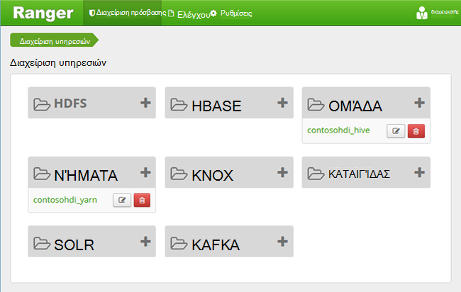
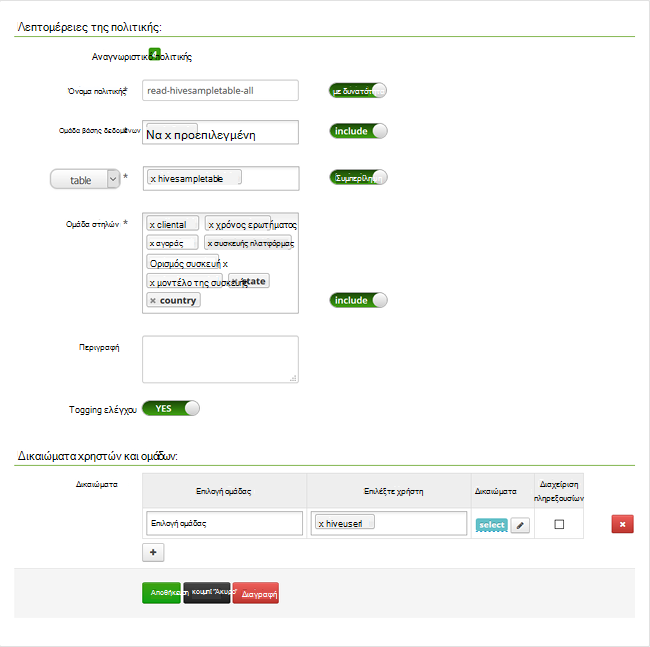

<properties
    pageTitle="Ρύθμιση παραμέτρων πολιτικών ομάδας στον τομέα HDInsight | Microsoft Azure"
    description="Μάθετε..."
    services="hdinsight"
    documentationCenter=""
    authors="saurinsh"
    manager="jhubbard"
    editor="cgronlun"
    tags="azure-portal"/>

<tags
    ms.service="hdinsight"
    ms.devlang="na"
    ms.topic="hero-article"
    ms.tgt_pltfrm="na"
    ms.workload="big-data"
    ms.date="10/25/2016"
    ms.author="saurinsh"/>

# Ρύθμιση παραμέτρων πολιτικών ομάδας στον τομέα HDInsight (έκδοση Preview)

Μάθετε πώς μπορείτε να ρυθμίσετε τις πολιτικές Apache Τζακ για ομάδα. Σε αυτό το άρθρο, μπορείτε να δημιουργήσετε δύο Τζακ πολιτικές για να περιορίσετε την πρόσβαση του hivesampletable. Το hivesampletable συνοδεύεται από συμπλεγμάτων HDInsight. Αφού έχετε ρυθμίσει τις παραμέτρους των πολιτικών, μπορείτε να χρησιμοποιήσετε το πρόγραμμα οδήγησης ODBC Excel και το για να συνδεθείτε με ομάδα πίνακες στο HDInsight.

## Προαπαιτούμενα στοιχεία

- Ένα σύμπλεγμα τομέα HDInsight. Ανατρέξτε στο θέμα [Ρύθμιση παραμέτρων του τομέα HDInsight συμπλεγμάτων](hdinsight-domain-joined-configure.md).
- Μια σταθμούς εργασίας με το Office 2016, Office 2013 Professional Plus, Office 365 Pro Plus, αυτόνομη έκδοση του Excel 2013 ή Office 2010 Professional Plus.

## Σύνδεση με Apache Τζακ διαχείρισης περιβάλλοντος εργασίας Χρήστη

**Για να συνδεθείτε στο περιβάλλον εργασίας Χρήστη του Τζακ διαχείρισης**

1. Από ένα πρόγραμμα περιήγησης, συνδεθείτε Τζακ διαχείρισης UI. Η διεύθυνση URL είναι https://&lt;ClusterName >.azurehdinsight.net/Ranger/. 

    >[AZURE.NOTE] Τζακ χρησιμοποιεί διαφορετικό διαπιστευτήρια από εκείνα του συμπλέγματος Hadoop. Για να αποτρέψετε προγράμματα περιήγησης χρησιμοποιώντας τα διαπιστευτήρια στο cache Hadoop, χρησιμοποιήστε το νέο παράθυρο περιήγησης inprivate για να συνδεθείτε στο περιβάλλον εργασίας Χρήστη του Τζακ διαχείρισης.
4. Συνδεθείτε χρησιμοποιώντας το όνομα τομέα σύμπλεγμα διαχειριστή και τον κωδικό πρόσβασης:

    

    Προς το παρόν, Τζακ λειτουργεί μόνο με νήματα και ομάδα.

## Δημιουργία χρηστών τομέα

Στη [Ρύθμιση παραμέτρων του τομέα HDInsight συμπλεγμάτων](hdinsight-domain-joined-configure.md#create-and-configure-azure-ad-ds-for-your-azure-ad), έχετε δημιουργήσει hiveruser1 και hiveuser2. Θα χρησιμοποιήσετε το λογαριασμό χρήστη δύο σε αυτό το πρόγραμμα εκμάθησης.

## Δημιουργία πολιτικών Τζακ

Σε αυτήν την ενότητα, θα δημιουργήσετε δύο Τζακ πολιτικές για την πρόσβαση σε hivesampletable. Μπορείτε να δώσετε δικαιώματα επιλογή σε διαφορετικό σύνολο των στηλών. Και οι δύο χρήστες έχουν δημιουργηθεί στο [συμπλεγμάτων HDInsight ρύθμιση παραμέτρων του τομέα](hdinsight-domain-joined-configure.md#create-and-configure-azure-ad-ds-for-your-azure-ad).  Στην επόμενη ενότητα, θα μπορείτε να ελέγξετε τις δύο πολιτικές στο Excel.

**Για να δημιουργήσετε πολιτικές Τζακ**

1. Ανοίξτε το περιβάλλον εργασίας Χρήστη του Τζακ διαχείρισης. Ανατρέξτε στο θέμα [σύνδεση σε Apache Τζακ διαχείρισης περιβάλλοντος εργασίας Χρήστη](#connect-to-apache-ranager-admin-ui).
2. Κάντε κλικ στην επιλογή ** &lt;ClusterName > _hive**, κάτω από **την ομάδα**. Θα δείτε δύο προ-ρύθμιση παραμέτρων πολιτικών.
3. Κάντε κλικ στην επιλογή **Προσθήκη νέας πολιτικής**και, στη συνέχεια, πληκτρολογήστε τις παρακάτω τιμές:

    - Όνομα πολιτικής: ανάγνωση-hivesampletable-όλα
    - Hive βάσης δεδομένων: προεπιλογή
    - Πίνακας: hivesampletable
    - Ομάδα στηλών: *
    - Επιλέξτε χρήστη: hiveuser1
    - Δικαιώματα: Επιλέξτε

    .

    >[AZURE.NOTE] Εάν ένας χρήστης τομέα δεν συμπληρώνεται στην επιλογή χρήστη, περιμένετε λίγα λεπτά για Τζακ για συγχρονισμό με AAD.

4. Κάντε κλικ στο κουμπί **Προσθήκη** για να αποθηκεύσετε την πολιτική.
5. Επαναλάβετε τα τελευταία δύο βήματα για να δημιουργήσετε μια άλλη πολιτική με τις ακόλουθες ιδιότητες:

    - Όνομα πολιτικής: ανάγνωση-hivesampletable-devicemake
    - Hive βάσης δεδομένων: προεπιλογή
    - Πίνακας: hivesampletable
    - Ομάδα στηλών: clientid, devicemake
    - Επιλέξτε χρήστη: hiveuser2
    - Δικαιώματα: Επιλέξτε

## Δημιουργία προέλευσης δεδομένων Hive ODBC

Μπορείτε να βρείτε τις οδηγίες στο [αρχείο προέλευσης δεδομένων ODBC Hive δημιουργία](hdinsight-connect-excel-hive-odbc-driver.md).  

    Ιδιότητα|Περιγραφή
    ---|---
    Όνομα της προέλευσης δεδομένων|Δώστε ένα όνομα στο αρχείο προέλευσης δεδομένων
    Κεντρικός υπολογιστής|Πληκτρολογήστε &lt;HDInsightClusterName >. azurehdinsight.net. Για παράδειγμα, myHDICluster.azurehdinsight.net
    Θύρα|Χρησιμοποιήστε <strong>443</strong>. (Αυτή η θύρα έχει αλλάξει από 563 σε 443.)
    Βάση δεδομένων|Χρησιμοποιήστε την <strong>προεπιλεγμένη</strong>.
    Τύπος διακομιστή ομάδας|Επιλέξτε <strong>την ομάδα διακομιστή 2</strong>
    Μηχανισμός|Επιλέξτε την <strong>Υπηρεσία Azure HDInsight</strong>
    Διαδρομή HTTP|Αφήστε κενό.
    Όνομα χρήστη|Πληκτρολογήστε hiveuser1@contoso158.onmicrosoft.com. Ενημερώστε το όνομα του τομέα, εάν είναι διαφορετικό.
    Κωδικός πρόσβασης|Πληκτρολογήστε τον κωδικό πρόσβασης για hiveuser1.
    </table>

Φροντίστε να κάντε κλικ στην επιλογή **Δοκιμή** πριν να αποθηκεύσετε το αρχείο προέλευσης δεδομένων.

##Εισαγωγή δεδομένων στο Excel από το HDInsight

Στην ενότητα τελευταία, έχετε ρυθμίσει δύο πολιτικές.  hiveuser1 διαθέτει την επιλογή δικαιωμάτων σε όλες τις στήλες και hiveuser2 έχει το δικαίωμα επιλογής σε δύο στήλες. Σε αυτήν την ενότητα, απομίμηση οι δύο χρήστες για να εισαγάγετε δεδομένα στο Excel.

1. Ανοίξτε ένα νέο ή υπάρχον βιβλίο εργασίας στο Excel.
2. Από την καρτέλα **δεδομένα** , κάντε κλικ στην επιλογή **Από άλλες προελεύσεις δεδομένων**και, στη συνέχεια, κάντε κλικ στην επιλογή **Από Οδηγό σύνδεσης δεδομένων** για να ξεκινήσετε τον **Οδηγό σύνδεσης δεδομένων**.

    ! [Οδηγό σύνδεσης δεδομένων open] [img-hdi-simbahiveodbc.excel.dataconnection]

3. Επιλέξτε **ODBC DSN** ως προέλευση δεδομένων και, στη συνέχεια, κάντε κλικ στο κουμπί **Επόμενο**.
4. Από προελεύσεις δεδομένων ODBC, επιλέξτε το όνομα της προέλευσης δεδομένων που δημιουργήσατε στο προηγούμενο βήμα και, στη συνέχεια, κάντε κλικ στο κουμπί **Επόμενο**.
5. Πληκτρολογήστε ξανά τον κωδικό πρόσβασης για το σύμπλεγμα στον οδηγό και, στη συνέχεια, κάντε κλικ στο κουμπί **OK**. Περιμένετε για το παράθυρο διαλόγου **Επιλογή βάσης δεδομένων και πίνακα** για να το ανοίξετε. Αυτό μπορεί να χρειαστούν μερικά δευτερόλεπτα.
8. Επιλέξτε **hivesampletable**και, στη συνέχεια, κάντε κλικ στο κουμπί **Επόμενο**. 
8. Κάντε κλικ στο κουμπί **Τέλος**.
9. Στο παράθυρο διαλόγου **Εισαγωγή δεδομένων** , μπορείτε να αλλάξετε ή να καθορίσετε το ερώτημα. Για να το κάνετε αυτό, κάντε κλικ στην επιλογή **Ιδιότητες**. Αυτό μπορεί να χρειαστούν μερικά δευτερόλεπτα. 
10. Κάντε κλικ στην καρτέλα " **Ορισμός** ". Το κείμενο της εντολής είναι:

        SELECT * FROM "HIVE"."default"."hivesampletable"

    Με τις πολιτικές Τζακ που ορίσατε, hiveuser1 έχει δικαίωμα επιλέξτε όλες τις στήλες.  Επομένως, αυτό το ερώτημα λειτουργεί με τα διαπιστευτήρια του hiveuser1, αλλά αυτό το ερώτημα δεν δεν λειτουργεί με τα διαπιστευτήρια του hiveuser2.

    ! [Ιδιότητες σύνδεσης] [img-hdi-simbahiveodbc-του excel-connectionproperties]

11. Κάντε κλικ στο **κουμπί OK** για να κλείσετε το παράθυρο διαλόγου Ιδιότητες σύνδεσης.
12. Κάντε κλικ στο **κουμπί OK** για να κλείσετε το παράθυρο διαλόγου **Εισαγωγή δεδομένων** .  
13. Πληκτρολογήστε ξανά τον κωδικό πρόσβασης για hiveuser1 και, στη συνέχεια, κάντε κλικ στο κουμπί **OK**. Χρειάζονται μερικά δευτερόλεπτα πριν λαμβάνει εισαγωγή δεδομένων στο Excel. Όταν ολοκληρωθεί, θα βλέπετε 11 στήλες δεδομένων.

Για να ελέγξετε την πολιτική δεύτερο (ανάγνωση-hivesampletable-devicemake) που δημιουργήσατε στην τελευταία ενότητα

1. Προσθέστε ένα νέο φύλλο εργασίας στο Excel.
2. Ακολουθήστε την τελευταία διαδικασία για να εισαγάγετε τα δεδομένα.  Η μόνη αλλαγή που πρόκειται να κάνετε είναι να χρησιμοποιήσετε τα διαπιστευτήρια του hiveuser2 αντί του hiveuser1. Αυτό θα αποτύχει επειδή hiveuser2 έχει μόνο δικαίωμα προβολής δύο στήλες. Λαμβάνετε το ακόλουθο σφάλμα:

        [Microsoft][HiveODBC] (35) Error from Hive: error code: '40000' error message: 'Error while compiling statement: FAILED: HiveAccessControlException Permission denied: user [hiveuser2] does not have [SELECT] privilege on [default/hivesampletable/clientid,country ...]'.

3. Ακολουθήστε την ίδια διαδικασία για την εισαγωγή δεδομένων. Αυτήν τη φορά, χρησιμοποιήστε τα διαπιστευτήρια του hiveuser2 και επίσης τροποποίηση της πρότασης select από:

        SELECT * FROM "HIVE"."default"."hivesampletable"

    Για να:

        SELECT clientid, devicemake FROM "HIVE"."default"."hivesampletable"

    Όταν γίνεται, θα βλέπετε δύο στήλες δεδομένων που έχουν εισαχθεί.

## Επόμενα βήματα

- Για τη ρύθμιση των παραμέτρων ενός συμπλέγματος τομέα HDInsight, ανατρέξτε στο θέμα [Ρύθμιση παραμέτρων του τομέα HDInsight συμπλεγμάτων](hdinsight-domain-joined-configure.md).
- Για τη διαχείριση ενός συμπλεγμάτων τομέα HDInsight, ανατρέξτε στο θέμα [Διαχείριση τομέα HDInsight συμπλεγμάτων](hdinsight-domain-joined-manage.md).
- Για την εκτέλεση ερωτημάτων Hive με SSH στην συμπλεγμάτων τομέα HDInsight, ανατρέξτε στο θέμα [Χρήση SSH με βάσει Linux Hadoop σε HDInsight από Linux, Unix, ή OS X](hdinsight-hadoop-linux-use-ssh-unix.md#connect-to-a-domain-joined-hdinsight-cluster).
- Για τη σύνδεση Hive χρησιμοποιώντας Hive JDBC, ανατρέξτε στο θέμα [σύνδεση σε ομάδα στο Azure HDInsight χρησιμοποιώντας το πρόγραμμα οδήγησης Hive JDBC](hdinsight-connect-hive-jdbc-driver.md)
- Για τη σύνδεση του Excel με χρήση Hive ODBC Hadoop, ανατρέξτε στο θέμα [Σύνδεσης του Excel στο Hadoop με τη μονάδα δίσκου Microsoft Hive ODBC](hdinsight-connect-excel-hive-odbc-driver.md)
- Για τη σύνδεση του Excel στο Hadoop χρησιμοποιώντας το Power Query, ανατρέξτε στο θέμα [Σύνδεσης του Excel στο Hadoop με χρήση του Power Query](hdinsight-connect-excel-power-query.md)