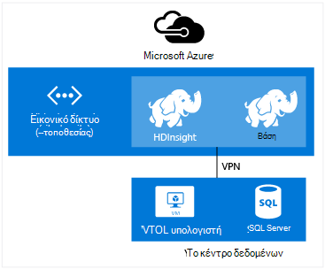

<properties
    pageTitle="Επέκταση HDInsight με το εικονικό δίκτυο | Microsoft Azure"  
    description="Μάθετε πώς μπορείτε να χρησιμοποιήσετε Azure εικονικού δικτύου για να συνδεθείτε HDInsight άλλους πόρους cloud ή πόρους στο κέντρο δεδομένων σας"
    services="hdinsight"
    documentationCenter=""
    authors="Blackmist"
    manager="jhubbard"
    editor="cgronlun"/>

<tags
   ms.service="hdinsight"
   ms.devlang="na"
   ms.topic="article"
   ms.tgt_pltfrm="na"
   ms.workload="big-data"
   ms.date="10/21/2016"
   ms.author="larryfr"/>


#<a name="extend-hdinsight-capabilities-by-using-azure-virtual-network"></a>Επέκταση δυνατότητες HDInsight, χρησιμοποιώντας Azure εικονικού δικτύου

Azure εικονικού δικτύου σάς επιτρέπει να επεκτείνετε τις λύσεις Hadoop για να ενσωματώσετε πόρους εσωτερικής εγκατάστασης, όπως ο SQL Server, να συνδυάσετε πολλούς τύπους σύμπλεγμα HDInsight ή για τη δημιουργία ασφαλούς ιδιωτικών δικτύων μεταξύ τους πόρους στο cloud.

[AZURE.INCLUDE [upgrade-powershell](../../includes/hdinsight-use-latest-powershell-and-cli.md)]


##<a id="whatis"></a>Τι είναι το Azure εικονικού δικτύου;

[Azure εικονικού δικτύου](https://azure.microsoft.com/documentation/services/virtual-network/) σάς επιτρέπει να δημιουργήσετε ένα ασφαλές, μόνιμη δίκτυο που περιέχει τους πόρους που χρειάζεστε για τη λύση. Ένα εικονικό δίκτυο σας επιτρέπει να:

* Συνδέστε τους πόρους cloud μαζί σε ένα ιδιωτικό δίκτυο (μόνο στο cloud).

    

    Χρήση εικονικού δικτύου για να συνδέσετε Azure υπηρεσίες με Azure HDInsight επιτρέπει τα ακόλουθα σενάρια:

    * **Κλήση HDInsight υπηρεσιών ή εργασίες** από τοποθεσίες Web Azure ή υπηρεσίες που εκτελούνται σε εικονικές μηχανές Windows Azure.

    * **Απευθείας τη μεταφορά δεδομένων** μεταξύ HDInsight και βάση δεδομένων SQL Azure, SQL Server ή άλλη λύση αποθήκευσης δεδομένων εκτελείται σε μια εικονική μηχανή.

    * **Συνδυασμός πολλών HDInsight διακομιστές** σε μια λύση. HDInsight συμπλεγμάτων παραδίδεται με διάφορους τύπους, οι οποίοι αντιστοιχούν σε το φόρτο εργασίας ή την τεχνολογία που ρυθμίζεται για το σύμπλεγμα. Δεν υπάρχει υποστηριζόμενη μέθοδος για να δημιουργήσετε ένα σύμπλεγμα που συνδυάζει πολλούς τύπους, όπως καταιγίδας και HBase σε ένα σύμπλεγμα. Χρήση ένα εικονικό δίκτυο επιτρέπει πολλών συμπλεγμάτων για να επικοινωνήσετε απευθείας με μεταξύ τους.

* Συνδέστε τους πόρους σας cloud με το δίκτυό σας τοπικό Κέντρο δεδομένων (--τοποθεσίας ή σημείου σε τοποθεσία) με τη χρήση ενός εικονικού ιδιωτικού δικτύου (VPN).

    Ρύθμιση παραμέτρων-τοποθεσίας σάς επιτρέπει να συνδεθείτε πολλούς πόρους από το κέντρο δεδομένων του Azure εικονικού δικτύου, χρησιμοποιώντας ένα VPN υλικού ή με την υπηρεσία δρομολόγησης και απομακρυσμένης πρόσβασης.

    

    Ρύθμιση παραμέτρων σημείου σε τοποθεσία σάς επιτρέπει να συνδεθείτε ενός συγκεκριμένου πόρου το Azure εικονικού δικτύου, χρησιμοποιώντας λογισμικό VPN.

    

    Χρήση εικονικού δικτύου για σύνδεση στο cloud και το κέντρο δεδομένων επιτρέπει σενάρια παρόμοια με τη ρύθμιση παραμέτρων μόνο στο cloud. Όμως, αντί να περιορίζεται σε εργασία με πόρους στο cloud, μπορείτε επίσης να εργαστείτε με τους πόρους στο κέντρο δεδομένων σας.

    * **Απευθείας τη μεταφορά δεδομένων** μεταξύ HDInsight και του κέντρου δεδομένων. Παράδειγμα χρησιμοποιεί Sqoop για τη μεταφορά δεδομένων σε ή από SQL Server ή την ανάγνωση δεδομένων που δημιουργούνται από μια εφαρμογή γραμμής εταιρικά (LOB).

    * **Κλήση HDInsight υπηρεσιών ή εργασίες** από μια εφαρμογή LOB. Παράδειγμα χρησιμοποιεί HBase Java APIs για την αποθήκευση και ανάκτηση δεδομένων από ένα σύμπλεγμα HDInsight HBase.

Για περισσότερες πληροφορίες σχετικά με δυνατότητες εικονικού δικτύου, πλεονεκτήματα και δυνατότητες, ανατρέξτε στο θέμα η [Επισκόπηση Azure εικονικού δικτύου](../virtual-network/virtual-networks-overview.md).

> [AZURE.NOTE] Πρέπει να δημιουργήσετε το εικονικό δίκτυο Azure πριν από την προμήθεια ένα σύμπλεγμα HDInsight. Για περισσότερες πληροφορίες, ανατρέξτε στο θέμα [εργασίες ρύθμισης παραμέτρων εικονικού δικτύου](https://azure.microsoft.com/documentation/services/virtual-network/).

## <a name="virtual-network-requirements"></a>Εικονικό τις απαιτήσεις του δικτύου

> [AZURE.IMPORTANT] Δημιουργία ένα σύμπλεγμα HDInsight εικονικού δικτύου απαιτεί συγκεκριμένο διαμορφώσεις εικονικού δικτύου, που περιγράφονται σε αυτήν την ενότητα.

###<a name="location-based-virtual-networks"></a>Εικονική δίκτυα που βασίζονται σε θέση

Azure HDInsight υποστηρίζει μόνο βάσει θέση εικονικού δίκτυα και αυτήν τη στιγμή δεν λειτουργεί με εικονικού δίκτυα που βασίζονται σε ομάδα συσχέτισης.

###<a name="classic-or-v2-virtual-network"></a>Κλασική ή v2 εικονικού δικτύου

Συμπλεγμάτων που βασίζεται σε Windows απαιτούν δίκτυο εικονικού κλασική, ενώ βάσει Linux συμπλεγμάτων απαιτούν δίκτυο εικονικού Azure διαχείριση πόρων. Εάν δεν έχετε το σωστό τύπο δικτύου, αυτό δεν θα μπορεί να χρησιμοποιηθεί κατά τη δημιουργία του συμπλέγματος.

Εάν έχετε πόρων σε ένα εικονικό δίκτυο που δεν μπορεί να χρησιμοποιηθεί από το σύμπλεγμα σκοπεύετε σχετικά με τη δημιουργία, μπορείτε να δημιουργήσετε ένα νέο εικονικό δίκτυο που μπορεί να χρησιμοποιηθεί από το σύμπλεγμα, και συνδέστε τη με το συμβατό εικονικό δίκτυο. Στη συνέχεια, μπορείτε να δημιουργήσετε το σύμπλεγμα στην έκδοση δικτύου που απαιτεί και αυτό θα μπορούν να τους πόρους πρόσβαση στο δίκτυο άλλων δεδομένου ότι είναι συνδεδεμένα τα δύο. Για περισσότερες πληροφορίες σχετικά με τη σύνδεση κλασική και το νέο εικονικό δίκτυα, ανατρέξτε στο θέμα [σύνδεση κλασική VNets σε νέα VNets](../vpn-gateway/vpn-gateway-connect-different-deployment-models-portal.md).

###<a name="custom-dns"></a>Προσαρμοσμένη DNS

Κατά τη δημιουργία ενός εικονικού δικτύου, Azure παρέχει επίλυση ονομάτων προεπιλογή για Azure υπηρεσίες όπως το HDInsight που είναι εγκατεστημένες στο δίκτυο. Ωστόσο, ίσως χρειαστεί να χρησιμοποιήσετε τη δική σας συστήματος ονομάτων τομέα (DNS) για περιπτώσεις όπως διασταύρωσης ανάλυση ονόματος τομέα του δικτύου. Για παράδειγμα, κατά την επικοινωνία μεταξύ των υπηρεσιών που βρίσκεται σε δύο συνδεδεμένα εικονικού δίκτυα. HDInsight υποστηρίζει τόσο την προεπιλεγμένη ανάλυση Azure όνομα, καθώς και προσαρμοσμένες DNS όταν χρησιμοποιείται με Azure εικονικού δικτύου.

Για περισσότερες πληροφορίες σχετικά με τη χρήση του δικού σας διακομιστή DNS με Azure εικονικού δικτύου, ανατρέξτε στην ενότητα __επίλυση ονομάτων χρησιμοποιώντας το δικό σας διακομιστή DNS__ του εγγράφου [Επίλυση ονομάτων για ΣΠΣ και παρουσίες ρόλο](../virtual-network/virtual-networks-name-resolution-for-vms-and-role-instances.md#name-resolution-using-your-own-dns-server) .

###<a name="secured-virtual-networks"></a>Ασφαλές εικονικών δικτύων

Η υπηρεσία HDInsight είναι μια διαχειριζόμενη υπηρεσία και απαιτεί πρόσβαση στο Internet, κατά την προμήθεια και κατά την εκτέλεση. Αυτό είναι, ώστε να Azure που μπορεί να παρακολουθεί την εύρυθμη λειτουργία του συμπλέγματος, προετοιμασία ανακατεύθυνσης συμπλέγματος πόρων, αλλάξτε τον αριθμό των κόμβοι στο σύμπλεγμα μέσω κλίμακας λειτουργίες και άλλες εργασίες διαχείρισης.

Εάν πρέπει να εγκαταστήσετε το HDInsight σε μια ασφαλή εικονικού δικτύου, πρέπει να επιτρέψετε εισερχόμενης πρόσβασης μέσω της θύρας 443 για τις παρακάτω διευθύνσεις IP, που επιτρέπουν Azure για τη διαχείριση του συμπλέγματος HDInsight.

* 168.61.49.99
* 23.99.5.239
* 168.61.48.131
* 138.91.141.162

Επιτρέπει την εισερχόμενη πρόσβαση από θύρα 443 για αυτές τις διευθύνσεις θα σας επιτρέψει να εγκαταστήσετε με επιτυχία το HDInsight σε μια ασφαλή εικονικού δικτύου.

> [AZURE.IMPORTANT] HDInsight δεν υποστηρίζει τον περιορισμό εξερχόμενη κυκλοφορία, μόνο σε εισερχόμενη κυκλοφορία. Κατά τον ορισμό κανόνων ομάδα ασφαλείας δικτύου για το υποδίκτυο που περιέχει HDInsight, χρησιμοποιήστε μόνο κανόνες εισερχομένων.

Τα παρακάτω παραδείγματα δείχνουν πώς μπορείτε να δημιουργήσετε μια νέα ομάδα ασφαλείας δικτύου που επιτρέπει τις απαιτούμενες διευθύνσεις και ισχύει την ομάδα ασφαλείας με ένα δευτερεύον εικονικό δίκτυο σας. Αυτά τα βήματα θεωρείται ότι έχετε ήδη δημιουργήσει ένα εικονικού δικτύου και το δευτερεύον που θέλετε να εγκαταστήσετε το HDInsight σε.

__Χρήση του Azure PowerShell__

    $vnetName = "Replace with your virtual network name"
    $resourceGroupName = "Replace with the resource group the virtual network is in"
    $subnetName = "Replace with the name of the subnet that HDInsight will be installed into"
    # Get the Virtual Network object
    $vnet = Get-AzureRmVirtualNetwork `
        -Name $vnetName `
        -ResourceGroupName $resourceGroupName
    # Get the region the Virtual network is in.
    $location = $vnet.Location
    # Get the subnet object
    $subnet = $vnet.Subnets | Where-Object Name -eq $subnetName
    # Create a new Network Security Group.
    # And add exemptions for the HDInsight health and management services.
    $nsg = New-AzureRmNetworkSecurityGroup `
        -Name "hdisecure" `
        -ResourceGroupName $resourceGroupName `
        -Location $location `
        | Add-AzureRmNetworkSecurityRuleConfig `
            -name "hdirule1" `
            -Description "HDI health and management address 168.61.49.99" `
            -Protocol "*" `
            -SourcePortRange "*" `
            -DestinationPortRange "443" `
            -SourceAddressPrefix "168.61.49.99" `
            -DestinationAddressPrefix "VirtualNetwork" `
            -Access Allow `
            -Priority 300 `
            -Direction Inbound `
        | Add-AzureRmNetworkSecurityRuleConfig `
            -Name "hdirule2" `
            -Description "HDI health and management 23.99.5.239" `
            -Protocol "*" `
            -SourcePortRange "*" `
            -DestinationPortRange "443" `
            -SourceAddressPrefix "23.99.5.239" `
            -DestinationAddressPrefix "VirtualNetwork" `
            -Access Allow `
            -Priority 301 `
            -Direction Inbound `
        | Add-AzureRmNetworkSecurityRuleConfig `
            -Name "hdirule3" `
            -Description "HDI health and management 168.61.48.131" `
            -Protocol "*" `
            -SourcePortRange "*" `
            -DestinationPortRange "443" `
            -SourceAddressPrefix "168.61.48.131" `
            -DestinationAddressPrefix "VirtualNetwork" `
            -Access Allow `
            -Priority 302 `
            -Direction Inbound `
        | Add-AzureRmNetworkSecurityRuleConfig `
            -Name "hdirule4" `
            -Description "HDI health and management 138.91.141.162" `
            -Protocol "*" `
            -SourcePortRange "*" `
            -DestinationPortRange "443" `
            -SourceAddressPrefix "138.91.141.162" `
            -DestinationAddressPrefix "VirtualNetwork" `
            -Access Allow `
            -Priority 303 `
            -Direction Inbound
    # Set the changes to the security group
    Set-AzureRmNetworkSecurityGroup -NetworkSecurityGroup $nsg
    # Apply the NSG to the subnet
    Set-AzureRmVirtualNetworkSubnetConfig `
        -VirtualNetwork $vnet `
        -Name $subnetName `
        -AddressPrefix $subnet.AddressPrefix `
        -NetworkSecurityGroupId $nsg

__Χρήση του Azure CLI__

1. Χρησιμοποιήστε την παρακάτω εντολή για να δημιουργήσετε μια νέα ομάδα ασφαλείας δίκτυο με το όνομα `hdisecure`. Αντικαταστήστε __RESOURCEGROUPNAME__ και τη __ΘΈΣΗ__ με την ομάδα πόρων που περιέχει το εικονικό δίκτυο Azure και την τοποθεσία (περιοχή), που δημιουργήθηκε με την ομάδα.

        azure network nsg create RESOURCEGROUPNAME hdisecure LOCATION
    
    Μετά τη δημιουργία της ομάδας, θα λάβετε πληροφορίες σχετικά με τη νέα ομάδα. Αναζητήστε μια παρόμοια με την ακόλουθη γραμμή και αποθηκεύστε το `/subscriptions/GUID/resourceGroups/RESOURCEGROUPNAME/providers/Microsoft.Network/networkSecurityGroups/hdisecure` πληροφορίες. Θα χρησιμοποιηθεί σε ένα επόμενο βήμα.
    
        data:    Id                              : /subscriptions/GUID/resourceGroups/RESOURCEGROUPNAME/providers/Microsoft.Network/networkSecurityGroups/hdisecure

2. Χρησιμοποιήστε τα ακόλουθα για να προσθέσετε κανόνες για τη νέα ομάδα ασφαλείας δικτύου που επιτρέπουν εισερχόμενης επικοινωνίας στη θύρα 443 από την υπηρεσία υγείας και διαχείρισης Azure HDInsight. Αντικατάσταση __RESOURCEGROUPNAME__ με το όνομα της ομάδας πόρων που περιέχει το εικονικό δίκτυο Azure.

        azure network nsg rule create RESOURCEGROUPNAME hdisecure hdirule1 -p "*" -o "*" -u "443" -f "168.61.49.99" -e "VirtualNetwork" -c "Allow" -y 300 -r "Inbound"
        azure network nsg rule create RESOURCEGROUPNAME hdisecure hdirule2 -p "*" -o "*" -u "443" -f "23.99.5.239" -e "VirtualNetwork" -c "Allow" -y 301 -r "Inbound"
        azure network nsg rule create RESOURCEGROUPNAME hdisecure hdirule3 -p "*" -o "*" -u "443" -f "168.61.48.131" -e "VirtualNetwork" -c "Allow" -y 302 -r "Inbound"
        azure network nsg rule create RESOURCEGROUPNAME hdisecure hdirule4 -p "*" -o "*" -u "443" -f "138.91.141.162" -e "VirtualNetwork" -c "Allow" -y 303 -r "Inbound"

3. Αφού δημιουργήσετε τους κανόνες, χρησιμοποιήστε τα ακόλουθα για να εφαρμόσετε τη νέα ομάδα ασφαλείας δικτύου με ένα δευτερεύον. Αντικατάσταση __RESOURCEGROUPNAME__ με το όνομα της ομάδας πόρων που περιέχει το εικονικό δίκτυο Azure. Αντικατάσταση __VNETNAME__ και __SUBNETNAME__ με το όνομα του Azure εικονικού δικτύου και το υποδίκτυο που θα χρησιμοποιήσετε κατά την εγκατάσταση του HDInsight.

        azure network vnet subnet set RESOURCEGROUPNAME VNETNAME SUBNETNAME -w "/subscriptions/GUID/resourceGroups/RESOURCEGROUPNAME/providers/Microsoft.Network/networkSecurityGroups/hdisecure"
    
    Μόλις ολοκληρωθεί αυτή την εντολή, μπορείτε να εγκαταστήσετε με επιτυχία HDInsight στο δίκτυο του ασφαλούς εικονικού στο υποδίκτυο χρησιμοποιείται σε αυτά τα βήματα.

> [AZURE.IMPORTANT] Χρησιμοποιώντας τα παραπάνω βήματα μόνο Άνοιγμα πρόσβαση στην HDInsight εύρυθμης λειτουργίας και διαχείρισης υπηρεσία στο Azure cloud. Αυτό σας επιτρέπει να εγκαταστήσετε ένα σύμπλεγμα HDInsight με επιτυχία στο δευτερεύον, ωστόσο, η πρόσβαση στο σύμπλεγμα HDInsight από έξω από το εικονικό δίκτυο έχει αποκλειστεί από προεπιλογή. Θα πρέπει να προσθέσετε επιπλέον κανόνες ομάδα ασφαλείας δικτύου Εάν θέλετε να ενεργοποιήσετε την πρόσβαση από εκτός του εικονικού δικτύου.
>
> Για παράδειγμα, για να επιτρέψετε την πρόσβαση SSH από το internet, θα πρέπει να προσθέσετε έναν κανόνα που είναι παρόμοιο με το εξής: 
>
> * Azure PowerShell-```Add-AzureRmNetworkSecurityRuleConfig -Name "SSSH" -Description "SSH" -Protocol "*" -SourcePortRange "*" -DestinationPortRange "22" -SourceAddressPrefix "*" -DestinationAddressPrefix "VirtualNetwork" -Access Allow -Priority 304 -Direction Inbound```
> * Azure CLI-```azure network nsg rule create RESOURCEGROUPNAME hdisecure hdirule4 -p "*" -o "*" -u "22" -f "*" -e "VirtualNetwork" -c "Allow" -y 304 -r "Inbound"```

Για περισσότερες πληροφορίες σχετικά με τις ομάδες ασφαλείας δικτύου, ανατρέξτε στο θέμα [Επισκόπηση ομάδων ασφαλείας δικτύου](../virtual-network/virtual-networks-nsg.md). Για πληροφορίες σχετικά με τον έλεγχο τη δρομολόγηση σε ένα δίκτυο εικονικού Azure, ανατρέξτε στο θέμα [Προώθηση δρομολογεί που ορίζονται από το χρήστη και διευθύνσεων IP](../virtual-network/virtual-networks-udr-overview.md).

##<a id="tasks"></a>Εργασίες και τις πληροφορίες

Αυτή η ενότητα περιέχει πληροφορίες σχετικά με κοινές εργασίες και τις πληροφορίες που μπορεί να χρειαστεί κατά τη χρήση HDInsight με ένα εικονικό δίκτυο.

###<a name="determine-the-fqdn"></a>Προσδιορίστε το FQDN

Το HDInsight σύμπλεγμα εκχωρούνται ένα συγκεκριμένο πλήρως προσδιορισμένο όνομα τομέα (FQDN) για τη διασύνδεση εικονικού δικτύου. Αυτή είναι η διεύθυνση που θα πρέπει να χρησιμοποιήσετε κατά τη σύνδεση στο σύμπλεγμα από άλλους πόρους του εικονικού δικτύου. Για να προσδιορίσετε το FQDN, χρησιμοποιήστε την παρακάτω διεύθυνση URL της υπηρεσίας διαχείρισης Ambari ερώτημα:

    https://<clustername>.azurehdinsight.net/ambari/api/v1/clusters/<clustername>.azurehdinsight.net/services/<servicename>/components/<componentname>

> [AZURE.NOTE] Για περισσότερες πληροφορίες σχετικά με τη χρήση Ambari με το HDInsight, ανατρέξτε στο θέμα [Hadoop οθόνη συμπλεγμάτων στο HDInsight με χρήση του API Ambari](hdinsight-monitor-use-ambari-api.md).

Πρέπει να καθορίσετε το όνομα του συμπλέγματος και μια υπηρεσία και στοιχείο εκτελείται στο σύμπλεγμα, όπως η διαχείριση πόρων ΝΉΜΑΤΑ.

> [AZURE.NOTE] Τα δεδομένα που επιστρέφονται είναι ένα έγγραφο σημειογραφίας αντικειμένων JavaScript (JSON) που περιέχει πολλές πληροφορίες σχετικά με το στοιχείο. Για να εξαγάγετε μόνο το FQDN, θα πρέπει να χρησιμοποιείτε ένα πρόγραμμα ανάλυσης JSON για να ανακτήσετε τα `host_components[0].HostRoles.host_name` τιμή.

Για παράδειγμα, για να επιστρέψετε το FQDN από ένα σύμπλεγμα HDInsight Hadoop, μπορείτε να χρησιμοποιήσετε μία από τις παρακάτω μεθόδους για να ανακτήσετε τα δεδομένα για τη διαχείριση πόρων ΝΉΜΑΤΑ:

* [Azure PowerShell](../powershell-install-configure.md)

        $ClusterDnsName = <clustername>
        $Username = <cluster admin username>
        $Password = <cluster admin password>
        $DnsSuffix = ".azurehdinsight.net"
        $ClusterFQDN = $ClusterDnsName + $DnsSuffix

        $webclient = new-object System.Net.WebClient
        $webclient.Credentials = new-object System.Net.NetworkCredential($Username, $Password)

        $Url = "https://" + $ClusterFQDN + "/ambari/api/v1/clusters/" + $ClusterFQDN + "/services/yarn/     components/resourcemanager"
        $Response = $webclient.DownloadString($Url)
        $JsonObject = $Response | ConvertFrom-Json
        $FQDN = $JsonObject.host_components[0].HostRoles.host_name
        Write-host $FQDN

* [cURL](http://curl.haxx.se/) και [jq](http://stedolan.github.io/jq/)

        curl -G -u <username>:<password> https://<clustername>.azurehdinsight.net/ambari/api/v1/clusters/<clustername>.azurehdinsight.net/services/yarn/components/resourcemanager | jq .host_components[0].HostRoles.host_name

###<a name="connecting-to-hbase"></a>Σύνδεση με HBase

Για να συνδεθείτε HBase από απόσταση με τη χρήση του API Java, πρέπει να προσδιορίσετε τις διευθύνσεις απαρτίας ZooKeeper για το σύμπλεγμα HBase και καθορίστε αυτό στην εφαρμογή σας.

Για να λάβετε το ZooKeeper διεύθυνση απαρτίας, χρησιμοποιήστε μία από τις παρακάτω μεθόδους ερώτημα για την υπηρεσία διαχείρισης Ambari:

* [Azure PowerShell](../powershell-install-configure.md)

        $ClusterDnsName = <clustername>
        $Username = <cluster admin username>
        $Password = <cluster admin password>
        $DnsSuffix = ".azurehdinsight.net"
        $ClusterFQDN = $ClusterDnsName + $DnsSuffix

        $webclient = new-object System.Net.WebClient
        $webclient.Credentials = new-object System.Net.NetworkCredential($Username, $Password)

        $Url = "https://" + $ClusterFQDN + "/ambari/api/v1/clusters/" + $ClusterFQDN + "/configurations?type=hbase-site&tag=default&fields=items/properties/hbase.zookeeper.quorum"
        $Response = $webclient.DownloadString($Url)
        $JsonObject = $Response | ConvertFrom-Json
        Write-host $JsonObject.items[0].properties.'hbase.zookeeper.quorum'

* [cURL](http://curl.haxx.se/) και [jq](http://stedolan.github.io/jq/)

        curl -G -u <username>:<password> "https://<clustername>.azurehdinsight.net/ambari/api/v1/clusters/<clustername>.azurehdinsight.net/configurations?type=hbase-site&tag=default&fields=items/properties/hbase.zookeeper.quorum" | jq .items[0].properties[]

> [AZURE.NOTE] Για περισσότερες πληροφορίες σχετικά με τη χρήση Ambari με το HDInsight, ανατρέξτε στο θέμα [Hadoop οθόνη συμπλεγμάτων στο HDInsight με χρήση του API Ambari](hdinsight-monitor-use-ambari-api.md).

Όταν έχετε τις πληροφορίες απαρτίας, χρησιμοποιήσετε στην εφαρμογή υπολογιστή-πελάτη.

Για παράδειγμα, για μια εφαρμογή Java που χρησιμοποιεί το API HBase, που θα προσθέσετε ένα αρχείο **hbase site.xml** στο έργο και καθορίστε τις πληροφορίες απαρτίας στο αρχείο ως εξής:

```
<configuration>
  <property>
    <name>hbase.cluster.distributed</name>
    <value>true</value>
  </property>
  <property>
    <name>hbase.zookeeper.quorum</name>
    <value>zookeeper0.address,zookeeper1.address,zookeeper2.address</value>
  </property>
  <property>
    <name>hbase.zookeeper.property.clientPort</name>
    <value>2181</value>
  </property>
</configuration>
```

###<a name="verify-network-connectivity"></a>Επαλήθευση των συνδέσεων δικτύου

Ορισμένες υπηρεσίες, όπως ο SQL Server, να περιορίσετε τις εισερχόμενες συνδέσεις δικτύου. Αυτό θα αποτρέψει την εργασία με επιτυχία με αυτές τις υπηρεσίες HDInsight.

Εάν αντιμετωπίσετε προβλήματα με την πρόσβαση σε μια υπηρεσία από το HDInsight, ανατρέξτε στην τεκμηρίωση για την υπηρεσία για να βεβαιωθείτε ότι έχετε ενεργοποιήσει την πρόσβαση στο δίκτυο. Επίσης, μπορείτε να επαληθεύσετε πρόσβαση στο δίκτυο, δημιουργώντας μια εικονική μηχανή Azure στο ίδιο δίκτυο εικονικού και να χρησιμοποιήσετε βοηθητικά προγράμματα υπολογιστή-πελάτη για να βεβαιωθείτε ότι η εικονική μηχανή να συνδεθείτε στην υπηρεσία μέσω του εικονικού δικτύου.

##<a id="nextsteps"></a>Επόμενα βήματα

Τα παρακάτω παραδείγματα δείχνουν τον τρόπο χρήσης του HDInsight με το Azure εικονικού δικτύου:

* [Ανάλυση δεδομένων αισθητήρα με καταιγίδας και HBase στο HDInsight](hdinsight-storm-sensor-data-analysis.md) - παρουσιάζει τον τρόπο ρύθμισης παραμέτρων ένα σύμπλεγμα καταιγίδας και HBase σε ένα εικονικό δίκτυο, καθώς και πώς να συντάξετε απομακρυσμένα δεδομένα σε HBase από καταιγίδας.

* [Παροχή Hadoop συμπλεγμάτων στο HDInsight](hdinsight-hadoop-provision-linux-clusters.md) - παρέχει πληροφορίες για την προμήθεια του συμπλεγμάτων Hadoop, συμπεριλαμβανομένων πληροφοριών σχετικά με τη χρήση Azure εικονικού δικτύου.

* [Χρήση Sqoop με Hadoop στο HDInsight](hdinsight-use-sqoop-mac-linux.md) - παρέχει πληροφορίες σχετικά με τη χρήση Sqoop για τη μεταφορά δεδομένων με τον SQL Server μέσω εικονικού δικτύου.

Για να μάθετε περισσότερα σχετικά με το Azure εικονικών δικτύων, ανατρέξτε στο θέμα η [Επισκόπηση Azure εικονικού δικτύου](../virtual-network/virtual-networks-overview.md).
