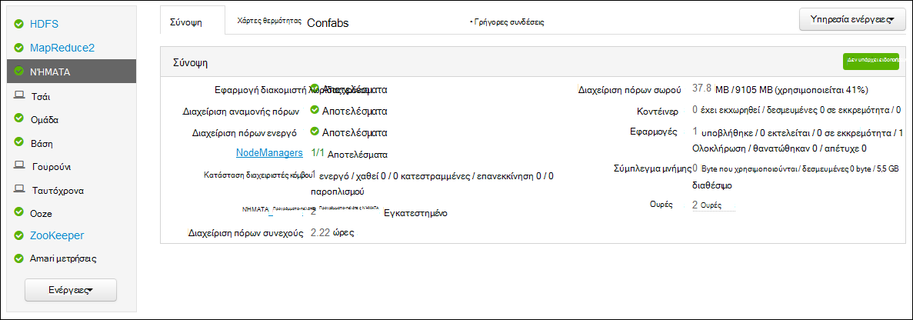
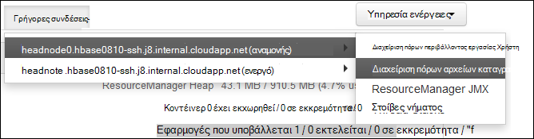

<properties
    pageTitle="Εφαρμογή της Access ΝΉΜΑΤΑ Hadoop αρχείο καταγραφής βάσει Linux HDInsight | Microsoft Azure"
    description="Μάθετε πώς μπορείτε να αποκτήσετε πρόσβαση σε αρχεία καταγραφής εφαρμογών ΝΉΜΑΤΑ σε ένα σύμπλεγμα βάσει Linux HDInsight (Hadoop) χρησιμοποιώντας τη γραμμή εντολών και ένα πρόγραμμα περιήγησης web."
    services="hdinsight"
    documentationCenter=""
    tags="azure-portal"
    authors="Blackmist" 
    manager="jhubbard"
    editor="cgronlun"/>

<tags
    ms.service="hdinsight"
    ms.workload="big-data"
    ms.tgt_pltfrm="na"
    ms.devlang="na"
    ms.topic="article"
    ms.date="10/21/2016"
    ms.author="larryfr"/>

# Εφαρμογή της Access ΝΉΜΑΤΑ συνδέεται βάσει Linux HDInsight 

Αυτό το έγγραφο εξηγεί τον τρόπο για να αποκτήσετε πρόσβαση στα αρχεία καταγραφής για εφαρμογές ΝΉΜΑΤΑ (ακόμη Negotiator άλλο πόρο) που έχετε ολοκληρώσει την σε ένα σύμπλεγμα Hadoop στο Azure HDInsight.

> [AZURE.NOTE] Οι πληροφορίες σε αυτό το έγγραφο είναι συγκεκριμένη για συμπλεγμάτων βάσει Linux HDInsight. Για πληροφορίες σχετικά με συμπλεγμάτων που βασίζεται στα Windows, ανατρέξτε στο θέμα [αρχεία καταγραφής εφαρμογών Access ΝΉΜΑΤΑ σε HDInsight που βασίζεται σε Windows](hdinsight-hadoop-access-yarn-app-logs.md)

## Προαπαιτούμενα στοιχεία

* Ένα σύμπλεγμα βάσει Linux HDInsight.

* Πρέπει να [δημιουργήσετε μια διοχέτευση SSH](hdinsight-linux-ambari-ssh-tunnel.md) μπορείτε να αποκτήσετε πρόσβαση σε αρχεία καταγραφής ResourceManager web περιβάλλοντος εργασίας Χρήστη.

## ΝΉΜΑΤΑ διακομιστή λωρίδας χρόνου

[ΝΉΜΑΤΑ λωρίδα χρόνου διακομιστή](http://hadoop.apache.org/docs/r2.4.0/hadoop-yarn/hadoop-yarn-site/TimelineServer.html) παρέχει γενικές πληροφορίες σχετικά με ολοκληρωμένη εφαρμογές, καθώς και πληροφορίες αφορούν συγκεκριμένα το πλαίσιο εφαρμογή μέσω δύο διαφορετικά περιβάλλοντα εργασίας. Συγκεκριμένα:

* Αποθήκευση και ανάκτηση των πληροφοριών γενική εφαρμογή σε HDInsight συμπλεγμάτων έχει ενεργοποιημένη με την έκδοση 3.1.1.374 ή νεότερη έκδοση.
* Το στοιχείο εφαρμογή αφορούν συγκεκριμένα το πλαίσιο πληροφοριών του διακομιστή λωρίδα χρόνου δεν είναι διαθέσιμη αυτήν τη στιγμή σε συμπλεγμάτων HDInsight.

Γενικές πληροφορίες σχετικά με τις αιτήσεις περιλαμβάνει τα παρακάτω ειδών τα δεδομένα:

* Το Αναγνωριστικό εφαρμογής, ένα μοναδικό αναγνωριστικό μιας εφαρμογής
* Ο χρήστης που ξεκίνησε την εφαρμογή
* Πληροφορίες σχετικά με την προσπάθειες για την ολοκλήρωση της εφαρμογής
* Το κοντέινερ που χρησιμοποιείται από οποιαδήποτε προσπάθεια δεδομένης εφαρμογής

## ΝΉΜΑΤΑ εφαρμογών και αρχείων καταγραφής

ΝΉΜΑΤΑ υποστηρίζει πολλές προγραμματισμού μοντέλα (MapReduce που έχει τεθεί σε μία από αυτές) κατά την αποσύνδεση διαχείριση πόρων από την εφαρμογή του προγραμματισμού/παρακολούθηση. Αυτό γίνεται μέσω ενός καθολικού *ResourceManager* (Διαχείριση Πόρων) ανά εργαζόμενο-κόμβου *NodeManagers* (NMs) και ανά εφαρμογή *ApplicationMasters* (αθροιστικής μέτρησης ενισχύσεων). Το ΠΜ ανά εφαρμογή διαπραγματεύεται πόρων (CPU, μνήμης, δίσκου, δικτύου) για την εκτέλεση εφαρμογή σας με το RM. Η διαχείριση Πόρων λειτουργεί με NMs να εκχωρήσετε σε αυτούς τους πόρους, που έχουν εκχωρηθεί ως *κοντέινερ*. Το ΠΜ είναι υπεύθυνος για την παρακολούθηση της προόδου των κοντέινερ που έχουν εκχωρηθεί σε αυτήν από το RM. Μια εφαρμογή μπορεί να απαιτεί πολλά κοντέινερ ανάλογα με τη φύση της εφαρμογής.

Επιπλέον, κάθε εφαρμογή μπορεί να αποτελούνται από πολλές *προσπάθειες εφαρμογής* προκειμένου να λήξης παρουσία παρουσιάζει σφάλμα ή λόγω της απώλειας επικοινωνία μεταξύ ενός πμ και μια RM. Επομένως, κοντέινερ εκχωρούνται σε μια συγκεκριμένη προσπάθεια μιας εφαρμογής του. Σε μια εικόνα, ένα κοντέινερ παρέχει το περιβάλλον για βασική μονάδα της εργασίας που έχει εκτελεστεί από μια εφαρμογή ΝΉΜΑΤΑ και όλη την εργασία που έχει ολοκληρωθεί εντός του περιβάλλοντος ενός κοντέινερ εκτελείται στον κόμβο μία εργασίας στην οποία έχει εκχωρηθεί το κοντέινερ. Ανατρέξτε στο θέμα [Έννοιες ΝΉΜΑΤΑ] [ YARN-concepts] για περαιτέρω αναφορά.

Αρχεία καταγραφής εφαρμογών (και τα αρχεία καταγραφής συσχετισμένη κοντέινερ) είναι κρίσιμες τον εντοπισμό σφαλμάτων προβληματικό Hadoop εφαρμογές. ΝΉΜΑΤΑ παρέχει ένα καλό είναι πλαίσιο για τη συλλογή, μόνο τις συγκεντρώσεις και την αποθήκευση αρχείων καταγραφής εφαρμογών με το [Αρχείο καταγραφής συνάθροισης] [ log-aggregation] τη δυνατότητα. Η δυνατότητα καταγραφής συνάθροιση κάνει το κατά την πρόσβαση σε αρχεία καταγραφής εφαρμογών πιο ντετερμινιστική, όπως συγκεντρώνει αρχεία καταγραφής σε όλα τα κοντέινερ σε έναν κόμβο εργασίας και να τις αποθηκεύει ως μία συγκεντρωτική αρχείο καταγραφής, ανά κόμβο εργασίας στο σύστημα αρχείων προεπιλεγμένη μετά την ολοκλήρωση μιας εφαρμογής. Η εφαρμογή σας μπορεί να χρησιμοποιήσει εκατοντάδες ή χιλιάδες κοντέινερ, αλλά αρχείων καταγραφής για όλα τα κοντέινερ εκτελεστεί σε έναν κόμβο μόνο εργαζόμενου πάντα συναθροίζονται σε ένα αρχείο, με αποτέλεσμα ένα αρχείο καταγραφής ανά κόμβο εργαζόμενου που χρησιμοποιούνται από την εφαρμογή σας. Συνάθροιση καταγραφής είναι ενεργοποιημένη από προεπιλογή σε HDInsight συμπλεγμάτων (έκδοση 3.0 και παραπάνω), και μπορείτε να βρείτε συγκεντρωτική αρχεία καταγραφής στο προεπιλεγμένο κοντέινερ του συμπλέγματος στην εξής θέση:

    wasbs:///app-logs/<user>/logs/<applicationId>

Θέση, *χρήστη* είναι το όνομα του χρήστη που ξεκίνησε την εφαρμογή και να *αναγνωριστικά εφαρμογής* είναι το μοναδικό αναγνωριστικό μιας εφαρμογής όπως έχει εκχωρηθεί από το RM. ΝΉΜΑΤΑ

Τα αρχεία καταγραφής συγκεντρωτική δεν είναι απευθείας αναγνώσιμη, όπως αυτές είναι γραμμένες σε μια [TFile][T-file], [δυαδική μορφή] [ binary-format] σε ευρετήριο από το κοντέινερ. Πρέπει να χρησιμοποιήσετε τα εργαλεία CLI ή αρχεία καταγραφής ResourceManager ΝΉΜΑΤΑ για να προβάλετε αυτά τα αρχεία καταγραφής ως απλό κείμενο για εφαρμογές ή κοντέινερ που σας ενδιαφέρουν. 

##Εργαλεία CLI ΝΉΜΑΤΑ

Για να χρησιμοποιήσετε τα εργαλεία CLI ΝΉΜΑΤΑ, πρέπει πρώτα να συνδεθείτε με το σύμπλεγμα HDInsight χρησιμοποιώντας SSH. Χρησιμοποιήστε ένα από τα ακόλουθα έγγραφα για πληροφορίες σχετικά με τη χρήση SSH με HDInsight:

- [Χρήση SSH με βάσει Linux Hadoop σε HDInsight από Linux, Unix ή λειτουργικό σύστημα OS X](hdinsight-hadoop-linux-use-ssh-unix.md)

- [Χρήση SSH με βάσει Linux Hadoop σε HDInsight από το Windows](hdinsight-hadoop-linux-use-ssh-windows.md)
    
Μπορείτε να προβάλετε αυτά τα αρχεία καταγραφής ως απλό κείμενο, εκτελώντας μία από τις παρακάτω εντολές:

    yarn logs -applicationId <applicationId> -appOwner <user-who-started-the-application>
    yarn logs -applicationId <applicationId> -appOwner <user-who-started-the-application> -containerId <containerId> -nodeAddress <worker-node-address>
    
Πρέπει να καθορίσετε το &lt;αναγνωριστικά εφαρμογής >, &lt;χρήστη που-αποτελέσματα-η-εφαρμογή >, &lt;containerId >, και & διεύθυνση κόμβου ltworker > πληροφορίες κατά την εκτέλεση αυτών των εντολών.

##Περιβάλλον εργασίας Χρήστη ResourceManager ΝΉΜΑΤΑ

Το περιβάλλον εργασίας Χρήστη ResourceManager ΝΉΜΑΤΑ εκτελείται σε headnode το σύμπλεγμα και είναι δυνατή η πρόσβαση μέσω web Ambari περιβάλλοντος εργασίας Χρήστη; Ωστόσο, πρέπει να [δημιουργήσετε διοχέτευση SSH](hdinsight-linux-ambari-ssh-tunnel.md) πρώτη μπορείτε να αποκτήσετε πρόσβαση σε περιβάλλον εργασίας Χρήστη του ResourceManager.

Αφού δημιουργήσετε μια διοχέτευση SSH, χρησιμοποιήστε τα ακόλουθα βήματα για να προβάλετε τα αρχεία καταγραφής ΝΉΜΑΤΑ:

1. Στο πρόγραμμα περιήγησης web, μεταβείτε στις επιλογές https://CLUSTERNAME.azurehdinsight.net. Αντικαταστήστε CLUSTERNAME με το όνομα του συμπλέγματος HDInsight.

2. Από τη λίστα των υπηρεσιών στα αριστερά, επιλέξτε __ΝΉΜΑΤΑ__.

    

3. Από την αναπτυσσόμενη λίστα __Γρήγορες συνδέσεις__ , επιλέξτε έναν από τους κόμβους κεφαλής σύμπλεγμα και, στη συνέχεια, επιλέξτε __Αρχείο καταγραφής ResourceManager__.

    
    
    Θα εμφανιστεί μια λίστα με συνδέσεις σε αρχεία καταγραφής ΝΉΜΑΤΑ.

[YARN-timeline-server]:http://hadoop.apache.org/docs/r2.4.0/hadoop-yarn/hadoop-yarn-site/TimelineServer.html
[log-aggregation]:http://hortonworks.com/blog/simplifying-user-logs-management-and-access-in-yarn/
[T-file]:https://issues.apache.org/jira/secure/attachment/12396286/TFile%20Specification%2020081217.pdf
[binary-format]:https://issues.apache.org/jira/browse/HADOOP-3315
[YARN-concepts]:http://hortonworks.com/blog/apache-hadoop-yarn-concepts-and-applications/
