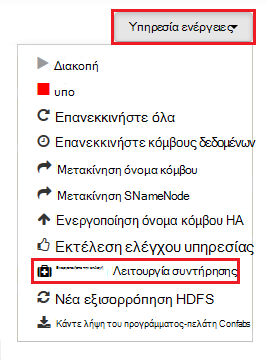

<properties
    pageTitle="Ενεργοποίηση ενδείξεις σωρού υπηρεσίες Hadoop HDInsight | Microsoft Azure"
    description="Ενεργοποίηση σωρού ενδείξεων σφαλμάτων για τις υπηρεσίες Hadoop από το HDInsight βάσει Linux συμπλεγμάτων για τον εντοπισμό σφαλμάτων και ανάλυση."
    services="hdinsight"
    documentationCenter=""
    authors="Blackmist"
    manager="jhubbard"
    editor="cgronlun"
    tags="azure-portal"/>

<tags
    ms.service="hdinsight"
    ms.workload="big-data"
    ms.tgt_pltfrm="na"
    ms.devlang="na"
    ms.topic="article"
    ms.date="09/27/2016"
    ms.author="larryfr"/>

#Ενεργοποίηση σωρού ενδείξεις Hadoop υπηρεσίες βάσει Linux HDInsight (έκδοση Preview)

[AZURE.INCLUDE [heapdump-selector](../../includes/hdinsight-selector-heap-dump.md)]

Οι ενδείξεις σωρού περιέχει ένα στιγμιότυπο της μνήμης της εφαρμογής, συμπεριλαμβανομένων των τιμών των μεταβλητών την ώρα που δημιουργήθηκε η ένδειξη. Έτσι ώστε να είναι πολύ χρήσιμη για τη διάγνωση προβλημάτων που παρουσιάζονται κατά το χρόνο εκτέλεσης.

> [AZURE.NOTE] Οι πληροφορίες σε αυτό το άρθρο ισχύει μόνο για βάσει Linux HDInsight. Για πληροφορίες σχετικά με HDInsight που βασίζεται στα Windows, ανατρέξτε στο θέμα [Ενεργοποίηση ενδείξεις σωρού υπηρεσίες Hadoop HDInsight που βασίζεται σε Windows](hdinsight-hadoop-collect-debug-heap-dumps.md)

## Υπηρεσίες

Μπορείτε να ενεργοποιήσετε την σωρού ενδείξεων σφαλμάτων για τις ακόλουθες υπηρεσίες:

*  **hcatalog** - tempelton
*  **ομάδα** - hiveserver2, metastore, derbyserver
*  **mapreduce** - jobhistoryserver
*  **νήματα** - resourcemanager, nodemanager, timelineserver
*  **hdfs** - datanode, secondarynamenode, namenode

Μπορείτε επίσης να ενεργοποιήσετε σωρού ενδείξεις για το χάρτη και να μειώσετε εκτελέσατε διεργασίες με HDInsight.

## Κατανόηση των σωρού ρύθμιση των παραμέτρων ένδειξης

Οι ενδείξεις σωρού είναι ενεργοποιημένες από διέρχεται επιλογές (μερικές φορές γνωστό ως επιλέξει, ή παράμετροι) για να το JVM κατά την εκκίνηση μιας υπηρεσίας. Για περισσότερες υπηρεσίες Hadoop, αυτό μπορεί να πραγματοποιηθεί τροποποιώντας το δέσμη ενεργειών κελύφους που χρησιμοποιείται για την εκκίνηση της υπηρεσίας.

Σε κάθε δέσμη ενεργειών, υπάρχει μια εξαγωγή για ** \* \_OPTS**, που περιέχει τις επιλογές που του μεταβιβάστηκε η JVM. Για παράδειγμα, της δέσμης ενεργειών **hadoop env.sh** , τη γραμμή που αρχίζει με `export HADOOP_NAMENODE_OPTS=` περιέχει τις επιλογές για την υπηρεσία NameNode.

Αντιστοίχιση και να μειώσετε διεργασίες είναι λίγο διαφορετικά, όπως αυτές είναι μια διαδικασία θυγατρικών της υπηρεσίας MapReduce. Κάθε αντιστοίχιση ή να μειώσετε διαδικασία εκτελείται σε ένα κοντέινερ θυγατρικό και υπάρχουν δύο εγγραφές που περιέχουν τις επιλογές JVM για αυτά. Και τα δύο που περιέχονται σε **mapred site.xml**:

* **mapreduce.Admin.Map.Child.Java.opts**
* **mapreduce.Admin.reduce.Child.Java.opts**

> [AZURE.NOTE] Συνιστάται να χρησιμοποιείτε Ambari για να τροποποιήσετε τόσο τις δέσμες ενεργειών και mapred site.xml ρυθμίσεις, όπως Ambari θα χειριστεί αναπαραγωγή αλλαγών σε κόμβους του συμπλέγματος. Ανατρέξτε στην ενότητα [Χρήση Ambari](#using-ambari) για συγκεκριμένα βήματα.

###Ενεργοποίηση σωρού ενδείξεις

Η ακόλουθη επιλογή επιτρέπει σωρού ενδείξεων σφαλμάτων όταν προκύπτει μια OutOfMemoryError:

    -XX:+HeapDumpOnOutOfMemoryError

Το **+** δηλώνει ότι αυτή η επιλογή είναι ενεργοποιημένη. Η προεπιλογή είναι απενεργοποιημένη.

> [AZURE.WARNING] Οι ενδείξεις σωρού δεν είναι ενεργοποιημένες για υπηρεσίες Hadoop σε HDInsight από προεπιλογή, όπως τα αρχεία ένδειξης μπορεί να είναι μεγάλες. Εάν ενεργοποιήσετε τους για την αντιμετώπιση προβλημάτων, μην ξεχάσετε να τις απενεργοποιήσω αφού το σφάλμα και που συλλέγονται στα αρχεία ένδειξης.

###Θέση ένδειξης

Η προεπιλεγμένη θέση για το αρχείο ένδειξης είναι ο τρέχων κατάλογος εργασίας. Μπορείτε να ελέγξετε το σημείο όπου είναι αποθηκευμένο το αρχείο χρησιμοποιώντας την ακόλουθη επιλογή:

    -XX:HeapDumpPath=/path

Για παράδειγμα, με χρήση `-XX:HeapDumpPath=/tmp` θα προκαλέσει την ενδείξεις να είναι αποθηκευμένο στον κατάλογο /tmp.

###Δέσμες ενεργειών

Μπορείτε επίσης να ενεργοποιήσετε μια δέσμη ενεργειών όταν προκύπτει μια **OutOfMemoryError** . Για παράδειγμα, ενεργοποίηση μια ειδοποίηση ώστε να γνωρίζετε ότι το σφάλμα. Αυτό ελέγχεται χρησιμοποιώντας την ακόλουθη επιλογή:

    -XX:OnOutOfMemoryError=/path/to/script

> [AZURE.NOTE] Επειδή το Hadoop είναι ένα Κατανεμημένο σύστημα, πρέπει να τοποθετηθούν οποιαδήποτε δέσμη ενεργειών που χρησιμοποιούνται σε όλους τους κόμβους του συμπλέγματος που εκτελείται η υπηρεσία στον.
>
> Η δέσμη ενεργειών πρέπει να επίσης να σε μια θέση όπου είναι δυνατή η πρόσβαση από το λογαριασμό της υπηρεσίας εκτελείται ως και, πρέπει να δώσετε δικαιώματα εκτέλεσης. Για παράδειγμα, μπορεί να θέλετε να αποθηκευτούν οι δέσμες ενεργειών σε `/usr/local/bin` και χρησιμοποιήστε `chmod go+rx /usr/local/bin/filename.sh` για να εκχωρήσετε ανάγνωση δικαιώματα και εκτέλεσης.

##Χρήση Ambari

Για να τροποποιήσετε τη ρύθμιση παραμέτρων για μια υπηρεσία, χρησιμοποιήστε τα ακόλουθα βήματα:

1. Ανοίξτε το web Ambari περιβάλλοντος εργασίας Χρήστη για το σύμπλεγμά σας. Η διεύθυνση URL θα https://YOURCLUSTERNAME.azurehdinsight.net.

    Όταν σας ζητηθεί, τον έλεγχο ταυτότητας στην τοποθεσία χρησιμοποιώντας το όνομα λογαριασμού HTTP (προεπιλογή: διαχειριστής,) και τον κωδικό πρόσβασης για το σύμπλεγμά σας.

    > [AZURE.NOTE] Ενδέχεται να εμφανιστεί μια δεύτερη φορά, Ambari για το όνομα χρήστη και τον κωδικό πρόσβασης. Εάν Ναι, απλώς επαναπληκτρολογήσετε το ίδιο όνομα λογαριασμού και τον κωδικό πρόσβασης

2. Χρησιμοποιώντας τη λίστα στα αριστερά, επιλέξτε την περιοχή υπηρεσία που θέλετε να τροποποιήσετε. Για παράδειγμα, **HDFS**. Στην περιοχή κέντρο, επιλέξτε την καρτέλα **διαμορφώσεων** .

    

3. Χρησιμοποιώντας την καταχώρηση **φιλτράρισμα...** , εισαγάγετε **επιλέξει**. Αυτό θα φιλτράρετε τη λίστα με τα στοιχεία ρύθμισης παραμέτρων μόνο σε εκείνους που περιέχει αυτό το κείμενο και είναι ένας γρήγορος τρόπος για να βρείτε το δέσμη ενεργειών κελύφους, ή το **πρότυπο** που μπορούν να χρησιμοποιηθούν για να ορίσετε αυτές τις επιλογές.

    

4. Βρείτε το ** \* \_OPTS** καταχώρησης για την υπηρεσία που θέλετε να ενδείξεις σωρού για ενεργοποίηση και προσθέστε τις επιλογές που θέλετε να ενεργοποιήσετε. Στην παρακάτω εικόνα, έχω προσθέσει `-XX:+HeapDumpOnOutOfMemoryError -XX:HeapDumpPath=/tmp/` για να το **HADOOP\_NAMENODE\_OPTS** καταχώρησης:

    

    > [AZURE.NOTE] Κατά την ενεργοποίηση σωρού Αποτυπώνει για το χάρτη ή να μειώσετε θυγατρική διεργασία, θα δείτε αντί για αυτό για τα πεδία με ετικέτες **mapreduce.admin.map.child.java.opts** και **mapreduce.admin.reduce.child.java.opts**.

    Χρησιμοποιήστε το κουμπί **Αποθήκευση** για να αποθηκεύσετε τις αλλαγές. Θα επιτρέπεται για να εισαγάγετε μια σύντομη σημείωση που περιγράφει τις αλλαγές.

5. Μόλις τις αλλαγές που έχουν εφαρμοστεί, θα εμφανιστεί το εικονίδιο **επανεκκίνηση απαιτείται** δίπλα σε μία ή περισσότερες υπηρεσίες.

    

6. Επιλέξτε κάθε υπηρεσία που χρειάζεται η επανεκκίνηση και χρησιμοποιήστε το κουμπί **Ενέργειες υπηρεσίας** για να **Μετατρέψετε σε λειτουργία συντήρησης**. Αυτό αποτρέπει τις ειδοποιήσεις από δημιουργείται από αυτήν την υπηρεσία, όταν κάνετε επανεκκίνηση.

    

7. Αφού έχετε ενεργοποιήσει την κατάσταση λειτουργίας συντήρησης, χρησιμοποιήστε το κουμπί **επανεκκίνηση** για την υπηρεσία για να **Επανεκκινήσετε όλα προσδιορίζεται**

    

    > [AZURE.NOTE] τις καταχωρήσεις για το κουμπί **επανεκκίνηση** ενδέχεται να είναι διαφορετικές για άλλες υπηρεσίες.

8. Όταν έχει γίνει επανεκκίνηση των υπηρεσιών, χρησιμοποιήστε το κουμπί **Ενέργειες υπηρεσίας** σε **Ενεργοποίηση εκτός λειτουργίας συντήρηση**. Αυτό Ambari για να συνεχίσετε την παρακολούθηση για τις ειδοποιήσεις για την υπηρεσία.
