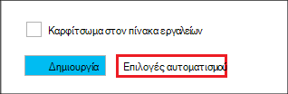

<properties
   pageTitle="Δημιουργία συμπλεγμάτων βάσει Linux Hadoop στο με τη χρήση προτύπων από διαχειριστή πόρων Azure HDInsight | Microsoft Azure"
    description="Μάθετε πώς μπορείτε να δημιουργήσετε συμπλεγμάτων για Azure HDInsight με τη χρήση προτύπων από διαχειριστή πόρων Azure Azure."
   services="hdinsight"
   documentationCenter=""
   tags="azure-portal"
   authors="mumian"
   manager="jhubbard"
   editor="cgronlun"/>

<tags
   ms.service="hdinsight"
   ms.devlang="na"
   ms.topic="article"
   ms.tgt_pltfrm="na"
   ms.workload="big-data"
   ms.date="09/02/2016"
   ms.author="jgao"/>

# Δημιουργία συμπλεγμάτων βάσει Linux Hadoop στο με τη χρήση προτύπων από διαχειριστή πόρων Azure HDInsight

[AZURE.INCLUDE [selector](../../includes/hdinsight-selector-create-clusters.md)]

Μάθετε πώς μπορείτε να δημιουργήσετε με τη χρήση προτύπων Manager(ARM) πόρων Azure συμπλεγμάτων HDInsight. Για περισσότερες πληροφορίες, ανατρέξτε στο θέμα [ανάπτυξη μιας εφαρμογής με το πρότυπο διαχείρισης πόρων Azure](../resource-group-template-deploy.md). Για άλλες δημιουργία συμπλέγματος και εργαλεία που διαθέτει κάντε κλικ στην επιλογή καρτέλα, επιλέξτε στο επάνω μέρος αυτής της σελίδας ή [μεθόδους δημιουργίας σύμπλεγμα](hdinsight-provision-clusters.md#cluster-creation-methods).

##Προαπαιτούμενα στοιχεία:

[AZURE.INCLUDE [delete-cluster-warning](../../includes/hdinsight-delete-cluster-warning.md)]

Πριν να ξεκινήσετε τις οδηγίες σε αυτό το άρθρο, πρέπει να έχετε τα εξής:

- [Azure συνδρομής](https://azure.microsoft.com/documentation/videos/get-azure-free-trial-for-testing-hadoop-in-hdinsight/).
- CLI Azure PowerShell ή/και του Azure

    [AZURE.INCLUDE [use-latest-version](../../includes/hdinsight-use-latest-powershell-and-cli.md)]

### Απαιτήσεις για στοιχείο ελέγχου πρόσβασης

[AZURE.INCLUDE [access-control](../../includes/hdinsight-access-control-requirements.md)]

## Πρότυπα διαχείρισης πόρων

Διαχείριση πόρων πρότυπο διευκολύνει για να δημιουργήσετε συμπλεγμάτων HDInsight, τους πόρους εξαρτώμενα (όπως τον προεπιλεγμένο λογαριασμό χώρου αποθήκευσης) και άλλοι πόροι (όπως η βάση δεδομένων SQL Azure για να χρησιμοποιήσετε Apache Sqoop) για την εφαρμογή σας σε μια ενιαία, συντονισμένη λειτουργία. Στο πρότυπο, μπορείτε να ορίσετε τους πόρους που απαιτούνται για την εφαρμογή και καθορίσετε παραμέτρους ανάπτυξης για να εισαγάγετε τιμές για διαφορετικά περιβάλλοντα. Το πρότυπο αποτελείται από JSON και παραστάσεις που μπορείτε να χρησιμοποιήσετε για να δημιουργήσετε τιμές για την ανάπτυξη.

Μπορείτε να βρείτε ένα πρότυπο από διαχειριστή πόρων για να δημιουργήσετε ένα σύμπλεγμα HDInsight και για το λογαριασμό χώρου αποθήκευσης Azure εξαρτώμενα στο [Προσάρτημα Α](#appx-a-arm-template). Χρησιμοποιήστε πλατφόρμες [VSCode](https://code.visualstudio.com/#alt-downloads) με τη [Διαχείριση πόρων επέκταση](https://marketplace.visualstudio.com/items?itemName=msazurermtools.azurerm-vscode-tools) ή ένα πρόγραμμα επεξεργασίας κειμένου για να αποθηκεύσετε το πρότυπο σε ένα αρχείο σε σας σταθμούς εργασίας. Θα μάθετε πώς μπορείτε να καλέσετε το πρότυπο με διαφορετικές μεθόδους.

Για περισσότερες πληροφορίες σχετικά με το πρότυπο διαχείρισης πόρων, ανατρέξτε στο θέμα

- [Πρότυπα διαχείρισης πόρων Azure συντάκτη](../resource-group-authoring-templates.md)
- [Ανάπτυξη μιας εφαρμογής με το πρότυπο διαχείρισης πόρων Azure](../resource-group-template-deploy.md)

Για να βρείτε το σχήμα JSON για ορισμένα στοιχεία, μπορείτε να ακολουθήσετε την παρακάτω διαδικασία:

1. Ανοίξτε την [πύλη του Azure](https://porta.azure.com) για να δημιουργήσετε ένα σύμπλεγμα HDInsight.  Ανατρέξτε στο θέμα [Δημιουργία Linux βάσει συμπλεγμάτων στο με την πύλη Azure HDInsight](hdinsight-hadoop-create-linux-clusters-portal.md).
2. Ρύθμιση παραμέτρων τα απαιτούμενα στοιχεία και τα στοιχεία που χρειάζεστε το σχήμα JSON.
3. Πριν από την κάνοντας κλικ στην επιλογή **Δημιουργία**, κάντε κλικ στην επιλογή **Επιλογές αυτοματισμού** , όπως φαίνεται στο παρακάτω στιγμιότυπο οθόνης:

    

    Η πύλη δημιουργεί ένα πρότυπο από διαχειριστή πόρων ανάλογα με τις παραμέτρους.
## Ανάπτυξη με το PowerShell

Η παρακάτω διαδικασία δημιουργεί σύμπλεγμα βάσει Linux HDInsight.

**Για να αναπτύξετε ένα σύμπλεγμα χρησιμοποιώντας το πρότυπο διαχείρισης πόρων**

1. Αποθηκεύστε το αρχείο json στο [παράρτημα A](#appx-a-arm-template) για να σας σταθμούς εργασίας. Στη δέσμη ενεργειών PowerShell, το όνομα του αρχείου είναι *C:\HDITutorials-ARM\hdinsight-arm-template.json*.
2. Ορίστε τις παραμέτρους και μεταβλητές, εάν είναι απαραίτητο.
3. Εκτελέστε το πρότυπο χρησιμοποιώντας την ακόλουθη δέσμη ενεργειών PowerShell:

        ####################################
        # Set these variables
        ####################################
        #region - used for creating Azure service names
        $nameToken = "<Enter an Alias>" 
        $templateFile = "C:\HDITutorials-ARM\hdinsight-arm-template.json"
        #endregion

        ####################################
        # Service names and varialbes
        ####################################
        #region - service names
        $namePrefix = $nameToken.ToLower() + (Get-Date -Format "MMdd")

        $resourceGroupName = $namePrefix + "rg"
        $hdinsightClusterName = $namePrefix + "hdi"
        $defaultStorageAccountName = $namePrefix + "store"
        $defaultBlobContainerName = $hdinsightClusterName

        $location = "East US 2"

        $armDeploymentName = $namePrefix
        #endregion

        ####################################
        # Connect to Azure
        ####################################
        #region - Connect to Azure subscription
        Write-Host "`nConnecting to your Azure subscription ..." -ForegroundColor Green
        try{Get-AzureRmContext}
        catch{Login-AzureRmAccount}
        #endregion

        # Create a resource group
        New-AzureRmResourceGroup -Name $resourceGroupName -Location $Location

        # Create cluster and the dependent storage accounge
        $parameters = @{clusterName="$hdinsightClusterName"}

        New-AzureRmResourceGroupDeployment `
            -Name $armDeploymentName `
            -ResourceGroupName $resourceGroupName `
            -TemplateFile $templateFile `
            -TemplateParameterObject $parameters

        # List cluster
        Get-AzureRmHDInsightCluster -ResourceGroupName $resourceGroupName -ClusterName $hdinsightClusterName 

    Η δέσμη ενεργειών PowerShell ρυθμίζει μόνο το όνομα του συμπλέγματος. Το όνομα λογαριασμού του χώρου αποθήκευσης είναι κωδικοποιημένη στο πρότυπο. Θα σας ζητηθεί να εισαγάγετε το σύμπλεγμα κωδικού πρόσβασης χρήστη (το προεπιλεγμένο όνομα χρήστη είναι *διαχειριστής*); και τον κωδικό πρόσβασης χρήστη SSH (το προεπιλεγμένο όνομα χρήστη SSH είναι *sshuser*).  
    
Για περισσότερες πληροφορίες, ανατρέξτε στο θέμα [Ανάπτυξη με το PowerShell](../resource-group-template-deploy.md#deploy-with-powershell).

## Ανάπτυξη με το Azure CLI

Το παρακάτω δείγμα δημιουργεί ένα σύμπλεγμα και το λογαριασμό εξαρτώμενα χώρου αποθήκευσης και κοντέινερ καλώντας ενός προτύπου για τη διαχείριση πόρων:

    azure login
    azure config mode arm
    azure group create -n hdi1229rg -l "East US"
    azure group deployment create --resource-group "hdi1229rg" --name "hdi1229" --template-file "C:\HDITutorials-ARM\hdinsight-arm-template.json"
    
Θα σας ζητηθεί να εισαγάγετε το όνομα του συμπλέγματος, σύμπλεγμα τον κωδικό πρόσβασης χρήστη (το προεπιλεγμένο όνομα χρήστη είναι *διαχειριστής*) και τον κωδικό πρόσβασης χρήστη SSH (το προεπιλεγμένο όνομα χρήστη SSH είναι *sshuser*). Για να παρέχετε τις παραμέτρους σε γραμμή:

    azure group deployment create --resource-group "hdi1229rg" --name "hdi1229" --template-file "c:\Tutorials\HDInsightARM\create-linux-based-hadoop-cluster-in-hdinsight.json" --parameters '{\"clusterName\":{\"value\":\"hdi1229\"},\"clusterLoginPassword\":{\"value\":\"Pass@word1\"},\"sshPassword\":{\"value\":\"Pass@word1\"}}'

## Ανάπτυξη με REST API

Ανατρέξτε στο θέμα [Ανάπτυξη με το REST API](../resource-group-template-deploy.md#deploy-with-the-rest-api).

## Ανάπτυξη με το Visual Studio

Με το Visual Studio, μπορείτε να δημιουργήσετε ένα έργο ομάδα πόρων και να αναπτύξετε για Azure μέσω του περιβάλλοντος εργασίας χρήστη. Επιλέξτε τον τύπο των πόρων για να συμπεριλάβετε στο έργο σας και αυτούς τους πόρους προστίθενται αυτόματα σε πρότυπο διαχείρισης πόρων. Το project παρέχει επίσης μια δέσμη ενεργειών του PowerShell για να αναπτύξετε το πρότυπο.

Για μια εισαγωγή στη χρήση του Visual Studio με ομάδες πόρων, ανατρέξτε στο θέμα [Δημιουργία και ανάπτυξη ομάδων πόρων Azure μέσω του Visual Studio](../vs-azure-tools-resource-groups-deployment-projects-create-deploy.md).

##Επόμενα βήματα
Σε αυτό το άρθρο μάθατε διάφορους τρόπους για να δημιουργήσετε ένα σύμπλεγμα HDInsight. Για περισσότερες πληροφορίες, ανατρέξτε στα ακόλουθα άρθρα:

- Για ένα παράδειγμα ανάπτυξης πόρους μέσω της βιβλιοθήκης του προγράμματος-πελάτη .NET, ανατρέξτε στο θέμα [Χρήση πόρους ανάπτυξης των βιβλιοθηκών .NET και ένα πρότυπο](../virtual-machines/virtual-machines-windows-csharp-template.md).
- Για ένα αναλυτικό παράδειγμα για την ανάπτυξη μιας εφαρμογής, ανατρέξτε στο θέμα [προμήθεια και ανάπτυξη microservices προβλέψιμα στο Azure](../app-service-web/app-service-deploy-complex-application-predictably.md).
- Για οδηγίες σχετικά με την ανάπτυξη της λύσης σε διαφορετικά περιβάλλοντα, ανατρέξτε στο θέμα [ανάπτυξη και περιβάλλοντα δοκιμής στο Microsoft Azure](../solution-dev-test-environments.md).
- Για να μάθετε περισσότερα σχετικά με τις ενότητες του προτύπου για τη διαχείριση πόρων Azure, ανατρέξτε στο θέμα [πρότυπα σύνταξη από κοινού](../resource-group-authoring-templates.md).
- Για μια λίστα με τις συναρτήσεις που μπορείτε να χρησιμοποιήσετε σε ένα πρότυπο από διαχειριστή πόρων Azure, ανατρέξτε στο θέμα [συναρτήσεις πρότυπο](../resource-group-template-functions.md).

##Διαχείριση πόρων Appx A: προτύπου

Το ακόλουθο πρότυπο διαχείρισης πόρων Azure δημιουργεί ένα σύμπλεγμα βάσει Linux Hadoop με το λογαριασμό εξαρτώμενα Azure χώρου αποθήκευσης. 

> [AZURE.NOTE] Το δείγμα περιλαμβάνει πληροφορίες ρύθμισης παραμέτρων για ομάδα metastore και Oozie metastore.  Κατάργηση της ενότητας ή ρυθμίστε την ενότητα πριν από τη χρήση του προτύπου.

    {
    "$schema": "https://schema.management.azure.com/schemas/2015-01-01/deploymentTemplate.json#",
    "contentVersion": "1.0.0.0",
    "parameters": {
        "clusterName": {
        "type": "string",
        "metadata": {
            "description": "The name of the HDInsight cluster to create."
        }
        },
        "clusterLoginUserName": {
        "type": "string",
        "defaultValue": "admin",
        "metadata": {
            "description": "These credentials can be used to submit jobs to the cluster and to log into cluster dashboards."
        }
        },
        "clusterLoginPassword": {
        "type": "securestring",
        "metadata": {
            "description": "The password must be at least 10 characters in length and must contain at least one digit, one non-alphanumeric character, and one upper or lower case letter."
        }
        },
        "sshUserName": {
        "type": "string",
        "defaultValue": "sshuser",
        "metadata": {
            "description": "These credentials can be used to remotely access the cluster."
        }
        },
        "sshPassword": {
        "type": "securestring",
        "metadata": {
            "description": "The password must be at least 10 characters in length and must contain at least one digit, one non-alphanumeric character, and one upper or lower case letter."
        }
        },
        "location": {
        "type": "string",
        "defaultValue": "East US",
        "allowedValues": [
            "East US",
            "East US 2",
            "North Central US",
            "South Central US",
            "West US",
            "North Europe",
            "West Europe",
            "East Asia",
            "Southeast Asia",
            "Japan East",
            "Japan West",
            "Australia East",
            "Australia Southeast"
        ],
        "metadata": {
            "description": "The location where all azure resources will be deployed."
        }
        },
        "clusterType": {
        "type": "string",
        "defaultValue": "hadoop",
        "allowedValues": [
            "hadoop",
            "hbase",
            "storm",
            "spark"
        ],
        "metadata": {
            "description": "The type of the HDInsight cluster to create."
        }
        },
        "clusterWorkerNodeCount": {
        "type": "int",
        "defaultValue": 2,
        "metadata": {
            "description": "The number of nodes in the HDInsight cluster."
        }
        }
    },
    "variables": {
        "defaultApiVersion": "2015-05-01-preview",
        "clusterApiVersion": "2015-03-01-preview",
        "clusterStorageAccountName": "[concat(parameters('clusterName'),'store')]"
    },
    "resources": [
        {
        "name": "[variables('clusterStorageAccountName')]",
        "type": "Microsoft.Storage/storageAccounts",
        "location": "[parameters('location')]",
        "apiVersion": "[variables('defaultApiVersion')]",
        "dependsOn": [ ],
        "tags": { },
        "properties": {
            "accountType": "Standard_LRS"
        }
        },
        {
        "name": "[parameters('clusterName')]",
        "type": "Microsoft.HDInsight/clusters",
        "location": "[parameters('location')]",
        "apiVersion": "[variables('clusterApiVersion')]",
        "dependsOn": [ "[concat('Microsoft.Storage/storageAccounts/',variables('clusterStorageAccountName'))]" ],
        "tags": {

        },
        "properties": {
            "clusterVersion": "3.4",
            "osType": "Linux",
            "tier": "standard",
            "clusterDefinition": {
            "kind": "[parameters('clusterType')]",
            "configurations": {
                "gateway": {
                "restAuthCredential.isEnabled": true,
                "restAuthCredential.username": "[parameters('clusterLoginUserName')]",
                "restAuthCredential.password": "[parameters('clusterLoginPassword')]"
                },
                "hive-site": {
                    "javax.jdo.option.ConnectionDriverName": "com.microsoft.sqlserver.jdbc.SQLServerDriver",
                    "javax.jdo.option.ConnectionURL": "jdbc:sqlserver://myadla0901dbserver.database.windows.net;database=myhive20160901;encrypt=true;trustServerCertificate=true;create=false;loginTimeout=300",
                    "javax.jdo.option.ConnectionUserName": "johndole",
                    "javax.jdo.option.ConnectionPassword": "myPassword$"
                },
                "hive-env": {
                    "hive_database": "Existing MSSQL Server database with SQL authentication",
                    "hive_database_name": "myhive20160901",
                    "hive_database_type": "mssql",
                    "hive_existing_mssql_server_database": "myhive20160901",
                    "hive_existing_mssql_server_host": "myadla0901dbserver.database.windows.net",
                    "hive_hostname": "myadla0901dbserver.database.windows.net"
                },
                "oozie-site": {
                    "oozie.service.JPAService.jdbc.driver": "com.microsoft.sqlserver.jdbc.SQLServerDriver",
                    "oozie.service.JPAService.jdbc.url": "jdbc:sqlserver://myadla0901dbserver.database.windows.net;database=myhive20160901;encrypt=true;trustServerCertificate=true;create=false;loginTimeout=300",
                    "oozie.service.JPAService.jdbc.username": "johndole",
                    "oozie.service.JPAService.jdbc.password": "myPassword$",
                    "oozie.db.schema.name": "oozie"
                },
                "oozie-env": {
                    "oozie_database": "Existing MSSQL Server database with SQL authentication",
                    "oozie_database_name": "myhive20160901",
                    "oozie_database_type": "mssql",
                    "oozie_existing_mssql_server_database": "myhive20160901",
                    "oozie_existing_mssql_server_host": "myadla0901dbserver.database.windows.net",
                    "oozie_hostname": "myadla0901dbserver.database.windows.net"
                }            
            }
            },
            "storageProfile": {
            "storageaccounts": [
                {
                "name": "[concat(variables('clusterStorageAccountName'),'.blob.core.windows.net')]",
                "isDefault": true,
                "container": "[parameters('clusterName')]",
                "key": "[listKeys(resourceId('Microsoft.Storage/storageAccounts', variables('clusterStorageAccountName')), variables('defaultApiVersion')).key1]"
                }
            ]
            },
            "computeProfile": {
            "roles": [
                {
                "name": "headnode",
                "targetInstanceCount": "2",
                "hardwareProfile": {
                    "vmSize": "Standard_D3"
                },
                "osProfile": {
                    "linuxOperatingSystemProfile": {
                    "username": "[parameters('sshUserName')]",
                    "password": "[parameters('sshPassword')]"
                    }
                }
                },
                {
                "name": "workernode",
                "targetInstanceCount": "[parameters('clusterWorkerNodeCount')]",
                "hardwareProfile": {
                    "vmSize": "Standard_D3"
                },
                "osProfile": {
                    "linuxOperatingSystemProfile": {
                    "username": "[parameters('sshUserName')]",
                    "password": "[parameters('sshPassword')]"
                    }
                }
                }
            ]
            }
        }
        }
    ],
    "outputs": {
        "cluster": {
        "type": "object",
        "value": "[reference(resourceId('Microsoft.HDInsight/clusters',parameters('clusterName')))]"
        }
    }
    }
