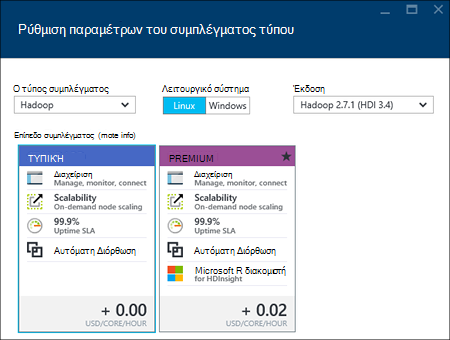
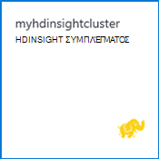

<properties
    pageTitle="Δημιουργία συμπλεγμάτων Hadoop, HBase, καταιγίδας ή τους σε Linux στο HDInsight με την πύλη | Microsoft Azure"
    description="Μάθετε πώς να δημιουργείτε συμπλεγμάτων Hadoop, HBase, καταιγίδας ή τους στο Linux για χρησιμοποιώντας ένα πρόγραμμα περιήγησης web και την πύλη προεπισκόπηση Azure HDInsight."
    services="hdinsight"
    documentationCenter=""
    authors="nitinme"
    manager="jhubbard"
    editor="cgronlun"
    tags="azure-portal"/>

<tags
    ms.service="hdinsight"
    ms.devlang="na"
    ms.topic="article"
    ms.tgt_pltfrm="na"
    ms.workload="big-data"
    ms.date="10/05/2016"
    ms.author="nitinme"/>

#Δημιουργία βάσει Linux συμπλεγμάτων στο με την πύλη Azure HDInsight

[AZURE.INCLUDE [selector](../../includes/hdinsight-selector-create-clusters.md)]

Πύλη του Azure είναι ένα εργαλείο διαχείρισης που βασίζεται στο web για τις υπηρεσίες και τους πόρους που φιλοξενούνται στο Microsoft Azure cloud. Σε αυτό το άρθρο θα μάθετε πώς μπορείτε να δημιουργήσετε συμπλεγμάτων βάσει Linux HDInsight με την πύλη.

## Προαπαιτούμενα στοιχεία

[AZURE.INCLUDE [delete-cluster-warning](../../includes/hdinsight-delete-cluster-warning.md)]

- **Azure μια συνδρομή**. Ανατρέξτε στο θέμα [λήψη Azure δωρεάν δοκιμαστικής έκδοσης](https://azure.microsoft.com/documentation/videos/get-azure-free-trial-for-testing-hadoop-in-hdinsight/).
- __Ένα πρόγραμμα περιήγησης web σύγχρονο__. Πύλη του Azure χρησιμοποιεί HTML5 και Javascript και ενδέχεται να μην λειτουργεί σωστά σε παλαιότερα προγράμματα περιήγησης web.

### Απαιτήσεις για στοιχείο ελέγχου πρόσβασης

[AZURE.INCLUDE [access-control](../../includes/hdinsight-access-control-requirements.md)]

##Δημιουργία συμπλεγμάτων

Πύλη του Azure εκθέτει περισσότερες ιδιότητες σύμπλεγμα. Χρήση προτύπου για τη διαχείριση πόρων Azure, μπορείτε να αποκρύψετε τις πολλές λεπτομέρειες. Για περισσότερες πληροφορίες, ανατρέξτε στο θέμα [Δημιουργία Linux βάσει Hadoop συμπλεγμάτων στο με τη χρήση προτύπων από διαχειριστή πόρων Azure HDInsight](hdinsight-hadoop-create-linux-clusters-arm-templates.md).

1. Είσοδος στην [πύλη του Azure](https://portal.azure.com).

2. Κάντε κλικ στην επιλογή **ΔΗΜΙΟΥΡΓΊΑ**, κάντε κλικ στην επιλογή **Ανάλυση δεδομένων**και, στη συνέχεια, κάντε κλικ στην επιλογή **HDInsight**.

    ![Δημιουργία ενός νέου συμπλέγματος στην πύλη του Azure] (./media/hdinsight-hadoop-create-linux-cluster-portal/HDI.CreateCluster.1.png "Δημιουργία ενός νέου συμπλέγματος στην πύλη του Azure")
3. Πληκτρολογήστε **Το όνομα συμπλέγματος**: αυτό το όνομα πρέπει να είναι μοναδικό καθολικά.
4. Κάντε κλικ στην **επιλογή σύμπλεγμα τύπο**και, στη συνέχεια, επιλέξτε:

    - **Τύπος σύμπλεγμα**: Εάν δεν γνωρίζετε τι πρέπει να επιλέξετε, επιλέξτε **Hadoop**. Είναι τα πιο δημοφιλή τύπος σύμπλεγμα.

        > [AZURE.IMPORTANT] HDInsight συμπλεγμάτων παραδίδεται με διάφορους τύπους, οι οποίοι αντιστοιχούν σε το φόρτο εργασίας ή την τεχνολογία που ρυθμίζεται για το σύμπλεγμα. Δεν υπάρχει υποστηριζόμενη μέθοδος για να δημιουργήσετε ένα σύμπλεγμα που συνδυάζει πολλούς τύπους, όπως καταιγίδας και HBase σε ένα σύμπλεγμα. 

    - **Λειτουργικό σύστημα**: Επιλέξτε **Linux**.
    - **Έκδοση**: Χρησιμοποιήστε την προεπιλεγμένη έκδοση, εάν δεν γνωρίζετε τι πρέπει να επιλέξετε. Για περισσότερες πληροφορίες, ανατρέξτε στο θέμα [εκδόσεις σύμπλεγμα HDInsight](hdinsight-component-versioning.md).
    - **Επίπεδο σύμπλεγμα**: Azure HDInsight παρέχει το προσφορές cloud μεγάλο δεδομένων σε δύο κατηγορίες: τυπική σειρά και Premium σειρά. Για περισσότερες πληροφορίες, ανατρέξτε στο θέμα [βαθμίδες σύμπλεγμα](hdinsight-hadoop-provision-linux-clusters.md#cluster-tiers).
    
    

4. Κάντε κλικ στην **εγγραφή** για να επιλέξετε τη συνδρομή Azure που θα χρησιμοποιηθεί για το σύμπλεγμα.

5. Κάντε κλικ στην **Ομάδα πόρων** για να επιλέξετε μια υπάρχουσα ομάδα πόρων ή κάντε κλικ στην επιλογή **Δημιουργία** για να δημιουργήσετε μια νέα ομάδα πόρων

    > [AZURE.NOTE] Αυτή η καταχώρηση προεπιλεγμένη μία από τις υπάρχουσες ομάδες πόρων, εάν είναι διαθέσιμες.

6. Κάντε κλικ στην επιλογή **διαπιστευτήρια** και, στη συνέχεια, πληκτρολογήστε έναν κωδικό πρόσβασης για το χρήστη του διαχειριστή. Μπορείτε, επίσης, πρέπει να εισαγάγετε ένα **Όνομα SSH χρήστη** και έναν **κωδικό ΠΡΌΣΒΑΣΗΣ** ή **ΔΗΜΌΣΙΟ ΚΛΕΙΔΊ**, το οποίο θα χρησιμοποιηθεί για τον έλεγχο ταυτότητας χρήστη SSH. Χρήση ενός δημόσιου κλειδιού είναι η προτεινόμενη προσέγγιση. Κάντε κλικ στην **επιλογή** κάτω, για να αποθηκεύσετε τη ρύθμιση παραμέτρων διαπιστευτήρια.

    ![Παροχή διαπιστευτηρίων συμπλέγματος] (./media/hdinsight-hadoop-create-linux-cluster-portal/HDI.CreateCluster.3.png "Παροχή διαπιστευτηρίων συμπλέγματος")

    Για περισσότερες πληροφορίες σχετικά με τη χρήση SSH με το HDInsight, ανατρέξτε σε ένα από τα ακόλουθα άρθρα:

    * [Χρήση SSH με βάσει Linux Hadoop σε HDInsight από Linux, Unix ή λειτουργικό σύστημα OS X](hdinsight-hadoop-linux-use-ssh-unix.md)
    * [Χρήση SSH με βάσει Linux Hadoop σε HDInsight από το Windows](hdinsight-hadoop-linux-use-ssh-windows.md)

7. Κάντε κλικ στην επιλογή **Αρχείου προέλευσης δεδομένων** για να επιλέξετε μια υπάρχουσα προέλευση δεδομένων για το σύμπλεγμα ή δημιουργήστε ένα νέο.

    ![Blade αρχείου προέλευσης δεδομένων] (./media/hdinsight-hadoop-create-linux-cluster-portal/HDI.CreateCluster.4.png "Ρύθμιση των παραμέτρων του αρχείου προέλευσης δεδομένων παροχή")

    Αυτήν τη στιγμή, μπορείτε να επιλέξετε ένα λογαριασμό χώρου αποθήκευσης Azure ως προέλευση δεδομένων για ένα σύμπλεγμα HDInsight. Χρησιμοποιήστε τα ακόλουθα για να κατανοήσετε τις καταχωρήσεις σε blade την **Προέλευση δεδομένων** .

    - **Επιλογή μεθόδου**: ορίσετε την επιλογή **από όλες τις συνδρομές** για να ενεργοποιήσετε την περιήγηση σε λογαριασμούς χώρου αποθήκευσης από όλες τις συνδρομές σας. Ορίστε το κλειδί **Πρόσβασης** , αν θέλετε να εισαγάγετε το **Όνομα χώρου αποθήκευσης** και το **Πλήκτρο πρόσβασης** από έναν υπάρχοντα λογαριασμό του χώρου αποθήκευσης.

    - **Επιλέξτε λογαριασμό χώρου αποθήκευσης / δημιουργία**: κάντε κλικ στο κουμπί **Επιλογή λογαριασμού χώρου αποθήκευσης** για να περιηγηθείτε και να επιλέξετε έναν υπάρχοντα λογαριασμό χώρου αποθήκευσης που θέλετε να συσχετίσετε με το σύμπλεγμα. Εναλλακτικά, κάντε κλικ στην επιλογή **Δημιουργία** για να δημιουργήσετε ένα νέο λογαριασμό του χώρου αποθήκευσης. Χρησιμοποιήστε το πεδίο που εμφανίζεται για να εισαγάγετε το όνομα του λογαριασμού χώρου αποθήκευσης. Ένα πράσινο σημάδι ελέγχου εμφανίζεται εάν το όνομα είναι διαθέσιμο.

    - **Επιλέξτε προεπιλεγμένο κοντέινερ**: Χρησιμοποιήστε αυτήν την επιλογή για να εισαγάγετε το όνομα του προεπιλεγμένου κοντέινερ για να χρησιμοποιήσετε για το σύμπλεγμα. Μπορείτε να πληκτρολογήσετε οποιοδήποτε όνομα εδώ, συνιστάται να χρησιμοποιείτε το ίδιο όνομα ως το σύμπλεγμα, ώστε να μπορείτε εύκολα να αναγνωρίσετε ότι το κοντέινερ χρησιμοποιείται για αυτό το συγκεκριμένο σύμπλεγμα.

    - **Θέση**: τη γεωγραφική περιοχή που το λογαριασμό χώρου αποθήκευσης είναι στο ή θα δημιουργηθεί στο.

        > [AZURE.IMPORTANT] Επιλογή της θέση για την προέλευση δεδομένων προεπιλογή θα επίσης να ορίσετε τη θέση του συμπλέγματος HDInsight. Το σύμπλεγμα και προεπιλεγμένο αρχείο προέλευσης δεδομένων πρέπει να βρίσκεται στην ίδια περιοχή.
        
    - **Σύμπλεγμα AAD ταυτότητας**: κατά τη ρύθμιση των παραμέτρων του, κάνετε το σύμπλεγμα προσβάσιμο για τους χώρους αποθήκευσης Azure λίμνης δεδομένων με βάση τη ρύθμιση παραμέτρων AAD.

    Κάντε κλικ στην **επιλογή** για να αποθηκεύσετε τη ρύθμιση παραμέτρων της προέλευσης δεδομένων.

8. Κάντε κλικ στην επιλογή **Βαθμίδες τιμολόγησης κόμβο** για να εμφανίσετε πληροφορίες σχετικά με τους κόμβους που θα δημιουργηθεί για αυτό το σύμπλεγμα. Ορίστε τον αριθμό των κόμβους εργαζόμενου που χρειάζεστε για το σύμπλεγμα. Το εκτιμώμενο κόστος του συμπλέγματος θα εμφανίζεται εντός του blade.

    ![Πληροφορίες για την τιμολόγηση blade βαθμίδες κόμβου] (./media/hdinsight-hadoop-create-linux-cluster-portal/HDI.CreateCluster.5.png "Καθορισμός αριθμού κόμβοι συμπλέγματος")
    
    > [AZURE.IMPORTANT] Εάν σκοπεύετε να υπερβαίνει τα 32 εργαζόμενου κόμβους, είτε στο σύμπλεγμα δημιουργίας ή την κλίμακα του συμπλέγματος μετά τη δημιουργία, στη συνέχεια, πρέπει να επιλέξετε ένα μέγεθος κεφαλής κόμβο με τουλάχιστον 8 πυρήνων και 14GB ram.
    >
    > Για περισσότερες πληροφορίες σχετικά με μεγέθη κόμβο και σχετικές κόστος, ανατρέξτε στο θέμα [HDInsight τις τιμές](https://azure.microsoft.com/pricing/details/hdinsight/).

    Κάντε κλικ στην **επιλογή** για να αποθηκεύσετε τη ρύθμιση παραμέτρων κόμβου τις πληροφορίες τιμολόγησης.

9. Κάντε κλικ στην επιλογή **Προαιρετικό ρύθμισης παραμέτρων** για να επιλέξτε την έκδοση σύμπλεγμα, καθώς και άλλες προαιρετικές ρυθμίσεις όπως η συμμετοχή σε **Εικονικού δικτύου**, τη ρύθμιση του ένα **Εξωτερικό Metastore** για τη διατήρηση δεδομένων για την ομάδα και Oozie, χρήση δέσμης ενεργειών για να προσαρμόσετε ένα σύμπλεγμα για να εγκαταστήσετε προσαρμοσμένα στοιχεία ή χρήση λογαριασμών επιπλέον χώρο αποθήκευσης με το σύμπλεγμα.

    * **Εικονικού δικτύου**: Επιλέξτε μια Azure εικονικού δικτύου και το υποδίκτυο, εάν θέλετε να τοποθετήσετε το σύμπλεγμα σε ένα εικονικό δίκτυο.  

        ![Εικονική blade δικτύου] (./media/hdinsight-hadoop-create-linux-cluster-portal/HDI.CreateCluster.6.png "Καθορισμός λεπτομέρειες εικονικού δικτύου")

        Για πληροφορίες σχετικά με τη χρήση HDInsight με ένα εικονικό δίκτυο, συμπεριλαμβανομένων των απαιτήσεων συγκεκριμένη ρύθμιση παραμέτρων για το εικονικό δίκτυο, ανατρέξτε στο θέμα [δυνατότητες επέκταση HDInsight, χρησιμοποιώντας μια Azure εικονικού δικτύου](hdinsight-extend-hadoop-virtual-network.md).

    * Κάντε κλικ στην επιλογή **Εξωτερικών Metastores** για να καθορίσετε τη βάση δεδομένων SQL που θέλετε να χρησιμοποιήσετε για να αποθηκεύσετε Hive Oozie μετα-δεδομένων και που σχετίζεται με το σύμπλεγμα.
    
        > [AZURE.NOTE] Ρύθμιση παραμέτρων Metastore δεν είναι διαθέσιμη για τους τύπους σύμπλεγμα HBase.

        ![Προσαρμοσμένη metastores blade] (./media/hdinsight-hadoop-create-linux-cluster-portal/HDI.CreateCluster.7.png "Καθορισμός εξωτερικών metastores")

        Για **χρήση ενός υπάρχοντος DB SQL για ομάδα** μετα-δεδομένα, κάντε κλικ στην επιλογή **Ναι**, επιλέξτε μια βάση δεδομένων SQL και, στη συνέχεια, καταχωρήστε το όνομα χρήστη/τον κωδικό πρόσβασης για τη βάση δεδομένων. Επαναλάβετε αυτά τα βήματα εάν θέλετε να **Χρησιμοποιήστε μια υπάρχουσα DB SQL για Oozie μετα-δεδομένα**. Κάντε κλικ στην **επιλογή** έως ότου είστε πίσω στην blade την **Προαιρετική ρύθμιση παραμέτρων** .

        >[AZURE.NOTE] Η βάση δεδομένων Azure SQL που χρησιμοποιείται για την metastore πρέπει να επιτρέπουν συνδεσιμότητας με άλλες υπηρεσίες του Azure, συμπεριλαμβανομένων των Azure HDInsight. Στον πίνακα εργαλείων βάσης δεδομένων Azure SQL, στη δεξιά πλευρά, κάντε κλικ στο όνομα του διακομιστή. Αυτός είναι ο διακομιστής στον οποίο εκτελείται η παρουσία βάσης δεδομένων SQL. Μία φορά είστε στην Προβολή διακομιστή, κάντε κλικ στην επιλογή **Ρύθμιση παραμέτρων**και, στη συνέχεια, για τις **Υπηρεσίες του Azure**, κάντε κλικ στην επιλογή **Ναι**και, στη συνέχεια, κάντε κλικ στην επιλογή **Αποθήκευση**.

        &nbsp;

        > [AZURE.IMPORTANT] Κατά τη δημιουργία ενός metastore, μην κάνετε ένα όνομα βάσης δεδομένων που περιέχει παύλες ή παύλες, καθώς αυτό μπορεί να προκαλέσει η διαδικασία δημιουργίας σύμπλεγμα αποτυχία.

    * **Ενέργειες δέσμης ενεργειών** εάν θέλετε να χρησιμοποιήσετε μια προσαρμοσμένη δέσμη ενεργειών για να προσαρμόσετε ένα σύμπλεγμα, ως το σύμπλεγμα δημιουργείται. Για περισσότερες πληροφορίες σχετικά με τις ενέργειες δέσμης ενεργειών, ανατρέξτε στο θέμα [Προσαρμογή HDInsight συμπλεγμάτων με χρήση δέσμης ενεργειών](hdinsight-hadoop-customize-cluster-linux.md). Στη το blade ενέργειες δέσμης ενεργειών Δώστε τις λεπτομέρειες, όπως φαίνεται στην την εικόνα της οθόνης.

        ![Blade δέσμης ενεργειών] (./media/hdinsight-hadoop-create-linux-cluster-portal/HDI.CreateCluster.8.png "Καθορισμός δέσμης ενεργειών")

    * Κάντε κλικ στην επιλογή **Συνδεδεμένους λογαριασμούς χώρου αποθήκευσης** για να καθορίσετε λογαριασμούς επιπλέον χώρο αποθήκευσης για να συσχετίσετε με το σύμπλεγμα. Στο το blade **Azure αποθήκευσης πλήκτρα** , κάντε κλικ στην επιλογή **Προσθήκη έναν αριθμό-κλειδί χώρου αποθήκευσης**, και, στη συνέχεια, επιλέξτε έναν υπάρχοντα λογαριασμό του χώρου αποθήκευσης ή δημιουργήστε έναν νέο λογαριασμό.

        ![Επιπλέον χώρος αποθήκευσης blade] (./media/hdinsight-hadoop-create-linux-cluster-portal/HDI.CreateCluster.9.png "Καθορισμός επιπλέον χώρο αποθήκευσης λογαριασμών")

        Μπορείτε επίσης να προσθέσετε επιπλέον χώρο αποθήκευσης λογαριασμών μετά τη δημιουργία ενός συμπλέγματος.  Ανατρέξτε στο θέμα [Προσαρμογή Linux βάσει HDInsight συμπλεγμάτων με χρήση δέσμης ενεργειών](hdinsight-hadoop-customize-cluster-linux.md).

        Κάντε κλικ στην **επιλογή** έως ότου είστε πίσω στην το blade **σύμπλεγμα νέα HDInsight** .
        
        Εκτός από το λογαριασμό χώρου αποθήκευσης αντικειμένων Blob, μπορείτε επίσης να συνδέσετε λίμνης δεδομένων Azure stores. Η ρύθμιση παραμέτρων μπορεί να είναι με ρύθμιση των παραμέτρων AAD από την προέλευση δεδομένων όπου έχετε ρυθμίσει τις παραμέτρους του προεπιλεγμένου λογαριασμού χώρου αποθήκευσης και προεπιλεγμένο κοντέινερ.

10. Στην blade το **Νέο σύμπλεγμα HDInsight** , βεβαιωθείτε ότι είναι επιλεγμένο **Pin για να Startboard** και, στη συνέχεια, κάντε κλικ στην επιλογή **Δημιουργία**. Αυτό θα δημιουργήσετε το σύμπλεγμα και να προσθέσετε ένα πλακίδιο για αυτήν την Startboard της πύλης Azure. Το εικονίδιο υποδεικνύει ότι το σύμπλεγμα είναι προμήθεια και θα αλλάξει για να εμφανίσετε το εικονίδιο HDInsight μόλις προμήθεια ολοκληρωθεί.

  	| Κατά την προμήθεια του | Προμήθεια ολοκλήρωσης |
  	| ------------------ | --------------------- |
  	|  |  |

    > [AZURE.NOTE] Θα χρειαστεί κάποιος χρόνος για το σύμπλεγμα να δημιουργηθεί, συνήθως είναι περίπου 15 λεπτά. Χρησιμοποιήστε το πλακίδιο στην το Startboard ή την καταχώρηση **ειδοποιήσεις** στην αριστερή πλευρά της σελίδας για να ελέγξετε τη διαδικασία προετοιμασίας.

11. Μόλις ολοκληρωθεί η διαδικασία δημιουργίας, κάντε κλικ στο πλακίδιο για το σύμπλεγμα από το Startboard να εκκινήσετε το σύμπλεγμα blade. Το σύμπλεγμα blade παρέχει βασικές πληροφορίες σχετικά με το σύμπλεγμα όπως το όνομα, την ομάδα πόρων που ανήκει σε, τη θέση, το λειτουργικό σύστημα, η διεύθυνση URL για το σύμπλεγμα πίνακα εργαλείων, κ.λπ.

    ![Blade συμπλέγματος] (./media/hdinsight-hadoop-create-linux-cluster-portal/HDI.Cluster.Blade.png "Ιδιότητες συμπλέγματος")

    Χρησιμοποιήστε τα ακόλουθα για να κατανοήσετε τα εικονίδια στο επάνω μέρος του blade αυτό και, στην ενότητα **βασικά στοιχεία** :

    * **Ρυθμίσεις** και **Όλες τις ρυθμίσεις**: Εμφανίζει το blade **Ρυθμίσεις** για το σύμπλεγμα, το οποίο σας επιτρέπει να αποκτήσετε πρόσβαση σε αναλυτικές πληροφορίες για το σύμπλεγμα.

    * **Πίνακας εργαλείων** **Πίνακα εργαλείων σύμπλεγμα**και **διεύθυνση URL**: αυτές είναι όλα τρόπους για να αποκτήσετε πρόσβαση σε πίνακα εργαλείων του συμπλέγματος, που είναι μια πύλη Web για να εκτελέσετε εργασίες στο σύμπλεγμα.

    * **Κέλυφος ασφαλούς**: πληροφορίες που χρειάζονται για την πρόσβαση στο σύμπλεγμα χρησιμοποιώντας SSH.

    * **Διαγραφή**: Διαγράφει το σύμπλεγμα HDInsight.

    * **Γρήγορη έναρξη** (): Εμφανίζει τις πληροφορίες που θα σας βοηθήσει να ξεκινήσετε να χρησιμοποιείτε HDInsight.

    * **Οι χρήστες** (): σάς επιτρέπει να ορίσετε δικαιώματα για τη _Διαχείριση της πύλης_ αυτού του συμπλέγματος για άλλους χρήστες στη συνδρομή σας στο Azure.

        > [AZURE.IMPORTANT] Αυτό _μόνο_ επηρεάζει πρόσβασης και δικαιωμάτων για αυτό το σύμπλεγμα στην πύλη του Azure και δεν έχει καμία επίδραση στην ποιος μπορεί να συνδεθείτε ή να υποβάλλουν εργασίες στο σύμπλεγμα HDInsight.

    * **Ετικέτες** (): οι ετικέτες σάς επιτρέπει να ορίσετε ζεύγη κλειδιού/τιμής για να ορίσετε μια προσαρμοσμένη ταξινόμηση με τις υπηρεσίες cloud. Για παράδειγμα, που μπορεί να δημιουργήσετε ένα κλειδί με το όνομα __έργου__και, στη συνέχεια, χρησιμοποιήστε μια τιμή για όλες τις υπηρεσίες που σχετίζονται με ένα συγκεκριμένο έργο.

##Προσαρμογή συμπλεγμάτων

- Ανατρέξτε στο θέμα [Προσαρμογή HDInsight συμπλεγμάτων χρησιμοποιώντας εκκίνησης](hdinsight-hadoop-customize-cluster-bootstrap.md).
- Ανατρέξτε στο θέμα [Προσαρμογή Linux βάσει HDInsight συμπλεγμάτων με χρήση δέσμης ενεργειών](hdinsight-hadoop-customize-cluster-linux.md).

##Διαγραφή του συμπλέγματος

[AZURE.INCLUDE [delete-cluster-warning](../../includes/hdinsight-delete-cluster-warning.md)]

##Επόμενα βήματα

Τώρα που έχετε δημιουργήσει ένα σύμπλεγμα HDInsight με επιτυχία, χρησιμοποιήστε τα παρακάτω για να μάθετε πώς μπορείτε να εργαστείτε με το σύμπλεγμά σας:

###Hadoop συμπλεγμάτων

* [Χρήση της ομάδας με το HDInsight](hdinsight-use-hive.md)
* [Χρήση γουρούνι με HDInsight](hdinsight-use-pig.md)
* [Χρήση MapReduce με HDInsight](hdinsight-use-mapreduce.md)

###HBase συμπλεγμάτων

* [Γρήγορα αποτελέσματα με το HBase σε HDInsight](hdinsight-hbase-tutorial-get-started-linux.md)
* [Ανάπτυξη εφαρμογών Java για HBase σε HDInsight](hdinsight-hbase-build-java-maven-linux.md)

###Καταιγίδας συμπλεγμάτων

* [Ανάπτυξη τοπολογίες Java για καταιγίδας στην HDInsight](hdinsight-storm-develop-java-topology.md)
* [Χρησιμοποιήστε τα στοιχεία Python στο καταιγίδας στην HDInsight](hdinsight-storm-develop-python-topology.md)
* [Ανάπτυξη και εποπτεία τοπολογίες με καταιγίδας στην HDInsight](hdinsight-storm-deploy-monitor-topology-linux.md)

###Τους συμπλεγμάτων

* [Δημιουργήστε μια μεμονωμένη εφαρμογή χρησιμοποιώντας Scala](hdinsight-apache-spark-create-standalone-application.md)
* [Απομακρυσμένη εκτέλεση εργασιών σε ένα σύμπλεγμα τους χρησιμοποιώντας Λίβιος](hdinsight-apache-spark-livy-rest-interface.md)
* [Τους με το BI: Εκτέλεση ανάλυσης αλληλεπιδραστικών δεδομένων με χρήση τους σε HDInsight με εργαλεία Επιχειρηματικής ευφυΐας](hdinsight-apache-spark-use-bi-tools.md)
* [Τους με μηχανικής εκμάθησης: χρήση τους σε HDInsight πρόβλεψη της εστίασης στα αποτελέσματα ελέγχου](hdinsight-apache-spark-machine-learning-mllib-ipython.md)
* [Τους ροής: Χρήση τους σε HDInsight για τη δημιουργία εφαρμογών σε πραγματικό χρόνο ροής](hdinsight-apache-spark-eventhub-streaming.md)
