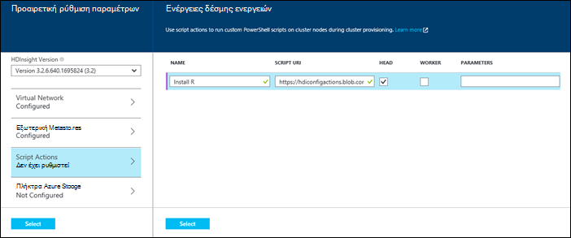
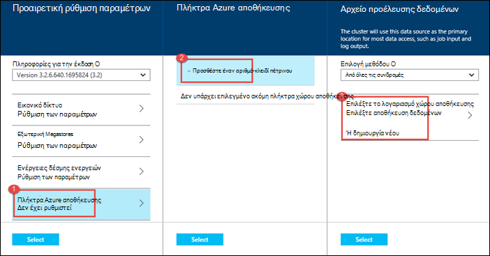

<properties
   pageTitle="Δημιουργία συμπλεγμάτων Hadoop στο HDInsight | Microsoft Azure"
    description="Μάθετε πώς μπορείτε να δημιουργήσετε συμπλεγμάτων για Azure HDInsight, χρησιμοποιώντας την πύλη Azure."
   services="hdinsight"
   documentationCenter=""
   tags="azure-portal"
   authors="mumian"
   manager="jhubbard"
   editor="cgronlun"/>

<tags
   ms.service="hdinsight"
   ms.devlang="na"
   ms.topic="article"
   ms.tgt_pltfrm="na"
   ms.workload="big-data"
   ms.date="09/02/2016"
   ms.author="jgao"/>

# Δημιουργία συμπλεγμάτων που βασίζεται σε Windows Hadoop στο με την πύλη Azure HDInsight

[AZURE.INCLUDE [selector](../../includes/hdinsight-selector-create-clusters.md)]

Μάθετε πώς μπορείτε να δημιουργήσετε ένα σύμπλεγμα Hadoop στο με πύλη Azure HDInsight. Το Microsoft [Azure πύλη](../azure-portal-overview.md) είναι μια κεντρική θέση όπου μπορείτε να προμηθεύσουν και να διαχειριστείτε τους πόρους σας Azure. Πύλη του Azure είναι ένα από τα εργαλεία που μπορείτε να χρησιμοποιήσετε για να δημιουργήσετε είτε Linux βασίζεται ή Windows σύμπλεγμα Hadoop στο HDInsight. Για άλλες δημιουργία συμπλέγματος και εργαλεία που διαθέτει κάντε κλικ στην επιλογή καρτέλα, επιλέξτε στο επάνω μέρος αυτής της σελίδας ή [μεθόδους δημιουργίας σύμπλεγμα](hdinsight-provision-clusters.md#cluster-creation-methods).

##Προαπαιτούμενα στοιχεία:

[AZURE.INCLUDE [delete-cluster-warning](../../includes/hdinsight-delete-cluster-warning.md)]

Πριν να ξεκινήσετε τις οδηγίες σε αυτό το άρθρο, πρέπει να έχετε τα εξής:

- Μια συνδρομή του Azure. Ανατρέξτε στο θέμα [λήψη Azure δωρεάν δοκιμαστικής έκδοσης](https://azure.microsoft.com/documentation/videos/get-azure-free-trial-for-testing-hadoop-in-hdinsight/).

### Απαιτήσεις για στοιχείο ελέγχου πρόσβασης

[AZURE.INCLUDE [access-control](../../includes/hdinsight-access-control-requirements.md)]

## Δημιουργία συμπλεγμάτων

**Για να δημιουργήσετε ένα σύμπλεγμα HDInsight**

1. Είσοδος στην [πύλη του Azure](https://portal.azure.com).
2. Κάντε κλικ στην επιλογή **ΔΗΜΙΟΥΡΓΊΑ**, κάντε κλικ στην επιλογή **Ανάλυση δεδομένων**και, στη συνέχεια, κάντε κλικ στην επιλογή **HDInsight**.

    ![Δημιουργία ενός νέου συμπλέγματος στην πύλη του Azure] (./media/hdinsight-provision-clusters/HDI.CreateCluster.1.png "Δημιουργία ενός νέου συμπλέγματος στην πύλη του Azure")

3. Πληκτρολογήστε ή επιλέξτε τις ακόλουθες τιμές:

    * **Όνομα συμπλέγματος**: Πληκτρολογήστε ένα όνομα για το σύμπλεγμα. Ένα πράσινο σημάδι ελέγχου εμφανίζεται δίπλα στο όνομα του συμπλέγματος εάν είναι διαθέσιμο το όνομα.

    * **Σύμπλεγμα Type**: Επιλέξτε **Hadoop**. Άλλες επιλογές inclue **HBase**, **καταιγίδας**και **τους**.

        > [AZURE.IMPORTANT] HDInsight συμπλεγμάτων παραδίδεται με διάφορους τύπους, οι οποίοι αντιστοιχούν σε το φόρτο εργασίας ή την τεχνολογία που ρυθμίζεται για το σύμπλεγμα. Δεν υπάρχει υποστηριζόμενη μέθοδος για να δημιουργήσετε ένα σύμπλεγμα που συνδυάζει πολλούς τύπους, όπως καταιγίδας και HBase σε ένα σύμπλεγμα.

    * **Σύμπλεγμα λειτουργικό σύστημα**: Επιλέξτε **των Windows**. Για να δημιουργήσετε ένα σύμπλεγμα Linux βάσης, επιλέξτε **Linux**.
    * **Έκδοση**: ανατρέξτε στην ενότητα [HDInsight εκδόσεις](hdinsight-component-versioning.md).
    * **Συνδρομή**: Επιλέξτε τη συνδρομή Azure που θα χρησιμοποιηθεί για τη δημιουργία αυτού του συμπλέγματος.
    * **Ομάδα πόρων**: Επιλέξτε ένα υπάρχον ή να δημιουργήσετε μια νέα ομάδα πόρων. Αυτή η καταχώρηση προεπιλεγμένη μία από τις υπάρχουσες ομάδες πόρων, εάν είναι διαθέσιμες.
    * **Τα διαπιστευτήρια**: ρύθμιση παραμέτρων το όνομα χρήστη και τον κωδικό πρόσβασης για το χρήστη Hadoop (HTTP χρήστη). Εάν ενεργοποιήσετε απομακρυσμένης επιφάνειας εργασίας για το σύμπλεγμα, θα πρέπει να ρυθμίσετε τις παραμέτρους του απομακρυσμένου υπολογιστή χρήστη όνομα χρήστη και τον κωδικό πρόσβασης και μια ημερομηνία λήξης του λογαριασμού. Κάντε κλικ στην **επιλογή** κάτω, για να αποθηκεύσετε τις αλλαγές.

        ![Παροχή διαπιστευτηρίων συμπλέγματος] (./media/hdinsight-provision-clusters/HDI.CreateCluster.3.png "Παροχή διαπιστευτηρίων συμπλέγματος")

    * **Αρχείο προέλευσης δεδομένων**: Δημιουργήστε ένα νέο ή επιλέξτε έναν υπάρχοντα λογαριασμό Azure χώρου αποθήκευσης που θα χρησιμοποιηθεί ως το προεπιλεγμένο σύστημα αρχείων για το σύμπλεγμα.

        ![Blade αρχείου προέλευσης δεδομένων] (./media/hdinsight-provision-clusters/HDI.CreateCluster.4.png "Ρύθμιση των παραμέτρων του αρχείου προέλευσης δεδομένων παροχή")

        * **Επιλογή μεθόδου**: ορίσετε την επιλογή **από όλες τις συνδρομές** για να ενεργοποιήσετε την περιήγηση σε λογαριασμούς χώρου αποθήκευσης από όλες τις συνδρομές σας. Ορίστε το κλειδί **Πρόσβασης** , αν θέλετε να εισαγάγετε το **Όνομα χώρου αποθήκευσης** και το **Πλήκτρο πρόσβασης** από έναν υπάρχοντα λογαριασμό του χώρου αποθήκευσης.
        * **Επιλέξτε λογαριασμό χώρου αποθήκευσης / Δημιουργία νέας**: κάντε κλικ στο κουμπί **Επιλογή λογαριασμού χώρου αποθήκευσης** για να περιηγηθείτε και να επιλέξετε έναν υπάρχοντα λογαριασμό χώρου αποθήκευσης που θέλετε να συσχετίσετε με το σύμπλεγμα. Εναλλακτικά, κάντε κλικ στην επιλογή **Δημιουργία νέου** για να δημιουργήσετε ένα νέο λογαριασμό του χώρου αποθήκευσης. Χρησιμοποιήστε το πεδίο που εμφανίζεται για να εισαγάγετε το όνομα του λογαριασμού χώρου αποθήκευσης. Ένα πράσινο σημάδι ελέγχου εμφανίζεται εάν το όνομα είναι διαθέσιμο.
        * **Επιλέξτε προεπιλεγμένο κοντέινερ**: Χρησιμοποιήστε αυτήν την επιλογή για να εισαγάγετε το όνομα του προεπιλεγμένου κοντέινερ για να χρησιμοποιήσετε για το σύμπλεγμα. Μπορείτε να πληκτρολογήσετε οποιοδήποτε όνομα εδώ, συνιστάται να χρησιμοποιείτε το ίδιο όνομα ως το σύμπλεγμα, ώστε να μπορείτε εύκολα να αναγνωρίσετε ότι το κοντέινερ χρησιμοποιείται για αυτό το συγκεκριμένο σύμπλεγμα.
        * **Θέση**: τη γεωγραφική περιοχή που το λογαριασμό χώρου αποθήκευσης είναι στο ή θα δημιουργηθεί στο. Αυτή η θέση θα καθορίσει τη θέση σύμπλεγμα.  Το σύμπλεγμα και του προεπιλεγμένου λογαριασμού χώρου αποθήκευσης πρέπει να εντοπίσετε από κοινού στο ίδιο κέντρο Azure δεδομένων.
    
    * **Επίπεδα τιμολόγησης κόμβου**: Ορίστε τον αριθμό των κόμβους εργαζόμενου που χρειάζεστε για το σύμπλεγμα. Το εκτιμώμενο κόστος του συμπλέγματος θα εμφανίζεται εντός του blade.
  

        ![Πληροφορίες για την τιμολόγηση blade βαθμίδες κόμβου] (./media/hdinsight-provision-clusters/HDI.CreateCluster.5.png "Καθορισμός αριθμού κόμβοι συμπλέγματος")

    * **Προαιρετική ρύθμιση παραμέτρων** για να επιλέξετε την έκδοση συμπλέγματος, καθώς και άλλες προαιρετικές ρυθμίσεις όπως η συμμετοχή σε **Εικονικού δικτύου**, τη ρύθμιση του ένα **Εξωτερικό Metastore** για τη διατήρηση δεδομένων για την ομάδα και Oozie, χρήση δέσμης ενεργειών για να προσαρμόσετε ένα σύμπλεγμα για να εγκαταστήσετε προσαρμοσμένα στοιχεία ή χρησιμοποιήστε τους λογαριασμούς επιπλέον χώρο αποθήκευσης με το σύμπλεγμα.

    * **Έκδοση HDInsight**: Επιλέξτε την έκδοση που θέλετε να χρησιμοποιήσετε για το σύμπλεγμα. Για περισσότερες πληροφορίες, ανατρέξτε στο θέμα [εκδόσεις σύμπλεγμα HDInsight](hdinsight-component-versioning.md).
    * **Εικονικού δικτύου**: Επιλέξτε μια Azure εικονικού δικτύου και το υποδίκτυο, εάν θέλετε να τοποθετήσετε το σύμπλεγμα σε ένα εικονικό δίκτυο.  

        ![Εικονική blade δικτύου] (./media/hdinsight-provision-clusters/HDI.CreateCluster.6.png "Καθορισμός λεπτομέρειες εικονικού δικτύου")

        Για πληροφορίες σχετικά με τη χρήση HDInsight με ένα εικονικό δίκτυο, συμπεριλαμβανομένων των απαιτήσεων συγκεκριμένη ρύθμιση παραμέτρων για το εικονικό δίκτυο, ανατρέξτε στο θέμα [επέκταση HDInsight capbilities, χρησιμοποιώντας μια Azure εικονικού δικτύου](hdinsight-extend-hadoop-virtual-network.md).
  

        
    * **Εξωτερική Metastores**: Καθορίστε μια βάση δεδομένων Azure SQL για την αποθήκευση Hive Oozie μετα-δεδομένων και που σχετίζεται με το σύμπλεγμα.
 
        > [AZURE.NOTE] Ρύθμιση παραμέτρων Metastore δεν είναι διαθέσιμη για τους τύπους σύμπλεγμα HBase.

    ![Προσαρμοσμένη metastores blade] (./media/hdinsight-provision-clusters/HDI.CreateCluster.7.png "Καθορισμός εξωτερικών metastores")

    Για **χρήση ενός υπάρχοντος DB SQL για ομάδα** μετα-δεδομένα, κάντε κλικ στην επιλογή **Ναι**, επιλέξτε μια βάση δεδομένων SQL και, στη συνέχεια, καταχωρήστε το όνομα χρήστη/τον κωδικό πρόσβασης για τη βάση δεδομένων. Επαναλάβετε αυτά τα βήματα εάν θέλετε να **Χρησιμοποιήστε μια υπάρχουσα DB SQL για Oozie μετα-δεδομένα**. Κάντε κλικ στην **επιλογή** έως ότου είστε πίσω στην blade την **Προαιρετική ρύθμιση παραμέτρων** .

    >[AZURE.NOTE] Η βάση δεδομένων Azure SQL που χρησιμοποιείται για την metastore πρέπει να επιτρέπουν συνδεσιμότητας με άλλες υπηρεσίες του Azure, συμπεριλαμβανομένων των Azure HDInsight. Στον πίνακα εργαλείων βάσης δεδομένων Azure SQL, στη δεξιά πλευρά, κάντε κλικ στο όνομα του διακομιστή. Αυτός είναι ο διακομιστής στον οποίο εκτελείται η παρουσία βάσης δεδομένων SQL. Μία φορά είστε στην Προβολή διακομιστή, κάντε κλικ στην επιλογή **Ρύθμιση παραμέτρων**και, στη συνέχεια, για τις **Υπηρεσίες του Azure**, κάντε κλικ στην επιλογή **Ναι**και, στη συνέχεια, κάντε κλικ στην επιλογή **Αποθήκευση**.

            &nbsp;

            > [AZURE.IMPORTANT] Κατά τη δημιουργία ενός metastore, μην κάνετε ένα όνομα βάσης δεδομένων που περιέχει παύλες ή παύλες, καθώς αυτό μπορεί να προκαλέσει η διαδικασία δημιουργίας σύμπλεγμα αποτυχία.
        
        * **Script Actions** if you want to use a custom script to customize a cluster, as the cluster is being created. For more information about script actions, see [Customize HDInsight clusters using Script Action](hdinsight-hadoop-customize-cluster.md). On the Script Actions blade provide the details as shown in the screen capture.
    

            

        * **Azure Storage Keys**: Specify additional storage accounts to associate with the cluster. In the **Azure Storage Keys** blade, click **Add a storage key**, and then select an existing storage account or create a new account.
    

            

4. Κάντε κλικ στην επιλογή **Δημιουργία**. Επιλογή **Καρφίτσωμα στις Startboard** θα προσθέσει ένα πλακίδιο για το σύμπλεγμα το Startboard της πύλης. Το εικονίδιο υποδεικνύει ότι το σύμπλεγμα δημιουργείται και θα αλλάξει για να εμφανίσετε το εικονίδιο HDInsight μόλις ολοκληρωθεί η δημιουργία.
    
    Θα χρειαστεί κάποιος χρόνος για το σύμπλεγμα να δημιουργηθεί, συνήθως είναι περίπου 15 λεπτά. Χρησιμοποιήστε το πλακίδιο στην το Startboard ή την καταχώρηση **ειδοποιήσεις** στην αριστερή πλευρά της σελίδας για να ελέγξετε τη διαδικασία προετοιμασίας.
    

5. Μόλις ολοκληρωθεί η δημιουργία, κάντε κλικ στο πλακίδιο για το σύμπλεγμα από το Startboard να εκκινήσετε το σύμπλεγμα blade. Το σύμπλεγμα blade παρέχει βασικές πληροφορίες σχετικά με το σύμπλεγμα όπως το όνομα, την ομάδα πόρων που ανήκει σε, τη θέση, το λειτουργικό σύστημα, η διεύθυνση URL για το σύμπλεγμα πίνακα εργαλείων, κ.λπ.

    ![Blade συμπλέγματος] (./media/hdinsight-provision-clusters/HDI.Cluster.Blade.png "Ιδιότητες συμπλέγματος")

    Χρησιμοποιήστε τα ακόλουθα για να κατανοήσετε τα εικονίδια στο επάνω μέρος του blade αυτό και, στην ενότητα **βασικά στοιχεία** :

    * **Ρυθμίσεις** και **Όλες τις ρυθμίσεις**: Εμφανίζει το blade **Ρυθμίσεις** για το σύμπλεγμα, το οποίο σας επιτρέπει να αποκτήσετε πρόσβαση σε αναλυτικές πληροφορίες για το σύμπλεγμα.
    * **Πίνακας εργαλείων** **Πίνακα εργαλείων σύμπλεγμα**και **διεύθυνση URL**: αυτές είναι όλα τρόπους για να αποκτήσετε πρόσβαση σε πίνακα εργαλείων του συμπλέγματος, που είναι μια πύλη Web για να εκτελέσετε εργασίες στο σύμπλεγμα.
    * **Σύνδεση απομακρυσμένης επιφάνειας εργασίας**: σάς επιτρέπει να ενεργοποιούν/απενεργοποιούν απομακρυσμένης επιφάνειας εργασίας σε τους κόμβους συμπλέγματος.
    * **Σύμπλεγμα κλίμακα**: σας επιτρέπει να αλλάξετε τον αριθμό των κόμβους εργαζόμενου για αυτό το σύμπλεγμα.
    * **Διαγραφή**: Διαγράφει το σύμπλεγμα HDInsight.
    * **Γρήγορη έναρξη** (): Εμφανίζει τις πληροφορίες που θα σας βοηθήσει να ξεκινήσετε να χρησιμοποιείτε HDInsight.
    * **Οι χρήστες** (): σάς επιτρέπει να ορίσετε δικαιώματα για τη _Διαχείριση της πύλης_ αυτού του συμπλέγματος για άλλους χρήστες στη συνδρομή σας στο Azure.
    

        > [AZURE.IMPORTANT] Αυτό _μόνο_ επηρεάζει πρόσβασης και δικαιωμάτων για αυτό το σύμπλεγμα στην πύλη και δεν έχει καμία επίδραση στην ποιος μπορεί να συνδεθείτε ή να υποβάλλουν εργασίες στο σύμπλεγμα HDInsight.
        
    * **Ετικέτες** (): οι ετικέτες σάς επιτρέπει να ορίσετε ζεύγη κλειδιού/τιμής για να ορίσετε μια προσαρμοσμένη ταξινόμηση με τις υπηρεσίες cloud. Για παράδειγμα, που μπορεί να δημιουργήσετε ένα κλειδί με το όνομα __έργου__και, στη συνέχεια, χρησιμοποιήστε μια τιμή για όλες τις υπηρεσίες που σχετίζονται με ένα συγκεκριμένο έργο.

##Προσαρμογή συμπλεγμάτων

- Ανατρέξτε στο θέμα [Προσαρμογή HDInsight συμπλεγμάτων χρησιμοποιώντας εκκίνησης](hdinsight-hadoop-customize-cluster-bootstrap.md).
- Ανατρέξτε στο θέμα [Προσαρμογή των Windows βάσει HDInsight συμπλεγμάτων με χρήση δέσμης ενεργειών](hdinsight-hadoop-customize-cluster.md).

##Επόμενα βήματα
Σε αυτό το άρθρο μάθατε διάφορους τρόπους για να δημιουργήσετε ένα σύμπλεγμα HDInsight. Για περισσότερες πληροφορίες, ανατρέξτε στα ακόλουθα άρθρα:

* [Γρήγορα αποτελέσματα με το Azure HDInsight](hdinsight-hadoop-linux-tutorial-get-started.md) - μάθετε πώς μπορείτε να αρχίσετε να εργάζεστε με το σύμπλεγμά σας HDInsight
* [Υποβολή Hadoop έργα μέσω προγραμματισμού](hdinsight-submit-hadoop-jobs-programmatically.md) - μάθετε πώς μπορείτε να υποβάλετε μέσω προγραμματισμού εργασιών με το HDInsight
* [Διαχείριση συμπλεγμάτων Hadoop στο HDInsight, χρησιμοποιώντας την πύλη του Azure](hdinsight-administer-use-management-portal.md)

