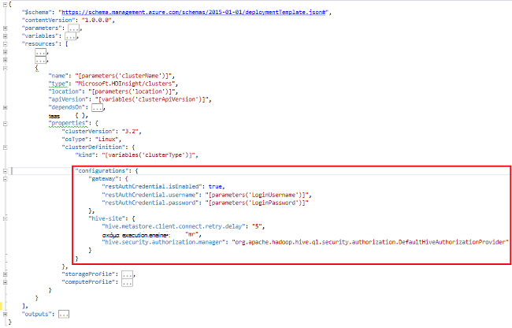

<properties
    pageTitle="Προσαρμογή HDInsight συμπλεγμάτων χρησιμοποιώντας εκκίνησης | Microsoft Azure"
    description="Μάθετε πώς μπορείτε να προσαρμόσετε HDInsight συμπλεγμάτων χρησιμοποιώντας εκκίνησης."
    services="hdinsight"
    documentationCenter=""
    authors="mumian"
    manager="jhubbard"
    editor="cgronlun"
    tags="azure-portal"/>

<tags
    ms.service="hdinsight"
    ms.workload="big-data"
    ms.tgt_pltfrm="na"
    ms.devlang="na"
    ms.topic="article"
    ms.date="09/02/2016"
    ms.author="jgao"/>

# Προσαρμογή HDInsight συμπλεγμάτων χρησιμοποιώντας εκκίνησης

Ορισμένες φορές, που θέλετε να ρυθμίσετε τα αρχεία ρύθμισης παραμέτρων που περιλαμβάνουν:

- clusterIdentity.xml
- site.xml πυρήνα
- Gateway.XML
- hbase env.xml
- hbase site.xml
- hdfs site.xml
- ομάδα env.xml
- ομάδα site.xml
- mapred τοποθεσίας
- oozie site.xml
- oozie env.xml
- site.xml καταιγίδας
- tez site.xml
- webhcat site.xml
- νήματα site.xml

Των συμπλεγμάτων δεν είναι δυνατό να διατηρήσει τις αλλαγές λόγω εκ νέου δημιουργία ειδώλου. Για περισσότερες πληροφορίες σχετικά με την εκ νέου δημιουργία ειδώλου, ανατρέξτε στο θέμα [Ρόλο παρουσία επανεκκίνηση του παράδοσης για αναβαθμίσεις OS](http://blogs.msdn.com/b/kwill/archive/2012/09/19/role-instance-restarts-due-to-os-upgrades.aspx). Για να διατηρήσετε τις αλλαγές μέσω των συμπλεγμάτων διάρκειας ζωής, μπορείτε να χρησιμοποιήσετε προσαρμογής σύμπλεγμα HDInsight κατά τη διαδικασία δημιουργίας. Αυτό είναι το συνιστώμενο τρόπο για να αλλάξετε ρυθμίσεις παραμέτρων συμπλέγματος και παραμένει σε αυτά τα συμβάντα επανεκκίνηση του Azure reimage επανεκκινήστε τον υπολογιστή. Αυτές οι αλλαγές ρύθμισης παραμέτρων εφαρμόζονται πριν από την εκκίνηση της υπηρεσίας, ώστε να χρειάζεται να επανεκκίνηση των υπηρεσιών. 

Υπάρχουν 3 μεθόδους για να χρησιμοποιήσετε εκκίνησης:

- Χρήση του Azure PowerShell

    [AZURE.INCLUDE [upgrade-powershell](../../includes/hdinsight-use-latest-powershell.md)]
    
- Χρήση του .NET SDK
- Χρήση προτύπου για τη διαχείριση πόρων Azure

Για πληροφορίες σχετικά με την εγκατάσταση πρόσθετων στοιχείων σε σύμπλεγμα HDInsight κατά τη διάρκεια της ώρας δημιουργίας, ανατρέξτε στο θέμα:

- [Προσαρμογή συμπλεγμάτων HDInsight με χρήση δέσμης ενεργειών (Linux)](hdinsight-hadoop-customize-cluster-linux.md)
- [Προσαρμογή συμπλεγμάτων HDInsight με χρήση δέσμης ενεργειών (Windows)](hdinsight-hadoop-customize-cluster.md)

## Χρήση του Azure PowerShell

Ο ακόλουθος κώδικας PowerShell προσαρμόζει μια ρύθμιση παραμέτρων της ομάδας:

    # hive-site.xml configuration
    $hiveConfigValues = @{ "hive.metastore.client.socket.timeout"="90" }
    
    $config = New-AzureRmHDInsightClusterConfig `
        | Set-AzureRmHDInsightDefaultStorage `
            -StorageAccountName "$defaultStorageAccountName.blob.core.windows.net" `
            -StorageAccountKey $defaultStorageAccountKey `
        | Add-AzureRmHDInsightConfigValues `
            -HiveSite $hiveConfigValues 
    
    New-AzureRmHDInsightCluster `
        -ResourceGroupName $existingResourceGroupName `
        -ClusterName $clusterName `
        -Location $location `
        -ClusterSizeInNodes $clusterSizeInNodes `
        -ClusterType Hadoop `
        -OSType Windows `
        -Version "3.2" `
        -HttpCredential $httpCredential `
        -Config $config 

Μπορείτε να βρείτε μια ολοκληρωμένη εργασία δέσμη ενεργειών του PowerShell στο [Προσάρτημα-A](#hdinsight-hadoop-customize-cluster-bootstrap.md/appx-a:-powershell-sample).

**Για να επιβεβαιώσετε την αλλαγή:**

1. Πραγματοποιήστε είσοδο [πύλη του Azure](https://portal.azure.com).
2. Στο αριστερό παράθυρο, κάντε κλικ στην επιλογή **Αναζήτηση**και, στη συνέχεια, κάντε κλικ στην επιλογή **Συμπλεγμάτων HDInsight**.
3. Κάντε κλικ στο κουμπί του συμπλέγματος που μόλις δημιουργήσατε χρησιμοποιώντας τη δέσμη ενεργειών PowerShell.
4. Κάντε κλικ στην επιλογή από το επάνω μέρος του blade **πίνακα εργαλείων** για να ανοίξετε το περιβάλλον εργασίας Χρήστη Ambari.
5. Κάντε κλικ στην επιλογή **Hive** από το αριστερό μενού.
6. Κάντε κλικ στην επιλογή **HiveServer2** από **Σύνοψη**.
7. Κάντε κλικ στην καρτέλα **διαμορφώσεων** .
8. Κάντε κλικ στην επιλογή **Hive** από το αριστερό μενού.
9. Κάντε κλικ στην καρτέλα **για προχωρημένους** .
10. Κύλιση προς τα κάτω και, στη συνέχεια, αναπτύξτε το στοιχείο **για προχωρημένους τοποθεσίας ομάδας**.
11. Αναζητήστε **hive.metastore.client.socket.timeout** στην ενότητα.

Ορισμένα δείγματα περισσότερα σχετικά με την προσαρμογή άλλα αρχεία ρύθμισης παραμέτρων:

    # hdfs-site.xml configuration
    $HdfsConfigValues = @{ "dfs.blocksize"="64m" } #default is 128MB in HDI 3.0 and 256MB in HDI 2.1

    # core-site.xml configuration
    $CoreConfigValues = @{ "ipc.client.connect.max.retries"="60" } #default 50

    # mapred-site.xml configuration
    $MapRedConfigValues = @{ "mapreduce.task.timeout"="1200000" } #default 600000

    # oozie-site.xml configuration
    $OozieConfigValues = @{ "oozie.service.coord.normal.default.timeout"="150" }  # default 120

Για περισσότερες πληροφορίες, ανατρέξτε στο θέμα ιστολόγιο του Azim Uddin με τίτλο [Δημιουργία Προσαρμογή σύμπλεγμα HDInsight](http://blogs.msdn.com/b/bigdatasupport/archive/2014/04/15/customizing-hdinsight-cluster-provisioning-via-powershell-and-net-sdk.aspx).

## Χρήση του .NET SDK

Ανατρέξτε στο θέμα [Δημιουργία Linux βάσει συμπλεγμάτων στο HDInsight με το .NET SDK](hdinsight-hadoop-create-linux-clusters-dotnet-sdk.md#use-bootstrap).

## Χρήση της διαχείρισης πόρων προτύπου

Μπορείτε να χρησιμοποιήσετε εκκίνησης στο πρότυπο διαχείριση πόρων:

    "configurations": {
        …
        "hive-site": {
            "hive.metastore.client.connect.retry.delay": "5",
            "hive.execution.engine": "mr",
            "hive.security.authorization.manager": "org.apache.hadoop.hive.ql.security.authorization.DefaultHiveAuthorizationProvider"
        }
    }

## Δείτε επίσης

- [Δημιουργία συμπλεγμάτων Hadoop στο HDInsight] [ hdinsight-provision-cluster] παρέχει οδηγίες σχετικά με τον τρόπο για να δημιουργήσετε ένα σύμπλεγμα HDInsight χρησιμοποιώντας άλλες προσαρμοσμένες επιλογές.
- [Ανάπτυξη δεσμών ενεργειών δέσμης ενεργειών για HDInsight][hdinsight-write-script]
- [Εγκατάσταση και χρήση τους σε HDInsight συμπλεγμάτων][hdinsight-install-spark]
- [Εγκατάσταση και χρήση R στον HDInsight συμπλεγμάτων][hdinsight-install-r]
- [Εγκατάσταση και χρήση συμπλεγμάτων Solr σε HDInsight](hdinsight-hadoop-solr-install.md).
- [Εγκατάσταση και χρήση συμπλεγμάτων Giraph σε HDInsight](hdinsight-hadoop-giraph-install.md).

[hdinsight-install-spark]: hdinsight-hadoop-spark-install.md
[hdinsight-install-r]: hdinsight-hadoop-r-scripts.md
[hdinsight-write-script]: hdinsight-hadoop-script-actions.md
[hdinsight-provision-cluster]: hdinsight-provision-clusters.md
[powershell-install-configure]: powershell-install-configure.md

[img-hdi-cluster-states]: ./media/hdinsight-hadoop-customize-cluster/HDI-Cluster-state.png "Στάδια κατά τη δημιουργία συμπλέγματος"

## Δείγμα Appx A: PowerShell

Αυτή η δέσμη ενεργειών PowerShell δημιουργεί ένα σύμπλεγμα HDInsight και προσαρμόζει μια ρύθμιση ομάδας:

    ####################################
    # Set these variables
    ####################################
    #region - used for creating Azure service names
    $nameToken = "<ENTER AN ALIAS>" 
    #endregion

    #region - cluster user accounts
    $httpUserName = "admin"  #HDInsight cluster username
    $httpPassword = "<ENTER A PASSWORD>" #"<Enter a Password>"

    $sshUserName = "sshuser" #HDInsight ssh user name
    $sshPassword = "<ENTER A PASSWORD>" #"<Enter a Password>"
    #endregion

    ####################################
    # Service names and varialbes
    ####################################
    #region - service names
    $namePrefix = $nameToken.ToLower() + (Get-Date -Format "MMdd")

    $resourceGroupName = $namePrefix + "rg"
    $hdinsightClusterName = $namePrefix + "hdi"
    $defaultStorageAccountName = $namePrefix + "store"
    $defaultBlobContainerName = $hdinsightClusterName

    $location = "East US 2"
    #endregion

    # Treat all errors as terminating
    $ErrorActionPreference = "Stop"

    ####################################
    # Connect to Azure
    ####################################
    #region - Connect to Azure subscription
    Write-Host "`nConnecting to your Azure subscription ..." -ForegroundColor Green
    try{Get-AzureRmContext}
    catch{Login-AzureRmAccount}
    #endregion

    #region - Create an HDInsight cluster
    ####################################
    # Create dependent components
    ####################################
    Write-Host "Creating a resource group ..." -ForegroundColor Green
    New-AzureRmResourceGroup `
        -Name  $resourceGroupName `
        -Location $location

    Write-Host "Creating the default storage account and default blob container ..."  -ForegroundColor Green
    New-AzureRmStorageAccount `
        -ResourceGroupName $resourceGroupName `
        -Name $defaultStorageAccountName `
        -Location $location `
        -Type Standard_GRS

    $defaultStorageAccountKey = (Get-AzureRmStorageAccountKey `
                                    -ResourceGroupName $resourceGroupName `
                                    -Name $defaultStorageAccountName)[0].Value
    $defaultStorageContext = New-AzureStorageContext `
                                    -StorageAccountName $defaultStorageAccountName `
                                    -StorageAccountKey $defaultStorageAccountKey
    New-AzureStorageContainer `
        -Name $defaultBlobContainerName `
        -Context $defaultStorageContext #use the cluster name as the container name

    ####################################
    # Create a configuration object
    ####################################
    $hiveConfigValues = @{ "hive.metastore.client.socket.timeout"="90" }
        
    $config = New-AzureRmHDInsightClusterConfig `
        | Set-AzureRmHDInsightDefaultStorage `
            -StorageAccountName "$defaultStorageAccountName.blob.core.windows.net" `
            -StorageAccountKey $defaultStorageAccountKey `
        | Add-AzureRmHDInsightConfigValues `
            -HiveSite $hiveConfigValues 

    ####################################
    # Create an HDInsight cluster
    ####################################
    $httpPW = ConvertTo-SecureString -String $httpPassword -AsPlainText -Force
    $httpCredential = New-Object System.Management.Automation.PSCredential($httpUserName,$httpPW)

    $sshPW = ConvertTo-SecureString -String $sshPassword -AsPlainText -Force
    $sshCredential = New-Object System.Management.Automation.PSCredential($sshUserName,$sshPW)

    New-AzureRmHDInsightCluster `
        -ResourceGroupName $resourceGroupName `
        -ClusterName $hdinsightClusterName `
        -Location $location `
        -ClusterSizeInNodes 1 `
        -ClusterType Hadoop `
        -OSType Linux `
        -Version "3.2" `
        -HttpCredential $httpCredential `
        -SshCredential $sshCredential `
        -Config $config

    ####################################
    # Verify the cluster
    ####################################
    Get-AzureRmHDInsightCluster -ClusterName $hdinsightClusterName

    #endregion
