<properties
    pageTitle="Προσαρμογή με χρήση δέσμης ενεργειών συμπλεγμάτων HDInsight | Microsoft Azure"
    description="Μάθετε πώς μπορείτε να προσθέσετε προσαρμοσμένα στοιχεία σε συμπλεγμάτων βάσει Linux HDInsight χρήση δέσμης ενεργειών. Ενέργειες δέσμης ενεργειών είναι πάρτι δέσμες ενεργειών που στους κόμβους συμπλέγματος και μπορεί να χρησιμοποιηθεί για να προσαρμόσετε τη ρύθμιση παραμέτρων του συμπλέγματος ή να προσθέσετε επιπλέον υπηρεσίες και βοηθητικά προγράμματα όπως απόχρωση, Solr ή R."
    services="hdinsight"
    documentationCenter=""
    authors="Blackmist"
    manager="jhubbard"
    editor="cgronlun"
    tags="azure-portal"/>

<tags
    ms.service="hdinsight"
    ms.workload="big-data"
    ms.tgt_pltfrm="na"
    ms.devlang="na"
    ms.topic="article"
    ms.date="09/06/2016"
    ms.author="larryfr"/>

# Προσαρμογή συμπλεγμάτων βάσει Linux HDInsight με χρήση δέσμης ενεργειών

HDInsight παρέχει μια επιλογή ρύθμισης παραμέτρων που ονομάζεται **Ενέργεια δέσμη ενεργειών** που καλεί προσαρμοσμένων δεσμών ενεργειών που να προσαρμόσετε το σύμπλεγμα. Αυτές οι δέσμες ενεργειών μπορούν να χρησιμοποιηθούν κατά τη δημιουργία συμπλέγματος ή σε ένα σύμπλεγμα ήδη εκτελείται και χρησιμοποιούνται για να εγκαταστήσετε πρόσθετα στοιχεία ή να αλλάξετε τις ρυθμίσεις παραμέτρων.

> [AZURE.NOTE] Η δυνατότητα χρήσης δέσμης ενεργειών σε ένα σύμπλεγμα εκτελείται ήδη διατίθεται μόνο για συμπλεγμάτων βάσει Linux HDInsight. Για πληροφορίες σχετικά με τη χρήση δέσμης ενεργειών με συμπλεγμάτων που βασίζεται στα Windows, ανατρέξτε στο θέμα [Προσαρμογή HDInsight συμπλεγμάτων με χρήση δέσμης ενεργειών (Windows)](hdinsight-hadoop-customize-cluster.md).

Ενέργειες δέσμης ενεργειών μπορείτε επίσης να δημοσιεύσετε το Azure Marketplace ως εφαρμογή HDInsight. Ορισμένα από τα παραδείγματα σε αυτό το έγγραφο δείχνουν πώς μπορείτε να εγκαταστήσετε μια εφαρμογή HDInsight χρησιμοποιώντας τις εντολές ενέργεια δέσμης ενεργειών από το PowerShell και το .NET SDK. Για περισσότερες πληροφορίες σχετικά με τις αιτήσεις HDInsight, ανατρέξτε στο θέμα [Δημοσίευση HDInsight εφαρμογές σε το Azure Marketplace](hdinsight-apps-publish-applications.md). 

## Κατανόηση των δέσμης ενεργειών

Μια ενέργεια δέσμη ενεργειών είναι απλώς ένα πάρτι δέσμη ενεργειών που παρέχει μια διεύθυνση URL προς και τις παραμέτρους για και, στη συνέχεια, είναι εκτελέσατε σε τους κόμβους συμπλέγματος HDInsight. Οι παρακάτω είναι χαρακτηριστικά και τις δυνατότητες της δέσμης ενεργειών.

* Πρέπει να αποθηκεύονται σε ένα URI που είναι προσβάσιμη από το σύμπλεγμα HDInsight. Ακολουθούν θέσεις αποθήκευσης πιθανές:

    * Ένα λογαριασμό χώρο αποθήκευσης αντικειμένων blob που μπορεί να είναι είτε το πρωτεύον ή επιπλέον χώρου αποθήκευσης λογαριασμού για το σύμπλεγμα HDInsight. Επειδή το HDInsight έχει εκχωρηθεί πρόσβαση και τα δύο από αυτούς τους τύπους λογαριασμών αποθήκευσης κατά τη δημιουργία συμπλέγματος, αυτά αποτελούν έναν τρόπο για να χρησιμοποιήσετε μια ενέργεια μη δημόσιο δέσμης ενεργειών.
    
    * Ένα κοινό αναγνώσιμο URI όπως ένα Azure Blob, GitHub, OneDrive, Dropbox, κ.λπ.
    
    Για παραδείγματα του URI για δέσμες ενεργειών που είναι αποθηκευμένα στο κοντέινερ αντικειμένων blob (στο κοινό αναγνώσιμα), ανατρέξτε στην ενότητα [δέσμες ενεργειών ενέργεια δέσμη ενεργειών παράδειγμα](#example-script-action-scripts) .

* Μπορεί να περιοριστεί για να __εκτελέσετε σε μόνο ορισμένων τύπων κόμβο__, για παράδειγμα κεφαλής κόμβους ή κόμβους εργασίας.

    > [AZURE.NOTE] Όταν χρησιμοποιείται με HDInsight Premium, μπορείτε να καθορίσετε ότι πρέπει να χρησιμοποιείται η δέσμη ενεργειών στον κόμβο άκρο.

* Μπορεί να __διατηρηθεί__ ή __ad hoc__.

    Οι δέσμες ενεργειών __Persisted__ είναι δέσμες ενεργειών που εφαρμόζονται σε κόμβους εργαζόμενου και θα εκτελέσατε αυτόματα στη νέα κόμβους που δημιουργήσατε κατά την κλιμάκωση προς ένα σύμπλεγμα.

    Μια δέσμη ενεργειών μόνιμων ενδέχεται να ισχύουν επίσης τις αλλαγές σε έναν άλλο τύπο κόμβου, όπως μια κεφαλή κόμβο, αλλά από μια προοπτική λειτουργίες είναι ο μόνος λόγος για να διατηρηθούν μια δέσμη ενεργειών, ώστε να ισχύει για το νέο εργαζόμενου κόμβους που δημιουργούνται όταν γίνεται κλιμάκωση ένα σύμπλεγμα ανάληψη.

    > [AZURE.IMPORTANT] Ενέργειες μόνιμων δέσμης ενεργειών πρέπει να έχετε ένα μοναδικό όνομα.

    Δεν διατηρούνται __ad hoc__ δέσμες ενεργειών; Ωστόσο, μπορείτε να ανοίξει Προβιβασμός μιας ad hoc δέσμης ενεργειών σε μια δέσμη ενεργειών μόνιμων ή υποβιβασμός μιας μόνιμων δέσμης ενεργειών σε μια ad hoc δέσμη ενεργειών.

    > [AZURE.IMPORTANT] Ενέργειες δέσμης ενεργειών που χρησιμοποιείται κατά τη δημιουργία συμπλέγματος διατηρούνται αυτόματα.
    >
    > Δέσμες ενεργειών που ΑΠΟΤΥΧΙΑ δεν είναι σταθερές, ακόμα και αν συγκεκριμένα υποδείξετε ότι πρέπει να είναι.

* Να αποδεχτείτε __τις παραμέτρους__ που χρησιμοποιούνται από τη δέσμη ενεργειών κατά την εκτέλεση.

* Είναι εκτελέσατε με __root δικαιώματα επιπέδου__ σε τους κόμβους συμπλέγματος.

* Μπορούν να χρησιμοποιηθούν μέσω του __Azure πύλη__, __Azure PowerShell__, __Azure CLI__ή __HDInsight.NET SDK__

    [AZURE.INCLUDE [upgrade-powershell](../../includes/hdinsight-use-latest-powershell-cli-and-dotnet-sdk.md)]

Για να βοηθηθείτε στην κατανόηση ποιες δέσμες ενεργειών έχουν εφαρμοστεί σε ένα σύμπλεγμα και για τον καθορισμό του Αναγνωριστικού των δεσμών ενεργειών για Προβιβασμός ή υποβιβασμός, το σύμπλεγμα διατηρεί ένα ιστορικό των όλες τις δέσμες ενεργειών που έχουν εκτελέσατε.

> [AZURE.IMPORTANT] Δεν υπάρχει αυτόματος τρόπος για να αναιρέσετε τις αλλαγές που έγιναν από μια ενέργεια δέσμη ενεργειών. Εάν χρειάζεστε για να αναστρέψετε το εφέ μιας δέσμης ενεργειών, που πρέπει να κατανοήσετε τις αλλαγές που έγιναν και με μη αυτόματο τρόπο αντίστροφη τους (ή παρέχουν μια ενέργεια δέσμη ενεργειών που αντιστρέφει τους.)

### Ενέργεια δέσμη ενεργειών στη διαδικασία δημιουργίας συμπλέγματος

Ενέργειες δέσμης ενεργειών που χρησιμοποιείται κατά τη δημιουργία συμπλέγματος είναι λίγο διαφορετικά από ενέργειες εκτελέσατε σε ένα υπάρχον σύμπλεγμα δέσμη ενεργειών:

* Η δέσμη ενεργειών είναι __αυτόματα διατηρηθεί__.

* __Αποτυχία__ στη δέσμη ενεργειών μπορεί να προκαλέσει η διαδικασία δημιουργίας σύμπλεγμα αποτυχία.

Το παρακάτω διάγραμμα παρουσιάζει όταν εκτελείται κατά τη διαδικασία δημιουργίας δέσμης ενεργειών:

![Προσαρμογή σύμπλεγμα HDInsight και τα στάδια κατά τη δημιουργία συμπλέγματος][img-hdi-cluster-states]

Η δέσμη ενεργειών είναι εκτελέσατε ενώ γίνεται ρύθμιση παραμέτρων HDInsight. Σε αυτό το στάδιο, η δέσμη ενεργειών είναι εκτελέσατε παράλληλα σε όλους τους κόμβους καθορισμένο στο σύμπλεγμα και είναι εκτελέσατε με δικαιώματα ρίζας σε τους κόμβους.

> [AZURE.NOTE] Επειδή η δέσμη ενεργειών είναι εκτελέσατε με δικαιωμάτων επιπέδου ρίζας σε τους κόμβους συμπλέγματος, μπορείτε να εκτελέσετε λειτουργίες όπως διακοπή και εκκίνηση των υπηρεσιών, συμπεριλαμβανομένων των υπηρεσιών που σχετίζονται με το Hadoop. Εάν διακόψετε υπηρεσίες, πρέπει να βεβαιωθείτε ότι η υπηρεσία Ambari και άλλες υπηρεσίες που σχετίζονται με το Hadoop είναι εγκατάσταση και λειτουργία πριν ολοκληρωθεί η εκτέλεση του τη δέσμη ενεργειών. Για να καθορίσετε με επιτυχία την εύρυθμη λειτουργία και την κατάσταση του συμπλέγματος ενώ δημιουργείται απαιτούνται αυτές τις υπηρεσίες.

Κατά τη δημιουργία συμπλέγματος, μπορείτε να καθορίσετε πολλές ενέργειες δέσμης ενεργειών που καλούνται με τη σειρά με την οποία καθορίστηκαν.

> [AZURE.IMPORTANT] Πρέπει να ολοκληρώσετε ενέργειες δέσμης ενεργειών μέσα σε 60 λεπτά ή θα χρονικού ορίου. Κατά την προμήθεια του συμπλέγματος, η δέσμη ενεργειών είναι εκτελέσατε ταυτόχρονα με άλλα διεργασίες εγκατάσταση και ρύθμιση παραμέτρων. Ανταγωνισμό για τους πόρους, όπως το εύρος ζώνης δικτύου ή χρόνου CPU μπορεί να προκαλέσει τη δέσμη ενεργειών για να διαρκέσει περισσότερο μέχρι να ολοκληρωθεί από ό, τι στο περιβάλλον ανάπτυξής σας.
>
> Για να ελαχιστοποιήσετε το χρόνο που χρειάζεται για να εκτελέσετε τη δέσμη ενεργειών, αποφύγετε εργασίες όπως λήψη και μεταγλώττιση εφαρμογές από το αρχείο προέλευσης. Αντί για αυτό, μεταγλώττιση πριν από την εφαρμογή και να αποθηκεύσετε το δυαδικό αρχείο στο χώρο αποθήκευσης αντικειμένων Blob του Azure, έτσι ώστε να μπορούν να ληφθούν γρήγορα στο σύμπλεγμα.

###Ενέργεια δέσμη ενεργειών σε ένα σύμπλεγμα που εκτελείται

Σε αντίθεση με δέσμη ενεργειών εκτελέσατε ενέργειες που χρησιμοποιείται κατά τη δημιουργία συμπλέγματος, αποτυχία σε μια δέσμη ενεργειών σε ένα σύμπλεγμα ήδη εκτελείται αυτόματα προκαλεί το σύμπλεγμα για να αλλάξετε σε κατάσταση αποτυχίας. Μόλις ολοκληρωθεί μια δέσμη ενεργειών, το σύμπλεγμα πρέπει να επιστρέψετε σε μια κατάσταση "Εκτέλεση".

> [AZURE.IMPORTANT] Αυτό δεν σημαίνει ότι το σύμπλεγμά σας εκτελείται είναι επηρεάζονται σε δέσμες ενεργειών που εσφαλμένες πράγματα. Για παράδειγμα, μια δέσμη ενεργειών θα μπορούσε να διαγράψετε αρχεία που απαιτούνται από το σύμπλεγμα, αλλαγή ρύθμισης παραμέτρων, έτσι ώστε οι υπηρεσίες αποτύχουν, κ.λπ.
>
> Δέσμες ενεργειών ενέργειες εκτελούνται με δικαιώματα ρίζας, έτσι θα πρέπει να βεβαιωθείτε ότι γνωρίζετε τι κάνει μια δέσμη ενεργειών, πριν από την εφαρμογή του για να το σύμπλεγμά σας.

Κατά την εφαρμογή μιας δέσμης ενεργειών σε ένα σύμπλεγμα, το μέλος συμπλέγματος αλλαγή να __εκτελείται__ σε __αποδεκτοί__, στη συνέχεια, __Ρύθμιση παραμέτρων HDInsight__, και τέλος πίσω στην __Εκτέλεση__ για επιτυχή δεσμών ενεργειών. Η κατάσταση δέσμης ενεργειών είναι συνδεδεμένος στο ιστορικό δέσμης ενεργειών και μπορείτε να το χρησιμοποιήσετε για να προσδιορίσετε εάν η δέσμη ενεργειών ολοκληρώθηκε με επιτυχία ή απέτυχε. Για παράδειγμα, το `Get-AzureRmHDInsightScriptActionHistory` cmdlet του PowerShell μπορεί να χρησιμοποιηθεί για την προβολή της κατάστασης μιας δέσμης ενεργειών. Θα επιστρέψει πληροφορίες παρόμοιο με το εξής:

    ScriptExecutionId : 635918532516474303
    StartTime         : 2/23/2016 7:40:55 PM
    EndTime           : 2/23/2016 7:41:05 PM
    Status            : Succeeded

> [AZURE.NOTE] Εάν έχετε αλλάξει τον κωδικό πρόσβασης του χρήστη (διαχειριστές) σύμπλεγμα μετά τη δημιουργία του συμπλέγματος, αυτό μπορεί να προκαλέσει δέσμης ενεργειών εκτελέστηκαν αυτό το σύμπλεγμα αποτυχία. Εάν έχετε οποιεσδήποτε ενέργειες μόνιμων δέσμης ενεργειών που κόμβους εργασίας προορισμού, αυτά ενδέχεται να αποτύχει όταν προσθέτετε κόμβους στο σύμπλεγμα μέσω αλλαγή μεγέθους λειτουργίες.

## Παράδειγμα δέσμες ενεργειών δέσμης ενεργειών

Δέσμες ενεργειών δέσμης ενεργειών μπορούν να χρησιμοποιηθούν από την πύλη Azure, Azure PowerShell, Azure CLI ή το .NET SDK HDInsight. HDInsight παρέχει δέσμες ενεργειών για να εγκαταστήσετε τα ακόλουθα στοιχεία σε HDInsight συμπλεγμάτων:

Όνομα | Δέσμη ενεργειών
----- | -----
**Προσθήκη λογαριασμού χώρου αποθήκευσης Azure** | https://hdiconfigactions.blob.Core.Windows.NET/linuxaddstorageaccountv01/Add-Storage-Account-v01.Sh. Ανατρέξτε στο θέμα [εφαρμογή μιας ενέργειας δέσμης ενεργειών σε ένα σύμπλεγμα εκτελείται](#apply-a-script-action-to-a-running-cluster).
**Εγκατάσταση απόχρωση** | https://hdiconfigactions.blob.Core.Windows.NET/linuxhueconfigactionv02/Install-hue-uber-v02.Sh. Ανατρέξτε στο θέμα [εγκατάσταση και χρήση συμπλεγμάτων απόχρωση σε HDInsight](hdinsight-hadoop-hue-linux.md).
**Εγκατάσταση R** | https://hdiconfigactions.blob.Core.Windows.NET/linuxrconfigactionv01/r-Installer-v01.Sh. Ανατρέξτε στο θέμα [εγκατάσταση και χρήση R σε συμπλεγμάτων HDInsight](hdinsight-hadoop-r-scripts-linux.md).
**Εγκατάσταση Solr** | https://hdiconfigactions.blob.Core.Windows.NET/linuxsolrconfigactionv01/solr-Installer-v01.Sh. Ανατρέξτε στο θέμα [εγκατάσταση και χρήση συμπλεγμάτων Solr σε HDInsight](hdinsight-hadoop-solr-install-linux.md).
**Εγκατάσταση Giraph** | https://hdiconfigactions.blob.Core.Windows.NET/linuxgiraphconfigactionv01/giraph-Installer-v01.Sh. Ανατρέξτε στο θέμα [εγκατάσταση και χρήση συμπλεγμάτων Giraph σε HDInsight](hdinsight-hadoop-giraph-install-linux.md).
| **Προ-φόρτωση ομάδας βιβλιοθηκών** | https://hdiconfigactions.blob.Core.Windows.NET/linuxsetupcustomhivelibsv01/Setup-customhivelibs-v01.Sh. Ανατρέξτε στο θέμα [Προσθήκη ομάδας βιβλιοθηκών σε HDInsight συμπλεγμάτων](hdinsight-hadoop-add-hive-libraries.md) |

## Χρησιμοποιήστε μια ενέργεια δέσμης ενεργειών κατά τη δημιουργία συμπλέγματος

Αυτή η ενότητα παρέχει παραδείγματα σχετικά με τους διαφορετικούς τρόπους που μπορείτε να χρησιμοποιήσετε ενέργειες δέσμης ενεργειών κατά τη δημιουργία ενός συμπλέγματος HDInsight - από την πύλη Azure, χρησιμοποιώντας ένα πρότυπο από διαχειριστή πόρων Azure, με χρήση των cmdlet του PowerShell και χρησιμοποιώντας το .NET SDK.

### Χρησιμοποιήστε μια ενέργεια δέσμης ενεργειών κατά τη δημιουργία συμπλέγματος από την πύλη του Azure

1. Ξεκινήστε τη δημιουργία ένα σύμπλεγμα, όπως περιγράφεται στην [συμπλεγμάτων δημιουργία Hadoop στο HDInsight](hdinsight-provision-clusters.md#portal).

2. Στην περιοχή __Προαιρετικά ρύθμισης παραμέτρων__για το blade **Ενέργειες δέσμης ενεργειών** , κάντε κλικ στην επιλογή **Προσθήκη ενέργειας δέσμη ενεργειών** για την παροχή λεπτομερειών σχετικά με την ενέργεια δέσμη ενεργειών, όπως φαίνεται παρακάτω:

    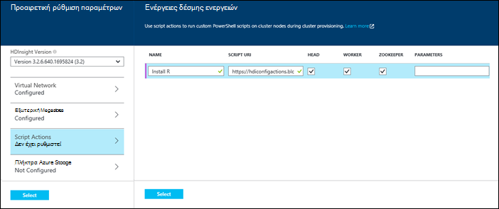

  	| Ιδιότητα | Τιμή |
  	| -------- | ----- |
  	| Όνομα | Καθορίστε ένα όνομα για την ενέργεια δέσμης ενεργειών. |
  	| Δέσμη ενεργειών URI | Καθορίστε το URI στη δέσμη ενεργειών που καλείται για να προσαρμόσετε το σύμπλεγμα. |
  	| Προϊστάμενος/εργαζόμενου | Καθορίστε τους κόμβους (**κεφαλής**, **εργαζόμενου**ή **ZooKeeper**) στην οποία εκτελείται η δέσμη ενεργειών προσαρμογής. |
  	| Παράμετροι | Καθορίστε τις παραμέτρους, εάν απαιτείται από τη δέσμη ενεργειών. |

    Πατήστε το πλήκτρο ENTER για να προσθέσετε περισσότερες από μία ενέργεια δέσμη ενεργειών για την εγκατάσταση πολλών στοιχείων στο σύμπλεγμα.

3. Κάντε κλικ στην **επιλογή** για να αποθηκεύσετε τη ρύθμιση παραμέτρων και να συνεχίσετε με τη δημιουργία συμπλέγματος.

### Χρησιμοποιήστε μια ενέργεια δέσμης ενεργειών από τα πρότυπα διαχείρισης πόρων Azure

Σε αυτήν την ενότητα, μπορούμε να χρησιμοποιήσουμε διαχείριση πόρων Azure πρότυπα για να δημιουργήσετε ένα σύμπλεγμα HDInsight και επίσης να χρησιμοποιήσετε μια ενέργεια δέσμη ενεργειών για την εγκατάσταση προσαρμοσμένα στοιχεία (R, σε αυτό το παράδειγμα) στο σύμπλεγμα. Αυτή η ενότητα παρέχει ένα δείγμα προτύπου για να δημιουργήσετε ένα σύμπλεγμα με χρήση δέσμης ενεργειών.

> [AZURE.NOTE] Τα βήματα σε αυτήν την ενότητα δείχνουν τη δημιουργία ένα σύμπλεγμα χρησιμοποιώντας μια ενέργεια δέσμης ενεργειών. Για ένα παράδειγμα της δημιουργίας ενός συμπλέγματος από ένα πρότυπο με μια εφαρμογή HDInsight, ανατρέξτε στο θέμα [εγκατάσταση προσαρμοσμένες εφαρμογές HDInsight](hdinsight-apps-install-custom-applications.md).

#### Πριν ξεκινήσετε

* Για πληροφορίες σχετικά με τη ρύθμιση των παραμέτρων ενός σταθμούς εργασίας για να εκτελέσετε HDInsight Powershell cmdlet, ανατρέξτε στο θέμα [εγκατάσταση και ρύθμιση παραμέτρων Azure PowerShell](../powershell-install-configure.md).
* Για οδηγίες σχετικά με τη δημιουργία προτύπων, ανατρέξτε στο θέμα [Διαχείριση πόρων σύνταξης Azure πρότυπα](../resource-group-authoring-templates.md).
* Εάν δεν έχετε ήδη χρησιμοποιήσει Azure PowerShell με τη διαχείριση πόρων, ανατρέξτε στο θέμα [Χρήση του PowerShell Azure με τη διαχείριση πόρων Azure](../powershell-azure-resource-manager.md).

#### Δημιουργία συμπλεγμάτων με χρήση δέσμης ενεργειών

1. Αντιγράψτε το ακόλουθο πρότυπο σε μια θέση στον υπολογιστή σας. Αυτό το πρότυπο εγκαθιστά Giraph σε το headnodes καθώς και εργαζόμενου κόμβους του συμπλέγματος. Μπορείτε επίσης να επαληθεύσετε εάν το πρότυπο JSON είναι έγκυρο. Επικόλληση του περιεχομένου προτύπου στην [JSONLint](http://jsonlint.com/), ένα ηλεκτρονικό εργαλείο επικύρωσης JSON.

            {
            "$schema": "http://schema.management.azure.com/schemas/2015-01-01/deploymentTemplate.json#",
            "contentVersion": "1.0.0.0",
            "parameters": {
                "clusterLocation": {
                    "type": "string",
                    "defaultValue": "West US",
                    "allowedValues": [ "West US" ]
                },
                "clusterName": {
                    "type": "string"
                },
                "clusterUserName": {
                    "type": "string",
                    "defaultValue": "admin"
                },
                "clusterUserPassword": {
                    "type": "securestring"
                },
                "sshUserName": {
                    "type": "string",
                    "defaultValue": "username"
                },
                "sshPassword": {
                    "type": "securestring"
                },
                "clusterStorageAccountName": {
                    "type": "string"
                },
                "clusterStorageAccountResourceGroup": {
                    "type": "string"
                },
                "clusterStorageType": {
                    "type": "string",
                    "defaultValue": "Standard_LRS",
                    "allowedValues": [
                        "Standard_LRS",
                        "Standard_GRS",
                        "Standard_ZRS"
                    ]
                },
                "clusterStorageAccountContainer": {
                    "type": "string"
                },
                "clusterHeadNodeCount": {
                    "type": "int",
                    "defaultValue": 1
                },
                "clusterWorkerNodeCount": {
                    "type": "int",
                    "defaultValue": 2
                }
            },
            "variables": {
            },
            "resources": [
                {
                    "name": "[parameters('clusterStorageAccountName')]",
                    "type": "Microsoft.Storage/storageAccounts",
                    "location": "[parameters('clusterLocation')]",
                    "apiVersion": "2015-05-01-preview",
                    "dependsOn": [ ],
                    "tags": { },
                    "properties": {
                        "accountType": "[parameters('clusterStorageType')]"
                    }
                },
                {
                    "name": "[parameters('clusterName')]",
                    "type": "Microsoft.HDInsight/clusters",
                    "location": "[parameters('clusterLocation')]",
                    "apiVersion": "2015-03-01-preview",
                    "dependsOn": [
                        "[concat('Microsoft.Storage/storageAccounts/', parameters('clusterStorageAccountName'))]"
                    ],
                    "tags": { },
                    "properties": {
                        "clusterVersion": "3.2",
                        "osType": "Linux",
                        "clusterDefinition": {
                            "kind": "hadoop",
                            "configurations": {
                                "gateway": {
                                    "restAuthCredential.isEnabled": true,
                                    "restAuthCredential.username": "[parameters('clusterUserName')]",
                                    "restAuthCredential.password": "[parameters('clusterUserPassword')]"
                                }
                            }
                        },
                        "storageProfile": {
                            "storageaccounts": [
                                {
                                    "name": "[concat(parameters('clusterStorageAccountName'),'.blob.core.windows.net')]",
                                    "isDefault": true,
                                    "container": "[parameters('clusterStorageAccountContainer')]",
                                    "key": "[listKeys(resourceId('Microsoft.Storage/storageAccounts', parameters('clusterStorageAccountName')), '2015-05-01-preview').key1]"
                                }
                            ]
                        },
                        "computeProfile": {
                            "roles": [
                                {
                                    "name": "headnode",
                                    "targetInstanceCount": "[parameters('clusterHeadNodeCount')]",
                                    "hardwareProfile": {
                                        "vmSize": "Large"
                                    },
                                    "osProfile": {
                                        "linuxOperatingSystemProfile": {
                                            "username": "[parameters('sshUserName')]",
                                            "password": "[parameters('sshPassword')]"
                                        }
                                    },
                                    "scriptActions": [
                                        {
                                            "name": "installGiraph",
                                            "uri": "https://hdiconfigactions.blob.core.windows.net/linuxgiraphconfigactionv01/giraph-installer-v01.sh",
                                            "parameters": ""
                                        }
                                    ]
                                },
                                {
                                    "name": "workernode",
                                    "targetInstanceCount": "[parameters('clusterWorkerNodeCount')]",
                                    "hardwareProfile": {
                                        "vmSize": "Large"
                                    },
                                    "osProfile": {
                                        "linuxOperatingSystemProfile": {
                                            "username": "[parameters('sshUserName')]",
                                            "password": "[parameters('sshPassword')]"
                                        }
                                    },
                                    "scriptActions": [
                                        {
                                            "name": "installR",
                                            "uri": "https://hdiconfigactions.blob.core.windows.net/linuxrconfigactionv01/r-installer-v01.sh",
                                            "parameters": ""
                                        }
                                    ]
                                }
                            ]
                        }
                    }
                }
            ],
            "outputs": {
                "cluster":{
                    "type" : "object",
                    "value" : "[reference(resourceId('Microsoft.HDInsight/clusters',parameters('clusterName')))]"
                }
            }
        }

2. Ξεκινήστε Azure PowerShell και συνδεθείτε στο λογαριασμό σας στο Azure. Μετά την παροχή τα διαπιστευτήριά σας, η εντολή επιστρέφει πληροφορίες σχετικά με το λογαριασμό σας.

        Add-AzureRmAccount

        Id                             Type       ...
        --                             ----
        someone@example.com            User       ...

3. Εάν έχετε πολλές συνδρομές, δώστε το αναγνωριστικό συνδρομής που θέλετε να χρησιμοποιήσετε για ανάπτυξη.

        Select-AzureRmSubscription -SubscriptionID <YourSubscriptionId>

    > [AZURE.NOTE] Μπορείτε να χρησιμοποιήσετε `Get-AzureRmSubscription` για να λάβετε μια λίστα με όλες τις συνδρομές που σχετίζεται με το λογαριασμό σας, η οποία περιλαμβάνει τη συνδρομή αναγνωριστικό για κάθε μία.

5. Εάν δεν έχετε μια υπάρχουσα ομάδα πόρων, δημιουργήστε μια νέα ομάδα πόρων. Εισαγάγετε το όνομα της ομάδας πόρων και θέση που χρειάζεστε για τη λύση. Επιστρέφεται μια σύνοψη της νέας ομάδας πόρων.

        New-AzureRmResourceGroup -Name myresourcegroup -Location "West US"

        ResourceGroupName : myresourcegroup
        Location          : westus
        ProvisioningState : Succeeded
        Tags              :
        Permissions       :
                            Actions  NotActions
                            =======  ==========
                            *
        ResourceId        : /subscriptions/######/resourceGroups/ExampleResourceGroup

6. Για να δημιουργήσετε μια νέα ανάπτυξη για την ομάδα πόρων, εκτελέστε την εντολή **Δημιουργία AzureRmResourceGroupDeployment** και δώστε τις απαραίτητες παραμέτρους. Οι παράμετροι θα περιλαμβάνει ένα όνομα για την ανάπτυξη, το όνομα της ομάδας πόρων σας, και τη διαδρομή ή διεύθυνση URL στο πρότυπο που δημιουργήσατε. Εάν το πρότυπό σας απαιτεί οποιεσδήποτε παραμέτρους, πρέπει να μεταβιβάσετε καθώς και αυτές τις παραμέτρους. Σε αυτήν την περίπτωση, η ενέργεια δέσμη ενεργειών για να εγκαταστήσετε R σε σύμπλεγμα δεν απαιτεί οποιεσδήποτε παραμέτρους.

        New-AzureRmResourceGroupDeployment -Name mydeployment -ResourceGroupName myresourcegroup -TemplateFile <PathOrLinkToTemplate>

    Θα σας ζητηθεί να παράσχετε τιμές για τις παραμέτρους που ορίζονται στο πρότυπο.

7. Όταν έχει αναπτυχθεί την ομάδα των πόρων, θα δείτε μια σύνοψη των ανάπτυξης.

          DeploymentName    : mydeployment
          ResourceGroupName : myresourcegroup
          ProvisioningState : Succeeded
          Timestamp         : 8/17/2015 7:00:27 PM
          Mode              : Incremental
          ...

8. Εάν αποτύχει η ανάπτυξή σας, μπορείτε να χρησιμοποιήσετε τα ακόλουθα cmdlet για να λάβετε πληροφορίες σχετικά με τις αποτυχίες.

        Get-AzureRmResourceGroupDeployment -ResourceGroupName myresourcegroup -ProvisioningState Failed

### Χρησιμοποιήστε μια ενέργεια δέσμης ενεργειών κατά τη δημιουργία συμπλέγματος από το Azure PowerShell

Σε αυτήν την ενότητα, μπορούμε να χρησιμοποιήσουμε το [Πρόσθετο AzureRmHDInsightScriptAction](https://msdn.microsoft.com/library/mt603527.aspx) cmdlet για να καλέσετε δέσμες ενεργειών με χρήση δέσμης ενεργειών για να προσαρμόσετε ένα σύμπλεγμα. Πριν να συνεχίσετε, βεβαιωθείτε ότι έχετε εγκαταστήσει και να ρυθμίσει τις παραμέτρους του PowerShell Azure. Για πληροφορίες σχετικά με τη ρύθμιση των παραμέτρων ενός σταθμούς εργασίας για την εκτέλεση των cmdlet του HDInsight PowerShell, ανατρέξτε στο θέμα [εγκατάσταση και ρύθμιση παραμέτρων του PowerShell Azure](../powershell-install-configure.md).

Ακολουθήστε τα παρακάτω βήματα:

1. Ανοίξτε την κονσόλα του PowerShell Azure και χρησιμοποιήστε τα ακόλουθα για να συνδεθείτε στη συνδρομή σας στο Azure και δηλώνουν ορισμένες μεταβλητές PowerShell:

        # LOGIN TO ZURE
        Login-AzureRmAccount

        # PROVIDE VALUES FOR THESE VARIABLES
        $subscriptionId = "<SubscriptionId>"        # ID of the Azure subscription
        $clusterName = "<HDInsightClusterName>"         # HDInsight cluster name
        $storageAccountName = "<StorageAccountName>"    # Azure storage account that hosts the default container
        $storageAccountKey = "<StorageAccountKey>"      # Key for the storage account
        $containerName = $clusterName
        $location = "<MicrosoftDataCenter>"             # Location of the HDInsight cluster. It must be in the same data center as the storage account.
        $clusterNodes = <ClusterSizeInNumbers>          # The number of nodes in the HDInsight cluster.
        $resourceGroupName = "<ResourceGroupName>"      # The resource group that the HDInsight cluster will be created in

2. Καθορίστε τις τιμές παραμέτρων (όπως κόμβους του συμπλέγματος) και το προεπιλεγμένο αποθήκευσης θα χρησιμοποιηθεί.

        # SPECIFY THE CONFIGURATION OPTIONS
        Select-AzureRmSubscription -SubscriptionId $subscriptionId
        $config = New-AzureRmHDInsightClusterConfig
        $config.DefaultStorageAccountName="$storageAccountName.blob.core.windows.net"
        $config.DefaultStorageAccountKey=$storageAccountKey

3. Χρησιμοποιήστε το cmdlet **AzureRmHDInsightScriptAction Προσθήκη** για να ενεργοποιήσετε τη δέσμη ενεργειών. Το παρακάτω παράδειγμα χρησιμοποιεί μια δέσμη ενεργειών που εγκαθιστά Giraph στο σύμπλεγμα:

        # INVOKE THE SCRIPT USING THE SCRIPT ACTION FOR HEADNODE AND WORKERNODE
        $config = Add-AzureRmHDInsightScriptAction -Config $config -Name "Install Giraph"  -NodeType HeadNode -Uri https://hdiconfigactions.blob.core.windows.net/linuxgiraphconfigactionv01/giraph-installer-v01.sh
        $config = Add-AzureRmHDInsightScriptAction -Config $config -Name "Install Giraph"  -NodeType WorkerNode -Uri https://hdiconfigactions.blob.core.windows.net/linuxgiraphconfigactionv01/giraph-installer-v01.sh

    Το cmdlet **Προσθήκη AzureRmHDInsightScriptAction** λαμβάνει τις παρακάτω παραμέτρους:

  	| Παράμετρος | Ορισμός |
  	| --------- | ---------- |
  	| Ρύθμιση παραμέτρων | Ποια δέσμη ενεργειών προστίθεται πληροφορίες ενέργεια αντικειμένου ρύθμισης παραμέτρων. |
  	| Όνομα | Το όνομα της ενέργειας δέσμης ενεργειών. |
  	| NodeType | Καθορίζει τον κόμβο στην οποία εκτελείται η δέσμη ενεργειών προσαρμογής. Οι έγκυρες τιμές είναι **HeadNode** (για να εγκαταστήσετε στον κόμβο κεφαλής), **WorkerNode** (για να την εγκαταστήσετε σε όλους τους κόμβους δεδομένων), ή **ZookeeperNode** (για να εγκαταστήσετε στον κόμβο zookeeper). |
  	| Παράμετροι | Παράμετροι που απαιτούνται από τη δέσμη ενεργειών. |
  	| URI | Καθορίζει το URI στη δέσμη ενεργειών που εκτελείται. |

4. Ρύθμιση διαχείρισης/HTTPS χρήστη για το σύμπλεγμα:

        $httpCreds = get-credential

    Όταν σας ζητηθεί, πληκτρολογήστε "Διαχειριστής" ως το όνομα και δώστε έναν κωδικό πρόσβασης.

5. Ορίστε τα διαπιστευτήρια SSH:

        $sshCreds = get-credential

    Όταν σας ζητηθεί, πληκτρολογήστε το όνομα χρήστη SSH και τον κωδικό πρόσβασης. Εάν θέλετε για την ασφάλιση του λογαριασμού SSH με ένα πιστοποιητικό αντί για έναν κωδικό πρόσβασης, χρησιμοποιήστε έναν κενό κωδικό πρόσβασης και ορίστε `$sshPublicKey` με τα περιεχόμενα από το δημόσιο κλειδί πιστοποιητικού που θέλετε να χρησιμοποιήσετε. Για παράδειγμα:

        $sshPublicKey = Get-Content .\path\to\public.key -Raw

4. Τέλος, δημιουργήστε το σύμπλεγμα:

        New-AzureRmHDInsightCluster -config $config -clustername $clusterName -DefaultStorageContainer $containerName -Location $location -ResourceGroupName $resourceGroupName -ClusterSizeInNodes $clusterNodes -HttpCredential $httpCreds -SshCredential $sshCreds -OSType Linux

    Εάν χρησιμοποιείτε ένα δημόσιο κλειδί για την ασφάλιση λογαριασμό SSH, πρέπει επίσης να καθορίσετε `-SshPublicKey $sshPublicKey` ως παράμετρο.

Μπορεί να χρειαστούν αρκετά λεπτά πριν από τη δημιουργία του συμπλέγματος.

### Χρησιμοποιήστε μια ενέργεια δέσμη ενεργειών κατά τη δημιουργία συμπλέγματος από το HDInsight .NET SDK

Το HDInsight .NET SDK παρέχει βιβλιοθήκες προγράμματος-πελάτη που διευκολύνει την εργασία με HDInsight από μια εφαρμογή .NET. Για ένα δείγμα κώδικα, ανατρέξτε στο θέμα [Δημιουργία Linux βάσει συμπλεγμάτων σε HDInsight με το .NET SDK](hdinsight-hadoop-create-linux-clusters-dotnet-sdk.md#use-script-action).

## Εφαρμογή μιας ενέργειας δέσμης ενεργειών σε ένα σύμπλεγμα που εκτελείται

Αυτή η ενότητα παρέχει παραδείγματα σχετικά με τους διαφορετικούς τρόπους που μπορείτε να εφαρμόσετε ενέργειες δέσμης ενεργειών σε ένα σύμπλεγμα εκτελείται HDInsight; από την πύλη Azure, με χρήση των cmdlet του PowerShell, χρησιμοποιώντας το CLI Azure πλατφόρμες και χρησιμοποιώντας το .NET SDK. Η ενέργεια μόνιμων δέσμης ενεργειών που χρησιμοποιείται σε αυτήν την ενότητα προσθέτει έναν υπάρχοντα λογαριασμό Azure χώρου αποθήκευσης σε ένα σύμπλεγμα εκτελείται. Μπορείτε επίσης να χρησιμοποιήσετε άλλες ενέργειες δέσμης ενεργειών, ανατρέξτε στο θέμα [παράδειγμα δέσμης ενεργειών δεσμών ενεργειών](#example-script-action-scripts).

### Εφαρμογή μιας ενέργειας δέσμη ενεργειών σε ένα σύμπλεγμα που εκτελείται από την πύλη του Azure

1. Από την [πύλη του Azure](https://portal.azure.com), επιλέξτε το σύμπλεγμά σας HDInsight.

2. Από το σύμπλεγμα blade HDInsight, επιλέξτε το πλακίδιο __Ενέργειες δέσμης ενεργειών__ .

    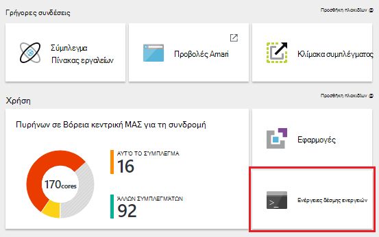

    > [AZURE.NOTE] Μπορείτε να επιλέξετε επίσης __όλες τις ρυθμίσεις__ και να, στη συνέχεια, επιλέξτε __Ενέργειες δέσμης ενεργειών__ από το blade ρυθμίσεις.

4. Από το επάνω μέρος του blade ενέργειες δέσμης ενεργειών, επιλέξτε __νέα υποβολή__.

    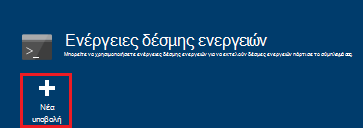

5. Από την προσθήκη ενέργειας δέσμης ενεργειών blade, εισαγάγετε τις παρακάτω πληροφορίες.

    * __Όνομα__: το φιλικό όνομα για να χρησιμοποιήσετε για αυτήν την ενέργεια δέσμης ενεργειών. Σε αυτό το παράδειγμα, `Add Storage account`.
    * __Δέσμη ΕΝΕΡΓΕΙΏΝ URI__: το URI στη δέσμη ενεργειών. Σε αυτό το παράδειγμα,`https://hdiconfigactions.blob.core.windows.net/linuxaddstorageaccountv01/add-storage-account-v01.sh`
    * __Προϊστάμενος__ __εργαζόμενου__και __Zookeeper__: Επιλέξτε τους κόμβους που πρέπει να εφαρμοστεί αυτή η δέσμη ενεργειών. Σε αυτό το παράδειγμα, κεφαλών, εργαζόμενου και Zookeeper είναι επιλεγμένα.
    * __ΠΑΡΆΜΕΤΡΟΙ__: Εάν η δέσμη ενεργειών δέχεται παραμέτρους, πληκτρολογήστε τους εδώ. Σε αυτό το παράδειγμα, πληκτρολογήστε το όνομα του λογαριασμού χώρου αποθήκευσης και τον αριθμό-κλειδί λογαριασμού χώρου αποθήκευσης:

        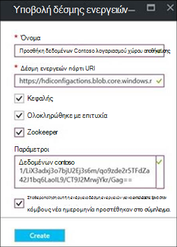

        Στο στιγμιότυπο οθόνης, `contosodata` είναι έναν υπάρχοντα λογαριασμό αποθήκευσης Azure, η δεύτερη γραμμή είναι το κλειδί λογαριασμού χώρου αποθήκευσης.
    * __PERSISTED__: Ελέγξτε αυτή την καταχώρηση, εάν θέλετε να παραμένει τη δέσμη ενεργειών, ώστε να θα εφαρμοστεί σε νέα κόμβους εργαζόμενου όταν γίνεται κλιμάκωση προς τα επάνω στο σύμπλεγμα.

6. Τέλος, μπορείτε να χρησιμοποιήσετε το κουμπί __Δημιουργία__ για να εφαρμόσετε τη δέσμη ενεργειών στο σύμπλεγμα.

### Εφαρμογή μιας ενέργειας δέσμης ενεργειών σε ένα σύμπλεγμα εκτελείται από Azure PowerShell

Πριν να συνεχίσετε, βεβαιωθείτε ότι έχετε εγκαταστήσει και να ρυθμίσει τις παραμέτρους του PowerShell Azure. Για πληροφορίες σχετικά με τη ρύθμιση των παραμέτρων ενός σταθμούς εργασίας για την εκτέλεση των cmdlet του HDInsight PowerShell, ανατρέξτε στο θέμα [εγκατάσταση και ρύθμιση παραμέτρων του PowerShell Azure](../powershell-install-configure.md).

1. Ανοίξτε την κονσόλα του PowerShell Azure και χρησιμοποιήστε τα ακόλουθα για να συνδεθείτε στη συνδρομή σας στο Azure και δηλώνουν ορισμένες μεταβλητές PowerShell:

        # LOGIN TO ZURE
        Login-AzureRmAccount

        # PROVIDE VALUES FOR THESE VARIABLES
        $clusterName = "<HDInsightClusterName>"         # HDInsight cluster name
        $saName = "<ScriptActionName>"                  # Name of the script action
        $saURI = "<URI to the script>"                  # The URI where the script is located
        $nodeTypes = "headnode", "workernode"
        
    > [AZURE.NOTE] Εάν χρησιμοποιείτε ένα σύμπλεγμα HDInsight Premium, μπορείτε να χρησιμοποιήσετε μια nodetype της `"edgenode"` για να εκτελέσετε τη δέσμη ενεργειών στον κόμβο άκρο.

2. Χρησιμοποιήστε την παρακάτω εντολή για να εφαρμόσετε τη δέσμη ενεργειών του συμπλέγματος:

        Submit-AzureRmHDInsightScriptAction -ClusterName $clusterName -Name $saName -Uri $saURI -NodeTypes $nodeTypes -PersistOnSuccess

    Μόλις ολοκληρωθεί η εργασία, θα πρέπει να λαμβάνετε πληροφορίες παρόμοιο με το εξής:

        OperationState  : Succeeded
        ErrorMessage    :
        Name            : Giraph
        Uri             : https://hdiconfigactions.blob.core.windows.net/linuxgiraphconfigactionv01/giraph-installer-v01.sh
        Parameters      :
        NodeTypes       : {HeadNode, WorkerNode}

### Εφαρμογή μιας ενέργειας δέσμης ενεργειών σε ένα σύμπλεγμα που εκτελείται από το CLI Azure

Πριν να συνεχίσετε, βεβαιωθείτε ότι έχετε εγκαταστήσει και να ρυθμίσει τις παραμέτρους του Azure CLI. Για περισσότερες πληροφορίες, ανατρέξτε στο θέμα [εγκατάσταση του Azure CLI](../xplat-cli-install.md).

    [AZURE.INCLUDE [use-latest-version](../../includes/hdinsight-use-latest-cli.md)] 

1. Ανοίξτε μια περίοδο λειτουργίας κελύφους, terminal, εντολών ή άλλες γραμμής εντολών για το σύστημά σας και χρησιμοποιήστε την ακόλουθη εντολή για να μεταβείτε σε λειτουργία Azure διαχείριση πόρων.

        azure config mode arm

2. Χρησιμοποιήστε τα ακόλουθα για τον έλεγχο ταυτότητας στη συνδρομή σας στο Azure.

        azure login

3. Χρησιμοποιήστε την ακόλουθη εντολή για να εφαρμόσετε μια ενέργεια δέσμης ενεργειών σε ένα σύμπλεγμα που εκτελείται

        azure hdinsight script-action create <clustername> -g <resourcegroupname> -n <scriptname> -u <scriptURI> -t <nodetypes>

    Εάν παραλείψετε τις παραμέτρους για αυτήν την εντολή, θα σας ζητηθεί για αυτές. Εάν η δέσμη ενεργειών που καθορίζετε με `-u` αποδέχεται παραμέτρους, μπορείτε να τα καθορίσετε χρησιμοποιώντας το `-p` παραμέτρου.

    Έγκυρες __nodetypes__ είναι __headnode__, __workernode__και __zookeeper__. Εάν η δέσμη ενεργειών θα εφαρμόζεται σε πολλούς τύπους κόμβου, καθορίστε τους τύπους διαχωρισμένα με ένα ';'. Για παράδειγμα, `-n headnode;workernode`.

    Για να διατηρηθεί η δέσμη ενεργειών, προσθέστε το `--persistOnSuccess`. Μπορείτε επίσης να παραμένει τη δέσμη ενεργειών αργότερα, με τη χρήση `azure hdinsight script-action persisted set`.
    
    Μόλις ολοκληρωθεί η εργασία, θα λάβετε παρόμοιο με το εξής αποτέλεσμα.
    
        info:    Executing command hdinsight script-action create
        + Executing Script Action on HDInsight cluster
        data:    Operation Info
        data:    ---------------
        data:    Operation status:
        data:    Operation ID:  b707b10e-e633-45c0-baa9-8aed3d348c13
        info:    hdinsight script-action create command OK

### Εφαρμογή μιας ενέργειας δέσμης ενεργειών σε ένα σύμπλεγμα εκτελείται χρησιμοποιώντας REST API

Ανατρέξτε στο θέμα [Εκτέλεση ενεργειών δέσμης ενεργειών σε ένα σύμπλεγμα εκτελείται](https://msdn.microsoft.com/library/azure/mt668441.aspx).
### Εφαρμογή μιας ενέργειας δέσμη ενεργειών σε ένα σύμπλεγμα εκτελείται από το HDInsight .NET SDK

Για ένα παράδειγμα της χρήσης το .NET SDK για να εφαρμόσετε δέσμες ενεργειών σε ένα σύμπλεγμα, ανατρέξτε στο θέμα [https://github.com/Azure-Samples/hdinsight-dotnet-script-action](https://github.com/Azure-Samples/hdinsight-dotnet-script-action).

## Προβολή του ιστορικού, προώθηση και υποβιβασμός ενέργειες δέσμης ενεργειών

### Με την πύλη Azure

1. Από την [πύλη του Azure](https://portal.azure.com), επιλέξτε το σύμπλεγμά σας HDInsight.

2. Από το σύμπλεγμα blade HDInsight, επιλέξτε __Ρυθμίσεις__.

    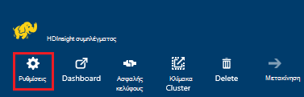

3. Από το blade ρυθμίσεις, επιλέξτε __Ενέργειες δέσμης ενεργειών__.

    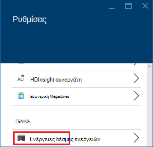

4. Εμφανίζεται μια λίστα με τις δέσμες ενεργειών μόνιμα, καθώς και ένα ιστορικό των δέσμες ενεργειών που εφαρμόζονται στο σύμπλεγμα, στον το blade ενέργειες δέσμης ενεργειών. Στο στιγμιότυπο οθόνης παρακάτω, μπορείτε να δείτε ότι το Solr έχει δέσμης ενεργειών εκτελέστηκε σε αυτό το σύμπλεγμα, αλλά ότι έχετε έχει διατηρηθεί χωρίς ενέργειες δέσμης ενεργειών.

    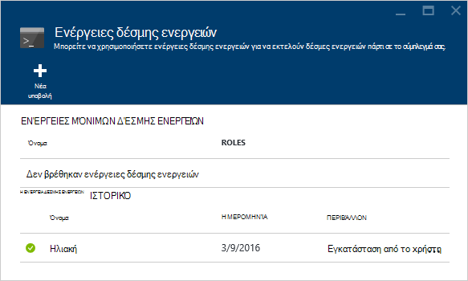

5. Επιλογή μιας δέσμης ενεργειών από το ιστορικό θα εμφανίσει το blade ιδιότητες για αυτήν τη δέσμη ενεργειών. Από το επάνω μέρος του blade, μπορείτε να τη δέσμη ή να προβιβάσετε.

    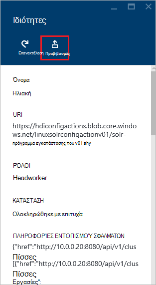

6. Μπορείτε επίσης να χρησιμοποιήσετε το __...__ στα δεξιά των καταχωρήσεων σε το blade ενέργειες δέσμης ενεργειών για να εκτελέσετε ενέργειες όπως εκτελέστε ξανά, παραμένει ή (για μόνιμων ενέργειες,) διαγραφή.

    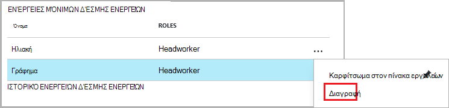

### Χρήση του Azure PowerShell

| Χρησιμοποιήστε το εξής... | Για να... |
| ----- | ----- |
| Get-AzureRmHDInsightPersistedScriptAction | Να ανακτήσετε πληροφορίες μόνιμων δέσμης ενεργειών |
| Get-AzureRmHDInsightScriptActionHistory | Ανακτήστε ένα ιστορικό των ενέργειες δέσμης ενεργειών που εφαρμόζονται στο σύμπλεγμα ή λεπτομέρειες για μια συγκεκριμένη δέσμη ενεργειών |
| Ορισμός AzureRmHDInsightPersistedScriptAction | Προβιβάστε μια ενέργεια ad hoc δέσμης ενεργειών σε μια ενέργεια μόνιμων δέσμης ενεργειών |
| Κατάργηση AzureRmHDInsightPersistedScriptAction | Υποβιβάζεται μια ενέργεια μόνιμων δέσμης ενεργειών σε μια ad hoc ενέργεια |

> [AZURE.IMPORTANT] Χρήση `Remove-AzureRmHDInsightPersistedScriptAction` δεν δεν Αναίρεση τις ενέργειες που εκτελούνται από μια δέσμη ενεργειών, τη σημαία μόνιμων καταργεί μόνο, έτσι ώστε η δέσμη ενεργειών δεν θα είναι εκτελέσατε σε νέα εργαζόμενου κόμβους προστεθεί στο σύμπλεγμα.

Η ακόλουθη δέσμη ενεργειών παράδειγμα παρουσιάζει τη χρήση τα cmdlet για να προβιβάσετε και, στη συνέχεια, υποβιβασμός μιας δέσμης ενεργειών.

    # Get a history of scripts
    Get-AzureRmHDInsightScriptActionHistory -ClusterName mycluster

    # From the list, we want to get information on a specific script
    Get-AzureRmHDInsightScriptActionHistory -ClusterName mycluster -ScriptExecutionId 635920937765978529

    # Promote this to a persisted script
    # Note: the script must have a unique name to be promoted
    # if the name is not unique, you will receive an error
    Set-AzureRmHDInsightPersistedScriptAction -ClusterName mycluster -ScriptExecutionId 635920937765978529

    # Demote the script back to ad hoc
    # Note that demotion uses the unique script name instead of
    # execution ID.
    Remove-AzureRmHDInsightPersistedScriptAction -ClusterName mycluster -Name "Install Giraph"

### Χρήση του Azure CLI

| Χρησιμοποιήστε το εξής... | Για να... |
| ----- | ----- |
| `azure hdinsight script-action persisted list <clustername>` | Ανάκτηση μιας λίστας μόνιμων δέσμης ενεργειών |
| `azure hdinsight script-action persisted show <clustername> <scriptname>` | Ανακτήστε πληροφορίες σχετικά με μια ενέργεια συγκεκριμένες μόνιμων δέσμης ενεργειών |
| `azure hdinsight script-action history list <clustername>` | Ανακτήστε ένα ιστορικό των ενεργειών δέσμης ενεργειών που εφαρμόζονται στο σύμπλεγμα |
| `azure hdinsight script-action history show <clustername> <scriptname>` | Ανάκτηση πληροφοριών σχετικά με την ενέργεια μια συγκεκριμένη δέσμη ενεργειών |
| `azure hdinsight script action persisted set <clustername> <scriptexecutionid>` | Προβιβάστε μια ενέργεια ad hoc δέσμης ενεργειών σε μια ενέργεια μόνιμων δέσμης ενεργειών |
| `azure hdinsight script-action persisted delete <clustername> <scriptname>` | Υποβιβάζεται μια ενέργεια μόνιμων δέσμη ενεργειών σε μια ad hoc ενέργεια |

> [AZURE.IMPORTANT] Χρήση `azure hdinsight script-action persisted delete` δεν δεν Αναίρεση τις ενέργειες που εκτελούνται από μια δέσμη ενεργειών, τη σημαία μόνιμων καταργεί μόνο, έτσι ώστε η δέσμη ενεργειών δεν θα είναι εκτελέσατε σε νέα εργαζόμενου κόμβους προστεθεί στο σύμπλεγμα.

### Χρήση του SDK .NET HDInsight

Για ένα παράδειγμα της χρήσης το .NET SDK για την ανάκτηση ιστορικού δέσμης ενεργειών από ένα σύμπλεγμα, Προβιβασμός ή υποβιβασμός δέσμες ενεργειών, ανατρέξτε στο θέμα [https://github.com/Azure-Samples/hdinsight-dotnet-script-action](https://github.com/Azure-Samples/hdinsight-dotnet-script-action).

> [AZURE.NOTE] Αυτό το παράδειγμα παρουσιάζει επίσης τον τρόπο για να εγκαταστήσετε μια εφαρμογή HDInsight χρησιμοποιώντας το .NET SDK.

## Αντιμετώπιση προβλημάτων

Μπορείτε να χρησιμοποιήσετε Ambari web περιβάλλοντος εργασίας Χρήστη για να προβάλετε πληροφορίες καταγράφονται από ενέργειες δέσμης ενεργειών. Εάν η δέσμη ενεργειών που χρησιμοποιήθηκε κατά τη διάρκεια του συμπλέγματος δημιουργίας και δημιουργία συμπλέγματος απέτυχε λόγω σφάλμα στη δέσμη ενεργειών, τα αρχεία καταγραφής είναι επίσης διαθέσιμες στην τον προεπιλεγμένο λογαριασμό χώρου αποθήκευσης που σχετίζεται με το σύμπλεγμα. Αυτή η ενότητα παρέχει πληροφορίες σχετικά με τον τρόπο για να ανακτήσετε τα αρχεία καταγραφής χρησιμοποιώντας δύο αυτές τις επιλογές.

### Χρήση του Web Ambari περιβάλλοντος εργασίας Χρήστη

1. Στο πρόγραμμα περιήγησης, μεταβείτε στις επιλογές https://CLUSTERNAME.azurehdinsight.net. Αντικαταστήστε CLUSTERNAME με το όνομα του συμπλέγματος HDInsight.

    Όταν σας ζητηθεί, πληκτρολογήστε το όνομα του λογαριασμού διαχειριστή (διαχειριστές) και τον κωδικό πρόσβασης για το σύμπλεγμα. Ίσως χρειαστεί να εισαγάγετε ξανά τα διαπιστευτήρια διαχειριστή σε μια φόρμα web.

2. Από τη γραμμή στο επάνω μέρος της σελίδας, επιλέξτε την καταχώρηση __ops__ . Αυτό θα εμφανιστεί μια λίστα με τις τρέχουσες και προηγούμενες λειτουργίες που εκτελούνται στο σύμπλεγμα μέσω Ambari.

    

3. Βρείτε τις εγγραφές που έχουν __Εκτέλεση\_customscriptaction__ στη στήλη __Operations__ . Αυτά δημιουργούνται όταν είναι εκτελέσατε τις ενέργειες δέσμης ενεργειών.

    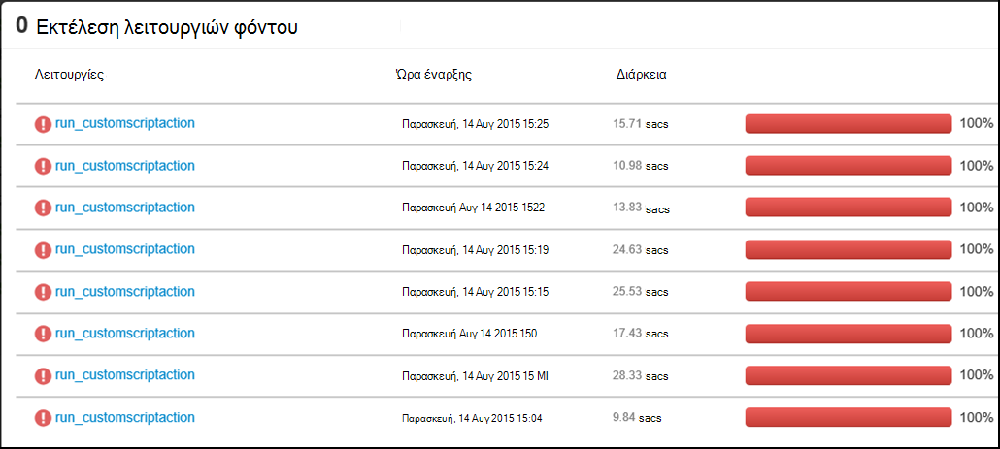

    Επιλέξτε αυτήν την εγγραφή και Διερεύνηση μέσω των συνδέσεων για να προβάλετε την έξοδο STDOUT και STDERR που δημιουργείται όταν η δέσμη ενεργειών ήταν εκτελέσατε στο σύμπλεγμα.

### Αρχεία καταγραφής από την Access από τον προεπιλεγμένο λογαριασμό χώρου αποθήκευσης

Εάν η δημιουργία συμπλέγματος απέτυχε λόγω ενός σφάλματος στην ενέργεια δέσμη ενεργειών, τα αρχεία καταγραφής δέσμης ενεργειών μπορεί να εξακολουθεί να είναι η πρόσβαση σε απευθείας από τον προεπιλεγμένο λογαριασμό χώρου αποθήκευσης που σχετίζεται με το σύμπλεγμα.

* Τα αρχεία καταγραφής του χώρου αποθήκευσης είναι διαθέσιμα στο `\STORAGE_ACOCUNT_NAME\DEFAULT_CONTAINER_NAME\custom-scriptaction-logs\CLUSTER_NAME\DATE`.

    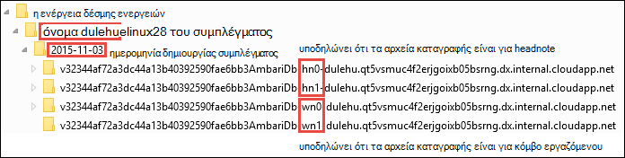

    Κάτω από αυτό, τα αρχεία καταγραφής οργανώνονται ξεχωριστά για headnode, workernode και zookeeper κόμβους. Ορισμένα παραδείγματα είναι οι εξής:
    * **Headnode** - `<uniqueidentifier>AmbariDb-hn0-<generated_value>.cloudapp.net`
    * **Εργαζόμενου κόμβου** - `<uniqueidentifier>AmbariDb-wn0-<generated_value>.cloudapp.net`
    * **Zookeeper κόμβου** - `<uniqueidentifier>AmbariDb-zk0-<generated_value>.cloudapp.net`

* Αποστολή όλων των stdout και stderr του αντίστοιχου κεντρικού υπολογιστή με το λογαριασμό χώρου αποθήκευσης. Υπάρχει ένας **εξόδου -\*.txt** και **σφάλματα -\*.txt** για κάθε ενέργεια δέσμης ενεργειών. Το αρχείο εξόδου *.txt περιέχει πληροφορίες σχετικά με το URI της δέσμης ενεργειών που έχετε εκτελούνται στον κεντρικό υπολογιστή. Για παράδειγμα

        'Start downloading script locally: ', u'https://hdiconfigactions.blob.core.windows.net/linuxrconfigactionv01/r-installer-v01.sh'

* Είναι πιθανό ότι δημιουργείτε επανειλημμένα ένα σύμπλεγμα ενέργεια δέσμης ενεργειών με το ίδιο όνομα. Στην περίπτωση αυτή, μπορείτε να διακρίνετε τα σχετικά αρχεία καταγραφής με βάση το όνομα του φακέλου "ΗΜΕΡΟΜΗΝΊΑ". Για παράδειγμα, θα είναι η δομή του φακέλου για ένα σύμπλεγμα (mycluster) που δημιουργήθηκε σε διαφορετικές ημερομηνίες:
    * `\STORAGE_ACOCUNT_NAME\DEFAULT_CONTAINER_NAME\custom-scriptaction-logs\mycluster\2015-10-04`
    * `\STORAGE_ACOCUNT_NAME\DEFAULT_CONTAINER_NAME\custom-scriptaction-logs\mycluster\2015-10-05`

* Εάν δημιουργήσετε ένα σύμπλεγμα ενέργεια δέσμης ενεργειών με το ίδιο όνομα την ίδια ημέρα, μπορείτε να χρησιμοποιήσετε το μοναδικό πρόθεμα για τον προσδιορισμό των αρχείων καταγραφής σχετικές.

* Εάν δημιουργήσετε ένα σύμπλεγμα στο τέλος της ημέρας, είναι πιθανό ότι τα αρχεία καταγραφής εκτείνονται σε δύο ημέρες. Σε αυτές τις περιπτώσεις, θα δείτε δύο φακέλους διαφορετική ημερομηνία για το ίδιο σύμπλεγμα.

* Αποστολή αρχείων καταγραφής στο προεπιλεγμένο κοντέινερ μπορεί να διαρκέσει έως και 5 λεπτά, ειδικά για μεγάλη συμπλεγμάτων. Επομένως, εάν θέλετε να έχετε πρόσβαση στα αρχεία καταγραφής, δεν πρέπει να αμέσως διαγράψετε το σύμπλεγμα εάν αποτύχει μια ενέργεια δέσμης ενεργειών.

## Υποστήριξη για λογισμικό ανοιχτού κώδικα που χρησιμοποιούνται σε HDInsight συμπλεγμάτων

Η υπηρεσία Microsoft Azure HDInsight είναι μια ευέλικτη πλατφόρμα που σας επιτρέπει να δημιουργήσετε εφαρμογές μεγάλο δεδομένων στο cloud χρησιμοποιώντας ένα περιβάλλον εμπορικής προσαρμογής των τεχνολογιών ανοιχτού κώδικα μορφοποιημένη γύρω από Hadoop. Microsoft Azure παρέχει ένα γενικό επίπεδο υποστήριξης για άνοιγμα προέλευσης τεχνολογίες, όπως περιγράφεται στην ενότητα **Υποστηρίζει την εμβέλεια** της [τοποθεσίας Web συνήθεις ερωτήσεις για υποστήριξη Azure](https://azure.microsoft.com/support/faq/). Η υπηρεσία HDInsight παρέχει ένα πρόσθετο επίπεδο υποστήριξης για ορισμένα από τα στοιχεία, όπως περιγράφεται παρακάτω.

Υπάρχουν δύο τύποι ανοιχτού κώδικα τα στοιχεία που είναι διαθέσιμες στην υπηρεσία HDInsight:

- **Ενσωματωμένα στοιχεία** - αυτά τα στοιχεία είναι προεγκατεστημένα στα HDInsight συμπλεγμάτων και παρέχουν βασικές λειτουργίες του συμπλέγματος. Για παράδειγμα, ΝΉΜΑΤΑ ResourceManager, τη γλώσσα ερωτήματος Hive (HiveQL) και τη βιβλιοθήκη Mahout ανήκει σε αυτή την κατηγορία. Μια πλήρη λίστα των στοιχείων σύμπλεγμα είναι διαθέσιμη στο [Τι νέο υπάρχει στο τις εκδόσεις σύμπλεγμα Hadoop που παρέχεται από το HDInsight;](hdinsight-component-versioning.md).

- **Προσαρμοσμένα στοιχεία** - εσείς, ως χρήστης του συμπλέγματος, να εγκαταστήσετε ή χρησιμοποιήστε σε του φόρτου εργασίας οποιοδήποτε στοιχείο διαθέσιμο στην Κοινότητα ή που έχουν δημιουργηθεί από εσάς.

> [AZURE.WARNING] Στοιχεία που παρέχονται με το σύμπλεγμα HDInsight υποστηρίζονται πλήρως και υποστήριξη της Microsoft θα σας βοηθήσει να απομονώσετε και να επιλύσετε θέματα που σχετίζονται με αυτά τα στοιχεία.
>
> Προσαρμοσμένα στοιχεία λαμβάνουν εμπορικά λογικές υποστήριξη για να σας βοηθήσει να αντιμετωπίσετε περαιτέρω το ζήτημα. Αυτό μπορεί να έχει ως αποτέλεσμα το ζήτημα επίλυση ή που σας ζητά να συμμετάσχουν διαθέσιμα κανάλια για τις τεχνολογίες Άνοιγμα αρχείου προέλευσης όπου βρίσκονται πολλά επίπεδα εξειδίκευση για συγκεκριμένη τεχνολογία. Για παράδειγμα, υπάρχουν πολλές τοποθεσίες Κοινότητας που μπορούν να χρησιμοποιηθούν, όπως: [φόρουμ MSDN για το HDInsight](https://social.msdn.microsoft.com/Forums/azure/en-US/home?forum=hdinsight), [http://stackoverflow.com](http://stackoverflow.com). Επίσης, Apache έργα έχουν τοποθεσίες έργου στο [http://apache.org](http://apache.org), για παράδειγμα: [Hadoop](http://hadoop.apache.org/).

Η υπηρεσία HDInsight παρέχει διάφορους τρόπους για να χρησιμοποιήσετε προσαρμοσμένα στοιχεία. Ανεξάρτητα από το πώς ένα στοιχείο χρησιμοποιείται ή εγκατεστημένο στο σύμπλεγμα, εφαρμογή το ίδιο επίπεδο υποστήριξης. Ακολουθεί μια λίστα με τους πιο συνηθισμένους τρόπους που τα προσαρμοσμένα στοιχεία που μπορεί να χρησιμοποιηθεί σε συμπλεγμάτων HDInsight:

1. Εργασία υποβολής - Hadoop ή άλλους τύπους εργασιών που εκτελεί ή να χρησιμοποιήσετε προσαρμοσμένα στοιχεία μπορούν να υποβληθούν στο σύμπλεγμα.

2. Σύμπλεγμα προσαρμογής - κατά τη δημιουργία συμπλέγματος, μπορείτε να ορίσετε πρόσθετες ρυθμίσεις και προσαρμοσμένα στοιχεία που θα εγκατασταθεί σε τους κόμβους συμπλέγματος.

3. Δείγματα - για δημοφιλείς προσαρμοσμένα στοιχεία, Microsoft και άλλους μπορεί να σας παρέχει δείγματα πώς αυτά τα στοιχεία μπορούν να χρησιμοποιηθούν σε των συμπλεγμάτων HDInsight. Αυτά τα δείγματα παρέχονται χωρίς την υποστήριξη.

##Αντιμετώπιση προβλημάτων

###Ιστορικό δεν εμφανίζει δεσμών ενεργειών που χρησιμοποιείται κατά τη δημιουργία συμπλέγματος

Εάν το σύμπλεγμά σας έχει δημιουργηθεί πριν από την 15ο Μαρτίου 2016, δεν μπορείτε να δείτε μια καταχώρηση στην ενέργεια δέσμη ενεργειών ιστορικού για τις δέσμες ενεργειών που χρησιμοποιείται κατά τη δημιουργία συμπλέγματος. Ωστόσο, εάν αλλάξετε το μέγεθος του συμπλέγματος μετά το 15ο Μαρτίου 2016, τις δέσμες ενεργειών με χρήση κατά τη δημιουργία συμπλέγματος θα εμφανίζονται στο ιστορικό όπως εφαρμόζονται σε νέα κόμβους του συμπλέγματος ως μέρος της λειτουργίας αλλαγής μεγέθους.

Υπάρχουν δύο εξαιρέσεις:

* Εάν το σύμπλεγμά σας έχει δημιουργηθεί πριν από την 1η Σεπτεμβρίου 2015. Αυτό είναι όταν παρουσιάστηκαν ενέργειες δέσμης ενεργειών, ώστε να οποιαδήποτε σύμπλεγμα που δημιουργήθηκαν πριν από αυτήν την ημερομηνία δεν ήταν δυνατό έχουν χρησιμοποιηθεί ενέργειες δέσμης ενεργειών για τη δημιουργία συμπλέγματος.

* Εάν χρησιμοποιούνται πολλές ενέργειες δέσμης ενεργειών κατά τη δημιουργία συμπλέγματος και χρησιμοποιείται το ίδιο όνομα για πολλές δέσμες ενεργειών, ή το ίδιο όνομα, ίδιο URI, αλλά διαφορετικές παραμέτρους για πολλές δέσμες ενεργειών. Σε αυτές τις περιπτώσεις, θα λάβετε το ακόλουθο σφάλμα.

    Χωρίς νέες ενέργειες δέσμης ενεργειών μπορεί να εκτελεστεί σε αυτό το σύμπλεγμα λόγω που βρίσκονται σε διένεξη ονομάτων δέσμη ενεργειών σε υπάρχουσες δέσμες ενεργειών. Ονόματα δέσμης ενεργειών που παρέχονται στο σύμπλεγμα δημιουργία πρέπει να είναι μοναδικό όλων. Υπάρχουσες δέσμες ενεργειών θα εξακολουθούν να εκτελεστούν κατά την αλλαγή μεγέθους.

## Επόμενα βήματα

Δείτε τα εξής για πληροφορίες και παραδείγματα σχετικά με τη δημιουργία και χρήση δεσμών ενεργειών για να προσαρμόσετε ένα σύμπλεγμα:

- [Ανάπτυξη δεσμών ενεργειών δέσμης ενεργειών για HDInsight](hdinsight-hadoop-script-actions-linux.md)
- [Εγκατάσταση και χρήση Solr στον HDInsight συμπλεγμάτων](hdinsight-hadoop-solr-install-linux.md)
- [Εγκατάσταση και χρήση Giraph στον HDInsight συμπλεγμάτων](hdinsight-hadoop-giraph-install-linux.md)

[img-hdi-cluster-states]: ./media/hdinsight-hadoop-customize-cluster-linux/HDI-Cluster-state.png "Στάδια κατά τη δημιουργία συμπλέγματος"
