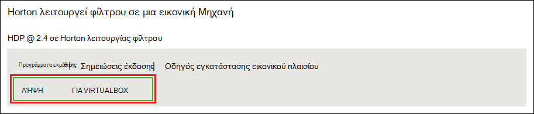
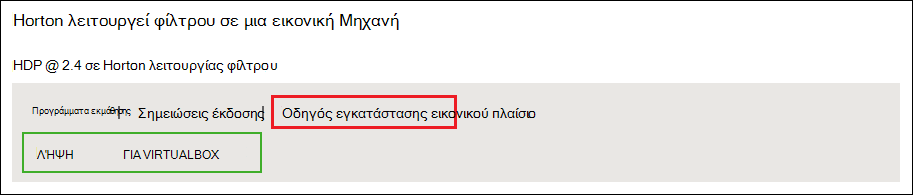
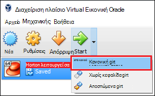

<properties
    pageTitle="Χρήση του φίλτρου Hadoop για να μάθετε περισσότερα σχετικά με Hadoop | Microsoft Azure"
    description="Για να ξεκινήσετε εκμάθησης σχετικά με τη χρήση στο περιβάλλον εμπορικής προσαρμογής Hadoop, μπορείτε να ρυθμίσετε φίλτρου Hadoop από Hortonworks σε μια εικονική μηχανή Azure. "
    keywords="προσομοίωσης hadoop, hadoop φίλτρου"
    editor="cgronlun"
    manager="jhubbard"
    services="hdinsight"
    authors="nitinme"
    documentationCenter=""
    tags="azure-portal"/>

<tags
    ms.service="hdinsight"
    ms.workload="big-data"
    ms.tgt_pltfrm="na"
    ms.devlang="na"
    ms.topic="article"
    ms.date="08/24/2016"
    ms.author="nitinme"/>

# Γρήγορα αποτελέσματα με το περιβάλλον εμπορικής προσαρμογής Hadoop με Hadoop φίλτρου σε μια εικονική μηχανή

Μάθετε πώς να εγκαταστήσετε το φίλτρο Hadoop από Hortonworks σε μια εικονική μηχανή για να μάθετε περισσότερα σχετικά με το περιβάλλον εμπορικής προσαρμογής Hadoop. Το φίλτρο παρέχει ένα περιβάλλον τοπικής ανάπτυξης για να μάθετε περισσότερα σχετικά με Hadoop, το σύστημα αρχείων κατανεμημένο Hadoop (HDFS) και υποβολής εργασίας.

## Προαπαιτούμενα στοιχεία

* [Oracle VirtualBox](https://www.virtualbox.org/)

Όταν είστε εξοικειωμένοι με Hadoop, μπορείτε να ξεκινήσετε να χρησιμοποιείτε Hadoop στην Azure, δημιουργώντας ένα σύμπλεγμα HDInsight. Για περισσότερες πληροφορίες σχετικά με τον τρόπο για να ξεκινήσετε, ανατρέξτε στο θέμα [Γρήγορα αποτελέσματα με το Hadoop σε HDInsight](hdinsight-hadoop-linux-tutorial-get-started.md).

## Κάντε λήψη και εγκαταστήστε την εικονική μηχανή

1. Από [http://hortonworks.com/downloads/#sandbox](http://hortonworks.com/downloads/#sandbox), επιλέξτε το στοιχείο __ΛΉΨΗ για VIRTUALBOX__ για 2.4 HDP σε Hortonworks φίλτρου. Θα σας ζητηθεί να καταχωρήσετε με Hortonworks πριν να ξεκινήσει η λήψη.

    

2. Από την ίδια σελίδα web, επιλέξτε τον __Οδηγό εγκατάστασης VirtualBox__ 2.4 HDP σε Hortonworks φίλτρου. Αυτό θα κάνετε λήψη ενός PDF που περιέχει οδηγίες εγκατάστασης για την εικονική μηχανή.

    

## Ξεκινήστε την εικονική μηχανή

1. Έναρξη VirtualBox, επιλέξτε το φίλτρο Hortonworks, επιλέξτε __Έναρξη__και, στη συνέχεια, __Ξεκινήστε κανονική__.

    

2. Μόλις ολοκληρωθεί η διαδικασία εκκίνησης η εικονική μηχανή, θα εμφανίσει οδηγίες σύνδεσης. Ανοίξτε ένα πρόγραμμα περιήγησης web και μεταβείτε στη διεύθυνση URL εμφανίζεται (συνήθως http://127.0.0.1:8888).

## Ρύθμιση κωδικών πρόσβασης

1. Από το βήμα __Γρήγορα αποτελέσματα__ της σελίδας Hortonworks φίλτρου, επιλέξτε __Επιλογές προβολής για προχωρημένους__. Χρησιμοποιήστε τις πληροφορίες σε αυτήν τη σελίδα για να συνδεθείτε με τη χρήση SSH φίλτρου. Χρησιμοποιήστε το όνομα και τον κωδικό πρόσβασης που παρέχεται.

    > [AZURE.NOTE] Εάν δεν έχετε εγκατεστημένο ένα πρόγραμμα-πελάτη SSH, μπορείτε να χρησιμοποιήσετε το SSH βασίζεται στο web που παρέχονται στο από την εικονική μηχανή στο __http://localhost:4200 /__.

    Την πρώτη φορά που μπορείτε να συνδεθείτε χρησιμοποιώντας SSH, θα σας ζητηθεί να αλλάξετε τον κωδικό πρόσβασης για το λογαριασμό ριζικό κατάλογο. Πληκτρολογήστε έναν νέο κωδικό πρόσβασης που θα χρησιμοποιηθεί όταν συνδεθείτε χρησιμοποιώντας SSH στο μέλλον.

2. Αφού συνδεθεί σε, πληκτρολογήστε την ακόλουθη εντολή:

        ambari-admin-password-reset
    
    Όταν σας ζητηθεί, δώστε έναν κωδικό πρόσβασης για το λογαριασμό διαχειριστή Ambari. Αυτό θα χρησιμοποιηθεί κατά την πρόσβαση σε περιβάλλον εργασίας Χρήστη του Ambari Web.

## Χρησιμοποιήστε την εντολή ομάδας

1. Από μια σύνδεση SSH σε του φίλτρου, χρησιμοποιήστε την παρακάτω εντολή για να ξεκινήσετε το κέλυφος ομάδα:

        hive

2. Αφού έχει ξεκινήσει το κέλυφος, χρησιμοποιήστε τα παρακάτω για να προβάλετε τους πίνακες που παρέχονται με το φίλτρο:

        show tables;

3. Χρησιμοποιήστε τα ακόλουθα για να ανακτήσετε 10 γραμμές από την `sample_07` πίνακα:

        select * from sample_07 limit 10;

## Επόμενα βήματα

* [Μάθετε πώς μπορείτε να χρησιμοποιήσετε Visual Studio με το φίλτρο Hortonworks](hdinsight-hadoop-emulator-visual-studio.md)
* [Τα καλώδια από το φίλτρο Hortonworks εκμάθησης](http://hortonworks.com/hadoop-tutorial/learning-the-ropes-of-the-hortonworks-sandbox/)
* [Πρόγραμμα εκμάθησης Hadoop - γρήγορα αποτελέσματα με το HDP](http://hortonworks.com/hadoop-tutorial/hello-world-an-introduction-to-hadoop-hcatalog-hive-and-pig/)