<properties
pageTitle="Χρησιμοποιήστε τα εργαλεία λίμνης δεδομένων Microsoft Azure για το Visual Studio με το φίλτρο Hortonworks | Microsoft Azure"
description="Μάθετε πώς μπορείτε να χρησιμοποιήσετε τα εργαλεία λίμνης δεδομένων Azure για το VIsual Studio με το φίλτρο Hortonworks (εκτελείται σε έναν τοπικό Εικονική.) Με αυτά τα εργαλεία, μπορείτε να δημιουργήσετε και να εκτελέσετε εργασίες ομάδας και γουρούνι στο αποτέλεσμα εργασία του φίλτρου και προβολή και ιστορικό."
services="hdinsight"
documentationCenter=""
authors="Blackmist"
manager="paulettm"
editor="cgronlun"/>

<tags
ms.service="hdinsight"
ms.devlang="na"
ms.topic="article"
ms.tgt_pltfrm="na"
ms.workload="big-data"
ms.date="08/26/2016"
ms.author="larryfr"/>

# Χρησιμοποιήστε τα εργαλεία λίμνης Azure δεδομένων για το Visual Studio με το φίλτρο Hortonworks

Τα εργαλεία λίμνης δεδομένων Azure για το Visual Studio περιλαμβάνει εργαλεία για την εργασία με γενικό συμπλεγμάτων Hadoop, εκτός από τα εργαλεία για την εργασία με λίμνης δεδομένων Azure και HDInsight. Αυτό το έγγραφο παρέχει τα βήματα που απαιτούνται για να χρησιμοποιήσετε τα εργαλεία Azure λίμνης δεδομένων με το φίλτρου Hortonworks εκτελείται σε έναν τοπικό εικονικό υπολογιστή.

Χρήση του φίλτρου Hortonworks σάς επιτρέπει να εργαστείτε με Hadoop τοπικά στο περιβάλλον ανάπτυξής σας. Αφού έχετε αναπτύξει μια λύση και θέλετε να το αναπτύξετε σε κλίμακα, στη συνέχεια, μπορείτε να μετακινήσετε σε ένα σύμπλεγμα HDInsight.

## Προαπαιτούμενα στοιχεία

* Το φίλτρο Hortonworks εκτέλεση σε μια εικονική μηχανή στο περιβάλλον ανάπτυξής σας. Αυτό το έγγραφο έχει συνταχθεί και ελεγχθεί με το φίλτρο που εκτελείται στο VirtualBox Oracle, τα οποία έχουν ρυθμιστεί οι παράμετροι χρησιμοποιώντας τις πληροφορίες στο έγγραφο [Γρήγορα αποτελέσματα με το περιβάλλον εμπορικής προσαρμογής Hadoop](hdinsight-hadoop-emulator-get-started.md) .

* Visual Studio 2013 ή 2015, οποιαδήποτε έκδοση.

* Το [Azure SDK για .NET](https://azure.microsoft.com/downloads/) 2.7.1 ή νεότερη έκδοση

* [Εργαλεία λίμνης Azure δεδομένων για το Visual Studio](https://www.microsoft.com/download/details.aspx?id=49504)

## Ρύθμιση των παραμέτρων τους κωδικούς πρόσβασης για το φίλτρου

Βεβαιωθείτε ότι εκτελείται το φίλτρου Hortonworks και, στη συνέχεια, ακολουθήστε τα βήματα στο θέμα [Γρήγορα αποτελέσματα με το περιβάλλον εμπορικής προσαρμογής Hadoop](hdinsight-hadoop-emulator-get-started.md#set-passwords) για να ρυθμίσετε τον κωδικό πρόσβασης για το SSH `root` λογαριασμό και το Ambari `admin` λογαριασμού. Αυτοί οι κωδικοί πρόσβασης θα χρησιμοποιηθεί κατά τη σύνδεση με το φίλτρο από το Visual Studio.

## Συνδεθείτε τα εργαλεία του φίλτρου

1. Ανοίξτε το Visual Studio και επιλέξτε __Προβολή__, στη συνέχεια, __Εξερεύνηση Server__.

2. Από την __Εξερεύνηση Server__, κάντε δεξί κλικ στην καταχώρηση __HDInsight__ και, στη συνέχεια, επιλέξτε __σύνδεση με προσομοίωσης HDInsight__.

    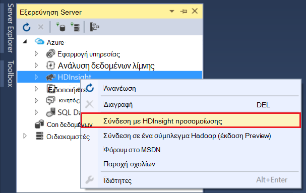

3. Από το παράθυρο διαλόγου __σύνδεση με προσομοίωσης HDInsight__ , πληκτρολογήστε τον κωδικό πρόσβασης που έχετε ρυθμίσει για Ambari.

    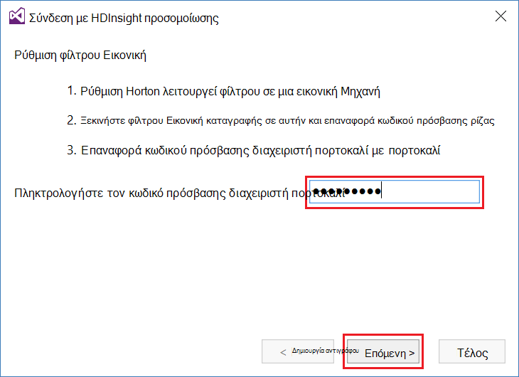

    Επιλέξτε __Επόμενο__ για να συνεχίσετε.

4. Χρησιμοποιήστε το πεδίο __κωδικού πρόσβασης__ για να εισαγάγετε τον κωδικό πρόσβασης που έχει ρυθμιστεί για την `root` λογαριασμού. Αφήστε τα άλλα πεδία στην προεπιλεγμένη τιμή.

    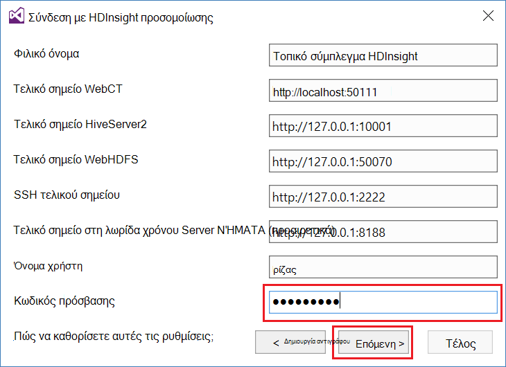

    Επιλέξτε __Επόμενο__ για να συνεχίσετε.

5. Περιμένετε για την επικύρωση των υπηρεσιών για να ολοκληρωθεί. Σε ορισμένες περιπτώσεις, η επικύρωση ενδέχεται να αποτύχει και να σας ζητήσει να ενημερώσετε τις ρυθμίσεις παραμέτρων. Όταν συμβαίνει αυτό, επιλέξτε το κουμπί __Ενημέρωση__ και περιμένετε για τη ρύθμιση παραμέτρων και την επαλήθευση για την υπηρεσία για να ολοκληρωθεί.

    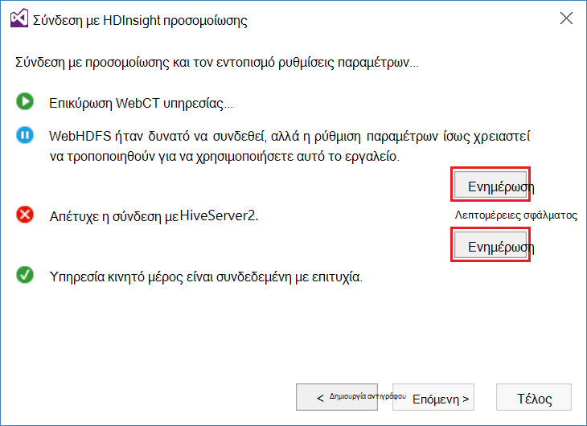

    > [AZURE.NOTE] Η διαδικασία ενημέρωσης χρησιμοποιεί Ambari για να τροποποιήσετε τις ρυθμίσεις του φίλτρου Hortonworks σε τι αναμένεται από τα εργαλεία λίμνης δεδομένων Azure για το Visual Studio.

    Μόλις ολοκληρωθεί η επικύρωση, επιλέξτε __Τέλος__ για να ολοκληρωθεί η ρύθμιση παραμέτρων.

    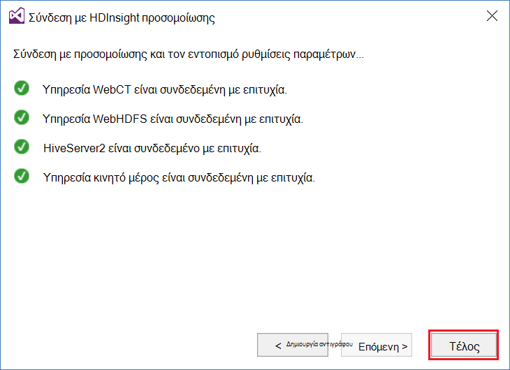

    > [AZURE.NOTE] Ανάλογα με την ταχύτητα της περιβάλλον ανάπτυξής σας και το μέγεθος της μνήμης που έχει εκχωρηθεί στην εικονική μηχανή της, μπορεί να χρειαστούν αρκετά λεπτά για να ρυθμίσετε τις παραμέτρους και να επικυρώσετε τις υπηρεσίες.

Αφού ακολουθήσετε αυτά τα βήματα, τώρα έχετε μια καταχώρηση "HDInsight τοπικό σύμπλεγμα" στην Εξερεύνηση Server στην ενότητα HDInsight.

## Γράψτε μια ομάδα ερωτήματος

Ομάδα παρέχει μια γλώσσα ερωτημάτων μοιάζει με SQL (HiveQL,) για την εργασία με δομημένα δεδομένα. Χρησιμοποιήστε τα παρακάτω βήματα για να μάθετε πώς μπορείτε να εκτελέσετε ad-hoc ερωτημάτων σε σχέση με το τοπικό σύμπλεγμα.

1. Στην __Εξερεύνηση Server__, κάντε δεξί κλικ στην εγγραφή για το τοπικό σύμπλεγμα που προσθέσατε προηγουμένως και, στη συνέχεια, επιλέξτε να __συντάξετε ένα ερώτημα, ομάδα__.

    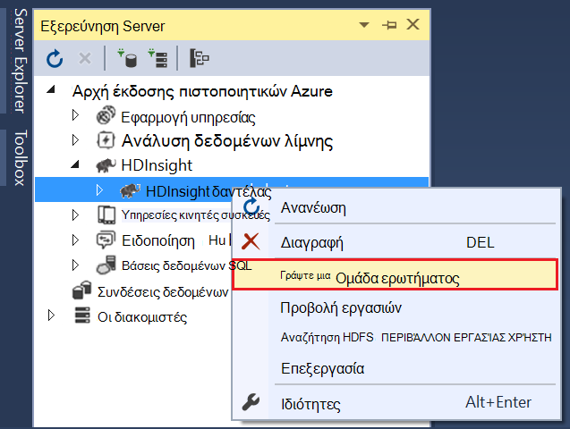

    Έτσι ανοίγει ένα νέο παράθυρο του ερωτήματος που σας επιτρέπει να γρήγορα πληκτρολογήστε προς τα επάνω και υποβολή ερωτήματος στο τοπικό σύμπλεγμα.

2. Στο παράθυρο του νέου ερωτήματος, πληκτρολογήστε τα εξής:

        select count(*) from sample_08;
    
    Από το επάνω μέρος του παραθύρου του ερωτήματος, βεβαιωθείτε ότι η ρύθμιση παραμέτρων για το τοπικό σύμπλεγμα είναι επιλεγμένο και, στη συνέχεια, επιλέξτε __Υποβολή__. Αποχώρηση από τις άλλες τιμές (__δέσμης__ και ένα όνομα διακομιστή,) στο τις προεπιλεγμένες τιμές.

    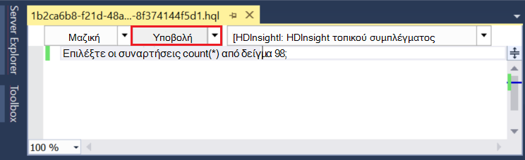

    Σημειώστε ότι μπορείτε επίσης να χρησιμοποιήσετε το αναπτυσσόμενο μενού δίπλα στην επιλογή __Υποβολή__ για να επιλέξετε __για προχωρημένους__. Έτσι ανοίγει ένα παράθυρο διαλόγου που σας επιτρέπει να παρέχουν πρόσθετες επιλογές κατά την υποβολή της εργασίας.

    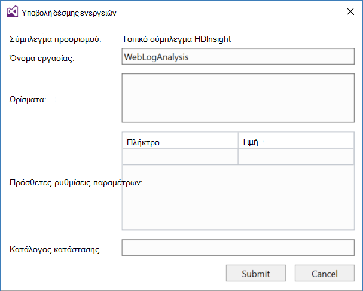

3. Αφού υποβάλετε το ερώτημα, θα εμφανιστεί την κατάσταση της εργασίας. Αυτό παρέχει πληροφορίες σχετικά με την εργασία που υποβάλλεται σε επεξεργασία από Hadoop. Η εγγραφή __Κατάσταση εργασίας__ παρέχει την τρέχουσα κατάσταση του έργου. Η κατάσταση θα ενημερώνονται περιοδικά ή μπορείτε να χρησιμοποιήσετε το εικονίδιο "Ανανέωση" για να ανανεώσετε με μη αυτόματο τρόπο την κατάσταση.

    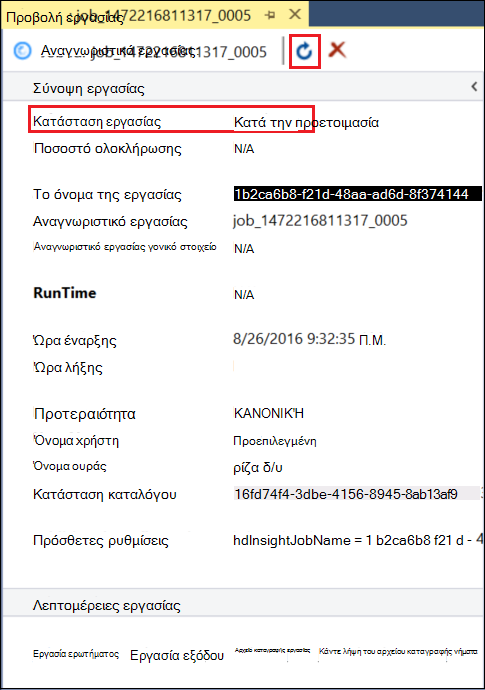

    Όταν η __Κατάσταση εργασίας__ αλλάζει σε __Ολοκληρωμένη__, εμφανίζεται μια κατευθύνεται μη κυκλικό Graph (DAG). Αυτό περιγράφει τη διαδρομή εκτέλεσης που καθορίστηκε από Tez (το προεπιλεγμένο εκτέλεσης μηχανισμό για ομάδα στο τοπικό σύμπλεγμα.) 
    
    > [AZURE.NOTE] Tez είναι επίσης η προεπιλογή κατά τη χρήση συμπλεγμάτων βάσει Linux HDInsight. Δεν είναι το προεπιλεγμένο πρόγραμμα σε HDInsight που βασίζεται στα Windows; Για να το χρησιμοποιήσετε εκεί, πρέπει να προσθέσετε τη γραμμή `set hive.execution.engine = tez;` μέχρι την αρχή του ερωτήματός σας ομάδα. 

    Χρησιμοποιήστε τη σύνδεση __Εξόδου εργασία__ για να δείτε το αποτέλεσμα. Σε αυτήν την περίπτωση, είναι __823__; ο αριθμός των γραμμών του πίνακα sample_08. Μπορείτε να προβάλετε διαγνωστικών πληροφοριών σχετικά με την εργασία, χρησιμοποιώντας τις συνδέσεις __Εργασίας καταγραφής__ και __Κάντε λήψη του αρχείου καταγραφής ΝΉΜΑΤΑ__ .

4. Μπορείτε επίσης να εκτελέσετε εργασίες ομάδας αλληλεπιδραστικά, αλλάζοντας το πεδίο __δέσμη__ για __αλληλεπίδραση__, καθώς και, στη συνέχεια, επιλέξτε __Εκτέλεση__. 

    

    Αυτό μεταδίδει με ροή στο αρχείο καταγραφής εξόδου που δημιουργούνται κατά την επεξεργασία στο παράθυρο __Εξόδου HiveServer2__ .
    
    > [AZURE.NOTE] Αυτή είναι η ίδια πληροφορίες που είναι διαθέσιμες από τη σύνδεση __Log εργασίας__ μετά την ολοκλήρωση μιας εργασίας.

    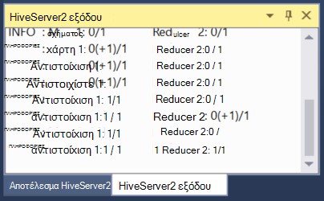

## Δημιουργία ομάδας έργου

Μπορείτε επίσης να δημιουργήσετε ένα έργο που περιέχει πολλές δέσμες ενεργειών της ομάδας. Αυτό είναι χρήσιμο όταν έχετε συσχετισμένους δέσμες ενεργειών που πρέπει να διατηρήσετε μαζί, ή τη διατήρηση χρησιμοποιώντας μια έκδοση συστήματα ελέγχου.

1. Στο Visual Studio, επιλέξτε __αρχείο__, __Δημιουργία__και then__Project__.

2. Από τη λίστα των έργων, αναπτύξτε __πρότυπα__, __Azure λίμνης δεδομένων__ και, στη συνέχεια, επιλέξτε __ΟΜΆΔΑ (HDInsight)__. Από τη λίστα των προτύπων, επιλέξτε __Hive δείγμα__. Πληκτρολογήστε ένα όνομα και μια θέση και, στη συνέχεια, επιλέξτε __OK__.

    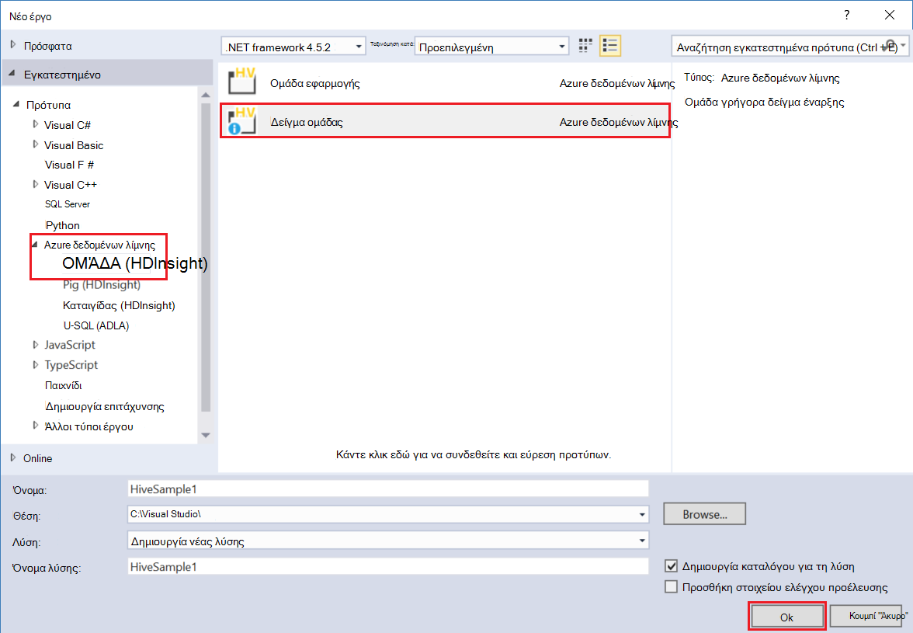

Το __Δείγμα ομάδας__ έργου περιέχει δύο δέσμες ενεργειών, __WebLogAnalysis.hql__ και __SensorDataAnalysis.hql__. Μπορείτε να υποβάλετε αυτές χρησιμοποιώντας το ίδιο κουμπί __Υποβολή__ στο επάνω μέρος του παραθύρου.

## Δημιουργία έργου γουρούνι

Ενώ ομάδας παρέχει μια γλώσσα μοιάζει με SQL για την εργασία με δομημένα δεδομένα, γουρούνι παρέχει μια γλώσσα (Λατινικά γουρούνι), η οποία σας επιτρέπει να αναπτύξετε μια διαδικασία μετασχηματισμών που έχουν εφαρμοστεί στα δεδομένα σας. Χρησιμοποιήστε τα ακόλουθα βήματα για να χρησιμοποιήσετε γουρούνι με το τοπικό σύμπλεγμα.

1. Ανοίξτε το Visual Studio και επιλέξτε __το αρχείο__, __Δημιουργία__και, στη συνέχεια, το __Project__. Από τη λίστα των έργων, ανάπτυξη __προτύπων__, __Azure λίμνης δεδομένων__, και, στη συνέχεια, επιλέξτε __γουρούνι (HDInsight)__. Από τη λίστα των προτύπων, επιλέξτε __Εφαρμογή γουρούνι__. Πληκτρολογήστε ένα όνομα, θέση, και, στη συνέχεια, επιλέξτε __OK__.

    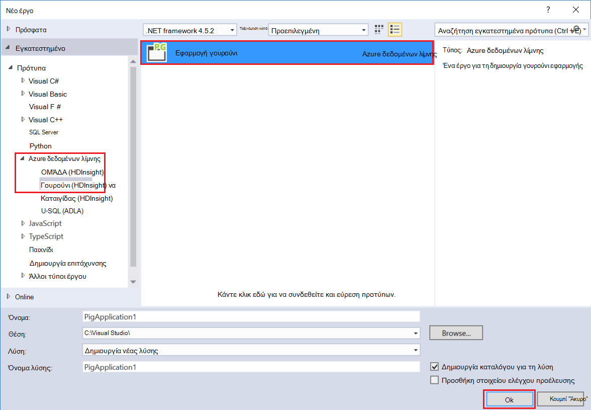

2. Πληκτρολογήστε τις ακόλουθες πληροφορίες με τα περιεχόμενα του αρχείου __script.pig__ που δημιουργήθηκε με αυτό το έργο.

        a = LOAD '/demo/data/Website/Website-Logs' AS (
            log_id:int, 
            ip_address:chararray, 
            date:chararray, 
            time:chararray, 
            landing_page:chararray, 
            source:chararray);
        b = FILTER a BY (log_id > 100);
        c = GROUP b BY ip_address;
        DUMP c;

    Ενώ γουρούνι χρησιμοποιεί μια διαφορετική γλώσσα από την ομάδα, πώς μπορείτε να εκτελέσετε τις εργασίες είναι συνεπείς μεταξύ δύο γλωσσών μέσω του κουμπιού " __Υποβολή__ ". Επιλογή αναπτυσσόμενο μενού προς τα κάτω δίπλα στο στοιχείο __Υποβολή__ εμφανίζει ένα παράθυρο διαλόγου για προχωρημένους υποβολή για γουρούνι.

    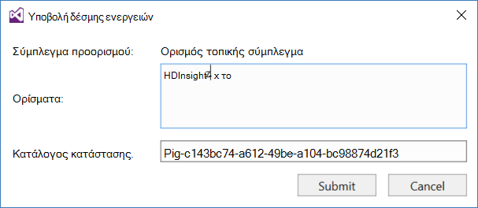
    
3. Η κατάσταση εργασίας και το αποτέλεσμα είναι επίσης εμφανίζονται με τον ίδιο ως ομάδα ερωτήματος.

    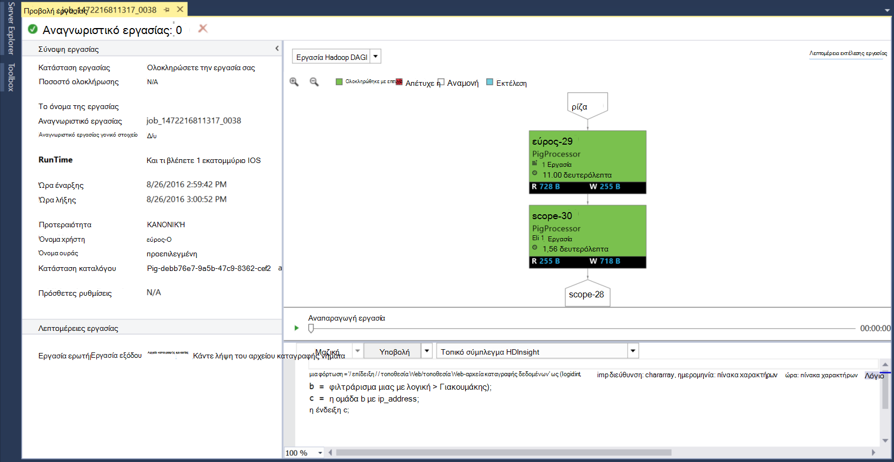

## Προβολή εργασιών

Azure εργαλεία λίμνης δεδομένων επιτρέπει επίσης να εύκολα προβολή πληροφοριών σχετικά με τις εργασίες που έχουν εκτελέσατε στον Hadoop. Χρησιμοποιήστε τα ακόλουθα βήματα για να δείτε τις εργασίες που έχουν εκτελέσατε στο τοπικό σύμπλεγμα.

1. Από την __Εξερεύνηση Server__, κάντε δεξί κλικ στο τοπικό σύμπλεγμα και, στη συνέχεια, επιλέξτε __Προβολή εργασιών__. Αυτό θα εμφανίσει μια λίστα των εργασιών που έχουν υποβληθεί στο σύμπλεγμα.

    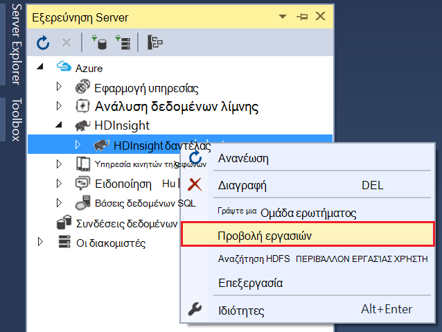

2. Από τη λίστα εργασιών, επιλέξτε μία για να προβάλετε τις λεπτομέρειες της εργασίας.

    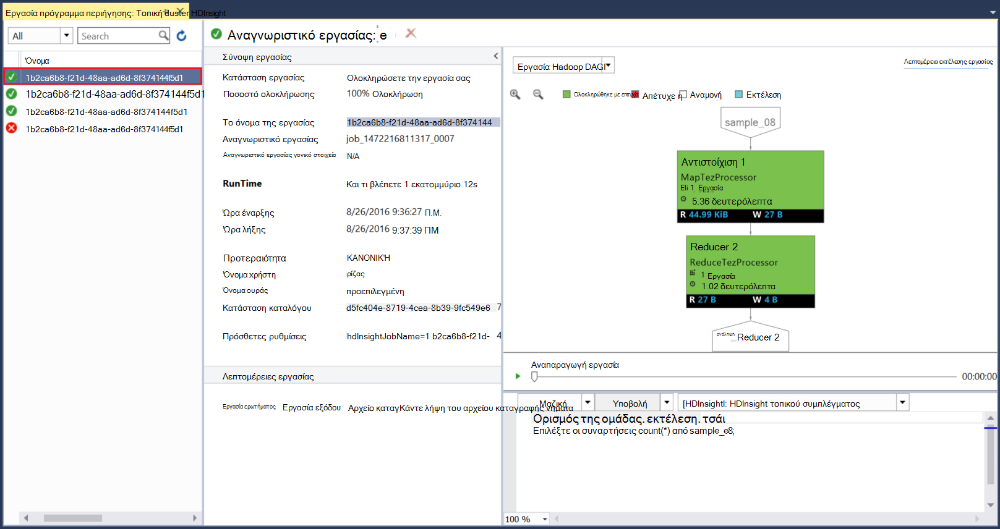

    Οι πληροφορίες που εμφανίζονται είναι παρόμοιο με αυτό που βλέπετε μετά την εκτέλεση της ομάδας ή γουρούνι ερωτήματος, μαζί με συνδέσεις για να προβάλετε την έξοδο και καταγραφή πληροφοριών.

3. Μπορείτε, επίσης, να τροποποιήσετε και να υποβάλετε ξανά την εργασία από εδώ.

## Προβολή Hive βάσεις δεδομένων

1. Στην __Εξερεύνηση Server__, αναπτύξτε την καταχώρηση __HDInsight τοπικό σύμπλεγμα__ και, στη συνέχεια, αναπτύξτε το στοιχείο __Hive βάσεις δεδομένων__. Αυτό θα αποκαλύψει τις βάσεις δεδομένων __προεπιλεγμένες__ και __xademo__ στο τοπικό σύμπλεγμα. Επέκταση μιας βάσης δεδομένων αποκαλύπτει τους πίνακες μέσα στη βάση δεδομένων.

    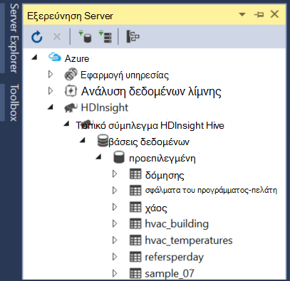

2. Επέκταση πίνακα εμφανίζει τις στήλες για αυτόν τον πίνακα. Μπορείτε να κάντε δεξί κλικ σε έναν πίνακα και επιλέξτε __Προβολή των πρώτων 100 γραμμών__ για να προβάλετε γρήγορα τα δεδομένα.

    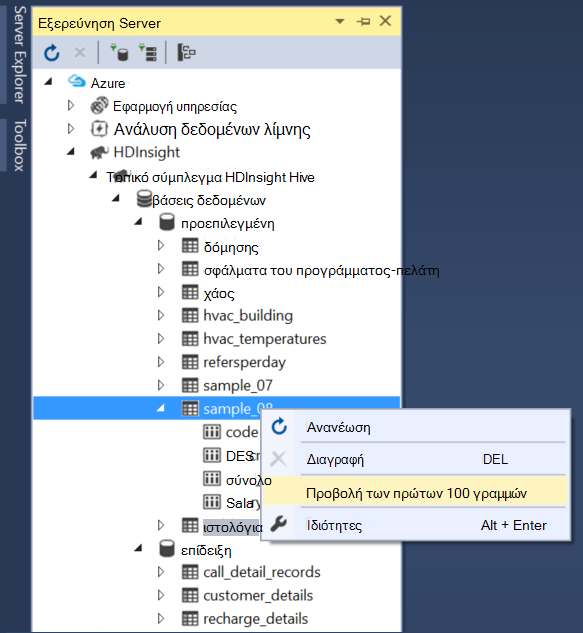

### Ιδιότητες βάσης δεδομένων και πίνακα

Ίσως έχετε παρατηρήσει ότι μπορείτε να επιλέξετε για να προβάλετε τις __Ιδιότητες__ σε μια βάση δεδομένων ή έναν πίνακα. Αυτό θα εμφανιστούν λεπτομέρειες για το επιλεγμένο στοιχείο στο παράθυρο διαλόγου Ιδιότητες.

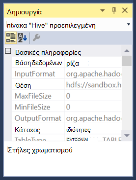

### Δημιουργία πίνακα

Για να δημιουργήσετε έναν νέο πίνακα, κάντε δεξί κλικ σε μια βάση δεδομένων και, στη συνέχεια, επιλέξτε __Δημιουργία πίνακα__.

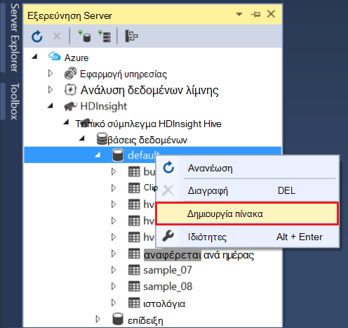

Στη συνέχεια, μπορείτε να δημιουργήσετε τον πίνακα χρησιμοποιώντας μια φόρμα. Μπορείτε να δείτε τα ανεπεξέργαστα HiveQL που θα χρησιμοποιηθεί για να δημιουργήσετε τον πίνακα στο κάτω μέρος αυτής της σελίδας.

## Επόμενα βήματα

* [Τα καλώδια από το φίλτρο Hortonworks εκμάθησης](http://hortonworks.com/hadoop-tutorial/learning-the-ropes-of-the-hortonworks-sandbox/)
* [Πρόγραμμα εκμάθησης Hadoop - γρήγορα αποτελέσματα με το HDP](http://hortonworks.com/hadoop-tutorial/hello-world-an-introduction-to-hadoop-hcatalog-hive-and-pig/)