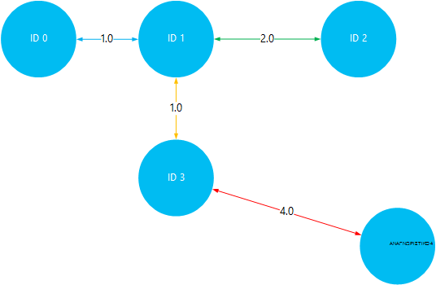

<properties
    pageTitle="Εγκατάσταση και χρήση Giraph στον βάσει Linux HDInsight (Hadoop) | Microsoft Azure"
    description="Μάθετε πώς μπορείτε να εγκαταστήσετε το Giraph σε συμπλεγμάτων βάσει Linux HDInsight χρήση δέσμης ενεργειών. Ενέργειες δέσμης ενεργειών σάς επιτρέπουν να προσαρμόσετε το σύμπλεγμα κατά τη δημιουργία, αλλαγή ρύθμιση παραμέτρων του συμπλέγματος ή εγκαθιστώντας υπηρεσιών και των βοηθητικών προγραμμάτων."
    services="hdinsight"
    documentationCenter=""
    authors="Blackmist"
    manager="jhubbard"
    editor="cgronlun"
    tags="azure-portal"/>

<tags
    ms.service="hdinsight"
    ms.workload="big-data"
    ms.tgt_pltfrm="na"
    ms.devlang="na"
    ms.topic="article"
    ms.date="10/17/2016"
    ms.author="larryfr"/>

# Εγκατάσταση Giraph σε HDInsight Hadoop συμπλεγμάτων και χρησιμοποιήστε Giraph για την επεξεργασία ευρείας κλίμακας γραφημάτων

Μπορείτε να εγκαταστήσετε Giraph σε οποιονδήποτε τύπο σύμπλεγμα στο Hadoop στην Azure HDInsight με χρήση **Δέσμης ενεργειών** για να προσαρμόσετε ένα σύμπλεγμα.

Σε αυτό το θέμα, θα μάθετε πώς να εγκαταστήσετε το Giraph με χρήση δέσμης ενεργειών. Αφού έχετε εγκαταστήσει Giraph, επίσης θα μάθετε πώς μπορείτε να χρησιμοποιήσετε Giraph για τις συνηθέστερες εφαρμογές, που είναι η επεξεργασία ευρείας κλίμακας γραφημάτων.

> [AZURE.NOTE] Οι πληροφορίες σε αυτό το άρθρο αφορά συγκεκριμένα συμπλεγμάτων βάσει Linux HDInsight. Για πληροφορίες σχετικά με την εργασία με συμπλεγμάτων που βασίζεται στα Windows, ανατρέξτε στο θέμα [Εγκατάσταση Giraph σε HDInsight Hadoop συμπλεγμάτων (Windows)](hdinsight-hadoop-giraph-install.md)

## Τι είναι το Giraph;

[Apache Giraph](http://giraph.apache.org/) σας επιτρέπει να εκτελέσετε graph επεξεργασίας με τη χρήση Hadoop, και μπορούν να χρησιμοποιηθούν με Azure HDInsight. Γραφήματα του μοντέλου σχέσεις μεταξύ των αντικειμένων, όπως οι συνδέσεις μεταξύ δρομολογητές μεγάλο δικτύου όπως το Internet ή σχέσεις μεταξύ των ατόμων στην κοινωνικά δίκτυα (μερικές φορές αναφέρεται ως ένα κοινωνικό γράφημα). Επεξεργασία γραφήματος σάς επιτρέπει να λόγο σχετικά με τις σχέσεις μεταξύ των αντικειμένων σε ένα γράφημα, όπως:

- Εντοπισμός πιθανά φίλοι με βάση την τρέχουσα σχέσεις.
- Εντοπισμός τη συντομότερη μεταξύ δύο υπολογιστών σε ένα δίκτυο.
- Υπολογίζει την κατάταξη σελίδα ιστοσελίδες.

> [AZURE.WARNING] Στοιχεία που παρέχονται με το σύμπλεγμα HDInsight υποστηρίζονται πλήρως και υποστήριξη της Microsoft θα σας βοηθήσει να απομονώσετε και να επιλύσετε θέματα που σχετίζονται με αυτά τα στοιχεία.
>
> Προσαρμοσμένα στοιχεία, όπως Giraph, λαμβάνετε εμπορικά λογικές υποστήριξη για να σας βοηθήσει να αντιμετωπίσετε περαιτέρω το ζήτημα. Αυτό μπορεί να έχει ως αποτέλεσμα το ζήτημα επίλυση ή που σας ζητά να συμμετάσχουν διαθέσιμα κανάλια για τις τεχνολογίες Άνοιγμα αρχείου προέλευσης όπου βρίσκονται πολλά επίπεδα εξειδίκευση για συγκεκριμένη τεχνολογία. Για παράδειγμα, υπάρχουν πολλές τοποθεσίες Κοινότητας που μπορούν να χρησιμοποιηθούν, όπως: [φόρουμ MSDN για το HDInsight](https://social.msdn.microsoft.com/Forums/azure/en-US/home?forum=hdinsight), [http://stackoverflow.com](http://stackoverflow.com). Επίσης, Apache έργα έχουν τοποθεσίες έργου στο [http://apache.org](http://apache.org), για παράδειγμα: [Hadoop](http://hadoop.apache.org/).

##Τι κάνει η δέσμη ενεργειών

Αυτή η δέσμη ενεργειών εκτελεί τις ακόλουθες ενέργειες:

* Εγκαταστάσεις Giraph να`/usr/hdp/current/giraph`
* Αντίγραφα του `giraph-examples.jar` αρχείου στο προεπιλεγμένο αποθήκευσης (WASB) για το σύμπλεγμά σας:`/example/jars/giraph-examples.jar`

## Εγκατάσταση Giraph χρήση δέσμης ενεργειών

Ένα δείγμα δέσμης ενεργειών για την εγκατάσταση Giraph σε ένα σύμπλεγμα HDInsight είναι διαθέσιμη στην ακόλουθη θέση.

    https://hdiconfigactions.blob.core.windows.net/linuxgiraphconfigactionv01/giraph-installer-v01.sh

Αυτή η ενότητα παρέχει οδηγίες σχετικά με τη χρήση του δείγματος δέσμης ενεργειών κατά τη δημιουργία του συμπλέγματος χρησιμοποιώντας την πύλη Azure. 

> [AZURE.NOTE] Azure PowerShell, την CLI Azure, το HDInsight .NET SDK ή πρότυπα διαχείρισης πόρων Azure επίσης μπορεί να χρησιμοποιηθεί για την εφαρμογή δέσμης ενεργειών. Μπορείτε επίσης να εφαρμόσετε ενέργειες δέσμης ενεργειών για να εκτελείται ήδη συμπλεγμάτων. Για περισσότερες πληροφορίες, ανατρέξτε στο θέμα [Προσαρμογή HDInsight συμπλεγμάτων ενέργειες δέσμης ενεργειών](hdinsight-hadoop-customize-cluster-linux.md).

1. Έναρξη δημιουργίας ένα σύμπλεγμα, χρησιμοποιώντας τα βήματα που περιγράφονται σε [συμπλεγμάτων βάσει δημιουργία Linux HDInsight](hdinsight-hadoop-create-linux-clusters-portal.md), αλλά μην ολοκληρώσετε τη δημιουργία.

2. Στην blade την **Προαιρετική ρύθμιση παραμέτρων** , επιλέξτε **Ενέργειες δέσμης ενεργειών**και δώστε τις παρακάτω πληροφορίες:

    * __ΌΝΟΜΑ__: Πληκτρολογήστε ένα φιλικό όνομα για την ενέργεια δέσμης ενεργειών.
    * __Δέσμη ΕΝΕΡΓΕΙΏΝ URI__: https://hdiconfigactions.blob.core.windows.net/linuxgiraphconfigactionv01/giraph-installer-v01.sh
    * __ΠΡΟΪΣΤΆΜΕΝΟΣ__: Ενεργοποιήστε αυτή την επιλογή
    * __ΕΡΓΑΖΌΜΕΝΟΥ__: Αφήστε αυτό το απενεργοποιημένο
    * __ZOOKEEPER__: Αφήστε αυτό το απενεργοποιημένο
    * __ΠΑΡΆΜΕΤΡΟΙ__: Αφήστε κενό αυτό το πεδίο

3. Στο κάτω από τις **Ενέργειες δέσμης ενεργειών**, χρησιμοποιήστε το κουμπί **επιλογή** για να αποθηκεύσετε τη ρύθμιση παραμέτρων. Τέλος, χρησιμοποιήστε το κουμπί **επιλογή** στο κάτω μέρος του blade **Προαιρετική ρύθμιση παραμέτρων** για να αποθηκεύσετε τις πληροφορίες προαιρετικών παραμέτρων.

4. Συνεχίσετε με τη δημιουργία του συμπλέγματος, όπως περιγράφεται στο [συμπλεγμάτων βάσει δημιουργία Linux HDInsight](hdinsight-hadoop-create-linux-clusters-portal.md).

## Πώς χρησιμοποιώ Giraph στο HDInsight;

Μόλις ολοκληρωθεί η δημιουργία του συμπλέγματος, χρησιμοποιήστε τα ακόλουθα βήματα για να εκτελέσετε το παράδειγμα SimpleShortestPathsComputation περιλαμβάνεται Giraph. Αυτό υλοποιεί την βασική εφαρμογή <a href = "http://people.apache.org/~edwardyoon/documents/pregel.pdf">Pregel</a> για την εύρεση τη συντομότερη διαδρομή μεταξύ των αντικειμένων σε ένα γράφημα.

1. Συνδεθείτε με το σύμπλεγμα HDInsight χρησιμοποιώντας SSH:

        ssh USERNAME@CLUSTERNAME-ssh.azurehdinsight.net

    Για περισσότερες πληροφορίες σχετικά με τη χρήση SSH με το HDInsight, ανατρέξτε στα παρακάτω:

    * [Χρήση SSH με βάσει Linux Hadoop σε HDInsight από Linux, Unix ή λειτουργικό σύστημα OS X](hdinsight-hadoop-linux-use-ssh-unix.md)

    * [Χρήση SSH με βάσει Linux Hadoop σε HDInsight από το Windows](hdinsight-hadoop-linux-use-ssh-windows.md)

1. Χρησιμοποιήστε τα ακόλουθα για να δημιουργήσετε ένα νέο αρχείο με το όνομα __tiny_graph.txt__:

        nano tiny_graph.txt

    Χρησιμοποιήστε τα παρακάτω ανάλογα με τα περιεχόμενα αυτού του αρχείου:

        [0,0,[[1,1],[3,3]]]
        [1,0,[[0,1],[2,2],[3,1]]]
        [2,0,[[1,2],[4,4]]]
        [3,0,[[0,3],[1,1],[4,4]]]
        [4,0,[[3,4],[2,4]]]

    Αυτά τα δεδομένα περιγράφονται μια σχέση μεταξύ των αντικειμένων σε μια άμεση graph, χρησιμοποιώντας τη μορφή [προέλευσης\_αναγνωριστικό, προέλευση\_τιμή, [[προορισμού\_id], [άκρη\_τιμή];...]]. Κάθε γραμμή αντιπροσωπεύει μια σχέση μεταξύ μιας **προέλευση\_αναγνωριστικό** αντικειμένου και μία ή περισσότερες **προορισμού\_αναγνωριστικό** αντικείμενα. Το **άκρου\_τιμή** (ή πάχους) μπορεί να θεωρηθεί ως θραύσης ή απόσταση της σύνδεσης μεταξύ **source_id** και **προορισμού\_αναγνωριστικό**.

    Σχεδιάσει, και χρησιμοποιεί την τιμή (ή πάχους) ως την απόσταση μεταξύ των αντικειμένων, των παραπάνω δεδομένων μπορεί να είναι ως εξής:

    

2. Για να αποθηκεύσετε το αρχείο, χρησιμοποιήστε το __Συνδυασμό πλήκτρων Ctrl + X__, στη συνέχεια, __Y__και τέλος __Enter__ για να αποδεχθείτε το όνομα του αρχείου.

3. Χρησιμοποιήστε τα ακόλουθα για να αποθηκεύσετε τα δεδομένα σε κύρια χώρου αποθήκευσης για το σύμπλεγμά σας HDInsight:

        hdfs dfs -put tiny_graph.txt /example/data/tiny_graph.txt

4. Εκτελέστε το παράδειγμα SimpleShortestPathsComputation χρησιμοποιώντας την ακόλουθη εντολή.

         yarn jar /usr/hdp/current/giraph/giraph-examples.jar org.apache.giraph.GiraphRunner org.apache.giraph.examples.SimpleShortestPathsComputation -ca mapred.job.tracker=headnodehost:9010 -vif org.apache.giraph.io.formats.JsonLongDoubleFloatDoubleVertexInputFormat -vip /example/data/tiny_graph.txt -vof org.apache.giraph.io.formats.IdWithValueTextOutputFormat -op /example/output/shortestpaths -w 2

    Στον παρακάτω πίνακα περιγράφονται οι παράμετροι χρησιμοποιούνται με αυτήν την εντολή.

  	| Παράμετρος | Τι κάνει |
  	| --------- | ------------ |
  	| `jar /usr/hdp/current/giraph/giraph-examples.jar` | Το αρχείο βάζο που περιέχει τα παραδείγματα. |
  	| `org.apache.giraph.GiraphRunner` | Η κλάση που χρησιμοποιείται για να ξεκινήσετε τα παραδείγματα. |
  	| `org.apache.giraph.examples.SimpleShortestPathsCoputation` | Το παράδειγμα που θα είναι εκτελέσατε. Σε αυτήν την περίπτωση, αυτό θα υπολογίσει τη συντομότερη διαδρομή μεταξύ 1 Αναγνωριστικό και όλα τα άλλα αναγνωριστικά στο γράφημα. |
  	| `-ca mapred.job.tracker=headnodehost:9010` | Το headnode για το σύμπλεγμα. |
  	| `-vif org.apache.giraph.io.formats.JsonLongDoubleFloatDoubleVertexInputFromat` | Η μορφή εισόδου για να χρησιμοποιήσετε για τα δεδομένα εισόδου. |
  	| `-vip /example/data/tiny_graph.txt` | Το αρχείο εισαγωγής δεδομένων. |
  	| `-vof org.apache.giraph.io.formats.IdWithValueTextOutputFormat` | Η μορφή εξόδου. Σε αυτήν την περίπτωση, ΑΝΑΓΝΩΡΙΣΤΙΚΌ και τιμών ως απλό κείμενο. |
  	| `-op /example/output/shortestpaths` | Η θέση εξόδου. |
  	| `-w 2` | Ο αριθμός των εργαζομένων για να χρησιμοποιήσετε. Σε αυτήν την περίπτωση, 2. |

    Για περισσότερες πληροφορίες σχετικά με αυτές, καθώς και άλλες παραμέτρους που χρησιμοποιούνται με δείγματα Giraph, ανατρέξτε στο θέμα η [γρήγορη έναρξη Giraph](http://giraph.apache.org/quick_start.html).

5. Μόλις ολοκληρωθεί η εργασία, τα αποτελέσματα θα είναι αποθηκευμένα στις το __wasbs: / / / παράδειγμα/ανάληψης/shotestpaths__ καταλόγου. Τα αρχεία που δημιουργούνται θα ξεκινήσει με __τμήμα-m -__ και τέλος με έναν αριθμό που υποδηλώνει το πρώτο, δεύτερο, αρχείο κ.λπ.. Χρησιμοποιήστε τα ακόλουθα για να δείτε το αποτέλεσμα:

        hdfs dfs -text /example/output/shortestpaths/*

    Το αποτέλεσμα θα πρέπει να είναι παρόμοιο με τα εξής:

        0   1.0
        4   5.0
        2   2.0
        1   0.0
        3   1.0

    Το παράδειγμα είναι δύσκολο για να ξεκινήσετε με κώδικα SimpleShortestPathComputation αντικείμενο Αναγνωριστικό 1 και να βρείτε τη συντομότερη διαδρομή σε άλλα αντικείμενα. Έτσι θα πρέπει να διαβάσετε το αποτέλεσμα ως `destination_id distance`, όπου απόσταση είναι η τιμή (ή πάχους) των ακμών που διανύθηκαν μεταξύ αντικειμένου Αναγνωριστικό 1 και το αναγνωριστικό του προορισμού.

    Οπτικοποίηση αυτό, μπορείτε να επαληθεύσετε τα αποτελέσματα από ταξιδεύετε την πιο μικρή διαδρομές μεταξύ 1 Αναγνωριστικό και όλα τα άλλα αντικείμενα. Σημειώστε ότι η διαδρομή συντομότερη μεταξύ 1 Αναγνωριστικό και Αναγνωριστικό 4 είναι 5. Αυτή είναι η συνολική απόσταση μεταξύ Αναγνωριστικό 1 και 3, και, στη συνέχεια, Αναγνωριστικό 3 και 4.

    

## Επόμενα βήματα

- [Εγκατάσταση και χρήση συμπλεγμάτων απόχρωση σε HDInsight](hdinsight-hadoop-hue-linux.md). Απόχρωση είναι ένα περιβάλλον εργασίας Χρήστη που σας διευκολύνουν να δημιουργήσετε, να εκτελέσετε και αποθήκευση γουρούνι και ομάδα εργασίες, καθώς και αναζήτηση το προεπιλεγμένο αποθήκευσης για το HDInsight συμπλέγματος web.

- [Εγκατάσταση R σε HDInsight συμπλεγμάτων](hdinsight-hadoop-r-scripts-linux.md): οδηγίες σχετικά με τον τρόπο χρήσης συμπλέγματος προσαρμογής για να εγκαταστήσετε και να χρησιμοποιήσετε R σε συμπλεγμάτων HDInsight Hadoop. R είναι μια γλώσσα προέλευσης άνοιγμα και περιβάλλον για τον υπολογισμό στατιστικών. Παρέχει εκατοντάδες ενσωματωμένη στατιστικές συναρτήσεις και δικό του γλώσσα προγραμματισμού που συνδυάζει πτυχές προγραμματισμού λειτουργική και προσανατολισμένα σε αντικείμενα. Επίσης, παρέχει εκτεταμένη δυνατότητες γραφικών.

- [Εγκατάσταση Solr στην συμπλεγμάτων HDInsight](hdinsight-hadoop-solr-install-linux.md). Χρησιμοποιήστε σύμπλεγμα προσαρμογής για να εγκαταστήσετε Solr σε συμπλεγμάτων HDInsight Hadoop. Solr σάς επιτρέπει να εκτελέσετε λειτουργίες ισχυρή αναζήτησης στα δεδομένα που είναι αποθηκευμένα.
