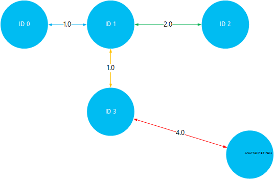

<properties
    pageTitle="Εγκατάσταση και χρήση Giraph στον Hadoop συμπλεγμάτων στο HDInsight | Microsoft Azure"
    description="Μάθετε πώς μπορείτε να προσαρμόσετε σύμπλεγμα HDInsight με Giraph και πώς μπορείτε να χρησιμοποιήσετε Giraph."
    services="hdinsight"
    documentationCenter=""
    authors="nitinme"
    manager="jhubbard"
    editor="cgronlun"
    tags="azure-portal"/>

<tags
    ms.service="hdinsight"
    ms.workload="big-data"
    ms.tgt_pltfrm="na"
    ms.devlang="na"
    ms.topic="article"
    ms.date="02/05/2016"
    ms.author="nitinme"/>

# Εγκατάσταση και χρήση Giraph στο HDInsight

Μάθετε πώς μπορείτε να προσαρμόσετε σύμπλεγμα HDInsight που βασίζεται σε Windows με Giraph με χρήση δέσμης ενεργειών και πώς μπορείτε να χρησιμοποιήσετε Giraph για να επεξεργαστείτε γραφικά ευρείας κλίμακας. Για πληροφορίες σχετικά με τη χρήση Giraph με ένα σύμπλεγμα βάσει Linux, ανατρέξτε στο θέμα [Εγκατάσταση Giraph σε HDInsight Hadoop συμπλεγμάτων (Linux)](hdinsight-hadoop-giraph-install-linux.md).
 
Μπορείτε να εγκαταστήσετε Giraph σε οποιονδήποτε τύπο συμπλέγματος (Hadoop, καταιγίδας, HBase, τους) στο Azure HDInsight με χρήση *Δέσμης ενεργειών*. Ένα δείγμα δέσμης ενεργειών για την εγκατάσταση Giraph σε ένα σύμπλεγμα HDInsight είναι διαθέσιμη από ένα μόνο για ανάγνωση Azure χώρο αποθήκευσης αντικειμένων blob στο [https://hdiconfigactions.blob.core.windows.net/giraphconfigactionv01/giraph-installer-v01.ps1](https://hdiconfigactions.blob.core.windows.net/giraphconfigactionv01/giraph-installer-v01.ps1). Το δείγμα δέσμης ενεργειών λειτουργεί μόνο με HDInsight σύμπλεγμα έκδοση 3.1. Για περισσότερες πληροφορίες σχετικά με εκδόσεις σύμπλεγμα HDInsight, ανατρέξτε στο θέμα [εκδόσεις σύμπλεγμα HDInsight](hdinsight-component-versioning.md).

**Σχετικά άρθρα**

- [Εγκατάσταση Giraph σε HDInsight Hadoop συμπλεγμάτων (Linux)](hdinsight-hadoop-giraph-install-linux.md)
- [Δημιουργία Hadoop συμπλεγμάτων στο HDInsight](hdinsight-provision-clusters.md): γενικές πληροφορίες σχετικά με τη δημιουργία συμπλεγμάτων HDInsight.
- [Προσαρμογή με χρήση δέσμης ενεργειών σύμπλεγμα HDInsight][hdinsight-cluster-customize]: γενικές πληροφορίες σχετικά με την προσαρμογή συμπλεγμάτων HDInsight με χρήση δέσμης ενεργειών.
- [Ανάπτυξη δέσμης ενεργειών δέσμες ενεργειών για HDInsight](hdinsight-hadoop-script-actions.md).

## Τι είναι το Giraph;

<a href="http://giraph.apache.org/" target="_blank">Apache Giraph</a> σας επιτρέπει να εκτελέσετε graph επεξεργασίας με τη χρήση Hadoop, και μπορούν να χρησιμοποιηθούν με Azure HDInsight. Γραφήματα του μοντέλου σχέσεις μεταξύ των αντικειμένων, όπως οι συνδέσεις μεταξύ δρομολογητές μεγάλο δικτύου όπως το Internet ή σχέσεις μεταξύ των ατόμων στην κοινωνικά δίκτυα (μερικές φορές αναφέρεται ως ένα κοινωνικό γράφημα). Επεξεργασία γραφήματος σάς επιτρέπει να λόγο σχετικά με τις σχέσεις μεταξύ των αντικειμένων σε ένα γράφημα, όπως:

- Εντοπισμός πιθανά φίλοι με βάση την τρέχουσα σχέσεις.
- Εντοπισμός τη συντομότερη μεταξύ δύο υπολογιστών σε ένα δίκτυο.
- Υπολογίζει την κατάταξη σελίδα ιστοσελίδες.

## Εγκατάσταση Giraph με πύλη

1. Έναρξη δημιουργίας ένα σύμπλεγμα, χρησιμοποιώντας την επιλογή **ΔΗΜΙΟΥΡΓΊΑ ΠΡΟΣΑΡΜΟΣΜΈΝΗΣ** , όπως περιγράφεται στην [συμπλεγμάτων δημιουργία Hadoop στο HDInsight](hdinsight-provision-clusters.md#portal).
2. Στη σελίδα **Ενέργειες δέσμης ενεργειών** του οδηγού, κάντε κλικ στην επιλογή **Προσθήκη ενέργειας δέσμη ενεργειών** για την παροχή λεπτομερειών σχετικά με την ενέργεια δέσμη ενεργειών, όπως φαίνεται παρακάτω:

    ![Χρήση δέσμης ενεργειών για να προσαρμόσετε ένα σύμπλεγμα] (./media/hdinsight-hadoop-giraph-install/hdi-script-action-giraph.png "Χρήση δέσμης ενεργειών για να προσαρμόσετε ένα σύμπλεγμα")

    <table border='1'>
        <tr><th>Ιδιότητα</th><th>Τιμή</th></tr>
        <tr><td>Όνομα</td>
            <td>Καθορίστε ένα όνομα για την ενέργεια δέσμης ενεργειών. Για παράδειγμα, <b>Giraph εγκατάσταση</b>.</td></tr>
        <tr><td>Δέσμη ενεργειών URI</td>
            <td>Καθορίστε το ενιαίο αναγνωριστικό πόρου (URI) στη δέσμη ενεργειών που καλείται για να προσαρμόσετε το σύμπλεγμα. Για παράδειγμα, <i>https://hdiconfigactions.blob.core.windows.net/giraphconfigactionv01/giraph-installer-v01.ps1</i></td></tr>
        <tr><td>Τύπος κόμβου</td>
            <td>Καθορίστε τους κόμβους στην οποία εκτελείται η δέσμη ενεργειών προσαρμογής. Μπορείτε να επιλέξετε <b>όλους τους κόμβους</b>, <b>μόνο κόμβους κεφαλή</b>ή <b>κόμβους εργασίας μόνο</b>.
        <tr><td>Παράμετροι</td>
            <td>Καθορίστε τις παραμέτρους, εάν απαιτείται από τη δέσμη ενεργειών. Η δέσμη ενεργειών για την εγκατάσταση Giraph δεν απαιτεί τις παραμέτρους, ώστε να μπορείτε να αφήσετε αυτό είναι κενό.</td></tr>
    </table>

    Μπορείτε να προσθέσετε περισσότερες από μία ενέργεια δέσμη ενεργειών για την εγκατάσταση πολλών στοιχείων στο σύμπλεγμα. Αφού προσθέσετε τις δέσμες ενεργειών, επιλέξτε το σημάδι επιλογής για να ξεκινήσετε τη δημιουργία του συμπλέγματος.

## Χρήση Giraph

Μπορούμε να χρησιμοποιήσουμε το παράδειγμα SimpleShortestPathsComputation για μια επίδειξη την βασική εφαρμογή <a href = "http://people.apache.org/~edwardyoon/documents/pregel.pdf">Pregel</a> για την εύρεση τη συντομότερη διαδρομή μεταξύ των αντικειμένων σε ένα γράφημα. Χρησιμοποιήστε τα παρακάτω βήματα για να αποστείλετε το δείγμα δεδομένων και το δείγμα βάζο, εκτελέστε μια εργασία χρησιμοποιώντας το παράδειγμα SimpleShortestPathsComputation και, στη συνέχεια, να προβάλετε τα αποτελέσματα.

1. Αποστείλετε ένα δείγμα αρχείου δεδομένων με το χώρο αποθήκευσης αντικειμένων Blob του Azure. Στην τον τοπικό σταθμούς εργασίας, δημιουργήστε ένα νέο αρχείο με το όνομα **tiny_graph.txt**. Θα πρέπει να περιέχει τις ακόλουθες γραμμές:

        [0,0,[[1,1],[3,3]]]
        [1,0,[[0,1],[2,2],[3,1]]]
        [2,0,[[1,2],[4,4]]]
        [3,0,[[0,3],[1,1],[4,4]]]
        [4,0,[[3,4],[2,4]]]

    Αποστολή του αρχείου tiny_graph.txt τον πρωτεύοντα χώρο αποθήκευσης για το σύμπλεγμά σας HDInsight. Για οδηγίες σχετικά με τον τρόπο για την αποστολή δεδομένων, ανατρέξτε στο θέμα [Αποστολή δεδομένων για τις εργασίες Hadoop στο HDInsight](hdinsight-upload-data.md).

    Αυτά τα δεδομένα περιγράφονται μια σχέση μεταξύ των αντικειμένων σε μια άμεση graph, χρησιμοποιώντας τη μορφή [προέλευσης\_αναγνωριστικό, προέλευση\_τιμή, [[προορισμού\_id], [άκρη\_τιμή];...]]. Κάθε γραμμή αντιπροσωπεύει μια σχέση μεταξύ μιας **προέλευση\_αναγνωριστικό** αντικειμένου και μία ή περισσότερες **προορισμού\_αναγνωριστικό** αντικείμενα. Το **άκρου\_τιμή** (ή πάχους) μπορεί να θεωρηθεί ως θραύσης ή απόσταση της σύνδεσης μεταξύ **source_id** και **προορισμού\_αναγνωριστικό**.

    Σχεδιάσει, και χρησιμοποιεί την τιμή (ή πάχους) ως την απόσταση μεταξύ των αντικειμένων, των παραπάνω δεδομένων μπορεί να είναι ως εξής:

    

4. Εκτελέστε το παράδειγμα SimpleShortestPathsComputation. Χρησιμοποιήστε τα παρακάτω cmdlet του Azure PowerShell για να εκτελέσετε το παράδειγμα, χρησιμοποιώντας το αρχείο tiny_graph.txt ως είσοδο. 

    [AZURE.INCLUDE [upgrade-powershell](../../includes/hdinsight-use-latest-powershell.md)]

        $clusterName = "clustername"
        # Giraph examples jar
        $jarFile = "wasbs:///example/jars/giraph-examples.jar"
        # Arguments for this job
        $jobArguments = "org.apache.giraph.examples.SimpleShortestPathsComputation",
                        "-ca", "mapred.job.tracker=headnodehost:9010",
                        "-vif", "org.apache.giraph.io.formats.JsonLongDoubleFloatDoubleVertexInputFormat",
                        "-vip", "wasbs:///example/data/tiny_graph.txt",
                        "-vof", "org.apache.giraph.io.formats.IdWithValueTextOutputFormat",
                        "-op",  "wasbs:///example/output/shortestpaths",
                        "-w", "2"
        # Create the definition
        $jobDefinition = New-AzureHDInsightMapReduceJobDefinition
          -JarFile $jarFile
          -ClassName "org.apache.giraph.GiraphRunner"
          -Arguments $jobArguments

        # Run the job, write output to the Azure PowerShell window
        $job = Start-AzureHDInsightJob -Cluster $clusterName -JobDefinition $jobDefinition
        Write-Host "Wait for the job to complete ..." -ForegroundColor Green
        Wait-AzureHDInsightJob -Job $job
        Write-Host "STDERR"
        Get-AzureHDInsightJobOutput -Cluster $clusterName -JobId $job.JobId -StandardError
        Write-Host "Display the standard output ..." -ForegroundColor Green
        Get-AzureHDInsightJobOutput -Cluster $clusterName -JobId $job.JobId -StandardOutput

    Στο παραπάνω παράδειγμα, αντικαταστήστε **clustername** με το όνομα του συμπλέγματος HDInsight που έχει εγκατασταθεί Giraph.

5. Προβολή των αποτελεσμάτων. Μόλις ολοκληρωθεί η εργασία, τα αποτελέσματα θα είναι αποθηκευμένα στις δύο αρχεία εξόδου σε το __wasbs: / / / παράδειγμα/ανάληψης/shotestpaths__ φακέλου. Τα αρχεία ονομάζονται __τμήμα-m-00001__ και __τμήμα-m-00002__. Ακολουθήστε τα παρακάτω βήματα για να κάνετε λήψη και να προβάλετε το αποτέλεσμα:

        $subscriptionName = "<SubscriptionName>"       # Azure subscription name
        $storageAccountName = "<StorageAccountName>"   # Azure Storage account name
        $containerName = "<ContainerName>"             # Blob storage container name

        # Select the current subscription
        Select-AzureSubscription $subscriptionName

        # Create the Storage account context object
        $storageAccountKey = Get-AzureStorageKey $storageAccountName | %{ $_.Primary }
        $storageContext = New-AzureStorageContext -StorageAccountName $storageAccountName -StorageAccountKey $storageAccountKey

        # Download the job output to the workstation
        Get-AzureStorageBlobContent -Container $containerName -Blob example/output/shortestpaths/part-m-00001 -Context $storageContext -Force
        Get-AzureStorageBlobContent -Container $containerName -Blob example/output/shortestpaths/part-m-00002 -Context $storageContext -Force

    Αυτό θα δημιουργήσετε τη δομή του καταλόγου __παράδειγμα/έξοδο/shortestpaths__ στον τρέχοντα κατάλογο στην σας σταθμούς εργασίας και κάντε λήψη των αρχείων δύο εξόδου σε αυτήν τη θέση.

    Χρησιμοποιήστε το cmdlet __γάτα__ για να εμφανίσετε τα περιεχόμενα των αρχείων:

        Cat example/output/shortestpaths/part*

    Το αποτέλεσμα θα πρέπει να είναι παρόμοιο με τα εξής:

        0   1.0
        4   5.0
        2   2.0
        1   0.0
        3   1.0

    Το παράδειγμα είναι δύσκολο για να ξεκινήσετε με κώδικα SimpleShortestPathComputation αντικείμενο Αναγνωριστικό 1 και να βρείτε τη συντομότερη διαδρομή σε άλλα αντικείμενα. Έτσι θα πρέπει να διαβάσετε το αποτέλεσμα ως `destination_id distance`, όπου απόσταση είναι η τιμή (ή πάχους) των ακμών που διανύθηκαν μεταξύ αντικειμένου Αναγνωριστικό 1 και το αναγνωριστικό του προορισμού.

    Οπτικοποίηση αυτό, μπορείτε να επαληθεύσετε τα αποτελέσματα από ταξιδεύετε την πιο μικρή διαδρομές μεταξύ 1 Αναγνωριστικό και όλα τα άλλα αντικείμενα. Σημειώστε ότι η διαδρομή συντομότερη μεταξύ 1 Αναγνωριστικό και Αναγνωριστικό 4 είναι 5. Αυτή είναι η συνολική απόσταση μεταξύ Αναγνωριστικό 1 και 3, και, στη συνέχεια, Αναγνωριστικό 3 και 4.

    

## Εγκατάσταση με χρήση του Aure PowerShell Giraph

Ανατρέξτε στο θέμα [Προσαρμογή HDInsight συμπλεγμάτων με χρήση δέσμης ενεργειών](hdinsight-hadoop-customize-cluster.md#call_scripts_using_powershell).  Το δείγμα παρουσιάζει πώς μπορείτε να εγκαταστήσετε τους με χρήση του PowerShell Azure. Πρέπει να προσαρμόσετε τη δέσμη ενεργειών για να χρησιμοποιήσετε [https://hdiconfigactions.blob.core.windows.net/giraphconfigactionv01/giraph-installer-v01.ps1](https://hdiconfigactions.blob.core.windows.net/giraphconfigactionv01/giraph-installer-v01.ps1).

## Εγκατάσταση Giraph χρησιμοποιώντας .NET SDK

Ανατρέξτε στο θέμα [Προσαρμογή HDInsight συμπλεγμάτων με χρήση δέσμης ενεργειών](hdinsight-hadoop-customize-cluster.md#call_scripts_using_azure_powershell). Το δείγμα παρουσιάζει πώς μπορείτε να εγκαταστήσετε τους χρησιμοποιώντας το .NET SDK. Πρέπει να προσαρμόσετε τη δέσμη ενεργειών για να χρησιμοποιήσετε [https://hdiconfigactions.blob.core.windows.net/giraphconfigactionv01/giraph-installer-v01.ps1](https://hdiconfigactions.blob.core.windows.net/giraphconfigactionv01/giraph-installer-v01.ps1).

## Δείτε επίσης

- [Εγκατάσταση Giraph σε HDInsight Hadoop συμπλεγμάτων (Linux)](hdinsight-hadoop-giraph-install-linux.md)
- [Δημιουργία Hadoop συμπλεγμάτων στο HDInsight](hdinsight-provision-clusters.md): γενικές πληροφορίες σχετικά με τη δημιουργία συμπλεγμάτων HDInsight.
- [Προσαρμογή με χρήση δέσμης ενεργειών σύμπλεγμα HDInsight][hdinsight-cluster-customize]: γενικές πληροφορίες σχετικά με την προσαρμογή συμπλεγμάτων HDInsight με χρήση δέσμης ενεργειών.
- [Ανάπτυξη δέσμης ενεργειών δέσμες ενεργειών για HDInsight](hdinsight-hadoop-script-actions.md).
- [Εγκατάσταση και χρήση τους σε συμπλεγμάτων HDInsight][hdinsight-install-spark]: δείγμα δέσμης ενεργειών σχετικά με την εγκατάσταση τους.
- [Εγκατάσταση R σε συμπλεγμάτων HDInsight][hdinsight-install-r]: δείγμα δέσμης ενεργειών σχετικά με την εγκατάσταση R.
- [Εγκατάσταση Solr σε HDInsight συμπλεγμάτων](hdinsight-hadoop-solr-install.md): δείγμα δέσμης ενεργειών σχετικά με την εγκατάσταση του Solr.

[tools]: https://github.com/Blackmist/hdinsight-tools
[aps]: http://azure.microsoft.com/documentation/articles/install-configure-powershell/

[powershell-install]: ../powershell-install-configure.md
[hdinsight-provision]: hdinsight-provision-clusters.md
[hdinsight-install-r]: hdinsight-hadoop-r-scripts.md
[hdinsight-install-spark]: hdinsight-hadoop-spark-install.md
[hdinsight-cluster-customize]: hdinsight-hadoop-customize-cluster.md
