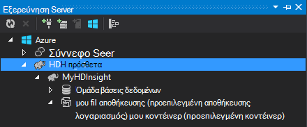

<properties
    pageTitle="Χρήση C# με ομάδα και γουρούνι σε Hadoop στο HDInsight | Microsoft Azure"
    description="Μάθετε πώς μπορείτε να χρησιμοποιήσετε C# συναρτήσεις χρήστη (UDF) με ομάδα και γουρούνι ροής στο Azure HDInsight."
    services="hdinsight"
    documentationCenter=""
    authors="Blackmist"
    manager="jhubbard"
    editor="cgronlun"
    tags="azure-portal"/>

<tags
    ms.service="hdinsight"
    ms.workload="big-data"
    ms.tgt_pltfrm="na"
    ms.devlang="dotnet"
    ms.topic="article"
    ms.date="10/28/2016"
    ms.author="larryfr"/>

#Χρήση C# συναρτήσεις χρήστη με ομάδα και γουρούνι ροής σε Hadoop στο HDInsight

Η ομάδα και γουρούνι είναι ιδανικά για την εργασία με δεδομένα στο Azure HDInsight, αλλά μερικές φορές χρειάζεται μια πιο γενικής χρήσης γλώσσα. Η ομάδα και γουρούνι σάς επιτρέπουν να καλείτε εξωτερικών κώδικα μέσω συναρτήσεις που ορίζονται από το χρήστη (UDF) ή ροής.

Σε αυτό το έγγραφο, μάθετε πώς μπορείτε να χρησιμοποιήσετε C# με ομάδα και γουρούνι.

##Προαπαιτούμενα στοιχεία

* Windows 7 ή νεότερη έκδοση.

* Visual Studio με τις ακόλουθες εκδόσεις:

    * Visual Studio 2012 Professional/Premium/Ultimate με [ενημέρωσης 4](http://www.microsoft.com/download/details.aspx?id=39305)

    * Visual Studio 2013 Κοινότητας/Professional/Premium/Ultimate με [ενημέρωσης 4](https://www.microsoft.com/download/details.aspx?id=44921)

    * Visual Studio 2015

* Hadoop σε σύμπλεγμα HDInsight - δείτε [παροχή ένα σύμπλεγμα HDInsight](hdinsight-provision-clusters.md) για τα βήματα για να δημιουργήσετε ένα σύμπλεγμα

* Εργαλεία Hadoop για το Visual Studio. Ανατρέξτε στο θέμα [Γρήγορα αποτελέσματα με το HDInsight Hadoop εργαλεία για το Visual Studio](hdinsight-hadoop-visual-studio-tools-get-started.md) για τα βήματα για την εγκατάσταση και ρύθμιση των εργαλείων.

##.NET στην HDInsight

Το .NET χρόνο εκτέλεσης κοινής γλώσσας (CLR) και πλαίσια εγκαθίστανται από προεπιλογή στην συμπλεγμάτων HDInsight που βασίζεται στα Windows. Αυτό σας επιτρέπει να χρησιμοποιήσετε εφαρμογές C# με ομάδα και γουρούνι ροής (δεδομένα περνούν μεταξύ Hive/γουρούνι και της εφαρμογής C# μέσω stdout/stdin).

> [AZURE.NOTE] Προς το παρόν δεν υπάρχει υποστήριξη για την εκτέλεση .NET Framework UDF σε συμπλεγμάτων βάσει Linux HDInsight. 

##.NET και η ροή

Η ροή περιλαμβάνει την ομάδα και γουρούνι μεταφέροντας δεδομένα σε μια εξωτερική εφαρμογή μέσω stdout και λαμβάνετε τα αποτελέσματα μέσω stdin. C# εφαρμογές, αυτή η ενέργεια πιο εύκολα πραγματοποιείται μέσω `Console.ReadLine()` και `Console.WriteLine()`.

Εφόσον η ομάδα και γουρούνι πρέπει να καλέσει την εφαρμογή κατά το χρόνο εκτέλεσης, πρέπει να χρησιμοποιείται το πρότυπο **Εφαρμογής κονσόλας** για τα έργα σας C#.

##Ομάδα και C & #35;

###Δημιουργήστε το έργο C#

1. Ανοίξτε το Visual Studio και δημιουργία μιας νέας λύσης. Για τον τύπο του έργου, επιλέξτε **Εφαρμογή κονσόλας**και ονομάστε το νέο έργο **HiveCSharp**.

2. Αντικαταστήστε τα περιεχόμενα του **Program.cs** με τα εξής:

        using System;
        using System.Security.Cryptography;
        using System.Text;
        using System.Threading.Tasks;

        namespace HiveCSharp
        {
            class Program
            {
                static void Main(string[] args)
                {
                    string line;
                    // Read stdin in a loop
                    while ((line = Console.ReadLine()) != null)
                    {
                        // Parse the string, trimming line feeds
                        // and splitting fields at tabs
                        line = line.TrimEnd('\n');
                        string[] field = line.Split('\t');
                        string phoneLabel = field[1] + ' ' + field[2];
                        // Emit new data to stdout, delimited by tabs
                        Console.WriteLine("{0}\t{1}\t{2}", field[0], phoneLabel, GetMD5Hash(phoneLabel));
                    }
                }
                /// 

                /// Returns an MD5 hash for the given string
                /// 

                /// <param name="input">string value</param>
                /// <returns>an MD5 hash</returns>
                static string GetMD5Hash(string input)
                {
                    // Step 1, calculate MD5 hash from input
                    MD5 md5 = System.Security.Cryptography.MD5.Create();
                    byte[] inputBytes = System.Text.Encoding.ASCII.GetBytes(input);
                    byte[] hash = md5.ComputeHash(inputBytes);

                    // Step 2, convert byte array to hex string
                    StringBuilder sb = new StringBuilder();
                    for (int i = 0; i < hash.Length; i++)
                    {
                        sb.Append(hash[i].ToString("x2"));
                    }
                    return sb.ToString();
                }
            }
        }

3. Δημιουργήστε το έργο.

###Αποστολή στο χώρο αποθήκευσης

1. Στο Visual Studio, ανοίξτε την **Εξερεύνηση διακομιστή**.

3. Ανάπτυξη **Azure**και, στη συνέχεια, αναπτύξτε το στοιχείο **HDInsight**.

4. Εάν σας ζητηθεί, εισαγάγετε τα διαπιστευτήριά σας Azure συνδρομής και, στη συνέχεια, κάντε κλικ στην επιλογή **Sign In**.

5. Αναπτύξτε το σύμπλεγμα HDInsight που θέλετε για την ανάπτυξη αυτής της εφαρμογής και, στη συνέχεια, αναπτύξτε το **Προεπιλεγμένο λογαριασμό χώρου αποθήκευσης**.

    

6. Κάντε διπλό κλικ στο **Προεπιλεγμένο κοντέινερ** για το σύμπλεγμα. Αυτό θα ανοίξει ένα νέο παράθυρο που εμφανίζει τα περιεχόμενα του το προεπιλεγμένο κοντέινερ.

7. Κάντε κλικ στο εικονίδιο αποστολής και, στη συνέχεια, μεταβείτε στο φάκελο **bin\debug** για το έργο **HiveCSharp** . Τέλος, επιλέξτε το αρχείο **HiveCSharp.exe** και κάντε κλικ στο κουμπί **Ok**.

    

8. Μόλις ολοκληρωθεί η αποστολή, θα μπορείτε να χρησιμοποιήσετε την εφαρμογή από ένα ερώτημα της ομάδας.

###Ομάδα ερωτήματος

1. Στο Visual Studio, ανοίξτε την **Εξερεύνηση διακομιστή**.

2. Ανάπτυξη **Azure**και, στη συνέχεια, αναπτύξτε το στοιχείο **HDInsight**.

5. Κάντε δεξί κλικ σε ένα σύμπλεγμα που αναπτύσσεται της εφαρμογής **HiveCSharp** σε και, στη συνέχεια, επιλέξτε να **συντάξετε ένα ερώτημα της ομάδας**.

6. Χρησιμοποιήστε τα ακόλουθα για το ερώτημα ομάδας:

        add file wasbs:///HiveCSharp.exe;

        SELECT TRANSFORM (clientid, devicemake, devicemodel)
        USING 'HiveCSharp.exe' AS
        (clientid string, phoneLabel string, phoneHash string)
        FROM hivesampletable
        ORDER BY clientid LIMIT 50;

    Αυτό επιλέγει το `clientid`, `devicemake`, και `devicemodel` πεδία από `hivesampletable`, και μεταφέρει τα πεδία στην εφαρμογή HiveCSharp.exe. Το ερώτημα αναμένει την εφαρμογή για να επιστρέψετε τρία πεδία, τα οποία έχουν αποθηκευτεί ως `clientid`, `phoneLabel`, και `phoneHash`. Αναμένει επίσης το ερώτημα για να βρείτε HiveCSharp.exe στη ρίζα της το προεπιλεγμένο κοντέινερ χώρου αποθήκευσης (`add file wasbs:///HiveCSharp.exe`).

5. Κάντε κλικ στην επιλογή **Υποβολή** για να υποβάλετε την εργασία στο σύμπλεγμα HDInsight. Θα ανοίξει το παράθυρο " **Σύνοψη εργασίας Hive** ".

6. Κάντε κλικ στο κουμπί **Ανανέωση** για να ανανεώσετε τη σύνοψη έως ότου αλλάξει **Κατάστασης εργασίας** για να **ολοκληρωθεί**. Για να δείτε το αποτέλεσμα του έργου, κάντε κλικ στο **Αποτέλεσμα του έργου**.

##Γουρούνι και C & #35;

###Δημιουργήστε το έργο C#

1. Ανοίξτε το Visual Studio και δημιουργία μιας νέας λύσης. Για τον τύπο του έργου, επιλέξτε **Εφαρμογή κονσόλας**και ονομάστε το νέο έργο **PigUDF**.

2. Αντικαταστήστε τα περιεχόμενα του αρχείου **Program.cs** με τα εξής:

        using System;

        namespace PigUDF
        {
            class Program
            {
                static void Main(string[] args)
                {
                    string line;
                    // Read stdin in a loop
                    while ((line = Console.ReadLine()) != null)
                    {
                        // Fix formatting on lines that begin with an exception
                        if(line.StartsWith("java.lang.Exception"))
                        {
                            // Trim the error info off the beginning and add a note to the end of the line
                            line = line.Remove(0, 21) + " - java.lang.Exception";
                        }
                        // Split the fields apart at tab characters
                        string[] field = line.Split('\t');
                        // Put fields back together for writing
                        Console.WriteLine(String.Join("\t",field));
                    }
                }
            }
        }

    Αυτή η εφαρμογή θα ανάλυση οι γραμμές έχουν αποσταλεί από γουρούνι και διαμορφώστε ξανά τις γραμμές που αρχίζουν με `java.lang.Exception`.

3. Αποθήκευση **Program.cs**και, στη συνέχεια, δημιουργήστε το έργο.

###Αποστολή της εφαρμογής

1. Γουρούνι ροής αναμένει η εφαρμογή να είναι τοπικά στο σύστημα αρχείων συμπλέγματος. Ενεργοποίηση της απομακρυσμένης επιφάνειας εργασίας για το σύμπλεγμα HDInsight και, στη συνέχεια, συνδεθείτε, ακολουθώντας τις οδηγίες στην ενότητα [σύνδεση με χρήση RDP συμπλεγμάτων HDInsight](hdinsight-administer-use-management-portal.md#rdp).

2. Μετά τη σύνδεση, αντιγράψτε **PigUDF.exe** από τον κατάλογο **Ανακύκλωσης/εντοπισμού σφαλμάτων** για το έργο PigUDF στον τοπικό υπολογιστή σας και επικολλήστε το στον κατάλογο **% PIG_HOME %** στο σύμπλεγμα.

###Χρησιμοποιήστε την εφαρμογή από το γουρούνι Λατινικά

1. Από την περίοδο λειτουργίας απομακρυσμένης επιφάνειας εργασίας, ξεκινήστε τη γραμμή εντολών Hadoop, χρησιμοποιώντας το εικονίδιο της **γραμμής εντολών Hadoop** στην επιφάνεια εργασίας.

2. Χρησιμοποιήστε τα ακόλουθα για να ξεκινήσετε τη γραμμή εντολών γουρούνι:

        cd %PIG_HOME%
        bin\pig

    Θα εμφανιστεί με ένα `grunt>` ερώτηση.

3. Πληκτρολογήστε τα εξής για να εκτελέσετε μια απλή εργασία γουρούνι, χρησιμοποιώντας την εφαρμογή .NET Framework:

        DEFINE streamer `pigudf.exe` SHIP('pigudf.exe');
        LOGS = LOAD 'wasbs:///example/data/sample.log' as (LINE:chararray);
        LOG = FILTER LOGS by LINE is not null;
        DETAILS = STREAM LOG through streamer as (col1, col2, col3, col4, col5);
        DUMP DETAILS;

    Το `DEFINE` δήλωση δημιουργεί ένα ψευδώνυμο της `streamer` για τις εφαρμογές pigudf.exe, και `SHIP` κατανέμει την τους κόμβους του συμπλέγματος. Αργότερα, `streamer` χρησιμοποιείται με το `STREAM` τελεστή για να επεξεργαστείτε τις μόνο γραμμές που περιέχονται στο αρχείο ΚΑΤΑΓΡΑΦΉΣ και να επιστρέφουν τα δεδομένα ως μια σειρά των στηλών.

> [AZURE.NOTE] Το όνομα της εφαρμογής που χρησιμοποιείται για τη ροή πρέπει να εσωκλείεται το \` (backtick) χαρακτήρας πότε με ψευδώνυμο, και ' (μονό εισαγωγικό) όταν χρησιμοποιείται με `SHIP`.

3. Μετά την εισαγωγή της τελευταίας γραμμής, θα πρέπει να ξεκινήσει η εργασία. Τελικά θα επιστρέψει εξόδου παρόμοια με τα εξής:

        (2012-02-03 20:11:56 SampleClass5 [WARN] problem finding id 1358451042 - java.lang.Exception)
        (2012-02-03 20:11:56 SampleClass5 [DEBUG] detail for id 1976092771)
        (2012-02-03 20:11:56 SampleClass5 [TRACE] verbose detail for id 1317358561)
        (2012-02-03 20:11:56 SampleClass5 [TRACE] verbose detail for id 1737534798)
        (2012-02-03 20:11:56 SampleClass7 [DEBUG] detail for id 1475865947)

##Σύνοψη

Σε αυτό το έγγραφο, μάθατε πώς μπορείτε να χρησιμοποιήσετε μια εφαρμογή .NET Framework από την ομάδα και γουρούνι σε HDInsight. Εάν θέλετε να μάθετε πώς μπορείτε να χρησιμοποιήσετε Python με ομάδα και γουρούνι, ανατρέξτε στο θέμα [Χρήση Python με ομάδα και γουρούνι στο HDInsight](hdinsight-python.md).

Για άλλους τρόπους για να χρησιμοποιήσετε γουρούνι και ομάδα και για να μάθετε σχετικά με τη χρήση MapReduce, ανατρέξτε στα εξής:

* [Χρήση της ομάδας με το HDInsight](hdinsight-use-hive.md)

* [Χρήση γουρούνι με HDInsight](hdinsight-use-pig.md)

* [Χρήση MapReduce με HDInsight](hdinsight-use-mapreduce.md)
