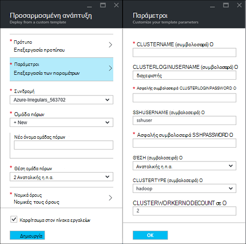
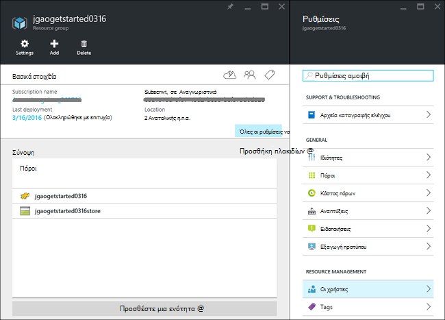
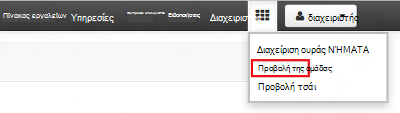
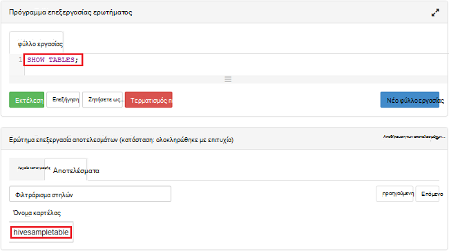

<properties
    pageTitle="Πρόγραμμα εκμάθησης Linux: γρήγορα αποτελέσματα με το Hadoop και ομάδα | Microsoft Azure"
    description="Παρακολουθήστε αυτό το πρόγραμμα εκμάθησης Linux για να ξεκινήσετε να χρησιμοποιείτε Hadoop στο HDInsight. Μάθετε πώς να παροχή συμπλεγμάτων Linux και ερωτήματος δεδομένων με την ομάδα."
    services="hdinsight"
    documentationCenter=""
    authors="mumian"
    manager="jhubbard"
    editor="cgronlun"
    tags="azure-portal"/>

<tags
    ms.service="hdinsight"
    ms.devlang="na"
    ms.topic="hero-article"
    ms.tgt_pltfrm="na"
    ms.workload="big-data"
    ms.date="09/14/2016"
    ms.author="jgao"/>

# Πρόγραμμα εκμάθησης Hadoop: γρήγορα αποτελέσματα με το Linux βάσει Hadoop στο HDInsight

> [AZURE.SELECTOR]
- [Βάσει Linux](hdinsight-hadoop-linux-tutorial-get-started.md)
- [Βασίζεται σε Windows](hdinsight-hadoop-tutorial-get-started-windows.md)

Μάθετε πώς μπορείτε να δημιουργήσετε συμπλεγμάτων βάσει Linux [Hadoop](http://hadoop.apache.org/) στο HDInsight, καθώς και πώς μπορείτε να εκτελέσετε εργασίες ομάδας στο HDInsight. [Apache Hive](https://hive.apache.org/) είναι τα πιο δημοφιλή στοιχείο στο περιβάλλον εμπορικής προσαρμογής Hadoop. Προς το παρόν HDInsight συνοδεύεται από 4 τύποι διαφορετικό σύμπλεγμα: [Hadoop](hdinsight-hadoop-introduction.md), [τους](hdinsight-apache-spark-overview.md), [HBase](hdinsight-hbase-overview.md) και [καταιγίδας](hdinsight-storm-overview.md).  Κάθε τύπος συμπλέγματος υποστηρίζει ένα διαφορετικό σύνολο των στοιχείων. Όλοι οι τύποι 4 σύμπλεγμα υποστήριξης της ομάδας. Για μια λίστα των υποστηριζόμενα στοιχεία σε HDInsight, ανατρέξτε στο θέμα [Τι νέο υπάρχει στο τις εκδόσεις σύμπλεγμα Hadoop που παρέχεται από το HDInsight;](hdinsight-component-versioning.md)  

[AZURE.INCLUDE [delete-cluster-warning](../../includes/hdinsight-delete-cluster-warning.md)]

## Προαπαιτούμενα στοιχεία

Προτού ξεκινήσετε αυτό το πρόγραμμα εκμάθησης, πρέπει να έχετε:

- **Azure συνδρομή**: για να δημιουργήσετε ένα δωρεάν λογαριασμό της δοκιμαστικής έκδοσης ενός μήνα, αναζητήστε [azure.microsoft.com/free](https://azure.microsoft.com/free).

### Απαιτήσεις για στοιχείο ελέγχου πρόσβασης

[AZURE.INCLUDE [access-control](../../includes/hdinsight-access-control-requirements.md)]

## Δημιουργία συμπλέγματος

Οι περισσότερες εργασίες Hadoop είναι μαζικές εργασίες. Δημιουργήστε ένα σύμπλεγμα, εκτελέσετε ορισμένες εργασίες και, στη συνέχεια, διαγράψτε το σύμπλεγμα. Σε αυτήν την ενότητα, θα δημιουργήσετε ένα σύμπλεγμα βάσει Linux Hadoop στο χρησιμοποιώντας [το πρότυπο διαχείρισης πόρων Azure](../resource-group-template-deploy.md)HDInsight. Διαχείριση πόρων πρότυπο είναι πλήρως προσαρμόσιμες; καθιστά εύκολη τη δημιουργία Azure πόρους, όπως το HDInsight. Διαχείριση πόρων πρότυπο εμπειρία δεν είναι απαραίτητο για μετά από αυτό το πρόγραμμα εκμάθησης. Για άλλες μεθόδους δημιουργίας σύμπλεγμα και την κατανόηση των ιδιοτήτων που χρησιμοποιούνται σε αυτό το πρόγραμμα εκμάθησης, ανατρέξτε στο θέμα [Δημιουργία HDInsight συμπλεγμάτων](hdinsight-hadoop-provision-linux-clusters.md). Το πρότυπο διαχείρισης πόρων που χρησιμοποιούνται σε αυτό το πρόγραμμα εκμάθησης βρίσκεται σε δημόσια blob κοντέινερ, [https://hditutorialdata.blob.core.windows.net/armtemplates/create-linux-based-hadoop-cluster-in-hdinsight.json](https://hditutorialdata.blob.core.windows.net/armtemplates/create-linux-based-hadoop-cluster-in-hdinsight.json). 

1. Κάντε κλικ στην παρακάτω εικόνα για να συνδεθείτε Azure και ανοίξτε το πρότυπο διαχείρισης πόρων στην πύλη του Azure. 

    

2. Από το blade **παραμέτρους** , εισαγάγετε τα εξής:

    .

    - **ClusterName**: Πληκτρολογήστε ένα όνομα για το σύμπλεγμα Hadoop που θα δημιουργήσετε.
    - **Σύμπλεγμα όνομα σύνδεσης και τον κωδικό πρόσβασης**: το προεπιλεγμένο όνομα σύνδεσης είναι **διαχειριστής**.
    - **SSH όνομα χρήστη και τον κωδικό πρόσβασης**: **sshuser**είναι το προεπιλεγμένο όνομα χρήστη.  Μπορείτε να τη μετονομάσετε. 
    
    Οι υπόλοιπες παράμετροι είναι προαιρετικό για παρακολούθηση αυτού του προγράμματος εκμάθησης. Μπορείτε να αφήσετε τους ως έχουν. 
    
    Κάθε σύμπλεγμα έχει μια εξάρτηση λογαριασμού χώρου αποθήκευσης αντικειμένων Blob του Azure. Συνήθως αναφέρεται ως είναι τον προεπιλεγμένο λογαριασμό χώρου αποθήκευσης. Σύμπλεγμα HDInsight και του προεπιλεγμένου λογαριασμού χώρου αποθήκευσης πρέπει να από κοινού βρίσκεται στην ίδια περιοχή Azure. Διαγραφή συμπλεγμάτων δεν διαγράφει το λογαριασμό χώρου αποθήκευσης. Στο πρότυπο, το προεπιλεγμένο όνομα λογαριασμού χώρου αποθήκευσης ορίζεται ως το όνομα του συμπλέγματος με "store" προσαρτημένο. 
    
3. Κάντε κλικ στο **κουμπί OK** για να αποθηκεύσετε τις παραμέτρους.
4. Από την **Ανάπτυξη προσαρμοσμένης** blade, εισαγάγετε **νέο όνομα ομάδας πόρων** για να δημιουργήσετε μια νέα ομάδα πόρων.  Η ομάδα πόρων είναι ένα κοντέινερ που ομαδοποιεί το σύμπλεγμα, ο λογαριασμός εξαρτώμενα χώρου αποθήκευσης και άλλες s. Η θέση ομάδα πόρων μπορεί να είναι διαφορετική από τη θέση του συμπλέγματος.
5. Κάντε κλικ στην επιλογή **νομική τους όρους**και, στη συνέχεια, κάντε κλικ στην επιλογή **Δημιουργία**.
6. Επιβεβαιώστε το πλαίσιο ελέγχου **Pin στον πίνακα εργαλείων** είναι επιλεγμένο και, στη συνέχεια, κάντε κλικ στην επιλογή **Δημιουργία**. Θα δείτε ένα νέο πλακίδιο με τίτλο **ανάπτυξης για την ανάπτυξη προτύπου**. Διαρκεί περίπου περίπου 20 λεπτά για να δημιουργήσετε ένα σύμπλεγμα. 
7.  Αφού δημιουργηθεί το σύμπλεγμα, της λεζάντας του πλακιδίου έχει αλλάξει στο όνομα της ομάδας πόρων που καθορίσατε. Και την πύλη ανοίγει αυτόματα δύο πτερύγια με το σύμπλεγμα και τις ρυθμίσεις σύμπλεγμα. 

    .

    Υπάρχουν δύο πόρους που παρατίθενται, το σύμπλεγμα και τον προεπιλεγμένο λογαριασμό χώρου αποθήκευσης.

##Εκτέλεση ερωτημάτων ομάδας

[Apache Hive](hdinsight-use-hive.md) είναι τα πιο δημοφιλή στοιχείο χρησιμοποιείται σε HDInsight. Υπάρχουν πολλοί τρόποι για να εκτελέσετε εργασίες ομάδας σε HDInsight. Σε αυτό το πρόγραμμα εκμάθησης, θα χρησιμοποιήσετε την προβολή Ambari ομάδας από την πύλη για να εκτελέσετε ορισμένες εργασίες ομάδας. Για άλλες μεθόδους για την υποβολή ομάδα εργασίες, ανατρέξτε στο θέμα [Χρήση ομάδας σε HDInsight](hdinsight-use-hive.md).

1. Αναζήτηση για να **https://&lt;ClusterName >. azurehdinsight.net**, όπου &lt;ClusterName > είναι το σύμπλεγμα που δημιουργήσατε στην προηγούμενη ενότητα για να ανοίξετε Ambari.
2. Πληκτρολογήστε το όνομα χρήστη Hadoop και τον κωδικό πρόσβασης που καθορίσατε στην προηγούμενη ενότητα. Το προεπιλεγμένο όνομα χρήστη είναι **διαχειριστής**.
3. Ανοίξετε την **Προβολή Hive** όπως φαίνεται στο παρακάτω στιγμιότυπο οθόνης:

    .
4. Στην ενότητα __Πρόγραμμα επεξεργασίας ερωτήματος__ της σελίδας, επικολλήστε τις παρακάτω προτάσεις HiveQL στο φύλλο εργασίας:

        SHOW TABLES;

    >[AZURE.NOTE] Ελληνικό ερωτηματικό απαιτείται από ομάδα.       
        
5. Κάντε κλικ στην επιλογή __Εκτέλεση__. Μια ενότητα __Διαδικασία αποτελέσματα του ερωτήματος__ θα πρέπει να εμφανίζεται κάτω από το πρόγραμμα επεξεργασίας ερωτήματος και να εμφανίζετε πληροφορίες σχετικά με την εργασία. 

    Μόλις ολοκληρωθεί το ερώτημα, στην ενότητα __Διαδικασία αποτελέσματα του ερωτήματος__ θα εμφανίζονται τα αποτελέσματα της λειτουργίας. Βλέπετε έναν πίνακα που ονομάζεται **hivesampletable**. Αυτό το δείγμα πίνακα Hive συνοδεύεται από όλων των συμπλεγμάτων HDInsight.

    .

6. Επαναλάβετε το βήμα 4 και 5 για να εκτελέσετε το ακόλουθο ερώτημα:

        SELECT * FROM hivesampletable;

    > [AZURE.TIP] Σημειώστε την αναπτυσσόμενη λίστα __Αποθήκευση αποτελεσμάτων__ στο επάνω αριστερό τμήμα της ενότητας __Διαδικασία αποτελέσματα του ερωτήματος__ ; Μπορείτε να χρησιμοποιήσετε αυτό να κάνετε λήψη των αποτελεσμάτων, ή να αποθηκεύσετε τους με το χώρο αποθήκευσης HDInsight ως αρχείο CSV.

7. Κάντε κλικ στην επιλογή **ιστορικό** για να λάβετε μια λίστα με τις εργασίες.

Μετά την ολοκλήρωση μιας εργασίας της ομάδας, μπορείτε να [εξαγάγετε τα αποτελέσματα σε βάση δεδομένων Azure SQL ή βάση δεδομένων SQL Server](hdinsight-use-sqoop-mac-linux.md), μπορείτε επίσης να [οπτικοποιήσουν τα αποτελέσματα χρήσης του Excel](hdinsight-connect-excel-power-query.md). Για περισσότερες πληροφορίες σχετικά με τη χρήση ομάδας σε HDInsight, ανατρέξτε στο θέμα [χρήση ομάδας και HiveQL με Hadoop στο HDInsight για να αναλύσετε ένα δείγμα αρχείου log4j Apache](hdinsight-use-hive.md).

##Εκκαθάριση του προγράμματος εκμάθησης

Αφού ολοκληρώσετε το πρόγραμμα εκμάθησης, που μπορεί να θέλετε να διαγράψετε το σύμπλεγμα. Με το HDInsight, τα δεδομένα σας αποθηκεύονται στο χώρο αποθήκευσης Azure, ώστε να μπορείτε να διαγράψετε ένα σύμπλεγμα όταν δεν είναι σε χρήση. Επίσης, που θα χρεωθείτε για ένα σύμπλεγμα HDInsight, ακόμα και όταν δεν είναι σε χρήση. Επειδή οι χρεώσεις για το σύμπλεγμα είναι πολλές φορές περισσότερες από τις χρεώσεις για χώρο αποθήκευσης, έχει οικονομικών νόημα για να διαγράψετε συμπλεγμάτων όταν δεν είναι σε χρήση. 

>[AZURE.NOTE] Χρήση [Azure εργοστασίου δεδομένων](hdinsight-hadoop-create-linux-clusters-adf.md), μπορείτε να δημιουργήσετε συμπλεγμάτων HDInsight ζήτηση, και τη ρύθμιση ενός το TimeToLive για τη διαγραφή των συμπλεγμάτων αυτόματα. 

**Για να διαγράψετε το σύμπλεγμα ή/και τον προεπιλεγμένο λογαριασμό χώρου αποθήκευσης**

1. Είσοδος στην [πύλη του Azure](https://portal.azure.com).
2. Από την πύλη πίνακα εργαλείων, κάντε κλικ στο πλακίδιο με το όνομα της ομάδας πόρων που χρησιμοποιήσατε κατά τη δημιουργία του συμπλέγματος.
3. Κάντε κλικ στην επιλογή **Διαγραφή** το blade πόρων για να διαγράψετε την ομάδα των πόρων που περιέχει το σύμπλεγμα και τον προεπιλεγμένο λογαριασμό χώρο αποθήκευσης; ή κάντε κλικ στο όνομα του συμπλέγματος στο πλακίδιο **πόρων** και, στη συνέχεια, κάντε κλικ στην επιλογή **Διαγραφή** το σύμπλεγμα blade. Σημείωση, διαγράφοντας την ομάδα των πόρων θα διαγράψτε το λογαριασμό χώρου αποθήκευσης. Εάν θέλετε να διατηρήσετε το λογαριασμό χώρου αποθήκευσης, επιλέξτε για να διαγράψετε μόνο το σύμπλεγμα.

## Επόμενα βήματα

Σε αυτό το πρόγραμμα εκμάθησης, μάθατε πώς μπορείτε να δημιουργήσετε ένα σύμπλεγμα βάσει Linux HDInsight με τη χρήση προτύπου για τη διαχείριση πόρων και πώς να εκτελείτε βασικές Hive ερωτήματα.

Για να μάθετε περισσότερα σχετικά με την ανάλυση δεδομένων με το HDInsight, ανατρέξτε στα παρακάτω:

- Για να μάθετε περισσότερα σχετικά με τη χρήση της ομάδας με το HDInsight, συμπεριλαμβανομένου του τρόπου εκτέλεσης ερωτημάτων ομάδα από το Visual Studio, ανατρέξτε στο θέμα [Χρήση Hive με HDInsight][hdinsight-use-hive].

- Για να μάθετε περισσότερα σχετικά με γουρούνι, μια γλώσσα που χρησιμοποιείται για το μετασχηματισμό δεδομένων, ανατρέξτε στο θέμα [Χρήση γουρούνι με HDInsight][hdinsight-use-pig].

- Για να μάθετε περισσότερα σχετικά με MapReduce, ένας τρόπος για να γράψετε προγράμματα που επεξεργάζονται δεδομένα σε Hadoop, ανατρέξτε στο θέμα [Χρήση MapReduce με HDInsight][hdinsight-use-mapreduce].

- Για να μάθετε περισσότερα σχετικά με τη χρήση των εργαλείων HDInsight για το Visual Studio για την ανάλυση δεδομένων σε HDInsight, ανατρέξτε στο θέμα [Γρήγορα αποτελέσματα με το Visual Studio Hadoop εργαλεία για το HDInsight](hdinsight-hadoop-visual-studio-tools-get-started.md).

Εάν είστε έτοιμοι να ξεκινήσετε να εργάζεστε με τα δικά σας δεδομένα και πρέπει να μάθετε περισσότερα σχετικά με τον τρόπο HDInsight αποθήκευσης δεδομένων ή πώς μπορείτε να μεταφέρετε δεδομένα στο HDInsight, ανατρέξτε στα παρακάτω:

- Για πληροφορίες σχετικά με πώς χρησιμοποιεί το χώρο αποθήκευσης αντικειμένων blob του Azure HDInsight, ανατρέξτε στο [χώρο αποθήκευσης αντικειμένων Blob του Azure χρήση με το HDInsight](hdinsight-hadoop-use-blob-storage.md).

- Για πληροφορίες σχετικά με τον τρόπο για την αποστολή δεδομένων στο HDInsight, ανατρέξτε στο θέμα [Αποστολή δεδομένων με το HDInsight][hdinsight-upload-data].

Εάν θέλετε να μάθετε περισσότερα σχετικά με τη δημιουργία ή διαχείριση ένα σύμπλεγμα HDInsight, ανατρέξτε στα παρακάτω:

- Για να μάθετε σχετικά με τη Διαχείριση το σύμπλεγμά σας βάσει Linux HDInsight, ανατρέξτε στο θέμα [Διαχείριση HDInsight συμπλεγμάτων χρησιμοποιώντας Ambari](hdinsight-hadoop-manage-ambari.md).

- Για να μάθετε περισσότερα σχετικά με τις επιλογές που μπορείτε να επιλέξετε όταν δημιουργείτε ένα σύμπλεγμα HDInsight, ανατρέξτε στο θέμα [Δημιουργία HDInsight σε Linux χρησιμοποιώντας προσαρμοσμένες επιλογές](hdinsight-hadoop-provision-linux-clusters.md).

- Εάν είστε εξοικειωμένοι με Linux και Hadoop, αλλά θέλετε να μάθετε λεπτομέρειες σχετικά με την Hadoop στην το HDInsight, ανατρέξτε στο θέμα [εργασία με HDInsight στην Linux](hdinsight-hadoop-linux-information.md). Αυτό παρέχει πληροφορίες όπως:

    * Διευθύνσεις URL για τις υπηρεσίες που φιλοξενούνται στο σύμπλεγμα, όπως Ambari και WebHCat
    * Τη θέση των αρχείων Hadoop και παραδείγματα σχετικά με το τοπικό σύστημα αρχείων
    * Αποθήκευση της χρήσης του Azure χώρου αποθήκευσης (WASB) αντί για HDFS ως τα προεπιλεγμένα δεδομένα

[1]: ../HDInsight/hdinsight-hadoop-visual-studio-tools-get-started.md

[hdinsight-provision]: hdinsight-provision-clusters.md
[hdinsight-admin-powershell]: hdinsight-administer-use-powershell.md
[hdinsight-upload-data]: hdinsight-upload-data.md
[hdinsight-use-mapreduce]: hdinsight-use-mapreduce.md
[hdinsight-use-hive]: hdinsight-use-hive.md
[hdinsight-use-pig]: hdinsight-use-pig.md

[powershell-download]: http://go.microsoft.com/fwlink/p/?linkid=320376&clcid=0x409
[powershell-install-configure]: powershell-install-configure.md
[powershell-open]: powershell-install-configure.md#Install

[img-hdi-dashboard]: ./media/hdinsight-hadoop-tutorial-get-started-windows/HDI.dashboard.png
[img-hdi-dashboard-query-select]: ./media/hdinsight-hadoop-tutorial-get-started-windows/HDI.dashboard.query.select.png
[img-hdi-dashboard-query-select-result]: ./media/hdinsight-hadoop-tutorial-get-started-windows/HDI.dashboard.query.select.result.png
[img-hdi-dashboard-query-select-result-output]: ./media/hdinsight-hadoop-tutorial-get-started-windows/HDI.dashboard.query.select.result.output.png
[img-hdi-dashboard-query-browse-output]: ./media/hdinsight-hadoop-tutorial-get-started-windows/HDI.dashboard.query.browse.output.png
[image-hdi-clusterstatus]: ./media/hdinsight-hadoop-tutorial-get-started-windows/HDI.ClusterStatus.png
[image-hdi-gettingstarted-powerquery-importdata]: ./media/hdinsight-hadoop-tutorial-get-started-windows/HDI.GettingStarted.PowerQuery.ImportData.png
[image-hdi-gettingstarted-powerquery-importdata2]: ./media/hdinsight-hadoop-tutorial-get-started-windows/HDI.GettingStarted.PowerQuery.ImportData2.png
