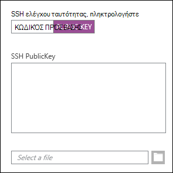
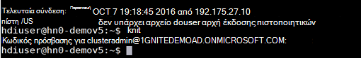
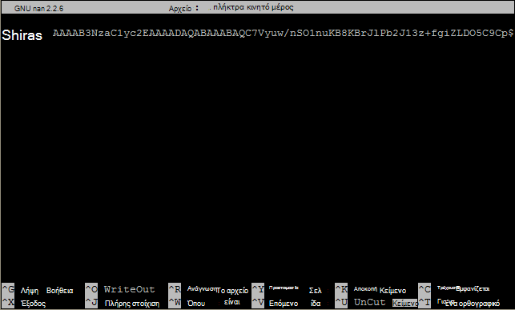

<properties
   pageTitle="Χρησιμοποιήστε πλήκτρα SSH με Hadoop με βάση το Linux από Linux, Unix ή OS X | Microsoft Azure"
   description=" Μπορείτε να έχετε πρόσβαση με βάση το Linux HDInsight χρησιμοποιώντας Secure Shell (SSH). Αυτό το έγγραφο παρέχει πληροφορίες σχετικά με τη χρήση SSH με HDInsight από υπολογιστές-πελάτες Linux, Unix ή OS X."
   services="hdinsight"
   documentationCenter=""
   authors="Blackmist"
   manager="jhubbard"
   editor="cgronlun"
    tags="azure-portal"/>

<tags
   ms.service="hdinsight"
   ms.devlang="na"
   ms.topic="get-started-article"
   ms.tgt_pltfrm="na"
   ms.workload="big-data"
   ms.date="09/13/2016"
   ms.author="larryfr"/>

#<a name="use-ssh-with-linux-based-hadoop-on-hdinsight-from-linux-unix-or-os-x"></a>Χρήση SSH με Linux με Hadoop σε HDInsight από Linux, Unix ή OS X

> [AZURE.SELECTOR]
- [Τα Windows](hdinsight-hadoop-linux-use-ssh-windows.md)
- [Linux, Unix, OS X](hdinsight-hadoop-linux-use-ssh-unix.md)

[Ασφαλής Shell (SSH)](https://en.wikipedia.org/wiki/Secure_Shell) σας επιτρέπει να απομακρυσμένη εκτέλεση λειτουργιών σε σας συμπλέγματα με βάση το Linux HDInsight χρησιμοποιώντας μια διασύνδεση γραμμής εντολών. Αυτό το έγγραφο παρέχει πληροφορίες σχετικά με τη χρήση SSH με HDInsight από υπολογιστές-πελάτες Linux, Unix ή OS X.

> [AZURE.NOTE] Τα βήματα σε αυτό το άρθρο προϋποθέτουν ότι χρησιμοποιείτε έναν υπολογιστή-πελάτη Linux, Unix ή OS X. Αυτά τα βήματα ενδέχεται να εκτελούνται σε έναν υπολογιστή-πελάτη που βασίζεται στα Windows, εάν έχετε εγκαταστήσει ένα πακέτο, το οποίο παρέχει `ssh` και `ssh-keygen`, όπως [πάρτι σε Ubuntu στα Windows](https://msdn.microsoft.com/commandline/wsl/about).
>
> Εάν δεν έχετε SSH εγκατεστημένο στον υπολογιστή-πελάτη που βασίζεται στα Windows, χρησιμοποιήστε τα βήματα στη [Χρήση SSH με Linux με HDInsight (Hadoop) από τα Windows](hdinsight-hadoop-linux-use-ssh-windows.md) για πληροφορίες σχετικά με την εγκατάσταση και τη χρήση PuTTY.

##<a name="prerequisites"></a>Προϋποθέσεις

* **SSH keygen** και **ssh** για υπολογιστές-πελάτες Linux, Unix και OS X. Αυτό βοηθητικά προγράμματα συνήθως παρέχονται με το λειτουργικό σας σύστημα, ή που είναι διαθέσιμα μέσω του συστήματος διαχείρισης πακέτου.

* Ένα σύγχρονο πρόγραμμα περιήγησης που υποστηρίζει HTML5.

OR

* [Azure CLI](../xplat-cli-install.md).

    [AZURE.INCLUDE [use-latest-version](../../includes/hdinsight-use-latest-cli.md)] 

##<a name="what-is-ssh"></a>Τι είναι το SSH;

SSH είναι ένα βοηθητικό πρόγραμμα για τη σύνδεση με και απομακρυσμένη εκτέλεση, εντολές σε έναν απομακρυσμένο διακομιστή. Με HDInsight με βάση το Linux, SSH δημιουργεί μια κρυπτογραφημένη σύνδεση με το headnode σύμπλεγμα και παρέχει μια γραμμή εντολών που μπορείτε να χρησιμοποιήσετε για την πληκτρολόγηση σε εντολές. Στη συνέχεια, εκτελούνται οι εντολές απευθείας στο διακομιστή.

###<a name="ssh-user-name"></a>Όνομα χρήστη SSH

Ένα όνομα χρήστη SSH είναι το όνομα που χρησιμοποιείτε για τον έλεγχο ταυτότητας στο σύμπλεγμα HDInsight. Όταν καθορίζετε ένα όνομα χρήστη SSH κατά τη δημιουργία συμπλέγματος, αυτός ο χρήστης δημιουργείται σε όλους τους κόμβους του συμπλέγματος. Μετά τη δημιουργία του συμπλέγματος, μπορείτε να χρησιμοποιήσετε αυτό το όνομα χρήστη για να συνδεθείτε με το headnodes σύμπλεγμα HDInsight. Από το headnodes, μπορείτε στη συνέχεια να συνδεθείτε με τους κόμβους του εργαζομένου.

###<a name="ssh-password-or-public-key"></a>Κωδικός πρόσβασης SSH ή δημόσιο κλειδί

Ένας χρήστης SSH να χρησιμοποιήσετε έναν κωδικό πρόσβασης ή το δημόσιο κλειδί για τον έλεγχο ταυτότητας. Ο κωδικός πρόσβασης είναι μόνο μια συμβολοσειρά κειμένου που ορίζετε, ενώ ένα δημόσιο κλειδί αποτελεί τμήμα ενός ζεύγους κλειδιών κρυπτογράφησης που δημιουργούνται για να αναγνωρίζει με μοναδικό τρόπο.

Ένα κλειδί είναι πιο ασφαλή από έναν κωδικό πρόσβασης, ωστόσο απαιτεί πρόσθετα βήματα για τη δημιουργία του κλειδιού και πρέπει να διατηρούν τα αρχεία που περιέχει το κλειδί σε μια ασφαλή θέση. Εάν κάποιος αποκτήσει πρόσβαση για τα σημαντικά αρχεία, αυτές να αποκτήσουν πρόσβαση στο λογαριασμό σας. Ή, εάν χάσετε τα σημαντικά αρχεία, δεν θα μπορέσετε να συνδεθείτε στο λογαριασμό σας.

Ένα ζεύγος κλειδιών αποτελείται από ένα δημόσιο κλειδί (το οποίο αποστέλλεται στο διακομιστή HDInsight), και ένα ιδιωτικό κλειδί (που διατηρείται στον υπολογιστή-πελάτη.) Όταν συνδέεστε με το διακομιστή HDInsight μέσω SSH, ο υπολογιστής-πελάτης SSH θα χρησιμοποιήσετε το ιδιωτικό κλειδί στον υπολογιστή σας για τον έλεγχο ταυτότητας με το διακομιστή.

##<a name="create-an-ssh-key"></a>Δημιουργήστε ένα κλειδί SSH

Χρησιμοποιήστε τις ακόλουθες πληροφορίες εάν σχεδιάζετε σχετικά με τη χρήση κλειδιών SSH με το σύμπλεγμα. Εάν σκοπεύετε να χρησιμοποιήσετε έναν κωδικό πρόσβασης, μπορείτε να παραλείψετε αυτήν την ενότητα.

1. Ανοίξτε μια περίοδο λειτουργίας τερματικού και χρησιμοποιήστε την ακόλουθη εντολή για να δείτε αν υπάρχουν οποιαδήποτε υπάρχοντα κλειδιά SSH:

        ls -al ~/.ssh

    Αναζητήστε τα ακόλουθα αρχεία στη λίστα καταλόγου. Αυτές είναι κοινές ονομασίες δημόσιων κλειδιών SSH.

    * ID\_dsa.pub
    * ID\_ecdsa.pub
    * ID\_ed25519.pub
    * ID\_rsa.pub

2. Εάν δεν θέλετε να χρησιμοποιήσετε ένα υπάρχον αρχείο, ή εάν έχετε υπάρχοντα κλειδιά SSH, χρησιμοποιήστε τα ακόλουθα για να δημιουργήσετε ένα νέο αρχείο:

        ssh-keygen -t rsa

    Θα ερωτηθείτε για τις ακόλουθες πληροφορίες:

    * Η θέση του αρχείου - η προεπιλεγμένη θέση είναι ~/.ssh/id\_rsa.
    * Μια φράση πρόσβασης - θα σας ζητηθεί να εισαγάγετε ξανά αυτό.

        > [AZURE.NOTE] Σας συνιστούμε να χρησιμοποιήσετε μια φράση πρόσβασης ασφαλείας για το κλειδί. Ωστόσο, εάν ξεχάσετε τη φράση πρόσβασης, δεν υπάρχει τρόπος να το ανακτήσετε.

    Μετά την ολοκλήρωση της εντολής, θα έχετε δύο νέα αρχεία, το ιδιωτικό κλειδί (για παράδειγμα, **id\_rsa**) και το δημόσιο κλειδί (για παράδειγμα, **id\_rsa.pub**).

##<a name="create-a-linux-based-hdinsight-cluster"></a>Δημιουργήστε ένα σύμπλεγμα με βάση το Linux HDInsight

Κατά τη δημιουργία ενός συμπλέγματος HDInsight με βάση το Linux, πρέπει να δώσετε το δημόσιο κλειδί που δημιουργήθηκε προηγουμένως. Από Linux, Unix ή OS X υπολογιστές-πελάτες, υπάρχουν δύο τρόποι για να δημιουργήσετε ένα σύμπλεγμα HDInsight:

* **Πύλη azure** - χρησιμοποιεί μια πύλη που βασίζεται στο web για τη δημιουργία του συμπλέγματος.

* **CLI azure για Mac, Linux και Windows** - χρησιμοποιεί εντολές γραμμής εντολών για τη δημιουργία του συμπλέγματος.

Κάθε μία από αυτές τις μεθόδους απαιτεί έναν κωδικό πρόσβασης ή ένα δημόσιο κλειδί. Για πλήρεις πληροφορίες σχετικά με τη δημιουργία ενός συμπλέγματος HDInsight με βάση το Linux, ανατρέξτε στην ενότητα [με βάση το Linux παροχή HDInsight συμπλέγματα](hdinsight-hadoop-provision-linux-clusters.md).

###<a name="azure-portal"></a>Πύλη Azure

Κατά τη χρήση της [Πύλης Azure] [ preview-portal] για να δημιουργήσετε ένα σύμπλεγμα HDInsight με βάση το Linux, πρέπει να εισαγάγετε ένα **ΌΝΟΜΑ ΧΡΉΣΤΗ SSH**και επιλέξτε για να πληκτρολογήσετε έναν **κωδικό ΠΡΌΣΒΑΣΗΣ** ή **SSH ΔΗΜΌΣΙΟ ΚΛΕΙΔΊ**.

Εάν επιλέξετε **SSH ΔΗΜΌΣΙΟ ΚΛΕΙΔΊ**, μπορείτε να επικολλήσετε το δημόσιο κλειδί (που περιέχονται στο αρχείο με την επέκταση **.pub** ) στο πεδίο __SSH PublicKey__ ή να επιλέξετε __Επιλέξτε ένα αρχείο__ για να αναζητήσετε και να επιλέξετε το αρχείο δημόσιου κλειδιού.



> [AZURE.NOTE] Το αρχείο κλειδιού είναι απλώς ένα αρχείο κειμένου. Το περιεχόμενο πρέπει να είναι παρόμοια με το ακόλουθο:
> ```
ssh-rsa AAAAB3NzaC1yc2EAAAADAQABAAABAQCelfkjrpYHYiks4TM+r1LVsTYQ4jAXXGeOAF9Vv/KGz90pgMk3VRJk4PEUSELfXKxP3NtsVwLVPN1l09utI/tKHQ6WL3qy89WVVVLiwzL7tfJ2B08Gmcw8mC/YoieT/YG+4I4oAgPEmim+6/F9S0lU2I2CuFBX9JzauX8n1Y9kWzTARST+ERx2hysyA5ObLv97Xe4C2CQvGE01LGAXkw2ffP9vI+emUM+VeYrf0q3w/b1o/COKbFVZ2IpEcJ8G2SLlNsHWXofWhOKQRi64TMxT7LLoohD61q2aWNKdaE4oQdiuo8TGnt4zWLEPjzjIYIEIZGk00HiQD+KCB5pxoVtp user@system
> ```

Αυτό δημιουργεί μια σύνδεση για το συγκεκριμένο χρήστη, χρησιμοποιώντας τον κωδικό πρόσβασης ή το δημόσιο κλειδί που παρέχετε.

###<a name="azure-command-line-interface-for-mac-linux-and-windows"></a>Διασύνδεση γραμμής εντολών Azure για Mac, Linux και παράθυρα

Μπορείτε να χρησιμοποιήσετε το [Azure CLI για Mac, Linux και τα Windows](../xplat-cli-install.md) για να δημιουργήσετε ένα νέο σύμπλεγμα χρησιμοποιώντας το `azure hdinsight cluster create` εντολή.

Για περισσότερες πληροφορίες σχετικά με τη χρήση αυτής της εντολής, ανατρέξτε στο θέμα [συμπλέγματα Hadoop Linux παροχή στο HDInsight χρησιμοποιώντας προσαρμοσμένες επιλογές](hdinsight-hadoop-provision-linux-clusters.md).

##<a name="connect-to-a-linux-based-hdinsight-cluster"></a>Σύνδεση σε ένα σύμπλεγμα με βάση το Linux HDInsight

Από μια περίοδο λειτουργίας τερματικού, χρησιμοποιήστε την εντολή SSH για να συνδεθείτε με το σύμπλεγμα headnode, παρέχοντας το όνομα χρήστη και διεύθυνση:

* **Διεύθυνση SSH** - υπάρχουν δύο διευθύνσεις οι οποίες μπορούν να χρησιμοποιηθούν για τη σύνδεση σε ένα σύμπλεγμα χρησιμοποιώντας SSH:

    * **Σύνδεση με το headnode**: το όνομα συμπλέγματος, ακολουθούμενο από **-ssh.azurehdinsight.net**. Για παράδειγμα, **mycluster-ssh.azurehdinsight.net**.
    
    * **Σύνδεση με το ακραίο κόμβο**: Εάν συμπλέγματος διακομιστή R στο HDInsight, το σύμπλεγμα θα περιέχει επίσης έναν ακραίο κόμβο που η πρόσβαση είναι δυνατή με τη χρήση **RServer.CLUSTERNAME.ssh.azurehdinsight.net**, όπου __CLUSTERNAME__ είναι το όνομα του συμπλέγματος.

* **Όνομα χρήστη** - το SSH όνομα χρήστη δώσατε κατά τη δημιουργία του συμπλέγματος.

Το ακόλουθο παράδειγμα θα συνδεθείτε με το πρωτεύον headnode **mycluster** ως το χρήστη **μου**:

    ssh me@mycluster-ssh.azurehdinsight.net

Εάν χρησιμοποιήσατε έναν κωδικό πρόσβασης για το λογαριασμό χρήστη, θα σας ζητηθεί να πληκτρολογήσετε τον κωδικό πρόσβασης.

Εάν χρησιμοποιήσατε ένα κλειδί SSH που είναι ασφαλές με μια φράση πρόσβασης, θα σας ζητηθεί να εισαγάγετε τη φράση πρόσβασης. Διαφορετικά, SSH θα επιχειρήσει να πραγματοποιήσει έλεγχο ταυτότητας αυτόματα, χρησιμοποιώντας ένα από τα ιδιωτικά κλειδιά τοπικά στον υπολογιστή-πελάτη.

> [AZURE.NOTE] Εάν SSH δεν πραγματοποιούν αυτόματο έλεγχο ταυτότητας με το σωστό ιδιωτικό κλειδί, χρησιμοποιήστε την παράμετρο **-i** και καθορίστε τη διαδρομή για το ιδιωτικό κλειδί. Στο παρακάτω παράδειγμα, θα φορτωθεί το ιδιωτικό κλειδί από `~/.ssh/id_rsa`:
>
> `ssh -i ~/.ssh/id_rsa me@mycluster-ssh.azurehdinsight.net`

Εάν πρόκειται να συνδεθείτε με χρήση της διεύθυνσης για το headnode και δεν καθοριστεί θύρα, SSH προεπιλεγμένη θύρα 22, η οποία θα συνδεθεί με την κύρια headnode στο σύμπλεγμα HDInsight. Εάν χρησιμοποιείτε τη θύρα 23, συνδέεστε στο δευτερεύον. Για περισσότερες πληροφορίες σχετικά με το headnodes, ανατρέξτε στην ενότητα [διαθεσιμότητα και την αξιοπιστία των συμπλεγμάτων Hadoop στο HDInsight](hdinsight-high-availability-linux.md).

###<a name="connect-to-worker-nodes"></a>Σύνδεση με τους κόμβους του εργαζομένου

Οι κόμβοι εργασίας δεν είναι άμεσα προσβάσιμα από έξω από το κέντρο δεδομένων Azure, αλλά μπορούν να προσπελαστούν από το σύμπλεγμα headnode μέσω SSH.

Εάν χρησιμοποιείτε ένα κλειδί SSH για τον έλεγχο ταυτότητας του λογαριασμού χρήστη, πρέπει να ολοκληρώσετε τα παρακάτω βήματα στον υπολογιστή-πελάτη:

1. Χρησιμοποιώντας ένα πρόγραμμα επεξεργασίας κειμένου, ανοίξτε `~/.ssh/config`. Εάν δεν υπάρχει αυτό το αρχείο, μπορείτε να τη δημιουργήσετε εισάγοντας `touch ~/.ssh/config` του τερματικού σταθμού.

2. Προσθέστε τα ακόλουθα στο αρχείο. Αντικαταστήστε το *CLUSTERNAME* με το όνομα του συμπλέγματος HDInsight.

        Host CLUSTERNAME-ssh.azurehdinsight.net
          ForwardAgent yes

    Αυτό ρυθμίζει τις παραμέτρους SSH παράγοντα προώθησης για το σύμπλεγμα HDInsight.

3. Δοκιμή SSH παράγοντα προώθησης, χρησιμοποιώντας την ακόλουθη εντολή από το τερματικό:

        echo "$SSH_AUTH_SOCK"

    Αυτό θα πρέπει να επιστρέψει πληροφορίες παρόμοιο με το ακόλουθο:

        /tmp/ssh-rfSUL1ldCldQ/agent.1792

    Εάν επιστραφεί τίποτα, αυτό υποδηλώνει ότι **ssh παράγοντα** δεν εκτελείται. Ανατρέξτε στην τεκμηρίωση του λειτουργικού συστήματος για συγκεκριμένα βήματα για την εγκατάσταση και τη ρύθμιση παραμέτρων **ssh παράγοντα**ή ανατρέξτε στην ενότητα [Χρήση ssh παράγοντα με ssh](http://mah.everybody.org/docs/ssh).

4. Αφού επαληθεύσετε ότι **ssh παράγοντα** εκτελείται, χρησιμοποιήστε τα ακόλουθα για να προσθέσετε το ιδιωτικό σας κλειδί SSH στον παράγοντα:

        ssh-add ~/.ssh/id_rsa

    Εάν το ιδιωτικό κλειδί είναι αποθηκευμένο σε ένα άλλο αρχείο, αντικατάσταση `~/.ssh/id_rsa` με τη διαδρομή προς το αρχείο.

Χρησιμοποιήστε τα ακόλουθα βήματα για να συνδεθείτε με τους κόμβους του εργαζομένου για το σύμπλεγμα.

> [AZURE.IMPORTANT] Εάν χρησιμοποιείτε ένα κλειδί SSH για τον έλεγχο ταυτότητας του λογαριασμού σας, πρέπει να ολοκληρώσετε τα προηγούμενα βήματα για να βεβαιωθείτε ότι παράγοντα προώθησης λειτουργεί.

1. Συνδεθείτε με το σύμπλεγμα HDInsight χρησιμοποιώντας SSH, όπως περιγράφηκε προηγουμένως.

2. Αφού συνδεθείτε, χρησιμοποιήστε τα ακόλουθα για να ανακτήσετε μια λίστα με τους κόμβους του συμπλέγματος. Αντικατάσταση *ADMINPASSWORD* με τον κωδικό πρόσβασης για το λογαριασμό διαχειριστή συμπλέγματος. Αντικαταστήστε το *CLUSTERNAME* με το όνομα του συμπλέγματος.

        curl --user admin:ADMINPASSWORD https://CLUSTERNAME.azurehdinsight.net/api/v1/hosts

    Αυτό θα επιστρέψει πληροφορίες σε μορφή JSON για τους κόμβους του συμπλέγματος, συμπεριλαμβανομένων των `host_name`, που περιέχει το πλήρως αναγνωρισμένο όνομα τομέα (FQDN) για κάθε κόμβο. Το ακόλουθο είναι ένα παράδειγμα ενός `host_name` εγγραφή που επιστρέφεται από την εντολή **curl** :

        "host_name" : "workernode0.workernode-0-e2f35e63355b4f15a31c460b6d4e1230.j1.internal.cloudapp.net"

3. Όταν έχετε μια λίστα με τους κόμβους της εργασίας που θέλετε να συνδεθείτε, χρησιμοποιήστε την ακόλουθη εντολή από την περίοδο λειτουργίας SSH στο διακομιστή για να ανοίξετε μια σύνδεση σε έναν κόμβο εργασίας:

        ssh USERNAME@FQDN

    Αντικαταστήστε το *όνομα ΧΡΉΣΤΗ* με το όνομα χρήστη SSH και το *FQDN* με το FQDN για τον κόμβο του εργαζομένου. Για παράδειγμα, `workernode0.workernode-0-e2f35e63355b4f15a31c460b6d4e1230.j1.internal.cloudapp.net`.

    > [AZURE.NOTE] Εάν χρησιμοποιείτε έναν κωδικό πρόσβασης για έλεγχο ταυτότητας η περίοδος λειτουργίας σας SSH, θα σας ζητηθεί να εισαγάγετε ξανά τον κωδικό πρόσβασης. Εάν χρησιμοποιείτε ένα κλειδί SSH, η σύνδεση θα πρέπει να ολοκληρωθεί χωρίς ερωτήσεις.

4. Από τη στιγμή που έχει δημιουργηθεί η περίοδος λειτουργίας τερματικού προτροπής θα αλλάξει από την `username@hn#-clustername` να `username@wk#-clustername` για να δηλώσετε ότι έχετε συνδεθεί στον κόμβο του εργαζομένου. Όλες οι εντολές που εκτελούνται σε αυτό το σημείο θα εκτελεστεί στον κόμβο του εργαζομένου.

4. Όταν ολοκληρώσετε την εκτέλεση ενεργειών στον κόμβο εργασίας, χρησιμοποιήστε το `exit` εντολή, για να κλείσετε την περίοδο λειτουργίας στον κόμβο του εργαζομένου. Αυτό θα επιστρέψει να το `username@hn#-clustername` εντολών.

## <a name="connect-to-a-domain-joined-hdinsight-cluster"></a>Σύνδεση σε ένα σύμπλεγμα του τομέα HDInsight

[HDInsight τομέα](hdinsight-domain-joined-introduction.md) ενσωματώνεται Kerberos με Hadoop σε HDInsight. Επειδή ο χρήστης SSH δεν είναι ένας χρήστης τομέα Active Direcotry, αυτός ο λογαριασμός χρήστη δεν είναι δυνατό να εκτελέσετε Hadoop εντολές από SSH κελύφους σε ένα σύμπλεγμα τομέα απευθείας. Πρέπει πρώτα να εκτελέσετε *kinit* . 

**Για να εκτελέσετε ομάδα υποβάλλει ερωτήματα σε ένα σύμπλεγμα HDInsight τομέα χρησιμοποιώντας SSH**

1. Η σύνδεση σε ένα σύμπλεγμα HDInsight τομέα χρησιμοποιώντας SSH.  Για instrocutions, ανατρέξτε στο θέμα [σύνδεση σε ένα σύμπλεγμα με βάση το Linux HDInsight](#connect-to-a-linux-based-hdinsight-cluster).
2. Εκτελέστε το kinit. Αυτό θα σας ζητήσει το όνομα χρήστη τομέα και ο κωδικός πρόσβασης του χρήστη τομέα. Για περισσότερες πληροφορίες σχετικά με την ρύθμιση χρηστών τομέα για τομέα HDInsight συμπλέγματα, ανατρέξτε στην ενότητα [Ρύθμιση παραμέτρων τομέα HDInisight συμπλέγματα](hdinsight-domain-joined-configure.md).

    
3. Ανοίξτε την ομάδα κονσόλα, πληκτρολογήστε:

        hive

    Στη συνέχεια, μπορείτε να εκτελέσετε εντολές της ομάδας.

##<a name="add-more-accounts"></a>Προσθέσετε περισσότερους λογαριασμούς

1. Δημιουργήστε ένα νέο δημόσιου κλειδιού και το ιδιωτικό κλειδί για τον νέο λογαριασμό χρήστη, όπως περιγράφεται στην ενότητα [Δημιουργία ένα κλειδί SSH](#create-an-ssh-key-optional) .

    > [AZURE.NOTE] Το ιδιωτικό κλειδί πρέπει να παράγεται σε έναν υπολογιστή-πελάτη που ο χρήστης θα χρησιμοποιήσει για να συνδεθείτε με το σύμπλεγμα ή μεταφέρονται με ασφάλεια σε έναν υπολογιστή πελάτη, μετά τη δημιουργία του.

1. Από μια περίοδο λειτουργίας SSH στο σύμπλεγμα, Προσθήκη νέου χρήστη με την ακόλουθη εντολή:

        sudo adduser --disabled-password <username>

    Αυτό θα δημιουργήσει ένα νέο λογαριασμό χρήστη, αλλά θα απενεργοποιήσει έλεγχο ταυτότητας μέσω κωδικού.

2. Δημιουργήστε τον κατάλογο και αρχεία για να κρατήστε πατημένο το πλήκτρο, χρησιμοποιώντας τις ακόλουθες εντολές:

        sudo mkdir -p /home/<username>/.ssh
        sudo touch /home/<username>/.ssh/authorized_keys
        sudo nano /home/<username>/.ssh/authorized_keys

3. Όταν ανοίγει το πρόγραμμα επεξεργασίας νανομετρικής, αντιγράψτε και επικολλήστε τα περιεχόμενα του δημόσιου κλειδιού για τον νέο λογαριασμό χρήστη. Τέλος, μπορείτε να χρησιμοποιήσετε **Πλήκτρα Ctrl-X** , για να αποθηκεύσετε το αρχείο και τερματίστε το πρόγραμμα επεξεργασίας.

    

4. Χρησιμοποιήστε την ακόλουθη εντολή για να μεταβιβάσετε την κυριότητα του φακέλου .ssh και περιεχόμενα στο νέο λογαριασμό χρήστη:

        sudo chown -hR <username>:<username> /home/<username>/.ssh

5. Τώρα θα πρέπει να μπορείτε να πραγματοποιήσετε έλεγχο ταυτότητας στο διακομιστή με το νέο λογαριασμό χρήστη και το ιδιωτικό κλειδί.

##<a id="tunnel"></a>Διοχέτευση SSH

SSH μπορεί να χρησιμοποιηθεί για τη διοχέτευση τοπικές αιτήσεις, όπως αιτήσεων web, με το σύμπλεγμα HDInsight. Η αίτηση θα δρομολογούνται στη συνέχεια, ο πόρος που ζητήθηκε σαν να είχε προέρχεται από το headnode σύμπλεγμα HDInsight.

> [AZURE.IMPORTANT] Μια σήραγγα SSH είναι απαραίτητος για την πρόσβαση στο web UI για ορισμένες υπηρεσίες Hadoop. Για παράδειγμα, τόσο το UI Ιστορικό εργασίας ή η διαχείριση πόρων περιβάλλοντος εργασίας Χρήστη μπορεί να προσπελαστεί μόνο χρησιμοποιώντας μια σήραγγα SSH.

Για περισσότερες πληροφορίες σχετικά με τη δημιουργία και χρήση μιας σήραγγας SSH, ανατρέξτε στο θέμα [Χρήση SSH διοχέτευση πρόσβασης Ambari web UI, ResourceManager, JobHistory, NameNode, Oozie, και άλλα του περιβάλλοντος εργασίας Χρήστη web](hdinsight-linux-ambari-ssh-tunnel.md).

##<a name="next-steps"></a>Επόμενα βήματα

Τώρα που έχετε κατανοήσει τον τρόπο ελέγχου ταυτότητας χρησιμοποιώντας ένα κλειδί SSH, μάθετε πώς να χρησιμοποιείτε MapReduce με Hadoop σε HDInsight.

* [Χρήση ομάδας με HDInsight](hdinsight-use-hive.md)

* [Χρησιμοποιήστε χοίρου με HDInsight](hdinsight-use-pig.md)

* [Χρήση εργασιών MapReduce με HDInsight](hdinsight-use-mapreduce.md)

[preview-portal]: https://portal.azure.com/
