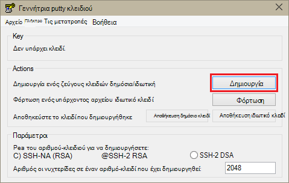
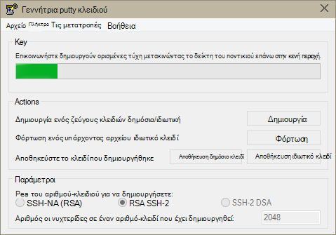
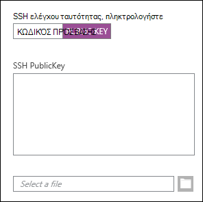
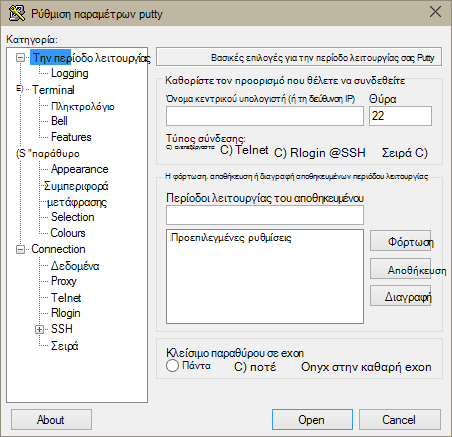
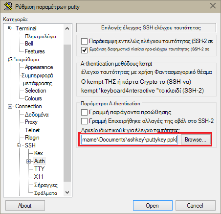
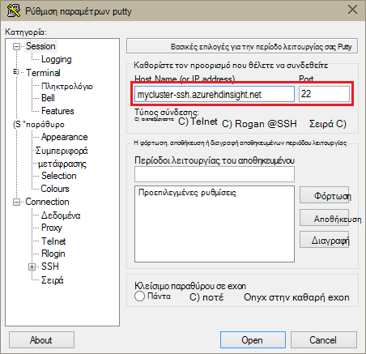
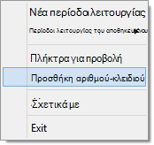
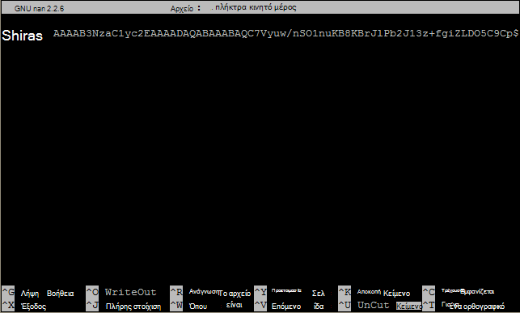

<properties
   pageTitle="Χρήση αριθμών-κλειδιών SSH με Hadoop σε βάσει Linux συμπλεγμάτων από το Windows | Microsoft Azure"
   description="Μάθετε πώς μπορείτε να δημιουργήσετε και να χρησιμοποιήσετε πλήκτρα SSH για τον έλεγχο ταυτότητας βάσει Linux HDInsight συμπλεγμάτων. Συνδεθείτε συμπλεγμάτων από προγράμματα-πελάτες που βασίζονται στα Windows, χρησιμοποιώντας το PuTTY SSH πρόγραμμα-πελάτη."
   services="hdinsight"
   documentationCenter=""
   authors="Blackmist"
   manager="jhubbard"
   editor="cgronlun"
    tags="azure-portal"/>

<tags
   ms.service="hdinsight"
   ms.devlang="na"
   ms.topic="get-started-article"
   ms.tgt_pltfrm="na"
   ms.workload="big-data"
   ms.date="08/30/2016"
   ms.author="larryfr"/>

#Χρήση SSH με βάσει Linux Hadoop σε HDInsight από το Windows

> [AZURE.SELECTOR]
- [Windows](hdinsight-hadoop-linux-use-ssh-windows.md)
- [Linux, Unix λειτουργικό σύστημα OS X](hdinsight-hadoop-linux-use-ssh-unix.md)

[Ασφαλούς κελύφους (SSH)](https://en.wikipedia.org/wiki/Secure_Shell) σάς επιτρέπει να απομακρυσμένα εκτελούν λειτουργίες σε σας συμπλεγμάτων βάσει Linux HDInsight χρησιμοποιώντας ένα περιβάλλον γραμμής εντολών. Αυτό το έγγραφο παρέχει πληροφορίες σχετικά με τη σύνδεση HDInsight από προγράμματα-πελάτες που βασίζονται στα Windows, χρησιμοποιώντας το PuTTY SSH πρόγραμμα-πελάτη.

> [AZURE.NOTE] Τα βήματα σε αυτό το άρθρο προϋποθέτουν ότι χρησιμοποιείτε ένα πρόγραμμα-πελάτη που βασίζεται στα Windows. Εάν χρησιμοποιείτε ένα πρόγραμμα-πελάτη Linux, Unix ή λειτουργικό σύστημα OS X, ανατρέξτε στο θέμα [Χρήση SSH με βάσει Linux Hadoop σε HDInsight από Linux, Unix, ή OS X](hdinsight-hadoop-linux-use-ssh-unix.md).
>
> Εάν έχετε Windows 10 και χρησιμοποιούν [πάρτι σε Ubuntu στα Windows](https://msdn.microsoft.com/commandline/wsl/about), μπορείτε να χρησιμοποιήσετε τα βήματα στο έγγραφο [Χρησιμοποιήστε SSH με βάσει Linux Hadoop σε HDInsight από Linux, Unix, ή OS X](hdinsight-hadoop-linux-use-ssh-unix.md) .

##Προαπαιτούμενα στοιχεία

* **PuTTY** και **PuTTYGen** για προγράμματα-πελάτες που βασίζονται στα Windows. Αυτά τα βοηθητικά προγράμματα είναι διαθέσιμα από [http://www.chiark.greenend.org.uk/~sgtatham/putty/download.html](http://www.chiark.greenend.org.uk/~sgtatham/putty/download.html).

* Σύγχρονο πρόγραμμα περιήγησης που υποστηρίζει HTML5.

OR

* [Azure CLI](../xplat-cli-install.md).

    [AZURE.INCLUDE [use-latest-version](../../includes/hdinsight-use-latest-cli.md)] 

##Τι είναι το SSH;

SSH είναι ένα βοηθητικό πρόγραμμα για σύνδεση στο και της απομακρυσμένης εκτέλεσης, εντολές σε έναν απομακρυσμένο διακομιστή. Με βάσει Linux HDInsight, SSH δημιουργεί μια κρυπτογραφημένη σύνδεση με τον κόμβο κεφαλής συμπλέγματος και παρέχει μια γραμμή εντολών που χρησιμοποιείτε για να πληκτρολογήσετε στις εντολές. Στη συνέχεια, εκτελούνται εντολές απευθείας στο διακομιστή.

###Όνομα χρήστη SSH

Ένα όνομα χρήστη SSH είναι το όνομα που χρησιμοποιείτε για τον έλεγχο ταυτότητας στο σύμπλεγμα HDInsight. Όταν ορίζετε ένα όνομα χρήστη SSH κατά τη δημιουργία συμπλέγματος, αυτός ο χρήστης δημιουργείται σε όλους τους κόμβους του συμπλέγματος. Αφού δημιουργηθεί το σύμπλεγμα, μπορείτε να χρησιμοποιήσετε αυτό το όνομα χρήστη για να συνδεθείτε με τους κόμβους κεφαλής σύμπλεγμα HDInsight. Από τους κόμβους κεφαλίδας, μπορείτε να συνδεθείτε, στη συνέχεια, να τους κόμβους μεμονωμένα εργασίας.

###Κωδικός πρόσβασης SSH ή δημόσιο κλειδί

Ένας χρήστης SSH να χρησιμοποιήσετε έναν κωδικό πρόσβασης ή δημόσιο κλειδί για τον έλεγχο ταυτότητας. Ένας κωδικός πρόσβασης είναι απλώς μια συμβολοσειρά κειμένου που απαρτίζουν, ενώ ένα δημόσιο κλειδί αποτελεί τμήμα ενός ζεύγους κλειδιών κρυπτογράφησης που δημιουργούνται για να προσδιορίσει μοναδικά.

Ένα κλειδί είναι πιο ασφαλής από έναν κωδικό πρόσβασης, ωστόσο απαιτεί επιπλέον βήματα για να δημιουργήσετε το κλειδί και πρέπει να διατηρήσετε τα αρχεία που περιέχει το κλειδί σε ασφαλή θέση. Εάν οποιοσδήποτε αποκτά πρόσβαση για τα σημαντικά αρχεία, αυτά να αποκτήσουν πρόσβαση στο λογαριασμό σας. Ή εάν χάσετε τα σημαντικά αρχεία, δεν θα μπορείτε να συνδεθείτε στο λογαριασμό σας.

Ένα ζεύγος κλειδιών αποτελείται από ένα δημόσιο κλειδί (το οποίο αποστέλλεται στο διακομιστή HDInsight), και ένα ιδιωτικό κλειδί (το οποίο αποθηκεύεται στον υπολογιστή-πελάτη σας.) Όταν συνδέεστε με το διακομιστή HDInsight χρησιμοποιώντας SSH, ο υπολογιστής-πελάτης SSH θα χρησιμοποιήσει το ιδιωτικό κλειδί στον υπολογιστή σας για τον έλεγχο ταυτότητας με το διακομιστή.

##Δημιουργήστε ένα κλειδί SSH

Εάν σκοπεύετε να χρήση SSH αριθμών-κλειδιών με το σύμπλεγμά σας, χρησιμοποιήστε τις ακόλουθες πληροφορίες. Εάν σκοπεύετε να χρησιμοποιώντας έναν κωδικό πρόσβασης, μπορείτε να παραλείψετε αυτή την ενότητα.

1. Άνοιγμα PuTTYGen.

2. Για τον **τύπο του αριθμού-κλειδιού για τη δημιουργία**, επιλέξτε **RSA SSH-2**και, στη συνέχεια, κάντε κλικ στην επιλογή **Δημιουργία**.

    

3. Μετακίνηση του δείκτη του ποντικιού στην περιοχή κάτω από τη γραμμή προόδου, μέχρι να συμπληρώνει τη γραμμή. Όταν μετακινείτε το ποντίκι δημιουργεί τυχαία δεδομένα που χρησιμοποιούνται για τη δημιουργία του κλειδιού.

    

    Αφού έχει δημιουργηθεί το κλειδί, θα εμφανιστεί το δημόσιο κλειδί.

4. Για πρόσθετη ασφάλεια, μπορείτε να εισαγάγετε μια φράση πρόσβασης στο πεδίο **κλειδί φράση πρόσβασης** και, στη συνέχεια, πληκτρολογήστε την ίδια τιμή στο πεδίο **Επιβεβαίωση φράση πρόσβασης** .

    

    > [AZURE.NOTE] Προτείνουμε να χρησιμοποιήσετε μια φράση ασφαλούς πρόσβασης για το κλειδί. Ωστόσο, εάν ξεχάσετε τη φράση πρόσβασης, δεν υπάρχει τρόπος να το ανακτήσετε.

5. Κάντε κλικ στην επιλογή **Αποθήκευση ιδιωτικό κλειδί** για να αποθηκεύσετε το κλειδί σε ένα αρχείο **.ppk** . Αυτό το κλειδί θα χρησιμοποιηθεί για τον έλεγχο ταυτότητας για το σύμπλεγμά σας βάσει Linux HDInsight.

    > [AZURE.NOTE] Θα πρέπει να αποθηκεύσετε αυτό το κλειδί σε ασφαλή θέση, όπως μπορεί να χρησιμοποιηθεί για να αποκτήσετε πρόσβαση το σύμπλεγμά σας βάσει Linux HDInsight.

6. Κάντε κλικ στην επιλογή **Αποθήκευση δημόσιο κλειδί** για να αποθηκεύσετε το κλειδί ως αρχείο **.txt** . Αυτό σας επιτρέπει να χρησιμοποιήσετε εκ νέου το δημόσιο κλειδί στο μέλλον κατά τη δημιουργία επιπλέον συμπλεγμάτων βάσει Linux HDInsight.

    > [AZURE.NOTE] Το δημόσιο κλειδί εμφανίζεται επίσης στο επάνω μέρος PuTTYGen. Μπορείτε να κάντε δεξί κλικ σε αυτό το πεδίο, να αντιγράψετε την τιμή και, στη συνέχεια επικολλήστε το σε μια φόρμα, όταν δημιουργείτε ένα σύμπλεγμα με την πύλη Azure.

##Δημιουργήστε ένα σύμπλεγμα βάσει Linux HDInsight

Όταν δημιουργείτε ένα σύμπλεγμα βάσει Linux HDInsight, πρέπει να παρέχετε το δημόσιο κλειδί που δημιουργήσατε προηγουμένως. Από το Windows σε υπολογιστές-πελάτες, υπάρχουν δύο τρόποι για να δημιουργήσετε ένα σύμπλεγμα βάσει Linux HDInsight:

* **Πύλη azure** - χρησιμοποιεί μια πύλη που βασίζεται στο web για να δημιουργήσετε το σύμπλεγμα.

* **Azure CLI για Mac, Linux και Windows** - χρησιμοποιεί εντολές γραμμής εντολών για να δημιουργήσετε το σύμπλεγμα.

Κάθε μία από τις παρακάτω μεθόδους θα απαιτούν το δημόσιο κλειδί. Για πλήρεις πληροφορίες σχετικά με τη δημιουργία ένα σύμπλεγμα βάσει Linux HDInsight, ανατρέξτε στο θέμα [συμπλεγμάτων βάσει Linux παροχή HDInsight](hdinsight-hadoop-provision-linux-clusters.md).

###Πύλη του Azure

Όταν χρησιμοποιείτε την [Πύλη Azure] [ preview-portal] για να δημιουργήσετε ένα σύμπλεγμα βάσει Linux HDInsight, πρέπει να εισαγάγετε ένα **Όνομα SSH χρήστη**και επιλέξτε για να πληκτρολογήσετε έναν **κωδικό ΠΡΌΣΒΑΣΗΣ** ή **SSH ΔΗΜΌΣΙΟ ΚΛΕΙΔΊ**.

Εάν επιλέξετε **SSH ΔΗΜΌΣΙΟ ΚΛΕΙΔΊ**, μπορείτε είτε να επικολλήσετε το δημόσιο κλειδί (εμφανίζεται στο το __δημόσιο κλειδί για επικόλληση στο OpenSSH εξουσιοδοτημένοι\_αρχείο πλήκτρα__ πεδίο PuttyGen,) στο πεδίο __SSH PublicKey__ , ή επιλέξτε __Επιλογή αρχείου__ για να περιηγηθείτε και επιλέξτε το αρχείο που περιέχει το δημόσιο κλειδί.

Αυτό δημιουργεί μια σύνδεση για το συγκεκριμένο χρήστη και ενεργοποιεί τον κωδικό πρόσβασης τον έλεγχο ταυτότητας ή έλεγχο ταυτότητας κλειδιού SSH.

###Azure περιβάλλον γραμμής εντολών για Mac, Linux και Windows

Μπορείτε να χρησιμοποιήσετε το [Azure CLI για Mac, Linux και Windows](../xplat-cli-install.md) για να δημιουργήσετε ένα νέο σύμπλεγμα χρησιμοποιώντας το `azure hdinsight cluster create` εντολή.

Για περισσότερες πληροφορίες σχετικά με τη χρήση αυτής της εντολής, ανατρέξτε στο θέμα [συμπλεγμάτων Hadoop Linux παροχή στο HDInsight χρησιμοποιώντας προσαρμοσμένες επιλογές](hdinsight-hadoop-provision-linux-clusters.md).

##Σύνδεση σε ένα σύμπλεγμα βάσει Linux HDInsight

1. Άνοιγμα PuTTY.

    

2. Εάν παρέχεται ένα κλειδί SSH κατά τη δημιουργία λογαριασμού χρήστη, πρέπει να εκτελέσετε το ακόλουθο βήμα για να επιλέξετε το ιδιωτικό κλειδί για να χρησιμοποιήσετε κατά τον έλεγχο ταυτότητας στο σύμπλεγμα:

    Στην **κατηγορία**, αναπτύξτε **σύνδεση**ανάπτυξη **SSH**και επιλέξτε **Auth**. Τέλος, κάντε κλικ στην επιλογή **Αναζήτηση** και επιλέξτε το αρχείο .ppk που περιέχει το ιδιωτικό κλειδί.

    

3. Στην **κατηγορία**, επιλέξτε **την περίοδο λειτουργίας**. Από την οθόνη **βασικές επιλογές για την περίοδο λειτουργίας σας PuTTY** , εισαγάγετε τη διεύθυνση SSH του διακομιστή σας HDInsight στο πεδίο **όνομα κεντρικού υπολογιστή (ή τη διεύθυνση IP)** . Υπάρχουν δύο πιθανές διευθύνσεις SSH, μπορείτε να χρησιμοποιήσετε κατά τη σύνδεση σε ένα σύμπλεγμα:

    * __Διεύθυνση κόμβου κεφαλή__: για να συνδέσετε το κεφαλής κόμβο του συμπλέγματος, χρησιμοποιεί το όνομα συμπλέγματος, στη συνέχεια, **-ssh.azurehdinsight.net**. Για παράδειγμα, **mycluster ssh.azurehdinsight.net**.
    
    * __Διεύθυνση κόμβου άκρου__: Εάν συνδέεστε με ένα διακομιστή R σε σύμπλεγμα HDInsight, μπορείτε να συνδεθείτε στον κόμβο edge R Server χρησιμοποιώντας τη διεύθυνση __RServer.CLUSTERNAME.ssh.azurehdinsight.net__, όπου CLUSTERNAME είναι το όνομα του συμπλέγματος. Για παράδειγμα, __RServer.mycluster.ssh.azurehdinsight.net__.

    

4. Για να αποθηκεύσετε τις πληροφορίες σύνδεσης για μελλοντική χρήση, πληκτρολογήστε ένα όνομα για αυτήν τη σύνδεση στην περιοχή **Αποθηκεύονται οι περίοδοι λειτουργίας**και, στη συνέχεια, κάντε κλικ στην επιλογή **Αποθήκευση**. Η σύνδεση θα προστεθεί στη λίστα των αποθηκευμένο περιόδους λειτουργίας.

5. Κάντε κλικ στην επιλογή **Άνοιγμα** για να συνδεθείτε με το σύμπλεγμα.

    > [AZURE.NOTE] Εάν αυτή είναι η πρώτη φορά που έχετε συνδέσει με το σύμπλεγμα, θα λάβετε μια προειδοποίηση ασφαλείας. Αυτό είναι κανονική. Επιλέξτε **Ναι** για να cache το κλειδί RSA2 του διακομιστή για να συνεχίσετε.

6. Όταν σας ζητηθεί, πληκτρολογήστε το χρήστη που πληκτρολογήσατε όταν δημιουργήσατε το σύμπλεγμα. Εάν παρέχεται έναν κωδικό πρόσβασης για το χρήστη, θα σας ζητηθεί να εισαγάγετε επίσης.

> [AZURE.NOTE] Τα παραπάνω βήματα θεωρείται ότι χρησιμοποιείτε θύρα 22, το οποίο θα συνδεθείτε με το πρωτεύον headnode στο σύμπλεγμα HDInsight. Εάν χρησιμοποιείτε το θύρα 23, συνδέεστε στο δευτερεύον. Για περισσότερες πληροφορίες σχετικά με τους κόμβους κεφαλής, ανατρέξτε στο θέμα [διαθεσιμότητα και την αξιοπιστία των συμπλεγμάτων Hadoop στο HDInsight](hdinsight-high-availability-linux.md).

###Σύνδεση με κόμβους εργαζόμενου

Οι κόμβοι εργασίας δεν είναι άμεσα προσβάσιμη από έξω από το Azure κέντρο δεδομένων, αλλά είναι δυνατή από τον κόμβο κεφαλής συμπλέγματος μέσω SSH.

Εάν παρέχεται ένα κλειδί SSH κατά τη δημιουργία λογαριασμού χρήστη, πρέπει να εκτελέσετε τα παρακάτω βήματα για να χρησιμοποιήσετε το ιδιωτικό κλειδί κατά τον έλεγχο ταυτότητας στο σύμπλεγμα, εάν θέλετε να συνδεθείτε με τους κόμβους εργασίας.

1. Εγκαταστήστε Φαντασμαγορικό θέαμα από [http://www.chiark.greenend.org.uk/~sgtatham/putty/download.html](http://www.chiark.greenend.org.uk/~sgtatham/putty/download.html). Αυτό το βοηθητικό πρόγραμμα χρησιμοποιείται για προσωρινή αποθήκευση πλήκτρα SSH για PuTTY.

2. Εκτελέστε Φαντασμαγορικό θέαμα. Αυτό θα ελαχιστοποιηθεί σε ένα εικονίδιο στη κατάστασης εργασιών. Κάντε δεξί κλικ στο εικονίδιο και επιλέξτε **Προσθήκη κλειδιού**.

    

3. Όταν εμφανιστεί το παράθυρο διαλόγου Αναζήτηση, επιλέξτε το αρχείο .ppk που περιέχει τον αριθμό-κλειδί και, στη συνέχεια, κάντε κλικ στην επιλογή **Άνοιγμα**. Αυτό προσθέτει τον αριθμό-κλειδί Φαντασμαγορικό θέαμα, το οποίο θα παρέχει το PuTTY κατά τη σύνδεση στο σύμπλεγμα.

    > [AZURE.IMPORTANT] Αν χρησιμοποιήσατε ένα κλειδί SSH για την ασφάλιση το λογαριασμό σας, πρέπει να ολοκληρώσετε τα προηγούμενα βήματα πριν θα μπορείτε να συνδεθείτε με κόμβους εργασίας.

4. Άνοιγμα PuTTY.

5. Εάν χρησιμοποιείτε ένα κλειδί SSH για τον έλεγχο ταυτότητας, στην ενότητα **κατηγορία** , ανάπτυξη **σύνδεσης**, ανάπτυξη **SSH**και, στη συνέχεια, επιλέξτε **Auth**.

    Στην ενότητα **παραμέτρων ελέγχου ταυτότητας** , ενεργοποίηση **παράγοντα δυνατότητα προώθησης**. Αυτό σας επιτρέπει PuTTY για τη μεταβίβαση αυτόματα το πιστοποιητικό ελέγχου ταυτότητας μέσω της σύνδεσης στον κόμβο κεφαλής σύμπλεγμα κατά τη σύνδεση με κόμβους εργασίας.

    

6. Συνδεθείτε με το σύμπλεγμα όπως τεκμηριώνονται νωρίτερα. Εάν χρησιμοποιείτε ένα πλήκτρο SSH για τον έλεγχο ταυτότητας, δεν χρειάζεται να επιλέξετε τον αριθμό-κλειδί - τον αριθμό-κλειδί SSH προστεθεί Φαντασμαγορικό θέαμα θα χρησιμοποιηθεί για τον έλεγχο ταυτότητας στο σύμπλεγμα.

7. Αφού έχει δημιουργηθεί η σύνδεση, χρησιμοποιήστε τα ακόλουθα για να ανακτήσετε μια λίστα με τους κόμβους του συμπλέγματος. Αντικαταστήστε *ADMINPASSWORD* με τον κωδικό πρόσβασης για το λογαριασμό διαχειριστή συμπλέγματος. Αντικαταστήστε *CLUSTERNAME* με το όνομα του συμπλέγματος.

        curl --user admin:ADMINPASSWORD https://CLUSTERNAME.azurehdinsight.net/api/v1/hosts

    Αυτό θα επιστρέψει πληροφορίες σε μορφή JSON για τους κόμβους στο σύμπλεγμα, συμπεριλαμβανομένων των `host_name`, που περιέχει το πλήρως προσδιορισμένο όνομα τομέα (FQDN) για κάθε κόμβο. Ακολουθεί ένα παράδειγμα ενός `host_name` καταχώρησης που επιστρέφονται από την εντολή **curl** :

        "host_name" : "workernode0.workernode-0-e2f35e63355b4f15a31c460b6d4e1230.j1.internal.cloudapp.net"

8. Όταν έχετε μια λίστα με τους κόμβους εργασίας που θέλετε να συνδεθείτε, χρησιμοποιήστε την ακόλουθη εντολή από την περίοδο λειτουργίας PuTTY για να ανοίξετε μια σύνδεση με έναν κόμβο εργασίας:

        ssh USERNAME@FQDN

    Αντικαταστήστε το *όνομα ΧΡΉΣΤΗ* με το όνομα χρήστη SSH και *FQDN* με το FQDN για τον κόμβο εργασίας. Για παράδειγμα, `workernode0.workernode-0-e2f35e63355b4f15a31c460b6d4e1230.j1.internal.cloudapp.net`.

    > [AZURE.NOTE] Εάν χρησιμοποιείτε έναν κωδικό πρόσβασης για τον έλεγχο ταυτότητας την περίοδο λειτουργίας σας SSH, θα σας ζητηθεί να εισαγάγετε ξανά τον κωδικό πρόσβασης. Εάν χρησιμοποιείτε ένα πλήκτρο SSH, θα πρέπει να ολοκληρωθεί η σύνδεση χωρίς ερωτήσεις.

9. Αφού έχει δημιουργηθεί η περίοδος λειτουργίας, η γραμμή εντολών για την περίοδο λειτουργίας PuTTY σας θα αλλάξει από `username@hn#-clustername` να `username@wn#-clustername` για να υποδείξει ότι είστε συνδεδεμένοι στον κόμβο εργασίας. Όλες οι εντολές που εκτελούνται σε αυτό το σημείο θα εκτελεστεί στον κόμβο εργασίας.

10. Αφού ολοκληρώσετε την εκτέλεση ενεργειών στον κόμβο εργασίας, χρησιμοποιήστε το `exit` εντολή για να κλείσετε την περίοδο λειτουργίας στον κόμβο εργασίας. Αυτό θα επιστρέψει να το `username@hn#-clustername` ερώτηση.

##Προσθήκη περισσότερων λογαριασμών

Εάν θέλετε να προσθέσετε περισσότερους λογαριασμούς για να το σύμπλεγμά σας, εκτελέστε τα ακόλουθα βήματα:

1. Δημιουργήστε μια νέα δημόσια και ιδιωτικό κλειδί για τον νέο λογαριασμό χρήστη, όπως περιγράφεται προηγουμένως.

2. Από μια περίοδο λειτουργίας SSH στο σύμπλεγμα, Προσθήκη νέου χρήστη με την ακόλουθη εντολή:

        sudo adduser --disabled-password <username>

    Αυτό θα δημιουργήσει ένα νέο λογαριασμό χρήστη, αλλά θα απενεργοποίηση του ελέγχου ταυτότητας τον κωδικό πρόσβασης.

3. Δημιουργήστε τον κατάλογο και αρχεία να κρατάτε πατημένο το πλήκτρο, χρησιμοποιώντας τις παρακάτω εντολές:

        sudo mkdir -p /home/<username>/.ssh
        sudo touch /home/<username>/.ssh/authorized_keys
        sudo nano /home/<username>/.ssh/authorized_keys

4. Όταν ανοίξει το πρόγραμμα επεξεργασίας νανομετρικής, αντιγράψτε και επικολλήστε τα περιεχόμενα το δημόσιο κλειδί για τον νέο λογαριασμό χρήστη. Τέλος, χρησιμοποιήστε το **Συνδυασμό πλήκτρων Ctrl-X** για να αποθηκεύσετε το αρχείο και να κλείσετε το πρόγραμμα επεξεργασίας.

    

5. Χρησιμοποιήστε την ακόλουθη εντολή για να αλλάξετε όσον αφορά την κατοχή του φακέλου .ssh και τα περιεχόμενα του νέου λογαριασμού χρήστη:

        sudo chown -hR <username>:<username> /home/<username>/.ssh

6. Τώρα θα πρέπει να μπορούν να ελέγχουν την ταυτότητα διακομιστή με το νέο λογαριασμό χρήστη και ιδιωτικό κλειδί.

##Διοχέτευση SSH

SSH μπορεί να χρησιμοποιηθεί για τη διοχέτευση τοπικές αιτήσεις, όπως αιτήσεων web, στο σύμπλεγμα HDInsight. Η αίτηση θα δρομολογούνται, στη συνέχεια, ο πόρος που ζητήθηκε σαν να είχατε δημιουργήθηκε στον κόμβο κεφαλής συμπλέγματος HDInsight.

> [AZURE.IMPORTANT] Διοχέτευση SSH αποτελεί προϋπόθεση για να αποκτήσετε πρόσβαση στο web περιβάλλοντος εργασίας Χρήστη για ορισμένες υπηρεσίες Hadoop. Για παράδειγμα, το περιβάλλον εργασίας Χρήστη ιστορικού εργασίας ή το διαχειριστή πόρων περιβάλλοντος εργασίας Χρήστη είναι δυνατή μόνο με χρήση διοχέτευση SSH.

Για περισσότερες πληροφορίες σχετικά με τη δημιουργία και χρήση διοχέτευση SSH, ανατρέξτε στο θέμα [Χρήση SSH διοχέτευση για πρόσβαση στο web Ambari περιβάλλοντος εργασίας Χρήστη, ResourceManager, JobHistory, NameNode, Oozie, και άλλη τοποθεσία web του περιβάλλοντος εργασίας Χρήστη](hdinsight-linux-ambari-ssh-tunnel.md).

##Επόμενα βήματα

Τώρα που γνωρίζετε τον τρόπο για τον έλεγχο ταυτότητας με χρήση του πλήκτρου SSH, μάθετε πώς μπορείτε να χρησιμοποιήσετε MapReduce με Hadoop σε HDInsight.

* [Χρήση της ομάδας με το HDInsight](hdinsight-use-hive.md)

* [Χρήση γουρούνι με HDInsight](hdinsight-use-pig.md)

* [Χρήση MapReduce εργασίες με το HDInsight](hdinsight-use-mapreduce.md)

[preview-portal]: https://portal.azure.com/
