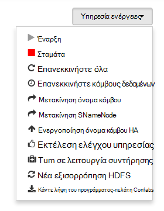

<properties
   pageTitle="Παρακολούθηση και διαχείριση συμπλεγμάτων HDInsight με το περιβάλλον εργασίας Χρήστη Web Apache Ambari | Microsoft Azure"
   description="Μάθετε πώς μπορείτε να χρησιμοποιήσετε Ambari για την παρακολούθηση και διαχείριση συμπλεγμάτων βάσει Linux HDInsight. Σε αυτό το έγγραφο, θα μάθετε πώς μπορείτε να χρησιμοποιήσετε το Web UI Ambari περιλαμβάνεται συμπλεγμάτων HDInsight."
   services="hdinsight"
   documentationCenter=""
   authors="Blackmist"
   manager="jhubbard"
   editor="cgronlun"
    tags="azure-portal"/>

<tags
   ms.service="hdinsight"
   ms.devlang="na"
   ms.topic="article"
   ms.tgt_pltfrm="na"
   ms.workload="big-data"
   ms.date="09/27/2016"
   ms.author="larryfr"/>

#Διαχείριση συμπλεγμάτων HDInsight με τη χρήση του περιβάλλοντος εργασίας Χρήστη Web Ambari

[AZURE.INCLUDE [ambari-selector](../../includes/hdinsight-ambari-selector.md)]

Apache Ambari απλοποιεί τη διαχείριση και την παρακολούθηση ενός συμπλέγματος Hadoop, παρέχοντας ένα εύκολο να χρησιμοποιήσετε web περιβάλλοντος εργασίας Χρήστη και REST API. Ambari περιλαμβάνεται στην συμπλεγμάτων βάσει Linux HDInsight και χρησιμοποιείται για να παρακολουθήσετε το σύμπλεγμα και να κάνετε αλλαγές στη ρύθμιση παραμέτρων.

Σε αυτό το έγγραφο, θα μάθετε πώς μπορείτε να χρησιμοποιήσετε το περιβάλλον εργασίας Χρήστη Web Ambari με ένα σύμπλεγμα HDInsight.

##Τι είναι το Ambari;

<a href="http://ambari.apache.org" target="_blank">Apache Ambari</a> κάνει πιο απλά διαχείρισης Hadoop, παρέχοντας ένα web εύκολο για χρήση περιβάλλοντος εργασίας Χρήστη που μπορεί να χρησιμοποιηθεί για την παροχή, διαχείριση και την παρακολούθηση Hadoop συμπλεγμάτων. Οι προγραμματιστές να ενοποιήσετε αυτές τις δυνατότητες σε εφαρμογές τους, χρησιμοποιώντας τα <a href="https://github.com/apache/ambari/blob/trunk/ambari-server/docs/api/v1/index.md" target="_blank">Ambari ΥΠΌΛΟΙΠΟ APIs</a>.

Το περιβάλλον εργασίας Χρήστη Web Ambari παρέχεται από προεπιλογή με συμπλεγμάτων βάσει Linux HDInsight. 

##Συνδεσιμότητα

Το περιβάλλον εργασίας Χρήστη Web Ambari είναι διαθέσιμη στην το σύμπλεγμά σας HDInsight στο HTTPS://CLUSTERNAME.azurehdidnsight.net, όπου __CLUSTERNAME__ είναι το όνομα του συμπλέγματος. 

> [AZURE.IMPORTANT] Σύνδεση με Ambari σε HDInsight απαιτεί HTTPS. Θα πρέπει να επίσης τον έλεγχο ταυτότητας Ambari χρησιμοποιώντας το όνομα του λογαριασμού διαχειριστή (η προεπιλογή είναι __διαχειριστής__) και τον κωδικό πρόσβασης που παρείχατε κατά τη δημιουργία του συμπλέγματος.

##Διακομιστής μεσολάβησης SSH

> [AZURE.NOTE] Ενώ Ambari για το σύμπλεγμά σας είναι προσβάσιμος απευθείας μέσω του Internet, ορισμένες συνδέσεις από το Web UI Ambari (όπως το JobTracker,) δεν είναι εκτεθειμένη στο internet. Επομένως, θα λάβετε "διακομιστή δεν βρέθηκε" σφάλματα κατά την προσπάθεια για να αποκτήσετε πρόσβαση σε αυτές τις δυνατότητες, εκτός εάν χρησιμοποιείτε μια διοχέτευση ασφαλούς κελύφους (SSH) για να την κυκλοφορία web διακομιστή μεσολάβησης στον κόμβο κεφαλής συμπλέγματος.

Για πληροφορίες σχετικά με τη δημιουργία μιας διοχέτευσης SSH για να εργαστείτε με Ambari, ανατρέξτε στο θέμα [Χρήση SSH διοχέτευση για πρόσβαση στο web Ambari περιβάλλοντος εργασίας Χρήστη, ResourceManager, JobHistory, NameNode, Oozie, και άλλη τοποθεσία web του περιβάλλοντος εργασίας Χρήστη](hdinsight-linux-ambari-ssh-tunnel.md).

##Ambari Web περιβάλλοντος εργασίας Χρήστη

Όταν συνδέεστε με το περιβάλλον εργασίας Χρήστη Web Ambari, θα σας ζητηθεί να ελέγχουν την ταυτότητα της σελίδας. Χρησιμοποιήστε το σύμπλεγμα διαχείρισης χρήστη (προεπιλογή διαχείρισης) και τον κωδικό πρόσβασης που χρησιμοποιήσατε κατά τη δημιουργία συμπλέγματος.

Όταν ανοίξει η σελίδα, σημειώστε τη γραμμή στο επάνω μέρος. Αυτό περιέχει τις παρακάτω πληροφορίες και στοιχεία ελέγχου:

* **Λογότυπο Ambari** - ανοίγει τον πίνακα εργαλείων, τα οποία μπορούν να χρησιμοποιηθούν για την παρακολούθηση του συμπλέγματος.

* **Σύμπλεγμα όνομα # ops** - εμφανίζει τον αριθμό των λειτουργιών Ambari σε εξέλιξη. Επιλέγοντας το όνομα του συμπλέγματος ή **# ops** θα εμφανίζεται μια λίστα με τις λειτουργίες φόντου.

* **ειδοποιήσεις #** - προειδοποιήσεις ή κρίσιμα ειδοποιήσεις, εάν υπάρχει, για το σύμπλεγμα. Η επιλογή αυτή θα εμφανίζεται μια λίστα με τις ειδοποιήσεις.

* **Πίνακας εργαλείων** - εμφανίζει τον πίνακα εργαλείων.

* **Υπηρεσίες** - πληροφορίες και τη ρύθμιση παραμέτρων ρυθμίσεων για τις υπηρεσίες του συμπλέγματος.

* **Hosts** - πληροφορίες και τη ρύθμιση παραμέτρων ρυθμίσεων για τους κόμβους του συμπλέγματος.

* **Ειδοποιήσεις** - ένα αρχείο καταγραφής των πληροφοριών, προειδοποιήσεις και κρίσιμες ειδοποιήσεις.

* **Διαχείριση** - στοίβας/υπηρεσίες λογισμικού που είναι εγκατεστημένα στον σύμπλεγμα, πληροφορίες λογαριασμού της υπηρεσίας και ασφαλείας Kerberos.

* **Κουμπί διαχείρισης** - Ambari Διαχείριση ρυθμίσεων χρήστη και αποσυνδεθείτε.

##Παρακολούθηση

###Ειδοποιήσεις

Ambari παρέχει πολλά ειδοποιήσεις, το οποίο θα έχει ένα από τα εξής, ανάλογα με την κατάσταση:

* **Ok**

* **Προειδοποίηση**

* **ΚΡΊΣΙΜΗ**

* **ΆΓΝΩΣΤΗ ΚΑΤΆΣΤΑΣΗ**

Ειδοποιήσεις εκτός από το **κουμπί ΟΚ** θα προκαλέσει την καταχώρηση **# ειδοποιήσεις** στο επάνω μέρος της σελίδας για να εμφανίσετε τον αριθμό των ειδοποιήσεων. Η επιλογή αυτή την καταχώρηση θα εμφανίσει τις ειδοποιήσεις και την κατάστασή τους.

Ειδοποιήσεις είναι οργανωμένα σε διάφορες προεπιλεγμένες ομάδες που μπορούν να προβληθούν από τη σελίδα **ειδοποιήσεις** .

Μπορείτε να διαχειριστείτε τις ομάδες χρησιμοποιώντας το μενού **Ενέργειες** και επιλέγοντας **Διαχείριση ειδοποίησης ομάδων**. Αυτό σας επιτρέπει να τροποποιήσετε υπάρχουσες ομάδες ή να δημιουργήσετε νέες ομάδες.

Μπορείτε επίσης να δημιουργήσετε οι ειδοποιήσεις από το μενού **Ενέργειες** . Αυτό σας επιτρέπει να δημιουργήσετε εναύσματα που στέλνετε ειδοποιήσεις μέσω **ηλεκτρονικού ΤΑΧΥΔΡΟΜΕΊΟΥ** ή **SNMP** όταν εκτελούνται συγκεκριμένες ειδοποίηση/σοβαρότητας συνδυασμών. Για παράδειγμα, μπορείτε να στείλετε μια ειδοποίηση όταν οποιαδήποτε από τις ειδοποιήσεις στην ομάδα **Προεπιλεγμένη ΝΉΜΑΤΑ** έχει οριστεί σε **κρίσιμη**.

###Σύμπλεγμα

Στην καρτέλα **μετρικά** του πίνακα εργαλείων περιέχει μια σειρά από γραφικά στοιχεία που σας διευκολύνουν να παρακολουθείτε την κατάσταση των το σύμπλεγμά σας με μια ματιά. Πολλά γραφικά στοιχεία, όπως η **Χρήση της CPU**, παρέχουν πρόσθετες πληροφορίες όταν κάνετε κλικ.

Στην καρτέλα **Heatmaps** εμφανίζει μετρικά ως έγχρωμο heatmaps, ξεκινήστε από πράσινο σε κόκκινο.

Για πιο λεπτομερείς πληροφορίες σχετικά με τους κόμβους μέσα στο σύμπλεγμα, επιλέξτε **Hosts**και, στη συνέχεια, επιλέξτε τον συγκεκριμένο κόμβο που σας ενδιαφέρει.

###Υπηρεσίες

Πλαϊνή γραμμή **υπηρεσιών** στον πίνακα εργαλείων παρέχει γρήγορη σχετικά με την κατάσταση των υπηρεσιών που εκτελούνται στο σύμπλεγμα. Διάφορα εικονίδια που χρησιμοποιούνται για να υποδείξετε την κατάσταση ή τις ενέργειες που θα πρέπει να ληφθούν, όπως ένα σύμβολο κίτρινο Ανακύκλωσης εάν μια υπηρεσία πρέπει να είναι διαγραφή τους.

Επιλογή μιας υπηρεσίας θα εμφανίζεται πιο λεπτομερείς πληροφορίες στην υπηρεσία.

####Γρήγορες συνδέσεις

Ορισμένες υπηρεσίες εμφανίζει μια σύνδεση **Γρήγορες συνδέσεις** στο επάνω μέρος της σελίδας. Αυτό μπορεί να χρησιμοποιηθεί για πρόσβαση σε συγκεκριμένη υπηρεσία web περιβάλλοντα εργασίας χρήστη, όπως:

* **Ιστορικό εργασίας** - MapReduce ιστορικού εργασίας.

* **Διαχείριση πόρων** - ΝΉΜΑΤΑ ResourceManager UI.

* **NameNode** - Hadoop κατανεμημένης αρχείο συστήματος (HDFS) NameNode περιβάλλοντος εργασίας Χρήστη.

* **Oozie Web περιβάλλοντος εργασίας Χρήστη** - Oozie περιβάλλοντος εργασίας Χρήστη.

Επιλογή οποιαδήποτε από αυτές τις συνδέσεις θα ανοίξει μια νέα καρτέλα στο πρόγραμμα περιήγησης, το οποίο θα εμφανίζεται στην επιλεγμένη σελίδα.

> [AZURE.NOTE] Επιλογή σύνδεσης **Γρήγορες συνδέσεις** για οποιαδήποτε υπηρεσία θα έχει ως αποτέλεσμα ένα σφάλμα "διακομιστή δεν βρέθηκε" εκτός και εάν χρησιμοποιείτε μια διοχέτευση Secure Sockets Layer (SSL) για να την κυκλοφορία web διακομιστή μεσολάβησης για το σύμπλεγμα. Αυτό συμβαίνει επειδή τις εφαρμογές web που χρησιμοποιούνται για να εμφανίσετε αυτές τις πληροφορίες δεν είναι εκτεθειμένη στο internet.
>
> Για πληροφορίες σχετικά με τη χρήση μιας διοχέτευσης SSL με το HDInsight, ανατρέξτε στο θέμα [Χρήση SSH διοχέτευση για πρόσβαση στο web Ambari περιβάλλοντος εργασίας Χρήστη, ResourceManager, JobHistory, NameNode, Oozie, και άλλη τοποθεσία web του περιβάλλοντος εργασίας Χρήστη](hdinsight-linux-ambari-ssh-tunnel.md)

##Διαχείριση

###Ambari χρηστών, ομάδων και δικαιωμάτων

Διαχείριση χρηστών, ομάδων και δικαιωμάτων δεν πρέπει να χρησιμοποιούνται με συμπλεγμάτων HDInsight.

###Κεντρικών υπολογιστών

Η σελίδα **Hosts** παραθέτει όλους τους κεντρικούς υπολογιστές του συμπλέγματος. Για να διαχειριστείτε τους κεντρικούς υπολογιστές, ακολουθήστε τα παρακάτω βήματα.

> [AZURE.NOTE] Προσθήκη, να διακόψετε τη χρήση ή να recommissioning μια υπηρεσία παροχής φιλοξενίας δεν πρέπει να χρησιμοποιείται με συμπλεγμάτων HDInsight.

1. Επιλέξτε το host(s) που θέλετε να διαχειριστείτε.

2. Χρησιμοποιήστε το μενού **Ενέργειες** για να επιλέξετε την ενέργεια που θέλετε να εκτελέσετε:

    * **Όλα τα στοιχεία Έναρξη** - Έναρξη όλα τα στοιχεία του κεντρικού υπολογιστή.

    * **Διακοπή όλα τα στοιχεία** - διακοπή όλα τα στοιχεία του κεντρικού υπολογιστή.

    * **Επανεκκινήστε όλα τα στοιχεία** - διακοπή και ξεκινήστε όλα τα στοιχεία του κεντρικού υπολογιστή.

    * **Ενεργοποίηση της λειτουργίας συντήρησης** - αποκρύπτει τις ειδοποιήσεις για τον κεντρικό υπολογιστή. Αυτό θα πρέπει να είναι ενεργοποιημένη, εάν πραγματοποιείτε ενέργειες που θα δημιουργήσετε ειδοποιήσεις, όπως η επανεκκίνηση μιας υπηρεσίας που χρησιμοποιείτε τις υπηρεσίες που βασίζονται σε.

    * **Απενεργοποίηση της λειτουργίας συντήρησης** - επιστρέφει τον κεντρικό υπολογιστή σε κανονική ειδοποίησης.

    * **Διακοπή** - DataNode διακοπές ή NodeManagers στον κεντρικό υπολογιστή.

    * **Έναρξη** - ξεκινά DataNode ή NodeManagers στον κεντρικό υπολογιστή.

    * **Επανεκκινήστε** - διακοπές και ξεκινά DataNode ή NodeManagers στον κεντρικό υπολογιστή.

    * **Decommission** - καταργεί μια υπηρεσία παροχής φιλοξενίας από το σύμπλεγμα.

        > [AZURE.NOTE] Μην χρησιμοποιείτε αυτήν την ενέργεια σε συμπλεγμάτων HDInsight.

    * **Recommission** - προσθέτει μια υπηρεσία παροχής φιλοξενίας προηγουμένως παροπλισμού στο σύμπλεγμα.

        > [AZURE.NOTE] Μην χρησιμοποιείτε αυτήν την ενέργεια σε συμπλεγμάτων HDInsight.

###Υπηρεσίες

Από τη σελίδα **πίνακα εργαλείων** ή **υπηρεσίες** , χρησιμοποιήστε το κουμπί **Ενέργειες** στο κάτω μέρος της λίστας των υπηρεσιών για να διακόψετε και να ξεκινήσετε όλες τις υπηρεσίες.

> [AZURE.WARNING] Κατά την __Προσθήκη υπηρεσίας__ παρατίθεται σε αυτό το μενού, δεν θα πρέπει να χρησιμοποιηθεί για να προσθέσετε υπηρεσίες στο σύμπλεγμα HDInsight. Νέες υπηρεσίες πρέπει να προστεθούν χρησιμοποιώντας μια ενέργεια δέσμης ενεργειών κατά την προμήθεια του συμπλέγματος. Για περισσότερες πληροφορίες σχετικά με τη χρήση δέσμης ενεργειών, ανατρέξτε στο θέμα [Προσαρμογή HDInsight συμπλεγμάτων χρήση δέσμης ενεργειών](hdinsight-hadoop-customize-cluster-linux.md).

Ενώ το κουμπί **Ενέργειες** να κάνετε επανεκκίνηση όλων των υπηρεσιών, συχνά θέλετε να ξεκινήσετε, να διακόψετε ή να επανεκκινήσετε μια συγκεκριμένη υπηρεσία. Χρησιμοποιήστε τα ακόλουθα βήματα για την εκτέλεση ενεργειών σε μια υπηρεσία μεμονωμένα:

1. Από τη σελίδα **πίνακα εργαλείων** ή **υπηρεσιών** , επιλέξτε μια υπηρεσία.

2. Από το επάνω μέρος της καρτέλας " **Σύνοψη** ", χρησιμοποιήστε το κουμπί **Ενέργειες υπηρεσίας** και επιλέξτε την ενέργεια που εκτελείται. Αυτό θα επανεκκινήστε την υπηρεσία σε όλους τους κόμβους.

    

    > [AZURE.NOTE] Επανεκκίνηση ορισμένες υπηρεσίες ενώ εκτελείται το σύμπλεγμα ενδέχεται να δημιουργήσει ειδοποιήσεις. Για να αποφύγετε κάτι τέτοιο, μπορείτε να χρησιμοποιήσετε το κουμπί **Ενέργειες υπηρεσίας** για να ενεργοποιήσετε την **κατάσταση λειτουργίας συντήρησης** για την υπηρεσία πριν από την εκτέλεση την επανεκκίνηση.

3. Όταν έχει επιλεγεί μια ενέργεια, θα αυξήσετε την καταχώρηση **# op** στο επάνω μέρος της σελίδας για την εμφάνιση που παρουσιάζεται μια λειτουργία φόντου. Εάν έχει ρυθμιστεί για την εμφάνιση, εμφανίζεται η λίστα των λειτουργιών φόντο.

    > [AZURE.NOTE] Εάν έχετε ενεργοποιήσει **λειτουργία συντήρησης** για την υπηρεσία, μην ξεχάσετε να το απενεργοποιήσετε, χρησιμοποιώντας το κουμπί **Ενέργειες υπηρεσίας** μόλις ολοκληρωθεί η λειτουργία.

Για να ρυθμίσετε τις παραμέτρους μιας υπηρεσίας, χρησιμοποιήστε τα παρακάτω βήματα:

1. Από τη σελίδα **πίνακα εργαλείων** ή **υπηρεσιών** , επιλέξτε μια υπηρεσία.

2. Επιλέξτε την καρτέλα **διαμορφώσεων** . Θα εμφανιστεί η τρέχουσα ρύθμιση παραμέτρων. Μια λίστα με τις προηγούμενες ρυθμίσεις παραμέτρων εμφανίζεται επίσης.

    

3. Χρησιμοποιήστε τα πεδία που εμφανίζονται για να τροποποιήσετε τη ρύθμιση παραμέτρων και, στη συνέχεια, επιλέξτε **Αποθήκευση**. Ή επιλέξτε μια προηγούμενη ρύθμιση παραμέτρων και, στη συνέχεια, επιλέξτε **Δημιουργία τρέχουσα** για να επαναφέρετε τις προηγούμενες ρυθμίσεις.

##Προβολές Ambari

Προβολές Ambari επιτρέπουν στους προγραμματιστές να συνδέσετε στοιχεία περιβάλλοντος εργασίας Χρήστη σε περιβάλλον εργασίας Χρήστη του Ambari Web χρησιμοποιώντας το [Πλαίσιο Ambari προβολές](https://cwiki.apache.org/confluence/display/AMBARI/Views). HDInsight παρέχει τις ακόλουθες προβολές με τους τύπους σύμπλεγμα Hadoop:

* Διαχείριση ουράς νήματα: Η Διαχείριση ουρά παρέχει ένα απλό περιβάλλον εργασίας Χρήστη για προβολή και την τροποποίηση ουρές ΝΉΜΑΤΑ.
* Προβολή Hive: Η προβολή Hive σάς επιτρέπει να εκτέλεση ερωτημάτων Hive απευθείας από το πρόγραμμα περιήγησης web. Μπορείτε να αποθηκεύσετε τα ερωτήματα, προβολή των αποτελεσμάτων, Αποθήκευση αποτελεσμάτων σε του χώρου αποθήκευσης συμπλέγματος, ή κάντε λήψη αποτελεσμάτων στον τοπικό σας σύστημα. Για περισσότερες πληροφορίες σχετικά με τη χρήση της ομάδας προβολές, ανατρέξτε στο θέμα [Χρήση Hive προβολών με HDInsight](hdinsight-hadoop-use-hive-ambari-view.md).
* Προβολή Tez: Η προβολή Tez σάς επιτρέπει να καλύτερη κατανόηση και βελτιστοποίηση εργασίες κατά προβολή πληροφοριών σε πώς εκτελούνται Tez εργασίες και τους πόρους που χρησιμοποιούνται από την εργασία.
