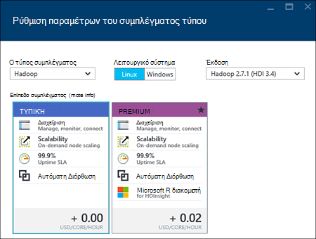
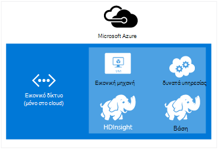
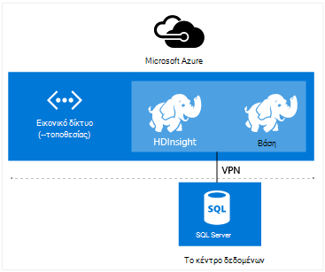

<properties
    pageTitle="Δημιουργία συμπλεγμάτων Hadoop, HBase, καταιγίδας ή τους σε Linux στο HDInsight | Microsoft Azure"
    description="Μάθετε πώς μπορείτε να δημιουργήσετε Hadoop, HBase, καταιγίδας ή να αυξήσετε τη συμπλεγμάτων σε Linux για HDInsight χρησιμοποιώντας ένα πρόγραμμα περιήγησης, το Azure CLI, Azure PowerShell, REST, ή μέσω μιας SDK."
    services="hdinsight"
    documentationCenter=""
    authors="mumian"
    manager="jhubbard"
    editor="cgronlun"
    tags="azure-portal"/>

<tags
    ms.service="hdinsight"
    ms.devlang="na"
    ms.topic="article"
    ms.tgt_pltfrm="na"
    ms.workload="big-data"
    ms.date="10/18/2016"
    ms.author="jgao"/>

# Δημιουργία συμπλεγμάτων που βασίζεται στο Linux Hadoop σε HDInsight

[AZURE.INCLUDE [selector](../../includes/hdinsight-selector-create-clusters.md)]

Ένα σύμπλεγμα Hadoop αποτελείται από πολλά εικονικές μηχανές (κόμβοι) που χρησιμοποιούνται για κατανεμημένη επεξεργασία των εργασιών στο σύμπλεγμα. Azure συνοψίζει τις λεπτομέρειες της υλοποίησης της εγκατάστασης και ρύθμισης παραμέτρων των μεμονωμένων κόμβους, ώστε να έχετε μόνο για την παροχή γενικές πληροφορίες. Σε αυτό το άρθρο, θα μάθετε σχετικά με αυτές τις ρυθμίσεις παραμέτρων.

## Απαιτήσεις για στοιχείο ελέγχου πρόσβασης

[AZURE.INCLUDE [access-control](../../includes/hdinsight-access-control-requirements.md)]

## Τύποι συμπλέγματος

Προς το παρόν, Azure HDInsight παρέχει πέντε διαφορετικούς τύπους συμπλεγμάτων, κάθε μία με ένα σύνολο στοιχείων για να παρέχουν ορισμένες λειτουργίες.

| Τύπος συμπλέγματος | Λειτουργίες |
| ------------ | ----------------------------- |
| Hadoop       | Ερώτημα και ανάλυση (μαζικές εργασίες)     |
| HBase        | Χώρος αποθήκευσης δεδομένων NoSQL            |
| Καταιγίδας        | Επεξεργασία συμβάντος σε πραγματικό χρόνο |
| Τους        | Επεξεργασία στη μνήμη, αλληλεπιδραστικό ερωτήματα, ροή μικρής κλίμακας μαζική επεξεργασία |
| [Αλληλεπιδραστική ομάδα (έκδοση Preview)](hdinsight-hadoop-use-interactive-hive.md) | Στη μνήμη σε cache για γρήγορη και αλληλεπιδραστικών Hive ερωτήματα|
| R διακομιστή στο τους (έκδοση Preview) | Μια ποικιλία στατιστικά στοιχεία μεγάλο δεδομένα πρόβλεψης μοντελοποίηση και μηχανικής εκμάθησης δυνατότητες |

Κάθε τύπος σύμπλεγμα έχει τον δικό του αριθμό κόμβους μέσα στο σύμπλεγμα, ορολογία για τους κόμβους μέσα στο σύμπλεγμα και προεπιλεγμένου μεγέθους Εικονική για κάθε τύπο κόμβου. Στον παρακάτω πίνακα, ο αριθμός των κόμβους για κάθε τύπο κόμβου είναι σε παρενθέσεις.

| Τύπος| Οι κόμβοι | Διάγραμμα|
|-----|------|--------|
|Hadoop| Προϊστάμενος κόμβο (2), κόμβο δεδομένων (1 +)||
|HBase|Προϊστάμενος διακομιστή (2), περιοχή διακομιστή (1 +), κόμβος υποδείγματος/Zookeeper (3)||
|Καταιγίδας|Nimbus κόμβο (2), επόπτη διακομιστή (1 +), Zookeeper κόμβο (3)||
|Τους|Προϊστάμενος κόμβο (2), κόμβο εργαζόμενου (1 +), Zookeeper κόμβου (3) (δωρεάν μέγεθος Εικονική Zookeepers A1)||

Ο παρακάτω πίνακας παραθέτει τα προεπιλεγμένα μεγέθη Εικονική για HDInsight:

- Όλοι οι υποστηριζόμενοι περιοχές εκτός από Βραζιλίας Νότια και Δυτική Ιαπωνία:

  	|Τύπος συμπλέγματος                     | Hadoop               | HBase                | Καταιγίδας                | Τους                                                                 | R διακομιστή |
  	|---------------------------------|----------------------|----------------------|----------------------|-----------------------------------------------------------------------|-----------------------------------------------------------------------|
  	|Προεπιλεγμένη κεφαλή – Εικονική μέγεθος           | D3 v2                | D3 v2                | A3                   | D12 v2                                                                | D12 v2                                                                |
  	|Προϊστάμενος – προτεινόμενα Εικονική μεγέθη      | D3 v2, D4 v2, D12 v2 | D3 v2, D4 v2, D12 v2 | A3, A4, A5           | D12 v2, D13 v2, D14 v2                                                | D12 v2, D13 v2, D14 v2                                                |
  	|Εργαζόμενου – προεπιλεγμένο μέγεθος Εικονική         | D3 v2                | D3 v2                | D3 v2                | Windows: D12 v2; Linux: V2 D4                                         | Windows: D12 v2; Linux: V2 D4                                         |
  	|Εργαζόμενου – προτεινόμενα Εικονική μεγέθη    | D3 v2, D4 v2, D12 v2 | D3 v2, D4 v2, D12 v2 | D3 v2, D4 v2, D12 v2 | Windows: D12 v2, D13 v2, D14 v2. Linux: D4 v2, D12 v2, D13 v2, D14 v2 | Windows: D12 v2, D13 v2, D14 v2. Linux: D4 v2, D12 v2, D13 v2, D14 v2 |
  	|Zookeeper – προεπιλεγμένο μέγεθος Εικονική      |                      | A3                   | A2                   |                                                                       |
  	|Zookeeper – προτεινόμενα Εικονική μεγέθη |                      | A3, A4, A5           | ΚΕΛΙΆ A2, A3, A4           |                                                                       |
  	|Ακμή - προεπιλεγμένο μέγεθος Εικονική           |                      |                      |                      |                                                                       | Windows: D12 v2; Linux: V2 D4                                         |
  	|Ακμή - προτεινόμενο μέγεθος Εικονική       |                      |                      |                      |                                                                       | Windows: D12 v2, D13 v2, D14 v2. Linux: D4 v2, D12 v2, D13 v2, D14 v2 |

- Νότια Βραζιλίας και μόνο Δυτική Ιαπωνία (χωρίς v2 μεγέθη εδώ):

  	|Τύπος συμπλέγματος                     | Hadoop      | HBase       | Καταιγίδας      | Τους                                          |R διακομιστή|
  	|---------------------------------|-------------|-------------|------------|------------------------------------------------|--------|
  	|Προεπιλεγμένη κεφαλή – Εικονική μέγεθος           | D3          | D3          | A3         | D12                                            | D12|
  	|Προϊστάμενος – προτεινόμενα Εικονική μεγέθη      | D3, D4, D12 | D3, D4, D12 | A3, A4, A5 | D14 D12, D13,                                  | D14 D12, D13,|
  	|Εργαζόμενου – προεπιλεγμένο μέγεθος Εικονική         | D3          | D3          | D3         | Windows: D12; Linux: D4                        | Windows: D12; Linux: D4|
  	|Εργαζόμενου – προτεινόμενα Εικονική μεγέθη    | D3, D4, D12 | D3, D4, D12 | D3, D4, D12| Windows: D14 D12, D13, Linux: D4, D12, D13, D14| Windows: D14 D12, D13, Linux: D4, D12, D13, D14|
  	|Zookeeper – προεπιλεγμένο μέγεθος Εικονική      |             | A2          | A2         |                                                | |
  	|Zookeeper – προτεινόμενα Εικονική μεγέθη |             | ΚΕΛΙΆ A2, A3, A4  | ΚΕΛΙΆ A2, A3, A4 |                                                | |
  	|Ακμή-προεπιλεγμένη Εικονική μεγέθη          |             |             |            |                                                | Windows: D12; Linux: D4 |
  	|Άκρη του – προτεινόμενα Εικονική μεγέθη      |             |             |            |                                                | Windows: D14 D12, D13, Linux: D4, D12, D13, D14 |

Σημειώστε ότι κεφαλής είναι γνωστό ως *Nimbus* για τον τύπο σύμπλεγμα καταιγίδας. Εργασίας είναι γνωστό ως *περιοχή* για τον τύπο σύμπλεγμα HBase και ως *επόπτης* για τον τύπο σύμπλεγμα καταιγίδας.

> [AZURE.IMPORTANT] Εάν σκοπεύετε να αντιμετωπίζετε περισσότερους από 32 εργαζόμενου κόμβους, είτε στο σύμπλεγμα δημιουργίας ή την κλίμακα του συμπλέγματος μετά τη δημιουργία, στη συνέχεια, πρέπει να επιλέξετε ένα μέγεθος κεφαλής κόμβο με τουλάχιστον 8 πυρήνων και 14 GB RAM.

Μπορείτε να προσθέσετε άλλα στοιχεία όπως απόχρωση ή R σε αυτούς τους τύπους βασικές με χρήση [Δέσμης ενεργειών](#customize-clusters-using-script-action).

> [AZURE.IMPORTANT] HDInsight συμπλεγμάτων παραδίδεται με διάφορους τύπους, οι οποίοι αντιστοιχούν σε το φόρτο εργασίας ή την τεχνολογία που ρυθμίζεται για το σύμπλεγμα. Δεν υπάρχει υποστηριζόμενη μέθοδος για να δημιουργήσετε ένα σύμπλεγμα που συνδυάζει πολλούς τύπους, όπως καταιγίδας και HBase σε ένα σύμπλεγμα. 

Εάν η λύση απαιτεί τεχνολογίες που εκτείνονται σε πολλούς τύπους σύμπλεγμα HDInsight, θα πρέπει να δημιουργήσετε ένα δίκτυο εικονικού Azure και να δημιουργήσετε τους τύπους απαιτείται σύμπλεγμα εντός του εικονικού δικτύου. Αυτό σας επιτρέπει την συμπλεγμάτων και οποιονδήποτε κωδικό αναπτύσσετε σε αυτά, για να επικοινωνήσετε απευθείας με μεταξύ τους.

Για περισσότερες πληροφορίες σχετικά με τη χρήση μιας Azure εικονικού δικτύου με το HDInsight, ανατρέξτε στο θέμα [Επέκταση HDInsight με το Azure εικονικού δίκτυα](hdinsight-extend-hadoop-virtual-network.md).

Για ένα παράδειγμα χρήσης δύο τύπους σύμπλεγμα μέσα σε ένα δίκτυο εικονικού Azure, ανατρέξτε στο θέμα [ανάλυση δεδομένων αισθητήρα με καταιγίδας και HBase](hdinsight-storm-sensor-data-analysis.md).

## Βαθμίδες συμπλέγματος

Azure HDInsight παρέχει το προσφορές cloud μεγάλο δεδομένων σε δύο κατηγορίες: τυπική και [Premium](hdinsight-component-versioning.md#hdinsight-standard-and-hdinsight-premium). HDInsight Premium περιλαμβάνει R και άλλες πρόσθετα στοιχεία. HDInsight Premium υποστηρίζεται μόνο σε HDInsight έκδοση 3.4.

Ο παρακάτω πίνακας παραθέτει τις τύπος σύμπλεγμα HDInsight και HDInsight Premium υποστήριξη μήτρα.

| Τύπος συμπλέγματος | Τυπική | Premium  |
|--------------|---------------|--------------|
| Hadoop       | Ναι           | Ναι          |
| Τους        | Ναι           | Ναι          |
| HBase        | Ναι           | Όχι           |
| Καταιγίδας        | Ναι           | Όχι           |
| R διακομιστή στο τους | Όχι | Ναι |

Αυτός ο πίνακας θα ενημερώνεται καθώς περισσότεροι τύποι σύμπλεγμα περιλαμβάνονται στο HDInsight Premium. Το παρακάτω στιγμιότυπο οθόνης εμφανίζει το Azure πύλης πληροφορίες για την επιλογή τύποι σύμπλεγμα.

## Βασικές επιλογές ρύθμισης παραμέτρων

Οι παρακάτω είναι οι επιλογές βασική ρύθμιση παραμέτρων που χρησιμοποιούνται για να δημιουργήσετε ένα σύμπλεγμα HDInsight.

### Όνομα συμπλέγματος ###

Όνομα συμπλέγματος χρησιμοποιείται για τον προσδιορισμό ενός συμπλέγματος. Όνομα συμπλέγματος πρέπει να είναι μοναδικό καθολικά και αυτό πρέπει να συμμορφώνονται με τις ακόλουθες οδηγίες ονομασίας:

- Το πεδίο πρέπει να είναι μια συμβολοσειρά που περιέχει από 3 έως 63 χαρακτήρες.
- Το πεδίο μπορεί να περιέχει μόνο γράμματα, αριθμούς και παύλες.

### Τύπος συμπλέγματος###

Ανατρέξτε στο θέμα [τύποι σύμπλεγμα](#cluster-types) και [βαθμίδες σύμπλεγμα](#cluster-tiers).

### Λειτουργικό σύστημα ###

Μπορείτε να δημιουργήσετε HDInsight συμπλεγμάτων σε ένα από τα ακόλουθα δύο λειτουργικά συστήματα:

- HDInsight σε Linux.  HDInsight παρέχει την επιλογή της ρύθμισης παραμέτρων Linux συμπλεγμάτων σε Azure. Ρύθμιση παραμέτρων ένα σύμπλεγμα Linux Εάν είστε εξοικειωμένοι με Linux ή Unix, μετεγκατάσταση από μια υπάρχουσα λύση βάσει Linux Hadoop, ή θέλετε Εύκολη ενοποίηση με στοιχεία περιβάλλον εμπορικής προσαρμογής Hadoop σχεδιασμένες για Linux. Για περισσότερες πληροφορίες, ανατρέξτε στο θέμα [Γρήγορα αποτελέσματα με το Hadoop σε Linux στο HDInsight](hdinsight-hadoop-linux-tutorial-get-started.md).
- HDInsight των Windows (Windows Server 2012 R2 κέντρο δεδομένων).

### Έκδοση HDInsight###

Χρησιμοποιείται για να προσδιορίσετε την έκδοση του HDInsight που χρειάζονται για αυτό το σύμπλεγμα. Για περισσότερες πληροφορίες, ανατρέξτε στο θέμα [Hadoop σύμπλεγμα εκδόσεις και των στοιχείων στο HDInsight](https://go.microsoft.com/fwLink/?LinkID=320896&clcid=0x409).

### Όνομα της συνδρομής###

Κάθε σύμπλεγμα HDInsight είναι συνδεδεμένη με ένα Azure συνδρομής.

### Όνομα ομάδας πόρων ###

[Διαχείριση πόρων Azure](../azure-resource-manager/resource-group-overview.md) σάς βοηθάει να χρησιμοποιήσετε τους πόρους στην εφαρμογή σας ως ομάδα, αναφέρονται ως μια ομάδα πόρων του Azure. Μπορεί να αναπτύξετε, ενημερώνετε, παρακολούθηση, ή διαγραφή όλων των πόρων για την εφαρμογή σε μία συντονισμένη λειτουργία.

### Τα διαπιστευτήρια###

Με το HDInsight συμπλεγμάτων, μπορείτε να ρυθμίσετε δύο λογαριασμούς χρήστη κατά τη δημιουργία συμπλέγματος:

- HTTP χρήστη. Το προεπιλεγμένο όνομα χρήστη είναι *διαχείρισης* χρησιμοποιώντας τις βασικές ρυθμίσεις στην πύλη του Azure. Μερικές φορές ονομάζεται "Συμπλέγματος χρήστη".
- Χρήστης SSH (Linux συμπλεγμάτων). Χρησιμοποιείται για να συνδεθείτε με το σύμπλεγμα χρησιμοποιώντας SSH. Μπορείτε να δημιουργήσετε επιπλέον λογαριασμούς χρήστη SSH αφού δημιουργηθεί το σύμπλεγμα, ακολουθώντας τα βήματα στο θέμα [Χρήση SSH με βάσει Linux Hadoop σε HDInsight από Linux, Unix, ή OS X](hdinsight-hadoop-linux-use-ssh-unix.md) ή [Χρήση SSH με βάσει Linux Hadoop σε HDInsight από τα Windows](hdinsight-hadoop-linux-use-ssh-unix.md).

    >[AZURE.NOTE] Για συμπλεγμάτων που βασίζεται στα Windows, μπορείτε να δημιουργήσετε έναν χρήστη RDP για να συνδεθείτε με το σύμπλεγμα χρησιμοποιώντας RDP.

### Αρχείο προέλευσης δεδομένων###

Το αρχικό σύστημα αρχείων Hadoop κατανεμημένο (HDFS) χρησιμοποιεί πολλά τοπικών δίσκων στο σύμπλεγμα. HDInsight χρησιμοποιεί χώρο αποθήκευσης αντικειμένων Blob του Azure για την αποθήκευση δεδομένων. Χώρο αποθήκευσης Blob του Azure είναι μια λύση ισχυρή, γενικής χρήσης χώρου αποθήκευσης που ενσωματώνεται απρόσκοπτα με HDInsight. Μέσα από ένα περιβάλλον HDFS, το πλήρες σύνολο των στοιχείων στην HDInsight μπορεί να λειτουργήσει απευθείας σε δομημένες ή μη δομημένα δεδομένα στο χώρο αποθήκευσης αντικειμένων Blob. Αποθήκευση δεδομένων στο χώρο αποθήκευσης αντικειμένων Blob σάς βοηθά να διαγράψετε με ασφάλεια των συμπλεγμάτων HDInsight που χρησιμοποιούνται για υπολογισμό χωρίς να χάσετε τα δεδομένα των χρηστών.

Κατά τη ρύθμιση παραμέτρων, πρέπει να καθορίσετε ένα λογαριασμό Azure χώρου αποθήκευσης και ένα κοντέινερ χώρου αποθήκευσης αντικειμένων Blob του Azure στο λογαριασμό Azure χώρου αποθήκευσης. Ορισμένες διαδικασίες δημιουργίας απαιτούν ο λογαριασμός Azure χώρου αποθήκευσης και το κοντέινερ χώρου αποθήκευσης αντικειμένων Blob σε δημιουργηθούν εκ των προτέρων. Το κοντέινερ χώρου αποθήκευσης αντικειμένων Blob χρησιμοποιείται ως η προεπιλεγμένη θέση αποθήκευσης από το σύμπλεγμα. Προαιρετικά, μπορείτε να καθορίσετε επιπλέον χώρο αποθήκευσης Azure λογαριασμούς (χώρος αποθήκευσης συνδεδεμένων) που θα είναι προσβάσιμα από το σύμπλεγμα. Το σύμπλεγμα επίσης να αποκτήσετε πρόσβαση οποιαδήποτε χώρους αποθήκευσης αντικειμένων Blob που έχουν ρυθμιστεί με πλήρη δημόσια πρόσβαση για ανάγνωση ή δημόσια πρόσβαση για αντικείμενα BLOB μόνο για ανάγνωση.  Για περισσότερες πληροφορίες, ανατρέξτε στο θέμα [Διαχείριση πρόσβασης σε πόρους αποθήκευσης Azure](../storage/storage-manage-access-to-resources.md).

>[AZURE.NOTE] Ένα κοντέινερ χώρου αποθήκευσης αντικειμένων Blob παρέχει μια ομαδοποίηση από ένα σύνολο αντικειμένων blob, όπως φαίνεται στην παρακάτω εικόνα.

Δεν συνιστάται να χρησιμοποιείτε το προεπιλεγμένο κοντέινερ χώρου αποθήκευσης αντικειμένων Blob για την αποθήκευση επιχειρηματικών δεδομένων. Διαγραφή το προεπιλεγμένο κοντέινερ χώρου αποθήκευσης αντικειμένων Blob μετά από κάθε χρήση για να μειώσετε το κόστος χώρου αποθήκευσης είναι μια καλή πρακτική. Σημειώστε ότι το προεπιλεγμένο κοντέινερ περιέχει εφαρμογών και του συστήματος αρχείων καταγραφής. Βεβαιωθείτε ότι για να ανακτήσετε τα αρχεία καταγραφής πριν από τη διαγραφή του κοντέινερ.

>[AZURE.WARNING] Κοινή χρήση ενός κοντέινερ χώρου αποθήκευσης αντικειμένων Blob για πολλές συμπλεγμάτων δεν υποστηρίζεται.

Για περισσότερες πληροφορίες σχετικά με τη χρήση δευτερεύοντα χώρο αποθήκευσης αντικειμένων Blob, ανατρέξτε στο θέμα [Χρήση Azure χώρος αποθήκευσης αντικειμένων Blob με HDInsight](hdinsight-hadoop-use-blob-storage.md).

Εκτός από το χώρο αποθήκευσης αντικειμένων Blob του Azure, μπορείτε επίσης να χρησιμοποιήσετε [Χώρου αποθήκευσης λίμνης Azure δεδομένων](../data-lake-store/data-lake-store-overview.md) ως έναν προεπιλεγμένο λογαριασμό χώρου αποθήκευσης για το σύμπλεγμα HBase στο HDInsight και ως συνδεδεμένο χώρου αποθήκευσης για όλες τις τέσσερις τύπους σύμπλεγμα HDInsight. Για περισσότερες πληροφορίες, ανατρέξτε στο θέμα [Δημιουργία ένα σύμπλεγμα HDInsight με το χώρο αποθήκευσης δεδομένων λίμνης με Azure πύλη](../data-lake-store/data-lake-store-hdinsight-hadoop-use-portal.md).

### Τοποθεσία (περιοχή) ###

Το HDInsight σύμπλεγμα και του προεπιλεγμένου λογαριασμού χώρου αποθήκευσης πρέπει να βρίσκεται στην ίδια θέση Azure.

Για μια λίστα με τις υποστηριζόμενες περιοχές, κάντε κλικ στην επιλογή την αναπτυσσόμενη λίστα **περιοχής** σε [τιμές HDInsight](https://go.microsoft.com/fwLink/?LinkID=282635&clcid=0x409).

### Τις τιμές βαθμίδες κόμβου###

Οι πελάτες χρέωσης για τη χρήση των κόμβους στη διάρκεια της ζωής του συμπλέγματος. Χρέωση ξεκινά όταν ένα σύμπλεγμα δημιουργείται και σταματά όταν το σύμπλεγμα έχει διαγραφεί. Συμπλεγμάτων δεν μπορούν να καταργήστε την έχει εκχωρηθεί ή να θέσετε σε αναμονή.

Τύποι διαφορετικό σύμπλεγμα έχουν τύποι διαφορετικό κόμβο, αριθμούς κόμβους και μεγεθών κόμβο. Για παράδειγμα, ένας τύπος σύμπλεγμα Hadoop έχει δύο _κεφαλών κόμβους_ και προεπιλεγμένη τιμή τέσσερις _κόμβους δεδομένων_, ενώ έχει έναν τύπο σύμπλεγμα καταιγίδας δύο _κόμβους nimbus_, τρεις _zookeeper κόμβους_και προεπιλεγμένη τιμή τέσσερις _κόμβους επόπτη_. Το κόστος των συμπλεγμάτων HDInsight καθορίζεται από τον αριθμό των κόμβους και τα μεγέθη εικονικές μηχανές για τους κόμβους. Για παράδειγμα, εάν γνωρίζετε ότι θα εκτελέσετε λειτουργίες που απαιτούν πολλή μνήμη, ενδέχεται να θέλετε να επιλέξετε έναν πόρο υπολογισμού με περισσότερη μνήμη. Για την εκμάθηση, καλό είναι να χρησιμοποιήσετε έναν κόμβο δεδομένων. Για περισσότερες πληροφορίες σχετικά με τις τιμές HDInsight, ανατρέξτε στο θέμα [HDInsight τις πληροφορίες τιμολόγησης](https://go.microsoft.com/fwLink/?LinkID=282635&clcid=0x409).

>[AZURE.NOTE] Το όριο μεγέθους συμπλέγματος ποικίλλει μεταξύ Azure συνδρομές. Επικοινωνήστε με την υποστήριξη χρεώσεων για να αυξήσετε το όριο.

>Οι κόμβοι που χρησιμοποιούνται από το σύμπλεγμά σας δεν υπολογίζονται ως εικονικές μηχανές, επειδή η εικονική μηχανή εικόνες που χρησιμοποιούνται για τους κόμβους είναι μια λεπτομέρεια εφαρμογής της υπηρεσίας HDInsight. Το πυρήνων υπολογισμού που χρησιμοποιείται από τους κόμβους συμπεριλαμβάνονται ο συνολικός αριθμός πυρήνων υπολογισμού που είναι διαθέσιμες για τη συνδρομή σας. Μπορείτε να δείτε τον αριθμό των διαθέσιμη πυρήνων και το πυρήνων που θα χρησιμοποιηθεί από το σύμπλεγμα στην ενότητα σύνοψης της το blade κόμβο βαθμίδες τις τιμές κατά τη δημιουργία ένα σύμπλεγμα HDInsight.

Όταν χρησιμοποιείτε την πύλη του Azure για τη ρύθμιση παραμέτρων του συμπλέγματος, το μέγεθος κόμβου είναι διαθέσιμες μέσω του blade __Κόμβο σειρά τις τιμές__ . Μπορείτε επίσης να δείτε το κόστος που σχετίζεται με τα μεγέθη διαφορετικό κόμβο. Το παρακάτω στιγμιότυπο οθόνης εμφανίζει τις επιλογές για ένα σύμπλεγμα Hadoop Linux βάσης.

Οι παρακάτω πίνακες δείχνουν τα μεγέθη που υποστηρίζονται από το HDInsight συμπλεγμάτων και των δυνατοτήτων που παρέχουν.

#### Τυπική σειρά: μια σειρά####

Στο μοντέλο κλασική ανάπτυξης, ορισμένες μεγέθη Εικονική είναι λίγο διαφορετικά στην PowerShell και CLI.
* Standard_A3 είναι μεγάλο
* Standard_A4 είναι ExtraLarge

|Μέγεθος |CPU πυρήνων|Μνήμη|NIC (Μεγ.)|MAX. μέγεθος δίσκου|MAX. δεδομένα δίσκων (1023 GB κάθε)|MAX. IOP Προέλευσης (500 ανά δίσκο)|
|---|---|---|---|---|---|---|
|Standard_A3\Large|4|7 GB|2|Προσωρινό = 285 GB |8|8 x 500|
|Standard_A4\ExtraLarge|8|14 GB|4|Προσωρινό = 605 GB |16|16 x 500|
|Standard_A6|4|28 GB|2|Προσωρινό = 285 GB |8|8 x 500|
|Standard_A7|8|56 GB|4|Προσωρινό = 605 GB |16|16 x 500|

#### Τυπική σειρά: D σειράς####

|Μέγεθος |CPU πυρήνων|Μνήμη|NIC (Μεγ.)|MAX. μέγεθος δίσκου|MAX. δεδομένα δίσκων (1023 GB κάθε)|MAX. IOP Προέλευσης (500 ανά δίσκο)|
|---|---|---|---|---|---|---|
|Standard_D3 |4|14 GB|4|Προσωρινά αρχεία (SSD) = 200 GB |8|8 x 500|
|Standard_D4 |8|28 GB|8|Προσωρινά αρχεία (SSD) = 400 GB |16|16 x 500|
|Standard_D12 |4|28 GB|4|Προσωρινά αρχεία (SSD) = 200 GB |8|8 x 500|
|Standard_D13 |8|56 GB|8|Προσωρινά αρχεία (SSD) = 400 GB |16|16 x 500|
|Standard_D14 |16|112 GB|8|Προσωρινά αρχεία (SSD) = 800 GB |32|32 x 500|

#### Τυπική σειρά: Dv2 σειρά####

|Μέγεθος |CPU πυρήνων|Μνήμη|NIC (Μεγ.)|MAX. μέγεθος δίσκου|MAX. δεδομένα δίσκων (1023 GB κάθε)|MAX. IOP Προέλευσης (500 ανά δίσκο)|
|---|---|---|---|---|---|---|
|Standard_D3_v2 |4|14 GB|4|Προσωρινά αρχεία (SSD) = 200 GB |8|8 x 500|
|Standard_D4_v2 |8|28 GB|8|Προσωρινά αρχεία (SSD) = 400 GB |16|16 x 500|
|Standard_D12_v2 |4|28 GB|4|Προσωρινά αρχεία (SSD) = 200 GB |8|8 x 500|
|Standard_D13_v2 |8|56 GB|8|Προσωρινά αρχεία (SSD) = 400 GB |16|16 x 500|
|Standard_D14_v2 |16|112 GB|8|Προσωρινά αρχεία (SSD) = 800 GB |32|32 x 500|    

Για θέματα ανάπτυξης για να λάβετε υπόψη όταν σχεδιάζετε να χρησιμοποιήσετε αυτούς τους πόρους, ανατρέξτε στο θέμα [μεγέθη για εικονικές μηχανές](../virtual-machines/virtual-machines-windows-sizes.md). Για πληροφορίες σχετικά με τις τιμές από τα διάφορα μεγέθη, ανατρέξτε στο θέμα [HDInsight τις πληροφορίες τιμολόγησης](https://azure.microsoft.com/pricing/details/hdinsight).   

> [AZURE.IMPORTANT] Εάν σκοπεύετε να αντιμετωπίζετε περισσότερους από 32 εργαζόμενου κόμβους, είτε στο σύμπλεγμα δημιουργίας ή την κλίμακα του συμπλέγματος μετά τη δημιουργία, στη συνέχεια, πρέπει να επιλέξετε ένα μέγεθος κεφαλής κόμβο με τουλάχιστον 8 πυρήνων και 14 GB RAM.

Χρέωση ξεκινά όταν δημιουργείται ένα σύμπλεγμα και σταματά όταν διαγράφεται το σύμπλεγμα. Για περισσότερες πληροφορίες σχετικά με τις τιμές, ανατρέξτε στο θέμα [πληροφορίες για την τιμολόγηση λεπτομέρειες HDInsight](https://azure.microsoft.com/pricing/details/hdinsight/).

## Χρήση του πρόσθετου χώρου αποθήκευσης

Σε ορισμένες περιπτώσεις, ίσως θελήσετε να προσθέσετε επιπλέον χώρο αποθήκευσης στο σύμπλεγμα. Για παράδειγμα, ενδέχεται να έχετε πολλούς λογαριασμούς Azure χώρου αποθήκευσης για διαφορετικές γεωγραφικές περιοχές ή διαφορετικές υπηρεσίες, αλλά θέλετε να αναλύσετε τις όλα με HDInsight.

Μπορείτε να προσθέσετε λογαριασμούς χώρου αποθήκευσης όταν δημιουργείτε ένα σύμπλεγμα HDInsight ή αφού δημιουργηθεί ένα σύμπλεγμα.  Ανατρέξτε στο θέμα [Προσαρμογή Linux βάσει HDInsight συμπλεγμάτων με χρήση δέσμης ενεργειών](hdinsight-hadoop-customize-cluster-linux.md).

Για περισσότερες πληροφορίες σχετικά με τη δευτερεύουσα χώρο αποθήκευσης αντικειμένων Blob, ανατρέξτε στο θέμα [χρήση του Azure χώρος αποθήκευσης αντικειμένων Blob με HDInsight](hdinsight-hadoop-use-blob-storage.md). Για περισσότερες πληροφορίες σχετικά με την αποθήκευση λίμνης δευτερεύοντα δεδομένων, ανατρέξτε στο θέμα [Δημιουργία HDInsight συμπλεγμάτων με το χώρο αποθήκευσης λίμνης δεδομένων με Azure πύλη](../data-lake-store/data-lake-store-hdinsight-hadoop-use-portal.md).

## Χρήση Hive/Oozie metastore

Προτείνουμε να χρησιμοποιήσετε ένα προσαρμοσμένο metastore εάν θέλετε να διατηρήσετε τους πίνακές σας ομάδα μετά τη διαγραφή το σύμπλεγμά σας HDInsight. Θα μπορείτε να επισυνάψετε που metastore σε ένα άλλο σύμπλεγμα HDInsight.

> [AZURE.IMPORTANT] Metastore HDInsight που έχει δημιουργηθεί για ένα σύμπλεγμα έκδοση HDInsight, δεν μπορεί να είναι κοινόχρηστη σε διαφορετικές εκδόσεις σύμπλεγμα HDInsight. Για μια λίστα των εκδόσεων HDInsight, ανατρέξτε στο θέμα [εκδόσεις υποστηρίζονται HDInsight](hdinsight-component-versioning.md#supported-hdinsight-versions).

Το metastore περιέχει Hive και Oozie μετα-δεδομένα, όπως η ομάδα πίνακες, τα διαμερίσματα, σχήματα και στήλες. Το metastore σάς βοηθά να διατηρήσετε την ομάδα και Oozie μετα-δεδομένα, οπότε δεν χρειάζεται να δημιουργήσετε ξανά Hive πίνακες ή εργασίες Oozie όταν δημιουργείτε ένα νέο σύμπλεγμα. Από προεπιλογή, η ομάδα χρησιμοποιεί μια ενσωματωμένη βάση δεδομένων Azure SQL για να αποθηκεύσετε αυτές τις πληροφορίες. Ενσωματωμένο βάσης δεδομένων δεν είναι δυνατό να διατηρηθούν τα μετα-δεδομένα, όταν διαγράφεται το σύμπλεγμα. Όταν δημιουργείτε Hive πίνακα σε ένα σύμπλεγμα HDInsight με μια ομάδα metastore έχει ρυθμιστεί, αυτούς τους πίνακες θα διατηρηθούν κατά αναδημιουργήσετε το σύμπλεγμα χρησιμοποιώντας το ίδιο metastore ομάδα.

Ρύθμιση παραμέτρων Metastore δεν είναι διαθέσιμη για τους τύπους σύμπλεγμα HBase.

> [AZURE.IMPORTANT] Κατά τη δημιουργία ενός προσαρμοσμένου metastore, δεν μπορώ να χρησιμοποιήσω ένα όνομα βάσης δεδομένων που περιέχει παύλες ή παύλες. Αυτό μπορεί να προκαλέσει η διαδικασία δημιουργίας σύμπλεγμα αποτυχία.

## Χρήση του Azure εικονικών δικτύων

Με ένα [Azure εικονικού δικτύου](https://azure.microsoft.com/documentation/services/virtual-network/), μπορείτε να δημιουργήσετε ένα ασφαλές, μόνιμη δίκτυο που περιέχει τους πόρους που χρειάζεστε για τη λύση. Με ένα εικονικό δίκτυο, μπορείτε να:

* Συνδέστε τους πόρους cloud μαζί σε ένα ιδιωτικό δίκτυο (μόνο στο cloud).

    

* Συνδέστε τους πόρους σας cloud με το δίκτυό σας τοπικό Κέντρο δεδομένων (--τοποθεσίας ή σημείου σε τοποθεσία) με τη χρήση ενός εικονικού ιδιωτικού δικτύου (VPN).

| Ρύθμιση παραμέτρων τοποθεσίας σε τοποθεσία | Ρύθμιση παραμέτρων σημείου σε τοποθεσία |
| -------------------------- | --------------------------- |
| Με τη ρύθμιση παραμέτρων-τοποθεσίας, μπορείτε να συνδεθείτε πολλούς πόρους από το κέντρο δεδομένων στο Azure εικονικό δίκτυο, χρησιμοποιώντας μια υλικού VPN ή δρομολόγησης και υπηρεσίας απομακρυσμένης πρόσβασης.  | Με τη ρύθμιση παραμέτρων σημείου σε τοποθεσία, μπορείτε να συνδεθείτε ενός συγκεκριμένου πόρου για να το Azure εικονικού δικτύου, χρησιμοποιώντας ένα λογισμικό VPN.  |

Βασίζεται σε Windows συμπλεγμάτων απαιτείται μια v1 (κλασικό) εικονικού δικτύου, ενώ βάσει Linux συμπλεγμάτων απαιτούν δίκτυο εικονικού v2 (Azure από διαχειριστή πόρων). Εάν δεν έχετε το σωστό τύπο δικτύου, αυτό δεν θα μπορεί να χρησιμοποιηθεί κατά τη δημιουργία του συμπλέγματος.

Για περισσότερες πληροφορίες σχετικά με τη χρήση HDInsight με ένα εικονικό δίκτυο, συμπεριλαμβανομένων των απαιτήσεων συγκεκριμένη ρύθμιση παραμέτρων για το εικονικό δίκτυο, ανατρέξτε στο θέμα [δυνατότητες επέκταση HDInsight, χρησιμοποιώντας μια Azure εικονικού δικτύου](hdinsight-extend-hadoop-virtual-network.md).

## Προσαρμογή συμπλεγμάτων χρησιμοποιώντας HDInsight σύμπλεγμα προσαρμογής (εκκίνησης)

Ορισμένες φορές, που θέλετε να ρυθμίσετε τα ακόλουθα αρχεία ρύθμισης παραμέτρων:

- clusterIdentity.xml
- site.xml πυρήνα
- Gateway.XML
- hbase env.xml
- hbase site.xml
- hdfs site.xml
- ομάδα env.xml
- ομάδα site.xml
- mapred τοποθεσίας
- oozie site.xml
- oozie env.xml
- site.xml καταιγίδας
- tez site.xml
- webhcat site.xml
- νήματα site.xml

Για να διατηρήσετε τις αλλαγές μέσω της διάρκειας ζωής των ένα σύμπλεγμα, μπορείτε να χρησιμοποιήσετε το HDInsight σύμπλεγμα προσαρμογής κατά τη διαδικασία δημιουργίας ή μπορείτε να χρησιμοποιήσετε Ambari στο Linux βάσει συμπλεγμάτων. Για περισσότερες πληροφορίες, ανατρέξτε στο θέμα [Προσαρμογή HDInsight συμπλεγμάτων χρησιμοποιώντας εκκίνησης](hdinsight-hadoop-customize-cluster-bootstrap.md).

>[AZURE.NOTE] Των συμπλεγμάτων που βασίζεται σε Windows δεν είναι δυνατό να διατηρήσει τις αλλαγές λόγω εκ νέου εικόνα. Για περισσότερες πληροφορίες, ανατρέξτε στο θέμα [Ρόλο παρουσία επανεκκίνηση του παράδοσης για αναβαθμίσεις OS](http://blogs.msdn.com/b/kwill/archive/2012/09/19/role-instance-restarts-due-to-os-upgrades.aspx).  Για να διατηρήσετε τις αλλαγές μέσω διάρκειας ζωής των συμπλεγμάτων, πρέπει να χρησιμοποιήσετε προσαρμογής σύμπλεγμα HDInsight κατά τη διαδικασία δημιουργίας.

## Προσαρμογή συμπλεγμάτων με χρήση δέσμης ενεργειών

Μπορείτε να εγκαταστήσετε πρόσθετα στοιχεία ή να προσαρμόσετε ρύθμιση παραμέτρων του συμπλέγματος χρησιμοποιώντας δέσμες ενεργειών κατά τη δημιουργία. Αυτές οι δέσμες ενεργειών ενεργοποιούνται μέσω **Δέσμης ενεργειών**, η οποία είναι μια επιλογή ρύθμισης παραμέτρων που μπορούν να χρησιμοποιηθούν από την πύλη του Azure, το cmdlet του HDInsight Windows PowerShell ή το HDInsight .NET SDK. Για περισσότερες πληροφορίες, ανατρέξτε στο θέμα [Προσαρμογή HDInsight σύμπλεγμα με χρήση δέσμης ενεργειών](hdinsight-hadoop-customize-cluster-linux.md).

Ορισμένες εγγενή στοιχεία Java, όπως Mahout και επικάλυψη, μπορεί να εκτελεστεί στο σύμπλεγμα ως αρχεία αρχειοθέτησης Java (ΒΆΖΟ). Αυτά τα αρχεία ΒΆΖΟ μπορούν να διανεμηθούν με το χώρο αποθήκευσης αντικειμένων Blob του Azure και να υποβάλλεται σε HDInsight συμπλεγμάτων μέσω μηχανισμών υποβολής Hadoop εργασία. Για περισσότερες πληροφορίες, ανατρέξτε στο θέμα [Υποβολή Hadoop έργα μέσω προγραμματισμού](hdinsight-submit-hadoop-jobs-programmatically.md).

>[AZURE.NOTE] Εάν αντιμετωπίζετε προβλήματα με την ανάπτυξη ΒΆΖΟ αρχεία σε HDInsight συμπλεγμάτων ή την κλήση ΒΆΖΟ αρχεία σε συμπλεγμάτων HDInsight, επικοινωνήστε με την [Υποστήριξη της Microsoft](https://azure.microsoft.com/support/options/).

> Επικαλυπτόμενα δεν υποστηρίζεται από το HDInsight και δεν είναι κατάλληλη για την υποστήριξη της Microsoft. Για λίστες με υποστηριζόμενα στοιχεία, ανατρέξτε στο θέμα [Τι νέο υπάρχει στο τις εκδόσεις σύμπλεγμα που παρέχεται από το HDInsight;](hdinsight-component-versioning.md)

## Χρήση του άκρου κόμβου

 Μια κενή άκρη κόμβος είναι μια εικονική μηχανή Linux με τα ίδια εργαλεία προγράμματος-πελάτη εγκατασταθεί και ρυθμιστεί όπως το headnodes. Μπορείτε να χρησιμοποιήσετε τον κόμβο άκρη για πρόσβαση σε σύμπλεγμα, δοκιμές σας εφαρμογές προγράμματος-πελάτη και φιλοξενεί τις εφαρμογές προγράμματος-πελάτη σας. Για περισσότερες πληροφορίες, ανατρέξτε στο θέμα [Χρήση κενή άκρο τους κόμβους HDInsight](hdinsight-apps-use-edge-node.md).
 
## Μέθοδοι δημιουργίας συμπλέγματος

Σε αυτό το άρθρο μάθατε βασικές πληροφορίες σχετικά με τη δημιουργία ένα σύμπλεγμα βάσει Linux HDInsight. Χρησιμοποιήστε τον παρακάτω πίνακα για να βρείτε συγκεκριμένες πληροφορίες σχετικά με το πώς μπορείτε να δημιουργήσετε ένα σύμπλεγμα τη μέθοδο που ταιριάζει καλύτερα στις ανάγκες σας.

| Δημιουργήθηκε με συμπλεγμάτων | Πρόγραμμα περιήγησης Web | Γραμμή εντολών | REST API | SDK | Linux, το Mac OS X ή Unix | Windows |
| ------------------------------- |:----------------------:|:--------------------:|:------------------:|:------------:|:-----------------------------:|:------------:|
| [Πύλη του Azure](hdinsight-hadoop-create-linux-clusters-portal.md) | ✔     | &nbsp; | &nbsp; | &nbsp; | ✔      | ✔ |
| [Εργοστασιακές Azure δεδομένων](hdinsight-hadoop-create-linux-clusters-adf.md) | ✔     | ✔  | ✔  |✔  | ✔      | ✔ |
| [Azure CLI](hdinsight-hadoop-create-linux-clusters-azure-cli.md)         | &nbsp; | ✔     | &nbsp; | &nbsp; | ✔      | ✔ |
| [Azure PowerShell](hdinsight-hadoop-create-linux-clusters-azure-powershell.md) | &nbsp; | ✔     | &nbsp; | &nbsp; | ✔ | ✔ |
| [Καμπύλη](hdinsight-hadoop-create-linux-clusters-curl-rest.md) | &nbsp; | ✔     | ✔ | &nbsp; | ✔      | ✔ |
| [.NET SDK](hdinsight-hadoop-create-linux-clusters-dotnet-sdk.md) | &nbsp; | &nbsp; | &nbsp; | ✔ | ✔      | ✔ |
| [Azure πρότυπα διαχείρισης πόρων](hdinsight-hadoop-create-linux-clusters-arm-templates.md) | &nbsp; | ✔     | &nbsp; | &nbsp; | ✔      | ✔ |
