<properties
   pageTitle="Γρήγορα αποτελέσματα με το διακομιστή R στο HDInsight (έκδοση preview) | Azure"
   description="Μάθετε πώς να δημιουργείτε μια τους Apache σε σύμπλεγμα HDInsight (Hadoop) που περιλαμβάνει R Server (έκδοση preview) και, στη συνέχεια, να υποβάλετε μια R δέσμη ενεργειών στο σύμπλεγμα."
   services="HDInsight"
   documentationCenter=""
   authors="jeffstokes72"
   manager="jhubbard"
   editor="cgronlun"
/>

<tags
   ms.service="HDInsight"
   ms.devlang="R"
   ms.topic="article"
   ms.tgt_pltfrm="na"
   ms.workload="data-services"
   ms.date="08/19/2016"
   ms.author="jeffstok"
/>

# Γρήγορα αποτελέσματα με το διακομιστή R σε HDInsight (έκδοση preview)

Η σειρά premium σας δίνει τη δυνατότητα για το HDInsight περιλαμβάνει R διακομιστή ως μέρος του συμπλέγματος HDInsight (έκδοση preview). Αυτό σας επιτρέπει δέσμες ενεργειών R για να χρησιμοποιήσετε MapReduce και τους για να εκτελέσετε υπολογισμούς κατανεμημένες. Σε αυτό το έγγραφο, θα μάθετε πώς μπορείτε να δημιουργήσετε ένα νέο διακομιστή R σε HDInsight και, στη συνέχεια, εκτελέστε μια δέσμη ενεργειών R που παρουσιάζει τη χρήση τους για κατανέμεται R υπολογισμούς.

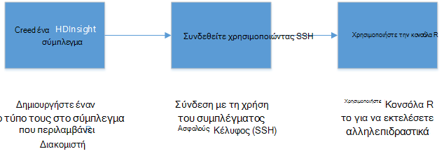

## Προαπαιτούμενα στοιχεία

* __Συνδρομή του Azure__: πριν να ξεκινήσετε αυτό το πρόγραμμα εκμάθησης, πρέπει να έχετε μια συνδρομή του Azure. Για περισσότερες πληροφορίες, ανατρέξτε στο θέμα [λήψη Azure δωρεάν δοκιμαστικής έκδοσης](https://azure.microsoft.com/documentation/videos/get-azure-free-trial-for-testing-hadoop-in-hdinsight/) .

* __Κέλυφος ασφαλούς A (SSH) προγράμματος-πελάτη__: μια SSH προγράμματος-πελάτη χρησιμοποιείται για να συνδεθείτε με το σύμπλεγμα HDInsight από απόσταση και να εκτελούν εντολές του απευθείας στο σύμπλεγμα. Συστήματα Linux, Unix και OS X παρέχουν ένα πρόγραμμα-πελάτη SSH έως το `ssh` εντολή. Για συστήματα των Windows, συνιστάται να [PuTTY](http://www.chiark.greenend.org.uk/~sgtatham/putty/download.html).

    * __Πλήκτρα SSH (προαιρετικό)__: μπορείτε να ασφαλίσετε το λογαριασμό SSH που χρησιμοποιήσατε για να συνδεθείτε με το σύμπλεγμα χρησιμοποιώντας έναν κωδικό πρόσβασης ή ένα δημόσιο κλειδί. Χρησιμοποιώντας έναν κωδικό πρόσβασης είναι πιο εύκολη και σας επιτρέπει να ξεκινήσετε χωρίς να χρειάζεται να δημιουργήσετε ένα ζεύγος κλειδιού δημόσια/ιδιωτική; Ωστόσο, χρησιμοποιώντας ένα πλήκτρο είναι πιο ασφαλή.
    
        Τα βήματα σε αυτό το έγγραφο προϋποθέτουν ότι χρησιμοποιείτε έναν κωδικό πρόσβασης. Για πληροφορίες σχετικά με τον τρόπο δημιουργίας και χρήσης πλήκτρα SSH με το HDInsight, ανατρέξτε στο θέμα τα ακόλουθα έγγραφα:
        
        * [Χρήση SSH με HDInsight από προγράμματα-πελάτες του Linux, Unix ή OS X](hdinsight-hadoop-linux-use-ssh-unix.md)
        
        * [Χρήση SSH με HDInsight από προγράμματα-πελάτες των Windows](hdinsight-hadoop-linux-use-ssh-windows.md)

### Απαιτήσεις για στοιχείο ελέγχου πρόσβασης

[AZURE.INCLUDE [access-control](../../includes/hdinsight-access-control-requirements.md)]

## Δημιουργία του συμπλέγματος

> [AZURE.NOTE] Τα βήματα σε αυτό το έγγραφο Δημιουργήστε ένα διακομιστή R HDInsight με βασικές πληροφορίες. Για άλλες ρυθμίσεις παραμέτρων συμπλέγματος (όπως προσθήκη λογαριασμών επιπλέον χώρο αποθήκευσης, χρησιμοποιώντας μια Azure εικονικού δικτύου ή τη δημιουργία ενός metastore για Hive), ανατρέξτε στο θέμα [Δημιουργία Linux βάσει HDInsight συμπλεγμάτων](hdinsight-hadoop-provision-linux-clusters.md).

1. Είσοδος στην [πύλη του Azure](https://portal.azure.com).

2. Επιλέξτε __ΝΈΑ__ __δεδομένα + αναλυτικών στοιχείων__και, στη συνέχεια, __HDInsight__.

    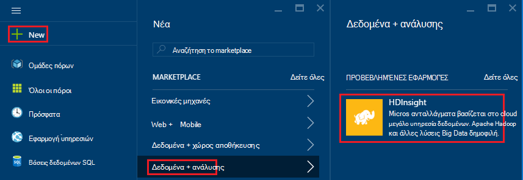

3. Πληκτρολογήστε ένα όνομα για το σύμπλεγμα, στο πεδίο __Όνομα συμπλέγματος__ . Εάν έχετε πολλές συνδρομές Azure, χρησιμοποιήστε την καταχώρηση __συνδρομή__ για να επιλέξετε αυτήν που θέλετε να χρησιμοποιήσετε.

    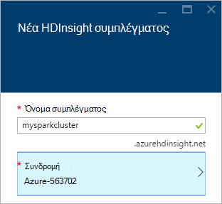

4. Επιλέξτε __Επιλογή τύπου σύμπλεγμα__. Στη το blade __Σύμπλεγμα Type__ , επιλέξτε τις ακόλουθες επιλογές:

    * __Τύπος σύμπλεγμα__: R διακομιστή στο τους
    
    * __Επίπεδο σύμπλεγμα__: Premium

    Αποχώρηση από τις άλλες επιλογές στο τις προεπιλεγμένες τιμές και, στη συνέχεια, χρησιμοποιήστε το κουμπί __επιλογή__ για να αποθηκεύσετε τον τύπο σύμπλεγμα.
    
    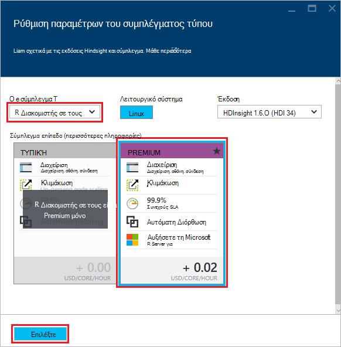
    
    > [AZURE.NOTE] Μπορείτε επίσης να προσθέσετε R διακομιστή σε άλλους τύπους σύμπλεγμα HDInsight (όπως Hadoop ή HBase,), επιλέγοντας τον τύπο σύμπλεγμα, και, στη συνέχεια, επιλέγοντας __Premium__.

5. Επιλέξτε την **Ομάδα πόρων** για να δείτε μια λίστα με τις υπάρχουσες ομάδες του πόρου και, στη συνέχεια, επιλέξτε μία για να δημιουργήσετε το σύμπλεγμα σε. Εναλλακτικά, μπορείτε να επιλέξετε **Δημιουργία νέου** και, στη συνέχεια, πληκτρολογήστε το όνομα της νέας ομάδας πόρων. Θα εμφανιστεί ένα πράσινο σημάδι ελέγχου για να υποδείξει ότι είναι διαθέσιμο το νέο όνομα της ομάδας.

    > [AZURE.NOTE] Αυτή η καταχώρηση προεπιλεγμένη μία από τις υπάρχουσες ομάδες πόρων, εάν είναι διαθέσιμες.
    
    Χρησιμοποιήστε το κουμπί __επιλογή__ για να αποθηκεύσετε την ομάδα των πόρων.

6. Επιλέξτε **τα διαπιστευτήρια**και, στη συνέχεια, πληκτρολογήστε ένα **Όνομα χρήστη σύνδεσης σύμπλεγμα** και **Κωδικό πρόσβασης στο σύμπλεγμα**.

    Πληκτρολογήστε ένα __όνομα χρήστη SSH__.  SSH χρησιμοποιείται απομακρυσμένη σύνδεση με το σύμπλεγμα χρησιμοποιώντας ένα πρόγραμμα-πελάτη __Ασφαλούς κελύφους (SSH)__ . Μπορείτε να καθορίσετε το χρήστη SSH είτε σε αυτό το παράθυρο διαλόγου ή μετά το σύμπλεγμα έχει δημιουργηθεί (καρτέλα ρύθμισης παραμέτρων για το σύμπλεγμα). R Server έχει ρυθμιστεί ώστε να περιμένει ένα __όνομα χρήστη SSH__ του "remoteuser".  Εάν χρησιμοποιείτε ένα διαφορετικό όνομα χρήστη, θα πρέπει να εκτελέσετε μια επιπλέον βήμα, αφού δημιουργηθεί το σύμπλεγμα.
    
    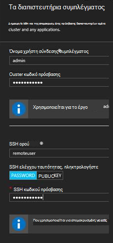

    __Τύπος ελέγχου ταυτότητας SSH__: Επιλέξτε __τον κωδικό ΠΡΌΣΒΑΣΗΣ__ ως τον τύπο ελέγχου ταυτότητας, εκτός εάν προτιμάτε χρήση ενός δημόσιου κλειδιού.  Θα χρειαστείτε ένα ζεύγος κλειδιών δημόσια/ιδιωτική εάν θέλετε να αποκτήσετε πρόσβαση R διακομιστή στο σύμπλεγμα μέσω ενός απομακρυσμένου υπολογιστή-πελάτη, π.χ., RTVS, RStudio ή άλλο υπολογιστή IDE.   

    Για να δημιουργήσετε και να χρησιμοποιήσετε έναν αριθμό-κλειδί δημόσια/ιδιωτική ζεύγος επιλέξτε 'ΔΗΜΌΣΙΟ ΚΛΕΙΔΊ' και συνεχίσετε ως εξής.  Αυτές τις οδηγίες λαμβάνεται ως δεδομένο ότι έχετε Cygwin με ssh keygen ή ισοδύναμο εγκατεστημένο.

    -    Δημιουργία ζεύγος κλειδιού δημόσια/ιδιωτική από τη γραμμή εντολών στο φορητό υπολογιστή σας:
      
            SSH keygen rsa -t -b 2048 – f < ιδιωτικό κλειδί filename >
      
    -    Αυτό θα δημιουργήσει μια ιδιωτικό κλειδί και ένα αρχείο δημόσια κλειδιού κάτω από το όνομα < ιδιωτικό κλειδί filename > .pub, π.χ.  davec και davec.pub.  Στη συνέχεια, καθορίστε το αρχείο δημόσια κλειδιού (* .pub) κατά την αντιστοίχιση HDI σύμπλεγμα διαπιστευτήρια:
      
        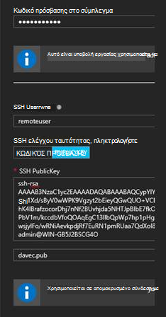  
      
    -    Αλλαγή δικαιωμάτων για το ιδιωτικό κλειδί αρχείου στο φορητό υπολογιστή σας
      
            chmod 600 < ιδιωτικό κλειδί filename >
      
    -    Χρησιμοποιήστε το αρχείο ιδιωτικού κλειδιού με SSH για απομακρυσμένο login, π.χ.
      
            SSH – i < ιδιωτικό κλειδί filename >remoteuser@<hostname public ip>
      
      ή ως μέρος τον ορισμό του περιβάλλοντος υπολογισμού Hadoop τους για R διακομιστή του υπολογιστή-πελάτη (ανατρέξτε στο θέμα χρήση του Microsoft R Server ως ένα πρόγραμμα-πελάτη Hadoop στην ενότητα [Δημιουργία ένα περιβάλλον τον υπολογισμό για τους](https://msdn.microsoft.com/microsoft-r/scaler-spark-getting-started#creating-a-compute-context-for-spark) της του online [RevoScaleR Hadoop τους ο Οδηγός γρήγορων αποτελεσμάτων](https://msdn.microsoft.com/microsoft-r/scaler-spark-getting-started).)

7. Επιλέξτε το **Αρχείο προέλευσης δεδομένων** για να επιλέξετε ένα αρχείο προέλευσης δεδομένων για το σύμπλεγμα. Επιλέξτε έναν υπάρχοντα λογαριασμό του χώρου αποθήκευσης, επιλέγοντας __Επιλέξτε λογαριασμό χώρου αποθήκευσης__ και, στη συνέχεια, επιλέγοντας το λογαριασμό, ή δημιουργήστε έναν νέο λογαριασμό χρησιμοποιώντας τη __νέα__ σύνδεση στην ενότητα __Επιλογή λογαριασμού χώρου αποθήκευσης__ .

    Εάν επιλέξετε τη __Δημιουργία__, πρέπει να εισαγάγετε ένα όνομα για το νέο λογαριασμό του χώρου αποθήκευσης. Ένα πράσινο σημάδι ελέγχου εμφανίζεται εάν το όνομα γίνει αποδεκτή.

    Το όνομα του συμπλέγματος προεπιλεγμένη το __Προεπιλεγμένο κοντέινερ__ . Αφήστε αυτήν την τιμή.
    
    Επιλέξτε __θέση__ για να επιλέξετε την περιοχή για να δημιουργήσετε το λογαριασμό χώρου αποθήκευσης στο.
    
    > [AZURE.IMPORTANT] Επιλογή της θέση για την προέλευση δεδομένων προεπιλογή θα επίσης να ορίσετε τη θέση του συμπλέγματος HDInsight. Το σύμπλεγμα και προεπιλεγμένο αρχείο προέλευσης δεδομένων πρέπει να βρίσκεται στην ίδια περιοχή.

    Χρησιμοποιήστε το κουμπί **επιλογή** για να αποθηκεύσετε τη ρύθμιση παραμέτρων της προέλευσης δεδομένων.
    
    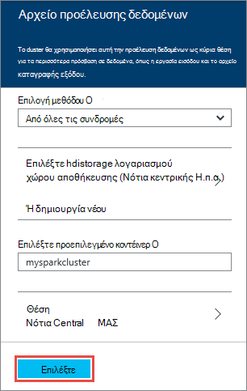

8. Επιλέξτε **Βαθμίδες τιμολόγησης κόμβο** για να εμφανίσετε πληροφορίες σχετικά με τους κόμβους που θα δημιουργηθεί για αυτό το σύμπλεγμα. Εάν δεν γνωρίζετε ότι θα χρειαστείτε ένα μεγαλύτερο σύμπλεγμα, αποχώρηση από τον αριθμό των κόμβους εργαζόμενου την προεπιλεγμένη του `4`. Το εκτιμώμενο κόστος του συμπλέγματος θα εμφανίζεται εντός του blade.

    > [AZURE.NOTE] Εάν είναι απαραίτητο, που μπορεί να αλλάξει το μέγεθος του συμπλέγματος αργότερα μέσω της πύλης (σύμπλεγμα -> Ρυθμίσεις -> κλίμακα σύμπλεγμα) για να αυξήσετε ή να μειώσετε τον αριθμό των κόμβους εργασίας.  Αυτό μπορεί να είναι χρήσιμες για την κατάσταση αδράνειας προς τα κάτω στο σύμπλεγμα όταν δεν είναι σε χρήση ή για να προσθέσετε χωρητικότητα ώστε να ανταποκρίνονται στις ανάγκες των μεγαλύτερων εργασίες.

    Ορισμένες παράγοντες που πρέπει να λάβετε υπόψη κατά την αλλαγή μεγέθους το σύμπλεγμά σας, τους κόμβους δεδομένων και τον κόμβο άκρη περιλαμβάνουν τα εξής:  
   
    - Οι επιδόσεις κατανέμεται αναλύσεων R διακομιστή σε τους είναι ανάλογο με τον αριθμό της εργασίας κόμβους όταν τα δεδομένα είναι μεγάλο.  
    - Η απόδοση διακομιστή R αναλύσεων είναι γραμμική στο μέγεθος των δεδομένων σε διαδικασία ανάλυσης. Για παράδειγμα:  
        - Για μικρές να μέτρια δεδομένα, επιδόσεις θα είναι καλύτερα όταν αναλυθεί σε ένα περιβάλλον τοπικό σας υπολογιστή στον κόμβο άκρο.  Για περισσότερες πληροφορίες σχετικά με τα σενάρια βάσει των οποίων η τοπική και τους υπολογισμού περιβάλλοντα λειτουργούν καλύτερα δείτε επιλογές περιβάλλοντος υπολογισμού για R διακομιστή σε HDInsight. 
        - Εάν μπορείτε να συνδεθείτε με τον κόμβο άκρου και να εκτελέσετε R τη δέσμη ενεργειών σας εκεί, στη συνέχεια, όλες, αλλά οι ScaleR λήψης-συναρτήσεις θα εκτελεστεί <strong>τοπικά</strong> στον κόμβο άκρου ώστε μνήμη και αριθμός πυρήνων του άκρου κόμβου θα πρέπει να έχει το μέγεθος ανάλογα. Το ίδιο ισχύει, εάν χρησιμοποιείτε διακομιστή R σε HDI ως ένα περιβάλλον απομακρυσμένο υπολογισμού από τον φορητό υπολογιστή.
    
    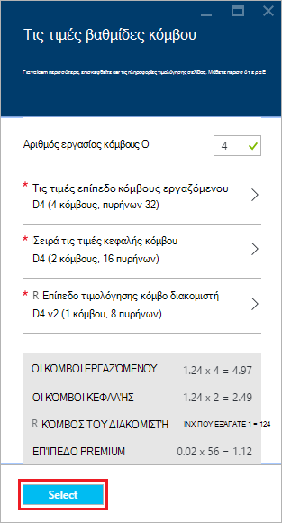

    Χρησιμοποιήστε το κουμπί **επιλογή** για να αποθηκεύσετε τον κόμβο τις τιμές παραμέτρων.
    
9. Στην blade το **Νέο σύμπλεγμα HDInsight** , βεβαιωθείτε ότι είναι επιλεγμένο το **Καρφίτσωμα στην Startboard** και, στη συνέχεια, επιλέξτε **Δημιουργία**. Αυτό θα δημιουργήσετε το σύμπλεγμα και να προσθέσετε ένα πλακίδιο για αυτήν την Startboard της πύλης Azure. Το εικονίδιο υποδεικνύει ότι το σύμπλεγμα είναι να δημιουργήσετε και θα αλλάξει για να εμφανίσετε το εικονίδιο HDInsight μόλις ολοκληρωθεί η δημιουργία.

  	| Κατά τη δημιουργία | Δημιουργία ολοκληρώθηκε |
  	| ------------------ | --------------------- |
  	|  |  |

    > [AZURE.NOTE] Θα χρειαστεί κάποιος χρόνος για το σύμπλεγμα να δημιουργηθεί, συνήθως είναι περίπου 15 λεπτά. Χρησιμοποιήστε το πλακίδιο στην το Startboard ή την καταχώρηση **ειδοποιήσεις** στην αριστερή πλευρά της σελίδας για να ελέγξετε τη διαδικασία δημιουργίας.

## Σύνδεση με τον κόμβο edge R Server

Συνδεθείτε στο διακομιστή R άκρη κόμβο του συμπλέγματος HDInsight χρησιμοποιώντας SSH:

    ssh USERNAME@r-server.CLUSTERNAME-ssh.azurehdinsight.net
    
> [AZURE.NOTE] Μπορείτε επίσης να βρείτε το `R-Server.CLUSTERNAME-ssh.azurehdinsight.net` διεύθυνση στην πύλη του Azure, επιλέγοντας το σύμπλεγμα, στη συνέχεια, __Όλες οι ρυθμίσεις__, __εφαρμογών__και __RServer__. Αυτό θα εμφανίσει τις πληροφορίες SSH ορίου για τον κόμβο άκρο.
>
> 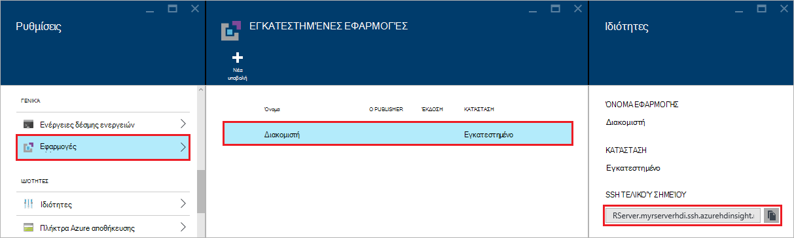
    
Εάν χρησιμοποιούσατε έναν κωδικό πρόσβασης για την ασφάλιση λογαριασμού χρήστη SSH, θα σας ζητηθεί για να το εισαγάγετε. Εάν χρησιμοποιείτε ένα δημόσιο κλειδί, ίσως χρειαστεί να χρησιμοποιήσετε το `-i` παραμέτρου για να καθορίσετε το αντίστοιχο ιδιωτικό κλειδί. Για παράδειγμα, `ssh -i ~/.ssh/id_rsa USERNAME@R-Server.CLUSTERNAME-ssh.azurehdinsight.net`.
    
Για περισσότερες πληροφορίες σχετικά με τη χρήση SSH με βάσει Linux HDInsight, ανατρέξτε στα ακόλουθα άρθρα:

* [Χρήση SSH με βάσει Linux Hadoop σε HDInsight από Linux, Unix ή λειτουργικό σύστημα OS X](hdinsight-hadoop-linux-use-ssh-unix.md)

* [Χρήση SSH με βάσει Linux Hadoop σε HDInsight από το Windows](hdinsight-hadoop-linux-use-ssh-windows.md)

Μετά τη σύνδεση, θα φτάνουν σε μια παρόμοια με την ακόλουθη εντολών.

    username@ed00-myrser:~$

## Χρησιμοποιήστε την κονσόλα R

1. Από την περίοδο λειτουργίας SSH, χρησιμοποιήστε την παρακάτω εντολή για να ξεκινήσετε την κονσόλα R.

        R
    
    Θα δείτε παρόμοιο με το εξής αποτέλεσμα.
    
        R version 3.2.2 (2015-08-14) -- "Fire Safety"
        Copyright (C) 2015 The R Foundation for Statistical Computing
        Platform: x86_64-pc-linux-gnu (64-bit)

        R is free software and comes with ABSOLUTELY NO WARRANTY.
        You are welcome to redistribute it under certain conditions.
        Type 'license()' or 'licence()' for distribution details.

        Natural language support but running in an English locale

        R is a collaborative project with many contributors.
        Type 'contributors()' for more information and
        'citation()' on how to cite R or R packages in publications.

        Type 'demo()' for some demos, 'help()' for on-line help, or
        'help.start()' for an HTML browser interface to help.
        Type 'q()' to quit R.

        Microsoft R Server version 8.0: an enhanced distribution of R
        Microsoft packages Copyright (C) 2016 Microsoft Corporation

        Type 'readme()' for release notes.

        >

2. Από το `>` μηνύματος, μπορείτε να εισαγάγετε κωδικό R. Διακομιστής R περιλαμβάνει πακέτων που σας επιτρέπουν να αλληλεπιδράτε με Hadoop εύκολα και να εκτελέσετε υπολογισμούς κατανέμεται. Για παράδειγμα, χρησιμοποιήστε την παρακάτω εντολή για να προβάλετε το ριζικό κατάλογο της το προεπιλεγμένο σύστημα αρχείων για το σύμπλεγμα HDInsight.

        rxHadoopListFiles("/")
    
    Μπορείτε επίσης να χρησιμοποιήσετε το στυλ WASB διευθύνσεων.
    
        rxHadoopListFiles("wasbs:///")

## Χρήση διακομιστή R σε HDI από μια απομακρυσμένη περίοδο λειτουργίας του Microsoft R Server ή το πρόγραμμα-πελάτης Microsoft R

Ανά ενότητα παραπάνω σχετικά με τη χρήση ζευγών κλειδιών δημόσια/ιδιωτική, για να αποκτήσετε πρόσβαση στο σύμπλεγμα, είναι δυνατό να ρύθμισης πρόσβαση στο περιβάλλον υπολογισμού HDI Hadoop τους από μια απομακρυσμένη παρουσία του Microsoft R Server ή το Microsoft R προγράμματος-πελάτη εκτελείται σε έναν επιτραπέζιο ή φορητό υπολογιστή (ανατρέξτε στο θέμα χρήση του Microsoft R Server ως ένα πρόγραμμα-πελάτη Hadoop στην ενότητα [Δημιουργία ένα περιβάλλον τον υπολογισμό για τους](https://msdn.microsoft.com/microsoft-r/scaler-spark-getting-started#creating-a-compute-context-for-spark) της του online [RevoScaleR Hadoop τους ο Οδηγός γρήγορων αποτελεσμάτων](https://msdn.microsoft.com/microsoft-r/scaler-spark-getting-started)).  Για να το κάνετε αυτό, θα πρέπει να καθορίσετε τις ακόλουθες επιλογές κατά τον καθορισμό του RxSpark τον υπολογισμό περιβάλλοντος στο φορητό υπολογιστή σας: hdfsShareDir, shareDir, sshUsername, sshHostname, sshSwitches, και sshProfileScript. Για παράδειγμα:

    
    myNameNode <- "default"
    myPort <- 0 
 
    mySshHostname  <- 'rkrrehdi1-ssh.azurehdinsight.net'  # HDI secure shell hostname
    mySshUsername  <- 'remoteuser'# HDI SSH username
    mySshSwitches  <- '-i /cygdrive/c/Data/R/davec'   # HDI SSH private key
 
    myhdfsShareDir <- paste("/user/RevoShare", mySshUsername, sep="/")
    myShareDir <- paste("/var/RevoShare" , mySshUsername, sep="/")
 
    mySparkCluster <- RxSpark(
      hdfsShareDir = myhdfsShareDir,
      shareDir     = myShareDir,
      sshUsername  = mySshUsername,
      sshHostname  = mySshHostname,
      sshSwitches  = mySshSwitches,
      sshProfileScript = '/etc/profile',
      nameNode     = myNameNode,
      port         = myPort,
      consoleOutput= TRUE
    )

    
 
## Χρησιμοποιήστε ένα περιβάλλον υπολογισμού

Ένα περιβάλλον υπολογισμού σάς επιτρέπει να ελέγχετε εάν κατά τον υπολογισμό θα εκτελεστεί τοπικά στον κόμβο άκρη ή εάν θα να διανεμηθούν κατά μήκος τους κόμβους του συμπλέγματος HDInsight.
        
1. Από την κονσόλα R, χρησιμοποιήστε τα παρακάτω για τη φόρτωση δεδομένα του παραδείγματος στο προεπιλεγμένο αποθήκευσης για το HDInsight.

        # Set the HDFS (WASB) location of example data
        bigDataDirRoot <- "/example/data"
        # create a local folder for storaging data temporarily
        source <- "/tmp/AirOnTimeCSV2012"
        dir.create(source)
        # Download data to the tmp folder
        remoteDir <- "http://packages.revolutionanalytics.com/datasets/AirOnTimeCSV2012"
        download.file(file.path(remoteDir, "airOT201201.csv"), file.path(source, "airOT201201.csv"))
        download.file(file.path(remoteDir, "airOT201202.csv"), file.path(source, "airOT201202.csv"))
        download.file(file.path(remoteDir, "airOT201203.csv"), file.path(source, "airOT201203.csv"))
        download.file(file.path(remoteDir, "airOT201204.csv"), file.path(source, "airOT201204.csv"))
        download.file(file.path(remoteDir, "airOT201205.csv"), file.path(source, "airOT201205.csv"))
        download.file(file.path(remoteDir, "airOT201206.csv"), file.path(source, "airOT201206.csv"))
        download.file(file.path(remoteDir, "airOT201207.csv"), file.path(source, "airOT201207.csv"))
        download.file(file.path(remoteDir, "airOT201208.csv"), file.path(source, "airOT201208.csv"))
        download.file(file.path(remoteDir, "airOT201209.csv"), file.path(source, "airOT201209.csv"))
        download.file(file.path(remoteDir, "airOT201210.csv"), file.path(source, "airOT201210.csv"))
        download.file(file.path(remoteDir, "airOT201211.csv"), file.path(source, "airOT201211.csv"))
        download.file(file.path(remoteDir, "airOT201212.csv"), file.path(source, "airOT201212.csv"))
        # Set directory in bigDataDirRoot to load the data into
        inputDir <- file.path(bigDataDirRoot,"AirOnTimeCSV2012") 
        # Make the directory
        rxHadoopMakeDir(inputDir)
        # Copy the data from source to input
        rxHadoopCopyFromLocal(source, bigDataDirRoot)

2. Στη συνέχεια, ας δημιουργία ορισμένες πληροφορίες δεδομένων και τον ορισμό δύο προελεύσεις δεδομένων, ώστε να σας να εργαστείτε με τα δεδομένα.

        # Define the HDFS (WASB) file system
        hdfsFS <- RxHdfsFileSystem()
        # Create info list for the airline data
        airlineColInfo <- list(
            DAY_OF_WEEK = list(type = "factor"),
            ORIGIN = list(type = "factor"),
            DEST = list(type = "factor"),
            DEP_TIME = list(type = "integer"),
            ARR_DEL15 = list(type = "logical"))

        # get all the column names
        varNames <- names(airlineColInfo)

        # Define the text data source in hdfs
        airOnTimeData <- RxTextData(inputDir, colInfo = airlineColInfo, varsToKeep = varNames, fileSystem = hdfsFS)
        # Define the text data source in local system
        airOnTimeDataLocal <- RxTextData(source, colInfo = airlineColInfo, varsToKeep = varNames)

        # formula to use
        formula = "ARR_DEL15 ~ ORIGIN + DAY_OF_WEEK + DEP_TIME + DEST"

3. Ας εκτέλεση εφοδιαστική παλινδρόμησης μέσω των δεδομένων με χρήση του τοπικού υπολογίσετε περιβάλλοντος.

        # Set a local compute context
        rxSetComputeContext("local")
        # Run a logistic regression
        system.time(
            modelLocal <- rxLogit(formula, data = airOnTimeDataLocal)
        )
        # Display a summary 
        summary(modelLocal)

    Θα πρέπει να βλέπετε εξόδου που τελειώνει με γραμμές παρόμοιο με το ακόλουθο.

        Data: airOnTimeDataLocal (RxTextData Data Source)
        File name: /tmp/AirOnTimeCSV2012
        Dependent variable(s): ARR_DEL15
        Total independent variables: 634 (Including number dropped: 3)
        Number of valid observations: 6005381
        Number of missing observations: 91381
        -2*LogLikelihood: 5143814.1504 (Residual deviance on 6004750 degrees of freedom)

        Coefficients:
                        Estimate Std. Error z value Pr(>|z|)
        (Intercept)   -3.370e+00  1.051e+00  -3.208  0.00134 **
        ORIGIN=JFK     4.549e-01  7.915e-01   0.575  0.56548
        ORIGIN=LAX     5.265e-01  7.915e-01   0.665  0.50590
        ......
        DEST=SHD       5.975e-01  9.371e-01   0.638  0.52377
        DEST=TTN       4.563e-01  9.520e-01   0.479  0.63172
        DEST=LAR      -1.270e+00  7.575e-01  -1.676  0.09364 .
        DEST=BPT         Dropped    Dropped Dropped  Dropped
        ---
        Signif. codes:  0 ‘***’ 0.001 ‘**’ 0.01 ‘*’ 0.05 ‘.’ 0.1 ‘ ’ 1

        Condition number of final variance-covariance matrix: 11904202
        Number of iterations: 7

4. Επόμενο, ας εκτελέστε την ίδια εφοδιαστική παλινδρόμηση χρησιμοποιώντας το περιβάλλον τους. Το περιβάλλον τους θα διανομή της επεξεργασίας μέσω όλους τους κόμβους εργαζόμενου στο σύμπλεγμα HDInsight.

        # Define the Spark compute context 
        mySparkCluster <- RxSpark()
        # Set the compute context 
        rxSetComputeContext(mySparkCluster)
        # Run a logistic regression 
        system.time(  
            modelSpark <- rxLogit(formula, data = airOnTimeData)
        )
        # Display a summary
        summary(modelSpark)

    > [AZURE.NOTE] Μπορείτε επίσης να χρησιμοποιήσετε MapReduce για τη διανομή κατά τον υπολογισμό σε κόμβους συμπλέγματος. Για περισσότερες πληροφορίες σχετικά με το περιβάλλον υπολογισμού, ανατρέξτε στο θέμα [τον υπολογισμό επιλογές περιβάλλοντος για R διακομιστή σε HDInsight premium](hdinsight-hadoop-r-server-compute-contexts.md).

## Διανομή R κώδικα για πολλούς κόμβους

Με το διακομιστή R μπορείτε να κάνετε υπάρχοντα κωδικό R εύκολα και να εκτελέσετε σε πολλούς κόμβους του συμπλέγματος χρησιμοποιώντας `rxExec`. Αυτό είναι χρήσιμο όταν κάνοντας ένα εκκαθάριση παραμέτρου ή προσομοιώσεις. Ακολουθεί ένα παράδειγμα του τρόπου χρήσης `rxExec`.

    rxExec( function() {Sys.info()["nodename"]}, timesToRun = 4 )
    
Εάν εξακολουθείτε να χρησιμοποιείτε το περιβάλλον τους ή MapReduce, αυτό θα επιστρέψει την τιμή nodename για τους κόμβους εργαζόμενου που ο κώδικας (`Sys.info()["nodename"]`) είναι εκτελέσατε. Για παράδειγμα, σε ένα σύμπλεγμα τέσσερις κόμβου, ενδέχεται να εμφανιστεί παρόμοιο με το εξής αποτέλεσμα.

    $rxElem1
        nodename
    "wn3-myrser"

    $rxElem2
        nodename
    "wn0-myrser"

    $rxElem3
        nodename
    "wn3-myrser"

    $rxElem4
        nodename
    "wn3-myrser"

## Εγκατάσταση πακέτων R

Εάν θέλετε να εγκαταστήσετε πρόσθετα πακέτα R στον κόμβο ακμή, μπορείτε να χρησιμοποιήσετε `install.packages()` απευθείας από μέσα στο R console όταν είστε συνδεδεμένοι στον κόμβο edge μέσω SSH. Ωστόσο, εάν πρέπει να εγκαταστήσετε πακέτα R σε τους κόμβους εργαζόμενος του συμπλέγματος, πρέπει να χρησιμοποιείτε μια δέσμη ενεργειών ενέργεια.

Ενέργειες δέσμης ενεργειών είναι πάρτι δέσμες ενεργειών που χρησιμοποιούνται για να κάνετε αλλαγές στη ρύθμιση παραμέτρων του συμπλέγματος HDInsight, ή για να εγκαταστήσετε το πρόσθετο λογισμικό. Σε αυτήν την περίπτωση, για να εγκαταστήσετε το πρόσθετο R πακέτων. Για να εγκαταστήσετε πρόσθετα πακέτα χρησιμοποιώντας μια ενέργεια δέσμης ενεργειών, χρησιμοποιήστε τα παρακάτω βήματα.

> [AZURE.IMPORTANT] Χρήση δέσμης ενεργειών για να εγκαταστήσετε πρόσθετα πακέτα R μπορεί να χρησιμοποιηθεί μόνο αφού δημιουργηθεί το σύμπλεγμα. Αυτό δεν πρέπει να χρησιμοποιούνται κατά τη δημιουργία συμπλέγματος, όπως η δέσμη ενεργειών που βασίζεται σε διακομιστή R που εντελώς εγκατασταθεί και ρυθμιστεί.

1. Από την [πύλη του Azure](https://portal.azure.com), επιλέξτε το διακομιστή R σε σύμπλεγμα HDInsight.

2. Από το σύμπλεγμα blade, επιλέξτε __Όλες τις ρυθμίσεις__και, στη συνέχεια, __Ενέργειες δέσμης ενεργειών__. Από το blade __Ενέργειες δέσμης ενεργειών__ , επιλέξτε __Νέα υποβολή__ για να υποβάλετε μια νέα ενέργεια δέσμης ενεργειών.

    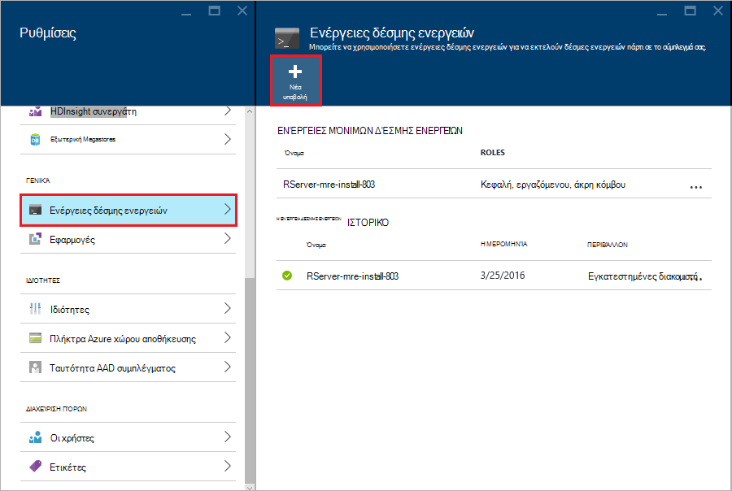

3. Η __ενέργεια δέσμης ενεργειών υποβολής__ blade, δώστε τις ακόλουθες πληροφορίες.

  - __Όνομα__: ένα φιλικό όνομα για τον προσδιορισμό αυτήν τη δέσμη ενεργειών
  - __Πάρτι δέσμης ενεργειών URI__:`http://mrsactionscripts.blob.core.windows.net/rpackages-v01/InstallRPackages.sh`
  - __Προϊστάμενος__: αυτό πρέπει να είναι __απενεργοποιημένο__
  - __Εργαζόμενου__: αυτό πρέπει να είναι __επιλεγμένο το στοιχείο__
  - __Zookeeper__: αυτό πρέπει να είναι __απενεργοποιημένο__
  - __Παράμετροι__: το R πακέτων να έχει εγκατασταθεί. Για παράδειγμα,`bitops stringr arules`
  - __Διατήρησης αυτό δέσμης ενεργειών..__: αυτό πρέπει να είναι __επιλεγμένη__  

    > [AZURE.NOTE] 1. από προεπιλογή, όλα τα πακέτα R εγκαθίστανται από ένα στιγμιότυπο του αποθετηρίου Microsoft MRAN συνεπή με την έκδοση του διακομιστή R που έχει εγκατασταθεί.  Εάν θέλετε να εγκαταστήσετε νεότερες εκδόσεις των πακέτων, στη συνέχεια, υπάρχει κάποια κίνδυνος ασυμβατότητα, ωστόσο αυτό είναι δυνατό, καθορίζοντας `useCRAN` ως το πρώτο στοιχείο του πακέτου λίστας, π.χ.  `useCRAN bitops, stringr, arules`.  
    > 2. Ορισμένα πακέτα R θα απαιτούν επιπλέον βιβλιοθήκες συστήματος Linux. Για τη διευκόλυνσή σας, θα σας προ-έχετε εγκαταστήσει τις εξαρτήσεις που απαιτούνται από τα πιο δημοφιλή πακέτα R που 100 επάνω. Ωστόσο, εάν τα πακέτα R εγκατάσταση απαιτούν βιβλιοθήκες πέρα από αυτά, στη συνέχεια, που πρέπει να κάντε λήψη τη βασική δέσμη ενεργειών χρησιμοποιείται εδώ και προσθέστε βήματα για να εγκαταστήσετε τις βιβλιοθήκες συστήματος. Στη συνέχεια, πρέπει να αποστείλετε τη δέσμη ενεργειών που έχουν τροποποιηθεί σε ένα κοντέινερ δημόσια blob στο χώρο αποθήκευσης Azure και χρησιμοποιήστε την τροποποιημένη δέσμη ενεργειών για να εγκαταστήσετε τα πακέτα.
    > Για περισσότερες πληροφορίες σχετικά με την ανάπτυξη ενέργειες δέσμης ενεργειών, ανατρέξτε στο θέμα [Ανάπτυξη δέσμης ενεργειών](hdinsight-hadoop-script-actions-linux.md).  

    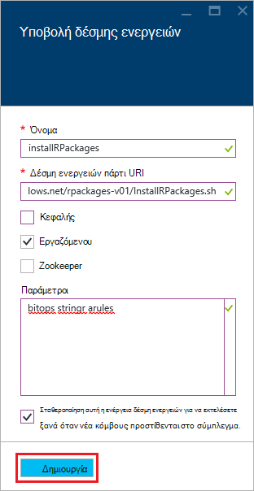

4. Επιλέξτε __Δημιουργία__ για να εκτελέσετε τη δέσμη ενεργειών. Μόλις ολοκληρωθεί η δέσμη ενεργειών, θα είναι διαθέσιμο σε όλους τους κόμβους εργαζόμενου τα πακέτα R.
    
## Επόμενα βήματα

Τώρα που γνωρίζετε τον τρόπο για να δημιουργήσετε ένα νέο σύμπλεγμα HDInsight που περιλαμβάνει το διακομιστή R και τα βασικά στοιχεία της χρήσης της κονσόλας R από μια περίοδο λειτουργίας SSH, χρησιμοποιήστε τα ακόλουθα για να ανακαλύψετε άλλοι τρόποι εργασίας με R διακομιστή στο HDInsight.

- [Προσθέστε το διακομιστή RStudio HDInsight premium](hdinsight-hadoop-r-server-install-r-studio.md)

- [Τον υπολογισμό επιλογές περιβάλλοντος του διακομιστή R σε HDInsight premium](hdinsight-hadoop-r-server-compute-contexts.md)

- [Azure επιλογές αποθήκευσης του διακομιστή R σε HDInsight premium](hdinsight-hadoop-r-server-storage.md)

### Azure πρότυπα διαχείρισης πόρων

Εάν σας ενδιαφέρει αυτοματοποίηση της δημιουργίας R διακομιστή στο με τη χρήση προτύπων από διαχειριστή πόρων Azure HDInsight, ανατρέξτε στο παρακάτω παράδειγμα προτύπων.

* [Δημιουργήστε ένα διακομιστή R σε σύμπλεγμα HDInsight χρησιμοποιώντας μια SSH δημόσιο κλειδί](http://go.microsoft.com/fwlink/p/?LinkID=780809)
* [Δημιουργήστε ένα διακομιστή R σε σύμπλεγμα HDInsight χρησιμοποιώντας έναν κωδικό πρόσβασης SSH](http://go.microsoft.com/fwlink/p/?LinkID=780810)

Και τα δύο πρότυπα Δημιουργήστε ένα νέο σύμπλεγμα HDInsight και λογαριασμού συσχετισμένη χώρου αποθήκευσης και μπορούν να χρησιμοποιηθούν από το Azure CLI, Azure PowerShell ή την πύλη Azure.

Για γενικές πληροφορίες σχετικά με τη χρήση προτύπων από διαχειριστή πόρων Azure, ανατρέξτε στο θέμα [Δημιουργία Linux βάσει Hadoop συμπλεγμάτων σε με τη χρήση προτύπων από διαχειριστή πόρων Azure HDInsight](hdinsight-hadoop-create-linux-clusters-arm-templates.md).
