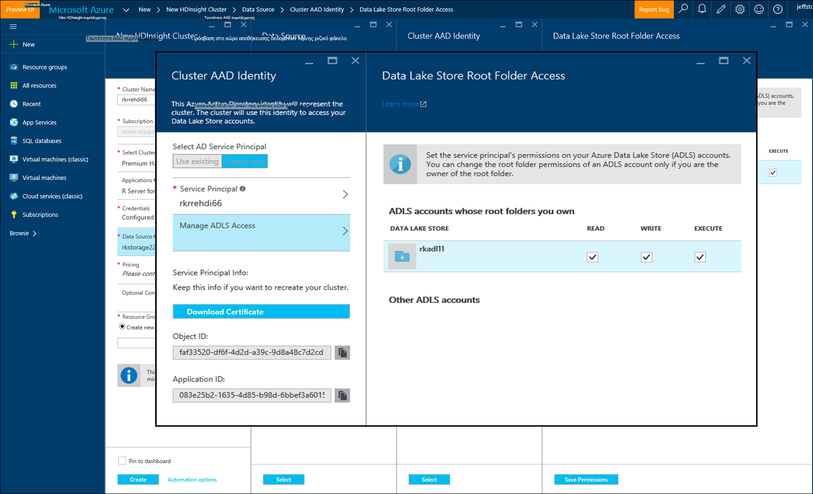

<properties
   pageTitle="Azure επιλογές αποθήκευσης του διακομιστή R σε HDInsight (έκδοση preview) | Microsoft Azure"
   description="Μάθετε περισσότερα σχετικά με τις επιλογές διαφορετικό χώρο αποθήκευσης που είναι διαθέσιμες σε χρήστες με το διακομιστή R στην HDInsight (έκδοση preview)"
   services="HDInsight"
   documentationCenter=""
   authors="jeffstokes72"
   manager="jhubbard"
   editor="cgronlun"
/>

<tags
   ms.service="HDInsight"
   ms.devlang="R"
   ms.topic="article"
   ms.tgt_pltfrm="na"
   ms.workload="data-services"
   ms.date="09/01/2016"
   ms.author="jeffstok"
/>

# <a name="azure-storage-options-for-r-server-on-hdinsight-preview"></a>Azure επιλογές αποθήκευσης του διακομιστή R σε HDInsight (έκδοση preview)

Microsoft R διακομιστή στο HDInsight (έκδοση preview) έχει πρόσβαση σε δύο αντικειμένων Blob του Azure και [Αποθήκευσης λίμνης Azure δεδομένων](https://azure.microsoft.com/services/data-lake-store/), ως μέσο διατήρηση δεδομένων, τον κωδικό, αντικείμενα από ανάλυσης έχει ως αποτέλεσμα και ούτω καθεξής.

Όταν δημιουργείτε ένα σύμπλεγμα Hadoop στο HDInsight, μπορείτε να καθορίσετε ένα λογαριασμό Azure χώρου αποθήκευσης. Ένα συγκεκριμένο κοντέινερ χώρου αποθήκευσης αντικειμένων Blob από αυτόν το λογαριασμό διατηρείται το σύστημα αρχείων για το σύμπλεγμα δημιουργείτε (για παράδειγμα, το κατανεμημένο σύστημα αρχείων Hadoop). Για σκοπούς επιδόσεων, το σύμπλεγμα HDInsight δημιουργείται στο ίδιο κέντρο δεδομένων με το λογαριασμό πρωτεύοντος χώρου αποθήκευσης που καθορίζετε. Για περισσότερες πληροφορίες, ανατρέξτε στο θέμα [χώρος αποθήκευσης αντικειμένων Blob χρήση Azure HDInsight με το](hdinsight-hadoop-use-blob-storage.md "χώρο αποθήκευσης αντικειμένων Blob του Azure χρήση με το HDInsight").   


## <a name="use-multiple-azure-blob-storage-accounts"></a>Χρησιμοποιήστε πολλούς λογαριασμούς χώρο αποθήκευσης αντικειμένων Blob του Azure

Εάν είναι απαραίτητο, μπορείτε να αποκτήσετε πρόσβαση πολλών λογαριασμών Azure χώρου αποθήκευσης ή κοντέινερ με το σύμπλεγμά σας HDI. Για να γίνει αυτό, πρέπει να καθορίσετε τους λογαριασμούς επιπλέον χώρο αποθήκευσης το περιβάλλον εργασίας χρήστη, όταν δημιουργείτε το σύμπλεγμα και, στη συνέχεια, ακολουθήστε τα παρακάτω βήματα για να τις χρησιμοποιήσετε σε R.  

1.  Δημιουργήστε ένα σύμπλεγμα HDInsight με ένα όνομα λογαριασμού χώρου αποθήκευσης των **storage1** και ένα προεπιλεγμένο κοντέινερ που ονομάζεται **container1**.
2. Καθορίστε έναν λογαριασμό επιπλέον χώρο αποθήκευσης που ονομάζεται **storage2**.  
3. Αντιγράψτε το αρχείο mycsv.csv στον κατάλογο /share και εκτέλεση ανάλυσης σε αυτό το αρχείο.  

    ````
    hadoop fs –mkdir /share
    hadoop fs –copyFromLocal myscsv.scv /share  
    ````

3.  Στον κώδικα R, ορίστε τον κόμβο όνομα προεπιλεγμένη **,** και ορίστε σας κατάλογο και να επεξεργαστεί το αρχείο.  

    ````
    myNameNode <- "default"
    myPort <- 0
    ````

  Θέση των δεδομένων:  

    bigDataDirRoot <-"/ κοινή χρήση"  

  Ορισμός περιβάλλοντος υπολογισμού τους:

    mySparkCluster <-RxSpark(consoleOutput=TRUE)

  Ορισμός περιβάλλοντος υπολογισμού:

    rxSetComputeContext(mySparkCluster)

  Ορισμός του συστήματος αρχείων συστήματος αρχείο κατανεμημένο Hadoop (HDFS):

    hdfsFS <-RxHdfsFileSystem (όνομα κεντρικού υπολογιστή = myNameNode, θύρα = myPort)

  Καθορίστε το αρχείο εισόδου για την ανάλυση σε HDFS:

    Αρχείο_εισόδου <-file.path(bigDataDirRoot,"mycsv.csv")

Όλες τις αναφορές καταλόγου και αρχείου οδηγεί στο λογαριασμό χώρου αποθήκευσης wasbs://container1@storage1.blob.core.windows.net. Αυτός είναι ο **προεπιλεγμένος χώρος αποθήκευσης λογαριασμός** που είναι συσχετισμένη με το σύμπλεγμα HDInsight.

Τώρα, ας υποθέσουμε ότι θέλετε να επεξεργαστείτε ένα αρχείο που ονομάζεται mySpecial.csv που βρίσκεται στο /private του καταλόγου της **container2** στο **storage2**.

Στον κώδικα R, τοποθετήστε το δείκτη στην αναφορά κόμβο ονόματος με το λογαριασμό χώρου αποθήκευσης **storage2** .

    myNameNode <- "wasbs://container2@storage2.blob.core.windows.net"
    myPort <- 0

  Θέση των δεδομένων:

    bigDataDirRoot <- "/private"

  Ορισμός περιβάλλοντος υπολογισμού τους:

    mySparkCluster <- RxSpark(consoleOutput=TRUE, nameNode=myNameNode, port=myPort)

  Ορισμός περιβάλλοντος υπολογισμού:

    rxSetComputeContext(mySparkCluster)

  Ορισμός HDFS αρχείο συστήματος:

    hdfsFS <- RxHdfsFileSystem(hostName=myNameNode, port=myPort)

  Καθορίστε το αρχείο εισόδου για την ανάλυση σε HDFS:

    inputFile <-file.path(bigDataDirRoot,"mySpecial.csv")

Οδηγήσουν όλες τις αναφορές κατάλογο και στο αρχείο με το λογαριασμό χώρου αποθήκευσης wasbs://container2@storage2.blob.core.windows.net. Αυτό είναι το **Όνομα κόμβου** που έχετε καθορίσει.

Σημειώστε ότι θα πρέπει να ρυθμίσετε τις παραμέτρους του/User/RevoShare/<SSH username> καταλόγου σε **storage2** ως εξής:

    hadoop fs -mkdir wasbs://container2@storage2.blob.core.windows.net/user
    hadoop fs -mkdir wasbs://container2@storage2.blob.core.windows.net/user/RevoShare
    hadoop fs -mkdir wasbs://container2@storage2.blob.core.windows.net/user/RevoShare/<RDP username>

## <a name="use-an-azure-data-lake-store"></a>Χρησιμοποιήστε ένα κατάστημα λίμνης δεδομένων Azure

Για να χρησιμοποιήσετε λίμνης δεδομένα αποθηκεύονται με το λογαριασμό σας HDInsight, πρέπει να εκχωρήσετε το πρόσβαση σύμπλεγμα σε κάθε χώρο αποθήκευσης Azure λίμνης δεδομένων που θέλετε να χρησιμοποιήσετε. Χρησιμοποιείτε το χώρο αποθήκευσης στη δέσμη ενεργειών R πολύ όπως χρησιμοποιείτε ένα λογαριασμό δευτερεύων χώρος αποθήκευσης (όπως περιγράφεται στην προηγούμενη διαδικασία).

## <a name="add-cluster-access-to-your-azure-data-lake-stores"></a>Προσθήκη σύμπλεγμα access αποθηκεύει το Azure λίμνης δεδομένων

Πρόσβαση σε ένα χώρο αποθήκευσης λίμνης δεδομένων, χρησιμοποιώντας ένα κεφάλαιο υπηρεσίας Azure Active Directory (Azure AD) που είναι συσχετισμένη με το σύμπλεγμά σας HDInsight.

### <a name="to-add-a-service-principal"></a>Για να προσθέσετε ένα κεφάλαιο υπηρεσίας
1. Όταν δημιουργείτε το σύμπλεγμά σας HDInsight, επιλέξτε **Σύμπλεγμα AAD ταυτότητας** από την καρτέλα **Προέλευση δεδομένων** .
2. Στο παράθυρο διαλόγου **Σύμπλεγμα AAD ταυτότητα** , στην περιοχή **Επιλέξτε κεφάλαιο υπηρεσιών AD**, επιλέξτε **Δημιουργία νέου**.

Αφού ονομάστε το κεφάλαιο υπηρεσίας και δημιουργήστε έναν κωδικό πρόσβασης για αυτό, ανοίγει μια νέα καρτέλα όπου μπορείτε να συσχετίσετε το κεφάλαιο υπηρεσίας με σας αποθηκεύει λίμνης δεδομένων.

Σημειώστε ότι μπορείτε επίσης να προσθέσετε πρόσβαση σε ένα χώρο αποθήκευσης δεδομένων λίμνης αργότερα, ανοίγοντας το χώρο αποθήκευσης λίμνης δεδομένων στην πύλη του Azure και μεταβαίνοντας στην **Εξερεύνηση δεδομένων** > **Access**.  Ακολουθεί ένα παράδειγμα της ένα παράθυρο διαλόγου που δείχνει πώς μπορείτε να δημιουργήσετε ένα κεφάλαιο υπηρεσίας και να συσχετίσετε με το χώρο αποθήκευσης δεδομένων λίμνης "rkadl11".




## <a name="use-the-data-lake-store-with-r-server"></a>Χρήση του χώρου αποθήκευσης δεδομένων λίμνης με το διακομιστή R
Όταν δώσετε πρόσβαση σε ένα χώρο αποθήκευσης λίμνης δεδομένων, μπορείτε να χρησιμοποιήσετε το χώρο αποθήκευσης στο διακομιστή R στην HDInsight με τον τρόπο που θα κάνατε με ένα λογαριασμό δευτερεύοντα Azure χώρου αποθήκευσης. Η μόνη διαφορά είναι ότι το πρόθεμα **wasb: / /** αλλάζει σε **adl: / /** ως εξής:

````
# Point to the ADL store (e.g. ADLtest)
myNameNode <- "adl://rkadl1.azuredatalakestore.net"
myPort <- 0

# Location of the data (assumes a /share directory on the ADL account)
bigDataDirRoot <- "/share"  

# Define Spark compute context
mySparkCluster <- RxSpark(consoleOutput=TRUE, nameNode=myNameNode, port=myPort)

# Set compute context
rxSetComputeContext(mySparkCluster)

# Define HDFS file system
hdfsFS <- RxHdfsFileSystem(hostName=myNameNode, port=myPort)

# Specify the input file in HDFS to analyze
inputFile <-file.path(bigDataDirRoot,"AirlineDemoSmall.csv")

# Create factors for days of the week
colInfo <- list(DayOfWeek = list(type = "factor",
               levels = c("Monday", "Tuesday", "Wednesday", "Thursday",
                          "Friday", "Saturday", "Sunday")))

# Define the data source
airDS <- RxTextData(file = inputFile, missingValueString = "M",
                    colInfo  = colInfo, fileSystem = hdfsFS)

# Run a linear regression
model <- rxLinMod(ArrDelay~CRSDepTime+DayOfWeek, data = airDS)
````

Ακολουθούν οι εντολές που χρησιμοποιούνται για να ρυθμίσετε το λογαριασμό χώρου αποθήκευσης δεδομένων λίμνης με τον κατάλογο RevoShare και να προσθέσετε το δείγμα αρχείου .csv από το προηγούμενο παράδειγμα:

````
hadoop fs -mkdir adl://rkadl1.azuredatalakestore.net/user
hadoop fs -mkdir adl://rkadl1.azuredatalakestore.net/user/RevoShare
hadoop fs -mkdir adl://rkadl1.azuredatalakestore.net/user/RevoShare/<user>

hadoop fs -mkdir adl://rkadl1.azuredatalakestore.net/share

hadoop fs -copyFromLocal /usr/lib64/R Server-7.4.1/library/RevoScaleR/SampleData/AirlineDemoSmall.csv adl://rkadl1.azuredatalakestore.net/share

hadoop fs –ls adl://rkadl1.azuredatalakestore.net/share
````

## <a name="use-azure-files-on-the-edge-node"></a>Χρήση αρχείων Azure στον κόμβο άκρου

Υπάρχει επίσης μια επιλογή αποθήκευσης εύκολη δεδομένων για χρήση στον κόμβο άκρο που ονομάζεται [Αρχεία Azure](../storage/storage-how-to-use-files-linux.md "Azure αρχεία"). Σας επιτρέπει να ενεργοποίησης ένα κοινόχρηστο αρχείο αποθήκευσης Azure στο σύστημα αρχείων Linux. Αυτό μπορεί να είναι χρήσιμες για την αποθήκευση αρχείων δεδομένων, R δέσμες ενεργειών και αποτέλεσμα αντικείμενα που μπορεί να χρειαστεί αργότερα πότε έχει νόημα να χρησιμοποιήσετε το σύστημα αρχείων εγγενούς σε την άκρη κόμβο αντί για HDFS.

Κύρια όφελος των αρχείων Azure είναι ότι τα κοινόχρηστα στοιχεία αρχείων μπορεί να είναι τοποθετηθεί και να χρησιμοποιούνται από οποιοδήποτε σύστημα που έχει μια υποστηριζόμενα λειτουργικά συστήματα, όπως το Windows ή Linux. Για παράδειγμα, μπορεί να χρησιμοποιηθεί από άλλο σύμπλεγμα HDInsight που εσείς ή κάποιος από την ομάδα σας έχει, από μια Εικονική Azure ή ακόμη και από ένα σύστημα εσωτερικής εγκατάστασης.


## <a name="next-steps"></a>Επόμενα βήματα

Τώρα που γνωρίζετε τα βασικά στοιχεία για τον τρόπο χρήσης της κονσόλας R από μια περίοδο λειτουργίας SSH και πώς μπορείτε να δημιουργήσετε ένα νέο σύμπλεγμα HDInsight που περιλαμβάνει R διακομιστή, χρησιμοποιήστε τις παρακάτω συνδέσεις για να ανακαλύψετε άλλοι τρόποι εργασίας με R διακομιστή στο HDInsight.

- [Επισκόπηση των R διακομιστή στο HDInsight](hdinsight-hadoop-r-server-overview.md)
- [Γρήγορα αποτελέσματα με το διακομιστή R στο Hadoop](hdinsight-hadoop-r-server-get-started.md)
- [Προσθέστε το διακομιστή RStudio HDInsight premium](hdinsight-hadoop-r-server-install-r-studio.md)
- [Τον υπολογισμό επιλογές περιβάλλοντος του διακομιστή R σε HDInsight](hdinsight-hadoop-r-server-compute-contexts.md)
