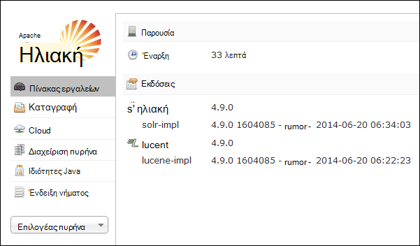
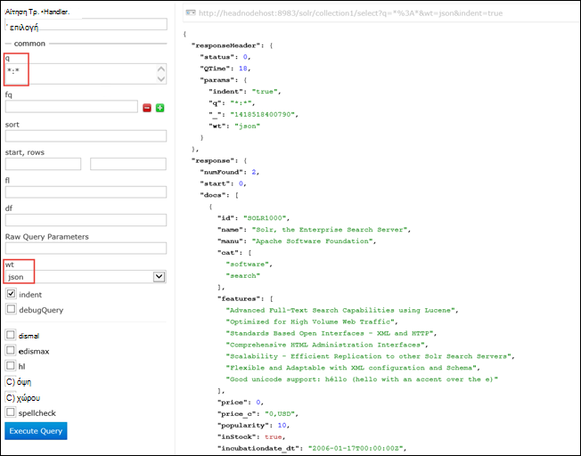

<properties
    pageTitle="Χρησιμοποιήστε την ενέργεια δέσμη ενεργειών για την εγκατάσταση Solr σε βάσει Linux HDInsight | Microsoft Azure"
    description="Μάθετε πώς μπορείτε να εγκαταστήσετε το Solr σε συμπλεγμάτων βάσει Linux HDInsight Hadoop χρήση δέσμης ενεργειών."
    services="hdinsight"
    documentationCenter=""
    authors="Blackmist"
    manager="jhubbard"
    editor="cgronlun"
    tags="azure-portal"/>

<tags
    ms.service="hdinsight"
    ms.workload="big-data"
    ms.tgt_pltfrm="na"
    ms.devlang="na"
    ms.topic="article"
    ms.date="10/03/2016"
    ms.author="larryfr"/>

# Εγκατάσταση και χρήση Solr στον HDInsight Hadoop συμπλεγμάτων

Σε αυτό το θέμα, θα μάθετε πώς να εγκαταστήσετε Solr σε Azure HDInsight με χρήση δέσμης ενεργειών. Solr είναι μια πλατφόρμα ισχυρή αναζήτησης και παρέχει δυνατότητες αναζήτησης εταιρικό επίπεδο δεδομένων που ελέγχονται από Hadoop. Αφού έχετε εγκαταστήσει Solr σε σύμπλεγμα HDInsight, επίσης θα μάθετε πώς μπορείτε να πραγματοποιήσετε αναζήτηση δεδομένων χρησιμοποιώντας Solr.

> [AZURE.NOTE] Τα βήματα σε αυτό το έγγραφο απαιτεί ένα σύμπλεγμα βάσει Linux HDInsight. Για πληροφορίες σχετικά με τη χρήση Solr με ένα σύμπλεγμα που βασίζεται στα Windows, ανατρέξτε στο θέμα [εγκατάσταση και Solr σε HDinsight Hadoop συμπλεγμάτων (Windows)](hdinsight-hadoop-solr-install.md)

Το δείγμα δέσμης ενεργειών που χρησιμοποιούνται σε αυτό το θέμα δημιουργεί ένα σύμπλεγμα Solr με μια συγκεκριμένη ρύθμιση παραμέτρων. Εάν θέλετε να ρυθμίσετε τις παραμέτρους του συμπλέγματος Solr με διαφορετικές συλλογές, shards, σχήματα, αντίγραφα, κ.λπ., πρέπει να τροποποιείτε τη δέσμη ενεργειών και δυαδικών αρχείων Solr αντίστοιχα.

## Τι είναι το Solr;

[Apache Solr](http://lucene.apache.org/solr/features.html) είναι μια πλατφόρμα αναζήτησης για μεγάλες επιχειρήσεις που επιτρέπει ισχυρή αναζήτησης πλήρους κειμένου στα δεδομένα. Ενώ Hadoop επιτρέπει την αποθήκευση και τη Διαχείριση τεράστιες ποσότητες δεδομένων, Apache Solr παρέχει τις δυνατότητες αναζήτησης για να ανακτήσετε γρήγορα τα δεδομένα. Αυτό το θέμα παρέχει οδηγίες σχετικά με τον τρόπο για να προσαρμόσετε ένα σύμπλεγμα HDInsight για να εγκαταστήσετε το Solr.

> [AZURE.WARNING] Στοιχεία που παρέχονται με το σύμπλεγμα HDInsight υποστηρίζονται πλήρως και υποστήριξη της Microsoft θα σας βοηθήσει να απομονώσετε και να επιλύσετε θέματα που σχετίζονται με αυτά τα στοιχεία.
>
> Προσαρμοσμένα στοιχεία, όπως Solr, λαμβάνετε εμπορικά λογικές υποστήριξη για να σας βοηθήσει να αντιμετωπίσετε περαιτέρω το ζήτημα. Αυτό μπορεί να έχει ως αποτέλεσμα το ζήτημα επίλυση ή που σας ζητά να συμμετάσχουν διαθέσιμα κανάλια για τις τεχνολογίες Άνοιγμα αρχείου προέλευσης όπου βρίσκονται πολλά επίπεδα εξειδίκευση για συγκεκριμένη τεχνολογία. Για παράδειγμα, υπάρχουν πολλές τοποθεσίες Κοινότητας που μπορούν να χρησιμοποιηθούν, όπως: [φόρουμ MSDN για το HDInsight](https://social.msdn.microsoft.com/Forums/azure/en-US/home?forum=hdinsight), [http://stackoverflow.com](http://stackoverflow.com). Επίσης, Apache έργα έχουν τοποθεσίες έργου στο [http://apache.org](http://apache.org), για παράδειγμα: [Hadoop](http://hadoop.apache.org/).

## Τι κάνει η δέσμη ενεργειών

Αυτή η δέσμη ενεργειών πραγματοποιεί τις ακόλουθες αλλαγές στο σύμπλεγμα HDInsight:

* Εγκαταστάσεις Solr σε`/usr/hdp/current/solr`
* Δημιουργεί έναν νέο χρήστη, __solrusr__, που χρησιμοποιείται για την εκτέλεση της υπηρεσίας Solr
* Ρυθμίζει __solruser__ με τον κάτοχο του`/usr/hdp/current/solr`
* Προσθέτει μια ρύθμιση παραμέτρων [Upstart](http://upstart.ubuntu.com/) που θα ξεκινήσει Solr εάν έναν κόμβο συμπλέγματος επανεκκίνηση του. Solr ξεκινήσει αυτόματα σε τους κόμβους συμπλέγματος μετά την εγκατάσταση

## Εγκατάσταση Solr χρήση δέσμης ενεργειών

Ένα δείγμα δέσμης ενεργειών για την εγκατάσταση Solr σε ένα σύμπλεγμα HDInsight είναι διαθέσιμη στην ακόλουθη θέση.

    https://hdiconfigactions.blob.core.windows.net/linuxsolrconfigactionv01/solr-installer-v01.sh

Αυτή η ενότητα παρέχει οδηγίες σχετικά με τη χρήση του δείγματος δέσμης ενεργειών όταν δημιουργείτε ένα νέο σύμπλεγμα χρησιμοποιώντας την πύλη του Azure. 

> [AZURE.NOTE] Azure PowerShell, την CLI Azure, το HDInsight .NET SDK ή πρότυπα διαχείρισης πόρων Azure επίσης μπορεί να χρησιμοποιηθεί για την εφαρμογή δέσμης ενεργειών. Μπορείτε επίσης να εφαρμόσετε ενέργειες δέσμης ενεργειών για να εκτελείται ήδη συμπλεγμάτων. Για περισσότερες πληροφορίες, ανατρέξτε στο θέμα [Προσαρμογή HDInsight συμπλεγμάτων ενέργειες δέσμης ενεργειών](hdinsight-hadoop-customize-cluster-linux.md).

1. Έναρξη προμήθειας ένα σύμπλεγμα, χρησιμοποιώντας τα βήματα που περιγράφονται σε [συμπλεγμάτων βάσει Linux παροχή HDInsight](hdinsight-hadoop-create-linux-clusters-portal.md), αλλά δεν ολοκληρώθηκε προμήθειας.

2. Στην blade την **Προαιρετική ρύθμιση παραμέτρων** , επιλέξτε **Ενέργειες δέσμης ενεργειών**και δώστε τις παρακάτω πληροφορίες:

    * __ΌΝΟΜΑ__: Πληκτρολογήστε ένα φιλικό όνομα για την ενέργεια δέσμης ενεργειών.
    * __Δέσμη ΕΝΕΡΓΕΙΏΝ URI__: https://hdiconfigactions.blob.core.windows.net/linuxsolrconfigactionv01/solr-installer-v01.sh
    * __ΠΡΟΪΣΤΆΜΕΝΟΣ__: Ενεργοποιήστε αυτή την επιλογή
    * __ΕΡΓΑΖΌΜΕΝΟΥ__: Ενεργοποιήστε αυτή την επιλογή
    * __ZOOKEEPER__: Χρησιμοποιήστε αυτήν την επιλογή για να εγκαταστήσετε στον κόμβο Zookeeper
    * __ΠΑΡΆΜΕΤΡΟΙ__: Αφήστε κενό αυτό το πεδίο

3. Στο κάτω από τις **Ενέργειες δέσμης ενεργειών**, χρησιμοποιήστε το κουμπί **επιλογή** για να αποθηκεύσετε τη ρύθμιση παραμέτρων. Τέλος, χρησιμοποιήστε το κουμπί **επιλογή** στο κάτω μέρος του blade **Προαιρετική ρύθμιση παραμέτρων** για να αποθηκεύσετε τις πληροφορίες προαιρετικών παραμέτρων.

4. Συνεχίστε την προμήθεια του συμπλέγματος, όπως περιγράφεται στο [συμπλεγμάτων βάσει Linux παροχή HDInsight](hdinsight-hadoop-create-linux-clusters-portal.md).

## Πώς χρησιμοποιώ Solr στο HDInsight;

### Δημιουργία ευρετηρίου δεδομένων

Πρέπει να ξεκινήσετε με τη δημιουργία ευρετηρίου Solr με ορισμένα αρχεία δεδομένων. Στη συνέχεια, μπορείτε να χρησιμοποιήσετε Solr για να εκτελέσετε ερωτήματα αναζήτησης στα δεδομένα με ευρετήριο. Χρησιμοποιήστε τα παρακάτω βήματα για να προσθέσετε ορισμένα δεδομένα του παραδείγματος Solr και, στη συνέχεια, το ερώτημα:

1. Συνδεθείτε με το σύμπλεγμα HDInsight χρησιμοποιώντας SSH:

        ssh USERNAME@CLUSTERNAME-ssh.azurehdinsight.net

    Για περισσότερες πληροφορίες σχετικά με τη χρήση SSH με το HDInsight, ανατρέξτε στα παρακάτω:

    * [Χρήση SSH με βάσει Linux Hadoop σε HDInsight από Linux, Unix ή λειτουργικό σύστημα OS X](hdinsight-hadoop-linux-use-ssh-unix.md)

    * [Χρήση SSH με βάσει Linux Hadoop σε HDInsight από το Windows](hdinsight-hadoop-linux-use-ssh-windows.md)

    > [AZURE.IMPORTANT] Βήματα αργότερα στο έγγραφο κάντε χρήση των διοχέτευση SSL για να συνδεθείτε με το web Solr περιβάλλοντος εργασίας Χρήστη. Για να χρησιμοποιήσετε αυτά τα βήματα, πρέπει να επιτύχετε διοχέτευση SSL και, στη συνέχεια, ρύθμιση παραμέτρων του προγράμματος περιήγησης για να το χρησιμοποιήσετε.
    >
    > Για περισσότερες πληροφορίες, ανατρέξτε στο θέμα [Χρήση SSH διοχέτευση για πρόσβαση στο web Ambari περιβάλλοντος εργασίας Χρήστη, ResourceManager, JobHistory, NameNode, Oozie, και άλλη τοποθεσία web του περιβάλλοντος εργασίας Χρήστη](hdinsight-linux-ambari-ssh-tunnel.md)

2. Χρησιμοποιήστε τις παρακάτω εντολές για να έχετε Solr ευρετήριο δείγμα δεδομένων:

        cd /usr/hdp/current/solr/example/exampledocs
        java -jar post.jar solr.xml monitor.xml

    Θα δείτε το εξής αποτέλεσμα στην κονσόλα:

        POSTing file solr.xml
        POSTing file monitor.xml
        2 files indexed.
        COMMITting Solr index changes to http://localhost:8983/solr/update..
        Time spent: 0:00:01.624

    Το βοηθητικό πρόγραμμα post.jar ευρετήρια Solr με δύο δειγμάτων έγγραφα, **solr.xml** και **monitor.xml**. Αυτά θα είναι αποθηκευμένα στις __collection1__ μέσα σε Solr.

3. Χρησιμοποιήστε το ακόλουθο ερώτημα για το REST API που εκτίθεται από Solr:

        curl "http://localhost:8983/solr/collection1/select?q=*%3A*&wt=json&indent=true"

    Αυτό ζητήματα ένα ερώτημα προς __collection1__ για όλα τα έγγραφα που ταιριάζουν με __ \*:\* __ (κωδικοποιηθεί ως \*3α %\* στη συμβολοσειρά ερωτήματος,) και που πρέπει να επιστραφεί η απόκριση ως JSON. Η απόκριση πρέπει να είναι παρόμοια με το εξής:

            "response": {
                "numFound": 2,
                "start": 0,
                "maxScore": 1,
                "docs": [
                  {
                    "id": "SOLR1000",
                    "name": "Solr, the Enterprise Search Server",
                    "manu": "Apache Software Foundation",
                    "cat": [
                      "software",
                      "search"
                    ],
                    "features": [
                      "Advanced Full-Text Search Capabilities using Lucene",
                      "Optimized for High Volume Web Traffic",
                      "Standards Based Open Interfaces - XML and HTTP",
                      "Comprehensive HTML Administration Interfaces",
                      "Scalability - Efficient Replication to other Solr Search Servers",
                      "Flexible and Adaptable with XML configuration and Schema",
                      "Good unicode support: héllo (hello with an accent over the e)"
                    ],
                    "price": 0,
                    "price_c": "0,USD",
                    "popularity": 10,
                    "inStock": true,
                    "incubationdate_dt": "2006-01-17T00:00:00Z",
                    "_version_": 1486960636996878300
                  },
                  {
                    "id": "3007WFP",
                    "name": "Dell Widescreen UltraSharp 3007WFP",
                    "manu": "Dell, Inc.",
                    "manu_id_s": "dell",
                    "cat": [
                      "electronics and computer1"
                    ],
                    "features": [
                      "30\" TFT active matrix LCD, 2560 x 1600, .25mm dot pitch, 700:1 contrast"
                    ],
                    "includes": "USB cable",
                    "weight": 401.6,
                    "price": 2199,
                    "price_c": "2199,USD",
                    "popularity": 6,
                    "inStock": true,
                    "store": "43.17614,-90.57341",
                    "_version_": 1486960637584081000
                  }
                ]
              }

### Χρήση του πίνακα εργαλείων Solr

Πίνακας εργαλείων Solr είναι web περιβάλλοντος εργασίας Χρήστη που σας επιτρέπει να εργάζεστε με Solr μέσω του προγράμματος περιήγησης web. Πίνακας εργαλείων Solr δεν εκτίθεται απευθείας στο Internet από το σύμπλεγμά σας HDInsight, αλλά πρέπει να είναι δυνατή η πρόσβαση χρησιμοποιώντας μια διοχέτευση SSH. Για περισσότερες πληροφορίες σχετικά με τη χρήση διοχέτευση SSH, ανατρέξτε στο θέμα [Χρήση SSH διοχέτευση για πρόσβαση στο web Ambari περιβάλλοντος εργασίας Χρήστη, ResourceManager, JobHistory, NameNode, Oozie, και άλλη τοποθεσία web του περιβάλλοντος εργασίας Χρήστη](hdinsight-linux-ambari-ssh-tunnel.md)

Αφού έχετε δημιουργήσει μια διοχέτευση SSH, χρησιμοποιήστε τα ακόλουθα βήματα για να χρησιμοποιήσετε τον πίνακα εργαλείων Solr:

1. Καθορίστε το όνομα κεντρικού υπολογιστή για το πρωτεύον headnode:

    1. Χρησιμοποιήστε SSH για να συνδεθείτε με το σύμπλεγμα στη θύρα 22. Για παράδειγμα, `ssh USERNAME@CLUSTERNAME-ssh.azurehdinsight.net` όπου __ΌΝΟΜΑ_ΧΡΉΣΤΗ__ είναι το όνομα χρήστη σας SSH και __CLUSTERNAME__ είναι το όνομα του συμπλέγματος.

        Για περισσότερες πληροφορίες σχετικά με τη χρήση SSH, δείτε τα ακόλουθα έγγραφα:

        * [Χρήση SSH με βάσει Linux HDInsight από ένα πρόγραμμα-πελάτη Linux, Unix ή το Mac OS X](hdinsight-hadoop-linux-use-ssh-unix.md)

        * [Χρήση SSH με βάσει Linux HDInsight από ένα πρόγραμμα-πελάτη των Windows](hdinsight-hadoop-linux-use-ssh-windows.md)
    
    3. Χρησιμοποιήστε την ακόλουθη εντολή για να λάβετε το πλήρως προσδιορισμένο όνομα κεντρικού υπολογιστή:

            hostname -f

        Αυτό θα επιστρέψει ένα όνομα παρόμοιο με το εξής:

            hn0-myhdi-nfebtpfdv1nubcidphpap2eq2b.ex.internal.cloudapp.net
    
        Αυτό είναι το όνομα κεντρικού υπολογιστή που πρέπει να χρησιμοποιούνται τα παρακάτω βήματα.
    
1. Στο πρόγραμμα περιήγησης, σύνδεση με __http://HOSTNAME:8983/solr #/__, όπου __όνομα κεντρικού ΥΠΟΛΟΓΙΣΤΉ__ είναι το όνομα που καθορίζεται στα προηγούμενα βήματα. 

    Η αίτηση πρέπει να δρομολογούνται μέσω της διοχέτευσης SSH στον κόμβο κεφαλίδας για το σύμπλεγμα HDInsight. Θα πρέπει να δείτε μια σελίδα που είναι παρόμοιο με το εξής:

    

2. Από το αριστερό παράθυρο, χρησιμοποιήστε τον **Επιλογέα πυρήνα** αναπτυσσόμενη λίστα για να επιλέξετε **collection1**. Περισσότερες από μία εγγραφές θα πρέπει να τους εμφανίζεται κάτω από το __collection1__.

3. Από τις καταχωρήσεις κάτω από το στοιχείο __collection1__, επιλέξτε __ερώτημα__. Χρησιμοποιήστε τις παρακάτω τιμές για να συμπληρώσετε τη σελίδα αναζήτησης:

    * Στο πλαίσιο κειμένου **ερωτήσεις** , πληκτρολογήστε ** \*:**\*. Αυτό θα επιστρέψει όλα τα έγγραφα που έχουν καταχωρηθεί στο ευρετήριο στο Solr. Εάν θέλετε να πραγματοποιήσετε αναζήτηση για μια συγκεκριμένη συμβολοσειρά μέσα στα έγγραφα, μπορείτε να εισαγάγετε η συμβολοσειρά εδώ.

    * Στο πλαίσιο κειμένου **wt** , επιλέξτε τη μορφή εξόδου. Η προεπιλογή είναι **json**.

    Τέλος, επιλέξτε το κουμπί **Εκτέλεση ερωτήματος** στο κάτω μέρος του pate αναζήτησης.

    

    Το αποτέλεσμα εμφανίζει τα δύο έγγραφα που θα σας χρησιμοποιούνται για τη δημιουργία ευρετηρίου Solr. Το αποτέλεσμα μοιάζει με το εξής:

            "response": {
                "numFound": 2,
                "start": 0,
                "maxScore": 1,
                "docs": [
                  {
                    "id": "SOLR1000",
                    "name": "Solr, the Enterprise Search Server",
                    "manu": "Apache Software Foundation",
                    "cat": [
                      "software",
                      "search"
                    ],
                    "features": [
                      "Advanced Full-Text Search Capabilities using Lucene",
                      "Optimized for High Volume Web Traffic",
                      "Standards Based Open Interfaces - XML and HTTP",
                      "Comprehensive HTML Administration Interfaces",
                      "Scalability - Efficient Replication to other Solr Search Servers",
                      "Flexible and Adaptable with XML configuration and Schema",
                      "Good unicode support: héllo (hello with an accent over the e)"
                    ],
                    "price": 0,
                    "price_c": "0,USD",
                    "popularity": 10,
                    "inStock": true,
                    "incubationdate_dt": "2006-01-17T00:00:00Z",
                    "_version_": 1486960636996878300
                  },
                  {
                    "id": "3007WFP",
                    "name": "Dell Widescreen UltraSharp 3007WFP",
                    "manu": "Dell, Inc.",
                    "manu_id_s": "dell",
                    "cat": [
                      "electronics and computer1"
                    ],
                    "features": [
                      "30\" TFT active matrix LCD, 2560 x 1600, .25mm dot pitch, 700:1 contrast"
                    ],
                    "includes": "USB cable",
                    "weight": 401.6,
                    "price": 2199,
                    "price_c": "2199,USD",
                    "popularity": 6,
                    "inStock": true,
                    "store": "43.17614,-90.57341",
                    "_version_": 1486960637584081000
                  }
                ]
              }

### Έναρξη και διακοπή Solr

Εάν θέλετε να διακόψετε ή να ξεκινήσετε Ηλιακοί με μη αυτόματο τρόπο, χρησιμοποιήστε τις παρακάτω εντολές:

    sudo stop solr

    sudo start solr

## Δεδομένα αντιγράφου ασφαλείας με ευρετήριο

Ως καλή πρακτική, πρέπει να δημιουργήσετε αντίγραφα ασφαλείας των δεδομένων με ευρετήριο από τους κόμβους συμπλέγματος Solr στο χώρο αποθήκευσης αντικειμένων Blob του Azure. Ακολουθήστε τα παρακάτω βήματα για να το κάνετε:

1. Συνδεθείτε με το σύμπλεγμα χρησιμοποιώντας SSH και, στη συνέχεια, χρησιμοποιήστε την ακόλουθη εντολή για να λάβετε το όνομα κεντρικού υπολογιστή για τον κόμβο κεφαλίδας:

        hostname -f
        
2. Χρησιμοποιήστε τα ακόλουθα για να δημιουργήσετε ένα στιγμιότυπο των δεδομένων με ευρετήριο. Αντικαταστήστε το __όνομα κεντρικού ΥΠΟΛΟΓΙΣΤΉ__ με το όνομα που επιστρέφεται από την προηγούμενη εντολή:

        curl http://HOSTNAME:8983/solr/replication?command=backup

    Θα πρέπει να δείτε μια απάντηση ως εξής:

        <?xml version="1.0" encoding="UTF-8"?>
        <response>
          <lst name="responseHeader">
            <int name="status">0</int>
            <int name="QTime">9</int>
          </lst>
          <str name="status">OK</str>
        </response>

2. Στη συνέχεια, αλλάξτε τον κατάλογο __/usr/hdp/current/solr/example/solr__. Θα δείτε ένα δευτερεύοντα κατάλογο για κάθε συλλογή. Κάθε κατάλογος συλλογής περιέχει έναν κατάλογο __δεδομένων__ , η οποία είναι πού βρίσκεται το στιγμιότυπο για αυτήν τη συλλογή βρίσκεται.

    Για παράδειγμα, εάν χρησιμοποιήσατε προηγουμένως τα βήματα για να δημιουργήσετε ευρετήριο δείγματα εγγράφων, στον κατάλογο __/usr/hdp/current/solr/example/solr/collection1/data__ θα πρέπει τώρα να περιέχει έναν κατάλογο με όνομα __στιγμιότυπο. ###__ όπου το # 's είναι την ημερομηνία και την ώρα της το στιγμιότυπο.

3. Δημιουργήστε μια αρχειοθήκη συμπιεσμένη του φακέλου στιγμιότυπο χρησιμοποιώντας μια εντολή παρόμοια με τα εξής:

        tar -zcf snapshot.20150806185338855.tgz snapshot.20150806185338855

    Αυτό θα δημιουργήσει μια νέα αρχειοθήκη με το όνομα __snapshot.20150806185338855.tgz__, που περιέχει τα περιεχόμενα του καταλόγου __snapshot.20150806185338855__ .

3. Στη συνέχεια, μπορείτε να αποθηκεύσετε την αρχειοθέτηση για το σύμπλεγμα πρωτεύοντος αποθήκευσης χρησιμοποιώντας την ακόλουθη εντολή:

    hadoop - copyFromLocal fs snapshot.20150806185338855.tgz/παράδειγμα/δεδομένων

    > [AZURE.NOTE] Ενδέχεται να θέλετε να δημιουργήσετε μια αποκλειστική καταλόγου για την αποθήκευση των στιγμιοτύπων Solr. Για παράδειγμα, `hadoop fs -mkdir /solrbackup`.

Για περισσότερες πληροφορίες σχετικά με την εργασία με Solr δημιουργίας αντιγράφων ασφαλείας και επαναφορά, ανατρέξτε στο θέμα [Δημιουργία και επαναφορά αντιγράφων ασφαλείας των SolrCores](https://cwiki.apache.org/confluence/display/solr/Making+and+Restoring+Backups+of+SolrCores).

## Δείτε επίσης

- [Εγκατάσταση και χρήση συμπλεγμάτων απόχρωση σε HDInsight](hdinsight-hadoop-hue-linux.md). Απόχρωση είναι ένα περιβάλλον εργασίας Χρήστη που σας διευκολύνουν να δημιουργήσετε, να εκτελέσετε και αποθήκευση γουρούνι και ομάδα εργασίες, καθώς και αναζήτηση το προεπιλεγμένο αποθήκευσης για το HDInsight συμπλέγματος web.

- [Εγκατάσταση R σε συμπλεγμάτων HDInsight][hdinsight-install-r]. Χρησιμοποιήστε σύμπλεγμα προσαρμογής για να εγκαταστήσετε R σε συμπλεγμάτων HDInsight Hadoop. R είναι μια γλώσσα προέλευσης άνοιγμα και περιβάλλον για τον υπολογισμό στατιστικών. Παρέχει εκατοντάδες ενσωματωμένη στατιστικές συναρτήσεις και δικό του γλώσσα προγραμματισμού που συνδυάζει πτυχές προγραμματισμού λειτουργική και προσανατολισμένα σε αντικείμενα. Επίσης, παρέχει εκτεταμένη δυνατότητες γραφικών.

- [Εγκατάσταση Giraph στην συμπλεγμάτων HDInsight](hdinsight-hadoop-giraph-install-linux.md). Χρησιμοποιήστε σύμπλεγμα προσαρμογής για να εγκαταστήσετε Giraph σε συμπλεγμάτων HDInsight Hadoop. Giraph σας επιτρέπει να εκτελέσετε graph επεξεργασίας με τη χρήση Hadoop, και μπορούν να χρησιμοποιηθούν με Azure HDInsight.

- [Εγκατάσταση απόχρωση σε συμπλεγμάτων HDInsight](hdinsight-hadoop-hue-linux.md). Χρησιμοποιήστε σύμπλεγμα προσαρμογής για να εγκαταστήσετε απόχρωση σε συμπλεγμάτων HDInsight Hadoop. Απόχρωση είναι ένα σύνολο των εφαρμογών Web που χρησιμοποιούνται για να αλληλεπιδράσετε με ένα σύμπλεγμα Hadoop.

[hdinsight-install-r]: hdinsight-hadoop-r-scripts-linux.md
[hdinsight-cluster-customize]: hdinsight-hadoop-customize-cluster-linux.md
