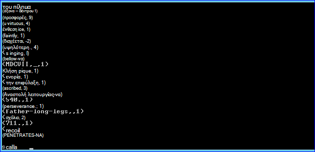
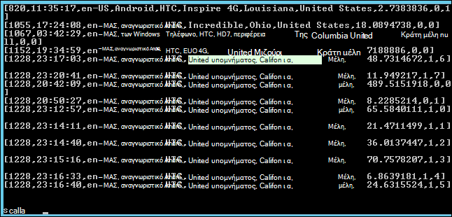

<properties
    pageTitle="Χρησιμοποιήστε την ενέργεια δέσμη ενεργειών για να εγκαταστήσετε τους σε σύμπλεγμα Hadoop | Microsoft Azure"
    description="Μάθετε πώς μπορείτε να προσαρμόσετε ένα σύμπλεγμα HDInsight με τους με χρήση δέσμης ενεργειών."
    services="hdinsight"
    documentationCenter=""
    authors="nitinme"
    manager="jhubbard"
    editor="cgronlun"/>

<tags
    ms.service="hdinsight"
    ms.workload="big-data"
    ms.tgt_pltfrm="na"
    ms.devlang="na"
    ms.topic="article"
    ms.date="02/05/2016"
    ms.author="nitinme"/>

# Εγκατάσταση και χρήση τους σε συμπλεγμάτων HDInsight Hadoop με χρήση δέσμης ενεργειών

> [AZURE.IMPORTANT] Σε αυτό το άρθρο έχει καταργηθεί τώρα. HDInsight παρέχει τώρα τους ως τύπο κορυφαία σύμπλεγμα για συμπλεγμάτων που βασίζεται στα Windows, που σημαίνει μπορείτε πλέον απευθείας να δημιουργήσετε ένα σύμπλεγμα τους χωρίς να τροποποιήσετε ένα σύμπλεγμα Hadoop με χρήση δέσμης ενεργειών. Χρήση του τύπου σύμπλεγμα τους, μπορείτε να αποκτήσετε ένα σύμπλεγμα έκδοση 3.2 HDInsight με τους έκδοση 1.3.1.  Για να εγκαταστήσετε διαφορετικές εκδόσεις του τους, μπορείτε να χρησιμοποιήσετε την ενέργεια δέσμης ενεργειών. HDInsight παρέχει ένα δείγμα δέσμης ενεργειών δέσμης ενεργειών.

Μάθετε πώς να εγκαταστήσετε τους σε Windows βάσει HDInsight με χρήση δέσμης ενεργειών και τον τρόπο εκτέλεσης ερωτημάτων τους σε HDInsight συμπλεγμάτων.

**Σχετικά άρθρα**

- [Δημιουργία Hadoop συμπλεγμάτων στο HDInsight](hdinsight-provision-clusters.md): γενικές πληροφορίες σχετικά με τη δημιουργία συμπλεγμάτων HDInsight.

- [Γρήγορα αποτελέσματα με τους Apache στην HDInsight](hdinsight-apache-spark-jupyter-spark-sql.md): Δημιουργήστε ένα σύμπλεγμα HDInsight τους.

- [Προσαρμογή με χρήση δέσμης ενεργειών σύμπλεγμα HDInsight][hdinsight-cluster-customize]: γενικές πληροφορίες σχετικά με την προσαρμογή συμπλεγμάτων HDInsight με χρήση δέσμης ενεργειών.

- [Ανάπτυξη δέσμης ενεργειών δέσμες ενεργειών για HDInsight](hdinsight-hadoop-script-actions.md).

## Τι είναι το τους;

<a href="http://spark.apache.org/docs/latest/index.html" target="_blank">Apache τους</a> είναι μια παράλληλα ανοιχτού κώδικα επεξεργασίας framework που υποστηρίζει στη μνήμη επεξεργασίας για να ενισχύσει την απόδοση των εφαρμογών ανάλυσης μεγάλο δεδομένων. Δυνατότητες στη μνήμη κατά τον υπολογισμό του τους να είναι μια καλή επιλογή για επαναληπτικού αλγόριθμους σε μηχανικής εκμάθησης και graph υπολογισμούς.

Τους μπορεί επίσης να χρησιμοποιηθεί για την εκτέλεση συμβατικός επεξεργασίας δεδομένων που βασίζεται σε δίσκο. Τους βελτιώνει την παραδοσιακή framework MapReduce αποφυγή εγγραφές στο δίσκο τα στάδια ενδιάμεσου. Επίσης, τους είναι συμβατά με το σύστημα αρχείων κατανεμημένο Hadoop (HDFS) και αντικειμένων Blob του Azure αποθήκευσης, ώστε να τα υπάρχοντα δεδομένα μπορούν εύκολα να υποβάλλονται σε επεξεργασία μέσω τους.

Αυτό το θέμα παρέχει οδηγίες σχετικά με τον τρόπο για να προσαρμόσετε ένα σύμπλεγμα HDInsight για να εγκαταστήσετε τους.

## Εγκατάσταση τους με την πύλη Azure

Ένα δείγμα δέσμης ενεργειών για να εγκαταστήσετε τους σε ένα σύμπλεγμα HDInsight είναι διαθέσιμη από ένα μόνο για ανάγνωση Azure χώρο αποθήκευσης αντικειμένων blob στο [https://hdiconfigactions.blob.core.windows.net/sparkconfigactionv03/spark-installer-v03.ps1](https://hdiconfigactions.blob.core.windows.net/sparkconfigactionv03/spark-installer-v03.ps1). Αυτή η δέσμη ενεργειών να εγκαταστήσετε τους 1.2.0 ή τους 1.0.2 ανάλογα με την έκδοση του συμπλέγματος HDInsight, μπορείτε να δημιουργήσετε.

- Εάν χρησιμοποιείτε τη δέσμη ενεργειών κατά τη δημιουργία ένα σύμπλεγμα **3,2 HDInsight** , εγκαθιστά **τους 1.2.0**.
- Εάν χρησιμοποιείτε τη δέσμη ενεργειών κατά τη δημιουργία ένα σύμπλεγμα **HDInsight 3.1** , εγκαθιστά **τους 1.0.2**.

Μπορείτε να τροποποιήσετε αυτήν τη δέσμη ενεργειών ή να δημιουργήσετε τη δική σας δέσμη ενεργειών για να εγκαταστήσω άλλες εκδόσεις του τους.

> [AZURE.NOTE] Το δείγμα δέσμης ενεργειών λειτουργεί μόνο με HDInsight 3.1 και 3.2 συμπλεγμάτων. Για περισσότερες πληροφορίες σχετικά με εκδόσεις σύμπλεγμα HDInsight, ανατρέξτε στο θέμα [εκδόσεις σύμπλεγμα HDInsight](hdinsight-component-versioning.md).

1. Έναρξη δημιουργίας ένα σύμπλεγμα, χρησιμοποιώντας την επιλογή **ΔΗΜΙΟΥΡΓΊΑ ΠΡΟΣΑΡΜΟΣΜΈΝΗΣ** , όπως περιγράφεται στην [συμπλεγμάτων δημιουργία Hadoop στο HDInsight](hdinsight-provision-clusters.md#portal). Επιλέξτε την έκδοση σύμπλεγμα ανάλογα με τα εξής:

    - Εάν θέλετε να εγκαταστήσετε **τους 1.2.0**, δημιουργήστε ένα σύμπλεγμα 3,2 HDInsight.
    - Εάν θέλετε να εγκαταστήσετε **τους 1.0.2**, δημιουργήστε ένα σύμπλεγμα HDInsight 3.1.

2. Στη σελίδα **Ενέργειες δέσμης ενεργειών** του οδηγού, κάντε κλικ στην επιλογή **Προσθήκη ενέργειας δέσμη ενεργειών** για την παροχή λεπτομερειών σχετικά με την ενέργεια δέσμη ενεργειών, όπως φαίνεται παρακάτω:

    ![Χρήση δέσμης ενεργειών για να προσαρμόσετε ένα σύμπλεγμα] (./media/hdinsight-hadoop-spark-install/HDI.CustomProvision.Page6.png "Χρήση δέσμης ενεργειών για να προσαρμόσετε ένα σύμπλεγμα")

    <table border='1'>
        <tr><th>Ιδιότητα</th><th>Τιμή</th></tr>
        <tr><td>Όνομα</td>
            <td>Καθορίστε ένα όνομα για την ενέργεια δέσμης ενεργειών. Για παράδειγμα, <b>Εγκαταστήστε τους</b>.</td></tr>
        <tr><td>Δέσμη ενεργειών URI</td>
            <td>Καθορίστε το ενιαίο αναγνωριστικό πόρου (URI) στη δέσμη ενεργειών που καλείται για να προσαρμόσετε το σύμπλεγμα. Για παράδειγμα, <i>https://hdiconfigactions.blob.core.windows.net/sparkconfigactionv03/spark-installer-v03.ps1</i></td></tr>
        <tr><td>Τύπος κόμβου</td>
            <td>Καθορίστε τους κόμβους στην οποία εκτελείται η δέσμη ενεργειών προσαρμογής. Μπορείτε να επιλέξετε <b>όλους τους κόμβους</b>, <b>μόνο κόμβους κεφαλή</b>ή <b>κόμβους εργασίας μόνο</b>.
        <tr><td>Παράμετροι</td>
            <td>Καθορίστε τις παραμέτρους, εάν απαιτείται από τη δέσμη ενεργειών. Η δέσμη ενεργειών για την εγκατάσταση τους δεν απαιτεί τις παραμέτρους, ώστε να μπορείτε να αφήσετε αυτό είναι κενό.</td></tr>
    </table>

    Μπορείτε να προσθέσετε περισσότερες από μία ενέργεια δέσμη ενεργειών για την εγκατάσταση πολλών στοιχείων στο σύμπλεγμα. Αφού προσθέσετε τις δέσμες ενεργειών, επιλέξτε το σημάδι επιλογής για να ξεκινήσετε τη δημιουργία του συμπλέγματος.

Μπορείτε επίσης να χρησιμοποιήσετε τη δέσμη ενεργειών για να εγκαταστήσετε τους σε HDInsight με τη χρήση του PowerShell Azure ή το .NET SDK HDInsight. Οδηγίες για αυτές τις διαδικασίες παρέχονται παρακάτω σε αυτό το θέμα.

## Χρήση τους σε HDInsight
Τους παρέχει τα API στο Scala, Python και Java. Μπορείτε επίσης να χρησιμοποιήσετε το αλληλεπιδραστικό κέλυφος τους για να εκτελέσετε τους ερωτήματα. Αυτή η ενότητα παρέχει οδηγίες σχετικά με τον τρόπο για να χρησιμοποιήσετε τις διαφορετικές μεθόδους για να εργαστείτε με τους:

- [Χρησιμοποιήστε το κέλυφος τους για να εκτελέσετε αλληλεπιδραστικών ερωτημάτων](#sparkshell)
- [Χρησιμοποιήστε το κέλυφος τους για να εκτελέσετε ερωτήματα SQL τους](#sparksql)
- [Χρησιμοποιήστε ένα μεμονωμένο πρόγραμμα Scala](#standalone)

###Χρησιμοποιήστε το κέλυφος τους για να εκτελέσετε αλληλεπιδραστικών ερωτημάτων
Ακολουθήστε τα παρακάτω βήματα για να εκτελέσετε ερωτήματα τους από ένα αλληλεπιδραστικό κέλυφος τους. Σε αυτήν την ενότητα, μπορούμε να εκτελέσουμε ένα ερώτημα τους σε ένα αρχείο δεδομένων του δείγματος (/ example/data/gutenberg/davinci.txt) που είναι διαθέσιμες σε HDInsight συμπλεγμάτων από προεπιλογή.

1. Από την πύλη Azure, ενεργοποίηση απομακρυσμένης επιφάνειας εργασίας για το σύμπλεγμα που δημιουργήσατε με τους που έχουν εγκατασταθεί και, στη συνέχεια, remote σε σύμπλεγμα. Για οδηγίες, ανατρέξτε στο θέμα [σύνδεση με χρήση RDP συμπλεγμάτων HDInsight](hdinsight-administer-use-management-portal.md#rdp).

2. Κατά την περίοδο λειτουργίας πρωτόκολλο απομακρυσμένης επιφάνειας εργασίας (RDP), από την επιφάνεια εργασίας, ανοίξτε τη γραμμή εντολών Hadoop (από συντόμευσης στην επιφάνεια εργασίας) και περιηγηθείτε στη θέση όπου είναι εγκατεστημένο το τους; Για παράδειγμα, **C:\apps\dist\spark-1.2.0**.

3. Εκτελέστε την παρακάτω εντολή για να ξεκινήσετε το κέλυφος τους:

         .\bin\spark-shell --master yarn

    Αφού ολοκληρωθεί η εκτέλεση της εντολής, θα πρέπει να λάβετε μια Scala μηνύματος:

         scala>

5. Στη γραμμή εντολών Scala, εισαγάγετε το ερώτημα τους που φαίνεται παρακάτω. Αυτό το ερώτημα υπολογίζει την εμφάνιση κάθε λέξη στο αρχείο davinci.txt που είναι διαθέσιμη στην/παράδειγμα/δεδομένων/gutenberg/θέση στον χώρο αποθήκευσης αντικειμένων Blob του Azure που σχετίζεται με το σύμπλεγμα.

        val file = sc.textFile("/example/data/gutenberg/davinci.txt")
        val counts = file.flatMap(line => line.split(" ")).map(word => (word, 1)).reduceByKey(_ + _)
        counts.toArray().foreach(println)

6. Το αποτέλεσμα θα πρέπει να έχει την εξής μορφή:

    

7. Πληκτρολογήστε: ερωτήσεις για να εξέλθετε από το προτρεπτικό μήνυμα Scala.

        :q

###Χρησιμοποιήστε το κέλυφος τους για να εκτελέσετε ερωτήματα SQL τους

SQL τους σάς επιτρέπει να χρησιμοποιήσετε τους για να εκτελέσετε Σχεσιακά ερωτήματα εκφρασμένη σε Structured Query Language (SQL), HiveQL ή Scala. Σε αυτήν την ενότητα, εξετάσουμε χρησιμοποιώντας τους για να εκτελέσετε ένα ερώτημα ομάδας σε μια ομάδα δείγματος πίνακα. Ο πίνακας Hive χρησιμοποιούνται σε αυτήν την ενότητα (ονομάζεται **hivesampletable**) είναι διαθέσιμο από προεπιλογή όταν δημιουργείτε ένα σύμπλεγμα.

>[AZURE.NOTE] Το παρακάτω δείγμα δημιουργήθηκε σε σχέση με **αυξήσετε τη 1.2.0**, που έχει εγκατασταθεί εάν εκτελείτε την ενέργεια δέσμη ενεργειών κατά τη δημιουργία συμπλέγματος 3,2 HDInsight.

1. Από την πύλη Azure, ενεργοποίηση απομακρυσμένης επιφάνειας εργασίας για το σύμπλεγμα που δημιουργήσατε με τους που έχουν εγκατασταθεί και, στη συνέχεια, remote σε σύμπλεγμα. Για οδηγίες, ανατρέξτε στο θέμα [σύνδεση με χρήση RDP συμπλεγμάτων HDInsight](hdinsight-administer-use-management-portal.md#rdp).

2. Κατά την περίοδο λειτουργίας RDP, από την επιφάνεια εργασίας, ανοίξτε τη γραμμή εντολών Hadoop (από συντόμευσης στην επιφάνεια εργασίας) και περιηγηθείτε στη θέση όπου είναι εγκατεστημένο το τους; Για παράδειγμα, **C:\apps\dist\spark-1.2.0**.

3. Εκτελέστε την παρακάτω εντολή για να ξεκινήσετε το κέλυφος τους:

         .\bin\spark-shell --master yarn

    Αφού ολοκληρωθεί η εκτέλεση της εντολής, θα πρέπει να λάβετε μια Scala μηνύματος:

         scala>

4. Στη γραμμή εντολών Scala, ορίστε στο περιβάλλον της ομάδας. Αυτό είναι απαραίτητο για να εργαστείτε με τα ερωτήματα Hive με τη χρήση τους.

        val hiveContext = new org.apache.spark.sql.hive.HiveContext(sc)

    Σημείωση που **sc** είναι το προεπιλεγμένο τους περιβάλλον που έχει οριστεί όταν ξεκινάτε το κέλυφος τους.

5. Εκτέλεση ενός ερωτήματος Hive, χρησιμοποιώντας το περιβάλλον Hive και εκτυπώστε το αποτέλεσμα στην κονσόλα. Το ερώτημα ανακτά δεδομένα σε συσκευές με ένα συγκεκριμένο τύπο και περιορίζει τον αριθμό των εγγραφών που ανακτήθηκαν έως 20.

        hiveContext.sql("""SELECT * FROM hivesampletable WHERE devicemake LIKE "HTC%" LIMIT 20""").collect().foreach(println)

6. Θα πρέπει να δείτε το αποτέλεσμα όπως το εξής:

    

7. Πληκτρολογήστε: ερωτήσεις για να εξέλθετε από το προτρεπτικό μήνυμα Scala.

        :q

### Χρησιμοποιήστε ένα μεμονωμένο πρόγραμμα Scala

Σε αυτήν την ενότητα, θα σας Συντάξτε μια εφαρμογή Scala που καταμετρά τον αριθμό των γραμμών που περιέχουν τα γράμματα 'a' και 'b' σε ένα αρχείο δεδομένων του δείγματος (/ example/data/gutenberg/davinci.txt) που είναι διαθέσιμες σε HDInsight συμπλεγμάτων από προεπιλογή. Για να γράψετε και να χρησιμοποιήσετε ένα μεμονωμένο πρόγραμμα Scala με ένα σύμπλεγμα προσαρμοστεί με τους εγκατάστασης, πρέπει να εκτελέσετε τα παρακάτω βήματα:

- Εγγραφή ενός προγράμματος Scala
- Δημιουργήστε το πρόγραμμα Scala για να λάβετε το αρχείο .jar
- Εκτέλεση της εργασίας στο σύμπλεγμα

#### Εγγραφή ενός προγράμματος Scala
Σε αυτήν την ενότητα, μπορείτε να συντάξετε ένα πρόγραμμα Scala που καταμετρά τον αριθμό των γραμμών που περιέχουν «α» και «β» στο δείγμα αρχείου δεδομένων.

1. Ανοίξτε ένα πρόγραμμα επεξεργασίας κειμένου και επικολλήστε τον ακόλουθο κώδικα:

        /* SimpleApp.scala */
        import org.apache.spark.SparkContext
        import org.apache.spark.SparkContext._
        import org.apache.spark.SparkConf

        object SimpleApp {
          def main(args: Array[String]) {
            val logFile = "/example/data/gutenberg/davinci.txt"         //Location of the sample data file on Azure Blob storage
            val conf = new SparkConf().setAppName("SimpleApplication")
            val sc = new SparkContext(conf)
            val logData = sc.textFile(logFile, 2).cache()
            val numAs = logData.filter(line => line.contains("a")).count()
            val numBs = logData.filter(line => line.contains("b")).count()
            println("Lines with a: %s, Lines with b: %s".format(numAs, numBs))
          }
        }

2. Αποθηκεύστε το αρχείο με το όνομα **SimpleApp.scala**.

#### Δημιουργήστε το πρόγραμμα Scala
Σε αυτήν την ενότητα, μπορείτε να χρησιμοποιήσετε το <a href="http://www.scala-sbt.org/0.13/docs/index.html" target="_blank">Εργαλείο απλή δημιουργία</a> (ή sbt) για να δημιουργήσετε το πρόγραμμα Scala. SBT απαιτεί Java 1,6 ή νεότερη έκδοση, οπότε βεβαιωθείτε ότι έχετε επιλέξει τη σωστή έκδοση της Java εγκατασταθεί πριν να συνεχίσετε με αυτήν την ενότητα.

1. Εγκαταστήστε sbt από http://www.scala-sbt.org/0.13/tutorial/Installing-sbt-on-Windows.html.
2. Δημιουργήστε ένα φάκελο που ονομάζεται **SimpleScalaApp**και μέσα σε αυτόν το φάκελο, δημιουργήστε ένα αρχείο που ονομάζεται **simple.sbt**. Αυτό είναι ένα αρχείο ρύθμισης παραμέτρων που περιέχει πληροφορίες σχετικά με την έκδοση Scala, βιβλιοθήκη εξαρτήσεις, κ.λπ. Επικολλήστε τα εξής στο αρχείο simple.sbt και αποθηκεύστε το:

        name := "SimpleApp"

        version := "1.0"

        scalaVersion := "2.10.4"

        libraryDependencies += "org.apache.spark" %% "spark-core" % "1.2.0"

    >[AZURE.NOTE] Βεβαιωθείτε ότι μπορείτε να διατηρήσετε τις κενές γραμμές στο αρχείο.

3. Κάτω από το φάκελο **SimpleScalaApp** , δημιουργήστε μια δομή καταλόγου **\src\main\scala** και επικολλήστε το πρόγραμμα Scala (**SimpleApp.scala**) που δημιουργήσατε νωρίτερα κάτω από το φάκελο \src\main\scala.
4. Ανοίξτε μια γραμμή εντολών, μεταβείτε στον κατάλογο SimpleScalaApp και εισαγάγετε την ακόλουθη εντολή:

        sbt package

    Μόλις η εφαρμογή μεταγλώττιση, θα δείτε ένα αρχείο **simpleapp_2.10 1.0.jar** που δημιουργείται κάτω από τον κατάλογο **\target\scala-2.10** μέσα στον ριζικό φάκελο SimpleScalaApp.

#### Εκτέλεση της εργασίας στο σύμπλεγμα
Σε αυτήν την ενότητα, που απομακρυσμένο σε ένα σύμπλεγμα που τους έχει εγκαταστήσει και, στη συνέχεια, αντιγράψτε το φάκελο προορισμού του έργου SimpleScalaApp. Στη συνέχεια, μπορείτε να χρησιμοποιήσετε την εντολή **υποβολή τους** για να υποβάλετε την εργασία στο σύμπλεγμα.

1. Remote σε ένα σύμπλεγμα που έχει εγκατασταθεί τους. Από τον υπολογιστή όπου που συντάξατε και δημιουργηθεί το πρόγραμμα SimpleApp.scala, αντιγράψτε το φάκελο **SimpleScalaApp\target** και επικολλήστε το σε μια θέση στο σύμπλεγμα.
2. Κατά την περίοδο λειτουργίας RDP, από την επιφάνεια εργασίας, ανοίξτε τη γραμμή εντολών Hadoop και μεταβείτε στη θέση όπου έχει επικολληθεί στο φάκελο **προορισμού** .
3. Πληκτρολογήστε την παρακάτω εντολή για να εκτελέσετε το πρόγραμμα SimpleApp.scala:

        C:\apps\dist\spark-1.2.0\bin\spark-submit --class "SimpleApp" --master local target/scala-2.10/simpleapp_2.10-1.0.jar

4. Όταν ολοκληρωθεί η εκτέλεση του προγράμματος, το αποτέλεσμα εμφανίζεται στην κονσόλα.

        Lines with a: 21374, Lines with b: 11430

## Εγκατάσταση τους με χρήση του PowerShell Azure

Σε αυτήν την ενότητα, μπορούμε να χρησιμοποιήσουμε το cmdlet **<a href = "http://msdn.microsoft.com/library/dn858088.aspx" target="_blank">AzureHDInsightScriptAction Προσθήκη</a>** για να καλέσετε δέσμες ενεργειών με χρήση δέσμης ενεργειών για να προσαρμόσετε ένα σύμπλεγμα. Πριν να συνεχίσετε, βεβαιωθείτε ότι έχετε εγκαταστήσει και να ρυθμίσει τις παραμέτρους του PowerShell Azure. Για πληροφορίες σχετικά με τη ρύθμιση των παραμέτρων ενός σταθμούς εργασίας για την εκτέλεση των cmdlet του Azure PowerShell για το HDInsight, ανατρέξτε στο θέμα [εγκατάσταση και ρύθμιση παραμέτρων του PowerShell Azure](../powershell-install-configure.md).

Ακολουθήστε τα παρακάτω βήματα:

1. Ανοίξτε ένα παράθυρο του PowerShell Azure και δηλώνουν τις παρακάτω μεταβλητές:

        # Provide values for these variables
        $subscriptionName = "<SubscriptionName>"        # Name of the Azure subscription
        $clusterName = "<HDInsightClusterName>"         # HDInsight cluster name
        $storageAccountName = "<StorageAccountName>"    # Azure Storage account that hosts the default container
        $storageAccountKey = "<StorageAccountKey>"      # Key for the Storage account
        $containerName = $clusterName
        $location = "<MicrosoftDataCenter>"             # Location of the HDInsight cluster. It must be in the same data center as the Storage account.
        $clusterNodes = <ClusterSizeInNumbers>          # Number of nodes in the HDInsight cluster
        $version = "<HDInsightClusterVersion>"          # For example, "3.2"

2. Καθορίστε τις τιμές ρύθμισης παραμέτρων όπως κόμβοι στο σύμπλεγμα και το χώρο αποθήκευσης προεπιλογή θα χρησιμοποιηθεί.

        # Specify the configuration options
        Select-AzureSubscription $subscriptionName
        $config = New-AzureHDInsightClusterConfig -ClusterSizeInNodes $clusterNodes
        $config.DefaultStorageAccount.StorageAccountName="$storageAccountName.blob.core.windows.net"
        $config.DefaultStorageAccount.StorageAccountKey=$storageAccountKey
        $config.DefaultStorageAccount.StorageContainerName=$containerName

3. Χρησιμοποιήστε το cmdlet **AzureHDInsightScriptAction Προσθήκη** για να προσθέσετε μια ενέργεια δέσμη ενεργειών για ρύθμιση παραμέτρων του συμπλέγματος. Αργότερα, όταν δημιουργείται το σύμπλεγμα, λαμβάνει εκτελεστεί η ενέργεια δέσμης ενεργειών.

        # Add a script action to the cluster configuration
        $config = Add-AzureHDInsightScriptAction -Config $config -Name "Install Spark" -ClusterRoleCollection HeadNode -Uri https://hdiconfigactions.blob.core.windows.net/sparkconfigactionv03/spark-installer-v03.ps1

    **Προσθήκη AzureHDInsightScriptAction** cmdlet λαμβάνει τις παρακάτω παραμέτρους:

    <table style="border-color: #c6c6c6; border-width: 2px; border-style: solid; border-collapse: collapse;">
    <tr>
    <th style="border-color: #c6c6c6; border-width: 2px; border-style: solid; border-collapse: collapse; width:90px; padding-left:5px; padding-right:5px;">Παράμετρος</th>
    <th style="border-color: #c6c6c6; border-width: 2px; border-style: solid; border-collapse: collapse; width:550px; padding-left:5px; padding-right:5px;">Ορισμός</th></tr>
    <tr>
    <td style="border-color: #c6c6c6; border-width: 2px; border-style: solid; border-collapse: collapse; padding-left:5px;">Ρύθμιση παραμέτρων</td>
    <td style="border-color: #c6c6c6; border-width: 2px; border-style: solid; border-collapse: collapse; padding-left:5px; padding-right:5px;">Το αντικείμενο ρύθμισης παραμέτρων ποια δέσμη ενεργειών προστίθεται πληροφοριών ενέργειας.</td></tr>
    <tr>
    <td style="border-color: #c6c6c6; border-width: 2px; border-style: solid; border-collapse: collapse; padding-left:5px;">Όνομα</td>
    <td style="border-color: #c6c6c6; border-width: 2px; border-style: solid; border-collapse: collapse; padding-left:5px;">Το όνομα της ενέργειας δέσμης ενεργειών.</td></tr>
    <tr>
    <td style="border-color: #c6c6c6; border-width: 2px; border-style: solid; border-collapse: collapse; padding-left:5px;">ClusterRoleCollection</td>
    <td style="border-color: #c6c6c6; border-width: 2px; border-style: solid; border-collapse: collapse; padding-left:5px;">Καθορίζει τους κόμβους στην οποία εκτελείται η δέσμη ενεργειών προσαρμογής. Οι έγκυρες τιμές είναι HeadNode (για να εγκαταστήσετε στον κόμβο κεφαλής) ή DataNode (για να την εγκαταστήσετε σε όλους τους κόμβους δεδομένων). Μπορείτε να χρησιμοποιήσετε ή και τα δύο τιμές.</td></tr>
    <tr>
    <td style="border-color: #c6c6c6; border-width: 2px; border-style: solid; border-collapse: collapse; padding-left:5px;">URI</td>
    <td style="border-color: #c6c6c6; border-width: 2px; border-style: solid; border-collapse: collapse; padding-left:5px;">Καθορίζει το URI στη δέσμη ενεργειών που εκτελείται.</td></tr>
    <tr>
    <td style="border-color: #c6c6c6; border-width: 2px; border-style: solid; border-collapse: collapse; padding-left:5px;">Παράμετροι</td>
    <td style="border-color: #c6c6c6; border-width: 2px; border-style: solid; border-collapse: collapse; padding-left:5px;">Παράμετροι που απαιτούνται από τη δέσμη ενεργειών. Το δείγμα δέσμης ενεργειών που χρησιμοποιούνται σε αυτό το θέμα δεν απαιτεί τις παραμέτρους και, επομένως δεν βλέπετε αυτήν την παράμετρο σε το τμήμα κώδικα παραπάνω.
    </td></tr>
    </table>

4. Τέλος, ξεκινήσετε τη δημιουργία προσαρμοσμένων ένα σύμπλεγμα με τους εγκατεστημένο.  

        # Start creating a cluster with Spark installed
        New-AzureHDInsightCluster -Config $config -Name $clusterName -Location $location -Version $version

Όταν σας ζητηθεί, πληκτρολογήστε τα διαπιστευτήρια για το σύμπλεγμα. Μπορεί να χρειαστούν αρκετά λεπτά πριν από τη δημιουργία του συμπλέγματος.

## Εγκατάσταση τους με χρήση του PowerShell

Ανατρέξτε στο θέμα [Προσαρμογή HDInsight συμπλεγμάτων με χρήση δέσμης ενεργειών](hdinsight-hadoop-customize-cluster.md#call_scripts_using_powershell).

## Εγκατάσταση τους χρησιμοποιώντας .NET SDK

Ανατρέξτε στο θέμα [Προσαρμογή HDInsight συμπλεγμάτων με χρήση δέσμης ενεργειών](hdinsight-hadoop-customize-cluster.md#call_scripts_using_azure_powershell).

## Δείτε επίσης

- [Δημιουργία Hadoop συμπλεγμάτων στο HDInsight](hdinsight-provision-clusters.md): δημιουργία συμπλεγμάτων HDInsight.
- [Γρήγορα αποτελέσματα με τους Apache στην HDInsight](hdinsight-apache-spark-jupyter-spark-sql.md): γρήγορα αποτελέσματα με τους σε HDInsight.
- [Προσαρμογή με χρήση δέσμης ενεργειών σύμπλεγμα HDInsight][hdinsight-cluster-customize]: Προσαρμογή συμπλεγμάτων HDInsight με χρήση δέσμης ενεργειών.
- [Ανάπτυξη δέσμης ενεργειών δέσμες ενεργειών για HDInsight](hdinsight-hadoop-script-actions.md): ανάπτυξη δεσμών ενεργειών δέσμης ενεργειών.
- [Εγκατάσταση R σε συμπλεγμάτων HDInsight] [ hdinsight-install-r] παρέχει οδηγίες σχετικά με τον τρόπο χρήσης συμπλέγματος προσαρμογής για να εγκαταστήσετε και να χρησιμοποιήσετε R σε συμπλεγμάτων HDInsight Hadoop. R είναι μια γλώσσα προέλευσης άνοιγμα και περιβάλλον για τον υπολογισμό στατιστικών. Παρέχει εκατοντάδες ενσωματωμένη στατιστικές συναρτήσεις και δικό του γλώσσα προγραμματισμού που συνδυάζει πτυχές προγραμματισμού λειτουργική και προσανατολισμένα σε αντικείμενα. Επίσης, παρέχει εκτεταμένη δυνατότητες γραφικών.
- [Εγκατάσταση Giraph στην συμπλεγμάτων HDInsight](hdinsight-hadoop-giraph-install.md). Χρησιμοποιήστε σύμπλεγμα προσαρμογής για να εγκαταστήσετε Giraph σε συμπλεγμάτων HDInsight Hadoop. Giraph σας επιτρέπει να εκτελέσετε graph επεξεργασίας με τη χρήση Hadoop, και μπορούν να χρησιμοποιηθούν με Azure HDInsight.
- [Εγκατάσταση Solr στην συμπλεγμάτων HDInsight](hdinsight-hadoop-solr-install.md). Χρησιμοποιήστε σύμπλεγμα προσαρμογής για να εγκαταστήσετε Solr σε συμπλεγμάτων HDInsight Hadoop. Solr σάς επιτρέπει να εκτελέσετε λειτουργίες ισχυρή αναζήτησης στα δεδομένα που είναι αποθηκευμένα.

[hdinsight-provision]: hdinsight-provision-clusters.md
[hdinsight-install-r]: hdinsight-hadoop-r-scripts.md
[hdinsight-cluster-customize]: hdinsight-hadoop-customize-cluster.md
[powershell-install-configure]: powershell-install-configure.md
