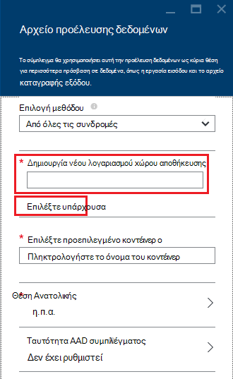

<properties
    pageTitle="Υποβολή ερωτήματος δεδομένων από το χώρο αποθήκευσης αντικειμένων Blob συμβατό με HDFS | Microsoft Azure"
    description="HDInsight χρησιμοποιεί χώρο αποθήκευσης αντικειμένων Blob του Azure ως ο χώρος αποθήκευσης δεδομένων μεγάλο για HDFS. Μάθετε πώς μπορείτε να ερωτήματος δεδομένων από το χώρο αποθήκευσης αντικειμένων Blob και να αποθηκεύσετε τα αποτελέσματα της ανάλυσης."
    keywords="αντικειμένων blob χώρου αποθήκευσης, hdfs, δομημένα δεδομένα, μη δομημένα δεδομένα"
    services="hdinsight,storage"
    documentationCenter=""
    tags="azure-portal"
    authors="mumian"
    manager="jhubbard"
    editor="cgronlun"/>

<tags
    ms.service="hdinsight"
    ms.workload="big-data"
    ms.tgt_pltfrm="na"
    ms.devlang="na"
    ms.topic="get-started-article"
    ms.date="09/06/2016"
    ms.author="jgao"/>

# Χρήση χώρος αποθήκευσης αντικειμένων Blob του Azure HDFS συμβατών με Hadoop σε HDInsight

Μάθετε πώς να χρησιμοποιείτε το χώρο αποθήκευσης αντικειμένων Blob του Azure χαμηλού κόστους με το HDInsight, δημιουργία λογαριασμού Azure χώρου αποθήκευσης και κοντέινερ χώρου αποθήκευσης αντικειμένων Blob και, στη συνέχεια, διεύθυνση των δεδομένων μέσα.

Χώρο αποθήκευσης Blob του Azure είναι μια λύση ισχυρή, γενικής χρήσης χώρου αποθήκευσης που ενσωματώνεται απρόσκοπτα με HDInsight. Μέσω ενός περιβάλλοντος συστήματος (HDFS) κατανεμημένων αρχείων Hadoop, το πλήρες σύνολο των στοιχείων στην HDInsight μπορεί να λειτουργήσει απευθείας σε δομημένες ή μη δομημένα δεδομένα στο χώρο αποθήκευσης αντικειμένων Blob.

Αποθήκευση δεδομένων στο χώρο αποθήκευσης αντικειμένων Blob σάς επιτρέπει να διαγράψετε με ασφάλεια των συμπλεγμάτων HDInsight που χρησιμοποιούνται για υπολογισμό χωρίς να χάσετε τα δεδομένα των χρηστών.

> [AZURE.IMPORTANT] HDInsight υποστηρίζει μόνο αντικείμενα BLOB μπλοκ. Δεν υποστηρίζει τη σελίδα ή αντικείμενα BLOB προσάρτηση.

Για πληροφορίες σχετικά με τη δημιουργία ένα σύμπλεγμα HDInsight, ανατρέξτε στο θέμα [Γρήγορα αποτελέσματα με το HDInsight] [ hdinsight-get-started] ή [Δημιουργία HDInsight συμπλεγμάτων][hdinsight-creation].

## Αρχιτεκτονική αποθήκευσης HDInsight
Το παρακάτω διάγραμμα παρέχει μια συνοπτική προβολή της αρχιτεκτονικής HDInsight χώρου αποθήκευσης:

![Hadoop συμπλεγμάτων χρησιμοποιούν το API HDFS για να αποκτήσετε πρόσβαση και να αποθηκεύσετε δομημένα και μη δομημένα δεδομένα στο χώρο αποθήκευσης αντικειμένων Blob.] (./media/hdinsight-hadoop-use-blob-storage/HDI.WASB.Arch.png "Αρχιτεκτονική HDInsight αποθήκευσης")

HDInsight παρέχει πρόσβαση σε το κατανεμημένο σύστημα αρχείων που είναι συνδεδεμένος τοπικά στον κόμβους υπολογιστικών. Αυτό το σύστημα αρχείων είναι δυνατή η πρόσβαση, χρησιμοποιώντας το πλήρως προσδιορισμένο URI, για παράδειγμα:

    hdfs://<namenodehost>/<path>

Επιπλέον, HDInsight παρέχει τη δυνατότητα για πρόσβαση σε δεδομένα που είναι αποθηκευμένα στο χώρο αποθήκευσης αντικειμένων Blob του Azure. Η σύνταξη είναι:

    wasb[s]://<containername>@<accountname>.blob.core.windows.net/<path>

> [AZURE.NOTE] Σε εκδόσεις του HDInsight νωρίτερα από 3.0, `asv://` που χρησιμοποιήθηκε αντί `wasb://`. `asv://`θα πρέπει να χρησιμοποιηθεί με το HDInsight συμπλεγμάτων 3.0 ή νεότερη έκδοση, καθώς αυτό θα έχει ως αποτέλεσμα σφάλμα.

Hadoop υποστηρίζει ένα έννοια της το προεπιλεγμένο σύστημα αρχείων. Το προεπιλεγμένο σύστημα αρχείων σημαίνει ένα προεπιλεγμένο συνδυασμό και αρχή έκδοσης πιστοποιητικών. Μπορεί επίσης να χρησιμοποιηθεί για την επίλυση σχετικές διαδρομές. Κατά τη διαδικασία δημιουργίας HDInsight, ένα λογαριασμό αποθήκευσης Azure και ένα συγκεκριμένο χώρο αποθήκευσης αντικειμένων Blob του Azure κοντέινερ από το λογαριασμό που έχει οριστεί ως το προεπιλεγμένο σύστημα αρχείων.

Εκτός από αυτόν το λογαριασμό χώρου αποθήκευσης, μπορείτε να προσθέσετε λογαριασμούς επιπλέον χώρο αποθήκευσης από την ίδια συνδρομή του Azure ή διάφορες συνδρομές του Azure κατά τη διαδικασία δημιουργίας ή μετά από ένα σύμπλεγμα έχει δημιουργηθεί. Για οδηγίες σχετικά με την προσθήκη λογαριασμών επιπλέον χώρο αποθήκευσης, ανατρέξτε στο θέμα [Δημιουργία HDInsight συμπλεγμάτων][hdinsight-creation].

- **Κοντέινερ στους λογαριασμούς χώρου αποθήκευσης που είναι συνδεδεμένοι σε ένα σύμπλεγμα:** Επειδή το όνομα λογαριασμού και αριθμού-κλειδιού σχετίζονται με το σύμπλεγμα κατά τη δημιουργία, έχετε πλήρη πρόσβαση στις τα αντικείμενα BLOB σε αυτά τα κοντέινερ.

- **Δημόσια κοντέινερ ή δημόσια αντικείμενα blob στο χώρο αποθήκευσης λογαριασμοί που δεν είναι συνδεδεμένες σε ένα σύμπλεγμα:** Έχετε δικαίωμα μόνο για ανάγνωση τα αντικείμενα BLOB σε το κοντέινερ.

    > [AZURE.NOTE]
        > Δημόσια κοντέινερ σάς επιτρέπουν να λάβετε μια λίστα με όλα τα αντικείμενα BLOB που είναι διαθέσιμες σε αυτό το κοντέινερ και λάβετε κοντέινερ μετα-δεδομένων. Δημόσια αντικείμενα BLOB επιτρέπει να αποκτήσετε πρόσβαση τα αντικείμενα BLOB μόνο εάν γνωρίζετε την ακριβή διεύθυνση URL. Για περισσότερες πληροφορίες, ανατρέξτε στο θέμα <a href="http://msdn.microsoft.com/library/windowsazure/dd179354.aspx">Περιορισμός πρόσβασης σε κοντέινερ και αντικείμενα BLOB</a>.

- **Ιδιωτικό κοντέινερ στους λογαριασμούς χώρου αποθήκευσης που δεν είναι συνδεδεμένες σε ένα σύμπλεγμα:** Έχετε τη δυνατότητα πρόσβασης τα αντικείμενα blob στο το κοντέινερ, εκτός εάν μπορείτε να καθορίσετε το λογαριασμό χώρου αποθήκευσης κατά την υποβολή τις εργασίες WebHCat. Αυτό είναι περιγράφεται παρακάτω σε αυτό το άρθρο.

Οι λογαριασμοί χώρου αποθήκευσης που ορίζονται σε η διαδικασία δημιουργίας και τους αριθμούς-κλειδιά αποθηκεύονται σε %HADOOP_HOME%/conf/core-site.xml σε τους κόμβους συμπλέγματος. Η προεπιλεγμένη συμπεριφορά της HDInsight είναι να χρησιμοποιήσετε τους λογαριασμούς χώρου αποθήκευσης που ορίζονται στο αρχείο πυρήνα site.xml. Δεν συνιστάται να επεξεργαστείτε το αρχείο πυρήνα site.xml, επειδή το σύμπλεγμα κεφαλής node(master) μπορεί να είναι reimaged ή μετεγκατασταθεί οποιαδήποτε στιγμή και αλλαγές σε αυτά τα αρχεία θα χαθούν.

Πολλαπλές εργασίες WebHCat, συμπεριλαμβανομένης της ομάδας, MapReduce, Hadoop ροής και γουρούνι, να εκτελέσετε μια περιγραφή των λογαριασμών χώρου αποθήκευσης και μετα-δεδομένων με αυτά. (Αυτό λειτουργεί επί του παρόντος γουρούνι με λογαριασμούς του χώρου αποθήκευσης, αλλά όχι για μετα-δεδομένων.) Στην ενότητα [αντικείμενα BLOB Access χρησιμοποιώντας το Azure PowerShell](#powershell) αυτού του άρθρου, υπάρχει ένα δείγμα αυτής της δυνατότητας. Για περισσότερες πληροφορίες, ανατρέξτε στο θέμα [Χρήση ένα σύμπλεγμα HDInsight με εναλλακτικό λογαριασμούς χώρου αποθήκευσης και Metastores](http://social.technet.microsoft.com/wiki/contents/articles/23256.using-an-hdinsight-cluster-with-alternate-storage-accounts-and-metastores.aspx).

Χώρος αποθήκευσης αντικειμένων blob μπορεί να χρησιμοποιηθεί για δομημένα και μη δομημένα δεδομένα. Χώρους αποθήκευσης αντικειμένων blob αποθήκευση δεδομένων ως ζεύγη κλειδιού/τιμής και δεν υπάρχει καμία ιεραρχία καταλόγου. Ωστόσο μπορεί να χρησιμοποιηθεί η κάθετος (/) μέσα σε το όνομα του κλειδιού ώστε να φαίνεται σαν να είναι αποθηκευμένο ένα αρχείο μέσα σε μια δομή καταλόγου. Για παράδειγμα, ένα blob κλειδί ενδέχεται να είναι *input/log1.txt*. Δεν υπάρχει πραγματική *εισαγωγής* κατάλογος υπάρχει, αλλά λόγω της παρουσίας του χαρακτήρα καθέτου στο όνομα του κλειδιού, που έχει την εμφάνιση της διαδρομής αρχείου.

###Πλεονεκτήματα της αποθήκευσης αντικειμένων Blob
Σιωπηρή απόδοσης κόστους δεν από κοινού κατά τον εντοπισμό υπολογίζει συμπλεγμάτων και να μετριάζεται πόρων αποθήκευσης από τον τρόπο των συμπλεγμάτων υπολογισμού δημιουργούνται Κλείσιμο για τους πόρους λογαριασμού χώρου αποθήκευσης μέσα στην περιοχή Azure, όπου το δίκτυο υψηλής ταχύτητας καθιστά πολύ αποτελεσματική για τους κόμβους υπολογισμού για να αποκτήσετε πρόσβαση στα δεδομένα μέσα αποθήκευσης αντικειμένων Blob του Azure.

Υπάρχουν διάφορα πλεονεκτήματα που σχετίζεται με την αποθήκευση των δεδομένων στο χώρο αποθήκευσης αντικειμένων Blob του Azure αντί για HDFS:

* **Κοινή χρήση και επαναχρησιμοποίηση δεδομένων:** Τα δεδομένα στο HDFS βρίσκεται στο εσωτερικό του σύμπλεγμα υπολογισμού. Μόνο οι εφαρμογές που έχουν πρόσβαση σε το σύμπλεγμα υπολογισμού να χρησιμοποιήσετε τα δεδομένα, χρησιμοποιώντας HDFS APIs. Τα δεδομένα στο χώρο αποθήκευσης αντικειμένων Blob του Azure είναι δυνατή η πρόσβαση μέσω του API HDFS είτε μέσω του [APIs ΥΠΌΛΟΙΠΟ χώρο αποθήκευσης αντικειμένων Blob][blob-storage-restAPI]. Έτσι, μπορεί να χρησιμοποιηθεί ένα μεγαλύτερο σύνολο εφαρμογές (συμπεριλαμβανομένων των άλλων συμπλεγμάτων HDInsight) και τα εργαλεία για να δημιουργήσουν και να εκμετάλλευση των δεδομένων.
* **Αρχειοθέτηση δεδομένων:** Την αποθήκευση των δεδομένων στο χώρο αποθήκευσης αντικειμένων Blob του Azure επιτρέπει την συμπλεγμάτων HDInsight που χρησιμοποιούνται για υπολογισμό να διαγραφεί με ασφάλεια χωρίς να χάσετε τα δεδομένα των χρηστών.
* **Κόστος χώρου αποθήκευσης δεδομένων:** Αποθήκευση δεδομένων στο DFS μακροπρόθεσμα είναι πιο κοστίζουν από την αποθήκευση των δεδομένων στο χώρο αποθήκευσης αντικειμένων Blob του Azure, επειδή το κόστος των ένα σύμπλεγμα υπολογισμού είναι μεγαλύτερη από το κόστος ενός κοντέινερ χώρου αποθήκευσης αντικειμένων Blob του Azure. Επιπλέον, επειδή δεν διαθέτει τα δεδομένα να φορτωθεί ξανά για κάθε γενιάς σύμπλεγμα υπολογισμού, επίσης αποθηκεύετε δεδομένα κατά τη φόρτωση κόστους.
* **Ελαστικά ανάληψης κλίμακα:** Παρόλο που HDFS σάς παρέχει ένα σύστημα αρχείων κλιμάκωση ανάληψης, της κλίμακας προσδιορίζεται από τον αριθμό των κόμβους που δημιουργείτε για το σύμπλεγμά σας. Αλλαγή της κλίμακας μπορεί να γίνει μια πιο σύνθετη διαδικασία από βασίζεστε στο το ελαστικές κλιμάκωση δυνατότητες που λαμβάνετε αυτόματα στο χώρο αποθήκευσης αντικειμένων Blob του Azure.
* **Παν αναπαραγωγής:** Τους χώρους αποθήκευσης αντικειμένων Blob του Azure μπορεί να είναι αναπαραχθούν παν. Παρόλο που το αποτέλεσμα είναι γεωγραφικά αποκατάστασης και τα πλεονάζοντα δεδομένα, ανακατεύθυνσης στη θέση αναπαραχθούν παν σοβαρά επηρεάζει τις επιδόσεις και την ενδέχεται να περιλαμβάνουν πρόσθετο κόστος. Ώστε να μας σύσταση είναι η σωστή επιλογή την αναπαραγωγή παν και μόνο εάν η τιμή των δεδομένων είναι αξίζει το πρόσθετο κόστος.

Ορισμένες εργασίες MapReduce και πακέτα μπορεί να δημιουργήσει ενδιάμεσα αποτελέσματα που δεν θέλετε πραγματικά να αποθηκεύσετε στο χώρο αποθήκευσης αντικειμένων Blob του Azure. Σε αυτή την περίπτωση, μπορείτε να επιλέξετε να αποθηκεύσετε τα δεδομένα σε την τοπική HDFS. Στην πραγματικότητα, HDInsight χρησιμοποιεί DFS για πολλές από αυτές τις ενδιάμεσα αποτελέσματα σε εργασίες ομάδας και άλλες διεργασίες.

> [AZURE.NOTE] Περισσότερες εντολές HDFS (για παράδειγμα, <b>ls</b>, <b>copyFromLocal</b> και <b>mkdir</b>) εξακολουθούν να λειτουργούν όπως αναμένεται. Μόνο οι εντολές που σχετίζονται με την εγγενή HDFS εφαρμογή (το οποίο αναφέρεται ως DFS), όπως <b>fschk</b> και <b>dfsadmin</b>, θα εμφανιστεί διαφορετική συμπεριφορά στο χώρο αποθήκευσης αντικειμένων Blob του Azure.

## Δημιουργία κοντέινερ αντικειμένων Blob

Για να χρησιμοποιήσετε αντικείμενα blob, μπορείτε πρώτα να δημιουργήσετε ένα [λογαριασμό αποθήκευσης Azure][azure-storage-create]. Ως μέρος αυτού του, μπορείτε να καθορίσετε μια περιοχή Azure που θα αποθηκεύσει τα αντικείμενα που δημιουργείτε χρησιμοποιώντας αυτόν το λογαριασμό. Το σύμπλεγμα και για το λογαριασμό χώρου αποθήκευσης πρέπει να φιλοξενούνται στην ίδια περιοχή. Η βάση δεδομένων SQL Server metastore ομάδα και η βάση δεδομένων SQL Server metastore Oozie πρέπει επίσης να βρίσκεται στην ίδια περιοχή.

Όπου και αν βρίσκονται, κάθε blob δημιουργείτε ανήκει σε ένα κοντέινερ στο λογαριασμό σας στο χώρο αποθήκευσης Azure. Αυτό το κοντέινερ μπορεί να είναι μια υπάρχουσα blob που δημιουργήθηκε εκτός HDInsight ή μπορεί να είναι ένα κοντέινερ που δημιουργείται για ένα σύμπλεγμα HDInsight.

Το προεπιλεγμένο κοντέινερ αντικειμένων Blob αποθηκεύει σύμπλεγμα συγκεκριμένες πληροφορίες όπως ιστορικού εργασίας και αρχεία καταγραφής. Δεν κάνετε κοινή χρήση ένα προεπιλεγμένο κοντέινερ αντικειμένων Blob με πολλές συμπλεγμάτων HDInsight. Αυτό μπορεί να καταστρέψει ιστορικού εργασίας και θα παρουσιάζουν το σύμπλεγμα. Συνιστάται να χρησιμοποιήσετε ένα διαφορετικό κοντέινερ για κάθε σύμπλεγμα και τοποθέτηση κοινόχρηστων δεδομένων σε ένα λογαριασμό συνδεδεμένων χώρου αποθήκευσης που καθορίζεται στην ανάπτυξη όλων των σχετικών συμπλεγμάτων αντί για τον προεπιλεγμένο λογαριασμό χώρου αποθήκευσης. Για περισσότερες πληροφορίες σχετικά με τη ρύθμιση λογαριασμών συνδεδεμένων χώρου αποθήκευσης, ανατρέξτε στο θέμα [Δημιουργία HDInsight συμπλεγμάτων][hdinsight-creation]. Ωστόσο μπορείτε να χρησιμοποιήσετε ξανά ένα προεπιλεγμένο κοντέινερ χώρου αποθήκευσης μετά τη διαγραφή του αρχικού συμπλέγματος HDInsight. Για HBase συμπλεγμάτων, στην πραγματικότητα, μπορείτε να διατηρήσετε το σχήμα HBase πίνακα και δεδομένα, δημιουργήστε ένα νέο σύμπλεγμα HBase χρησιμοποιώντας το προεπιλεγμένο κοντέινερ χώρου αποθήκευσης αντικειμένων blob που χρησιμοποιείται από ένα σύμπλεγμα HBase που έχει διαγραφεί.

### Με την πύλη Azure

Όταν δημιουργείτε ένα σύμπλεγμα HDInsight από την πύλη, έχετε τις επιλογές για να χρησιμοποιήσετε έναν υπάρχοντα λογαριασμό του χώρου αποθήκευσης ή να δημιουργήσετε ένα νέο λογαριασμό του χώρου αποθήκευσης:

###Χρήση του Azure CLI

[AZURE.INCLUDE [use-latest-version](../../includes/hdinsight-use-latest-cli.md)]

Εάν έχετε [εγκατεστημένη και ρυθμισμένη την CLI Azure](../xplat-cli-install.md), την παρακάτω εντολή μπορεί να χρησιμοποιηθεί σε ένα λογαριασμό χώρου αποθήκευσης και κοντέινερ.

    azure storage account create <storageaccountname> --type LRS

> [AZURE.NOTE] Το `--type` η παράμετρος υποδεικνύει πώς θα γίνει η αναπαραγωγή του λογαριασμού χώρου αποθήκευσης. Για περισσότερες πληροφορίες, ανατρέξτε στο θέμα [Azure αποθήκευσης αναπαραγωγής](../storage/storage-redundancy.md). Μην χρησιμοποιείτε ZRS όπως ZRS δεν υποστηρίζει blob σελίδας, αρχείο, πίνακα ή ουρά.

Θα σας ζητηθεί να καθορίσετε τη γεωγραφική περιοχή που θα τοποθετηθεί το λογαριασμό χώρου αποθήκευσης στο. Θα πρέπει να δημιουργήσετε το λογαριασμό χώρου αποθήκευσης στην ίδια περιοχή που σκοπεύετε να δημιουργήσετε το σύμπλεγμά σας HDInsight.

Αφού δημιουργηθεί το λογαριασμό χώρου αποθήκευσης, χρησιμοποιήστε την ακόλουθη εντολή για να ανακτήσετε τα πλήκτρα για το λογαριασμό χώρου αποθήκευσης:

    azure storage account keys list <storageaccountname>

Για να δημιουργήσετε ένα κοντέινερ, χρησιμοποιήστε την ακόλουθη εντολή:

    azure storage container create <containername> --account-name <storageaccountname> --account-key <storageaccountkey>

### Χρήση του Azure PowerShell

Εάν έχετε [εγκατεστημένη και ρυθμισμένη Azure PowerShell][powershell-install], μπορείτε να χρησιμοποιήσετε τα παρακάτω από τη γραμμή εντολών του PowerShell Azure για να δημιουργήσετε ένα λογαριασμό χώρου αποθήκευσης και κοντέινερ:

[AZURE.INCLUDE [upgrade-powershell](../../includes/hdinsight-use-latest-powershell.md)]

    $SubscriptionID = "<Your Azure Subscription ID>"
    $ResourceGroupName = "<New Azure Resource Group Name>"
    $Location = "EAST US 2"
    
    $StorageAccountName = "<New Azure Storage Account Name>"
    $containerName = "<New Azure Blob Container Name>"
    
    Add-AzureRmAccount
    Select-AzureRmSubscription -SubscriptionId $SubscriptionID
    
    # Create resource group
    New-AzureRmResourceGroup -name $ResourceGroupName -Location $Location
    
    # Create default storage account
    New-AzureRmStorageAccount -ResourceGroupName $ResourceGroupName -Name $StorageAccountName -Location $Location -Type Standard_LRS 
    
    # Create default blob containers
    $storageAccountKey = (Get-AzureRmStorageAccountKey -ResourceGroupName $resourceGroupName -StorageAccountName $StorageAccountName)[0].Value
    $destContext = New-AzureStorageContext -StorageAccountName $storageAccountName -StorageAccountKey $storageAccountKey  
    New-AzureStorageContainer -Name $containerName -Context $destContext

## Διεύθυνση αρχεία στο χώρο αποθήκευσης αντικειμένων Blob

Το σχήμα URI για πρόσβαση σε αρχεία στο χώρο αποθήκευσης αντικειμένων Blob από το HDInsight είναι:

    wasb[s]://<BlobStorageContainerName>@<StorageAccountName>.blob.core.windows.net/<path>

Το σχήμα URI παρέχει πρόσβαση χωρίς κρυπτογράφηση (με το *wasb:* πρόθεμα) και SSL κρυπτογραφημένα access (με *wasbs*). Συνιστάται να χρησιμοποιείτε *wasbs* όπου είναι δυνατόν, ακόμα και όταν η πρόσβαση σε δεδομένα που βρίσκονται μέσα στην ίδια περιοχή στο Azure.

Το &lt;BlobStorageContainerName&gt; προσδιορίζει το όνομα του κοντέινερ στο χώρο αποθήκευσης αντικειμένων Blob του Azure.
Το &lt;StorageAccountName&gt; προσδιορίζει το όνομα του λογαριασμού αποθήκευσης Azure. Απαιτείται ένα πλήρως προσδιορισμένο όνομα τομέα (FQDN).

Εάν καμία &lt;BlobStorageContainerName&gt; ούτε &lt;StorageAccountName&gt; έχει οριστεί, χρησιμοποιείται το προεπιλεγμένο σύστημα αρχείων. Για τα αρχεία από το προεπιλεγμένο σύστημα αρχείων, μπορείτε να χρησιμοποιήσετε μια σχετική διαδρομή ή μια απόλυτη διαδρομή. Για παράδειγμα, το αρχείο *hadoop-mapreduce-examples.jar* που παρέχεται με το HDInsight συμπλεγμάτων μπορεί να αναφέρεται, χρησιμοποιώντας ένα από τα εξής:

    wasbs://mycontainer@myaccount.blob.core.windows.net/example/jars/hadoop-mapreduce-examples.jar
    wasbs:///example/jars/hadoop-mapreduce-examples.jar
    /example/jars/hadoop-mapreduce-examples.jar

> [AZURE.NOTE] Το όνομα του αρχείου είναι <i>hadoop examples.jar</i> στο HDInsight εκδόσεις 2.1 και 1.6 συμπλεγμάτων.

Το &lt;διαδρομή&gt; είναι το όνομα διαδρομής αρχείου ή καταλόγου HDFS. Επειδή τα κοντέινερ στο χώρο αποθήκευσης αντικειμένων Blob του Azure αποθηκεύει απλώς κλειδιού-τιμής, δεν υπάρχει κανένα σύστημα true ιεραρχική αρχείων. Κάθετος (/) μέσα σε έναν αριθμό-κλειδί blob ερμηνεύεται ως διαχωριστικό καταλόγου. Για παράδειγμα, το όνομα blob για *hadoop-mapreduce-examples.jar* είναι:

    example/jars/hadoop-mapreduce-examples.jar

> [AZURE.NOTE] Όταν εργάζεστε με αντικείμενα BLOB εκτός HDInsight, τα περισσότερα βοηθητικά προγράμματα δεν αναγνωρίζει τη μορφή WASB και αντί για αυτό αναμένετε μια βασική διαδρομή μορφή, όπως `example/jars/hadoop-mapreduce-examples.jar`.

## Αντικείμενα BLOB Access χρησιμοποιώντας Azure CLI

Χρησιμοποιήστε την ακόλουθη εντολή για μια λίστα των εντολών που σχετίζονται με το blob:

    azure storage blob

**Παράδειγμα χρήσης Azure CLI για την αποστολή ενός αρχείου**

    azure storage blob upload <sourcefilename> <containername> <blobname> --account-name <storageaccountname> --account-key <storageaccountkey>

**Παράδειγμα χρήσης Azure CLI για να κάνετε λήψη ενός αρχείου**

    azure storage blob download <containername> <blobname> <destinationfilename> --account-name <storageaccountname> --account-key <storageaccountkey>

**Παράδειγμα χρήσης Azure CLI για να διαγράψετε ένα αρχείο**

    azure storage blob delete <containername> <blobname> --account-name <storageaccountname> --account-key <storageaccountkey>

**Παράδειγμα χρήσης Azure CLI σε λίστα αρχεία**

    azure storage blob list <containername> <blobname|prefix> --account-name <storageaccountname> --account-key <storageaccountkey>

## Αντικείμενα BLOB Access χρησιμοποιώντας το Azure PowerShell

> [AZURE.NOTE] Οι εντολές σε αυτήν την ενότητα παρέχουν ένα βασικό παράδειγμα της χρήσης του PowerShell για πρόσβαση σε δεδομένα αποθηκευμένα σε αντικείμενα blob. Για ένα παράδειγμα περισσότερες δυνατότητες που είναι προσαρμοσμένο για εργασία με το HDInsight, ανατρέξτε στο θέμα τα [Εργαλεία HDInsight](https://github.com/Blackmist/hdinsight-tools).

Χρησιμοποιήστε την ακόλουθη εντολή για να παραθέσετε τα cmdlet που σχετίζονται με το blob:

    Get-Command *blob*

![Λίστα με τα cmdlet του PowerShell που σχετίζονται με το blob.][img-hdi-powershell-blobcommands]

###Αποστολή αρχείων

Ανατρέξτε στο θέμα [Αποστολή δεδομένων με το HDInsight][hdinsight-upload-data].

###Λήψη αρχείων

Το παρακάτω δέσμης ενεργειών λήψεις ένα μπλοκ blob στον τρέχοντα φάκελο. Πριν από την εκτέλεση της δέσμης ενεργειών, αλλάξτε τον κατάλογο σε ένα φάκελο όπου έχετε δικαιώματα εγγραφής.

    $resourceGroupName = "<AzureResourceGroupName>"
    $storageAccountName = "<AzureStorageAccountName>"   # The storage account used for the default file system specified at creation.
    $containerName = "<BlobStorageContainerName>"  # The default file system container has the same name as the cluster.
    $blob = "example/data/sample.log" # The name of the blob to be downloaded.
    
    # Use Add-AzureAccount if you haven't connected to your Azure subscription
    Login-AzureRmAccount 
    Select-AzureRmSubscription -SubscriptionID "<Your Azure Subscription ID>"
    
    Write-Host "Create a context object ... " -ForegroundColor Green
    $storageAccountKey = (Get-AzureRmStorageAccountKey -ResourceGroupName $resourceGroupName -Name $storageAccountName)[0].Value
    $storageContext = New-AzureStorageContext -StorageAccountName $storageAccountName -StorageAccountKey $storageAccountKey  
    
    Write-Host "Download the blob ..." -ForegroundColor Green
    Get-AzureStorageBlobContent -Container $ContainerName -Blob $blob -Context $storageContext -Force
    
    Write-Host "List the downloaded file ..." -ForegroundColor Green
    cat "./$blob"

Παρέχει το όνομα της ομάδας πόρων και το όνομα του συμπλέγματος, μπορείτε να χρησιμοποιήσετε τον ακόλουθο κώδικα:

    $resourceGroupName = "<AzureResourceGroupName>"
    $clusterName = "<HDInsightClusterName>"
    $blob = "example/data/sample.log" # The name of the blob to be downloaded.
    
    $cluster = Get-AzureRmHDInsightCluster -ResourceGroupName $resourceGroupName -ClusterName $clusterName
    $defaultStorageAccount = $cluster.DefaultStorageAccount -replace '.blob.core.windows.net'
    $defaultStorageAccountKey = (Get-AzureRmStorageAccountKey -ResourceGroupName $resourceGroupName -Name $defaultStorageAccount)[0].Value
    $defaultStorageContainer = $cluster.DefaultStorageContainer
    $storageContext = New-AzureStorageContext -StorageAccountName $defaultStorageAccount -StorageAccountKey $defaultStorageAccountKey 
    
    Write-Host "Download the blob ..." -ForegroundColor Green
    Get-AzureStorageBlobContent -Container $defaultStorageContainer -Blob $blob -Context $storageContext -Force

###Διαγραφή αρχείων

    Remove-AzureStorageBlob -Container $containerName -Context $storageContext -blob $blob

###Λίστα αρχείων

    Get-AzureStorageBlob -Container $containerName -Context $storageContext -prefix "example/data/"

###Εκτέλεση ερωτημάτων Hive χρησιμοποιώντας ένα λογαριασμό απροσδιόριστη χώρου αποθήκευσης

Αυτό το παράδειγμα δείχνει τον τρόπο για να εμφανίσετε ένα φάκελο από το λογαριασμό χώρου αποθήκευσης που δεν έχει οριστεί κατά τη δημιουργία της διαδικασίας.
$clusterName = "<HDInsightClusterName>"

    $undefinedStorageAccount = "<UnboundedStorageAccountUnderTheSameSubscription>"
    $undefinedContainer = "<UnboundedBlobContainerAssociatedWithTheStorageAccount>"

    $undefinedStorageKey = Get-AzureStorageKey $undefinedStorageAccount | %{ $_.Primary }

    Use-AzureRmHDInsightCluster $clusterName

    $defines = @{}
    $defines.Add("fs.azure.account.key.$undefinedStorageAccount.blob.core.windows.net", $undefinedStorageKey)

    Invoke-AzureRmHDInsightHiveJob -Defines $defines -Query "dfs -ls wasbs://$undefinedContainer@$undefinedStorageAccount.blob.core.windows.net/;"

## Επόμενα βήματα

Σε αυτό το άρθρο μάθατε πώς να χρησιμοποιείτε το χώρο αποθήκευσης αντικειμένων Blob του Azure HDFS συμβατά με το HDInsight και μάθατε ότι χώρος αποθήκευσης αντικειμένων Blob του Azure είναι θεμελιώδεις στοιχείο HDInsight. Αυτό σας επιτρέπει να δημιουργήσετε λύσεις acquisition μεταβλητού μεγέθους, μακροπρόθεσμες, αρχειοθέτησης δεδομένων με το χώρο αποθήκευσης αντικειμένων Blob του Azure και να χρησιμοποιήσετε HDInsight για να ξεκλειδώσετε τις πληροφορίες μέσα σε τα αποθηκευμένα δομημένα και μη δομημένα δεδομένα.

Για περισσότερες πληροφορίες, ανατρέξτε στα θέματα:

* [Γρήγορα αποτελέσματα με το Azure HDInsight][hdinsight-get-started]
* [Αποστολή δεδομένων σε HDInsight][hdinsight-upload-data]
* [Χρήση της ομάδας με το HDInsight][hdinsight-use-hive]
* [Χρήση γουρούνι με HDInsight][hdinsight-use-pig]
* [Χρήση υπογραφών σε κοινή χρήση πρόσβασης του Azure χώρου αποθήκευσης για να περιορίσετε την πρόσβαση σε δεδομένα με HDInsight][hdinsight-use-sas]

[hdinsight-use-sas]: hdinsight-storage-sharedaccesssignature-permissions.md
[powershell-install]: ../powershell-install-configure.md
[hdinsight-creation]: hdinsight-provision-clusters.md
[hdinsight-get-started]: hdinsight-hadoop-tutorial-get-started-windows.md
[hdinsight-upload-data]: hdinsight-upload-data.md
[hdinsight-use-hive]: hdinsight-use-hive.md
[hdinsight-use-pig]: hdinsight-use-pig.md

[blob-storage-restAPI]: http://msdn.microsoft.com/library/windowsazure/dd135733.aspx
[azure-storage-create]: ../storage/storage-create-storage-account.md

[img-hdi-powershell-blobcommands]: ./media/hdinsight-hadoop-use-blob-storage/HDI.PowerShell.BlobCommands.png
[img-hdi-quick-create]: ./media/hdinsight-hadoop-use-blob-storage/HDI.QuickCreateCluster.png
[img-hdi-custom-create-storage-account]: ./media/hdinsight-hadoop-use-blob-storage/HDI.CustomCreateStorageAccount.png  
