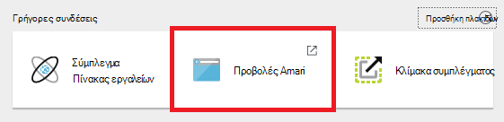
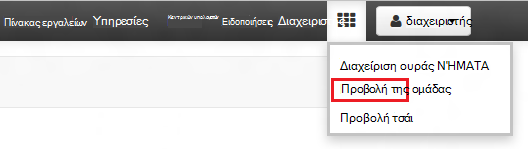
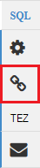
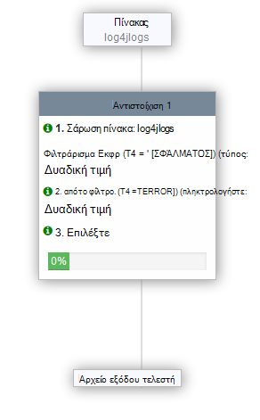

<properties
   pageTitle="Χρήση των προβολών Ambari για εργασία με ομάδα στο HDInsight (Hadoop) | Microsoft Azure"
   description="Μάθετε πώς μπορείτε να χρησιμοποιήσετε την προβολή Hive από το πρόγραμμα περιήγησης web για την υποβολή ερωτημάτων ομάδας. Στην προβολή Hive αποτελεί μέρος του Ambari περιβάλλοντος εργασίας Χρήστη Web που παρέχεται με το σύμπλεγμά σας βάσει Linux HDInsight."
   services="hdinsight"
   documentationCenter=""
   authors="Blackmist"
   manager="jhubbard"
   editor="cgronlun"
    tags="azure-portal"/>

<tags
   ms.service="hdinsight"
   ms.devlang="na"
   ms.topic="article"
   ms.tgt_pltfrm="na"
   ms.workload="big-data"
   ms.date="10/28/2016"
   ms.author="larryfr"/>

#Χρησιμοποιήστε την προβολή Hive με Hadoop σε HDInsight

[AZURE.INCLUDE [hive-selector](../../includes/hdinsight-selector-use-hive.md)]

Ambari είναι ένα διαχείρισης και παρακολούθησης βοηθητικού προγράμματος που παρέχεται με το HDInsight βάσει Linux συμπλεγμάτων. Μία από τις δυνατότητες που παρέχονται μέσω Ambari είναι ένα περιβάλλον εργασίας Χρήστη Web που μπορούν να χρησιμοποιηθούν για την εκτέλεση ερωτημάτων ομάδας. Αυτή είναι η __Προβολή Hive__, τμήμα των προβολών Ambari που παρέχεται με το σύμπλεγμά σας HDInsight.

> [AZURE.NOTE] Ambari έχει πολλές δυνατότητες που δεν είναι αναφέρονται σε αυτό το έγγραφο. Για περισσότερες πληροφορίες, ανατρέξτε στο θέμα [Διαχείριση HDInsight συμπλεγμάτων, χρησιμοποιώντας το Ambari Web UI](hdinsight-hadoop-manage-ambari.md).

##Προαπαιτούμενα στοιχεία

- Ένα σύμπλεγμα βάσει Linux HDInsight. Για πληροφορίες σχετικά με τη δημιουργία ενός νέου συμπλέγματος, ανατρέξτε στο θέμα [Γρήγορα αποτελέσματα με το HDInsight βάσει Linux](hdinsight-hadoop-linux-tutorial-get-started.md).

##Ανοίξτε την προβολή της ομάδας

Μπορείτε να κάνετε Ambari προβολές από την πύλη Azure; Επιλέξτε το σύμπλεγμά σας HDInsight και, στη συνέχεια, επιλέξτε __Ambari προβολές__ από την ενότητα __Γρήγορες συνδέσεις__ .

Μπορείτε να επίσης να μεταβείτε απευθείας στο Ambari μεταβαίνοντας στο https://CLUSTERNAME.azurehdinsight.net σε πρόγραμμα περιήγησης web (όπου __CLUSTERNAME__ είναι το όνομα του συμπλέγματος HDInsight) και, στη συνέχεια, επιλέξτε το σύνολο των τετραγώνων για τις από το μενού σελίδας (δίπλα στο κουμπί στην αριστερή πλευρά της σελίδας, και σύνδεση __διαχειριστή__ ) για να διαθέσιμες προβολές λίστας. Επιλέξτε την __Προβολή της ομάδας__.

.

> [AZURE.NOTE] Κατά την πρόσβαση Ambari, θα σας ζητηθεί να ελέγχουν την ταυτότητα της τοποθεσίας. Εισαγάγετε τον διαχειριστή (προεπιλεγμένη `admin`,) λογαριασμού όνομα και τον κωδικό πρόσβασης που χρησιμοποιήσατε κατά τη δημιουργία του συμπλέγματος.

Θα πρέπει να δείτε μια σελίδα που είναι παρόμοιο με το εξής:

##Προβολή πινάκων

Στην ενότητα __Εξερεύνηση βάσης δεδομένων__ της σελίδας, επιλέξτε την __προεπιλεγμένη__ καταχώρηση στην καρτέλα __βάσεις δεδομένων__ . Αυτό θα εμφανίσει μια λίστα με τους πίνακες στην προεπιλεγμένη βάση δεδομένων. Για ένα νέο σύμπλεγμα HDInsight, θα πρέπει να υπάρχει μόνο έναν πίνακα. __hivesampletable__.

Καθώς νέους πίνακες προστίθενται τα βήματα σε αυτό το έγγραφο, μπορείτε να χρησιμοποιήσετε το εικονίδιο "Ανανέωση" στην επάνω δεξιά γωνία της Εξερεύνησης βάσης δεδομένων για να ανανεώσετε τη λίστα των διαθέσιμων πινάκων.

##Πρόγραμμα επεξεργασίας ερωτήματος

Χρησιμοποιήστε τα ακόλουθα βήματα από την προβολή της ομάδας για να εκτελέσετε ένα ερώτημα Hive σε σχέση με δεδομένα που περιλαμβάνεται στο σύμπλεγμα.

1. Στην ενότητα __Πρόγραμμα επεξεργασίας ερωτήματος__ της σελίδας, επικολλήστε τις παρακάτω προτάσεις HiveQL στο φύλλο εργασίας:

        DROP TABLE log4jLogs;
        CREATE EXTERNAL TABLE log4jLogs(t1 string, t2 string, t3 string, t4 string, t5 string, t6 string, t7 string)
        ROW FORMAT DELIMITED FIELDS TERMINATED BY ' '
        STORED AS TEXTFILE LOCATION 'wasbs:///example/data/';
        SELECT t4 AS sev, COUNT(*) AS cnt FROM log4jLogs WHERE t4 = '[ERROR]' GROUP BY t4;

    Αυτές τις προτάσεις, εκτελέστε τις ακόλουθες ενέργειες:

    - **ΑΠΌΘΕΣΗ ΠΊΝΑΚΑ** - διαγράφει τον πίνακα και το αρχείο δεδομένων, σε περίπτωση που ο πίνακας υπάρχει ήδη.
    - **ΔΗΜΙΟΥΡΓΊΑ ΠΊΝΑΚΑ ΕΞΩΤΕΡΙΚΏΝ** - δημιουργεί ένα νέο πίνακα "εξωτερική" στην ομάδα. Εξωτερικοί πίνακες αποθηκεύουν μόνο τον ορισμό του πίνακα στην ομάδα; τα δεδομένα είναι προς τα αριστερά στην αρχική τους θέση.
    - **ΜΟΡΦΟΠΟΊΗΣΗ ΓΡΑΜΜΉΣ** - την ομάδα σας ενημερώνει για τον τρόπο μορφοποίησης των δεδομένων. Σε αυτήν την περίπτωση, τα πεδία σε κάθε αρχείο καταγραφής διαχωρίζονται από ένα διάστημα.
    - **ΑΠΟΘΗΚΕΥΜΈΝΑ ΩΣ TEXTFILE ΘΈΣΗ** - ενημερώνει Hive όπου τα δεδομένα που είναι αποθηκευμένη (τον κατάλογο/δεδομένα του παραδείγματος) και να έχει αποθηκευτεί ως κείμενο.
    - **ΕΠΙΛΈΞΤΕ** - επιλέγει μια μέτρηση όλων των γραμμών όπου Τ4 στήλη περιέχει την τιμή [ΣΦΆΛΜΑΤΟΣ].

    >[AZURE.NOTE] Εξωτερικοί πίνακες πρέπει να χρησιμοποιείται όταν θεωρείτε ότι τα υποκείμενα δεδομένα να ενημερωθεί από μια εξωτερική προέλευση, όπως μια διεργασία αποστολής αυτοματοποιημένη δεδομένων ή με μια άλλη MapReduce λειτουργία, αλλά θέλετε πάντα Hive ερωτημάτων για να χρησιμοποιήσετε τα πιο πρόσφατα δεδομένα. Απόθεση έναν εξωτερικό πίνακα κάνει *διαγράφει τα δεδομένα, μόνο τον ορισμό του πίνακα* .

2. Χρησιμοποιήστε το κουμπί " __Εκτέλεση__ " στο κάτω μέρος του προγράμματος επεξεργασίας ερωτήματος για να ξεκινήσετε το ερώτημα. Αυτό θα πρέπει να ενεργοποιήσει πορτοκαλί και το κείμενο θα αλλάξει για να __διακόψετε την εκτέλεση__. Μια ενότητα __Διαδικασία αποτελέσματα του ερωτήματος__ θα πρέπει να εμφανίζεται κάτω από το πρόγραμμα επεξεργασίας ερωτήματος και να εμφανίζετε πληροφορίες σχετικά με την εργασία.

    > [AZURE.IMPORTANT] Ορισμένα προγράμματα περιήγησης ενδέχεται να μην ανανεωθεί σωστά τις πληροφορίες καταγραφής ή τα αποτελέσματα. Εάν εκτελείτε μια εργασία και φαίνεται να λειτουργεί πάντα χωρίς να ενημερώσετε το αρχείο καταγραφής ή επιστρέφει αποτελέσματα, προσπαθήστε να χρησιμοποιήσετε Mozilla FireFox ή Google Chrome αντί για αυτό.

3. Μόλις ολοκληρωθεί το ερώτημα, στην ενότητα __Διαδικασία αποτελέσματα του ερωτήματος__ θα εμφανίζονται τα αποτελέσματα της λειτουργίας. Το κουμπί __Διακοπή εκτέλεσης__ θα αλλάξει επίσης πίσω σε ένα πράσινο κουμπί __Execute__ . Στην καρτέλα __αποτελέσματα__ θα πρέπει να περιέχει τις ακόλουθες πληροφορίες:

        sev       cnt
        [ERROR]   3

    Στην καρτέλα __αρχεία καταγραφής__ μπορεί να χρησιμοποιηθεί για να προβάλετε τις πληροφορίες σύνδεσης που δημιουργείται από την εργασία. Μπορείτε να το χρησιμοποιήσετε για την αντιμετώπιση προβλημάτων εάν υπάρχουν προβλήματα με ένα ερώτημα.

    > [AZURE.TIP] Παράθυρο διαλόγου Σημείωση __Αποθήκευση αποτελεσμάτων__ αναπτυσσόμενο μενού επάνω αριστερά της ενότητας __Διαδικασία αποτελέσματα του ερωτήματος__ ; Μπορείτε να χρησιμοποιήσετε αυτό να κάνετε λήψη των αποτελεσμάτων, ή να αποθηκεύσετε τους με το χώρο αποθήκευσης HDInsight ως αρχείο CSV.

3. Επιλέξτε τις πρώτες τέσσερις γραμμές αυτού του ερωτήματος και, στη συνέχεια, επιλέξτε __Εκτέλεση__. Παρατηρήστε ότι δεν υπάρχουν αποτελέσματα όταν ολοκληρωθεί η εργασία. Αυτό συμβαίνει επειδή χρησιμοποιώντας το κουμπί __Execute__ όταν είναι επιλεγμένο το τμήμα του ερωτήματος θα εκτελεστεί μόνο τις προτάσεις επιλεγμένο. Σε αυτήν την περίπτωση, η επιλογή δεν περιλαμβάνει την τελική πρόταση που ανακτά γραμμές από τον πίνακα. Εάν επιλέξετε μόνο αυτήν τη γραμμή και χρησιμοποιήστε __Execute__, θα πρέπει να βλέπετε τα αναμενόμενα αποτελέσματα.

3. Χρησιμοποιήστε το κουμπί __Νέο φύλλο εργασίας__ στο κάτω μέρος του προγράμματος __Επεξεργασίας ερωτήματος__ για να δημιουργήσετε ένα νέο φύλλο εργασίας. Στο νέο φύλλο εργασίας, καταχωρήστε τις παρακάτω προτάσεις HiveQL:

        CREATE TABLE IF NOT EXISTS errorLogs (t1 string, t2 string, t3 string, t4 string, t5 string, t6 string, t7 string) STORED AS ORC;
        INSERT OVERWRITE TABLE errorLogs SELECT t1, t2, t3, t4, t5, t6, t7 FROM log4jLogs WHERE t4 = '[ERROR]';

    Αυτές τις προτάσεις, εκτελέστε τις ακόλουθες ενέργειες:

    - **ΔΗΜΙΟΥΡΓΊΑ ΠΊΝΑΚΑΣ IF δεν ΥΠΆΡΧΕΙ** - δημιουργεί έναν πίνακα, εάν δεν υπάρχει ήδη. Εφόσον δεν χρησιμοποιείται το **ΕΞΩΤΕΡΙΚΌ** λέξεων-κλειδιών, αυτή είναι μια εσωτερική πίνακα, το οποίο είναι αποθηκευμένο στην ομάδα αποθήκη δεδομένων και γίνεται εντελώς από ομάδα. Σε αντίθεση με εξωτερική πίνακες, απόθεση ενός πίνακα του εσωτερικού θα διαγράψει καθώς και τα υποκείμενα δεδομένα.
    - **ΑΠΟΘΗΚΕΥΜΈΝΑ ΩΣ ORC** - αποθηκεύει τα δεδομένα σε μορφή βελτιστοποιημένη σε στήλες γραμμής (ORC). Αυτή είναι μια μορφή ιδιαίτερα βελτιστοποιημένη και αποτελεσματική για την αποθήκευση δεδομένων ομάδας.
    - ΑΝΤΙΚΑΤΆΣΤΑΣΗ **Εισαγωγή... ΕΠΙΛΈΞΤΕ** - επιλέγει γραμμές από τον πίνακα **log4jLogs** που περιέχουν [ΣΦΆΛΜΑΤΟΣ] και, στη συνέχεια, εισάγει τα δεδομένα στον πίνακα **errorLogs** .

    Χρησιμοποιήστε το κουμπί " __Εκτέλεση__ " για να εκτελέσετε αυτό το ερώτημα. Στην καρτέλα __αποτελέσματα__ δεν θα περιέχει τις πληροφορίες, καθώς υπάρχουν γραμμές που επιστρέφονται από αυτό το ερώτημα, αλλά θα πρέπει να εμφανίζουν την κατάσταση ως __ολοκληρώθηκε με__.

###Ρυθμίσεις ομάδας

Επιλέξτε το εικονίδιο __Ρυθμίσεις__ στη δεξιά πλευρά του προγράμματος επεξεργασίας.

Ρυθμίσεις μπορούν να χρησιμοποιηθούν για να αλλάξετε διάφορες ρυθμίσεις της ομάδας, όπως να αλλάξετε το μηχανισμό εκτέλεσης για ομάδας από Tez (η προεπιλογή), για να MapReduce.

###Οπτική εξηγούν

Επιλέξτε το εικονίδιο __Οπτική εξηγούν__ στη δεξιά πλευρά του προγράμματος επεξεργασίας.

Αυτή είναι η προβολή __Οπτικών εξηγούν__ από το ερώτημα, το οποίο μπορεί να είναι χρήσιμο στην κατανόηση της ροής σύνθετων ερωτημάτων. Μπορείτε να προβάλετε μια ισοδύναμη που περιέχουν κείμενο με αυτήν την προβολή, χρησιμοποιώντας το κουμπί __Επεξήγηση__ στο πρόγραμμα επεξεργασίας ερωτήματος.

###Tez

Επιλέξτε το εικονίδιο __Tez__ στη δεξιά πλευρά του προγράμματος επεξεργασίας.

Αυτό θα εμφανίσει το κατευθύνεται μη κυκλικό Graph (DAG) χρησιμοποιείται από Tez, για αυτό το ερώτημα, εάν είναι διαθέσιμο. Εάν θέλετε να προβάλετε το DAG για ερωτήματα έχετε εκτελέσατε στο παρελθόν ή ο εντοπισμός σφαλμάτων τη διαδικασία Tez, χρήση της [Προβολής Tez](hdinsight-debug-ambari-tez-view.md) αντί για αυτό.

###Ειδοποιήσεις

Επιλέξτε το εικονίδιο __ειδοποιήσεων__ στη δεξιά πλευρά του προγράμματος επεξεργασίας.

Οι ειδοποιήσεις είναι μηνύματα που δημιουργούνται κατά την εκτέλεση ερωτημάτων. Για παράδειγμα, θα λάβετε μια ειδοποίηση κατά την υποβολή ερωτήματος ή όταν παρουσιάζεται ένα σφάλμα.

##Αποθηκευμένα ερωτήματα

1. Από το πρόγραμμα επεξεργασίας ερωτήματος, δημιουργήστε ένα νέο φύλλο εργασίας και εισαγάγετε το ακόλουθο ερώτημα:

        SELECT * from errorLogs;

    Εκτέλεση του ερωτήματος για να επαληθεύσετε ότι λειτουργεί. Τα αποτελέσματα θα είναι ως εξής:

        errorlogs.t1    errorlogs.t2    errorlogs.t3    errorlogs.t4    errorlogs.t5    errorlogs.t6    errorlogs.t7
        2012-02-03  18:35:34    SampleClass0    [ERROR]     incorrect   id  
        2012-02-03  18:55:54    SampleClass1    [ERROR]     incorrect   id  
        2012-02-03  19:25:27    SampleClass4    [ERROR]     incorrect   id

2. Χρησιμοποιήστε το κουμπί " __Αποθήκευση ως__ " στο κάτω μέρος του προγράμματος επεξεργασίας. Ονομάστε το ερώτημα __Errorlogs__ και επιλέξτε __OK__. Σημειώστε ότι το όνομα του φύλλου εργασίας αλλάζει σε __Errorlogs__.

3. Επιλέξτε την καρτέλα __Αποθήκευση ερωτημάτων__ στο επάνω μέρος της σελίδας Hive προβολή. Σημειώστε ότι __Errorlogs__ εμφανίζεται πλέον ως ένα αποθηκευμένο ερώτημα. Θα παραμείνει σε αυτήν τη λίστα μέχρι να την καταργήσετε. Επιλέγοντας το όνομα της θα ανοίξει το ερώτημα στο πρόγραμμα επεξεργασίας ερωτήματος.

##Ιστορικό ερωτήματος

Το κουμπί " __ιστορικό__ " στο επάνω μέρος της προβολής Hive σας επιτρέπει να προβολή ερωτημάτων που έχετε εκτελέσατε προηγουμένως. Χρησιμοποιήστε τον τώρα και επιλέξτε ορισμένα από τα ερωτήματα που έχουν προηγουμένως εκτελέσατε. Όταν επιλέγετε ένα ερώτημα, ανοίγει το στο πρόγραμμα επεξεργασίας ερωτήματος.

##Συναρτήσεις (UDF) ορίζονται από το χρήστη

Ομάδα μπορεί επίσης να επεκταθεί στις **συναρτήσεις που ορίζονται από το χρήστη (UDF)**. Ένα αρχείο UDF σάς επιτρέπει να εφαρμόζετε λειτουργικότητα ή λογικής που δεν είναι εύκολα μοντελοποιηθεί στον HiveQL.

Ενώ μπορείτε να προσθέσετε μια UDF ως μέρος των καταστάσεων HiveQL στο ερώτημά σας, στην καρτέλα UDF στο επάνω μέρος της προβολής Hive σάς επιτρέπει να δηλώνουν και να αποθηκεύσετε ένα σύνολο UDF που μπορούν να χρησιμοποιηθούν με το πρόγραμμα __Επεξεργασίας ερωτήματος__.

Αφού προσθέσετε μια UDF στην προβολή "Hive", ένα κουμπί __Εισαγωγή udfs__ θα εμφανίζεται στο κάτω μέρος του προγράμματος __Επεξεργασίας ερωτήματος__. Η επιλογή αυτή θα εμφανίσει μια αναπτυσσόμενη λίστα από το UDF που ορίζονται από το στην προβολή "Hive". Επιλογή ενός UDF θα προσθέσει δηλώσεις HiveQL στο ερώτημά σας για να ενεργοποιήσετε το UDF.

Για παράδειγμα, εάν έχετε ορίσει μια UDF με τις ακόλουθες ιδιότητες:

* Όνομα πόρου: myudfs
* Διαδρομή πόρων: wasbs:///myudfs.jar
* Όνομα UDF: myawesomeudf
* Όνομα κλάσης UDF: com.myudfs.Awesome

Χρησιμοποιώντας το κουμπί __Εισαγωγή udfs__ θα εμφανίσει μια καταχώρηση που ονομάζεται __myudfs__, με μια άλλη αναπτυσσόμενη για κάθε UDF που ορίζονται για αυτόν τον πόρο. Σε αυτήν την περίπτωση, __myawesomeudf__. Η επιλογή αυτή την καταχώρηση θα προσθέσει τα εξής στην αρχή του ερωτήματος:

    add jar wasbs:///myudfs.jar;

    create temporary function myawesomeudf as 'com.myudfs.Awesome';

Στη συνέχεια, μπορείτε να χρησιμοποιήσετε το UDF στο ερώτημά σας. Για παράδειγμα, `SELECT myawesomeudf(name) FROM people;`.

Για περισσότερες πληροφορίες σχετικά με τη χρήση UDF με ομάδα στο HDInsight, ανατρέξτε στα παρακάτω:

* [Χρήση Python με ομάδα και γουρούνι στο HDInsight](hdinsight-python.md)

* [Πώς μπορείτε να προσθέσετε ένα προσαρμοσμένο UDF Hive με το HDInsight](http://blogs.msdn.com/b/bigdatasupport/archive/2014/01/14/how-to-add-custom-hive-udfs-to-hdinsight.aspx)

##Επόμενα βήματα

Για γενικές πληροφορίες σχετικά με ομάδα στο HDInsight:

* [Χρήση της ομάδας με Hadoop σε HDInsight](hdinsight-use-hive.md)

Για πληροφορίες σχετικά με άλλους τρόπους μπορείτε να εργαστείτε με Hadoop σε HDInsight:

* [Χρήση γουρούνι με Hadoop σε HDInsight](hdinsight-use-pig.md)

* [Χρήση MapReduce με Hadoop σε HDInsight](hdinsight-use-mapreduce.md)
