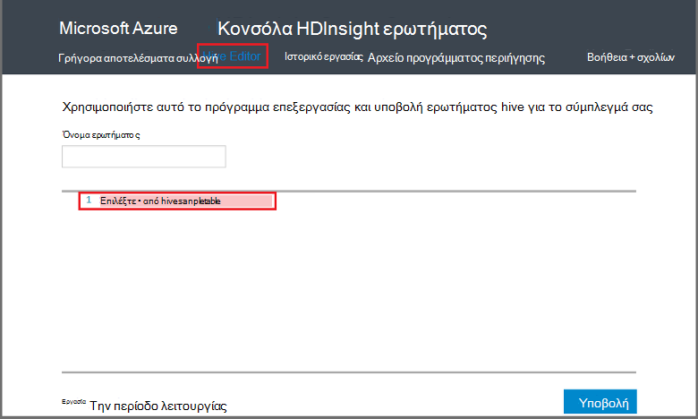

<properties
   pageTitle="Χρήση της ομάδας Hadoop στην κονσόλα του ερωτήματος στο HDInsight | Microsoft Azure"
   description="Μάθετε πώς μπορείτε να χρησιμοποιήσετε την κονσόλα ερωτήματος βασίζεται στο web για την εκτέλεση ερωτημάτων ομάδας σε ένα σύμπλεγμα HDInsight Hadoop από το πρόγραμμα περιήγησης."
   services="hdinsight"
   documentationCenter=""
   authors="Blackmist"
   manager="jhubbard"
   editor="cgronlun"
    tags="azure-portal"/>

<tags
   ms.service="hdinsight"
   ms.devlang="na"
   ms.topic="article"
   ms.tgt_pltfrm="na"
   ms.workload="big-data"
   ms.date="09/20/2016"
   ms.author="larryfr"/>

# Εκτέλεση ερωτημάτων Hive χρησιμοποιώντας την κονσόλα ερωτήματος

[AZURE.INCLUDE [hive-selector](../../includes/hdinsight-selector-use-hive.md)]

Σε αυτό το άρθρο, θα μάθετε πώς να χρησιμοποιείτε την κονσόλα ερωτήματος HDInsight για την εκτέλεση ερωτημάτων ομάδας σε ένα σύμπλεγμα HDInsight Hadoop από το πρόγραμμα περιήγησης.

> [AZURE.IMPORTANT] Κονσόλα ερωτήματος HDInsight είναι διαθέσιμη μόνο σε συμπλεγμάτων HDInsight που βασίζεται στα Windows. Εάν χρησιμοποιείτε ένα σύμπλεγμα βάσει Linux HDInsight, ανατρέξτε στο θέμα [Εκτέλεση Hive ερωτήματα με την προβολή της ομάδας](hdinsight-hadoop-use-hive-ambari-view.md).

##Προαπαιτούμενα στοιχεία

Για να ολοκληρώσετε τα βήματα σε αυτό το άρθρο, θα χρειαστείτε τα εξής.

* Ένα σύμπλεγμα HDInsight Hadoop που βασίζεται σε Windows

* Ένα πρόγραμμα περιήγησης web σύγχρονα

##Εκτέλεση ερωτημάτων Hive χρησιμοποιώντας την κονσόλα ερωτήματος

1. Ανοίξτε ένα πρόγραμμα περιήγησης web και μεταβείτε σε __https://CLUSTERNAME.azurehdinsight.net__, όπου __CLUSTERNAME__ είναι το όνομα του συμπλέγματος HDInsight. Εάν σας ζητηθεί, πληκτρολογήστε το όνομα χρήστη και τον κωδικό πρόσβασης που χρησιμοποιήσατε κατά τη δημιουργία του συμπλέγματος.

2. Από τις συνδέσεις στο επάνω μέρος της σελίδας, επιλέξτε **Την ομάδα επεξεργασίας**. Αυτό εμφανίζει μια φόρμα που μπορούν να χρησιμοποιηθούν για να εισαγάγετε τις προτάσεις HiveQL που θέλετε να εκτελέσετε στο σύμπλεγμα HDInsight.

    

    Αντικαταστήστε το κείμενο `Select * from hivesampletable` με τις παρακάτω προτάσεις HiveQL:

        set hive.execution.engine=tez;
        DROP TABLE log4jLogs;
        CREATE EXTERNAL TABLE log4jLogs (t1 string, t2 string, t3 string, t4 string, t5 string, t6 string, t7 string)
        ROW FORMAT DELIMITED FIELDS TERMINATED BY ' '
        STORED AS TEXTFILE LOCATION 'wasbs:///example/data/';
        SELECT t4 AS sev, COUNT(*) AS count FROM log4jLogs WHERE t4 = '[ERROR]' AND INPUT__FILE__NAME LIKE '%.log' GROUP BY t4;

    Αυτές τις προτάσεις, εκτελέστε τις ακόλουθες ενέργειες:

    * **ΑΠΌΘΕΣΗ ΠΊΝΑΚΑ**: Διαγράφει τον πίνακα και το αρχείο δεδομένων, εάν ο πίνακας υπάρχει ήδη.
    * **ΔΗΜΙΟΥΡΓΊΑ ΕΞΩΤΕΡΙΚΉΣ ΠΊΝΑΚΑ**: δημιουργεί ένα νέο πίνακα 'εξωτερικό' στην ομάδα. Εξωτερικοί πίνακες αποθηκεύουν μόνο τον ορισμό του πίνακα στην ομάδα; τα δεδομένα είναι προς τα αριστερά στην αρχική τους θέση.

    > [AZURE.NOTE] Εξωτερικοί πίνακες πρέπει να χρησιμοποιείται όταν θεωρείτε ότι τα υποκείμενα δεδομένα για να ενημερωθούν από μια εξωτερική προέλευση (όπως μια διεργασία αποστολής αυτοματοποιημένη δεδομένων) ή από μια άλλη λειτουργία MapReduce, αλλά θέλετε πάντα Hive ερωτημάτων για να χρησιμοποιήσετε τα πιο πρόσφατα δεδομένα.
    >
    > Απόθεση έναν εξωτερικό πίνακα κάνει **διαγράφει τα δεδομένα, μόνο τον ορισμό του πίνακα** .

    * **ΜΟΡΦΟΠΟΊΗΣΗ ΓΡΑΜΜΉΣ**: ενημερώνει Hive τον τρόπο μορφοποίησης των δεδομένων. Σε αυτήν την περίπτωση, τα πεδία σε κάθε αρχείο καταγραφής διαχωρίζονται από ένα διάστημα.
    * **ΑΠΟΘΗΚΕΥΜΈΝΑ ΩΣ TEXTFILE ΘΈΣΗ**: ενημερώνει Hive όπου τα δεδομένα που είναι αποθηκευμένα (τον κατάλογο/δεδομένα του παραδείγματος) και που είναι αποθηκευμένο ως κείμενο
    * **ΕΠΙΛΟΓΉ**: Επιλέξτε ένα πλήθος όλων των γραμμών όπου στήλη **Τ4** περιέχουν την τιμή **[ERROR]**. Αυτό πρέπει να επιστρέψει μια τιμή **3** , επειδή υπάρχουν τρεις γραμμές που περιέχουν αυτήν την τιμή.
    * **INPUT__FILE__NAME ΌΠΩΣ '%.log'** - σας ενημερώνει για την ομάδα που θα σας πρέπει να επιστρέφει μόνο δεδομένα από αρχεία που τελειώνει σε. καταγραφής. Περιορίζει την αναζήτηση στο αρχείο sample.log που περιέχει τα δεδομένα, και επιστρέφει δεδομένα από άλλα παράδειγμα αρχεία δεδομένων που δεν συμφωνεί με το σχήμα ορίσαμε.

2. Κάντε κλικ στην επιλογή **Υποβολή**. Η **Εργασία περιόδου λειτουργίας** στο κάτω μέρος της σελίδας θα πρέπει να εμφανίζει λεπτομέρειες για το έργο.

3. Όταν το πεδίο **Status** αλλάζει σε **ολοκληρωμένο**, επιλέξτε **Προβολή λεπτομερειών** για την εργασία. Στη σελίδα λεπτομέρειες, το **Αποτέλεσμα του έργου** περιλαμβάνει `[ERROR]   3`. Μπορείτε να χρησιμοποιήσετε το κουμπί " **λήψη** " κάτω από αυτό το πεδίο για να κάνετε λήψη ενός αρχείου που περιέχει τα αποτελέσματα της εργασίας.

##Σύνοψη

Όπως μπορείτε να δείτε την κονσόλα ερωτήματος παρέχει ένας εύκολος τρόπος για την εκτέλεση ερωτημάτων ομάδας σε ένα σύμπλεγμα HDInsight, παρακολουθείτε την κατάσταση της εργασίας και ανάκτησης το αποτέλεσμα.

Για να μάθετε περισσότερα σχετικά με τη χρήση Hive κονσόλας ερωτήματος για να εκτελέσετε εργασίες ομάδας, επιλέξτε **Γρήγορα αποτελέσματα** στο επάνω μέρος της κονσόλας του ερωτήματος και, στη συνέχεια, χρησιμοποιήστε τα δείγματα που παρέχονται. Κάθε δείγμα σας καθοδηγεί κατά τη διαδικασία της χρήσης της ομάδας για την ανάλυση δεδομένων, συμπεριλαμβανομένων των εξηγήσεις σχετικά με τις προτάσεις HiveQL χρησιμοποιούνται στο δείγμα.

##Επόμενα βήματα

Για γενικές πληροφορίες σχετικά με την ομάδα του HDInsight:

* [Χρήση της ομάδας με Hadoop σε HDInsight](hdinsight-use-hive.md)

Για πληροφορίες σχετικά με άλλους τρόπους μπορείτε να εργαστείτε με Hadoop σε HDInsight:

* [Χρήση γουρούνι με Hadoop σε HDInsight](hdinsight-use-pig.md)

* [Χρήση MapReduce με Hadoop σε HDInsight](hdinsight-use-mapreduce.md)

Εάν χρησιμοποιείτε Tez με ομάδα, δείτε τα ακόλουθα έγγραφα για τον εντοπισμό σφαλμάτων πληροφορίες:

* [Χρήση του περιβάλλοντος εργασίας Χρήστη του Tez σε HDInsight που βασίζεται σε Windows](hdinsight-debug-tez-ui.md)

* [Χρήση της προβολής Ambari Tez σε βάσει Linux HDInsight](hdinsight-debug-ambari-tez-view.md)

[1]: ../HDInsight/hdinsight-hadoop-visual-studio-tools-get-started.md

[hdinsight-sdk-documentation]: http://msdnstage.redmond.corp.microsoft.com/library/dn479185.aspx

[azure-purchase-options]: http://azure.microsoft.com/pricing/purchase-options/
[azure-member-offers]: http://azure.microsoft.com/pricing/member-offers/
[azure-free-trial]: http://azure.microsoft.com/pricing/free-trial/

[apache-tez]: http://tez.apache.org
[apache-hive]: http://hive.apache.org/
[apache-log4j]: http://en.wikipedia.org/wiki/Log4j
[hive-on-tez-wiki]: https://cwiki.apache.org/confluence/display/Hive/Hive+on+Tez
[import-to-excel]: http://azure.microsoft.com/documentation/articles/hdinsight-connect-excel-power-query/

[hdinsight-use-oozie]: hdinsight-use-oozie.md
[hdinsight-analyze-flight-data]: hdinsight-analyze-flight-delay-data.md

[hdinsight-storage]: hdinsight-hadoop-use-blob-storage.md

[hdinsight-provision]: hdinsight-provision-clusters.md
[hdinsight-submit-jobs]: hdinsight-submit-hadoop-jobs-programmatically.md
[hdinsight-upload-data]: hdinsight-upload-data.md
[hdinsight-get-started]: hdinsight-hadoop-linux-tutorial-get-started.md

[Powershell-install-configure]: powershell-install-configure.md
[powershell-here-strings]: http://technet.microsoft.com/library/ee692792.aspx

[img-hdi-hive-powershell-output]: ./media/hdinsight-use-hive/HDI.Hive.PowerShell.Output.png
