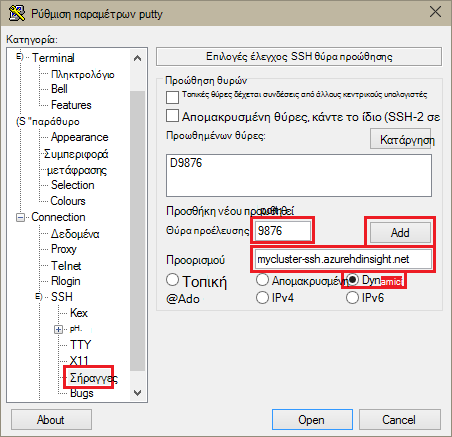
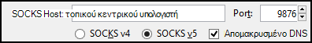
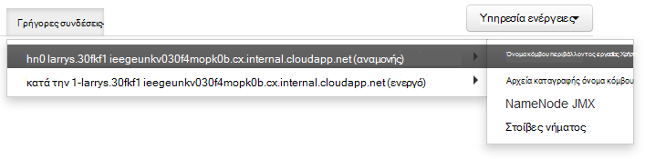

<properties
pageTitle="Χρησιμοποιείτε SSH διοχέτευση για πρόσβαση στο web Ambari περιβάλλοντος εργασίας Χρήστη, ResourceManager, JobHistory, NameNode, Oozie και άλλα της τοποθεσίας web περιβάλλοντος εργασίας Χρήστη"
description="Μάθετε πώς μπορείτε να χρησιμοποιήσετε μια διοχέτευση SSH για να αναζητήσετε ασφαλή πόροι web που φιλοξενούνται από το κόμβους βάσει Linux HDInsight."
services="hdinsight"
documentationCenter=""
authors="Blackmist"
manager="jhubbard"
editor="cgronlun"/>

<tags
ms.service="hdinsight"
ms.devlang="na"
ms.topic="article"
ms.tgt_pltfrm="na"
ms.workload="big-data"
ms.date="10/17/2016"
ms.author="larryfr"/>

# Χρησιμοποιείτε SSH διοχέτευση για πρόσβαση στο web Ambari περιβάλλοντος εργασίας Χρήστη, JobHistory, NameNode, Oozie και άλλα της τοποθεσίας web περιβάλλοντος εργασίας Χρήστη

Βάσει Linux συμπλεγμάτων HDInsight παρέχουν πρόσβαση σε Ambari web περιβάλλοντος εργασίας Χρήστη μέσω του Internet, αλλά ορισμένες δυνατότητες του περιβάλλοντος εργασίας Χρήστη του δεν είναι. Για παράδειγμα, το περιβάλλον εργασίας Χρήστη web για άλλες υπηρεσίες που διαθέτουν επιφάνεια μέσω Ambari. Για την πλήρη λειτουργικότητα του web Ambari περιβάλλοντος εργασίας Χρήστη, πρέπει να χρησιμοποιήσετε μια διοχέτευση SSH στην κεφαλίδα σύμπλεγμα.

## Τι απαιτεί διοχέτευση SSH;

Πολλά από τα μενού στο Ambari θα δεν πλήρως τη συμπλήρωση χωρίς διοχέτευση SSH, κατά την οποία βασίζονται για τοποθεσίες web και των υπηρεσιών που εκτίθεται από άλλες υπηρεσίες Hadoop εκτελείται στο σύμπλεγμα. Συχνά, αυτές οι τοποθεσίες web είναι δεν ασφαλής, επομένως δεν είναι ασφαλείς για να τους εμφανίσετε απευθείας στο internet. Μερικές φορές η υπηρεσία εκτελείται την τοποθεσία web με άλλον κόμβο συμπλέγματος όπως έναν κόμβο Zookeeper.

Οι παρακάτω είναι υπηρεσίες που χρησιμοποιεί Ambari web περιβάλλοντος εργασίας Χρήστη, οι οποίες δεν είναι δυνατή η πρόσβαση χωρίς διοχέτευση SSH:

* JobHistory,
* NameNode,
* Στοίβες νήμα,
* Oozie web περιβάλλοντος εργασίας Χρήστη
* Υπόδειγμα HBase και αρχεία καταγραφής περιβάλλοντος εργασίας Χρήστη

Εάν χρησιμοποιείτε ενέργειες δέσμης ενεργειών για να προσαρμόσετε το σύμπλεγμά σας, τις υπηρεσίες ή βοηθητικά προγράμματα που μπορείτε να εγκαταστήσετε, που εκθέτουν web περιβάλλοντος εργασίας Χρήστη θα χρειαστεί διοχέτευση SSH. Για παράδειγμα, εάν εγκαταστήσετε απόχρωση χρησιμοποιώντας μια ενέργεια δέσμης ενεργειών, πρέπει να χρησιμοποιείτε ένα σωλήνα SSH για να αποκτήσετε πρόσβαση στο web απόχρωση περιβάλλοντος εργασίας Χρήστη.

## Τι είναι μια διοχέτευση SSH;

[Διοχέτευση ασφαλούς κελύφους (SSH)](https://en.wikipedia.org/wiki/Tunneling_protocol#Secure_Shell_tunneling) δρομολογεί την κίνηση που αποστέλλονται σε μια θύρα του τοπικού σταθμούς εργασίας, μέσω μιας σύνδεσης SSH για να σας κεφαλής κόμβο συμπλέγματος HDInsight, όπου η αίτηση επιλύεται, στη συνέχεια, σαν να δημιουργήθηκε στον κόμβο κεφαλής. Η απόκριση δρομολογείται, στη συνέχεια, επιστρέψετε μέσω της διοχέτευσης για να σας σταθμούς εργασίας.

## Προαπαιτούμενα στοιχεία

Όταν χρησιμοποιείτε ένα σωλήνα SSH για την κίνηση web, πρέπει να έχετε τα εξής:

* Ένα πρόγραμμα-πελάτη SSH. Για διανομή Linux και Unix ή Macintosh OS X, το `ssh` εντολή παρέχεται με το λειτουργικό σύστημα. Για Windows, συνιστάται να [PuTTY](http://www.chiark.greenend.org.uk/~sgtatham/putty/download.html)

    > [AZURE.NOTE] Εάν θέλετε να χρησιμοποιήσετε ένα πρόγραμμα-πελάτη SSH εκτός από `ssh` ή PuTTY, ανατρέξτε στην τεκμηρίωση για το πρόγραμμα-πελάτη σχετικά με τον τρόπο για να επιτύχετε διοχέτευση SSH.

* Ένα πρόγραμμα περιήγησης web που μπορούν να ρυθμιστούν για να χρησιμοποιήσετε ένα διακομιστή μεσολάβησης SOCKS

## Δημιουργήστε μια διοχέτευση χρησιμοποιώντας την εντολή SSH

Χρησιμοποιήστε την παρακάτω εντολή για να δημιουργήσετε μια SSH διοχέτευσης χρησιμοποιώντας το `ssh` εντολή. Αντικαταστήστε το __όνομα ΧΡΉΣΤΗ__ με έναν χρήστη SSH για το σύμπλεγμα HDInsight και αντικαταστήστε __CLUSTERNAME__ με το όνομα του συμπλέγματος HDInsight

    ssh -C2qTnNf -D 9876 USERNAME@CLUSTERNAME-ssh.azurehdinsight.net

Αυτό δημιουργεί μια σύνδεση που δρομολογεί την κίνηση σε τοπική θύρα 9876 στο σύμπλεγμα μέσω SSH. Οι επιλογές είναι:

* **D 9876** - την τοπική θύρα που θα δρομολογείτε την κίνηση μέσω της διοχέτευσης.

* **C** - συμπίεση όλα τα δεδομένα, επειδή η κυκλοφορία web είναι κυρίως κείμενο.

* **2** - ισχύ SSH για να δοκιμάσετε πρωτόκολλο έκδοση 2.

* **οι ερωτήσεις** - λειτουργία χωρίς μηνύματα.

* **T** - απενεργοποίηση ψευδο-tty εκχώρησης, επειδή θα προωθήσουμε απλώς μια θύρα.

* **n** - αποτροπή ανάγνωσης του STDIN, επειδή θα προωθήσουμε απλώς μια θύρα.

* **N** - δεν να εκτελέσετε μια εντολή απομακρυσμένου, επειδή θα προωθήσουμε απλώς μια θύρα.

* **f** - εκτελείται στο παρασκήνιο.

Εάν έχετε ρυθμίσει το σύμπλεγμα με έναν αριθμό-κλειδί SSH, ίσως χρειαστεί Χρησιμοποιήστε το `-i` παραμέτρου και καθορίστε τη διαδρομή προς το ιδιωτικό κλειδί SSH.

Μόλις ολοκληρωθεί η εντολή, κυκλοφορία αποστέλλεται στη θύρα 9876 στον τοπικό υπολογιστή θα δρομολογούνται μέσω Secure Sockets Layer (SSL) στο σύμπλεγμα κεντρικών κόμβο και φαίνεται ότι προέρχονται εκεί.

## Δημιουργήστε μια διοχέτευση χρησιμοποιώντας PuTTY

Χρησιμοποιήστε τα ακόλουθα βήματα για να δημιουργήσετε μια διοχέτευση SSH χρησιμοποιώντας PuTTY.

1. Ανοίξτε PuTTY και εισαγάγετε τις πληροφορίες σύνδεσης. Εάν δεν είστε εξοικειωμένοι με PuTTY, ανατρέξτε στο θέμα [Χρήση SSH με βάσει Linux Hadoop σε HDInsight από το Windows](hdinsight-hadoop-linux-use-ssh-windows.md) για πληροφορίες σχετικά με το πώς μπορείτε να το χρησιμοποιήσετε με το HDInsight.

2. Στην ενότητα " **κατηγορία** " στα αριστερά του παραθύρου διαλόγου, ανάπτυξη **σύνδεσης**, αναπτύξτε **SSH**και, στη συνέχεια, επιλέξτε **σήραγγες**.

3. Δώστε τις ακόλουθες πληροφορίες στη φόρμα **Έλεγχος προώθηση θυρών SSH επιλογές** :

    * **Θύρα προέλευσης** - στη θύρα του υπολογιστή-πελάτη που θέλετε να προωθήσετε. Για παράδειγμα, **9876**.

    * **Προορισμός** - το SSH διεύθυνση για το σύμπλεγμα βάσει Linux HDInsight. Για παράδειγμα, **mycluster ssh.azurehdinsight.net**.

    * **Δυναμική** - ενεργοποιεί τη δρομολόγηση δυναμικής διακομιστή μεσολάβησης SOCKS.

    

4. Κάντε κλικ στο κουμπί **Προσθήκη** για να προσθέσετε τις ρυθμίσεις και, στη συνέχεια, κάντε κλικ στην επιλογή **Άνοιγμα** για να ανοίξετε μια σύνδεση SSH.

5. Όταν σας ζητηθεί, συνδεθείτε στο διακομιστή. Θα δημιουργήσετε μια περίοδο λειτουργίας SSH και ενεργοποίηση της διοχέτευσης.

## Χρήση της διοχέτευσης από το πρόγραμμα περιήγησης

> [AZURE.NOTE] Τα βήματα σε αυτήν την ενότητα, χρησιμοποιήστε το πρόγραμμα περιήγησης FireFox, όπως είναι διαθέσιμα για συστήματα Linux, Unix, Macintosh OS X και Windows. Άλλα σύγχρονα προγράμματα περιήγησης που υποστηρίζει τη χρήση ενός διακομιστή μεσολάβησης SOCKS λειτουργούν επίσης.

1. Ρυθμίστε τις παραμέτρους του προγράμματος περιήγησης για να χρησιμοποιήσετε **localhost:9876** ως ένα διακομιστή μεσολάβησης **SOCKS v5** . Παρακάτω θα δείτε πώς φαίνονται οι ρυθμίσεις Firefox. Εάν χρησιμοποιείτε μια διαφορετική θύρα από 9876, αλλάξτε τη θύρα σε αυτόν που χρησιμοποιήσατε:

    

    > [AZURE.NOTE] Επιλογή **Απομακρυσμένο DNS** επιλύει αιτήσεις συστήματος ονομάτων τομέα (DNS) με τη χρήση του συμπλέγματος HDInsight. Εάν αυτό δεν είναι επιλεγμένο, θα επιλυθεί τοπικά DNS.

2. Επαληθεύστε ότι κίνηση δρομολογούνται μέσω της διοχέτευσης από vising μιας τοποθεσίας, όπως [http://www.whatismyip.com/](http://www.whatismyip.com/) με τις ρυθμίσεις διακομιστή μεσολάβησης ενεργοποιείται και απενεργοποιείται στο Firefox. Ενώ οι ρυθμίσεις είναι ενεργοποιημένες, θα είναι η διεύθυνση IP για έναν υπολογιστή στο κέντρο δεδομένων Microsoft Azure.

##Επαλήθευση με Ambari web περιβάλλοντος εργασίας Χρήστη

Αφού έχει δημιουργηθεί στο σύμπλεγμα, χρησιμοποιήστε τα ακόλουθα βήματα για να επαληθεύσετε ότι έχετε πρόσβαση σε υπηρεσία web περιβάλλοντα εργασίας χρήστη από το Ambari Web:

1. Στο πρόγραμμα περιήγησης, μεταβείτε στη http://headnodehost:8080. Το `headnodehost` διεύθυνση θα σταλεί μέσω της διοχέτευσης στο σύμπλεγμα και επίλυση για να το headnode που εκτελείται σε Ambari. Όταν σας ζητηθεί, πληκτρολογήστε το όνομα χρήστη του διαχειριστή (διαχειριστές) και τον κωδικό πρόσβασης για το σύμπλεγμά σας. Ενδέχεται να εμφανιστεί μια δεύτερη φορά από το web Ambari περιβάλλοντος εργασίας Χρήστη. Εάν Ναι, εισαγάγετε ξανά τις πληροφορίες.
    
    > [AZURE.NOTE] Όταν χρησιμοποιείτε τη διεύθυνση http://headnodehost:8080 για να συνδεθείτε με το σύμπλεγμα, συνδέεστε απευθείας μέσω της διοχέτευσης στον κόμβο κεφαλίδας που Ambari λειτουργεί με χρήση του πρωτοκόλλου HTTP και επικοινωνίας προστατεύεται με χρήση της διοχέτευσης SSH. κατά τη σύνδεση στο Internet, χωρίς να χρησιμοποιήσετε μια διοχέτευση, επικοινωνίας είναι ασφαλής χρησιμοποιώντας το HTTPS. Για να συνδεθείτε στο Internet, χρησιμοποιώντας το HTTPS, χρησιμοποιήστε https://CLUSTERNAME.azurehdinsight.net, όπου __CLUSTERNAME__ είναι το όνομα του συμπλέγματος.

2. Από το Web UI Ambari, επιλέξτε HDFS από τη λίστα στην αριστερή πλευρά της σελίδας.

    

3. Όταν οι πληροφορίες υπηρεσίας HDFS εμφανίζονται, επιλέξτε __Γρήγορες συνδέσεις__. Θα εμφανιστεί μια λίστα με τους κόμβους κεφαλής σύμπλεγμα. Επιλέξτε έναν από τους κόμβους κεφαλής και, στη συνέχεια, επιλέξτε __NameNode περιβάλλοντος εργασίας Χρήστη__.

    

    > [AZURE.NOTE] Εάν έχετε μια αργή σύνδεση στο internet ή ο κόμβος κεφαλής είναι πολύ απασχολημένοι, ενδέχεται να λάβετε μια ένδειξη αναμονής αντί για ένα μενού όταν επιλέγετε __Γρήγορες συνδέσεις__. Εάν Ναι, περιμένετε λίγο ή δύο για τα δεδομένα που θα ληφθεί από το διακομιστή και, στη συνέχεια, προσπαθήστε ξανά τη λίστα.
    >
    > Εάν έχετε ένα κάτω οθόνη με ανάλυση ή δεν είναι μεγιστοποιημένο παράθυρο του προγράμματος περιήγησης, ορισμένες καταχωρήσεις στο μενού __Γρήγορες συνδέσεις__ μπορεί να περικοπεί από τη δεξιά πλευρά της οθόνης. Εάν Ναι, αναπτύξτε το μενού χρησιμοποιώντας το ποντίκι σας και, στη συνέχεια, χρησιμοποιήστε το πλήκτρο δεξιό βέλος για να πραγματοποιήσετε κύλιση της οθόνης προς τα δεξιά για να δείτε το υπόλοιπο του μενού.

4. Θα πρέπει να εμφανίζεται μια σελίδα που είναι παρόμοιο με το εξής:

    

    > [AZURE.NOTE] Σημειώστε τη διεύθυνση URL για αυτήν τη σελίδα. Αυτό πρέπει να είναι παρόμοια με __http://hn1-CLUSTERNAME.randomcharacters.cx.internal.cloudapp.net:8088/σύμπλεγμα__. Αυτό χρησιμοποιεί το εσωτερικό πλήρως προσδιορισμένο όνομα τομέα (FQDN) του κόμβου και δεν είναι δυνατή η πρόσβαση χωρίς τη χρήση διοχέτευση SSH.

## Επόμενα βήματα

Τώρα που μάθατε πώς μπορείτε να δημιουργήσετε και να χρησιμοποιήσετε μια διοχέτευση SSH, παρακάτω θα βρείτε πληροφορίες στην παρακολούθηση και διαχείριση το σύμπλεγμά σας χρησιμοποιώντας Ambari:

* [Διαχείριση συμπλεγμάτων HDInsight με τη χρήση Ambari](hdinsight-hadoop-manage-ambari.md)

Για περισσότερες πληροφορίες σχετικά με τη χρήση SSH με το HDInsight, ανατρέξτε στα παρακάτω:

* [Χρήση SSH με βάσει Linux Hadoop σε HDInsight από Linux, Unix ή λειτουργικό σύστημα OS X](hdinsight-hadoop-linux-use-ssh-unix.md)

* [Χρήση SSH με βάσει Linux Hadoop σε HDInsight από το Windows](hdinsight-hadoop-linux-use-ssh-windows.md)
