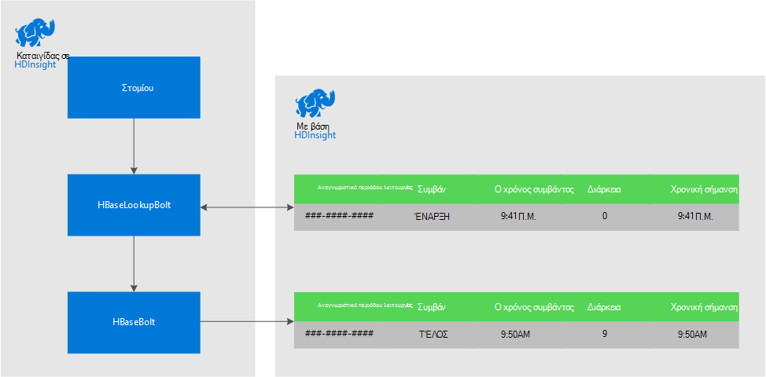
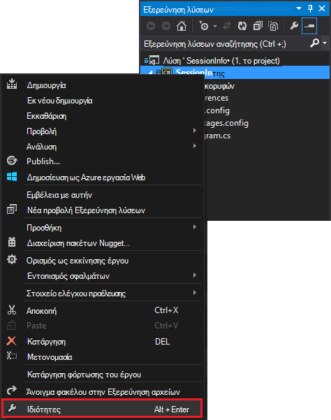
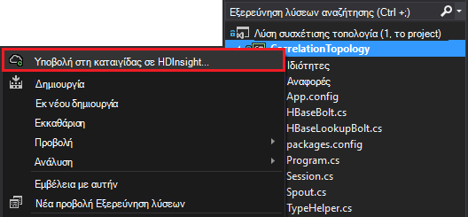

<properties
 pageTitle="Συσχετισμός συμβάντα μέσα στο χρόνο με καταιγίδας και HBase σε HDInsight"
 description="Μάθετε πώς μπορείτε να συσχετίσετε συμβάντα που παραδίδεται σε διαφορετικούς χρόνους χρησιμοποιώντας καταιγίδας και HBase HDInsight."
 services="hdinsight"
 documentationCenter=""
 authors="Blackmist"
 manager="jhubbard"
 editor="cgronlun"
 tags="azure-portal"/>

<tags
 ms.service="hdinsight"
 ms.devlang="dotnet"
 ms.topic="article"
 ms.tgt_pltfrm="na"
 ms.workload="big-data"
 ms.date="10/27/2016"
 ms.author="larryfr"/>

# Συσχετισμός συμβάντα μέσα στο χρόνο με καταιγίδας και HBase σε HDInsight

Χρησιμοποιώντας ένα χώρο αποθήκευσης μόνιμη δεδομένων με καταιγίδας Apache, μπορείτε να συσχετίσετε εγγραφές δεδομένων που παραδίδεται σε διαφορετικές ώρες. Για παράδειγμα, σύνδεση συμβάντα σύνδεσης και αποσύνδεσης για μια περίοδο λειτουργίας χρήστη για να υπολογίσετε πόσο χρόνο τελευταία την περίοδο λειτουργίας.

Σε αυτό το έγγραφο, θα μάθετε πώς μπορείτε να δημιουργήσετε μια βασική τοπολογία C# καταιγίδας που παρακολουθεί τις συμβάντα σύνδεσης και αποσύνδεσης για περιόδους λειτουργίας χρήστη και υπολογίζει τη διάρκεια της περιόδου λειτουργίας. Η τοπολογία χρησιμοποιεί HBase ως χώρος αποθήκευσης μόνιμη δεδομένων. HBase επίσης σάς επιτρέπει να εκτελέσετε δέσμη ερωτημάτων στα δεδομένα ιστορικού για την παραγωγή πρόσθετες ιδέες, όπως τον αριθμό περιόδων λειτουργίας χρήστη έχουν ξεκινήσει ή τερματίστηκε κατά τη διάρκεια μιας συγκεκριμένης χρονικής περιόδου.

## Προαπαιτούμενα στοιχεία

- Visual Studio και τα εργαλεία HDInsight για το Visual Studio: ανατρέξτε στο θέμα [Γρήγορα αποτελέσματα με τα εργαλεία HDInsight για το Visual Studio](../HDInsight/hdinsight-hadoop-visual-studio-tools-get-started.md) για πληροφορίες εγκατάστασης.

- Καταιγίδας Apache στην HDInsight συμπλέγματος (Windows βάσει). Αυτή η ενέργεια εκτελεί την τοπολογία καταιγίδας, η οποία επεξεργάζεται εισερχόμενα δεδομένα και τα αποθηκεύει στο HBase.

    > [AZURE.IMPORTANT] Ενώ SCP.NET τοπολογίες υποστηρίζονται σε συμπλεγμάτων βάσει Linux καταιγίδας δημιουργήθηκε μετά 28/10/2016, το SDK HBase πακέτου .NET κατά 28/10/2016 δεν λειτουργεί σωστά σε Linux.

- HBase Apache σε σύμπλεγμα HDInsight (Linux ή βασίζεται στα Windows). Αυτό είναι το χώρο αποθήκευσης δεδομένων για αυτό το παράδειγμα.

## Αρχιτεκτονική

Συσχέτιση συμβάντα απαιτεί ένα κοινό αναγνωριστικό για την προέλευση συμβάντος. For example, ένα Αναγνωριστικό χρήστη, Αναγνωριστικό περιόδου λειτουργίας ή άλλη πληροφορία δεδομένα που είναι μια) μοναδικό και b) περιλαμβάνονται σε όλα τα δεδομένα που αποστέλλονται σε καταιγίδας. Αυτό το παράδειγμα χρησιμοποιεί μια τιμή GUID για να αντιπροσωπεύει ένα αναγνωριστικό περιόδου λειτουργίας.

Αυτό το παράδειγμα αποτελείται από δύο HDInsight συμπλεγμάτων:

-   HBase: χώρος αποθήκευσης μόνιμη δεδομένων για τα δεδομένα ιστορικού

-   Καταιγίδας: χρησιμοποιείται για την ingest εισερχόμενων δεδομένων

Τα δεδομένα δημιουργείται τυχαία με την τοπολογία καταιγίδας και αποτελείται από τα ακόλουθα στοιχεία:

-   Αναγνωριστικό περιόδου λειτουργίας: GUID που προσδιορίζει με μοναδικό τρόπο κάθε περίοδο λειτουργίας

-   Συμβάν: ένα ΈΝΑΡΞΗΣ ή ΛΉΞΗΣ συμβάν. Για αυτό το παράδειγμα, ΈΝΑΡΞΗ πάντα παρουσιάζεται πριν από τη ΛΉΞΗ

-   Χρόνος: η ώρα του συμβάντος.

Αυτά τα δεδομένα είναι υποβάλλονται σε επεξεργασία και αποθηκεύονται σε HBase.

### Τοπολογία καταιγίδας

Κατά την εκκίνηση μιας περιόδου λειτουργίας, ένα συμβάν **ΈΝΑΡΞΗΣ** είναι ελήφθη από την τοπολογία και να συνδεθεί HBase. Όταν λαμβάνεται ένα συμβάν **ΛΉΞΗΣ** , της τοπολογίας ανακτά το συμβάν **ΈΝΑΡΞΗΣ** και υπολογίζει το χρονικό διάστημα μεταξύ των δύο συμβάντων. Αυτή η τιμή **διάρκειας** , στη συνέχεια, αποθηκεύονται σε HBase μαζί με τις πληροφορίες συμβάντων **ΤΈΛΟΣ** .

> [AZURE.IMPORTANT] Ενώ αυτή η τοπολογία παρουσιάζει το βασικό μοτίβο, μια λύση παραγωγής θα χρειαστεί να κάνετε σχεδίαση για τα ακόλουθα σενάρια:
>
> - Συμβάντα παραδίδονται εκτός σειράς
> - Αναπαραγωγή συμβάντα
> - Απόρριψη συμβάντα

Η τοπολογία του δείγματος αποτελείται από τα ακόλουθα στοιχεία:

-   Session.CS: προσομοιώνει μια περίοδο λειτουργίας χρήστη, δημιουργώντας ένα Αναγνωριστικό τυχαία περιόδου λειτουργίας, Έναρξη χρόνου, και για πόσο χρόνο θα τελευταίος την περίοδο λειτουργίας

-   Spout.CS: δημιουργεί 100 περίοδοι λειτουργίας, εκπέμπει ένα συμβάν ΈΝΑΡΞΗΣ, χρειάζεται να περιμένει το χρονικό όριο τυχαίου για κάθε περίοδο λειτουργίας και, στη συνέχεια, εκπέμπει ένα συμβάν ΛΉΞΗΣ. Στη συνέχεια, ανακυκλώνει λήξει περιόδους λειτουργίας για να δημιουργήσετε νέα έγγραφα.

-   HBaseLookupBolt.cs: χρησιμοποιεί το Αναγνωριστικό περιόδου λειτουργίας για να αναζητήσετε πληροφορίες περιόδου λειτουργίας από το HBase. Κατά την Επεξεργασία συμβάντος ΤΈΛΟΣ, εντοπίζει το αντίστοιχο συμβάν ΈΝΑΡΞΗΣ και υπολογίζει τη διάρκεια της περιόδου λειτουργίας.

-   HBaseBolt.cs: Αποθηκεύει τις πληροφορίες σε HBase.

-   TypeHelper.cs: Βοηθά με μετατροπή τύπων κατά την ανάγνωση από / εγγραφή στο HBase.

### Σχήμα HBase

Στο HBase, τα δεδομένα αποθηκεύονται σε έναν πίνακα με τις ακόλουθες σχήματος/ρυθμίσεις:

-   Γραμμή κλειδί: η περίοδος λειτουργίας Αναγνωριστικό χρησιμοποιείται ως το κλειδί για γραμμές σε αυτόν τον πίνακα

-   Στήλη οικογένεια: το όνομα της οικογένειας είναι 'cf'. Οι στήλες που είναι αποθηκευμένα σε αυτήν την οικογένεια είναι:

    -   συμβάν: ΈΝΑΡΞΗ ή ΛΉΞΗ

    -   ώρα: το χρόνο σε χιλιοστά του δευτερολέπτου που προέκυψε το συμβάν

    -   διάρκεια: το μήκος μεταξύ συμβάν ΈΝΑΡΞΗΣ και ΛΉΞΗΣ

-   ΕΚΔΌΣΕΙΣ: της οικογένειας 'cf' έχει οριστεί να διατηρούνται 5 εκδόσεις κάθε γραμμής

    > [AZURE.NOTE] Εκδόσεις είναι ένα αρχείο καταγραφής της προηγούμενης τιμές που είναι αποθηκευμένες για μια συγκεκριμένη γραμμή κλειδί. Από προεπιλογή, HBase επιστρέφει μόνο την τιμή για την πιο πρόσφατη έκδοση της γραμμής. Σε αυτήν την περίπτωση, η ίδια γραμμή χρησιμοποιείται για όλα τα συμβάντα (ΈΝΑΡΞΗ, ΛΉΞΗ.) κάθε έκδοση της γραμμής προσδιορίζεται από την τιμή χρονικής σήμανσης. Αυτό παρέχει μια προβολή ιστορικού για συμβάντα που έχουν καταγραφεί για μια συγκεκριμένη ταυτότητα.

## Κάντε λήψη του έργου

Το δείγμα έργου μπορούν να ληφθούν από [https://github.com/Azure-Samples/hdinsight-storm-dotnet-event-correlation](https://github.com/Azure-Samples/hdinsight-storm-dotnet-event-correlation).

Αυτό το στοιχείο λήψης περιέχει τα ακόλουθα έργα C#:

-   CorrelationTopology: Τοπολογία C# καταιγίδας που τυχαία εκπέμπει συμβάντα έναρξης και λήξης για περιόδους λειτουργίας χρήστη. Κάθε περίοδο λειτουργίας διαρκεί μεταξύ 1 και 5 λεπτά.

-   SessionInfo: C# κονσόλας της εφαρμογής που δημιουργεί ο πίνακας HBase και παρέχει παράδειγμα ερωτήματα για να λάβετε πληροφορίες σχετικά με τα δεδομένα αποθηκευμένα περιόδου λειτουργίας.

## Δημιουργία πίνακα

1. Ανοίξτε το έργο **SessionInfo** στο Visual Studio.

2. Στην **Εξερεύνηση λύσεων**, κάντε δεξί κλικ στο έργο **SessionInfo** και επιλέξτε **Ιδιότητες**.

    

3. Επιλέξτε **Ρυθμίσεις**και, στη συνέχεια, ορίστε τις παρακάτω τιμές:

    -   HBaseClusterURL: η διεύθυνση URL για το σύμπλεγμά σας HBase. Για παράδειγμα, https://myhbasecluster.azurehdinsight.net

    -   HBaseClusterUserName: ο διαχειριστής/HTTP λογαριασμός χρήστη για το σύμπλεγμά σας

    -   HBaseClusterPassword: ο κωδικός πρόσβασης για το λογαριασμό χρήστη διαχειριστής/HTTP

    -   HBaseTableName: το όνομα του πίνακα για χρήση με αυτό το παράδειγμα

    -   HBaseTableColumnFamily: Το οικογένεια όνομα στήλης

    

5. Εκτελέστε τη λύση. Όταν σας ζητηθεί, επιλέξτε το πλήκτρο "c" για να δημιουργήσετε τον πίνακα σε το σύμπλεγμά σας HBase.

## Δημιουργήστε και αναπτύξτε την τοπολογία καταιγίδας

1.  Ανοίξτε τη λύση **CorrelationTopology** στο Visual Studio.

2.  Στην **Εξερεύνηση λύσεων**, κάντε δεξί κλικ στο έργο **CorrelationTopology** και επιλέξτε Ιδιότητες.

3.  Στο παράθυρο διαλόγου Ιδιότητες, επιλέξτε **Ρυθμίσεις** και δώστε τις ακόλουθες πληροφορίες. Η πρώτη 5 πρέπει να τις ίδιες τιμές που χρησιμοποιούνται από το έργο **SessionInfo** :

    -   HBaseClusterURL: η διεύθυνση URL για το σύμπλεγμά σας HBase. Για παράδειγμα, https://myhbasecluster.azurehdinsight.net

    -   HBaseClusterUserName: ο διαχειριστής/HTTP λογαριασμός χρήστη για το σύμπλεγμά σας

    -   HBaseClusterPassword: ο κωδικός πρόσβασης για το λογαριασμό χρήστη διαχειριστής/HTTP

    -   HBaseTableName: το όνομα του πίνακα για χρήση με αυτό το παράδειγμα. Αυτό θα πρέπει να περιέχει το ίδιο όνομα πίνακα που χρησιμοποιείται στο έργο SessionInfo

    -   HBaseTableColumnFamily: Η οικογένεια όνομα στήλης. Αυτό θα πρέπει να περιέχει το ίδιο όνομα οικογένειας στήλη που χρησιμοποιείται στο έργο SessionInfo

    > [AZURE.IMPORTANT] Μην αλλάξετε την HBaseTableColumnNames, όπως τις προεπιλογές είναι τα ονόματα που χρησιμοποιούνται από **SessionInfo** για να ανακτήσετε δεδομένα.

4.  Αποθηκεύστε τις ιδιότητες και, στη συνέχεια, δημιουργήστε το έργο.

5.  Στην **Εξερεύνηση λύσεων**, κάντε δεξί κλικ στο έργο και επιλέξτε **Υποβολή για να καταιγίδας στην HDInsight**. Εάν σας ζητηθεί, πληκτρολογήστε τα διαπιστευτήρια για τη συνδρομή σας στο Azure.

    

6.  Στο παράθυρο διαλόγου **Υποβολή τοπολογία** , επιλέξτε το σύμπλεγμα καταιγίδας που θα εκτελεστεί αυτή τοπολογίας.

    > [AZURE.NOTE] Την πρώτη φορά που υποβάλετε μια τοπολογία, ενδέχεται να χρειαστούν μερικά δευτερόλεπτα για να ανακτήσετε το όνομα του συμπλεγμάτων HDInsight.

7.  Όταν η τοπολογία έχει αποσταλεί και υποβληθεί στο σύμπλεγμα, την **Προβολή τοπολογία καταιγίδας** θα ανοίξετε και να εμφανίσετε την τοπολογία εκτελείται. Επιλέξτε το **CorrelationTopology** και χρησιμοποιήστε το κουμπί "Ανανέωση" στο επάνω δεξιά πλευρά της σελίδας για την ανανέωση των πληροφοριών της τοπολογίας.

    

    Όταν η τοπολογία αρχίζει τη δημιουργία δεδομένων, θα αυξήσετε την τιμή στη στήλη **εκπεμπόμενο** .

    > [AZURE.NOTE] Εάν η **Προβολή τοπολογία καταιγίδας** δεν ανοίγει αυτόματα, χρησιμοποιήστε τα ακόλουθα βήματα για να το ανοίξετε:
    >
    > 1. Στην **Εξερεύνηση λύσεων**, αναπτύξτε **Azure**και, στη συνέχεια, αναπτύξτε το στοιχείο **HDInsight**.
    >
    > 2. Κάντε δεξί κλικ σε ένα σύμπλεγμα καταιγίδας που λειτουργεί με την τοπολογία και, στη συνέχεια, επιλέξτε **Προβολή καταιγίδας τοπολογίες**

## Τα δεδομένα του ερωτήματος

Μόλις δεδομένων έχει γίνει που εκπέμπει, χρησιμοποιήστε τα παρακάτω βήματα για να τα δεδομένα του ερωτήματος.

1. Επιστροφή στο έργο **SessionInfo** . Εάν δεν λειτουργεί, ξεκινήστε μια νέα παρουσία της.

2. Όταν σας ζητηθεί, επιλέξτε **s** για να πραγματοποιήσετε αναζήτηση για ΈΝΑΡΞΗ συμβάν. Θα σας ζητηθεί να εισαγάγετε μια ώρα έναρξης και λήξης για να ορίσετε ένα χρονικό εύρος - μόνο συμβάντα μεταξύ αυτών των δύο φορές θα επιστραφεί.

    Χρησιμοποιήστε την ακόλουθη μορφή κατά την εισαγωγή τις ώρες έναρξης και λήξης: ωω: λλ και 'μου' ή 'μμ'. Για παράδειγμα, 11:20 ΜΜ.

    Επειδή η τοπολογία απλώς έχει ξεκινήσει, χρήση ώρα έναρξης πριν αναπτύχθηκε και την ώρα λήξης της τώρα. Αυτό θα πρέπει να καταγράψετε περισσότερα από τα συμβάντα ΕΚΚΊΝΗΣΗΣ που δημιουργήθηκαν πότε ξεκίνησε. Όταν εκτελείται το ερώτημα, θα πρέπει να δείτε μια λίστα καταχωρήσεων παρόμοιο με το εξής:

        Session e6992b3e-79be-4991-afcf-5cb47dd1c81c started at 6/5/2015 6:10:15 PM. Timestamp = 1433527820737

Αναζήτηση για συμβάντα ΛΉΞΗΣ λειτουργεί το ίδιο με τα συμβάντα ΕΚΚΊΝΗΣΗΣ. Ωστόσο, ΤΈΛΟΣ συμβάντα δημιουργούνται τυχαία μεταξύ 1 και 5 λεπτά μετά από το συμβάν ΈΝΑΡΞΗΣ. Επομένως, ίσως χρειαστεί να δοκιμάσετε μερικά χρονικά διαστήματα για να βρείτε τα συμβάντα ΛΉΞΗΣ. ΤΈΛΟΣ συμβάντα θα περιέχει επίσης τη διάρκεια της περιόδου λειτουργίας - η διαφορά μεταξύ της ώρας συμβάν ΈΝΑΡΞΗΣ και ώρα ΛΉΞΗΣ συμβάν. Ακολουθεί ένα παράδειγμα των δεδομένων για συμβάντα ΛΉΞΗΣ:

    Session fc9fa8e6-6892-4073-93b3-a587040d892e lasted 2 minutes, and ended at 6/5/2015 6:12:15 PM

> [AZURE.NOTE] Ενώ οι τιμές ώρας που καταχωρείτε είναι σε τοπική ώρα, την ώρα που επιστρέφονται από το ερώτημα θα UTC.

##Διακοπή της τοπολογίας

Όταν είστε έτοιμοι για να διακόψετε την τοπολογία, επιστρέψτε στο έργο **CorrelationTopology** στο Visual Studio. Στην **Προβολή τοπολογία καταιγίδας**, επιλέξτε την τοπολογία και, στη συνέχεια, χρησιμοποιήστε το κουμπί **τερματισμού** στο επάνω μέρος της προβολής της τοπολογίας.

##Διαγράψτε το σύμπλεγμά σας

[AZURE.INCLUDE [delete-cluster-warning](../../includes/hdinsight-delete-cluster-warning.md)]

##Επόμενα βήματα

Για περισσότερα παραδείγματα καταιγίδας, ανατρέξτε στο θέμα [τοπολογίες παράδειγμα για καταιγίδας στην HDInsight](hdinsight-storm-example-topology.md).
 
