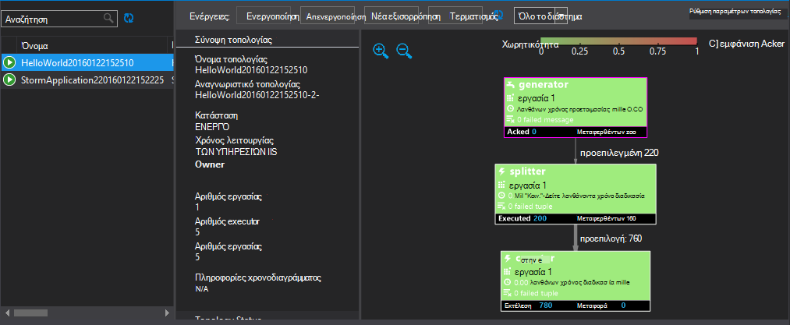

<properties
   pageTitle="Ανάπτυξη και διαχείριση τοπολογίες καταιγίδας Apache στην HDInsight | Microsoft Azure"
   description="Μάθετε πώς μπορείτε να αναπτύξετε, παρακολούθηση και διαχείριση τοπολογίες καταιγίδας Apache χρησιμοποιώντας τον πίνακα εργαλείων καταιγίδας στην HDInsight. Χρησιμοποιήστε Hadoop εργαλεία για το Visual Studio."
   services="hdinsight"
   documentationCenter=""
   authors="Blackmist"
   manager="jhubbard"
   editor="cgronlun"
    tags="azure-portal"/>

<tags
   ms.service="hdinsight"
   ms.devlang="java"
   ms.topic="article"
   ms.tgt_pltfrm="na"
   ms.workload="big-data"
   ms.date="10/11/2016"
   ms.author="larryfr"/>

#Ανάπτυξη και διαχείριση τοπολογίες καταιγίδας Apache σε HDInsight που βασίζεται σε Windows

Πίνακας εργαλείων καταιγίδας σάς επιτρέπει να εύκολα να αναπτύξετε και να εκτελέσετε τοπολογίες καταιγίδας Apache σας σύμπλεγμα HDInsight, χρησιμοποιώντας το πρόγραμμα περιήγησης web. Μπορείτε επίσης να χρησιμοποιήσετε τον πίνακα εργαλείων για την παρακολούθηση και διαχείριση εκτελείται τοπολογίες. Εάν χρησιμοποιείτε το Visual Studio, τα εργαλεία HDInsight για το Visual Studio παρέχουν παρόμοιες δυνατότητες στο Visual Studio.

Πίνακας εργαλείων καταιγίδας και τις δυνατότητες καταιγίδας στα εργαλεία HDInsight βασίζονται σε τα καταιγίδας REST API, το οποίο μπορεί να χρησιμοποιηθεί για να δημιουργήσετε το δικό παρακολούθηση σας και τις λύσεις διαχείρισης.

> [AZURE.IMPORTANT] Τα βήματα σε αυτό το έγγραφο απαιτούν μιας καταιγίδας βασίζεται σε Windows σε σύμπλεγμα HDInsight. Για πληροφορίες σχετικά με ένα σύμπλεγμα βάσει Linux, ανατρέξτε στο θέμα [ανάπτυξη και διαχείριση τοπολογίες καταιγίδας Apache στην βάσει Linux HDInsight](hdinsight-storm-deploy-monitor-topology-linux.md)

##Προαπαιτούμενα στοιχεία

* **Καταιγίδας Apache στην HDInsight** - ανατρέξτε στο θέμα <a href="../hdinsight-storm-getting-started/" target="_blank">Γρήγορα αποτελέσματα με το καταιγίδας Apache στην HDInsight</a> για οδηγίες σχετικά με τη δημιουργία ενός συμπλέγματος

* Για πίνακα **Εργαλείων καταιγίδας**: σύγχρονα πρόγραμμα περιήγησης που υποστηρίζει HTML5

* Για το **Visual Studio** - Azure SDK 2.5.1 ή νεότερη έκδοση και τα εργαλεία HDInsight για το Visual Studio. Ανατρέξτε στο θέμα <a href="../hdinsight-hadoop-visual-studio-tools-get-started/" target="_blank">Γρήγορα αποτελέσματα με το HDInsight εργαλεία για το Visual Studio</a> για να εγκαταστήσετε και να ρυθμίσετε τα εργαλεία HDInsight για το Visual Studio.

    Μία από τις παρακάτω εκδόσεις του Visual Studio:

    * Visual Studio 2012, με <a href="http://www.microsoft.com/download/details.aspx?id=39305" target="_blank">4 ενημέρωσης</a>

    * Visual Studio 2013 με <a href="http://www.microsoft.com/download/details.aspx?id=44921" target="_blank">Ενημέρωση 4</a> ή <a href="http://go.microsoft.com/fwlink/?LinkId=517284" target="_blank">Visual Studio 2013 Κοινότητας</a>

    * <a href="http://visualstudio.com/downloads/visual-studio-2015-ctp-vs" target="_blank">Visual Studio 2015 CTP6</a>

    > [AZURE.NOTE] Προς το παρόν τα εργαλεία HDInsight για το Visual Studio υποστηρίζει μόνο καταιγίδας HDInsight σύμπλεγμα έκδοση 3.2.

##Πίνακας εργαλείων καταιγίδας

Στον πίνακα εργαλείων καταιγίδας είναι διαθέσιμα σε το σύμπλεγμά σας καταιγίδας σε ιστοσελίδα. Η διεύθυνση URL είναι **https://&lt;clustername >.azurehdinsight.net/**, όπου **clustername** είναι το όνομα του σας καταιγίδας σε σύμπλεγμα HDInsight.

Από το επάνω μέρος του πίνακα εργαλείων καταιγίδας, επιλέξτε **Υποβολή τοπολογίας**. Ακολουθήστε τις οδηγίες στη σελίδα για να εκτελέσετε μια τοπολογία δείγμα ή να αποστείλετε και να εκτελέσετε μια τοπολογία που δημιουργήσατε.

![στη σελίδα τοπολογία υποβολή][storm-dashboard-submit]

###Καταιγίδας περιβάλλοντος εργασίας Χρήστη

Από τον πίνακα εργαλείων καταιγίδας, επιλέξτε τη σύνδεση **Καταιγίδας περιβάλλοντος εργασίας Χρήστη** . Αυτό θα εμφανίσει πληροφορίες σχετικά με το σύμπλεγμα, εκτός από οποιαδήποτε τοπολογίες εκτελείται.

![περιβάλλον εργασίας χρήστη του καταιγίδας][storm-dashboard-ui]

> [AZURE.NOTE] Με ορισμένες εκδόσεις του Internet Explorer, ενδέχεται να ανακαλύψετε ότι το περιβάλλον εργασίας Χρήστη καταιγίδας ανανεωθεί μετά που έχετε επισκεφθεί πρώτα. Για παράδειγμα, το ενδέχεται να μην εμφανίζει το νέο τοπολογίες που υποβάλλεται ή μπορεί να δείχνει μια τοπολογία ως ενεργό όταν απενεργοποιήθηκε προηγουμένως. Η Microsoft γνωρίζει αυτό το ζήτημα και εργάζεται σε μια λύση.

####Κύρια σελίδα

Κύρια σελίδα του περιβάλλοντος εργασίας Χρήστη του καταιγίδας παρέχει τις ακόλουθες πληροφορίες:

* **Σύμπλεγμα σύνοψης**: βασικές πληροφορίες για το σύμπλεγμα καταιγίδας.

* **Τοπολογία σύνοψης**: μια λίστα εκτελούνται τοπολογίες. Χρησιμοποιήστε τις συνδέσεις σε αυτήν την ενότητα για να δείτε περισσότερες πληροφορίες σχετικά με συγκεκριμένες τοπολογίες.

* **Επόπτη σύνοψης**: πληροφορίες σχετικά με τον επόπτη καταιγίδας.

* **Ρύθμιση παραμέτρων nimbus**: Nimbus ρύθμισης παραμέτρων για το σύμπλεγμα.

####Τοπολογία σύνοψης

Επιλέξετε μια σύνδεση από την ενότητα **τοπολογία σύνοψης** εμφανίζει τις ακόλουθες πληροφορίες σχετικά με την τοπολογία:

* **Τοπολογία σύνοψης**: βασικές πληροφορίες σχετικά με την τοπολογία.

* **Ενέργειες τοπολογίας**: Διαχείριση ενέργειες που μπορείτε να εκτελέσετε για της τοπολογίας.

    * **Ενεργοποίηση**: επεξεργασία βιογραφικά σημειώματα μια τοπολογία απενεργοποιημένη.

    * **Απενεργοποίηση**: διακόπτει προσωρινά μια τοπολογία εκτελείται.

    * **Νέα εξισορρόπηση**: προσαρμόζει τον παραλληλισμό των της τοπολογίας. Θα πρέπει να νέα εξισορρόπηση εκτελείται τοπολογίες, αφού έχετε αλλάξει τον αριθμό των κόμβους του συμπλέγματος. Αυτό σας επιτρέπει την τοπολογία για να προσαρμόσετε παραλληλισμό να αποζημιώσει για τον αριθμό αύξηση ή μείωση των κόμβους του συμπλέγματος.

        Για περισσότερες πληροφορίες, ανατρέξτε στο θέμα <a href="http://storm.apache.org/documentation/Understanding-the-parallelism-of-a-Storm-topology.html" target="_blank">Κατανόηση τον παραλληλισμό των μια τοπολογία καταιγίδας</a>.

    * **Τερματισμός**: τερματίζει μια τοπολογία καταιγίδας μετά το καθορισμένο χρονικό όριο.

* **Στατιστικές τοπολογίας**: στατιστικά στοιχεία σχετικά με την τοπολογία. Χρησιμοποιήστε τις συνδέσεις στη στήλη **παράθυρο** για να ορίσετε το χρονικό πλαίσιο για τις υπόλοιπες καταχωρήσεις στη σελίδα.

* **Spouts**: το spouts χρησιμοποιούνται από της τοπολογίας. Χρησιμοποιήστε τις συνδέσεις σε αυτήν την ενότητα για να δείτε περισσότερες πληροφορίες σχετικά με συγκεκριμένα spouts.

* **Μπουλονιών**: τα στοιχεία που χρησιμοποιούνται από την τοπολογία. Χρησιμοποιήστε τις συνδέσεις σε αυτήν την ενότητα για να δείτε περισσότερες πληροφορίες σχετικά με συγκεκριμένα στοιχεία.

* **Ρύθμιση παραμέτρων τοπολογίας**: τη ρύθμιση παραμέτρων του επιλεγμένου της τοπολογίας.

####Στομίου και σύνοψη κεραυνό

Επιλογή ενός στομίου από τις ενότητες **Spouts** ή **μπουλονιών** εμφανίζει τις ακόλουθες πληροφορίες σχετικά με το επιλεγμένο στοιχείο:

* **Στοιχείο σύνοψης**: βασικές πληροφορίες σχετικά με την στομίου ή κεραυνό.

* **Στατιστικές στομίου/κεραυνό**: στατιστικά στοιχεία σχετικά με την στομίου ή κεραυνό. Χρησιμοποιήστε τις συνδέσεις στη στήλη **παράθυρο** για να ορίσετε το χρονικό πλαίσιο για τις υπόλοιπες καταχωρήσεις στη σελίδα.

* **Στατιστικές εισαγωγής** (βίδας μόνο): πληροφορίες σχετικά με τις ροές εισόδου που καταναλώνεται από η ράβδος.

* **Στατιστικές εξόδου**: πληροφορίες σχετικά με τις ροές που εκπέμπει αυτό spout ή βίδας.

* **Executors**: πληροφορίες σχετικά με τις παρουσίες του στομίου ή κεραυνό. Επιλέξτε την καταχώρηση **θύρα** για ένα συγκεκριμένο executor για να προβάλετε ένα αρχείο καταγραφής διαγνωστικών πληροφοριών που παράγεται για αυτήν την παρουσία.

* **Σφάλματα**: οποιαδήποτε πληροφοριών σφάλματος για αυτό spout ή βίδας.

##Εργαλεία HDInsight για το Visual Studio

Τα εργαλεία HDInsight μπορεί να χρησιμοποιηθεί για την υποβολή C# ή υβριδικό τοπολογίες σας σύμπλεγμα καταιγίδας. Τα παρακάτω βήματα χρησιμοποιούν ένα δείγμα εφαρμογής. Για πληροφορίες σχετικά με τη δημιουργία τοπολογίες τη δική σας, χρησιμοποιώντας τα εργαλεία HDInsight, ανατρέξτε στο θέμα [Ανάπτυξη C# τοπολογίες χρησιμοποιώντας τα εργαλεία HDInsight για το Visual Studio](hdinsight-storm-develop-csharp-visual-studio-topology.md).

Χρησιμοποιήστε τα παρακάτω βήματα για να αναπτύξετε ένα δείγμα σε σας καταιγίδας στο σύμπλεγμα HDInsight, στη συνέχεια, προβολή και διαχείριση της τοπολογίας.

1. Εάν δεν έχετε ήδη εγκαταστήσει την πιο πρόσφατη έκδοση των εργαλείων HDInsight για το Visual Studio, ανατρέξτε στο θέμα <a href="../hdinsight-hadoop-visual-studio-tools-get-started/" target="_blank">Γρήγορα αποτελέσματα με το HDInsight εργαλεία για το Visual Studio</a>.

2. Ανοίξτε το Visual Studio, επιλέξτε **αρχείο** > **Δημιουργία** > **έργου**.

3. Στο παράθυρο διαλόγου **Νέο έργο** , αναπτύξτε το στοιχείο **εγκατεστημένες** > **πρότυπα**και, στη συνέχεια, επιλέξτε **HDInsight**. Από τη λίστα των προτύπων, επιλέξτε **Δείγμα καταιγίδας**. Στο κάτω μέρος του παραθύρου διαλόγου, πληκτρολογήστε ένα όνομα για την εφαρμογή.

    

1. Στην **Εξερεύνηση λύσεων**, κάντε δεξί κλικ στο έργο και επιλέξτε **Υποβολή για να καταιγίδας στην HDInsight**.

    > [AZURE.NOTE] Εάν σας ζητηθεί, πληκτρολογήστε τα διαπιστευτήρια σύνδεσης για τη συνδρομή σας στο Azure. Εάν έχετε περισσότερες από μία συνδρομές, συνδεθείτε με αυτό που περιέχει το καταιγίδας σε σύμπλεγμα HDInsight.

2. Επιλέξτε το καταιγίδας σε σύμπλεγμα HDInsight από την αναπτυσσόμενη λίστα **Καταιγίδας σύμπλεγμα** και, στη συνέχεια, επιλέξτε **Υποβολή**. Μπορείτε να παρακολουθείτε αν η υποβολή είναι επιτυχής, χρησιμοποιώντας το παράθυρο **εξόδου** .

3. Όταν η τοπολογία υποβλήθηκε με επιτυχία, θα πρέπει να εμφανίζεται το **Τοπολογίες καταιγίδας** για το σύμπλεγμα. Επιλέξτε την τοπολογία από τη λίστα για να προβάλετε πληροφορίες σχετικά με την τοπολογία εκτελείται.

    

    > [AZURE.NOTE] Μπορείτε επίσης να προβάλετε **Τοπολογίες καταιγίδας** από την **Εξερεύνηση διακομιστών** , επεκτείνοντας **Azure** > **HDInsight**, και, στη συνέχεια, κάνοντας δεξί κλικ σε μια καταιγίδας σε σύμπλεγμα HDInsight, και επιλέγοντας **Προβολή καταιγίδας τοπολογίες**.

    Επιλέξτε το σχήμα για το spouts ή στοιχεία για να προβάλετε πληροφορίες σχετικά με αυτά τα στοιχεία. Θα ανοίξει ένα νέο παράθυρο για κάθε επιλεγμένου στοιχείου.
    
    > [AZURE.NOTE] Το όνομα του της τοπολογίας είναι το όνομα κλάσης της της τοπολογίας (σε αυτήν την περίπτωση, `HelloWord`,) με μια χρονική σήμανση προσαρτημένο.

4. Από την προβολή **Σύνοψη τοπολογία** , επιλέξτε **Τερματισμός** για να διακόψετε την τοπολογία.

    > [AZURE.NOTE] Τοπολογίες καταιγίδας συνεχίσετε την εκτέλεση μέχρι διακόπτονται ή να διαγραφεί το σύμπλεγμα.

##REST API

Περιβάλλον εργασίας Χρήστη του καταιγίδας είναι ενσωματωμένη επάνω από το REST API, ώστε να μπορείτε να εκτελέσετε παρόμοια διαχείριση και την παρακολούθηση λειτουργικότητα χρησιμοποιώντας το REST API. Μπορείτε να χρησιμοποιήσετε το REST API για να δημιουργήσετε προσαρμοσμένα εργαλεία για τη διαχείριση και την παρακολούθηση τοπολογίες καταιγίδας.

Για περισσότερες πληροφορίες, ανατρέξτε στο θέμα [Καταιγίδας περιβάλλοντος εργασίας Χρήστη REST API](https://github.com/apache/storm/blob/0.9.3-branch/STORM-UI-REST-API.md). Οι ακόλουθες πληροφορίες είναι συγκεκριμένη για χρήση το REST API με καταιγίδας Apache στην HDInsight.

###Βάση URI

Το βασικό URI για το REST API σε HDInsight συμπλεγμάτων είναι **https://&lt;clustername >.azurehdinsight.net/stormui/api/v1/**, όπου **clustername** είναι το όνομα του σας καταιγίδας σε σύμπλεγμα HDInsight.

###Έλεγχος ταυτότητας

Αιτήσεις για το REST API πρέπει να χρησιμοποιήσετε το **βασικό έλεγχο ταυτότητας**, ώστε να μπορείτε να χρησιμοποιήσετε το όνομα του διαχειριστή συμπλέγματος HDInsight και τον κωδικό πρόσβασης.

> [AZURE.NOTE] Επειδή το βασικό έλεγχο ταυτότητας αποστέλλεται χρησιμοποιώντας απλό κείμενο, θα πρέπει να χρησιμοποιείται **πάντα** HTTPS για την ασφάλιση επικοινωνίες με το σύμπλεγμα.

###Τιμές επιστροφής

Πληροφορίες που επιστρέφονται από το REST API μόνο ίσως να χρησιμοποιηθεί από μέσα στο σύμπλεγμα ή εικονικές μηχανές στο ίδιο δίκτυο εικονικού Azure ως το σύμπλεγμα. Για παράδειγμα, το πλήρως προσδιορισμένο όνομα τομέα (FQDN) επιστρέφεται για τους διακομιστές Zookeeper δεν θα είναι προσβάσιμη από το Internet.

##Επόμενα βήματα

Τώρα που μάθατε πώς να αναπτύξετε και παρακολούθηση τοπολογίες χρησιμοποιώντας τον πίνακα εργαλείων καταιγίδας, μάθετε πώς μπορείτε να:

* [Ανάπτυξη C# τοπολογίες χρησιμοποιώντας τα εργαλεία HDInsight για το Visual Studio](hdinsight-storm-develop-csharp-visual-studio-topology.md)

* [Ανάπτυξη βάσει Java τοπολογίες χρησιμοποιώντας Maven](hdinsight-storm-develop-java-topology.md)

Για μια λίστα των περισσότερων τοπολογίες παράδειγμα, ανατρέξτε στο θέμα [τοπολογίες παράδειγμα για καταιγίδας στην HDInsight](hdinsight-storm-example-topology.md).

[hdinsight-dashboard]: ./media/hdinsight-storm-deploy-monitor-topology/dashboard-link.png
[storm-dashboard-submit]: ./media/hdinsight-storm-deploy-monitor-topology/submit.png
[storm-dashboard-ui]: ./media/hdinsight-storm-deploy-monitor-topology/storm-ui-summary.png
