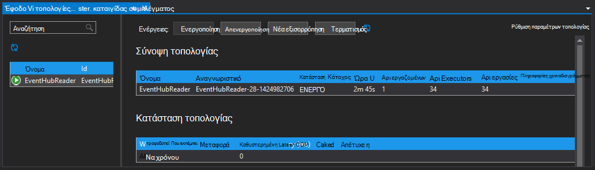

<properties
   pageTitle="Επεξεργασία συμβάντων από το συμβάν διανομείς με καταιγίδας στην HDInsight | Microsoft Azure"
   description="Μάθετε πώς μπορείτε να επεξεργαστείτε διανομείς συμβάν δεδομένων με μια τοπολογία C# καταιγίδας που δημιουργήθηκε στο Visual Studio χρησιμοποιώντας τα εργαλεία HDInsight για το Visual Studio."
   services="hdinsight,notification hubs"
   documentationCenter=""
   authors="Blackmist"
   manager="jhubbard"
   editor="cgronlun"/>

<tags
   ms.service="hdinsight"
   ms.devlang="dotnet"
   ms.topic="article"
   ms.tgt_pltfrm="na"
   ms.workload="big-data"
   ms.date="10/27/2016"
   ms.author="larryfr"/>

# Διαδικασία συμβάντα από διανομείς συμβάν Azure με καταιγίδας στην HDInsight (C#)

Azure διανομείς συμβάν σάς επιτρέπει να επεξεργαστεί τεράστιες ποσότητες δεδομένων από τοποθεσίες Web, εφαρμογών και συσκευές. Το συμβάν διανομείς στομίου καθιστά εύκολο για χρήση καταιγίδας Apache στην HDInsight για να αναλύσετε αυτά τα δεδομένα σε πραγματικό χρόνο. Να επίσης εγγραφή δεδομένων σε διανομείς συμβάν από καταιγίδας χρησιμοποιώντας η ράβδος συμβάν διανομείς.

Σε αυτό το πρόγραμμα εκμάθησης, θα μάθετε πώς μπορείτε να χρησιμοποιήσετε το Visual Studio πρότυπα που είναι εγκατεστημένα με εργαλεία HDInsight για το Visual Studio για να δημιουργήσετε δύο τοπολογίες που λειτουργούν με το Azure συμβάν διανομείς.

* **EventHubWriter**: τυχαία δημιουργεί δεδομένα και την εγγράφει διανομείς συμβάντος

* **EventHubReader**: διαβάζει δεδομένα από το συμβάν διανομείς και καταγράφει τα δεδομένα στα αρχεία καταγραφής καταιγίδας

> [AZURE.NOTE] Ενώ τα βήματα σε αυτό το έγγραφο που βασίζονται σε ένα περιβάλλον ανάπτυξης Windows με το Visual Studio, μεταγλωττισμένο έργου μπορούν να υποβληθούν σε σύμπλεγμα μια Linux ή HDInsight που βασίζεται στα Windows. Μόνο βάσει Linux συμπλεγμάτων δημιουργηθεί μετά την υποστήριξη 28/10/2016 τοπολογίες SCP.NET.
>
> Για να χρησιμοποιήσετε μια τοπολογία C# με ένα σύμπλεγμα βάσει Linux, πρέπει να ενημερώσετε το πακέτο Microsoft.SCP.Net.SDK NuGet χρησιμοποιείται από το έργο σας στην έκδοση 0.10.0.6 ή νεότερη έκδοση. Την έκδοση του πακέτου επίσης πρέπει να συμφωνεί με την κύρια έκδοση καταιγίδας εγκατεστημένο στον HDInsight. Για παράδειγμα, καταιγίδας σε εκδόσεις HDInsight 3.3 και 3.4 Χρησιμοποιήστε καταιγίδας έκδοση 0.10.x, ενώ HDInsight 3.5 χρησιμοποιεί καταιγίδας 1.0.x.
> 
> Τοπολογίες C# σε βάσει Linux συμπλεγμάτων πρέπει να χρησιμοποιήστε διαίρεσης 4,5 .NET, και μονοφωνικό για να εκτελέσετε στο σύμπλεγμα HDInsight. Τα περισσότερα από όσα θα λειτουργούν, ωστόσο θα πρέπει να ελέγξετε το έγγραφο [Μονοφωνικό συμβατότητας](http://www.mono-project.com/docs/about-mono/compatibility/) για πιθανές ασυμβατότητα.
>
> Για την έκδοση Java αυτό το έργο, το οποίο θα λειτουργεί σε ένα σύμπλεγμα βάσει Linux ή βασίζεται στα Windows, ανατρέξτε στο θέμα [διαδικασία συμβάντα από διανομείς συμβάν Azure με καταιγίδας στην HDInsight (Java)](hdinsight-storm-develop-java-event-hub-topology.md).

## Προαπαιτούμενα στοιχεία

* Μια [Καταιγίδας Apache σε σύμπλεγμα HDInsight](hdinsight-apache-storm-tutorial-get-started.md)

* Ένα [διανομέα Azure συμβάντος](../event-hubs/event-hubs-csharp-ephcs-getstarted.md)

* Το [Azure .NET SDK](http://azure.microsoft.com/downloads/)

* Τα [Εργαλεία HDInsight για το Visual Studio](hdinsight-hadoop-visual-studio-tools-get-started.md)

## Ολοκληρωμένο έργο

Μπορείτε να κάνετε λήψη μια πλήρη έκδοση του έργου που έχουν δημιουργηθεί με αυτό το πρόγραμμα εκμάθησης από GitHub: [eventhub-καταιγίδας-υβριδική](https://github.com/Azure-Samples/hdinsight-dotnet-java-storm-eventhub). Ωστόσο, πρέπει ακόμα να παρέχετε ρυθμίσεις παραμέτρων, ακολουθώντας τα βήματα που περιγράφονται σε αυτό το πρόγραμμα εκμάθησης.

## Συμβάν διανομείς στομίου και κεραυνό

Οι διανομείς συμβάν spout και με είναι Java στοιχεία που σας επιτρέπουν να διευκόλυνση εργασιών με διανομείς συμβάν από Apache καταιγίδας. Παρόλο που αυτά τα στοιχεία είναι γραμμένες σε Java, τα εργαλεία HDInsight για το Visual Studio σάς επιτρέπουν να δημιουργήσετε τοπολογίες υβριδική που Δημιουργήστε C# και των στοιχείων Java.

Οι στομίου και κεραυνό κατανέμονται ως ένα μόνο αρχείο αρχειοθέτησης (.jar) Java με το όνομα **eventhubs-storm-spout-#.#-jar-with-dependencies.jar**, όπου #. # είναι η έκδοση του αρχείου.

### Κάντε λήψη του αρχείου .jar

Την πιο πρόσφατη έκδοση του αρχείου βάζο περιλαμβάνεται στο έργο [παραδείγματα καταιγίδας HDInsight](https://github.com/hdinsight/hdinsight-storm-examples) κάτω από το φάκελο **βιβλιοθήκης/eventhubs** . Για να κάνετε λήψη του αρχείου, χρησιμοποιήστε μία από τις παρακάτω μεθόδους.

> [AZURE.NOTE] Η στομίου και κεραυνό έχουν υποβληθεί για να συμπεριληφθούν στο έργο Apache καταιγίδας. Για περισσότερες πληροφορίες, ανατρέξτε στο θέμα [ΚΑΤΑΙΓΊΔΑΣ 583: αρχική μεταβίβασης ελέγχου για διανομείς καταιγίδας συμβάν](https://github.com/apache/storm/pull/336/files) στο GitHub.

* **Λήψη ενός αρχείου ZIP**: από την τοποθεσία [παραδείγματα καταιγίδας HDInsight](https://github.com/hdinsight/hdinsight-storm-examples) , επιλέξτε **Λήψη ZIP** στο δεξιό τμήμα του παραθύρου για να κάνετε λήψη ενός αρχείου .zip που περιέχει το έργο.

    

    Μετά τη λήψη του αρχείου, μπορείτε να κάνετε εξαγωγή σε αρχείο αρχειοθέτησης και το αρχείο θα στον κατάλογο **βιβλιοθήκης** .

* **Κλωνοποίηση το έργο**: Εάν έχετε εγκαταστήσει [Git](http://git-scm.com/) , χρησιμοποιήστε την παρακάτω εντολή για να κλωνοποίηση του αποθετηρίου τοπικά και, στη συνέχεια, βρείτε το αρχείο στον κατάλογο **βιβλιοθήκης** .

        git clone https://github.com/hdinsight/hdinsight-storm-examples

## Ρύθμιση παραμέτρων διανομείς συμβάντος

Συμβάν διανομείς είναι η προέλευση δεδομένων για αυτό το παράδειγμα. Χρησιμοποιήστε τις πληροφορίες στην ενότητα __Δημιουργία ένα συμβάν διανομέα__ του εγγράφου [Γρήγορα αποτελέσματα με το συμβάν διανομείς](../event-hubs/event-hubs-csharp-ephcs-getstarted.md) .

3. Αφού δημιουργηθεί το συμβάν διανομέα, προβάλετε την blade EventHub στην πύλη του Azure και επιλέξτε __κοινή χρήση access πολιτικές__. Χρησιμοποιήστε την καταχώρηση __+ Προσθήκη__ για να προσθέσετε τις παρακάτω πολιτικές:

  	| Όνομα | Δικαιώματα |
  	| ----- | ----- |
  	| συντάκτης | Αποστολή |
  	| πρόγραμμα ανάγνωσης | Ακρόαση |

    

5. Επιλέξτε τις πολιτικές __ανάγνωσης__ και __εγγραφής__ . Αντιγραφή και αποθηκεύστε την τιμή __ΠΡΩΤΕΎΟΝΤΟΣ ΚΛΕΙΔΙΟΎ__ για τις δύο πολιτικές, όπως αυτά θα χρησιμοποιηθεί αργότερα.

## Ρύθμιση παραμέτρων του EventHubWriter

1. Εάν δεν έχετε ήδη εγκαταστήσει την πιο πρόσφατη έκδοση των εργαλείων HDInsight για το Visual Studio, ανατρέξτε στο θέμα [Γρήγορα αποτελέσματα με το HDInsight εργαλεία για το Visual Studio](hdinsight-hadoop-visual-studio-tools-get-started.md).

2. Κάντε λήψη της λύσης από [eventhub-καταιγίδας-υβριδική](https://github.com/Azure-Samples/hdinsight-dotnet-java-storm-eventhub). Ανοίξτε τη λύση και να χρειαστούν μερικά λεπτά για να δείτε τον κωδικό για το έργο __EventHubWriter__ .

4. Στο έργο __EventHubWriter__ , ανοίξτε το αρχείο __App.config__ . Χρησιμοποιήστε τις πληροφορίες από την ενότητα συμβάντων που έχετε ρυθμίσει προηγουμένως για να συμπληρώσετε την τιμή για τα ακόλουθα κλειδιά:

  	| Πλήκτρο | Τιμή |
  	| ----- | ----- |
  	| EventHubPolicyName | Συντάκτης (Εάν χρησιμοποιούσατε ένα διαφορετικό όνομα για την πολιτική με _Αποστολή_ δικαιώματα, χρησιμοποιήστε την αντί για αυτό.) |
  	| EventHubPolicyKey | Το κλειδί για την πολιτική, writer |
  	| EventHubNamespace | Ο χώρος ονομάτων που περιέχει το συμβάν διανομέα |
  	| EventHubName | Το όνομα διανομέας συμβάντος |
  	| EventHubPartitionCount | Ο αριθμός των διαμερισμάτων στο κέντρο σας συμβάντος |

4. Αποθηκεύστε και κλείστε το αρχείο **App.config** .

## Ρύθμιση παραμέτρων του EventHubReader

1. Ανοίξτε το έργο __EventHubReader__ και διαρκέσει μερικές momoents για να δείτε τον κώδικα.

2. Ανοίξτε το __App.config__ για το __EventHubWriter__. Χρησιμοποιήστε τις πληροφορίες από την ενότητα συμβάντων που έχετε ρυθμίσει προηγουμένως για να συμπληρώσετε την τιμή για τα ακόλουθα κλειδιά:

  	| Πλήκτρο | Τιμή |
  	| ----- | ----- |
  	| EventHubPolicyName | πρόγραμμα ανάγνωσης (Εάν χρησιμοποιούσατε ένα διαφορετικό όνομα για την πολιτική με _ακρόαση_ δικαιώματα, χρησιμοποιήστε την αντί για αυτό.) |
  	| EventHubPolicyKey | Το κλειδί για την πολιτική ανάγνωσης |
  	| EventHubNamespace | Ο χώρος ονομάτων που περιέχει το συμβάν διανομέα |
  	| EventHubName | Το όνομα διανομέας συμβάντος |
  	| EventHubPartitionCount | Ο αριθμός των διαμερισμάτων στο κέντρο σας συμβάντος |

3. Αποθηκεύστε και κλείστε το αρχείο **App.config** .

## Αναπτύξτε τις τοπολογίες

1. Από την **Εξερεύνηση λύσεων**, κάντε δεξί κλικ στο έργο **EventHubReader** και επιλέξτε **Υποβολή για να καταιγίδας στην HDInsight**.

    

2. Στην οθόνη **Υποβολή τοπολογία** , επιλέξτε το **Σύμπλεγμα καταιγίδας**. Ανάπτυξη **Πρόσθετες ρυθμίσεις**, επιλέξτε **Java αρχείο διαδρομές**, επιλέξτε **...** και επιλέξτε τον κατάλογο που περιέχει το αρχείο **eventhubs-storm-spout-0.9-jar-with-dependencies.jar** που λάβατε νωρίτερα. Τέλος, κάντε κλικ στην επιλογή **Υποβολή**.

    

3. Όταν η τοπολογία έχει υποβληθεί, θα εμφανιστεί το **Πρόγραμμα προβολής τοπολογίες καταιγίδας** . Επιλέξτε την τοπολογία **EventHubReader** στο αριστερό τμήμα του παραθύρου για να δείτε τα στατιστικά στοιχεία για την τοπολογία. Προς το παρόν, τίποτα, θα πρέπει να συμβαίνει επειδή η συμβάντα έχουν εγγραφεί στο συμβάν διανομείς ακόμη.

    

4. Από την **Εξερεύνηση λύσεων**, κάντε δεξί κλικ στο έργο **EventHubWriter** και επιλέξτε **Υποβολή για να καταιγίδας στην HDInsight**.

2. Στην οθόνη **Υποβολή τοπολογία** , επιλέξτε το **Σύμπλεγμα καταιγίδας**. Ανάπτυξη **Πρόσθετες ρυθμίσεις**, επιλέξτε **Java αρχείο διαδρομές**, επιλέξτε **...** και επιλέξτε τον κατάλογο που περιέχει το αρχείο **eventhubs-storm-spout-0.9-jar-with-dependencies.jar** που λάβατε νωρίτερα. Τέλος, κάντε κλικ στην επιλογή **Υποβολή**.

5. Όταν η τοπολογία έχει υποβληθεί, ανανεώστε τη λίστα τοπολογία στο **Πρόγραμμα προβολής τοπολογίες καταιγίδας** για να βεβαιωθείτε ότι και οι δύο τοπολογίες εκτελούνται στο σύμπλεγμα.

6. Στο **Πρόγραμμα προβολής τοπολογίες καταιγίδας**, επιλέξτε την τοπολογία **EventHubReader** .

4. Στην προβολή γραφήματος, κάντε διπλό κλικ στο στοιχείο __LogBolt__ . Αυτό θα ανοίξει η σελίδα __Στοιχείο σύνοψη__ για η ράβδος.

3. Στην ενότητα __Executors__ , επιλέξτε μία από τις συνδέσεις στη στήλη __θύρα__ . Αυτό θα εμφανίζουν πληροφορίες που καταγράφονται από το στοιχείο. Οι πληροφορίες που καταγράφονται είναι παρόμοια με τα εξής:

        2016-10-20 13:26:44.186 m.s.s.b.ScpNetBolt [INFO] Processing tuple: source: com.microsoft.eventhubs.spout.EventHubSpout:7, stream: default, id: {5769732396213255808=520853934697489134}, [{"deviceId":3,"deviceValue":1379915540}]
        2016-10-20 13:26:44.234 m.s.s.b.ScpNetBolt [INFO] Processing tuple: source: com.microsoft.eventhubs.spout.EventHubSpout:7, stream: default, id: {7154038361491319965=4543766486572976404}, [{"deviceId":3,"deviceValue":459399321}]
        2016-10-20 13:26:44.335 m.s.s.b.ScpNetBolt [INFO] Processing tuple: source: com.microsoft.eventhubs.spout.EventHubSpout:6, stream: default, id: {513308780877039680=-7571211415704099042}, [{"deviceId":5,"deviceValue":845561159}]
        2016-10-20 13:26:44.445 m.s.s.b.ScpNetBolt [INFO] Processing tuple: source: com.microsoft.eventhubs.spout.EventHubSpout:7, stream: default, id: {-2409895457033895206=5479027861202203517}, [{"deviceId":8,"deviceValue":2105860655}]

## Διακοπή τις τοπολογίες

Για να διακόψετε την τοπολογίες, επιλέξτε κάθε τοπολογία στο **Πρόγραμμα προβολής τοπολογία καταιγίδας**και, στη συνέχεια, κάντε κλικ στο κουμπί **τερματισμού**.

## Διαγράψτε το σύμπλεγμά σας

[AZURE.INCLUDE [delete-cluster-warning](../../includes/hdinsight-delete-cluster-warning.md)]

## Σημειώσεις

### Σημείων ελέγχου

Το EventHubSpout περιοδικά σημεία ελέγχου, διαβάστε την κατάσταση για τον κόμβο Zookeeper, η οποία αποθηκεύει την τρέχουσα μετατόπιση για τα μηνύματα από την ουρά. Αυτό σας επιτρέπει το στοιχείο για να ξεκινήσετε τη λήψη μηνυμάτων κατά την αποθηκευμένη μετατόπιση στα ακόλουθα σενάρια:

* Η παρουσία στοιχείου αποτυγχάνει και είναι επανεκκίνηση του.

* Μεγέθυνση ή σμίκρυνση του συμπλέγματος, προσθέτοντας ή καταργώντας κόμβους.

* Η τοπολογία είναι και να γίνει επανεκκίνηση του **με το ίδιο όνομα**.

Μπορείτε επίσης να εξαγάγετε και να εισαγάγετε τα μόνιμων σημεία ελέγχου για να WASB (το χώρο αποθήκευσης Azure χρησιμοποιούνται από το σύμπλεγμά σας HDInsight.) Οι δέσμες ενεργειών για να το κάνετε αυτό βρίσκονται σε το καταιγίδας στο σύμπλεγμα HDInsight, στο **c:\apps\dist\storm-0.9.3.2.2.1.0-2340\zkdatatool-1.0\bin**.

>[AZURE.NOTE] Ο αριθμός έκδοσης στη διαδρομή ενδέχεται να διαφέρουν, όπως την έκδοση του καταιγίδας εγκατεστημένο στο σύμπλεγμα μπορεί να αλλάξει στο μέλλον.

Οι δέσμες ενεργειών σε αυτόν τον κατάλογο είναι οι εξής:

* **stormmeta_import.cmd**: Εισαγάγετε όλα καταιγίδας μετα-δεδομένα από το σύμπλεγμα προεπιλεγμένο αποθήκευσης κοντέινερ στο Zookeeper.

* **stormmeta_export.cmd**: εξαγωγή όλα καταιγίδας μετα-δεδομένα από το Zookeeper στο κοντέινερ σύμπλεγμα προεπιλεγμένο αποθήκευσης.

* **stormmeta_delete.cmd**: διαγραφή όλα καταιγίδας μετα-δεδομένα από Zookeeper.

Εξαγωγή μιας εισαγωγής σάς επιτρέπει να παραμένει σημείο ελέγχου δεδομένων όταν πρέπει να διαγράψετε το σύμπλεγμα, αλλά θέλετε να συνεχίσετε επεξεργασίας από την τρέχουσα μετατόπιση στην ενότητα όταν μειώνετε ένα νέο σύμπλεγμα πάλι σε σύνδεση.

> [AZURE.NOTE] Επειδή τα δεδομένα θα παραμείνει το προεπιλεγμένο κοντέινερ χώρου αποθήκευσης, το νέο σύμπλεγμα **πρέπει να** χρησιμοποιήσετε τον ίδιο λογαριασμό χώρου αποθήκευσης και κοντέινερ ως το προηγούμενο σύμπλεγμα.

## Επόμενα βήματα

Σε αυτό το έγγραφο, έχετε μάθει πώς μπορείτε να χρησιμοποιήσετε το Spout διανομείς συμβάν Java και κεραυνό από μια τοπολογία C# για να εργαστείτε με δεδομένα σε διανομέα συμβάν Azure. Για να μάθετε περισσότερα σχετικά με τη δημιουργία C# τοπολογίες, ανατρέξτε στα παρακάτω.

* [Ανάπτυξη C# τοπολογίες για Apache καταιγίδας στη χρήση του Visual Studio HDInsight](hdinsight-storm-develop-csharp-visual-studio-topology.md)

* [Οδηγός προγραμματισμού SCP](hdinsight-storm-scp-programming-guide.md)

* [Παράδειγμα τοπολογίες για καταιγίδας στην HDInsight](hdinsight-storm-example-topology.md)
 
