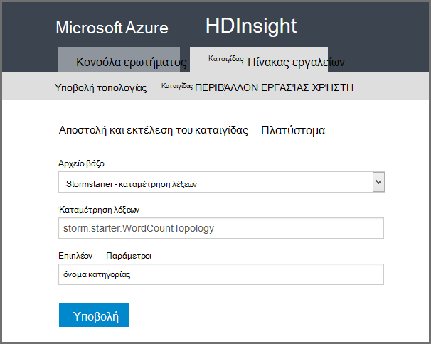

<properties
    pageTitle="Εισαγωγή στις καταιγίδας Apache στην HDInsight | Microsoft Azure"
    description="Λήψη μια εισαγωγή σχετικά με καταιγίδας Apache και μάθετε πώς μπορείτε να χρησιμοποιήσετε καταιγίδας στην HDInsight για να δημιουργήσετε λύσεις ανάλυση δεδομένα σε πραγματικό χρόνο στο cloud."
    services="hdinsight"
    documentationCenter=""
    authors="Blackmist"
    manager="jhubbard"
    editor="cgronlun"
    tags="azure-portal"/>

<tags
   ms.service="hdinsight"
   ms.devlang="na"
   ms.topic="get-started-article"
   ms.tgt_pltfrm="na"
   ms.workload="big-data"
   ms.date="10/11/2016"
   ms.author="larryfr"/>

#Εισαγωγή στις καταιγίδας Apache στην HDInsight: ανάλυση σε πραγματικό χρόνο για Hadoop

Καταιγίδας Apache στην HDInsight σάς επιτρέπει να δημιουργήσετε λύσεις ανάλυση κατανεμημένες, σε πραγματικό χρόνο στο περιβάλλον Azure χρησιμοποιώντας [Apache Hadoop](http://hadoop.apache.org).

##Τι είναι το καταιγίδας Apache;

Καταιγίδας Apache είναι ένα σύστημα κατανέμεται, ανοχή, Άνοιγμα προέλευσης κατά τον υπολογισμό που σας επιτρέπει να επεξεργάζονται τα δεδομένα σε πραγματικό χρόνο με Hadoop. Λύσεις καταιγίδας επίσης να παρέχετε εγγυημένη επεξεργασίας δεδομένων, με τη δυνατότητα να αναπαραγάγετε τα δεδομένα που δεν έγινε επεξεργασία με επιτυχία την πρώτη φορά.

##Γιατί να χρησιμοποιήσετε καταιγίδας στην HDInsight;

Καταιγίδας Apache στην HDInsight είναι ένα σύμπλεγμα διαχειριζόμενων ενοποιηθεί με το Azure περιβάλλον. Παρέχει τα παρακάτω βασικά πλεονεκτήματα:

* Εκτελεί ως διαχειριζόμενη υπηρεσία με ένα SLA 99,9% του χρόνου

* Χρησιμοποιήστε τη γλώσσα της επιλογής σας: παρέχει υποστήριξη για τα στοιχεία καταιγίδας γραμμένο σε **Java**, **C#**και **Python**

    * Υποστηρίζει συνδυασμό γλώσσες προγραμματισμού: ανάγνωση δεδομένων με χρήση Java και, στη συνέχεια, επεξεργαστεί χρησιμοποιώντας C#
    
        > [AZURE.NOTE] C# τοπολογίες υποστηρίζονται μόνο σε συμπλεγμάτων HDInsight που βασίζεται στα Windows.

    * Χρησιμοποιήστε το περιβάλλον εργασίας Java **Trident** για να δημιουργήσετε τοπολογίες καταιγίδας που υποστηρίζουν "ακριβώς αφού" Επεξεργασία μηνύματα, διατήρηση "συναλλαγών" αποθήκευσης δεδομένων και ένα σύνολο κοινές λειτουργίες ανάλυσης ροής

* Περιλαμβάνει ενσωματωμένες δυνατότητες κλίμακας προς τα επάνω και προς τα κάτω κλίμακα: κλιμάκωση ένα σύμπλεγμα HDInsight με καμία επίδραση στην εκτέλεση τοπολογίες καταιγίδας

* Ενοποίηση με άλλες υπηρεσίες του Azure, συμπεριλαμβανομένων των συμβάν διανομέα, Azure εικονικού δικτύου, βάση δεδομένων SQL, χώρος αποθήκευσης αντικειμένων Blob και DocumentDB

    * Συνδυασμός τις δυνατότητες πολλών συμπλεγμάτων HDInsight χρησιμοποιώντας Azure εικονικού δικτύου: δημιουργία αναλυτικών αγωγών που χρησιμοποιούν το HDInsight, HBase ή Hadoop συμπλεγμάτων

Για μια λίστα με εταιρείες που χρησιμοποιούν καταιγίδας Apache για λύσεις τους σε πραγματικό χρόνο ανάλυση, ανατρέξτε στο θέμα [Εταιρείες με χρήση Apache καταιγίδας](https://storm.apache.org/documentation/Powered-By.html).

Για να ξεκινήσετε να χρησιμοποιείτε καταιγίδας, ανατρέξτε στο θέμα [Γρήγορα αποτελέσματα με το καταιγίδας στην HDInsight][gettingstarted].

###Διευκόλυνση της προμήθειας

Μπορείτε να προμήθεια μιας νέας καταιγίδας σε σύμπλεγμα HDInsight σε λεπτά. Καθορίστε το όνομα του συμπλέγματος, το μέγεθος, το λογαριασμό διαχειριστή και το λογαριασμό χώρου αποθήκευσης. Azure θα δημιουργήσει το σύμπλεγμα, συμπεριλαμβανομένων των δειγμάτων τοπολογίες και ενός πίνακα εργαλείων διαχείρισης web.

> [AZURE.NOTE] Μπορείτε επίσης να προμήθεια συμπλεγμάτων καταιγίδας χρησιμοποιώντας το [Azure CLI](../xplat-cli-install.md) ή το [Azure PowerShell](../powershell-install-configure.md).

Μέσα σε 15 λεπτά από την υποβολή της αίτησης, θα έχετε ένα νέο σύμπλεγμα καταιγίδας εκτελείται και είστε έτοιμοι για την πρώτη σωλήνωση σε πραγματικό χρόνο ανάλυση.

###Ευκολία στη χρήση

__Για Linux βάσει καταιγίδας στην συμπλεγμάτων HDInsight__, μπορείτε να συνδεθείτε με το σύμπλεγμα χρησιμοποιώντας SSH και χρησιμοποιήστε το `storm` εντολή για να ξεκινήσετε και διαχείριση τοπολογίες. Επιπλέον, μπορείτε να χρησιμοποιήσετε Ambari για την παρακολούθηση της υπηρεσίας καταιγίδας και περιβάλλον εργασίας Χρήστη του καταιγίδας για την παρακολούθηση και διαχείριση εκτελείται τοπολογίες.

Για περισσότερες πληροφορίες σχετικά με την εργασία με βάσει Linux καταιγίδας συμπλεγμάτων, ανατρέξτε στο θέμα [Γρήγορα αποτελέσματα με το καταιγίδας Apache στην βάσει Linux HDInsight](hdinsight-apache-storm-tutorial-get-started-linux.md).

__Για Windows βάσει καταιγίδας στην συμπλεγμάτων HDInsight__, τα εργαλεία HDInsight για το Visual Studio σάς επιτρέπουν να δημιουργήσετε C# και υβριδικό C# / τοπολογίες Java, και, στη συνέχεια, υποβολή τους για να σας καταιγίδας σε σύμπλεγμα HDInsight.  

Εργαλεία HDInsight για το Visual Studio παρέχει επίσης ένα περιβάλλον εργασίας που σας επιτρέπει να παρακολουθείτε και να διαχειρίζεστε τοπολογίες καταιγίδας σε ένα σύμπλεγμα.

Για παράδειγμα χρησιμοποιώντας τα εργαλεία HDInsight για να δημιουργήσετε μια εφαρμογή καταιγίδας, ανατρέξτε στο θέμα [Ανάπτυξη C# καταιγίδας τοπολογίες με τα εργαλεία HDInsight για το Visual Studio](hdinsight-storm-develop-csharp-visual-studio-topology.md).

Για περισσότερες πληροφορίες σχετικά με τα εργαλεία HDInsight για το Visual Studio, ανατρέξτε στο θέμα [Γρήγορα αποτελέσματα με τα εργαλεία HDInsight για το Visual Studio](../HDInsight/hdinsight-hadoop-visual-studio-tools-get-started.md).

Κάθε καταιγίδας σε σύμπλεγμα HDInsight παρέχει επίσης βασίζεται στο web καταιγίδας πίνακα εργαλείων που σας επιτρέπει να υποβάλετε, παρακολούθηση και διαχείριση τοπολογίες καταιγίδας εκτελείται στο σύμπλεγμα.

Για περισσότερες πληροφορίες σχετικά με τη χρήση του πίνακα εργαλείων καταιγίδας, ανατρέξτε στο θέμα [ανάπτυξη και διαχείριση τοπολογίες καταιγίδας Apache στην HDInsight](hdinsight-storm-deploy-monitor-topology.md).

Καταιγίδας σε HDInsight παρέχει επίσης Εύκολη ενοποίηση με διανομείς συμβάν Azure μέσω του **Spout διανομέα συμβάν**. Την πιο πρόσφατη έκδοση αυτού του στοιχείου είναι διαθέσιμη στο [https://github.com/hdinsight/hdinsight-storm-examples/tree/master/lib/eventhubs](https://github.com/hdinsight/hdinsight-storm-examples/tree/master/lib/eventhubs). Για περισσότερες πληροφορίες σχετικά με τη χρήση αυτού του στοιχείου, ανατρέξτε στο θέμα τα ακόλουθα έγγραφα.

* [Ανάπτυξη μιας τοπολογίας C# που χρησιμοποιεί διανομείς συμβάν Azure](hdinsight-storm-develop-csharp-event-hub-topology.md)

* [Ανάπτυξη μιας τοπολογίας Java που χρησιμοποιεί διανομείς συμβάν Azure](hdinsight-storm-develop-java-event-hub-topology.md)

###Αξιοπιστία

Καταιγίδας Apache πάντα εγγυάται ότι κάθε εισερχόμενου μηνύματος θα είναι πλήρως επεξεργασία, ακόμα και όταν η ανάλυση δεδομένων κατανέμονται εκατοντάδες κόμβους.

Ο **κόμβος Nimbus** παρέχει παρόμοια λειτουργικότητα για τη Hadoop JobTracker και αναθέτει εργασίες σε άλλους κόμβους του συμπλέγματος μέσω **Zookeeper**. Κόμβοι zookeeper συντονισμό για το σύμπλεγμα και διευκολύνει την επικοινωνία μεταξύ Nimbus και η διαδικασία **επόπτη** σε τους κόμβους εργασίας. Εάν μία κόμβος επεξεργασίας μεταβαίνει προς τα κάτω, στον κόμβο Nimbus ενημερώνεται και εκχωρεί την εργασία και σχετικών δεδομένων σε έναν άλλο κόμβο.

Η προεπιλεγμένη ρύθμιση παραμέτρων για Apache καταιγίδας είναι να έχετε μόνο μία Nimbus κόμβο. Καταιγίδας στην HDInsight εκτελείται δύο κόμβους Nimbus. Εάν ο κύριος κόμβος αποτύχει, το σύμπλεγμα HDInsight Μετάβαση στον δευτερεύοντα κόμβο κατά την ανάκτηση τον κύριο κόμβο.

###Κλίμακα

Παρόλο που μπορείτε να καθορίσετε τον αριθμό των κόμβους στο σύμπλεγμά σας κατά τη δημιουργία, που μπορεί να θέλετε να μεγέθυνση ή σμίκρυνση του συμπλέγματος ώστε να ταιριάζει με φόρτο εργασίας. Όλα συμπλεγμάτων HDInsight σάς επιτρέπουν να αλλάξετε τον αριθμό των κόμβους του συμπλέγματος, ακόμα και κατά την επεξεργασία δεδομένων.

> [AZURE.NOTE] Για να επωφεληθείτε από νέα κόμβους που προστίθεται μέσω κλίμακας, θα πρέπει να νέα εξισορρόπηση τοπολογίες αποτελέσματα πριν από το μέγεθος του συμπλέγματος ήταν αυξάνεται.

###Υποστήριξη

Καταιγίδας στην HDInsight διατίθεται με πλήρη εταιρικό επίπεδο υποστήριξης 24/7. Καταιγίδας στην HDInsight διαθέτει επίσης ένα SLA 99,9%. Αυτό σημαίνει ότι θα σας εγγυάται ότι το σύμπλεγμα θα έχουν εξωτερική σύνδεση τουλάχιστον 99,9% του χρόνου.

##Συνήθεις περιπτώσεις χρήσης για ανάλυση σε πραγματικό χρόνο

Ακολουθούν ορισμένα κοινά σενάρια για την οποία μπορείτε να χρησιμοποιήσετε καταιγίδας Apache στην HDInsight. Για πληροφορίες σχετικά με τα σενάρια ρεαλιστικό, διαβάστε [Πώς εταιρείες που χρησιμοποιούν καταιγίδας](https://storm.apache.org/documentation/Powered-By.html).

* Internet πράγματα (IoT)
* Εντοπισμός απάτη
* Κοινωνικές ανάλυσης
* Εξαγωγή, μετασχηματισμός, φόρτωσης (ETL)
* Παρακολούθηση δικτύου
* Αναζήτηση
* Δέσμευση κινητές συσκευές

##Πώς γίνεται η επεξεργασία των δεδομένων σε HDInsight καταιγίδας;

Καταιγίδας Apache εκτελείται **τοπολογίες** αντί για τις εργασίες MapReduce που θα μπορεί να είστε εξοικειωμένοι με HDInsight ή Hadoop. Μιας καταιγίδας σε σύμπλεγμα HDInsight περιέχει δύο τύπους κόμβοι: κεντρικών κόμβους που εκτελούνται κόμβους **Nimbus** και εργασίας που εκτελούνται **επόπτη**.

* **Nimbus**: παρόμοια με την JobTracker στο Hadoop, είναι υπεύθυνος για τη διανομή κώδικα σε όλο το σύμπλεγμα και ανάθεση εργασιών σε εικονικές μηχανές παρακολούθησης για την αποτυχία. HDInsight παρέχει δύο Nimbus κόμβους, επομένως δεν υπάρχει καμία μοναδικό σημείο αποτυχίας για καταιγίδας στην HDInsight

* **Επόπτη**: Ο επόπτης για κάθε κόμβο εργασίας είναι υπεύθυνος για την έναρξη και διακοπή **διαδικασιών εργασίας** στον κόμβο.

* **Η διαδικασία εργασίας**: εκτελείται ένα υποσύνολο μιας **τοπολογίας**. Μια ενσωματωμένη τοπολογία κατανέμεται σε πολλά διαδικασιών εργασίας σε όλο το σύμπλεγμα.

* **Τοπολογία**: Καθορίζει ένα γράφημα του κατά τον υπολογισμό που επεξεργάζεται **ροών** δεδομένων. Σε αντίθεση με τις εργασίες MapReduce, τοπολογίες εκτέλεση μέχρι να διακόψετε τους.

* **Ροή**: μια μη δεσμευμένη συλλογή **πλειάδων**. Ροές παράγονται από **spouts** και **μπουλονιών**και τους καταναλώνεται από **μπουλονιών**.

* **Πλειάδας**: μια καθορισμένη λίστα δυναμικό πληκτρολογημένες τιμών.

* **Spout**: χρησιμοποιεί δεδομένα από μια προέλευση δεδομένων και εκπέμπει ένα ή περισσότερα **ροών**.

    > [AZURE.NOTE] Σε πολλές περιπτώσεις, γίνεται ανάγνωση δεδομένων από μια ουρά, όπως Kafka, ουρές Bus υπηρεσίας Azure ή το συμβάν διανομείς. Ουρά εξασφαλίζει ότι έχει διατηρηθεί δεδομένων εάν υπάρχει μια μη διαθεσιμότητα.

* **Κεραυνό**: καταναλώνει **ροών**και εκτελεί επεξεργασίας σε **πλειάδων**μπορεί να εκπέμπει **ροών**. Στοιχεία είναι επίσης υπεύθυνοι για την εγγραφή δεδομένων σε εξωτερικό χώρο αποθήκευσης, όπως μια ουρά, HDInsight, HBase, ένα blob ή άλλες χώρου αποθήκευσης δεδομένων.

* **Apache Thrift**: ένα πλαίσιο λογισμικού για την ανάπτυξη μεταβλητού μεγέθους υπηρεσίας σταυρό γλώσσα. Σας επιτρέπει να δημιουργείτε τις υπηρεσίες που λειτουργούν μεταξύ C++, Java, Python, PHP, φωνητικής γραφής, Erlang, Perl, Haskell, C#, κακάο, JavaScript, Node.js, Smalltalk και άλλες γλώσσες.

    * **Nimbus** είναι μια υπηρεσία Thrift και μια **τοπολογία** είναι ένας ορισμός Thrift, ώστε να είναι δυνατή η ανάπτυξη τοπολογίες χρησιμοποιώντας μια ποικιλία γλώσσες προγραμματισμού.

Για περισσότερες πληροφορίες σχετικά με τα στοιχεία καταιγίδας, ανατρέξτε στο θέμα το [πρόγραμμα εκμάθησης καταιγίδας] [ apachetutorial] στο apache.org.

##Ποιες γλώσσες προγραμματισμού μπορώ να χρησιμοποιήσω;

Το καταιγίδας σε σύμπλεγμα HDInsight παρέχει υποστήριξη για C# Java και Python.

### C & #35;

Τα εργαλεία HDInsight για το Visual Studio επιτρέπει στους προγραμματιστές .NET για να σχεδιάσετε και να εφαρμόζετε μια τοπολογία στον C#. Μπορείτε επίσης να δημιουργήσετε τοπολογίες υβριδική που χρησιμοποιούν στοιχεία Java και C#.

Για περισσότερες πληροφορίες, ανατρέξτε στο θέμα [Ανάπτυξη C# τοπολογίες για Apache καταιγίδας στη χρήση του Visual Studio HDInsight](hdinsight-storm-develop-csharp-visual-studio-topology.md).

###Java

Περισσότερα παραδείγματα Java αντιμετωπίσετε θα απλό Java ή Trident. Trident είναι μια υψηλού επιπέδου αφαίρεσης που σας διευκολύνει να κάνετε πράγματα όπως συνδέσμους, συναθροίσεων, ομαδοποίησης και φιλτραρίσματος. Ωστόσο, Trident ενεργεί δέσμες πλειάδων, ενώ μια λύση ανεπεξέργαστα Java επεξεργάζεται μιας πλειάδας ροή μία κάθε φορά.

Για περισσότερες πληροφορίες σχετικά με την Trident, ανατρέξτε στο θέμα το [πρόγραμμα εκμάθησης Trident](https://storm.apache.org/documentation/Trident-tutorial.html) στο apache.org.

Για παραδείγματα Java και Trident τοπολογίες, ανατρέξτε στη [λίστα των παράδειγμα καταιγίδας τοπολογίες](hdinsight-storm-example-topology.md) ή τα παραδείγματα καταιγίδας starter στην το σύμπλεγμά σας HDInsight.

Τα παραδείγματα καταιγίδας starter βρίσκονται στον κατάλογο __/usr/hdp/current/storm-client/contrib/storm-starter__ στην βάσει Linux συμπλεγμάτων και στον κατάλογο **%storm_home%\contrib\storm-starter** συμπλεγμάτων που βασίζεται στα Windows.

##Ποιες είναι ορισμένες κοινές μοτίβα ανάπτυξης;

###Επεξεργασία εγγυημένη μηνυμάτων

Καταιγίδας να παράσχετε διαφορετικά επίπεδα επεξεργασίας εγγυημένη μηνυμάτων. Για παράδειγμα, μια βασική εφαρμογή καταιγίδας να εξασφαλίσετε στο ελάχιστο-μίας επεξεργασίας και να εξασφαλίσετε ακριβώς Trident-επεξεργασία μία φορά.

Για περισσότερες πληροφορίες, δείτε [τις εγγυήσεις για την επεξεργασία δεδομένων](https://storm.apache.org/about/guarantees-data-processing.html) με apache.org.

###IBasicBolt

Το μοτίβο της ανάγνωσης μιας πλειάδας εισαγωγής, εκπομπής μηδέν ή περισσότερες πλειάδων και, στη συνέχεια, acking εισαγωγής πλειάδας αμέσως στο τέλος της μεθόδου execute είναι πολύ συνηθισμένη και καταιγίδας παρέχει το περιβάλλον εργασίας [IBasicBolt](https://storm.apache.org/apidocs/backtype/storm/topology/IBasicBolt.html) για την αυτοματοποίηση αυτό το μοτίβο.

###Σύνδεσμοι

Συμμετοχή σε δύο ροών δεδομένων διαφέρουν μεταξύ των εφαρμογών. Για παράδειγμα, μπορείτε να ενώσετε κάθε πλειάδας από πολλών ροών σε μία νέα ροή ή μπορείτε να ενώσετε μόνο δέσμες πλειάδων για ένα συγκεκριμένο παράθυρο. Σε κάθε περίπτωση, τη συμμετοχή μπορεί να πραγματοποιηθεί με τη χρήση [fieldsGrouping](http://javadox.com/org.apache.storm/storm-core/0.9.1-incubating/backtype/storm/topology/InputDeclarer.html#fieldsGrouping%28java.lang.String,%20backtype.storm.tuple.Fields%29), που είναι ένας τρόπος για τον καθορισμό του τρόπου δρομολόγησης πλειάδων σε στοιχεία.

Στο παρακάτω παράδειγμα Java, fieldsGrouping χρησιμοποιείται για τη δρομολόγηση πλειάδων που προέρχονται από τα στοιχεία "1", "2" και "3" για να η ράβδος **MyJoiner** .

    builder.setBolt("join", new MyJoiner(), parallelism) .fieldsGrouping("1", new Fields("joinfield1", "joinfield2")) .fieldsGrouping("2", new Fields("joinfield1", "joinfield2")) .fieldsGrouping("3", new Fields("joinfield1", "joinfield2"));

###Δέσμης

Δέσμης μπορεί να πραγματοποιηθεί διάφορους τρόπους. Με μια βασική τοπολογία καταιγίδας Java, που μπορεί να χρησιμοποιήσετε απλού μετρητή δέσμη X αριθμό πλειάδων πριν εκπομπής τους ή χρησιμοποιήστε έναν εσωτερικό χρονισμό μηχανισμό γνωστό ως "πλειάδας υποδιαίρεσης" να εκπέμπει μια δέσμη κάθε X δευτερόλεπτα.

Για ένα παράδειγμα της χρήσης υποδιαίρεσης πλειάδων, ανατρέξτε στο θέμα [ανάλυση δεδομένων αισθητήρα με καταιγίδας και HBase σε HDInsight](hdinsight-storm-sensor-data-analysis.md).

Εάν χρησιμοποιείτε Trident, βασίζεται στην επεξεργασία δέσμες πλειάδων.

###Προσωρινή αποθήκευση

Προσωρινή αποθήκευση στη μνήμη χρησιμοποιείται συχνά ως μηχανισμό για την επιτάχυνση της επεξεργασίας επειδή διατηρεί συχνά χρησιμοποιούνται περιουσιακών στοιχείων στη μνήμη. Επειδή μια τοπολογία κατανέμεται σε πολλούς κόμβους και πολλών διαδικασιών μέσα σε κάθε κόμβο, θα πρέπει να χρησιμοποιήσετε [fieldsGrouping](http://javadox.com/org.apache.storm/storm-core/0.9.1-incubating/backtype/storm/topology/InputDeclarer.html#fieldsGrouping%28java.lang.String,%20backtype.storm.tuple.Fields%29) για να βεβαιωθείτε ότι πλειάδων που περιέχει τα πεδία που χρησιμοποιούνται για την αναζήτηση cache θα δρομολογούνται πάντα την ίδια διαδικασία. Αυτό, αποφεύγεται η αναπαραγωγή cache εγγραφών σε διεργασίες.

###Η ροή επάνω Ν

Όταν τοπολογία σας εξαρτάται από τον υπολογισμό μιας τιμής "επάνω Ν", όπως η επάνω γραμμή 5 τάσεις στο Twitter, πρέπει να τον υπολογισμό της τιμής επάνω Ν παράλληλα και, στη συνέχεια, να συγχωνεύσετε την έξοδο από αυτούς τους υπολογισμούς σε μια καθολική τιμή. Αυτό μπορεί να γίνει με τη χρήση [fieldsGrouping](http://javadox.com/org.apache.storm/storm-core/0.9.1-incubating/backtype/storm/topology/InputDeclarer.html#fieldsGrouping%28java.lang.String,%20backtype.storm.tuple.Fields%29) για δρομολόγηση με πεδίο για το παράλληλο βίδες (το οποίο διαμερίσματα τα δεδομένα από την τιμή του πεδίου) και, στη συνέχεια, διαδρομή προς ένα κεραυνό που καθολικά προσδιορίζει την τιμή επάνω Ν.

Για παράδειγμα, δείτε το παράδειγμα [RollingTopWords](https://github.com/nathanmarz/storm-starter/blob/master/src/jvm/storm/starter/RollingTopWords.java) .

##Τι τύπο καταγραφής έφοδο χρήση;

Καταιγίδας χρησιμοποιεί Apache Log4j την καταγραφή πληροφοριών. Από προεπιλογή, έχει συνδεθεί σε μεγάλο όγκο δεδομένων και μπορεί να είναι δύσκολο να ταξινομήσουν τις πληροφορίες. Μπορείτε να συμπεριλάβετε ένα αρχείο ρύθμισης παραμέτρων καταγραφής ως μέρος του τοπολογία σας καταιγίδας σε στοιχείο ελέγχου καταγραφή συμπεριφορά.

Για μια τοπολογία παράδειγμα που παρουσιάζει πώς μπορείτε να ρυθμίσετε τις παραμέτρους καταγραφής, ανατρέξτε στο θέμα παράδειγμα [βασίζεται σε Java WordCount](hdinsight-storm-develop-java-topology.md) για καταιγίδας στην HDInsight.

##Επόμενα βήματα

Μάθετε περισσότερα σχετικά με τις λύσεις σε πραγματικό χρόνο ανάλυση με καταιγίδας Apache στο HDInsight:

* [Γρήγορα αποτελέσματα με το καταιγίδας στην HDInsight][gettingstarted]

* [Παράδειγμα τοπολογίες για καταιγίδας στην HDInsight](hdinsight-storm-example-topology.md)

[stormtrident]: https://storm.apache.org/documentation/Trident-API-Overview.html
[samoa]: http://yahooeng.tumblr.com/post/65453012905/introducing-samoa-an-open-source-platform-for-mining
[apachetutorial]: https://storm.apache.org/documentation/Tutorial.html
[gettingstarted]: hdinsight-apache-storm-tutorial-get-started-linux.md
