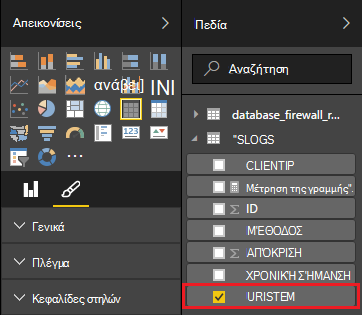

<properties
 pageTitle="Χρήση καταιγίδας Apache με το Power BI | Microsoft Azure"
 description="Δημιουργήστε μια αναφορά του Power BI με χρήση δεδομένων από μια τοπολογία C# εκτελείται σε ένα σύμπλεγμα καταιγίδας Apache στο HDInsight."
 services="hdinsight"
 documentationCenter=""
 authors="Blackmist"
 manager="jhubbard"
 editor="cgronlun"
    tags="azure-portal"/>

<tags
 ms.service="hdinsight"
 ms.devlang="dotnet"
 ms.topic="article"
 ms.tgt_pltfrm="na"
 ms.workload="big-data"
 ms.date="10/27/2016"
 ms.author="larryfr"/>

# Χρήση του Power BI για την απεικόνιση δεδομένων από μια τοπολογία Apache καταιγίδας

Power BI επιτρέπει την οπτική εμφάνιση δεδομένων ως αναφορές. Χρησιμοποιώντας τα πρότυπα του Visual Studio για καταιγίδας στην HDInsight, μπορείτε να χρησιμοποιήσετε εύκολα αποθηκεύστε τα δεδομένα από μια τοπολογία εκτελείται σε ένα καταιγίδας Apache σε σύμπλεγμα HDInsight σε SQL Azure, και, στη συνέχεια, οπτικοποίηση των δεδομένων με χρήση του Power BI.

Σε αυτό το έγγραφο, θα μάθετε πώς να χρησιμοποιείτε το Power BI για να δημιουργήσετε μια αναφορά από τα δεδομένα που δημιουργούνται από μια τοπολογία καταιγίδας Apache και αποθηκεύονται στη βάση δεδομένων SQL Azure.

> [AZURE.NOTE] Ενώ τα βήματα σε αυτό το έγγραφο που βασίζονται σε ένα περιβάλλον ανάπτυξης Windows με το Visual Studio, μεταγλωττισμένο έργου μπορούν να υποβληθούν σε σύμπλεγμα μια Linux ή HDInsight που βασίζεται στα Windows. Μόνο βάσει Linux συμπλεγμάτων δημιουργηθεί μετά την υποστήριξη 28/10/2016 τοπολογίες SCP.NET.
>
> Για να χρησιμοποιήσετε μια τοπολογία C# με ένα σύμπλεγμα βάσει Linux, πρέπει να ενημερώσετε το πακέτο Microsoft.SCP.Net.SDK NuGet χρησιμοποιείται από το έργο σας στην έκδοση 0.10.0.6 ή νεότερη έκδοση. Την έκδοση του πακέτου επίσης πρέπει να συμφωνεί με την κύρια έκδοση καταιγίδας εγκατεστημένο στον HDInsight. Για παράδειγμα, καταιγίδας σε εκδόσεις HDInsight 3.3 και 3.4 Χρησιμοποιήστε καταιγίδας έκδοση 0.10.x, ενώ HDInsight 3.5 χρησιμοποιεί καταιγίδας 1.0.x.
> 
> Τοπολογίες C# σε βάσει Linux συμπλεγμάτων πρέπει να χρησιμοποιήστε διαίρεσης 4,5 .NET, και μονοφωνικό για να εκτελέσετε στο σύμπλεγμα HDInsight. Τα περισσότερα από όσα θα λειτουργούν, ωστόσο θα πρέπει να ελέγξετε το έγγραφο [Μονοφωνικό συμβατότητας](http://www.mono-project.com/docs/about-mono/compatibility/) για πιθανές ασυμβατότητα.
>
> Για την έκδοση Java αυτό το έργο, το οποίο θα λειτουργεί σε ένα σύμπλεγμα βάσει Linux ή βασίζεται στα Windows, ανατρέξτε στο θέμα [διαδικασία συμβάντα από διανομείς συμβάν Azure με καταιγίδας στην HDInsight (Java)](hdinsight-storm-develop-java-event-hub-topology.md).

## Προαπαιτούμενα στοιχεία

- Μια συνδρομή του Azure. Ανατρέξτε στο θέμα [λήψη Azure δωρεάν δοκιμαστικής έκδοσης](https://azure.microsoft.com/documentation/videos/get-azure-free-trial-for-testing-hadoop-in-hdinsight/).

* Ένας χρήστης Azure Active Directory με την access [Power BI](https://powerbi.com)

* Visual Studio (μία από τις παρακάτω εκδόσεις)

    * Visual Studio 2012, με [4 ενημέρωσης](http://www.microsoft.com/download/details.aspx?id=39305)

    * Visual Studio 2013 με [Ενημέρωση 4](http://www.microsoft.com/download/details.aspx?id=44921) ή [Visual Studio 2013 Κοινότητας](http://go.microsoft.com/fwlink/?linkid=517284&clcid=0x409)

    * [Visual Studio 2015](https://www.visualstudio.com/downloads/download-visual-studio-vs.aspx)

* Τα εργαλεία HDInsight για το Visual Studio: ανατρέξτε στο θέμα [Γρήγορα αποτελέσματα με τα εργαλεία HDInsight για το Visual Studio](../HDInsight/hdinsight-hadoop-visual-studio-tools-get-started.md) για πληροφορίες σχετικά με πληροφορίες εγκατάστασης.

## Πώς λειτουργεί

Αυτό το παράδειγμα περιέχει μια τοπολογία C# καταιγίδας που δημιουργεί τυχαία δεδομένα του αρχείου καταγραφής Internet Information Services (IIS). Αυτά τα δεδομένα, στη συνέχεια, είναι γραμμένο σε μια βάση δεδομένων SQL και από εκεί χρησιμοποιείται για τη δημιουργία αναφορών στο Power BI.

Ακολουθεί μια λίστα με τα αρχεία που υλοποιεί τη λειτουργικότητα κύριο αυτό το παράδειγμα.

* **SqlAzureBolt.cs**: καταγράφει τις πληροφορίες που παράγεται στην τοπολογία καταιγίδας με βάση δεδομένων SQL.

* **IISLogsTable.sql**: προτάσεις το Transact-SQL που χρησιμοποιούνται για τη δημιουργία της βάσης δεδομένων που είναι αποθηκευμένα τα δεδομένα στο.

> [AZURE.WARNING] Πρέπει να δημιουργήσετε τον πίνακα σε βάση δεδομένων SQL πριν από την έναρξη της τοπολογίας στην το σύμπλεγμά σας HDInsight.

## Κάντε λήψη του παραδείγματος

Κάντε λήψη του το [παράδειγμα HDInsight C# καταιγίδας Power BI](https://github.com/Azure-Samples/hdinsight-dotnet-storm-powerbi). Για να κάνετε λήψη του, είτε διακλάδωσης/κλωνοποίηση χρησιμοποιώντας [git](http://git-scm.com/)ή να χρησιμοποιήσετε τη σύνδεση **λήψης** για να κάνετε λήψη μιας .zip του αρχείου.

## Δημιουργία βάσης δεδομένων

1. Χρησιμοποιήστε τα βήματα στο έγγραφο [βάση δεδομένων SQL του προγράμματος εκμάθησης](../sql-database/sql-database-get-started.md) για να δημιουργήσετε μια νέα βάση δεδομένων SQL.

2. Σύνδεση με τη βάση δεδομένων, ακολουθώντας τα βήματα στο έγγραφο [σύνδεση με μια βάση δεδομένων SQL με το Visual Studio](../sql-database/sql-database-connect-query.md) για να συνδεθείτε στη βάση δεδομένων.

4. Κάντε δεξί κλικ στη βάση δεδομένων στην Εξερεύνηση των αντικειμένων και δημιουργήστε ένα __Νέο ερώτημα__. Επικόλληση των περιεχομένων από το αρχείο __IISLogsTable.sql__ περιλαμβάνεται του έργου που έχετε λάβει στο παράθυρο ερωτήματος και, στη συνέχεια, χρησιμοποιήστε συνδυασμό πλήκτρων Ctrl + Shift + E για να εκτελέσετε το ερώτημα. Θα πρέπει να λάβετε ένα μήνυμα ότι η command(s) ολοκληρώθηκε με επιτυχία.

    Μόλις ολοκληρωθεί αυτό, θα υπάρχει ένα νέο πίνακα με το όνομα __IISLOGS__ στη βάση δεδομένων.

## Ρύθμιση παραμέτρων του δείγματος

1. Από την [πύλη του Azure](https://portal.azure.com), επιλέξτε τη βάση δεδομένων SQL. Από την ενότητα __βασικά στοιχεία__ του blade βάσης δεδομένων SQL, επιλέξτε __Εμφάνιση συμβολοσειρές σύνδεσης βάσης δεδομένων__. Από τη λίστα που εμφανίζεται, αντιγράψτε τις πληροφορίες __ADO.NET (έλεγχος ταυτότητας SQL)__ .

1. Ανοίξτε το δείγμα στο Visual Studio. Από την **Εξερεύνηση λύσεων**, ανοίξτε το αρχείο **App.config** και, στη συνέχεια, βρείτε την εξής καταχώρηση:

        <add key="SqlAzureConnectionString" value="##TOBEFILLED##" />
    
    Αντικαταστήστε την τιμή __## TOBEFILLED ##__ με τη συμβολοσειρά σύνδεσης βάσης δεδομένων που αντιγράψατε στο προηγούμενο βήμα. Αντικατάσταση __{σας\_username}__ και __{σας\_τον κωδικό πρόσβασης}__ με το όνομα χρήστη και τον κωδικό πρόσβασης για τη βάση δεδομένων.

2. Αποθηκεύστε και κλείστε τα αρχεία.

## Ανάπτυξη του δείγματος

1. Από την **Εξερεύνηση λύσεων**, κάντε δεξί κλικ στο έργο **StormToSQL** και επιλέξτε **Υποβολή για να καταιγίδας στην HDInsight**. Επιλέξτε το σύμπλεγμα HDInsight από το παράθυρο διαλόγου **Σύμπλεγμα καταιγίδας** αναπτυσσόμενη λίστα.

    > [AZURE.NOTE] Ενδέχεται να χρειαστούν μερικά δευτερόλεπτα για την αναπτυσσόμενη λίστα **Καταιγίδας σύμπλεγμα** για να συμπληρώσετε με ονόματα διακομιστών.
    >
    > Εάν σας ζητηθεί, πληκτρολογήστε τα διαπιστευτήρια σύνδεσης για τη συνδρομή σας στο Azure. Εάν έχετε περισσότερες από μία συνδρομές, συνδεθείτε με αυτό που περιέχει το καταιγίδας σε σύμπλεγμα HDInsight.

2. Όταν η τοπολογία υποβλήθηκε με επιτυχία, θα πρέπει να εμφανίζεται το τοπολογίες καταιγίδας για το σύμπλεγμα. Επιλέξτε την καταχώρηση SqlAzureWriterTopology από τη λίστα για να προβάλετε πληροφορίες σχετικά με την τοπολογία εκτελείται.

    

    Μπορείτε να χρησιμοποιήσετε αυτήν την προβολή για να δείτε πληροφορίες σχετικά με την τοπολογία ή κάντε διπλό κλικ σε εγγραφές (όπως το SqlAzureBolt) για να δείτε πληροφορίες που αφορούν ειδικά ένα στοιχείο της τοπολογίας.

3. Μετά την τοπολογία έχει εκτελέσατε για λίγα λεπτά, επιστρέψτε στο παράθυρο ερώτημα SQL που χρησιμοποιήσατε για να δημιουργήσετε τη βάση δεδομένων. Αντικαταστήστε το υπάρχον δηλώσεις με τα εξής.

        select * from iislogs;
    
    Χρήση Ctrl + Shift + E για να εκτελέσετε το ερώτημα και που πρέπει να λάβετε παρόμοια με τα ακόλουθα αποτελέσματα.
    
        1   2016-05-27 17:57:14.797 255.255.255.255 /bar    GET 200
        2   2016-05-27 17:57:14.843 127.0.0.1   /spam/eggs  POST    500
        3   2016-05-27 17:57:14.850 123.123.123.123 /eggs   DELETE  200
        4   2016-05-27 17:57:14.853 127.0.0.1   /foo    POST    404
        5   2016-05-27 17:57:14.853 10.9.8.7    /bar    GET 200
        6   2016-05-27 17:57:14.857 192.168.1.1 /spam   DELETE  200

    Πρόκειται για δεδομένα τα οποία έχει εγγραφεί από την τοπολογία καταιγίδας.

## Δημιουργία μιας αναφοράς

1. Σύνδεση με τη [βάση δεδομένων SQL Azure connector](https://app.powerbi.com/getdata/bigdata/azure-sql-database-with-live-connect) για το Power BI.

2. Μέσα σε __βάσεις δεδομένων__, επιλέξτε __λήψη__.

3. Επιλέξτε __Βάση δεδομένων SQL Azure__και, στη συνέχεια, επιλέξτε __σύνδεση__.

4. Εισαγάγετε τις πληροφορίες για να συνδεθείτε με τη βάση δεδομένων SQL Azure. Μπορείτε να το βρείτε, αν επισκεφθείτε την τοποθεσία του [Azure πύλη](https://portal.azure.com) και επιλέγοντας τη βάση δεδομένων SQL.

    > [AZURE.NOTE] Μπορείτε επίσης να ορίσετε το χρονικό διάστημα ανανέωσης και προσαρμοσμένα φίλτρα χρησιμοποιώντας __Ενεργοποιήσετε επιλογές για προχωρημένους__ από το παράθυρο διαλόγου σύνδεση.

5. Αφού έχετε συνδεθεί, θα δείτε ένα νέο σύνολο δεδομένων με το ίδιο όνομα με τη βάση δεδομένων που είστε συνδεδεμένοι σε. Επιλέξτε το σύνολο δεδομένων για να ξεκινήσετε τη σχεδίαση μιας αναφοράς.

3. Από τα __πεδία__, αναπτύξτε την καταχώρηση __IISLOGS__ . Επιλέξτε το πλαίσιο ελέγχου για __URISTEM__. Αυτό θα δημιουργήσει μια νέα αναφορά που παραθέτει στελεχών URI (/ foo, / ράβδων, κ.λπ.) είστε συνδεδεμένοι στη βάση δεδομένων.

    

5. Στη συνέχεια, σύρετε __τη ΜΈΘΟΔΟ__ στην αναφορά. Η αναφορά θα ενημερωθεί για να παραθέσετε στελεχών και την αντίστοιχη μέθοδο HTTP που χρησιμοποιείται για την αίτηση HTTP.

    

4. Από τη στήλη __Απεικονίσεις__ , επιλέξτε το εικονίδιο __πεδία__ και, στη συνέχεια, επιλέξτε το κάτω βέλος δίπλα στην επιλογή __ΜΕΘΌΔΟΥ__ στην ενότητα __τιμές__ . Από τη λίστα που εμφανίζεται, επιλέξτε __Πλήθος__. Αυτό θα αλλάξει την αναφορά για να εμφανίσετε μια καταμέτρηση του πόσες φορές έγινε πρόσβαση σε ένα συγκεκριμένο URI.

    

6. Στη συνέχεια, επιλέξτε το __γράφημα σωρευμένων στηλών__ για να αλλάξετε τον τρόπο εμφάνισης των πληροφοριών.

    

7. Όταν έχετε ολοκληρώσει την αναφορά τρόπος που θέλετε, χρησιμοποιήστε την καταχώρηση __Αποθήκευση__ από το μενού για να εισαγάγετε ένα όνομα και να αποθηκεύσετε την αναφορά.

## Διακοπή της τοπολογίας

Η τοπολογία θα συνεχίσει να εκτελείται μέχρι να διακόψετε ή να διαγράψετε το καταιγίδας σε σύμπλεγμα HDInsight. Ακολουθήστε τα παρακάτω βήματα για να διακόψετε την τοπολογία.

1. Στο Visual Studio, επιστρέψτε στο πρόγραμμα προβολής τοπολογία και επιλέξτε της τοπολογίας.

2. Επιλέξτε το κουμπί **Τερματισμός** για να διακόψετε την τοπολογία.

    

## Διαγράψτε το σύμπλεγμά σας

[AZURE.INCLUDE [delete-cluster-warning](../../includes/hdinsight-delete-cluster-warning.md)]

## Επόμενα βήματα

Σε αυτό το έγγραφο, μάθατε πώς μπορείτε να στείλετε δεδομένα από μια τοπολογία καταιγίδας σε βάση δεδομένων SQL και, στη συνέχεια, οπτικοποίηση των δεδομένων με χρήση του Power BI. Για πληροφορίες σχετικά με τον τρόπο εργασίας με άλλες τεχνολογίες Azure χρησιμοποιώντας καταιγίδας στην HDInsight, ανατρέξτε στα παρακάτω:

* [Παράδειγμα τοπολογίες για καταιγίδας στην HDInsight](hdinsight-storm-example-topology.md)
