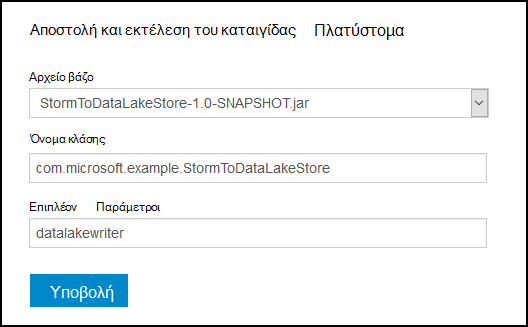

<properties
pageTitle="Χρήση Azure λίμνης χώρου αποθήκευσης δεδομένων με καταιγίδας Apache στην Azure HDInsight"
description="Μάθετε πώς μπορείτε να κάνετε εγγραφή δεδομένων στο χώρο αποθήκευσης λίμνης Azure δεδομένων από μια τοπολογία καταιγίδας Apache HDInsight. Αυτό το έγγραφο και το σχετικό παράδειγμα, δείχνουν πώς το στοιχείο HdfsBolt μπορεί να χρησιμοποιηθεί για εγγραφή στο χώρο αποθήκευσης λίμνης δεδομένων."
services="hdinsight"
documentationCenter="na"
authors="Blackmist"
manager="jhubbard"
editor="cgronlun"/>

<tags
ms.service="hdinsight"
ms.devlang="na"
ms.topic="article"
ms.tgt_pltfrm="na"
ms.workload="big-data"
ms.date="09/06/2016"
ms.author="larryfr"/>

#Χρήση Azure λίμνης χώρου αποθήκευσης δεδομένων με καταιγίδας Apache με HDInsight

Χώρος αποθήκευσης λίμνης Azure δεδομένων είναι μια υπηρεσία αποθήκευσης στο cloud συμβατά HDFS που παρέχει υψηλής απόδοσης, διαθεσιμότητα, διάρκεια ζωής και την αξιοπιστία για τα δεδομένα σας. Σε αυτό το έγγραφο, θα μάθετε πώς μπορείτε να χρησιμοποιήσετε μια τοπολογία βάσει Java καταιγίδας για την εγγραφή δεδομένων στο χώρο αποθήκευσης λίμνης Azure δεδομένων χρησιμοποιώντας το στοιχείο [HdfsBolt](http://storm.apache.org/javadoc/apidocs/org/apache/storm/hdfs/bolt/HdfsBolt.html) , το οποίο παρέχεται ως τμήμα του Apache καταιγίδας.

> [AZURE.IMPORTANT] Η τοπολογία παράδειγμα χρησιμοποιούνται σε αυτό το έγγραφο βασίζεται σε στοιχεία που περιλαμβάνονται με καταιγίδας στην HDInsight συμπλεγμάτων και μπορεί να απαιτεί την τροποποίηση για να εργαστείτε με Azure λίμνης χώρου αποθήκευσης δεδομένων όταν χρησιμοποιείται με άλλες συμπλεγμάτων Apache καταιγίδας.

##Προαπαιτούμενα στοιχεία

* [Java JDK 1.7](https://www.oracle.com/technetwork/java/javase/downloads/jdk7-downloads-1880260.html) ή νεότερη έκδοση
* [Maven 3.x](https://maven.apache.org/download.cgi)
* Μια συνδρομή του Azure
* Μιας καταιγίδας στην έκδοση σύμπλεγμα HDInsight 3,2. Για να δημιουργήσετε μια νέα καταιγίδας σύμπλεγμα HDInsight, χρησιμοποιήστε τα βήματα στο έγγραφο [Χρησιμοποιήστε HDInsight με το χώρο αποθήκευσης λίμνης δεδομένων χρησιμοποιώντας Azure](../data-lake-store/data-lake-store-hdinsight-hadoop-use-portal.md) . Τα βήματα σε αυτό το έγγραφο θα σας καθοδηγήσει να δημιουργείτε νέα HDInsight σύμπλεγμα και χώρου αποθήκευσης λίμνης Azure δεδομένων.  

    > [AZURE.IMPORTANT] Όταν δημιουργείτε το σύμπλεγμα HDInsight, πρέπει να επιλέξετε __καταιγίδας__ ως τύπο σύμπλεγμα και __3,2__ με την έκδοση. Το λειτουργικό σύστημα μπορεί να είναι Windows ή Linux.  

###Ρύθμιση παραμέτρων μεταβλητές περιβάλλοντος

Οι παρακάτω μεταβλητές περιβάλλοντος μπορεί να οριστεί όταν εγκαθιστάτε Java και το JDK σε σας σταθμούς εργασίας ανάπτυξης. Ωστόσο, θα πρέπει να ελέγξετε ότι υπάρχει και ότι περιέχουν τις σωστές τιμές για το σύστημά σας.

* __JAVA_HOME__ - πρέπει να κατευθύνουν στον κατάλογο όπου είναι εγκατεστημένο το περιβάλλον χρόνου εκτέλεσης Java (JRE). Για παράδειγμα, σε μια κατανομή Unix ή Linux, θα πρέπει να έχει μια τιμή που είναι παρόμοια με `/usr/lib/jvm/java-7-oracle`. Στα Windows, αυτό θα έχει μια τιμή που είναι παρόμοια με `c:\Program Files (x86)\Java\jre1.7`.

* __ΔΙΑΔΡΟΜΉ__ - πρέπει να περιλαμβάνει τις ακόλουθες διαδρομές:

    * __JAVA\_για οικιακή ΧΡΉΣΗ__ (ή η ισοδύναμη διαδρομή)
    
    * __JAVA\_HOME\bin__ (ή η ισοδύναμη διαδρομή)
    
    * Στον κατάλογο όπου είναι εγκατεστημένο το Maven

##Τοπολογία εφαρμογής

Το παράδειγμα που χρησιμοποιείται σε αυτό το έγγραφο είναι γραμμένο σε Java και χρησιμοποιεί τα ακόλουθα στοιχεία:

* __TickSpout__: δημιουργεί τα δεδομένα που χρησιμοποιούνται από άλλα στοιχεία της τοπολογίας.

* __PartialCount__: καταμετρά τα συμβάντα που δημιουργούνται με TickSpout.

* __FinalCount__: συγκεντρώσεις καταμέτρηση δεδομένων από PartialCount.

* __ADLStoreBolt__: εγγράφει δεδομένα χρησιμοποιώντας το στοιχείο [HdfsBolt](http://storm.apache.org/javadoc/apidocs/org/apache/storm/hdfs/bolt/HdfsBolt.html) χώρο αποθήκευσης λίμνης δεδομένων Azure.

Το έργο που περιέχει αυτό τοπολογία είναι διαθέσιμη λήψη από [https://github.com/Azure-Samples/hdinsight-storm-azure-data-lake-store](https://github.com/Azure-Samples/hdinsight-storm-azure-data-lake-store).

###Κατανόηση των ADLStoreBolt

Το ADLStoreBolt είναι το όνομα που χρησιμοποιείται για την παρουσία HdfsBolt στην τοπολογία που γράφει Azure λίμνης δεδομένων. Δεν είναι μια ειδική έκδοση του HdfsBolt που δημιουργήθηκε από τη Microsoft. Ωστόσο βασίζεται σε τιμές παραμέτρων πυρήνα τοποθεσίας, καθώς και Hadoop στοιχείων που περιλαμβάνονται με το Azure HDInsight για την επικοινωνία με λίμνης δεδομένων.

Συγκεκριμένα, όταν δημιουργείτε ένα σύμπλεγμα HDInsight, μπορείτε να το συσχετίσετε με ένα χώρο αποθήκευσης λίμνης δεδομένων Azure. Αυτό εγγράφει καταχωρήσεις στο μέγεθος των κύριων τοποθεσίας για το χώρο αποθήκευσης λίμνης δεδομένων που έχετε επιλέξει, που χρησιμοποιούνται από στοιχεία όπως hadoop-πρόγραμμα-πελάτη και hadoop hdfs για να ενεργοποιήσετε την επικοινωνία με το χώρο αποθήκευσης λίμνης δεδομένων.

> [AZURE.NOTE] Microsoft πρόσθεσε κώδικα για την Apache Hadoop και καταιγίδας έργα που επιτρέπει την επικοινωνία με το χώρο αποθήκευσης λίμνης Azure δεδομένων και αντικειμένων Blob του Azure χώρου αποθήκευσης, αλλά αυτή η λειτουργία δεν μπορούν να συμπεριληφθούν από προεπιλογή σε άλλες κατανομές Hadoop και καταιγίδας.

Η ρύθμιση παραμέτρων για HdfsBolt στην τοπολογία είναι ως εξής:

    // 1. Create sync and rotation policies to control when data is synched
    //    (written) to the file system and when to roll over into a new file.
    SyncPolicy syncPolicy = new CountSyncPolicy(1000);
    FileRotationPolicy rotationPolicy = new FileSizeRotationPolicy(0.5f, Units.KB);
    // 2. Set the format. In this case, comma delimited
    RecordFormat recordFormat = new DelimitedRecordFormat().withFieldDelimiter(",");
    // 3. Set the directory name. In this case, '/stormdata/'
    FileNameFormat fileNameFormat = new DefaultFileNameFormat().withPath("/stormdata/");
    // 4. Create the bolt using the previously created settings,
    //    and also tell it the base URL to your Data Lake Store.
    // NOTE! Replace 'MYDATALAKE' below with the name of your data lake store.
    HdfsBolt adlsBolt = new HdfsBolt()
        .withFsUrl("adl://MYDATALAKE.azuredatalakestore.net/")
        .withRecordFormat(recordFormat)
        .withFileNameFormat(fileNameFormat)
        .withRotationPolicy(rotationPolicy)
        .withSyncPolicy(syncPolicy);
    // 4. Give it a name and wire it up to the bolt it accepts data
    //    from. NOTE: The name used here is also used as part of the
    //    file name for the files written to Data Lake Store.
    builder.setBolt("ADLStoreBolt", adlsBolt, 1)
      .globalGrouping("finalcount");
      
Εάν είστε εξοικειωμένοι με τη χρήση HdfsBolt, θα παρατηρήσετε ότι αυτό είναι όλα τα βασικά τυπική ρύθμιση παραμέτρων εκτός από τη διεύθυνση URL. Η διεύθυνση URL παρέχει τη διαδρομή προς το ριζικό κατάλογο του χώρου αποθήκευσης λίμνης δεδομένων Azure.

Καθώς πληκτρολογείτε στο χώρο αποθήκευσης δεδομένων λίμνης χρησιμοποιεί HdfsBolt και είναι απλώς μια αλλαγή διεύθυνσης URL, θα πρέπει να μπορούν να λαμβάνουν οποιαδήποτε υπάρχοντα τοπολογία που γράφει HDFS ή WASB χρησιμοποιώντας HdfsBolt και εύκολα να αλλάξετε, ώστε να χρησιμοποιεί χώρο αποθήκευσης λίμνης Azure δεδομένων.

##Δημιουργία και συσκευασία της τοπολογίας

1. Κάντε λήψη του έργου παράδειγμα από [https://github.com/Azure-Samples/hdinsight-storm-azure-data-lake-store](https://github.com/Azure-Samples/hdinsight-storm-azure-data-lake-store
) περιβάλλον ανάπτυξής σας.

2. Άνοιγμα του `StormToDataLake\src\main\java\com\microsoft\example\StormToDataLakeStore.java` αρχείου σε ένα πρόγραμμα επεξεργασίας και να βρείτε τη γραμμή που περιέχει `.withFsUrl("adl://MYDATALAKE.azuredatalakestore.net/")`. Αλλαγή __MYDATALAKE__ στο όνομα του Azure λίμνης χώρου αποθήκευσης δεδομένων που χρησιμοποιήσατε κατά τη δημιουργία διακομιστή HDInsight.

3. Από μια εντολή προτροπή, terminal, ή στην περίοδο λειτουργίας κελύφους, αλλάξτε τον κατάλογο στη ρίζα της λήψης του έργου και εκτελέστε τις ακόλουθες εντολές για να δημιουργήσετε και να συσκευάσετε της τοπολογίας.

        mvn compile
        mvn package
    
    Μόλις ολοκληρωθεί η Δόμηση και συσκευασία, θα υπάρξει ένα νέο κατάλογο με όνομα `target`, που περιέχει ένα αρχείο με το όνομα `StormToDataLakeStore-1.0-SNAPSHOT.jar`. Περιέχει μεταγλωττισμένο της τοπολογίας.

##Ανάπτυξη και να εκτελέσετε σε βάσει Linux HDInsight

Εάν έχετε δημιουργήσει μια καταιγίδας βάσει Linux σε σύμπλεγμα HDInsight, χρησιμοποιήστε τα παρακάτω βήματα για να αναπτύξετε και να εκτελέσετε της τοπολογίας.

1. Χρησιμοποιήστε την παρακάτω εντολή για να αντιγράψετε την τοπολογία του συμπλέγματος HDInsight. Αντικαταστήστε __ΧΡΉΣΤΗ__ με το όνομα χρήστη SSH που χρησιμοποιήσατε κατά τη δημιουργία του συμπλέγματος. Αντικατάσταση __CLUSTERNAME__ με το όνομα του συμπλέγματος.

        scp target\StormToDataLakeStore-1.0-SNAPSHOT.jar USER@CLUSTERNAME-ssh.azurehdinsight.net:StormToDataLakeStore-1.0-SNAPSHOT.jar
    
    Όταν σας ζητηθεί, πληκτρολογήστε τον κωδικό πρόσβασης που χρησιμοποιείται κατά τη δημιουργία SSH χρήστη για το σύμπλεγμα. Εάν έχετε χρησιμοποιήσει ένα δημόσιο κλειδί αντί για έναν κωδικό πρόσβασης, ίσως χρειαστεί να χρησιμοποιήσετε το `-i` παραμέτρου για να καθορίσετε τη διαδρομή προς το αντίστοιχο ιδιωτικό κλειδί.
    
    > [AZURE.NOTE] Εάν χρησιμοποιείτε ένα πρόγραμμα-πελάτη των Windows για την ανάπτυξη, ίσως δεν έχετε ένα `scp` εντολή. Εάν Ναι, μπορείτε να χρησιμοποιήσετε `pscp`, που είναι διαθέσιμη στο [http://www.chiark.greenend.org.uk/~sgtatham/putty/download.html](http://www.chiark.greenend.org.uk/~sgtatham/putty/download.html).

2. Μόλις ολοκληρωθεί η αποστολή, χρησιμοποιήστε τα ακόλουθα για να συνδεθείτε με το σύμπλεγμα HDInsight χρησιμοποιώντας SSH. Αντικαταστήστε __ΧΡΉΣΤΗ__ με το όνομα χρήστη SSH που χρησιμοποιήσατε κατά τη δημιουργία του συμπλέγματος. Αντικατάσταση __CLUSTERNAME__ με το όνομα του συμπλέγματος.

        ssh USER@CLUSTERNAME-ssh.azurehdinsight.net

    Όταν σας ζητηθεί, πληκτρολογήστε τον κωδικό πρόσβασης που χρησιμοποιείται κατά τη δημιουργία SSH χρήστη για το σύμπλεγμα. Εάν έχετε χρησιμοποιήσει ένα δημόσιο κλειδί αντί για έναν κωδικό πρόσβασης, ίσως χρειαστεί να χρησιμοποιήσετε το `-i` παραμέτρου για να καθορίσετε τη διαδρομή προς το αντίστοιχο ιδιωτικό κλειδί.
    
    > [AZURE.NOTE] Εάν χρησιμοποιείτε ένα πρόγραμμα-πελάτη των Windows για την ανάπτυξη, ακολουθήστε τις πληροφορίες στο στοιχείο [σύνδεση σε βάσει Linux HDInsight με SSH από το Windows](hdinsight-hadoop-linux-use-ssh-windows.md) για πληροφορίες σε χρησιμοποιώντας το πρόγραμμα-πελάτη PuTTY για να συνδεθείτε με το σύμπλεγμα.
    
3. Μόλις συνδεθεί, χρησιμοποιήστε τα ακόλουθα για να ξεκινήσετε την τοπολογία:

        storm jar StormToDataLakeStore-1.0-SNAPSHOT.jar com.microsoft.example.StormToDataLakeStore datalakewriter
    
    Αυτό θα ξεκινήσει η τοπολογία με ένα φιλικό όνομα της `datalakewriter`.

##Ανάπτυξη και να εκτελέσετε σε HDInsight που βασίζεται σε Windows

1. Ανοίξτε ένα πρόγραμμα περιήγησης web και μεταβείτε στο HTTPS://CLUSTERNAME.azurehdinsight.net, όπου __CLUSTERNAME__ είναι το όνομα του συμπλέγματος HDInsight. Όταν σας ζητηθεί, πληκτρολογήστε το όνομα χρήστη διαχειριστή (`admin`) και τον κωδικό πρόσβασης που χρησιμοποιήσατε για αυτόν το λογαριασμό όταν δημιουργήθηκε το σύμπλεγμα.

2. Από τον πίνακα εργαλείων καταιγίδας, επιλέξτε __Αναζήτηση__ από την αναπτυσσόμενη λίστα __Βάζων αρχείο__ , στη συνέχεια, επιλέξτε το αρχείο StormToDataLakeStore-1.0-SNAPSHOT.jar από το `target` καταλόγου. Χρησιμοποιήστε τις παρακάτω τιμές για τις άλλες εγγραφές στη φόρμα:

    * Όνομα κλάσης: com.microsoft.example.StormToDataLakeStore
    * Πρόσθετες παράμετροι: datalakewriter
    
    

3. Επιλέξτε το κουμπί " __Υποβολή__ " για την αποστολή και την έναρξη της τοπολογίας. Το αποτέλεσμα κάτω από το κουμπί " __Υποβολή__ " θα πρέπει να εμφανίζουν πληροφορίες παρόμοιο με το ακόλουθο αφού έχει ξεκινήσει η τοπολογία:

        Process exit code: 0
        Currently running topologies:
        Topology_name        Status     Num_tasks  Num_workers  Uptime_secs
        -------------------------------------------------------------------
        datalakewriter       ACTIVE     68         8            10        

##Προβολή δεδομένων εξόδου

Υπάρχουν πολλοί τρόποι για να προβάλετε τα δεδομένα. Σε αυτήν την ενότητα χρησιμοποιούμε την πύλη Azure και την `hdfs` εντολή για να προβάλετε τα δεδομένα.

> [AZURE.NOTE] Πρέπει να επιτρέπετε τις τοπολογίες για να εκτελέσετε για αρκετά λεπτά πριν να ελέγξετε τα δεδομένα εξόδου, ώστε να περιλαμβάνει έχουν συγχρονιστεί δεδομένων σε πολλά αρχεία του χώρου αποθήκευσης λίμνης δεδομένων Azure.

* __Από την [Πύλη Azure](https://portal.azure.com)__: στην πύλη του, επιλέξτε Azure λίμνης χώρου αποθήκευσης δεδομένων που χρησιμοποιήσατε με HDInsight.

    > [AZURE.NOTE] Εάν δεν έχει αλλάξει καρφιτσώσετε ο χώρος αποθήκευσης δεδομένων λίμνης το Azure πύλης στον πίνακα εργαλείων, μπορείτε να το βρείτε επιλέγοντας __Αναζήτηση__ στο κάτω μέρος της λίστας στα αριστερά, στη συνέχεια, __Χώρος αποθήκευσης δεδομένων λίμνης__, και τέλος το χώρο αποθήκευσης.
    
    Από τα εικονίδια στο επάνω μέρος του χώρου αποθήκευσης λίμνης δεδομένων, επιλέξτε __Εξερεύνηση δεδομένων__.
    
    
    
    Στη συνέχεια, επιλέξτε το φάκελο __stormdata__ . Πρέπει να εμφανίζεται μια λίστα των αρχείων κειμένου.
    
    
    
    Επιλέξτε ένα από τα αρχεία για να προβάλετε τα περιεχόμενά της.

* __Από το σύμπλεγμα__: Εάν έχετε συνδέσει στο σύμπλεγμα HDInsight χρησιμοποιώντας SSH (Linux σύμπλεγμα) ή απομακρυσμένης επιφάνειας εργασίας (σύμπλεγμα Windows), μπορείτε να χρησιμοποιήσετε τα παρακάτω για να προβάλετε τα δεδομένα. Αντικαταστήστε το __DATALAKE__ με το όνομα του χώρου αποθήκευσης δεδομένων λίμνης

        hdfs dfs -cat adl://DATALAKE.azuredatalakestore.net/stormdata/*.txt

    Αυτό θα concatenate τα αρχεία κειμένου που είναι αποθηκευμένα στον κατάλογο, και εμφάνιση πληροφοριών παρόμοιο με το εξής:
    
        406000000
        407000000
        408000000
        409000000
        410000000
        411000000
        412000000
        413000000
        414000000
        415000000
        
##Διακοπή της τοπολογίας

Διαγραφή του συμπλέγματος ή τοπολογίες καταιγίδας θα εκτελεστεί μέχρι τη διακοπή. Για να διακόψετε την τοπολογίες, χρησιμοποιήστε τις ακόλουθες πληροφορίες.

__Για το HDInsight βάσει Linux__:

Από μια περίοδο λειτουργίας SSH στο σύμπλεγμα, χρησιμοποιήστε την ακόλουθη εντολή:

    storm kill datalakewriter

__Για το HDInsight που βασίζεται σε Windows__:

1. Από τον πίνακα εργαλείων καταιγίδας (https://CLUSTERNAME.azurehdinsight.net), επιλέξτε τη σύνδεση __Καταιγίδας περιβάλλοντος εργασίας Χρήστη__ στο επάνω μέρος της σελίδας.

2. Μόλις φορτώνει το περιβάλλον εργασίας Χρήστη του καταιγίδας, επιλέξτε τη σύνδεση __datalakewriter__ .

    

3. Στην ενότητα __Τοπολογία ενέργειες__ , επιλέξτε __τερματισμού__ και, στη συνέχεια, επιλέξτε OK στο παράθυρο διαλόγου που εμφανίζεται.

    

## Διαγράψτε το σύμπλεγμά σας

[AZURE.INCLUDE [delete-cluster-warning](../../includes/hdinsight-delete-cluster-warning.md)]

##Επόμενα βήματα

Τώρα που μάθατε πώς να χρησιμοποιείτε καταιγίδας για εγγραφή στο χώρο αποθήκευσης λίμνης δεδομένων Azure, Ανακαλύψτε άλλα [παραδείγματα καταιγίδας για HDInsight](hdinsight-storm-example-topology.md).
