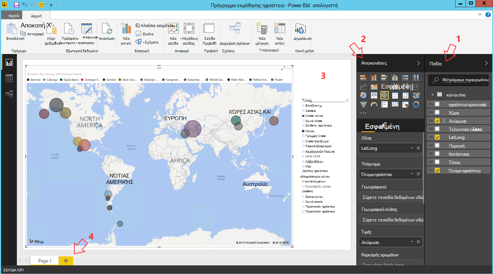

<properties
    pageTitle="Δέκα πράγματα που μπορείτε να κάνετε σε τα δεδομένα science εικονική μηχανή | Microsoft Azure"
    description="Εκτέλεση διάφορες Εξερεύνηση δεδομένων και μοντελοποίηση εργασιών στο τα δεδομένα science εικονική μηχανή."
    services="machine-learning"
    documentationCenter=""
    authors="bradsev"
    manager="jhubbard"
    editor="cgronlun"  />

<tags
    ms.service="machine-learning"
    ms.workload="data-services"
    ms.tgt_pltfrm="na"
    ms.devlang="na"
    ms.topic="article"
    ms.date="08/29/2016"
    ms.author="gokuma;weig;bradsev" />

# <a name="ten-things-you-can-do-on-the-data-science-virtual-machine"></a>Δέκα πράγματα που μπορείτε να κάνετε σε τα δεδομένα science εικονική μηχανή

Η εικονική μηχανή Science δεδομένων της Microsoft (DSVM) είναι ένα περιβάλλον ανάπτυξης science ισχυρή δεδομένων που σας επιτρέπει να εκτελέσετε διάφορες Εξερεύνηση και μοντελοποίηση εργασιών με δεδομένα. Το περιβάλλον παρέχεται ήδη δομημένες και ομαδοποιημένες με διάφορα εργαλεία ανάλυσης δεδομένων δημοφιλείς που διευκολύνουν την γρήγορα αποτελέσματα με την ανάλυσή σας για εσωτερικής εγκατάστασης, Cloud ή υβριδικές αναπτύξεις. Το DSVM συνεργάζεται στενά με πολλές Azure υπηρεσίες και μπορεί να διαβάσει και να επεξεργαστεί τα δεδομένα που είναι ήδη αποθηκευμένο στο Azure, σε αποθήκη δεδομένων του SQL Azure, λίμνης δεδομένων Azure, αποθήκευσης Azure ή DocumentDB. Το επίσης να αξιοποιήσετε άλλα εργαλεία ανάλυσης όπως Azure μηχανικής εκμάθησης και Azure εργοστασίου δεδομένων.


Σε αυτό το άρθρο θα σας καθοδηγήσει πώς μπορείτε να χρησιμοποιήσετε το DSVM για να εκτελέσετε διάφορες εργασίες science δεδομένων και να αλληλεπιδράσετε με άλλες υπηρεσίες του Azure. Ακολουθούν ορισμένες από τις ενέργειες που μπορείτε να κάνετε στην το DSVM:

1. Εξερεύνηση δεδομένων και να αναπτύξετε το DSVM με χρήση διακομιστή R της Microsoft, Python μοντέλα τοπικά
2. Χρήση ενός σημειωματαρίου Jupyter για να πειραματιστείτε με τα δεδομένα σας σε ένα πρόγραμμα περιήγησης R Microsoft Python 2, Python 3, χρησιμοποιώντας μια έκδοση είστε έτοιμοι για μεγάλες επιχειρήσεις του R που έχει σχεδιαστεί για κλιμάκωση και απόδοση
3. Operationalize μοντέλα δημιουργούνται χρησιμοποιώντας R και Python στην Azure μηχανικής εκμάθησης, ώστε να πρόσβαση σε εφαρμογές προγράμματος-πελάτη σας χρησιμοποιώντας ένα περιβάλλον εργασίας υπηρεσιών web απλό μοντέλα
4. Διαχείριση του Azure τους πόρους σας χρησιμοποιώντας το Azure πύλη ή Powershell
5. Επέκταση του χώρου αποθήκευσης και κοινή χρήση συνόλων δεδομένων ευρείας κλίμακας / κωδικός σε ολόκληρη την ομάδα σας, δημιουργώντας ένα χώρο αποθήκευσης αρχείων Azure ως δυνατότητα τοποθέτησης σε μονάδα δίσκου στην DSVM σας
6. Κοινή χρήση κώδικα με την ομάδα σας με χρήση Github και αποκτήστε πρόσβαση του αποθετηρίου χρησιμοποιώντας τα προ-εγκατεστημένες Git προγράμματα-πελάτες - Git πάρτι, Git Γραφικών.
7. Πρόσβαση σε διάφορες Azure δεδομένων και τις αναλύσεις υπηρεσίες όπως το χώρο αποθήκευσης αντικειμένων blob του Azure, λίμνης δεδομένων Azure, Azure HDInsight (Hadoop), Azure DocumentDB, αποθήκη δεδομένων του SQL Azure & βάσεις δεδομένων
8. Δημιουργήστε αναφορές και πίνακα εργαλείων χρησιμοποιώντας το Power BI Desktop προεγκατεστημένα στα το DSVM και αναπτύξτε τους στο cloud
9. Δυναμικά κλιμάκωση σας DSVM για τις ανάγκες του έργου σας
10. Εγκατάσταση πρόσθετα εργαλεία στον υπολογιστή σας εικονικές   


>[AZURE.NOTE] Χρήση πρόσθετων χρεώσεων θα εφαρμοστούν για πολλά από τα επιπλέον χώρο αποθήκευσης και τις αναλύσεις υπηρεσίες δεδομένων που αναφέρονται σε αυτό το άρθρο. Ανατρέξτε στη σελίδα [Τιμολόγηση Azure](https://azure.microsoft.com/pricing/) για λεπτομέρειες.


**Προαπαιτούμενα στοιχεία**

- Θα χρειαστείτε μια συνδρομή του Azure. Μπορείτε να εγγραφείτε για μια δωρεάν δοκιμαστική [εδώ](https://azure.microsoft.com/free/).

- Οδηγίες για την παροχή μια εικονική μηχανή Science δεδομένων στην πύλη του Azure είναι διαθέσιμες στη [Δημιουργία μια εικονική μηχανή](https://portal.azure.com/#create/microsoft-ads.standard-data-science-vmstandard-data-science-vm).

## <a name="1-explore-data-and-develop-models-using-microsoft-r-server-or-python"></a>1. Εξερεύνηση δεδομένων και ανάπτυξη μοντέλα χρησιμοποιώντας το Microsoft R Server ή Python

Μπορείτε να χρησιμοποιήσετε γλώσσες όπως R και Python για να κάνετε την ανάλυση δεδομένων προς τα δεξιά σε το DSVM.

Για R, μπορείτε να χρησιμοποιήσετε IDE που ονομάζεται "Μεγάλες επιχειρήσεις επανάσταση R 8.0" που βρίσκεται στο μενού "Έναρξη" ή στην επιφάνεια εργασίας. Η Microsoft παρέχει πρόσθετες βιβλιοθήκες επάνω από το άνοιγμα προέλευσης/CRAN-R για να ενεργοποιήσετε την ανάλυση μεταβλητού μεγέθους και τη δυνατότητα να αναλύσετε δεδομένα που είναι μεγαλύτερο από το επιτρεπόμενο κάνοντας παράλληλες τμηματική ανάλυσης μέγεθος μνήμης. Μπορείτε επίσης να εγκαταστήσετε IDE R της επιλογής σας, όπως [RStudio](https://www.rstudio.com/products/rstudio-desktop/).

Για Python, μπορείτε να χρησιμοποιήσετε μια IDE όπως το Visual Studio Edition Κοινότητας που περιλαμβάνει τα εργαλεία Python για προ-εγκατεστημένο επέκταση Visual Studio (PTVS). Από προεπιλογή, μόνο ένα βασικό 2.7 Python έχει ρυθμιστεί στο PTVS (χωρίς οποιαδήποτε βιβλιοθήκη αναλυτικών στοιχείων όπως SciKit, Pandas). Για να ενεργοποιήσετε την Anaconda Python 2.7 και 3.5, πρέπει να κάνετε τα εξής:

* Δημιουργία προσαρμοσμένου περιβάλλοντα για κάθε έκδοση, μεταβαίνοντας **Εργαλεία** -> **Εργαλεία Python** -> **Python περιβάλλοντα** και, στη συνέχεια, κάνοντας κλικ στην επιλογή "**+ προσαρμοσμένο**" της έκδοσης Κοινότητας του Visual Studio 2015
* Δώστε μια περιγραφή και ορίστε τις διαδρομές πρόθεμα περιβάλλον ως *c:\anaconda* για Anaconda Python 2.7 ή *c:\anaconda\envs\py35* για Anaconda Python 3.5
* Κάντε κλικ στην επιλογή **Αυτόματος εντοπισμός** και, στη συνέχεια, **εφαρμογή** για να αποθηκεύσετε το περιβάλλον.

Παρακάτω θα δείτε τη διαμόρφωση προσαρμοσμένο περιβάλλον μοιάζει στο Visual Studio.


Ανατρέξτε στην [τεκμηρίωση PTVS](https://github.com/Microsoft/PTVS/wiki/Selecting-and-Installing-Python-Interpreters#hey-i-already-have-an-interpreter-on-my-machine-but-ptvs-doesnt-seem-to-know-about-it) για περισσότερες λεπτομέρειες σχετικά με τον τρόπο για να δημιουργήσετε Python περιβάλλοντα.

Τώρα είστε έτοιμοι να δημιουργήσετε ένα νέο έργο Python. Μεταβείτε στο **αρχείο** -> **Δημιουργία** -> **έργου** -> **Python** και επιλέξτε τον τύπο της εφαρμογής Python που δημιουργείτε. Μπορείτε να ρυθμίσετε το περιβάλλον Python για το τρέχον έργο στην επιθυμητή έκδοση (Anaconda 2.7 ή 3.5): κάντε δεξί κλικ στο **περιβάλλον Python**, επιλέξτε **Προσθήκη/κατάργηση Python περιβάλλοντα**και, στη συνέχεια, επιλέξτε το επιθυμητό περιβάλλον για να συσχετίσετε με το έργο. Μπορείτε να βρείτε περισσότερες πληροφορίες σχετικά με την εργασία με PTVS στη σελίδα [τεκμηρίωση](https://github.com/Microsoft/PTVS/wiki) του προϊόντος.

## <a name="2-using-a-jupyter-notebook-to-explore-and-model-your-data-with-python-or-r"></a>2. χρήσης ενός σημειωματαρίου Jupyter για να εξερευνήσετε και του μοντέλου δεδομένων σας με Python ή R

Το Σημειωματάριο Jupyter είναι ένα ισχυρό περιβάλλον που παρέχει μια βασίζονται σε πρόγραμμα περιήγησης "IDE" για Εξερεύνηση δεδομένων και μοντελοποίηση. Μπορείτε να χρησιμοποιήσετε Python 2, Python 3 ή R (Άνοιγμα αρχείου προέλευσης και το Microsoft Server R) σε ένα σημειωματάριο Jupyter.

Εκκίνηση του σημειωματαρίου Jupyter κάντε κλικ στο εικονίδιο του μενού Έναρξη / εικονίδιο επιφάνειας εργασίας με τίτλο **Jupyter σημειωματαρίου**. Στην το DSVM μπορείτε επίσης να περιηγηθείτε στο "https://localhost:9999 /" για να αποκτήσετε πρόσβαση στο Σημειωματάριο πρόσθετα. Αν σας ζητηθεί κωδικός πρόσβασης, χρησιμοποιήστε οδηγίες που παρέχονται στην ενότητα ***πώς μπορείτε να δημιουργήσετε έναν ισχυρό κωδικό πρόσβασης στο διακομιστή Σημειωματάριο Jupyter*** του θέματος [παροχή δεδομένων Science η εικονική μηχανή](machine-learning-data-science-provision-vm.md) για να δημιουργήσετε έναν ισχυρό κωδικό πρόσβασης για να αποκτήσετε πρόσβαση στο Σημειωματάριο Jupyter. 

Αφού ανοίξετε το Σημειωματάριο, θα δείτε έναν κατάλογο που περιέχει μερικά σημειωματάρια παράδειγμα που είναι προ-συσκευασμένη σε το DSVM. Τώρα μπορείτε να κάνετε:

- Κάντε κλικ στο Σημειωματάριο για να δείτε τον κώδικα.
- εκτέλεση κάθε κελί πατώντας το συνδυασμό πλήκτρων **SHIFT-ENTER**.
- εκτέλεση ολόκληρο το Σημειωματάριο, κάνοντας κλικ στο **κελί** -> **Εκτέλεση**
- Δημιουργήστε ένα νέο σημειωματάριο, κάνοντας κλικ στο εικονίδιο Jupyter (αριστερή επάνω γωνία) και, στη συνέχεια, κάνοντας κλικ στην επιλογή **νέο** κουμπί στη δεξιά πλευρά και, στη συνέχεια, επιλέγοντας τη γλώσσα Σημειωματάριο (γνωστό και ως πυρήνων).   


>[AZURE.NOTE] Αυτήν τη στιγμή υποστηρίζουμε Python 2.7, Python 3.5 και R. Το πυρήνα R υποστηρίζει προγραμματισμό στο τόσο Άνοιγμα αρχείου προέλευσης R όσο και στην επιχείρηση μεταβλητού μεγέθους Microsoft R Server.   


Μόλις συνδεθείτε στο Σημειωματάριο, μπορείτε να εξερευνήσετε τα δεδομένα σας, δημιουργήστε το μοντέλο, δοκιμή του μοντέλου χρησιμοποιώντας την επιλογή σας βιβλιοθηκών.


## <a name="3-build-models-using-r-or-python-and-operationalize-them-using-azure-machine-learning"></a>3. Δόμηση μοντέλα χρησιμοποιώντας R ή Python και Operationalize τους χρησιμοποιώντας Azure μηχανικής εκμάθησης

Αφού δημιουργηθεί και επικύρωση του μοντέλου το επόμενο βήμα είναι συνήθως για να το αναπτύξετε σε παραγωγής. Αυτό σας επιτρέπει το πρόγραμμα-πελάτη εφαρμογές για να καλέσετε το μοντέλο προβλέψεων ένα πραγματικό χρόνο ή με βάση τη μαζική λειτουργία. Azure μηχανικής εκμάθησης παρέχει ένα μηχανισμό για operationalize μοντέλου ενσωματωμένη R ή Python.

Όταν operationalize του μοντέλου στο Azure μηχανικής εκμάθησης, εμφανίζεται μια υπηρεσία web που επιτρέπει στους υπολογιστές-πελάτες για την πραγματοποίηση κλήσεων ΥΠΌΛΟΙΠΟ που μεταβιβάζουν σε παραμέτρους εισόδου και να λαμβάνετε προβλέψεων από το μοντέλο ως εξόδους.   


>[AZURE.NOTE] Εάν δεν έχετε ακόμη εγγραφεί για AzureML, μπορείτε να αποκτήσετε ένα δωρεάν χώρο εργασίας ή ένα τυπικό χώρο εργασίας, αν επισκεφθείτε την τοποθεσία στην αρχική σελίδα [AzureML Studio](https://studio.azureml.net/) και κάνοντας κλικ στην "Γρήγορα αποτελέσματα".   


### <a name="build-and-operationalize-python-models"></a>Δημιουργία και Operationalize Python μοντέλα

Ακολουθεί ένα τμήμα κώδικα που αναπτύχθηκε σε ένα σημειωματάριο Jupyter Python που δημιουργεί ένα απλό μοντέλο χρησιμοποιώντας τη βιβλιοθήκη μάθετε SciKit.

    #IRIS classification
    from sklearn import datasets
    from sklearn import svm
    clf = svm.SVC()
    iris = datasets.load_iris()
    X, y = iris.data, iris.target
    clf.fit(X, y)

Η μέθοδος που χρησιμοποιείται για να αναπτύξετε το μοντέλα python σε Azure μηχανικής εκμάθησης αναδιπλώνεται την πρόβλεψη του μοντέλου σε μια συνάρτηση και decorates το με τα χαρακτηριστικά που παρέχεται από την προ-εγκατεστημένες βιβλιοθήκη python Azure μηχανικής εκμάθησης που υποδηλώνουν το Αναγνωριστικό χώρου εργασίας Azure μηχανικής εκμάθησης, API κλειδί και την είσοδο και να επιστρέψετε παραμέτρους.  

    from azureml import services
    @services.publish(workspaceid, auth_token)
    @services.types(sep_l = float, sep_w = float, pet_l=float, pet_w=float)
    @services.returns(int) #0, or 1, or 2
    def predictIris(sep_l, sep_w, pet_l, pet_w):
    inputArray = [sep_l, sep_w, pet_l, pet_w]
    return clf.predict(inputArray)

Ένα πρόγραμμα-πελάτη τώρα να κάνετε κλήσεις στην υπηρεσία web. Υπάρχουν προγράμματα εξομοίωσης ευκολία που κατασκευή τις αιτήσεις REST API. Ακολουθεί ένα δείγμα κώδικα για την εκμετάλλευση της υπηρεσίας web.

    # Consume through web service URL and keys
    from azureml import services
    @services.service(url, api_key)
    @services.types(sep_l = float, sep_w = float, pet_l=float, pet_w=float)
    @services.returns(float)
    def IrisPredictor(sep_l, sep_w, pet_l, pet_w):
    pass

    IrisPredictor(3,2,3,4)


>[AZURE.NOTE] Η βιβλιοθήκη Azure μηχανικής εκμάθησης υποστηρίζεται μόνο σε Python 2.7 αυτήν τη στιγμή.   


### <a name="build-and-operationalize-r-models"></a>Δημιουργία και Operationalize R μοντέλα

Μπορείτε να αναπτύξετε μοντέλα R ενσωματωμένο στην τα δεδομένα επιστήμης εικονικό μηχάνημα ή σε κάποιο άλλο σημείο στο Azure μηχανικής εκμάθησης με τρόπο παρόμοιο με ποιον τρόπο γίνεται για Python. Το είναι τα βήματα:

- Δημιουργία αρχείου settings.json ως παρακάτω, για να παρέχετε το Αναγνωριστικό χώρου εργασίας και auth διακριτικού.
- Γράψτε μια περιτυλίγματος για το μοντέλο πρόβλεψης συνάρτηση.
- κλήση ```publishWebService``` στη βιβλιοθήκη Azure μηχανικής εκμάθησης για τη μεταβίβαση στο περιτυλίγματος τη συνάρτηση.  

Ακολουθεί η διαδικασία και τον κωδικό τμήματα κώδικα που μπορούν να χρησιμοποιηθούν για τη ρύθμιση, δημιουργία, δημοσίευση και κατανάλωση μοντέλου ως υπηρεσία web στο Azure μηχανικής εκμάθησης.

#### <a name="setup"></a>Το πρόγραμμα εγκατάστασης

1.  Εγκατάσταση του πακέτου AzureML R, πληκτρολογώντας ```install.packages("AzureML")``` επανάσταση R για μεγάλες επιχειρήσεις 8.0 IDE ή σας IDE R.
2.  Κάντε λήψη RTools από [εδώ](https://cran.r-project.org/bin/windows/Rtools/). Χρειάζεστε το βοηθητικό πρόγραμμα zip τη διαδρομή (και το επώνυμο zip.exe) για να operationalize το πακέτο R σε AzureML.
3.  Δημιουργία αρχείου settings.json στην περιοχή έναν κατάλογο που ονομάζεται ```.azureml``` κάτω από τον κεντρικό σας κατάλογο και εισαγάγετε τις παραμέτρους από το χώρο εργασίας Azure ML:

Settings.JSON δομή αρχείου:

    {"workspace":{
    "id"                  : "ENTER YOUR AZUREML WORKSPACE ID",
    "authorization_token" : "ENTER YOUR AZUREML AUTH TOKEN"
    }}


#### <a name="build-a-model-in-r-and-publish-it-in-azure-ml"></a>Δημιουργία μοντέλου R και να το δημοσιεύσετε σε Azure ML

    library(AzureML)
    ws <- workspace(config="~/.azureml/settings.json")

    if(!require("lme4")) install.packages("lme4")
    library(lme4)
    set.seed(1)
    train <- sleepstudy[sample(nrow(sleepstudy), 120),]
    m <- lm(Reaction ~ Days + Subject, data = train)

    # Define a prediction function to publish based on the model:
    sleepyPredict <- function(newdata){
        predict(m, newdata=newdata)
    }

    ep <- publishWebService(ws, fun = sleepyPredict, name="sleepy lm", inputSchema = sleepstudy, data.frame=TRUE)

#### <a name="consume-the-model-deployed-in-azure-ml"></a>Χρήση του μοντέλου αναπτυχθεί σε Azure ML

Για την εκμετάλλευση το μοντέλο από μια εφαρμογή προγράμματος-πελάτη, χρησιμοποιούμε τη βιβλιοθήκη Azure μηχανικής εκμάθησης για να αναζητήσετε την υπηρεσία web που έχει δημοσιευθεί, χρησιμοποιώντας το όνομα του `services` κλήση API για να προσδιορίσετε το τελικό σημείο. Στη συνέχεια, να καλέσετε το `consume` λειτουργεί και μεταβιβάζουν στο πλαίσιο δεδομένα για να γίνει πρόβλεψη.
Ο ακόλουθος κώδικας χρησιμοποιείται για την εκμετάλλευση το μοντέλο δημοσιεύεται ως μιας υπηρεσίας web Azure μηχανικής εκμάθησης.


    library(AzureML)
    library(lme4)
    ws <- workspace(config="~/.azureml/settings.json")

    s <-  services(ws, name = "sleepy lm")
    s <- tail(s, 1) # use the last published function, in case of duplicate function names

    ep <- endpoints(ws, s)

    # OK, try this out, and compare with raw data
    ans = consume(ep, sleepstudy)$ans

Μπορείτε να βρείτε περισσότερες πληροφορίες σχετικά με τη βιβλιοθήκη Azure μηχανικής εκμάθησης R [εδώ](https://cran.r-project.org/web/packages/AzureML/AzureML.pdf).


## <a name="4-administer-your-azure-resources-using-azure-portal-or-powershell"></a>4. Διαχείριση Azure τους πόρους σας χρησιμοποιώντας το Azure πύλη ή Powershell

Το DSVM όχι μόνο σας επιτρέπει να δημιουργήσετε τη λύση σας ανάλυση τοπικά στον υπολογιστή εικονικές, αλλά σας επιτρέπει επίσης να πρόσβαση σε υπηρεσίες της Microsoft Azure cloud. Azure παρέχει διάφορες υπολογισμού, χώρος αποθήκευσης, υπηρεσίες ανάλυσης δεδομένων και άλλες υπηρεσίες που μπορείτε να διαχειριστείτε και να έχετε πρόσβαση από το DSVM.

Για να διαχειριστείτε τους πόρους σας Azure συνδρομή και cloud, μπορείτε να χρησιμοποιήσετε το πρόγραμμα περιήγησης και να οδηγούν στην [πύλη του Azure](https://portal.azure.com). Μπορείτε επίσης να χρησιμοποιήσετε Azure Powershell για να διαχειριστείτε τις Azure συνδρομή σας και τους πόρους μέσω μιας δέσμης ενεργειών.
Μπορείτε να εκτελέσετε Azure Powershell από μια συντόμευση στην επιφάνεια εργασίας ή από το μενού Έναρξη με τίτλο "Microsoft Azure Powershell". Ανατρέξτε στην [τεκμηρίωση του Microsoft Azure Powershell](../powershell-azure-resource-manager.md) για περισσότερες πληροφορίες σχετικά με τον τρόπο που μπορείτε να διαχειριστείτε τις Azure συνδρομή σας και τους πόρους δέσμες ενεργειών του Windows Powershell.


## <a name="5-extend-your-storage-space-with-a-shared-file-system"></a>5. επέκταση του χώρου αποθήκευσης με ένα κοινόχρηστο αρχείο συστήματος

Δεδομένα επιστήμονες να κάνετε κοινή χρήση μεγάλων συνόλων δεδομένων, κώδικα ή άλλους πόρους εντός της ομάδας. Το DSVM ίδια έχει περίπου 70GB διαθέσιμος χώρος. Για να επεκτείνετε το χώρο αποθήκευσης, μπορείτε να χρησιμοποιήσετε την υπηρεσία αρχείο Azure και είτε ενεργοποίησης στην το DSVM ή πρόσβαση μέσω μιας REST API.   


>[AZURE.NOTE] Το μέγιστο χώρο του κοινόχρηστου στοιχείου υπηρεσία αρχείων Azure είναι 5TB και όριο μεγέθους αρχείου μεμονωμένα είναι 1TB.   


Μπορείτε να χρησιμοποιήσετε Azure Powershell για να δημιουργήσετε ένα κοινόχρηστο στοιχείο Azure αρχείο υπηρεσίας. Ακολουθεί η δέσμη ενεργειών για να εκτελέσετε στην περιοχή Azure PowerShell για να δημιουργήσετε ένα στοιχείο Azure κοινής χρήσης υπηρεσίας.

    # Authenticate to Azure.
    Login-AzureRmAccount
    # Select your subscription
    Get-AzureRmSubscription –SubscriptionName "<your subscription name>" | Select-AzureRmSubscription
    # Create a new resource group.
    New-AzureRmResourceGroup -Name <dsvmdatarg>
    # Create a new storage account. You can reuse existing storage account if you wish.
    New-AzureRmStorageAccount -Name <mydatadisk> -ResourceGroupName <dsvmdatarg> -Location "<Azure Data Center Name For eg. South Central US>" -Type "Standard_LRS"
    # Set your current working storage account
    Set-AzureRmCurrentStorageAccount –ResourceGroupName "<dsvmdatarg>" –StorageAccountName <mydatadisk>

    # Create a Azure File Service Share
    $s = New-AzureStorageShare <<teamsharename>>
    # Create a directory under the FIle share. You can give it any name
    New-AzureStorageDirectory -Share $s -Path <directory name>
    # List the share to confirm that everything worked
    Get-AzureStorageFile -Share $s


Τώρα που έχετε δημιουργήσει ένα Azure στοιχείο κοινής χρήσης, έχετε μπορούν να το τοποθετήσετε σε οποιαδήποτε εικονική μηχανή στο Azure. Συνιστάται ιδιαίτερα ότι η Εικονική είναι στο ίδιο κέντρο Azure δεδομένων με το λογαριασμό χώρου αποθήκευσης για αποφυγή χρεώσεων λόγω μεταφοράς λανθάνων χρόνος και τα δεδομένα. Παρακάτω θα δείτε τις εντολές για να τοποθετήσετε τη μονάδα δίσκου σε το DSVM που μπορείτε να εκτελέσετε σε Azure Powershell.


    # Get storage key of the storage account that has the Azure file share from Azure portal. Store it securely on the VM to avoid prompted in next command.
    cmdkey /add:<<mydatadisk>>.file.core.windows.net /user:<<mydatadisk>> /pass:<storage key>

    # Mount the Azure file share as Z: drive on the VM. You can chose another drive letter if you wish
    net use z:  \\<mydatadisk>.file.core.windows.net\<<teamsharename>>


Τώρα μπορείτε να αποκτήσετε πρόσβαση αυτήν τη μονάδα δίσκου όπως θα κάνατε με οποιαδήποτε κανονική μονάδα δίσκου η Εικονική.

## <a name="6-share-code-with-your-team-using-github"></a>6. κωδικός κοινή χρήση με την ομάδα σας με χρήση Github

Github είναι ένα αποθετήριο κώδικα όπου μπορείτε να βρείτε πολλά δείγματα κώδικα και προελεύσεις για διάφορα εργαλεία, χρησιμοποιώντας διάφορες τεχνολογίες σε κοινή χρήση από την Κοινότητα προγραμματιστών. Χρησιμοποιεί Git όπως η τεχνολογία να παρακολουθείτε και να αποθηκεύσετε εκδόσεις των αρχείων κώδικα. Github είναι επίσης μια πλατφόρμα όπου μπορείτε να δημιουργήσετε το δικό σας αποθετήριο αποθήκευση κοινόχρηστο κώδικα της ομάδας σας και την τεκμηρίωση, υλοποίηση έλεγχος έκδοσης και επίσης ελέγχετε ποιος έχει πρόσβαση για να προβάλετε και να συνεισφέρουν κώδικα. Επισκεφθείτε την τοποθεσία του [Github σελίδες της Βοήθειας](https://help.github.com/) για περισσότερες πληροφορίες σχετικά με τη χρήση Git. Μπορείτε να χρησιμοποιήσετε Github ως έναν από τους τρόπους για να συνεργαστείτε με την ομάδα σας, χρησιμοποιήστε κώδικα που αναπτύχθηκε από την Κοινότητα και συμβάλλουν κώδικα στην Κοινότητα.

Το DSVM ήδη διατίθεται φόρτωση με εργαλεία προγράμματος-πελάτη και οι δύο γραμμής εντολών ως καλά Γραφικών για πρόσβαση στο αποθετήριο δεδομένων Github. Το εργαλείο γραμμής εντολών για να εργαστείτε με Git και Github ονομάζεται Git πάρτι. Εγκατεστημένο στον DSVM του Visual Studio περιλαμβάνει τις επεκτάσεις Git. Μπορείτε να βρείτε τα εικονίδια εκκίνησης για αυτά τα εργαλεία στο μενού "Έναρξη" και του υπολογιστή.

Για να κάνετε λήψη κώδικα από ένα αποθετήριο Github που θα χρησιμοποιήσετε το ```git clone``` εντολή. Για παράδειγμα για τη λήψη δεδομένων science αποθετήριο δημοσιεύεται από τη Microsoft στον τρέχοντα κατάλογο, μπορείτε να εκτελέσετε την ακόλουθη εντολή μόλις συνδεθείτε στο ```git-bash```.

    git clone https://github.com/Azure/Azure-MachineLearning-DataScience.git

Στο Visual Studio, μπορείτε να κάνετε την ίδια λειτουργία κλωνοποίηση. Το-στιγμιότυπο οθόνης παρακάτω δείχνει πώς μπορείτε να αποκτήσετε πρόσβαση σε εργαλεία Git και Github στο Visual Studio.


Μπορείτε να βρείτε περισσότερες πληροφορίες σχετικά με τη χρήση Git για εργασία με το αποθετήριο Github από πολλούς πόρους που είναι διαθέσιμοι σε github.com. Τα [πλήκτρα φύλλου](https://training.github.com/kit/downloads/github-git-cheat-sheet.pdf) είναι χρήσιμη αναφορά.


## <a name="7-access-various-azure-data-and-analytics-services"></a>7. πρόσβαση σε διάφορες υπηρεσίες Azure και ανάλυση δεδομένων

### <a name="azure-blob"></a>Αντικειμένων Blob του Azure

Αντικειμένων blob του Azure είναι ένα χώρο αποθήκευσης στο cloud αξιόπιστη, οικονομικός για μεγάλο και μικρό τα δεδομένα. Ας δούμε πώς μπορείτε να μετακινήσετε δεδομένα σε αντικειμένων Blob του Azure και πρόσβασης δεδομένων που είναι αποθηκευμένα σε μια αντικειμένων Blob του Azure.

**Προϋπόθεση**

- **Δημιουργήστε το λογαριασμό χώρου αποθήκευσης αντικειμένων Blob του Azure από [Azure πύλη](https://portal.azure.com).**


- Επιβεβαιώστε ότι το εργαλείο AzCopy προ-εγκατεστημένες γραμμής εντολών βρίσκεται στο ```C:\Program Files (x86)\Microsoft SDKs\Azure\AzCopy\azcopy.exe```. Μπορείτε να προσθέσετε τον κατάλογο που περιέχει το azcopy.exe για τη μεταβλητή περιβάλλοντος PATH για να αποφύγετε να πληκτρολογείτε τη διαδρομή ολόκληρη την εντολή κατά την εκτέλεση αυτού του εργαλείου. Για περισσότερες πληροφορίες σχετικά με το εργαλείο AzCopy, ανατρέξτε στην [τεκμηρίωση AzCopy](../storage/storage-use-azcopy.md)

- Ξεκινήστε το εργαλείο Azure Εξερεύνηση χώρου αποθήκευσης. Μπορείτε να κάνετε λήψη από την [Εξερεύνηση χώρου αποθήκευσης του Microsoft Azure](http://storageexplorer.com/). 


**Μετακίνηση δεδομένων από Εικονική αντικειμένων Blob του Azure: AzCopy**

Για τη μετακίνηση δεδομένων μεταξύ σας τοπικά αρχεία και το χώρο αποθήκευσης αντικειμένων blob, μπορείτε να χρησιμοποιήσετε AzCopy στη γραμμή εντολών ή PowerShell:

    AzCopy /Source:C:\myfolder /Dest:https://<mystorageaccount>.blob.core.windows.net/<mycontainer> /DestKey:<storage account key> /Pattern:abc.txt

Αντικατάσταση **C:\myfolder** στη διαδρομή όπου είναι αποθηκευμένο το αρχείο σας, **mystorageaccount** σε όνομα λογαριασμού σας χώρο αποθήκευσης αντικειμένων blob, **mycontainer** στο όνομα του κοντέινερ, **κλειδί λογαριασμού χώρου αποθήκευσης** για το πλήκτρο πρόσβασης χώρο αποθήκευσης αντικειμένων blob. Μπορείτε να βρείτε τα διαπιστευτήριά σας λογαριασμό χώρου αποθήκευσης στην [πύλη Azure](https://portal.azure.com).


Εκτελέστε την εντολή AzCopy στο PowerShell ή από μια γραμμή εντολών. Εδώ θα βρείτε ορισμένες παράδειγμα χρήσης της εντολής AzCopy:


    # Copy *.sql from local machine to a Azure Blob
    "C:\Program Files (x86)\Microsoft SDKs\Azure\AzCopy\azcopy" /Source:"c:\Aaqs\Data Science Scripts" /Dest:https://[ENTER STORAGE ACCOUNT].blob.core.windows.net/[ENTER CONTAINER] /DestKey:[ENTER STORAGE KEY] /S /Pattern:*.sql

    # Copy back all files from Azure Blob container to Local machine

    "C:\Program Files (x86)\Microsoft SDKs\Azure\AzCopy\azcopy" /Dest:"c:\Aaqs\Data Science Scripts\temp" /Source:https://[ENTER STORAGE ACCOUNT].blob.core.windows.net/[ENTER CONTAINER] /SourceKey:[ENTER STORAGE KEY] /S


Μετά την εκτέλεση της εντολής AzCopy σας για να αντιγράψετε ένα αντικειμένων blob του Azure βλέπετε το αρχείο δείχνει προς τα επάνω στην Εξερεύνηση χώρου αποθήκευσης Azure λίγο.


**Μετακίνηση δεδομένων από Εικονική αντικειμένων Blob του Azure: Εξερεύνηση χώρου αποθήκευσης Azure**

Μπορείτε επίσης να αποστείλετε δεδομένα από το τοπικό αρχείο σε σας χρησιμοποιώντας την Εξερεύνηση χώρου αποθήκευσης Azure Εικονική:

- Για να αποστείλετε δεδομένα σε ένα κοντέινερ, επιλέξτε το κοντέινερ προορισμού και κάντε κλικ στο κουμπί **Αποστολή** .
- Κάντε κλικ στην εντολή το **...** στα δεξιά του πλαισίου **αρχείων** , επιλέξτε ένα ή περισσότερα αρχεία για την αποστολή από το σύστημα αρχείων και κάντε κλικ στην επιλογή " **Αποστολή** " για να ξεκινήσει η αποστολή των αρχείων.


**Ανάγνωση δεδομένων από το Azure Blob: λειτουργική μονάδα ανάγνωσης AML**

Στο Azure μηχανικής εκμάθησης Studio, μπορείτε να χρησιμοποιήσετε μια **λειτουργική μονάδα εισαγωγή δεδομένων** ανάγνωσης δεδομένων από το blob.


**Ανάγνωση δεδομένων από το Azure Blob: Python ODBC**

Μπορείτε να χρησιμοποιήσετε **BlobService** βιβλιοθήκη για την ανάγνωση δεδομένων απευθείας από blob σε ένα σημειωματάριο Jupyter ή Python πρόγραμμα.

Πρώτα, εισαγάγετε απαιτείται πακέτα:

    import pandas as pd
    from pandas import Series, DataFrame
    import numpy as np
    import matplotlib.pyplot as plt
    from time import time
    import pyodbc
    import os
    from azure.storage.blob import BlobService
    import tables
    import time
    import zipfile
    import random

Στη συνέχεια, συνδέστε τα διαπιστευτήριά σας λογαριασμό αντικειμένων Blob του Azure και ανάγνωση δεδομένων από Blob:

    CONTAINERNAME = 'xxx'
    STORAGEACCOUNTNAME = 'xxxx'
    STORAGEACCOUNTKEY = 'xxxxxxxxxxxxxxxx'
    BLOBNAME = 'nyctaxidataset/nyctaxitrip/trip_data_1.csv'
    localfilename = 'trip_data_1.csv'
    LOCALDIRECTORY = os.getcwd()
    LOCALFILE =  os.path.join(LOCALDIRECTORY, localfilename)

    #download from blob
    t1 = time.time()
    blob_service = BlobService(account_name=STORAGEACCOUNTNAME,account_key=STORAGEACCOUNTKEY)
    blob_service.get_blob_to_path(CONTAINERNAME,BLOBNAME,LOCALFILE)
    t2 = time.time()
    print(("It takes %s seconds to download "+BLOBNAME) % (t2 - t1))

    #unzipping downloaded files if needed
    #with zipfile.ZipFile(ZIPPEDLOCALFILE, "r") as z:
    #    z.extractall(LOCALDIRECTORY)

    df1 = pd.read_csv(LOCALFILE, header=0)
    df1.columns = ['medallion','hack_license','vendor_id','rate_code','store_and_fwd_flag','pickup_datetime','dropoff_datetime','passenger_count','trip_time_in_secs','trip_distance','pickup_longitude','pickup_latitude','dropoff_longitude','dropoff_latitude']
    print 'the size of the data is: %d rows and  %d columns' % df1.shape

Τα δεδομένα είναι για ανάγνωση στο ως πλαισίου δεδομένων:


### <a name="azure-data-lake"></a>Azure δεδομένων λίμνης

Αποθήκευση λίμνης Azure δεδομένων είναι ένα αποθετήριο hyper κλίμακας για μεγάλο δεδομένων όγκου εργασίας ανάλυση και είναι συμβατή με κατανεμημένο αρχείο Hadoop σύστημα (HDFS). Λειτουργεί με το περιβάλλον εμπορικής προσαρμογής Hadoop και την ανάλυση λίμνης δεδομένων Azure. Θα σας δείξουμε πώς μπορείτε να μετακινήσετε δεδομένων στο χώρο αποθήκευσης λίμνης Azure δεδομένων και να εκτελέσετε ανάλυση με ανάλυση λίμνης Azure δεδομένων.

**Προϋπόθεση**

- Δημιουργήστε την ανάλυση Azure δεδομένων λίμνης στην [πύλη Azure](https://portal.azure.com).


- Τα **Εργαλεία λίμνης δεδομένων Azure** στο **Visual Studio** βρίσκονται σε αυτήν τη [σύνδεση](https://www.microsoft.com/download/details.aspx?id=49504) είναι ήδη εγκατεστημένο στον του Visual Studio Κοινότητας Edition που βρίσκεται στον υπολογιστή εικονική. Μετά την εκκίνηση του Visual Studio και καταγραφή στο Azure τη συνδρομή σας, θα δείτε το λογαριασμό Azure ανάλυση δεδομένων και το χώρο αποθήκευσης στο αριστερό τμήμα του παραθύρου του Visual Studio.


**Μετακίνηση δεδομένων από Εικονική λίμνης δεδομένων: Εξερεύνηση λίμνης δεδομένων Azure**

Μπορείτε να χρησιμοποιήσετε **Εξερεύνηση λίμνης Azure δεδομένων** για την αποστολή δεδομένων από τα τοπικά αρχεία στον υπολογιστή σας εικονικές με το χώρο αποθήκευσης δεδομένων λίμνης.


Μπορείτε επίσης να δημιουργήσετε μια διοχέτευση δεδομένων για να productionize την κίνηση δεδομένων σας σε ή από Azure λίμνης δεδομένων χρησιμοποιώντας το [Azure Factory(ADF) δεδομένων](https://azure.microsoft.com/services/data-factory/). Που αναφέρονται σε αυτό το [άρθρο](https://azure.microsoft.com/blog/creating-big-data-pipelines-using-azure-data-lake-and-azure-data-factory/) για να σας καθοδηγήσει σχετικά με τα βήματα για να δημιουργήσετε το αγωγούς δεδομένων.

**Διαβάστε δεδομένων από το Azure Blob λίμνης δεδομένων: U-SQL**

Αν τα δεδομένα σας βρίσκονται στο χώρο αποθήκευσης αντικειμένων Blob του Azure, μπορείτε να διαβάσετε απευθείας δεδομένα από το Azure χώρο αποθήκευσης αντικειμένων blob στο ερώτημα U-SQL. Πριν από τη σύνταξη του ερωτήματος U SQL, βεβαιωθείτε ότι ο λογαριασμός σας χώρο αποθήκευσης αντικειμένων blob είναι συνδεδεμένο με το Azure λίμνης δεδομένων. Μεταβείτε στην **πύλη Azure**, βρείτε τον πίνακα εργαλείων σας Azure δεδομένων λίμνης ανάλυση, κάντε κλικ στην επιλογή **Προσθήκη προέλευσης δεδομένων**, επιλέξτε τύπο χώρου αποθήκευσης για το **Χώρο αποθήκευσης Azure** και συνδέστε το όνομα λογαριασμού χώρου αποθήκευσης Azure και το κλειδί. Στη συνέχεια, θα μπορούν να αναφέρονται τα δεδομένα που είναι αποθηκευμένα στο χώρο αποθήκευσης στο λογαριασμό.


Στο Visual Studio, κάνετε μπορεί να διαβάσει δεδομένα από το χώρο αποθήκευσης αντικειμένων blob, ορισμένες χειρισμός δεδομένων, δυνατότητα μηχανικής και εξαγάγετε τα δεδομένα που προκύπτει λίμνης δεδομένων Azure ή χώρο αποθήκευσης Blob του Azure. Όταν αναφέρεστε σε τα δεδομένα στο χώρο αποθήκευσης αντικειμένων blob, χρησιμοποιήστε **wasb: / /**; Όταν αναφέρεστε σε τα δεδομένα στο Azure λίμνης δεδομένων, χρησιμοποιήστε **swbhdfs: / /**


Μπορείτε να χρησιμοποιήσετε τα ακόλουθα ερωτήματα U SQL στο Visual Studio:

    @a =
        EXTRACT medallion string,
                hack_license string,
                vendor_id string,
                rate_code string,
                store_and_fwd_flag string,
                pickup_datetime string,
                dropoff_datetime string,
                passenger_count int,
                trip_time_in_secs double,
                trip_distance double,
                pickup_longitude string,
                pickup_latitude string,
                dropoff_longitude string,
                dropoff_latitude string

        FROM "wasb://<Container name>@<Azure Blob Storage Account Name>.blob.core.windows.net/<Input Data File Name>"
        USING Extractors.Csv();

    @b =
        SELECT vendor_id,
        COUNT(medallion) AS cnt_medallion,
        SUM(passenger_count) AS cnt_passenger,
        AVG(trip_distance) AS avg_trip_dist,
        MIN(trip_distance) AS min_trip_dist,
        MAX(trip_distance) AS max_trip_dist,
        AVG(trip_time_in_secs) AS avg_trip_time
        FROM @a
        GROUP BY vendor_id;

    OUTPUT @b   
    TO "swebhdfs://<Azure Data Lake Storage Account Name>.azuredatalakestore.net/<Folder Name>/<Output Data File Name>"
    USING Outputters.Csv();

    OUTPUT @b   
    TO "wasb://<Container name>@<Azure Blob Storage Account Name>.blob.core.windows.net/<Output Data File Name>"
    USING Outputters.Csv();


Μετά την υποβολή το ερώτημά σας στο διακομιστή, θα εμφανιστεί ένα διάγραμμα που εμφανίζει την κατάσταση της εργασίας σας.


**Υποβολή ερωτήματος δεδομένων στο λίμνης δεδομένων: U-SQL**

Αφού το σύνολο δεδομένων εισάγεται στο Azure λίμνης δεδομένων, μπορείτε να χρησιμοποιήσετε [γλώσσα U SQL](../data-lake-analytics/data-lake-analytics-u-sql-get-started.md) για να εκτελέσετε το ερώτημα και να εξερευνήσετε τα δεδομένα. Γλώσσα U SQL είναι παρόμοια με την T-SQL, αλλά συνδυάζει ορισμένες δυνατότητες από C# έτσι, ώστε οι χρήστες να γράψετε προσαρμοσμένες λειτουργικές μονάδες, οι συναρτήσεις που ορίζονται από το χρήστη και κ.λπ. Μπορείτε να χρησιμοποιήσετε τις δέσμες ενεργειών στο προηγούμενο βήμα.

Μετά το ερώτημα υποβάλλεται σε διακομιστή, tripdata_summary. Μπορείτε να βρείτε CSV λίγο στην **Εξερεύνηση λίμνης Azure δεδομένων**, ενδέχεται να προεπισκόπηση των δεδομένων, κάντε δεξί κλικ στο αρχείο.


Για να δείτε τις πληροφορίες του αρχείου:


### <a name="hdinsight-hadoop-clusters"></a>HDInsight Hadoop συμπλεγμάτων

Azure HDInsight είναι μια διαχειριζόμενη υπηρεσία Apache Hadoop, τους, HBase και καταιγίδας στο cloud. Μπορείτε να εργαστείτε εύκολα με συμπλεγμάτων Azure HDInsight από τον υπολογιστή εικονικές science δεδομένων.

**Προϋπόθεση**

- Δημιουργήστε το λογαριασμό χώρου αποθήκευσης αντικειμένων Blob του Azure από [Azure πύλη](https://portal.azure.com). Αυτόν το λογαριασμό χώρου αποθήκευσης χρησιμοποιείται για την αποθήκευση δεδομένων για συμπλεγμάτων HDInsight.


- Προσαρμογή Azure HDInsight Hadoop συμπλεγμάτων από [την πύλη του Azure](machine-learning-data-science-customize-hadoop-cluster.md)

  - Πρέπει να συνδέσετε το λογαριασμό χώρου αποθήκευσης που δημιουργήθηκε με το σύμπλεγμά σας HDInsight κατά τη δημιουργία. Αυτόν το λογαριασμό χώρου αποθήκευσης χρησιμοποιείται για την πρόσβαση σε δεδομένα που είναι δυνατή η επεξεργασία μέσα στο σύμπλεγμα.


  - Πρέπει να ενεργοποιήσετε **Απομακρυσμένη πρόσβαση** στον κεφαλής κόμβο του συμπλέγματος, αφού δημιουργηθεί. Να θυμάστε τα διαπιστευτήρια απομακρυσμένης πρόσβασης που καθορίζετε εδώ (διαφορετικές από εκείνες που καθορίζονται για το σύμπλεγμα κατά τη δημιουργία της): θα χρειαστεί τους παρακάτω.


  - Δημιουργία ενός χώρου εργασίας Azure ML. Σε αυτό το χώρο εργασίας ML θα αποθηκευτούν σας δοκιμές μηχανικής εκμάθησης. Ρύθμιση των επιλογών επισήμανση στην πύλη, όπως φαίνεται στο παρακάτω στιγμιότυπο οθόνης.


  - Στη συνέχεια, πληκτρολογήστε τις παραμέτρους για το χώρο εργασίας Azure ML


  - Αποστολή δεδομένων χρήσης IPython σημειωματαρίου. Πρώτα εισάγετε απαιτείται πακέτα, συνδέστε τα διαπιστευτήρια, δημιουργήστε μια db στο λογαριασμό σας στο χώρο αποθήκευσης και κατόπιν φόρτωση των δεδομένων σε HDI συμπλεγμάτων.


        #Import required Packages
        import pyodbc
        import time as time
        import json
        import os
        import urllib
        import urllib2
        import warnings
        import re
        import pandas as pd
        import matplotlib.pyplot as plt
        from azure.storage.blob import BlobService
        warnings.filterwarnings("ignore", category=UserWarning, module='urllib2')


        #Create the connection to Hive using ODBC
        SERVER_NAME='xxx.azurehdinsight.net'
        DATABASE_NAME='nyctaxidb'
        USERID='xxx'
        PASSWORD='xxxx'
        DB_DRIVER='Microsoft Hive ODBC Driver'
        driver = 'DRIVER={' + DB_DRIVER + '}'
        server = 'Host=' + SERVER_NAME + ';Port=443'
        database = 'Schema=' + DATABASE_NAME
        hiveserv = 'HiveServerType=2'
        auth = 'AuthMech=6'
        uid = 'UID=' + USERID
        pwd = 'PWD=' + PASSWORD
        CONNECTION_STRING = ';'.join([driver,server,database,hiveserv,auth,uid,pwd])
        connection = pyodbc.connect(CONNECTION_STRING, autocommit=True)
        cursor=connection.cursor()


        #Create Hive database and tables
        queryString = "create database if not exists nyctaxidb;"
        cursor.execute(queryString)

        queryString = """
                        create external table if not exists nyctaxidb.trip
                        (
                            medallion string,
                            hack_license string,
                            vendor_id string,
                            rate_code string,
                            store_and_fwd_flag string,
                            pickup_datetime string,
                            dropoff_datetime string,
                            passenger_count int,
                            trip_time_in_secs double,
                            trip_distance double,
                            pickup_longitude double,
                            pickup_latitude double,
                            dropoff_longitude double,
                            dropoff_latitude double)  
                        PARTITIONED BY (month int)
                        ROW FORMAT DELIMITED FIELDS TERMINATED BY ',' lines terminated by '\\n'
                        STORED AS TEXTFILE LOCATION 'wasb:///nyctaxidbdata/trip' TBLPROPERTIES('skip.header.line.count'='1');
                    """
        cursor.execute(queryString)

        queryString = """
                        create external table if not exists nyctaxidb.fare
                        (
                            medallion string,
                            hack_license string,
                            vendor_id string,
                            pickup_datetime string,
                            payment_type string,
                            fare_amount double,
                            surcharge double,
                            mta_tax double,
                            tip_amount double,
                            tolls_amount double,
                            total_amount double)
                        PARTITIONED BY (month int)
                        ROW FORMAT DELIMITED FIELDS TERMINATED BY ',' lines terminated by '\\n'
                        STORED AS TEXTFILE LOCATION 'wasb:///nyctaxidbdata/fare' TBLPROPERTIES('skip.header.line.count'='1');
                    """
        cursor.execute(queryString)


        #Upload data from blob storage to HDI cluster
        for i in range(1,13):
            queryString = "LOAD DATA INPATH 'wasb:///nyctaxitripraw2/trip_data_%d.csv' INTO TABLE nyctaxidb2.trip PARTITION (month=%d);"%(i,i)
            cursor.execute(queryString)
            queryString = "LOAD DATA INPATH 'wasb:///nyctaxifareraw2/trip_fare_%d.csv' INTO TABLE nyctaxidb2.fare PARTITION (month=%d);"%(i,i)  
            cursor.execute(queryString)


- Εναλλακτικά, μπορείτε να ακολουθήσετε αυτήν [αναλυτικές οδηγίες](machine-learning-data-science-process-hive-walkthrough.md) για την αποστολή δεδομένων ταξί νέα ΥΌΡΚΗ στο σύμπλεγμα HDI. Βασικά βήματα περιλαμβάνουν τα εξής:

    - AzCopy: λήψη συμπιεσμένη CSV από δημόσια blob στον τοπικό σας φάκελο
    - AzCopy: Αποστολή αποσυμπιεσμένο αρχείο CSV του από τον τοπικό φάκελο σύμπλεγμα HDI
    - Συνδεθείτε με το κεφαλής κόμβο συμπλέγματος Hadoop και προετοιμασία για την ανάλυση δεδομένων διερευνητικές

Μετά τη φόρτωση των δεδομένων σε σύμπλεγμα HDI, μπορείτε να ελέγξετε τα δεδομένα σας στην Εξερεύνηση χώρου αποθήκευσης Azure. Και έχετε μια nyctaxidb βάση δεδομένων δημιουργήθηκε στο σύμπλεγμα HDI.


**Εξερεύνηση δεδομένων: ομάδα ερωτημάτων σε Python**

Επειδή τα δεδομένα είναι σε σύμπλεγμα Hadoop, μπορείτε να χρησιμοποιήσετε το πακέτο pyodbc για να συνδεθείτε με Hadoop συμπλεγμάτων και ερώτημα βάσης δεδομένων με χρήση της ομάδας για να κάνετε Εξερεύνηση και η δυνατότητα μηχανικής. Μπορείτε να προβάλετε το υπάρχοντες πίνακες που δημιουργήσαμε στο προαπαιτούμενες βήμα.

    queryString = """
        show tables in nyctaxidb2;
        """
    pd.read_sql(queryString,connection)


Ας δούμε του αριθμού εγγραφών σε κάθε μήνα και της συχνότητας των με τμήμα στην άκρη ή δεν στον πίνακα αποστολής και επιστροφής:

    queryString = """
        select month, count(*) from nyctaxidb.trip group by month;
        """
    results = pd.read_sql(queryString,connection)

    %matplotlib inline

    results.columns = ['month', 'trip_count']
    df = results.copy()
    df.index = df['month']
    df['trip_count'].plot(kind='bar')


    queryString = """
        SELECT tipped, COUNT(*) AS tip_freq
        FROM
        (
            SELECT if(tip_amount > 0, 1, 0) as tipped, tip_amount
            FROM nyctaxidb.fare
        )tc
        GROUP BY tipped;
        """
    results = pd.read_sql(queryString,connection)

    results.columns = ['tipped', 'trip_count']
    df = results.copy()
    df.index = df['tipped']
    df['trip_count'].plot(kind='bar')


Να υπολογίσετε επίσης την απόσταση μεταξύ συλλογής θέση και dropoff θέση και, στη συνέχεια, να το συγκρίνετε με την απόσταση ταξιδιού.

    queryString = """
                    select pickup_longitude, pickup_latitude, dropoff_longitude, dropoff_latitude, trip_distance, trip_time_in_secs,
                        3959*2*2*atan((1-sqrt(1-pow(sin((dropoff_latitude-pickup_latitude)
                        *radians(180)/180/2),2)-cos(pickup_latitude*radians(180)/180)
                        *cos(dropoff_latitude*radians(180)/180)*pow(sin((dropoff_longitude-pickup_longitude)*radians(180)/180/2),2)))
                        /sqrt(pow(sin((dropoff_latitude-pickup_latitude)*radians(180)/180/2),2)
                        +cos(pickup_latitude*radians(180)/180)*cos(dropoff_latitude*radians(180)/180)*
                        pow(sin((dropoff_longitude-pickup_longitude)*radians(180)/180/2),2))) as direct_distance
                        from nyctaxidb.trip
                        where month=1
                            and pickup_longitude between -90 and -30
                            and pickup_latitude between 30 and 90
                            and dropoff_longitude between -90 and -30
                            and dropoff_latitude between 30 and 90;
                """
    results = pd.read_sql(queryString,connection)
    results.head(5)


    results.columns = ['pickup_longitude', 'pickup_latitude', 'dropoff_longitude',
                       'dropoff_latitude', 'trip_distance', 'trip_time_in_secs', 'direct_distance']
    df = results.loc[results['trip_distance']<=100] #remove outliers
    df = df.loc[df['direct_distance']<=100] #remove outliers
    plt.scatter(df['direct_distance'], df['trip_distance'])


Τώρα ας προετοιμασία ενός συνόλου (1%) προς τα κάτω δείγμα δεδομένων για μοντελοποίηση. Μπορούμε να χρησιμοποιήσουμε αυτών των δεδομένων στη λειτουργική μονάδα ανάγνωσης AML.


        queryString = """
        create  table if not exists nyctaxi_downsampled_dataset_testNEW (
        medallion string,
        hack_license string,
        vendor_id string,
        rate_code string,
        store_and_fwd_flag string,
        pickup_datetime string,
        dropoff_datetime string,
        pickup_hour string,
        pickup_week string,
        weekday string,
        passenger_count int,
        trip_time_in_secs double,
        trip_distance double,
        pickup_longitude double,
        pickup_latitude double,
        dropoff_longitude double,
        dropoff_latitude double,
        direct_distance double,
        payment_type string,
        fare_amount double,
        surcharge double,
        mta_tax double,
        tip_amount double,
        tolls_amount double,
        total_amount double,
        tipped string,
        tip_class string
        )
        row format delimited fields terminated by ','
        lines terminated by '\\n'
        stored as textfile;
        """
        cursor.execute(queryString)

        --- now insert contents of the join into the above internal table

        queryString = """
        insert overwrite table nyctaxi_downsampled_dataset_testNEW
        select
        t.medallion,
        t.hack_license,
        t.vendor_id,
        t.rate_code,
        t.store_and_fwd_flag,
        t.pickup_datetime,
        t.dropoff_datetime,
        hour(t.pickup_datetime) as pickup_hour,
        weekofyear(t.pickup_datetime) as pickup_week,
        from_unixtime(unix_timestamp(t.pickup_datetime, 'yyyy-MM-dd HH:mm:ss'),'u') as weekday,
        t.passenger_count,
        t.trip_time_in_secs,
        t.trip_distance,
        t.pickup_longitude,
        t.pickup_latitude,
        t.dropoff_longitude,
        t.dropoff_latitude,
        t.direct_distance,
        f.payment_type,
        f.fare_amount,
        f.surcharge,
        f.mta_tax,
        f.tip_amount,
        f.tolls_amount,
        f.total_amount,
        if(tip_amount>0,1,0) as tipped,
        if(tip_amount=0,0,
        if(tip_amount>0 and tip_amount<=5,1,
        if(tip_amount>5 and tip_amount<=10,2,
        if(tip_amount>10 and tip_amount<=20,3,4)))) as tip_class
        from
        (
        select
        medallion,
        hack_license,
        vendor_id,
        rate_code,
        store_and_fwd_flag,
        pickup_datetime,
        dropoff_datetime,
        passenger_count,
        trip_time_in_secs,
        trip_distance,
        pickup_longitude,
        pickup_latitude,
        dropoff_longitude,
        dropoff_latitude,
        3959*2*2*atan((1-sqrt(1-pow(sin((dropoff_latitude-pickup_latitude)
        radians(180)/180/2),2)-cos(pickup_latitude*radians(180)/180)
        *cos(dropoff_latitude*radians(180)/180)*pow(sin((dropoff_longitude-pickup_longitude)*radians(180)/180/2),2)))
        /sqrt(pow(sin((dropoff_latitude-pickup_latitude)*radians(180)/180/2),2)
        +cos(pickup_latitude*radians(180)/180)*cos(dropoff_latitude*radians(180)/180)*pow(sin((dropoff_longitude-pickup_longitude)*radians(180)/180/2),2))) as direct_distance,
        rand() as sample_key

        from trip
        where pickup_latitude between 30 and 90
            and pickup_longitude between -90 and -30
            and dropoff_latitude between 30 and 90
            and dropoff_longitude between -90 and -30
        )t
        join
        (
        select
        medallion,
        hack_license,
        vendor_id,
        pickup_datetime,
        payment_type,
        fare_amount,
        surcharge,
        mta_tax,
        tip_amount,
        tolls_amount,
        total_amount
        from fare
        )f
        on t.medallion=f.medallion and t.hack_license=f.hack_license and t.pickup_datetime=f.pickup_datetime
        where t.sample_key<=0.01
        """
        cursor.execute(queryString)

Μετά από κάποιο χρονικό διάστημα, μπορείτε να δείτε τα δεδομένα έχει φορτωθεί στο Hadoop συμπλεγμάτων:

    queryString = """
        select * from nyctaxi_downsampled_dataset limit 10;
        """
    cursor.execute(queryString)
    pd.read_sql(queryString,connection)


**Ανάγνωση δεδομένων από HDI χρησιμοποιώντας AML: λειτουργική μονάδα ανάγνωσης**

Μπορείτε επίσης να χρησιμοποιήσετε τη λειτουργική μονάδα **ανάγνωσης** στο AML studio για να αποκτήσετε πρόσβαση στη βάση δεδομένων του συμπλέγματος Hadoop. Συνδέστε τα διαπιστευτήρια των συμπλεγμάτων HDI και Azure λογαριασμού χώρου αποθήκευσης και θα μπορείτε να δημιουργείτε μηχανικής εκμάθησης μοντέλων χρήσης βάσης δεδομένων σε HDI συμπλεγμάτων.


Στη συνέχεια, να μπορούν να προβληθούν του συνόλου δεδομένων scored:


### <a name="azure-sql-data-warehouse--databases"></a>Azure SQL Data Warehouse & βάσεις δεδομένων

Αποθήκη δεδομένων του SQL Azure είναι μια αποθήκη ελαστικότητας δεδομένων ως υπηρεσία εμπειρία SQL Server επιχειρηματικής κατηγορίας.

Μπορείτε να προμηθεύσουν σας αποθήκη δεδομένων του SQL Azure, ακολουθώντας τις οδηγίες που παρέχονται σε αυτό το [άρθρο](../sql-data-warehouse/sql-data-warehouse-get-started-provision.md). Μετά την προμήθεια σας αποθήκη δεδομένων του SQL Azure, μπορείτε να χρησιμοποιήσετε αυτόν τον [Οδηγό](machine-learning-data-science-process-sqldw-walkthrough.md) για να κάνετε αποστολή δεδομένων, Εξερεύνηση και μοντελοποίηση, με τη χρήση δεδομένων μέσα σε αποθήκη δεδομένων SQL.

#### <a name="azure-documentdb"></a>Azure DocumentDB

Azure DocumentDB είναι μια βάση δεδομένων NoSQL στο cloud. Αυτό σας επιτρέπει να εργάζεστε με έγγραφα όπως JSON και σάς επιτρέπει να αποθηκεύετε και να ερωτήματος τα έγγραφα.

Πρέπει να κάνετε τα παρακάτω βήματα ανά απαιτήσεις για να αποκτήσετε πρόσβαση DocumentDB από το DSVM.

1. Εγκατάσταση του DocumentDB Python SDK (εκτέλεση ```pip install pydocumentdb``` από γραμμή εντολών)
1. Δημιουργία λογαριασμού DocumentDB και βάσεων δεδομένων DB εγγράφου από [Azure πύλη](https://portal.azure.com)
1. Λήψη "Εργαλείο μετεγκατάστασης DocumentDB" από [εδώ](http://www.microsoft.com/downloads/details.aspx?FamilyID=cda7703a-2774-4c07-adcc-ad02ddc1a44d) και εξαγωγή σε έναν κατάλογο της επιλογής σας
1. Εισαγωγή δεδομένων JSON (ηφαίστειο δεδομένα) που είναι αποθηκευμένα σε μια [δημόσια blob](https://cahandson.blob.core.windows.net/samples/volcano.json) σε DocumentDB με παρακολούθηση παραμέτρους εντολής για να το εργαλείο μετεγκατάστασης (dtui.exe από τον κατάλογο όπου έχετε εγκαταστήσει το εργαλείο μετεγκατάστασης DocumentDB). Εισαγάγετε το αρχείο προέλευσης και προορισμού από τις παρακάτω παραμέτρους θέση.

    /s:JsonFile /s.Files:https://cahandson.blob.core.windows.net/samples/volcano.json /t:DocumentDBBulk /t.ConnectionString:AccountEndpoint=https://[DocDBAccountName].documents.azure.com:443/; AccountKey = [[ΒΑΣΙΚΈΣ]; βάση δεδομένων = ηφαίστειο /t.Collection:volcano1

Αφού εισαγάγετε τα δεδομένα, μπορείτε να μεταβείτε στο Jupyter και ανοίξτε το σημειωματάριο με τίτλο *DocumentDBSample* , η οποία περιέχει python κωδικό πρόσβασης DocumentDB και να κάνετε ορισμένες βασικές υποβολή ερωτημάτων. Μπορείτε να μάθετε περισσότερα σχετικά με το DocumentDB, μεταβαίνοντας στη [σελίδα τεκμηρίωση](https://azure.microsoft.com/documentation/learning-paths/documentdb/) υπηρεσίας


## <a name="8-build-reports-and-dashboard-using-the-power-bi-desktop"></a>8. Δημιουργία αναφορών και πίνακα εργαλείων χρησιμοποιώντας το Power BI Desktop

Επιτρέψτε μας απεικόνιση του αρχείου JSON ηφαίστειο μας περιγράφηκε στην DocumentDB παραπάνω παράδειγμα στο Power BI για να αποκτήσετε οπτική ιδέες τα δεδομένα. Λεπτομερείς οδηγίες είναι διαθέσιμες στο [άρθρο Power BI](../documentdb/documentdb-powerbi-visualize.md). Τα βήματα υψηλού επιπέδου είναι κάτω από το στοιχείο:

1. Ανοίξτε το Power BI Desktop και κάντε "Λήψη δεδομένων". Καθορίστε τη διεύθυνση URL ως: https://cahandson.blob.core.windows.net/samples/volcano.json
2. Θα πρέπει να δείτε τις εγγραφές JSON εισαχθούν ως λίστα
3. Μετατροπή της λίστας σε έναν πίνακα, ώστε να PowerBI να εργαστείτε με το ίδιο
4. Αναπτύξτε τις στήλες, κάνοντας κλικ στο εικονίδιο ανάπτυξης (αυτό με το εικονίδιο "αριστερό βέλος και βέλος προς τα δεξιά" στα δεξιά της στήλης)
5. Παρατηρήστε ότι η θέση είναι ένα πεδίο "Εγγραφή". Αναπτύξτε την εγγραφή και επιλέξτε μόνο τις συντεταγμένες. Συντεταγμένων είναι μια στήλη λίστας
6. Προσθήκη νέας στήλης για να μετατρέψετε τη στήλη συντεταγμένων λίστας σε μια στήλη LatLong ξεχωριστή κόμμα συνένωση τα δύο στοιχεία στο πεδίο συντεταγμένων λίστας χρησιμοποιώντας τον τύπο ```Text.From([coordinates]{1})&","&Text.From([coordinates]{0})```.
7. Τέλος, μετατρέψτε το ```Elevation``` στήλης σε δεκαδικό και επιλέξτε το **Κλείσιμο** και **εφαρμογή**.

Αντί για τα παραπάνω βήματα, μπορείτε να επικολλήσετε τον παρακάτω κώδικα που δέσμες ενεργειών προς τα έξω τα παραπάνω βήματα στο πρόγραμμα επεξεργασίας για προχωρημένους στο PowerBI που σας επιτρέπει να γράψετε οι μετασχηματισμοί δεδομένων σε μια γλώσσα ερωτημάτων.


    let
        Source = Json.Document(Web.Contents("https://cahandson.blob.core.windows.net/samples/volcano.json")),
        #"Converted to Table" = Table.FromList(Source, Splitter.SplitByNothing(), null, null, ExtraValues.Error),
        #"Expanded Column1" = Table.ExpandRecordColumn(#"Converted to Table", "Column1", {"Volcano Name", "Country", "Region", "Location", "Elevation", "Type", "Status", "Last Known Eruption", "id"}, {"Volcano Name", "Country", "Region", "Location", "Elevation", "Type", "Status", "Last Known Eruption", "id"}),
        #"Expanded Location" = Table.ExpandRecordColumn(#"Expanded Column1", "Location", {"coordinates"}, {"coordinates"}),
        #"Added Custom" = Table.AddColumn(#"Expanded Location", "LatLong", each Text.From([coordinates]{1})&","&Text.From([coordinates]{0})),
        #"Changed Type" = Table.TransformColumnTypes(#"Added Custom",{{"Elevation", type number}})
    in
        #"Changed Type"


Τώρα έχετε τα δεδομένα στο μοντέλο δεδομένων Power BI. Επιφάνεια εργασίας σας Power BI θα πρέπει να είναι όπως φαίνεται παρακάτω.


Μπορείτε να ξεκινήσετε τη δημιουργία αναφορών και απεικονίσεων με χρήση του μοντέλου δεδομένων. Μπορείτε να ακολουθήσετε τα βήματα σε αυτό [το άρθρο Power BI](../documentdb/documentdb-powerbi-visualize.md#build-the-reports) για να δημιουργήσετε μια αναφορά. Το τελικό αποτέλεσμα θα είναι μια αναφορά που μοιάζει με το ακόλουθο.



## <a name="9-dynamically-scale-your-dsvm-to-meet-your-project-needs"></a>9. κλιμάκωση δυναμικά σας DSVM για τις ανάγκες του έργου σας

Μπορείτε να κλιμάκωση επάνω και κάτω το DSVM για τις ανάγκες του έργου σας. Εάν δεν χρειάζεται να χρησιμοποιήσετε την εικονική Μηχανή στο σπίτι ή τα Σαββατοκύριακα, μπορείτε να κλείσετε απλώς τη Εικονική από την [πύλη του Azure](https://portal.azure.com).

>[AZURE.NOTE]  Που θα χρεωθείτε υπολογισμού Εάν χρησιμοποιείτε μόνο το κουμπί τερματισμού λειτουργικό σύστημα σε η Εικονική.  

Εάν πρέπει να χειρίζεται ορισμένες ανάλυσης μεγάλη κλίμακα και χρειάζεστε περισσότερες CPU ή/και τη μνήμη ή/και δίσκου χωρητικότητας που μπορείτε να βρείτε μια μεγάλη επιλογή μεγέθη Εικονική όσον αφορά πυρήνων CPU, χωρητικότητα μνήμης και τους τύπους δίσκου (συμπεριλαμβανομένων των μονάδων δίσκου συμπαγές κατάσταση) που πληρούν τις υπολογισμού και στον προϋπολογισμό τις ανάγκες. Την πλήρη λίστα των ΣΠΣ μαζί με τους ανά ώρα υπολογίσετε τις τιμές είναι διαθέσιμη στη σελίδα [Azure εικονικές μηχανές τιμολόγησης](https://azure.microsoft.com/pricing/details/virtual-machines/) .

Ομοίως, εάν μειώνει τις ανάγκες σας για δυνατότητα επεξεργασίας Εικονική (για παράδειγμα: μετακινηθεί μια κύρια φόρτο εργασίας για να Hadoop ή ένα σύμπλεγμα τους), μπορείτε να κλιμακωθεί προς τα κάτω στο σύμπλεγμα από την [πύλη του Azure](https://portal.azure.com) και ξεκινήστε να τις ρυθμίσεις σας παρουσίας Εικονική. Ακολουθεί ένα στιγμιότυπο οθόνης.


## <a name="10-install-additional-tools-on-your-virtual-machine"></a>10. εγκαταστήσετε πρόσθετα εργαλεία στον υπολογιστή σας εικονικές

Θα σας έχουν συσκευαστούν διάφορα εργαλεία που θα σας πιστεύετε ότι θα μπορούν να διεύθυνση πολλά από τα κοινά δεδομένα πρέπει ανάλυση και που θα πρέπει να σας εξοικονομήσουν χρόνο κατά την αποφυγή της εγκατάσταση και ρύθμιση των παραμέτρων σας περιβάλλοντα ένα προς ένα και εξοικονομήσετε χρήματα πληρώνοντας μόνο για τους πόρους που χρησιμοποιείτε.

Μπορείτε να αξιοποιήσετε άλλες Azure υπηρεσίες δεδομένων και τις αναλύσεις επαγγελματικά σε αυτό το άρθρο για να βελτιώσετε το περιβάλλον ανάλυσης. Θα σας να καταλάβετε ότι σε ορισμένες περιπτώσεις τις ανάγκες σας μπορεί να απαιτεί πρόσθετα εργαλεία, συμπεριλαμβανομένων των ορισμένα εργαλεία ΚΥΡΙΟΤΗΤΑΣ άλλου κατασκευαστή. Έχετε πλήρη διαχείρισης πρόσβαση στον υπολογιστή εικονικές για να εγκαταστήσετε νέα εργαλεία που χρειάζεστε. Μπορείτε επίσης να εγκαταστήσετε πρόσθετα πακέτα στο Python και R που δεν έχουν εγκατασταθεί εκ των προτέρων. Για Python μπορείτε να χρησιμοποιήσετε οποιαδήποτε ```conda``` ή ```pip```. Για R μπορείτε να χρησιμοποιήσετε το ```install.packages()``` στο R κονσόλας ή χρησιμοποιήστε το IDE και επιλέξτε "**πακέτων** -> **Εγκατάσταση πακέτων...**".

## <a name="summary"></a>Σύνοψη
Αυτές είναι μόνο μερικές από τις επιλογές που μπορείτε να κάνετε σε δεδομένα Science εικονική μηχανή της Microsoft. Υπάρχουν πολλά περισσότερα πράγματα που μπορείτε να κάνετε για να είναι ένα περιβάλλον αποτελεσματική ανάλυση.
