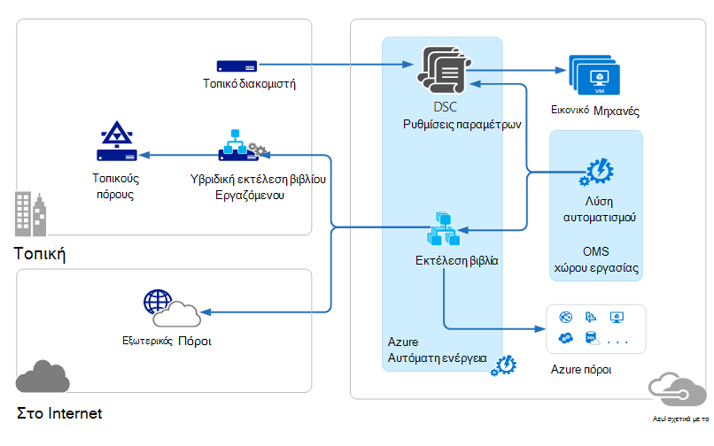

<properties 
   pageTitle="Λειτουργίες διαχείρισης οικογένεια προγραμμάτων (OMS) αρχιτεκτονική | Microsoft Azure"
   description="Microsoft λειτουργίες διαχείρισης οικογένεια προγραμμάτων (OMS) είναι της Microsoft βασίζεται στο cloud IT λύση διαχείρισης που σας βοηθά να διαχειριστείτε και προστασία σας εσωτερικής εγκατάστασης και cloud υποδομής.  Σε αυτό το άρθρο προσδιορίζει τις διάφορες υπηρεσίες που περιλαμβάνονται στο OMS και παρέχει συνδέσεις σε λεπτομερή το περιεχόμενό τους."
   services="operations-management-suite"
   documentationCenter=""
   authors="bwren"
   manager="jwhit"
   editor="tysonn" />
<tags 
   ms.service="operations-management-suite"
   ms.devlang="na"
   ms.topic="get-started-article"
   ms.tgt_pltfrm="na"
   ms.workload="infrastructure-services"
   ms.date="10/27/2016"
   ms.author="bwren" />

# Αρχιτεκτονική OMS

[Λειτουργίες διαχείρισης οικογένεια προγραμμάτων (OMS)](https://azure.microsoft.com/documentation/services/operations-management-suite/) είναι μια συλλογή υπηρεσιών που βασίζεται στο cloud για τη διαχείριση του εσωτερικής εγκατάστασης και cloud περιβάλλοντα.  Σε αυτό το άρθρο περιγράφει τις διαφορετικές εσωτερικής εγκατάστασης και cloud στοιχεία OMS και την αρχιτεκτονική υπολογιστών υψηλού επιπέδου cloud.  Μπορείτε να ανατρέξετε στην τεκμηρίωση για κάθε υπηρεσία για περισσότερες λεπτομέρειες.

## Ανάλυση αρχείου καταγραφής

Όλα τα δεδομένα που συλλέγονται από [Ανάλυση αρχείου καταγραφής](https://azure.microsoft.com/documentation/services/log-analytics/) αποθηκεύεται στο αποθετήριο OMS το οποίο βρίσκεται στο Azure.  Συνδεδεμένα αρχεία προέλευσης δημιουργούν δεδομένα που συλλέγονται σε του αποθετηρίου OMS.  Προς το παρόν υπάρχουν τρεις τύποι συνδεδεμένοι προελεύσεις που υποστηρίζονται.

- Παράγοντας εγκατεστημένο στον υπολογιστή [Windows](../log-analytics/log-analytics-windows-agents.md) ή [Linux](../log-analytics/log-analytics-linux-agents.md) συνδεδεμένη απευθείας με OMS.
- Ένα σύστημα κέντρο Operations Manager (SCOM) διαχείρισης ομάδα [συνδεδεμένοι στο αρχείο καταγραφής ανάλυσης](../log-analytics/log-analytics-om-agents.md) .  Παράγοντες SCOM εξακολουθούν να επικοινωνούν με τους διακομιστές διαχείρισης τα οποία προωθείτε συμβάντων και δεδομένων επιδόσεων σε αρχείο καταγραφής αναλυτικών στοιχείων.
- Ένας [λογαριασμός Azure χώρου αποθήκευσης](../log-analytics/log-analytics-azure-storage.md) που συλλέγει [Azure Διαγνωστικά](../cloud-services/cloud-services-dotnet-diagnostics.md) δεδομένα από ένα ρόλο εργαζόμενου, ρόλου web ή εικονική μηχανή στο Azure.

Προελεύσεις δεδομένων ορίζουν τα δεδομένα που συλλέγει καταγραφής ανάλυσης από συνδεδεμένων προελεύσεων, όπως αρχεία καταγραφής συμβάντων και μετρητών επιδόσεων.  Λύσεις Προσθήκη λειτουργίες OMS και μπορούν εύκολα να προστεθούν στο χώρο εργασίας σας από τη [Συλλογή λύσεων OMS](../log-analytics/log-analytics-add-solutions.md).  Ορισμένες λύσεις μπορεί να απαιτεί μια απευθείας σύνδεση στο αρχείο καταγραφής αναλυτικών στοιχείων από SCOM παράγοντες, ενώ άλλοι μπορεί να απαιτεί επιπλέον παράγοντας να έχει εγκατασταθεί.

Ανάλυση καταγραφής έχει μια πύλη που βασίζεται στο web που μπορείτε να χρησιμοποιήσετε για να διαχειριστείτε πόρους OMS, προσθήκη και ρύθμιση παραμέτρων λύσεων OMS, και προβολή και ανάλυση δεδομένων στο αποθετήριο OMS.

## Αυτοματοποίηση Azure

[Αυτοματοποίηση Azure runbooks](http://azure.microsoft.com/documentation/services/automation) εκτελούνται στο Azure cloud και να αποκτήσετε πρόσβαση σε πόρους που βρίσκονται σε Azure, σε άλλες υπηρεσίες cloud ή προσβάσιμη από το Internet δημόσια.  Μπορείτε επίσης να ορίσετε μηχανές εσωτερικής εγκατάστασης στο κέντρο τοπικών δεδομένων με χρήση [Υβριδική Runbook εργασίας](../automation/automation-hybrid-runbook-worker.md) ώστε να runbooks να αποκτήσετε πρόσβαση σε τοπικούς πόρους.

[Ρυθμίσεις παραμέτρων DSC](../automation/automation-dsc-overview.md) είναι αποθηκευμένα στο Azure αυτοματισμού μπορούν να εφαρμοστούν απευθείας σε Azure εικονικές μηχανές.  Άλλα φυσικά και εικονικές μηχανές να ζητήσετε ρυθμίσεις παραμέτρων από το διακομιστή ελκυστική DSC αυτοματισμού Azure.

Azure αυτοματισμού έχει μια λύση OMS που εμφανίζει τα στατιστικά στοιχεία και συνδέσεις για να εμφανίσετε την πύλη του Azure για τις λειτουργίες.

## Δημιουργία αντιγράφων ασφαλείας Azure

Προστατευμένα δεδομένα στο [Αντίγραφο ασφαλείας Azure](http://azure.microsoft.com/documentation/services/backup) αποθηκεύονται σε ένα αντίγραφο ασφαλείας θάλαμο που βρίσκεται σε μια συγκεκριμένη γεωγραφική περιοχή.  Τα δεδομένα είναι αναπαραχθούν μέσα στην ίδια περιοχή και, ανάλογα με τον τύπο της θάλαμο, επίσης ενδέχεται να αναπαραχθούν σε μια άλλη περιοχή για περαιτέρω πλεονασμού.

Δημιουργία αντιγράφων ασφαλείας Azure έχει τρία βασικά σενάρια.

- Windows μηχανής με παράγοντας Azure δημιουργίας αντιγράφων ασφαλείας.  Αυτό σας επιτρέπει να δημιουργίας αντιγράφων ασφαλείας αρχείων και φακέλων από οποιαδήποτε Windows server ή του προγράμματος-πελάτη απευθείας το Azure θάλαμο δημιουργίας αντιγράφων ασφαλείας.  
- Διαχείριση προστασίας δεδομένων κέντρο του συστήματος (DPM) ή Microsoft Azure δημιουργίας αντιγράφων ασφαλείας διακομιστή. Αυτό σας επιτρέπει να αξιοποιήσετε DPM ή το Microsoft Azure δημιουργίας αντιγράφων ασφαλείας διακομιστή δημιουργίας αντιγράφων ασφαλείας αρχείων και φακέλων εκτός από την εφαρμογή φόρτους εργασίας όπως SQL και του SharePoint με τον τοπικό χώρο αποθήκευσης και, στη συνέχεια, αναπαραγάγετε για το Azure θάλαμο δημιουργίας αντιγράφων ασφαλείας.
- Επεκτάσεις Azure εικονική μηχανή.  Αυτό σας επιτρέπει να δημιουργήστε αντίγραφα ασφαλείας Azure εικονικές μηχανές για να σας Azure θάλαμο δημιουργίας αντιγράφων ασφαλείας.

Azure δημιουργίας αντιγράφων ασφαλείας έχει μια λύση OMS που εμφανίζει τα στατιστικά στοιχεία και συνδέσεις για να εμφανίσετε την πύλη του Azure για τις λειτουργίες.

## Επαναφορά τοποθεσίας Azure

[Επαναφορά τοποθεσίας Azure](http://azure.microsoft.com/documentation/services/site-recovery) orchestrates αναπαραγωγή, ανακατεύθυνσης και αποκατάσταση μετά από εικονικές μηχανές και φυσική διακομιστών. Αναπαραγωγή δεδομένων ανταλλάσσονται μεταξύ hosts Hyper-V, υπερεπόπτες VMware και φυσική διακομιστές σε κέντρα δεδομένων κύριας και δευτερεύουσας ή μεταξύ του κέντρου δεδομένων και του Azure χώρου αποθήκευσης.  Επαναφορά τοποθεσίας αποθηκεύει μετα-δεδομένων που βρίσκεται σε μια συγκεκριμένη γεωγραφική περιοχή Azure χώροι φύλαξης. Δεν υπάρχει από αναπαραγωγή τα δεδομένα αποθηκεύονται από την υπηρεσία Επαναφορά τοποθεσίας.

Azure Επαναφορά τοποθεσίας έχει τρία σενάρια θεμελιώδεις αναπαραγωγής.

**Αναπαραγωγή της Hyper-V εικονικές μηχανές**
- Εάν το Hyper-V εικονικές μηχανές γίνεται σε VMM σύννεφων, μπορείτε να αναπαραγάγετε σε ένα κέντρο δεδομένων δευτερεύοντα ή Azure χώρου αποθήκευσης.  Αναπαραγωγή σε Azure είναι ασφαλή σύνδεση στο internet.  Αλληλεπίδραση με ένα δευτερεύοντα κέντρο δεδομένων είναι μέσω του τοπικού Δικτύου.
- Εάν το Hyper-V εικονικές μηχανές δεν ελέγχονται από VMM, μπορείτε να αναπαραγάγετε με το Azure χώρο αποθήκευσης.  Αναπαραγωγή σε Azure είναι ασφαλή σύνδεση στο internet.
 
**Αναπαραγωγή της VMWare εικονικές μηχανές**
- Μπορείτε να αναπαραγάγετε VMware εικονικές μηχανές σε μια δευτερεύουσα κέντρου δεδομένων που εκτελείται VMware ή Azure χώρου αποθήκευσης.  Αναπαραγωγή σε Azure μπορεί να συμβεί μέσω μιας τοποθεσίας σε τοποθεσία VPN ή Azure ExpressRoute ή μέσω ασφαλούς σύνδεσης στο Internet. Αλληλεπίδραση με ένα δευτερεύοντα κέντρο δεδομένων πραγματοποιείται μέσω του καναλιού InMage Scout δεδομένων.
 
**Αναπαραγωγή των φυσικών Windows και Linux διακομιστών** 
- Μπορείτε να αναπαραγάγετε φυσικής διακομιστές σε ένα κέντρο δεδομένων του δευτερεύοντος ή Azure χώρου αποθήκευσης. Αναπαραγωγή σε Azure μπορεί να συμβεί μέσω μιας τοποθεσίας σε τοποθεσία VPN ή Azure ExpressRoute ή μέσω ασφαλούς σύνδεσης στο Internet. Αλληλεπίδραση με ένα δευτερεύοντα κέντρο δεδομένων πραγματοποιείται μέσω του καναλιού InMage Scout δεδομένων.  Azure Επαναφορά τοποθεσίας έχει μια λύση OMS που εμφανίζει ορισμένα στατιστικά στοιχεία, αλλά πρέπει να χρησιμοποιήσετε την πύλη του Azure για τις λειτουργίες.

## Επόμενα βήματα

- Μάθετε σχετικά με το [αρχείο καταγραφής ανάλυσης](http://azure.microsoft.com/documentation/services/log-analytics).
- Μάθετε σχετικά με το [Azure αυτοματισμού](https://azure.microsoft.com/documentation/services/automation).
- Μάθετε σχετικά με το [Azure δημιουργίας αντιγράφων ασφαλείας](http://azure.microsoft.com/documentation/services/backup).
- Μάθετε σχετικά με την [Επαναφορά Azure τοποθεσίας](http://azure.microsoft.com/documentation/services/site-recovery).
