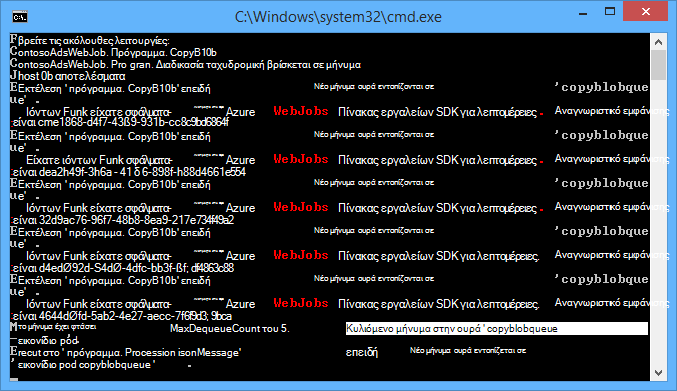
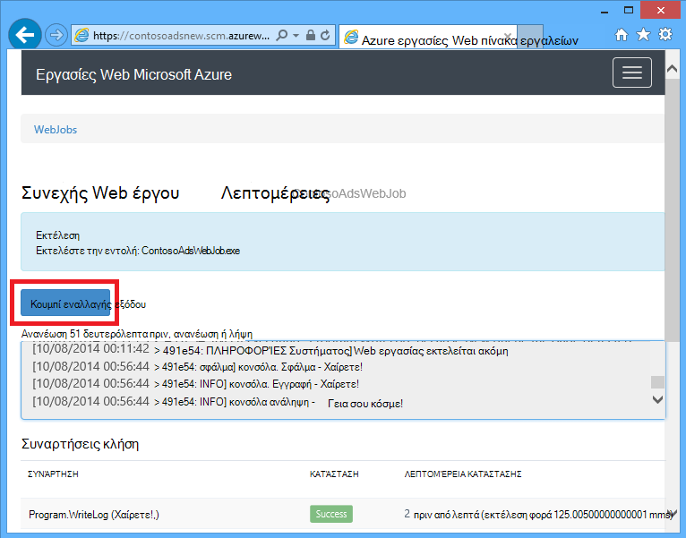
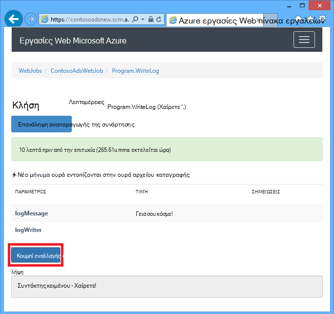
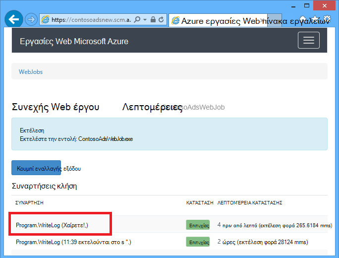
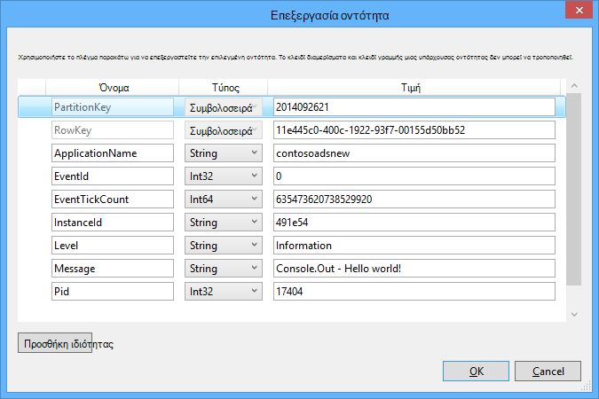
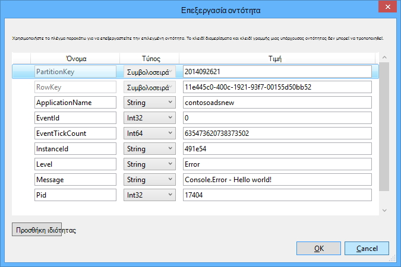

<properties
    pageTitle="Γρήγορα αποτελέσματα με το χώρο αποθήκευσης ουρά και του Visual Studio συνδεδεμένες υπηρεσίες (WebJob έργα) | Microsoft Azure"
    description="Πώς μπορείτε να ξεκινήσετε με χρήση του χώρου αποθήκευσης Azure ουρά σε ένα έργο WebJob μετά τη σύνδεση με ένα λογαριασμό χώρου αποθήκευσης χρησιμοποιώντας το Visual Studio συνδεδεμένες υπηρεσίες."
    services="storage"
    documentationCenter=""
    authors="TomArcher"
    manager="douge"
    editor=""/>

<tags
    ms.service="storage"
    ms.workload="web"
    ms.tgt_pltfrm="vs-getting-started"
    ms.devlang="na"
    ms.topic="article"
    ms.date="07/18/2016"
    ms.author="tarcher"/>

# Γρήγορα αποτελέσματα με το χώρο αποθήκευσης ουρά Azure και του Visual Studio συνδεδεμένες υπηρεσίες (WebJob έργα)

[AZURE.INCLUDE [storage-try-azure-tools-queues](../../includes/storage-try-azure-tools-queues.md)]

## Επισκόπηση

Αυτό το άρθρο περιγράφει πώς να ξεκινήσετε να χρησιμοποιείτε ουρά Azure χώρου αποθήκευσης σε ένα έργο Visual Studio Azure WebJob αφού έχετε δημιουργήσει ή στα οποία γίνεται αναφορά λογαριασμού Azure χώρου αποθήκευσης, χρησιμοποιώντας το παράθυρο διαλόγου του Visual Studio **Προσθέσετε συνδεδεμένες υπηρεσίες** . Όταν προσθέτετε ένα λογαριασμό του χώρου αποθήκευσης σε ένα έργο WebJob, χρησιμοποιώντας το παράθυρο διαλόγου **Προσθήκη συνδεδεμένες υπηρεσίες** του Visual Studio, είναι εγκατεστημένα τα κατάλληλα πακέτα Azure NuGet χώρου αποθήκευσης, τις κατάλληλες αναφορές .NET προστίθενται στο έργο και ενημερώνονται συμβολοσειρές σύνδεσης για το λογαριασμό χώρου αποθήκευσης του αρχείου App.config.  

Αυτό το άρθρο παρέχει C# δείγματα κώδικα που σας δείχνουν πώς μπορείτε να χρησιμοποιήσετε την έκδοση Azure WebJobs SDK 1.x με την υπηρεσία ουράς Azure αποθήκευσης.

Ο χώρος αποθήκευσης Azure ουρά είναι μια υπηρεσία για την αποθήκευση μεγάλου αριθμού των μηνυμάτων που μπορεί να είναι προσβάσιμα από οπουδήποτε στον κόσμο μέσω με έλεγχο ταυτότητας κλήσεων με HTTP ή HTTPS. Ένα μήνυμα μόνο ουρά μπορεί να είναι έως 64 KB μέγεθος και μια ουρά μπορούν να περιέχουν εκατομμύρια μηνυμάτων, μέχρι το όριο συνολική χωρητικότητα ενός λογαριασμού χώρου αποθήκευσης. Για περισσότερες πληροφορίες, ανατρέξτε στο θέμα [Γρήγορα αποτελέσματα με το χώρο αποθήκευσης ουρά Azure μέσω .NET](storage-dotnet-how-to-use-queues.md) . Για περισσότερες πληροφορίες σχετικά με το ASP.NET, ανατρέξτε στο θέμα [ASP.NET](http://www.asp.net).

## Τον τρόπο ενεργοποίησης μιας συνάρτησης όταν λαμβάνετε ένα μήνυμα Ουράς

Για να γράψετε μια συνάρτηση που καλεί το SDK WebJobs όταν λαμβάνετε ένα μήνυμα ουρά, χρησιμοποιήστε το χαρακτηριστικό **QueueTrigger** . Η κατασκευή χαρακτηριστικού μεταφέρει παραμέτρου συμβολοσειράς που καθορίζει το όνομα της ουράς προς απάντηση. Για να δείτε πώς μπορείτε να ορίσετε το όνομα ουράς δυναμικά, δείτε [πώς μπορείτε να ορίσετε επιλογές ρύθμισης παραμέτρων](#how-to-set-configuration-options).

### Συμβολοσειρά ουρά μηνυμάτων

Στο παρακάτω παράδειγμα, ουρά περιέχει ένα μήνυμα συμβολοσειρά, ώστε να εφαρμόζεται **QueueTrigger** σε μια παράμετρο συμβολοσειράς που ονομάζεται **logMessage** , η οποία περιέχει το περιεχόμενο του μηνύματος ουρά. Η συνάρτηση [συντάσσει ένα μήνυμα καταγραφής στον πίνακα εργαλείων](#how-to-write-logs).

        public static void ProcessQueueMessage([QueueTrigger("logqueue")] string logMessage, TextWriter logger)
        {
            logger.WriteLine(logMessage);
        }

Εκτός από τη **συμβολοσειρά**, με την παράμετρο ενδέχεται να είναι ένας πίνακας byte, ένα αντικείμενο **CloudQueueMessage** ή ένα POCO που έχετε καθορίσει.

### POCO [(απλό παλιό αντικείμενο CLR](http://en.wikipedia.org/wiki/Plain_Old_CLR_Object)) ουρά μηνυμάτων

Στο παρακάτω παράδειγμα, το μήνυμα ουρά περιέχει JSON για ένα αντικείμενο **BlobInformation** που περιλαμβάνει μια ιδιότητα **BlobName** . Το SDK deserializes αυτόματα το αντικείμενο.

        public static void WriteLogPOCO([QueueTrigger("logqueue")] BlobInformation blobInfo, TextWriter logger)
        {
            logger.WriteLine("Queue message refers to blob: " + blobInfo.BlobName);
        }

Το SDK χρησιμοποιεί το [πακέτο Newtonsoft.Json NuGet](http://www.nuget.org/packages/Newtonsoft.Json) σειριοποίηση και αποσειριοποίηση μηνύματα. Εάν δημιουργήσετε ουρά μηνυμάτων σε ένα πρόγραμμα που δεν χρησιμοποιεί το SDK WebJobs, μπορείτε να συντάξετε κώδικα όπως το παρακάτω παράδειγμα για να δημιουργήσετε ένα μήνυμα ουρά POCO τη δυνατότητα ανάλυσης στο SDK.

        BlobInformation blobInfo = new BlobInformation() { BlobName = "log.txt" };
        var queueMessage = new CloudQueueMessage(JsonConvert.SerializeObject(blobInfo));
        logQueue.AddMessage(queueMessage);

### Ασύγχρονων συναρτήσεων

Το παρακάτω ασύγχρονης συνάρτηση [συντάσσει ένα αρχείο καταγραφής στον πίνακα εργαλείων](#how-to-write-logs).

        public async static Task ProcessQueueMessageAsync([QueueTrigger("logqueue")] string logMessage, TextWriter logger)
        {
            await logger.WriteLineAsync(logMessage);
        }

Συναρτήσεις ασύγχρονης ενδέχεται να χρειαστούν ένα [διακριτικό ακύρωσης](http://www.asp.net/mvc/overview/performance/using-asynchronous-methods-in-aspnet-mvc-4#CancelToken), όπως φαίνεται στο παρακάτω παράδειγμα που αντιγράφει ένα blob. (Για επεξήγηση της στο πλαίσιο κράτησης θέσης **queueTrigger** , ανατρέξτε στην ενότητα [αντικείμενα BLOB](#how-to-read-and-write-blobs-and-tables-while-processing-a-queue-message) .)

        public async static Task ProcessQueueMessageAsyncCancellationToken(
            [QueueTrigger("blobcopyqueue")] string blobName,
            [Blob("textblobs/{queueTrigger}",FileAccess.Read)] Stream blobInput,
            [Blob("textblobs/{queueTrigger}-new",FileAccess.Write)] Stream blobOutput,
            CancellationToken token)
        {
            await blobInput.CopyToAsync(blobOutput, 4096, token);
        }

## Το χαρακτηριστικό QueueTrigger λειτουργεί με τύπους

Μπορείτε να χρησιμοποιήσετε **QueueTrigger** με τους ακόλουθους τύπους:

* **συμβολοσειρά**
* Ένας τύπος POCO σειριοποιηθεί ως JSON
* **byte]**
* **CloudQueueMessage**

## Ο αλγόριθμος ανίχνευσης

Το SDK εφαρμόζει έναν τυχαίο εκθετική πίσω απενεργοποίηση αλγόριθμο για να μειώσετε το αποτέλεσμα της αδράνειας-ουρά σταθμοσκόπησης στο κόστος συναλλαγής χώρου αποθήκευσης.  Όταν βρεθεί ένα μήνυμα, το SDK αναμένει δύο δευτερόλεπτα και, στη συνέχεια, έλεγχος για ένα άλλο μήνυμα; Όταν υπάρχει κανένα μήνυμα αναμένει περίπου τεσσάρων δευτερολέπτων πριν να δοκιμάσετε ξανά. Αφού οι επόμενες προσπάθειες απέτυχε να λάβετε ένα μήνυμα ουρά, ο χρόνος αναμονής εξακολουθεί να αυξήσετε μέχρι να φτάσει η μέγιστος χρόνος αναμονής, δίνοντας ως προεπιλογή για ένα λεπτό. [Ο χρόνος μέγιστο αναμονής είναι δυνατό να ρυθμιστεί](#how-to-set-configuration-options).

## Πολλές παρουσίες

Εάν η εφαρμογή web της εκτελείται σε πολλές παρουσίες, μια συνεχόμενη WebJobs εκτελείται σε κάθε υπολογιστή και κάθε υπολογιστή θα περιμένετε για εναύσματα και προσπαθήστε να εκτελέσετε λειτουργίες. Σε ορισμένα σενάρια, αυτό μπορεί να οδηγήσει σε ορισμένες λειτουργίες επεξεργασίας δύο φορές τα ίδια δεδομένα, οπότε συναρτήσεις πρέπει να είναι idempotent (αναγράφεται ώστε να καλεί επανειλημμένα με τα ίδια δεδομένα εισόδου δεν έχει αποτελέσματα διπλότυπα).  

## Παράλληλη εκτέλεση

Εάν έχετε πολλές συναρτήσεις ακρόαση σε διαφορετικές ουρές, το SDK θα τους καλέσει παράλληλα όταν γίνεται λήψη μηνυμάτων ταυτόχρονα.

Το ίδιο ισχύει όταν πολλά μηνύματα λαμβάνονται για μία μόνο ουρά. Από προεπιλογή, το SDK λαμβάνει μια δέσμη 16 ουρά μηνυμάτων κάθε φορά και εκτελεί τη συνάρτηση που επεξεργάζεται τους παράλληλα. [Το μέγεθος δέσμης είναι δυνατό να ρυθμιστεί](#how-to-set-configuration-options). Όταν ο αριθμός που υποβάλλεται σε επεξεργασία λαμβάνει προς τα κάτω στο μισό του μεγέθους της δέσμης, το SDK λαμβάνει μια άλλη δέσμη και ξεκινά επεξεργασίας αυτά τα μηνύματα. Επομένως, ο μέγιστος αριθμός των ταυτόχρονες μηνυμάτων που υποβάλλεται σε επεξεργασία ανά συνάρτηση είναι μισή ώρα το μέγεθος δέσμης. Αυτό το όριο ξεχωριστά ισχύει για κάθε συνάρτηση που έχει ένα χαρακτηριστικό **QueueTrigger** . Εάν δεν θέλετε παράλληλη εκτέλεση για τα μηνύματα που λάβατε στο μία ουρά, ορίστε το μέγεθος δέσμης σε 1.

## Λήψη ουρά ή ουρά μετα-δεδομένων μηνύματος

Μπορείτε να λάβετε τις ακόλουθες ιδιότητες μηνύματος, προσθέτοντας τις παραμέτρους της υπογραφής μέθοδο:

* **DateTimeOffset** expirationTime
* **DateTimeOffset** insertionTime
* **DateTimeOffset** nextVisibleTime
* queueTrigger **συμβολοσειράς** (περιέχει το κείμενο του μηνύματος)
* αναγνωριστικό **συμβολοσειράς**
* **συμβολοσειρά** popReceipt
* **int** dequeueCount

Εάν θέλετε να εργαστείτε απευθείας με την αποθήκευση Azure API, μπορείτε επίσης να προσθέσετε μια παράμετρο **CloudStorageAccount** .

Το παρακάτω παράδειγμα εγγράφει όλων των αυτό μετα-δεδομένων σε ένα αρχείο καταγραφής της εφαρμογής ΠΛΗΡΟΦΟΡΊΕΣ. Στο παράδειγμα, logMessage και queueTrigger περιέχει το περιεχόμενο του μηνύματος ουρά.

        public static void WriteLog([QueueTrigger("logqueue")] string logMessage,
            DateTimeOffset expirationTime,
            DateTimeOffset insertionTime,
            DateTimeOffset nextVisibleTime,
            string id,
            string popReceipt,
            int dequeueCount,
            string queueTrigger,
            CloudStorageAccount cloudStorageAccount,
            TextWriter logger)
        {
            logger.WriteLine(
                "logMessage={0}\n" +
            "expirationTime={1}\ninsertionTime={2}\n" +
                "nextVisibleTime={3}\n" +
                "id={4}\npopReceipt={5}\ndequeueCount={6}\n" +
                "queue endpoint={7} queueTrigger={8}",
                logMessage, expirationTime,
                insertionTime,
                nextVisibleTime, id,
                popReceipt, dequeueCount,
                cloudStorageAccount.QueueEndpoint,
                queueTrigger);
        }

Ακολουθεί ένα δείγμα αρχείου καταγραφής από το δείγμα κώδικα:

        logMessage=Hello world!
        expirationTime=10/14/2014 10:31:04 PM +00:00
        insertionTime=10/7/2014 10:31:04 PM +00:00
        nextVisibleTime=10/7/2014 10:41:23 PM +00:00
        id=262e49cd-26d3-4303-ae88-33baf8796d91
        popReceipt=AgAAAAMAAAAAAAAAfc9H0n/izwE=
        dequeueCount=1
        queue endpoint=https://contosoads.queue.core.windows.net/
        queueTrigger=Hello world!

## Φυσιολογική τερματισμού

Μια συνάρτηση που εκτελείται σε μια συνεχόμενη WebJob μπορεί να αποδεχτεί μια παράμετρο **CancellationToken** που επιτρέπει στο λειτουργικό σύστημα για να ενημερώσετε τη συνάρτηση όταν το WebJob πρόκειται να τερματιστεί. Μπορείτε να χρησιμοποιήσετε αυτήν την ειδοποίηση για να βεβαιωθείτε ότι η συνάρτηση δεν τερματιστεί απροσδόκητα με τον τρόπο που απομένουν δεδομένα σε μια συνεπή κατάσταση.

Το παρακάτω παράδειγμα εμφανίζει τον τρόπο για να ελέγξετε για επικείμενη WebJob τερματισμού σε μια συνάρτηση.

    public static void GracefulShutdownDemo(
                [QueueTrigger("inputqueue")] string inputText,
                TextWriter logger,
                CancellationToken token)
    {
        for (int i = 0; i < 100; i++)
        {
            if (token.IsCancellationRequested)
            {
                logger.WriteLine("Function was cancelled at iteration {0}", i);
                break;
            }
            Thread.Sleep(1000);
            logger.WriteLine("Normal processing for queue message={0}", inputText);
        }
    }

**Σημείωση:** Ο πίνακας εργαλείων δεν μπορεί να εμφανίζει σωστά την κατάσταση και το αποτέλεσμα των συναρτήσεων που έχουν τερματιστεί.

Για περισσότερες πληροφορίες, ανατρέξτε στο θέμα [WebJobs φυσιολογική τερματισμού](http://blog.amitapple.com/post/2014/05/webjobs-graceful-shutdown/#.VCt1GXl0wpR).   

## Πώς μπορείτε να δημιουργήσετε ένα μήνυμα ουράς κατά την επεξεργασία ενός μηνύματος ουρά

Για να γράψετε μια συνάρτηση που δημιουργεί ένα νέο μήνυμα ουρά, χρησιμοποιήστε το χαρακτηριστικό **ουρά** . Όπως **QueueTrigger**, που μεταβιβάζουν το όνομα ουρά ως συμβολοσειρά ή μπορείτε να [ορίσετε το όνομα ουράς δυναμικά](#how-to-set-configuration-options).

### Συμβολοσειρά ουρά μηνυμάτων

Το παρακάτω δείγμα κώδικα μη ασύγχρονης δημιουργεί ένα νέο μήνυμα ουρά στην ουρά με το όνομα "outputqueue" με το ίδιο περιεχόμενο με το μήνυμα ουρά λάβατε στην ουρά με το όνομα "inputqueue". (Για ασύγχρονη Χρησιμοποιήστε συναρτήσεις **IAsyncCollector<T> ** όπως φαίνεται αργότερα σε αυτήν την ενότητα.)

        public static void CreateQueueMessage(
            [QueueTrigger("inputqueue")] string queueMessage,
            [Queue("outputqueue")] out string outputQueueMessage )
        {
            outputQueueMessage = queueMessage;
        }

### POCO [(απλό παλιό αντικείμενο CLR](http://en.wikipedia.org/wiki/Plain_Old_CLR_Object)) ουρά μηνυμάτων

Για να δημιουργήσετε ένα μήνυμα ουρά που περιέχει ένα POCO αντί για μια συμβολοσειρά, μεταβιβάζουν τον τύπο POCO ως παράμετρο εξόδου για την κατασκευή χαρακτηριστικού **ουρά** .

        public static void CreateQueueMessage(
            [QueueTrigger("inputqueue")] BlobInformation blobInfoInput,
            [Queue("outputqueue")] out BlobInformation blobInfoOutput )
        {
            blobInfoOutput = blobInfoInput;
        }

Το SDK τοποθετεί αυτόματα σειριακά να JSON το αντικείμενο. Ένα μήνυμα ουρά δημιουργείται πάντα, ακόμα και αν το αντικείμενο είναι null.

### Δημιουργία πολλών μηνυμάτων ή στο ασύγχρονων συναρτήσεων

Για να δημιουργήσετε πολλά μηνύματα, να τον τύπο παραμέτρου για την ουρά εξόδου **ICollector<T> ** ή **IAsyncCollector<T>**, όπως φαίνεται στο παρακάτω παράδειγμα.

        public static void CreateQueueMessages(
            [QueueTrigger("inputqueue")] string queueMessage,
            [Queue("outputqueue")] ICollector<string> outputQueueMessage,
            TextWriter logger)
        {
            logger.WriteLine("Creating 2 messages in outputqueue");
            outputQueueMessage.Add(queueMessage + "1");
            outputQueueMessage.Add(queueMessage + "2");
        }

Κάθε μήνυμα ουρά δημιουργείται αμέσως μόλις ονομάζεται τη μέθοδο **Add** .

### Τύποι που λειτουργεί το χαρακτηριστικό ουρά με

Μπορείτε να χρησιμοποιήσετε το χαρακτηριστικό **ουρά** σχετικά με τους παρακάτω τύπους παραμέτρων:

* **ανάληψη συμβολοσειράς** (δημιουργεί μήνυμα ουρά εάν η τιμή της παραμέτρου είναι δεν είναι null όταν λήξει η συνάρτηση)
* **ανάληψη byte]** (λειτουργεί ως **συμβολοσειρά**)
* **ανάληψη CloudQueueMessage** (λειτουργεί ως **συμβολοσειρά**)
* **ανάληψη POCO** (ένας τύπος μπορεί να σειριοποιηθεί, δημιουργεί ένα μήνυμα με αντικείμενο null εάν η παράμετρος είναι null όταν λήξει η συνάρτηση)
* **ICollector**
* **IAsyncCollector**
* **CloudQueue** (για τη δημιουργία μηνυμάτων με μη αυτόματο τρόπο χρησιμοποιώντας το API αποθήκευσης Azure απευθείας)

### Χρήση του WebJobs SDK χαρακτηριστικά στο σώμα μιας συνάρτησης

Εάν πρέπει να κάνετε ορισμένες εργασίες στη συνάρτηση σας πριν να χρησιμοποιήσετε ένα χαρακτηριστικό WebJobs SDK όπως **ουρά**, **Blob**ή **πίνακα**, μπορείτε να χρησιμοποιήσετε το περιβάλλον εργασίας **IBinder** .

Το παρακάτω παράδειγμα λαμβάνει μήνυμα ουρά εισόδου και δημιουργεί ένα νέο μήνυμα με το ίδιο περιεχόμενο σε μια ουρά εξόδου. Το όνομα ουράς εξόδου έχει οριστεί από τον κωδικό στο σώμα της συνάρτησης.

        public static void CreateQueueMessage(
            [QueueTrigger("inputqueue")] string queueMessage,
            IBinder binder)
        {
            string outputQueueName = "outputqueue" + DateTime.Now.Month.ToString();
            QueueAttribute queueAttribute = new QueueAttribute(outputQueueName);
            CloudQueue outputQueue = binder.Bind<CloudQueue>(queueAttribute);
            outputQueue.AddMessage(new CloudQueueMessage(queueMessage));
        }

Το περιβάλλον εργασίας **IBinder** μπορεί επίσης να χρησιμοποιηθεί με τα χαρακτηριστικά του **πίνακα** και **αντικειμένων Blob** .

## Πώς να διαβάζετε και να γράφετε αντικείμενα BLOB και πινάκων κατά την επεξεργασία ενός μηνύματος ουρά

Τα χαρακτηριστικά **αντικειμένων Blob** και **πίνακα** σάς επιτρέπουν να διαβάζετε και να γράφετε αντικείμενα BLOB και πίνακες. Τα δείγματα σε αυτήν την ενότητα εφαρμόζονται σε αντικείμενα blob. Για δείγματα κώδικα που δείχνουν τον τρόπο ενεργοποίησης διεργασίες όταν αντικείμενα BLOB έχουν δημιουργηθεί ή έχουν ενημερωθεί, δείτε [πώς μπορείτε να χρησιμοποιήσετε χώρο αποθήκευσης αντικειμένων blob του Azure με το SDK WebJobs](../app-service-web/websites-dotnet-webjobs-sdk-storage-blobs-how-to.md)και για τα δείγματα κώδικα που ανάγνωση και εγγραφή πίνακες, ανατρέξτε στο θέμα [Πώς να χρησιμοποιείτε το χώρο αποθήκευσης πινάκων του Azure με το SDK WebJobs](../app-service-web/websites-dotnet-webjobs-sdk-storage-tables-how-to.md).

### Συμβολοσειρά ουρά μηνυμάτων ενεργοποίηση λειτουργιών blob

Για ένα μήνυμα ουρά που περιέχει μια συμβολοσειρά, **queueTrigger** είναι ένα σύμβολο κράτησης θέσης που μπορείτε να χρησιμοποιήσετε στην παράμετρο **blobPath** του **Blob** το χαρακτηριστικό που περιέχει τα περιεχόμενα του μηνύματος.

Το παρακάτω παράδειγμα χρησιμοποιεί **ροή** αντικειμένων για ανάγνωση και εγγραφή αντικείμενα blob. Το μήνυμα ουρά είναι το όνομα του ένα blob που βρίσκεται στο κοντέινερ textblobs. Ένα αντίγραφο του το αντικείμενο blob με "-νέα" προσαρτημένο σε το όνομα που έχει δημιουργηθεί στο ίδιο κοντέινερ.

        public static void ProcessQueueMessage(
            [QueueTrigger("blobcopyqueue")] string blobName,
            [Blob("textblobs/{queueTrigger}",FileAccess.Read)] Stream blobInput,
            [Blob("textblobs/{queueTrigger}-new",FileAccess.Write)] Stream blobOutput)
        {
            blobInput.CopyTo(blobOutput, 4096);
        }

Η κατασκευή χαρακτηριστικού **Blob** παίρνει μια παράμετρο **blobPath** που καθορίζει το κοντέινερ και το όνομα blob. Για περισσότερες πληροφορίες σχετικά με αυτήν τη θέση αντικειμένου, ανατρέξτε στο θέμα [Πώς να χρησιμοποιείτε το χώρο αποθήκευσης αντικειμένων blob του Azure με το SDK WebJobs](../app-service-web/websites-dotnet-webjobs-sdk-storage-blobs-how-to.md).

Όταν το χαρακτηριστικό decorates ένα αντικείμενο **ροής** , μια άλλη παράμετρο κατασκευή Καθορίζει τη λειτουργία **FileAccess** ως ανάγνωση, εγγραφή ή μόνο για ανάγνωση.

Το παρακάτω παράδειγμα χρησιμοποιεί ένα αντικείμενο **CloudBlockBlob** για να διαγράψετε ένα blob. Το μήνυμα ουρά είναι το όνομα του το αντικείμενο blob.

        public static void DeleteBlob(
            [QueueTrigger("deleteblobqueue")] string blobName,
            [Blob("textblobs/{queueTrigger}")] CloudBlockBlob blobToDelete)
        {
            blobToDelete.Delete();
        }

### POCO [(απλό παλιό αντικείμενο CLR](http://en.wikipedia.org/wiki/Plain_Old_CLR_Object)) ουρά μηνυμάτων

Για μια POCO που έχουν αποθηκευτεί ως JSON στο μήνυμα ουρά, μπορείτε να χρησιμοποιήσετε σύμβολα κράτησης θέσης που ιδιότητες όνομα του αντικειμένου στην παράμετρο **blobPath** του **ουρά** το χαρακτηριστικό. Μπορείτε επίσης να χρησιμοποιήσετε τα ονόματα των ιδιοτήτων μετα-δεδομένων ουρά ως σύμβολα κράτησης θέσης. Ανατρέξτε στο θέμα [λήψη ουρά ή ουρά μετα-δεδομένων μήνυμα](#get-queue-or-queue-message-metadata).

Το παρακάτω παράδειγμα αντιγράφει ένα blob σε ένα νέο blob με διαφορετική επέκταση. Το μήνυμα ουρά είναι ένα αντικείμενο **BlobInformation** που περιλαμβάνει ιδιότητες **BlobName** και **BlobNameWithoutExtension** . Τα ονόματα των ιδιοτήτων χρησιμοποιούνται ως σύμβολα κράτησης θέσης στη διαδρομή blob για τα χαρακτηριστικά **αντικειμένων Blob** .

        public static void CopyBlobPOCO(
            [QueueTrigger("copyblobqueue")] BlobInformation blobInfo,
            [Blob("textblobs/{BlobName}", FileAccess.Read)] Stream blobInput,
            [Blob("textblobs/{BlobNameWithoutExtension}.txt", FileAccess.Write)] Stream blobOutput)
        {
            blobInput.CopyTo(blobOutput, 4096);
        }

Το SDK χρησιμοποιεί το [πακέτο Newtonsoft.Json NuGet](http://www.nuget.org/packages/Newtonsoft.Json) σειριοποίηση και αποσειριοποίηση μηνύματα. Εάν δημιουργήσετε ουρά μηνυμάτων σε ένα πρόγραμμα που δεν χρησιμοποιεί το SDK WebJobs, μπορείτε να συντάξετε κώδικα όπως το παρακάτω παράδειγμα για να δημιουργήσετε ένα μήνυμα ουρά POCO τη δυνατότητα ανάλυσης στο SDK.

        BlobInformation blobInfo = new BlobInformation() { BlobName = "boot.log", BlobNameWithoutExtension = "boot" };
        var queueMessage = new CloudQueueMessage(JsonConvert.SerializeObject(blobInfo));
        logQueue.AddMessage(queueMessage);

Εάν πρέπει να κάνετε ορισμένες εργασίες στη συνάρτηση σας πριν από την σύνδεση ένα blob σε ένα αντικείμενο, μπορείτε να χρησιμοποιήσετε το χαρακτηριστικό στο σώμα της συνάρτησης, όπως φαίνεται στην [Χρήση SDK WebJobs χαρακτηριστικά στο σώμα μιας συνάρτησης](#use-webjobs-sdk-attributes-in-the-body-of-a-function).

###Μπορείτε να χρησιμοποιήσετε το χαρακτηριστικό Blob με τύπους

Το χαρακτηριστικό **Blob** μπορεί να χρησιμοποιηθεί με τους ακόλουθους τύπους:

* **Ροή** (ανάγνωσης ή εγγραφής, που καθορίζονται, χρησιμοποιώντας την παράμετρο κατασκευή FileAccess)
* **TextReader**
* **TextWriter**
* **συμβολοσειρά** (για ανάγνωση)
* **ανάληψη συμβολοσειράς** (εγγραφή, δημιουργεί ένα blob μόνο εάν η παράμετρος συμβολοσειράς είναι δεν είναι null όταν η συνάρτηση επιστρέφει)
* POCO (για ανάγνωση)
* ανάληψη POCO (εγγραφή, πάντα δημιουργεί ένα blob, δημιουργεί ως αντικείμενο null εάν η παράμετρος POCO είναι null όταν η συνάρτηση επιστρέφει)
* **CloudBlobStream** (εγγραφή)
* **ICloudBlob** (ανάγνωσης ή εγγραφής)
* **CloudBlockBlob** (Διαβάστε ή εγγραφή)
* **CloudPageBlob** (ανάγνωσης ή εγγραφής)

##Τον τρόπο χειρισμού των μηνυμάτων αλλοίωσης

Μηνύματα των οποίων το περιεχόμενο έχει ως αποτέλεσμα μια συνάρτηση αποτυχία ονομάζονται *μηνυμάτων αλλοίωσης*. Όταν η συνάρτηση αποτυγχάνει, το μήνυμα ουρά δεν διαγράφεται και τελικά είναι επιλέξατε προς τα επάνω και πάλι, προκαλεί τον κύκλο να επαναληφθεί. Το SDK αυτόματα να διακόψετε τον κύκλο μετά από έναν περιορισμένο αριθμό των διαδοχικών προσεγγίσεων ή μπορείτε να το κάνετε με μη αυτόματο τρόπο.

### Αυτόματη τον χειρισμό μηνυμάτων

Το SDK θα καλέσετε μια συνάρτηση έως και 5 φορές η επεξεργασία ενός μηνύματος ουρά. Εάν το πέμπτο, δοκιμάστε να αποτύχει, το μήνυμα έχει μετακινηθεί σε ουρά αλλοίωσης. Μπορείτε να δείτε πώς να ρυθμίζετε τον μέγιστο αριθμό των επαναλήψεων στο [πώς μπορείτε να ορίσετε επιλογές ρύθμισης παραμέτρων](#how-to-set-configuration-options).

Αλλοίωσης ουρά ονομάζεται *{originalqueuename}*-αλλοίωσης. Μπορείτε να συντάξετε μια συνάρτηση για να επεξεργαστείτε μηνύματα από την αλλοίωσης ουρά με καταγραφή τους ή την αποστολή ειδοποίησης που μη αυτόματη προσοχή είναι απαραίτητο.

Στο παρακάτω παράδειγμα το **CopyBlob** συνάρτηση θα αποτύχει όταν ένα μήνυμα ουρά περιέχει το όνομα του ένα blob που δεν υπάρχει. Όταν συμβεί αυτό, μετακινηθεί το μήνυμα από την ουρά copyblobqueue στην ουρά copyblobqueue δηλητήριο. Η **ProcessPoisonMessage** καταγράφει το μήνυμα αλλοίωσης.

        public static void CopyBlob(
            [QueueTrigger("copyblobqueue")] string blobName,
            [Blob("textblobs/{queueTrigger}", FileAccess.Read)] Stream blobInput,
            [Blob("textblobs/{queueTrigger}-new", FileAccess.Write)] Stream blobOutput)
        {
            blobInput.CopyTo(blobOutput, 4096);
        }

        public static void ProcessPoisonMessage(
            [QueueTrigger("copyblobqueue-poison")] string blobName, TextWriter logger)
        {
            logger.WriteLine("Failed to copy blob, name=" + blobName);
        }

Η παρακάτω εικόνα εμφανίζει το αποτέλεσμα της κονσόλας από αυτές τις συναρτήσεις κατά την επεξεργασία ενός μηνύματος αλλοίωσης.

### Μη αυτόματη τον χειρισμό μηνυμάτων

Μπορείτε να λάβετε του αριθμού των φορών που έχει συλλεχθεί μηνύματος για επεξεργασία, προσθέτοντας μια παράμετρο **int** με το όνομα **dequeueCount** σας συνάρτηση. Στη συνέχεια, μπορείτε να ελέγξετε το πλήθος εξαγωγής από ουρά συνάρτηση κώδικα και να εκτελέσετε τη δική σας αλλοίωσης Διαχείριση μηνυμάτων όταν ο αριθμός υπερβαίνει το όριο, όπως φαίνεται στο παρακάτω παράδειγμα.

        public static void CopyBlob(
            [QueueTrigger("copyblobqueue")] string blobName, int dequeueCount,
            [Blob("textblobs/{queueTrigger}", FileAccess.Read)] Stream blobInput,
            [Blob("textblobs/{queueTrigger}-new", FileAccess.Write)] Stream blobOutput,
            TextWriter logger)
        {
            if (dequeueCount > 3)
            {
                logger.WriteLine("Failed to copy blob, name=" + blobName);
            }
            else
            {
            blobInput.CopyTo(blobOutput, 4096);
            }
        }

## Πώς μπορείτε να ορίσετε επιλογές ρύθμισης παραμέτρων

Μπορείτε να χρησιμοποιήσετε τον τύπο **JobHostConfiguration** για να ορίσετε τις ακόλουθες επιλογές ρύθμισης παραμέτρων:

* Ορίστε τις συμβολοσειρές σύνδεσης SDK στον κώδικα.
* Ρύθμιση παραμέτρων **QueueTrigger** ρυθμίσεις όπως η μέγιστη απομάκρυνση από την ουρά count.
* Λήψη ουρά ονομάτων από τις ρυθμίσεις παραμέτρων.

###Ορισμός SDK συμβολοσειρές σύνδεσης σε κώδικα

Ρύθμιση των συμβολοσειρών σύνδεσης SDK στον κώδικα σάς επιτρέπει να χρησιμοποιήσετε τα δικά σας ονόματα συμβολοσειρά σύνδεσης σε αρχεία ρύθμισης παραμέτρων ή μεταβλητές περιβάλλοντος, όπως φαίνεται στο παρακάτω παράδειγμα.

        static void Main(string[] args)
        {
            var _storageConn = ConfigurationManager
                .ConnectionStrings["MyStorageConnection"].ConnectionString;

            var _dashboardConn = ConfigurationManager
                .ConnectionStrings["MyDashboardConnection"].ConnectionString;

            var _serviceBusConn = ConfigurationManager
                .ConnectionStrings["MyServiceBusConnection"].ConnectionString;

            JobHostConfiguration config = new JobHostConfiguration();
            config.StorageConnectionString = _storageConn;
            config.DashboardConnectionString = _dashboardConn;
            config.ServiceBusConnectionString = _serviceBusConn;
            JobHost host = new JobHost(config);
            host.RunAndBlock();
        }

### Ρύθμιση παραμέτρων QueueTrigger

Μπορείτε να ρυθμίσετε τις ακόλουθες ρυθμίσεις που ισχύουν για την επεξεργασία ουρά μηνυμάτων:

- Ο μέγιστος αριθμός ουρά μηνυμάτων που έχουν συλλεχθεί του ταυτόχρονα πρέπει να εκτελεστούν παράλληλα (η προεπιλογή είναι 16).
- Ο μέγιστος αριθμός των επαναλήψεων πριν από την αποστολή ενός μηνύματος ουρά σε ουρά αλλοίωσης (η προεπιλογή είναι 5).
- Ο μέγιστος αριθμός περιμένετε χρόνος μέχρι να σταθμοσκόπησης ξανά όταν μια ουρά είναι κενό (η προεπιλογή είναι 1 λεπτό).

Το παρακάτω παράδειγμα δείχνει πώς μπορείτε να ρυθμίσετε αυτές τις ρυθμίσεις:

        static void Main(string[] args)
        {
            JobHostConfiguration config = new JobHostConfiguration();
            config.Queues.BatchSize = 8;
            config.Queues.MaxDequeueCount = 4;
            config.Queues.MaxPollingInterval = TimeSpan.FromSeconds(15);
            JobHost host = new JobHost(config);
            host.RunAndBlock();
        }

### Ορισμός τιμών για WebJobs SDK παραμέτρους κατασκευή στον κώδικα

Μερικές φορές θέλετε να καθορίσετε ένα όνομα ουράς, ένα όνομα blob ή κοντέινερ ή έναν πίνακα ονομάσετε στο κώδικα αντί να καθορίσετε από τον προγραμματισμό. Για παράδειγμα, μπορεί να θέλετε να καθορίσετε το όνομα ουράς για **QueueTrigger** σε αρχείο ή περιβάλλον μεταβλητή ρύθμισης παραμέτρων.

Μπορείτε να το κάνετε περνώντας σε ένα αντικείμενο **NameResolver** στον τύπο **JobHostConfiguration** . Συμπεριλάβετε ειδικούς χαρακτήρες κράτησης θέσης περικλείεται σε σύμβολα ποσοστού (%) στο WebJobs SDK χαρακτηριστικό κατασκευή παραμέτρους και τον κωδικό **NameResolver** καθορίζει τις πραγματικές τιμές που θα χρησιμοποιηθεί στη θέση αυτά τα σύμβολα κράτησης θέσης.

Για παράδειγμα, ας υποθέσουμε ότι θέλετε να χρησιμοποιήσετε μια ουρά με το όνομα logqueuetest στο περιβάλλον δοκιμής και ένα επώνυμο logqueueprod παραγωγή. Αντί για ένα όνομα σχεδιασμένου ουράς, που θέλετε να καθορίσετε το όνομα μιας καταχώρησης στη συλλογή **appSettings** που να έχουν το όνομα πραγματική ουράς. Εάν το κλειδί **appSettings** είναι logqueue, συνάρτηση σας μπορεί να μοιάζει με το παρακάτω παράδειγμα.

        public static void WriteLog([QueueTrigger("%logqueue%")] string logMessage)
        {
            Console.WriteLine(logMessage);
        }

Τάξη σας **NameResolver** , στη συνέχεια, μπορεί να λάβετε το όνομα ουράς από **appSettings** όπως φαίνεται στο ακόλουθο παράδειγμα:

        public class QueueNameResolver : INameResolver
        {
            public string Resolve(string name)
            {
                return ConfigurationManager.AppSettings[name].ToString();
            }
        }

Μπορείτε να μεταβιβάσετε την κλάση **NameResolver** στο στο αντικείμενο **JobHost** όπως φαίνεται στο παρακάτω παράδειγμα.

        static void Main(string[] args)
        {
            JobHostConfiguration config = new JobHostConfiguration();
            config.NameResolver = new QueueNameResolver();
            JobHost host = new JobHost(config);
            host.RunAndBlock();
        }

**Σημείωση:** Ουρά, πίνακα και τα ονόματα αντικειμένων blob επιλύονται κάθε φορά που ονομάζεται μια συνάρτηση, αλλά τα ονόματα κοντέινερ αντικειμένων blob επιλύονται μόνο κατά την εκκίνηση της εφαρμογής. Δεν μπορείτε να αλλάξετε το όνομα του κοντέινερ αντικειμένων blob ενώ εκτελείται η εργασία.

## Τον τρόπο ενεργοποίησης μιας συνάρτησης με μη αυτόματο τρόπο

Για να ενεργοποιήσετε μια συνάρτηση με μη αυτόματο τρόπο, χρησιμοποιήστε τη μέθοδο **κλήσης** ή **CallAsync** σε του αντικειμένου **JobHost** και το χαρακτηριστικό **NoAutomaticTrigger** για τη συνάρτηση, όπως φαίνεται στο παρακάτω παράδειγμα.

        public class Program
        {
            static void Main(string[] args)
            {
                JobHost host = new JobHost();
                host.Call(typeof(Program).GetMethod("CreateQueueMessage"), new { value = "Hello world!" });
            }

            [NoAutomaticTrigger]
            public static void CreateQueueMessage(
                TextWriter logger,
                string value,
                [Queue("outputqueue")] out string message)
            {
                message = value;
                logger.WriteLine("Creating queue message: ", message);
            }
        }

## Πώς να συντάξετε αρχείων καταγραφής

Πίνακας εργαλείων εμφανίζει αρχεία καταγραφής σε δύο μέρη: στη σελίδα για την WebJob και, στη σελίδα για μια συγκεκριμένη κλήση WebJob.

Έξοδος από την κονσόλα μεθόδους που μπορείτε να καλέσετε σε μια συνάρτηση ή τη μέθοδο **Main()** εμφανίζεται η σελίδα πίνακα εργαλείων για το WebJob και όχι της σελίδας για μια συγκεκριμένη μέθοδο κλήση. Έξοδος από το αντικείμενο TextWriter που λαμβάνετε από μια παράμετρο στην υπογραφή σας μέθοδο εμφανίζεται στη σελίδα πίνακα εργαλείων για μια κλήση μεθόδου.

Κονσόλα εξόδου δεν μπορεί να είναι συνδεδεμένη με μια συγκεκριμένη μέθοδο κλήση επειδή η κονσόλα είναι μονού νήματος, ενώ πολλές συναρτήσεις εργασία μπορεί να εκτελεί την ίδια στιγμή. Λόγο του SDK παρέχει κάθε συνάρτηση κλήσης με το δικό του αντικειμένου writer μοναδικό αρχείο καταγραφής.

Για να γράψετε [αρχεία καταγραφής ανίχνευσης εφαρμογής](web-sites-dotnet-troubleshoot-visual-studio.md#logsoverview), χρησιμοποιήστε **Console.Out** (δημιουργεί αρχεία καταγραφής έχει επισημανθεί ως ΠΛΗΡΟΦΟΡΊΕΣ) και **Console.Error** (δημιουργεί αρχεία καταγραφής έχει επισημανθεί ως σφάλμα). Εναλλακτική λύση είναι να χρησιμοποιήσετε [ανίχνευσης ή TraceSource](http://blogs.msdn.com/b/mcsuksoldev/archive/2014/09/04/adding-trace-to-azure-web-sites-and-web-jobs.aspx), που παρέχει επίπεδα λεπτομερές, προειδοποίηση και κρίσιμη εκτός από τις πληροφορίες και σφάλματος. Αρχεία καταγραφής ανίχνευσης εφαρμογής που εμφανίζονται στα αρχεία καταγραφής εφαρμογών web, Azure πίνακες, ή αντικείμενα BLOB Azure ανάλογα με το πώς μπορείτε να ρυθμίσετε την εφαρμογή Azure web. Όπως ισχύει και για όλα τα δεδομένα εξόδου Console, τα πιο πρόσφατα αρχεία καταγραφής 100 εφαρμογής εμφανίζονται επίσης στη σελίδα πίνακα εργαλείων για το WebJob, όχι τη σελίδα για μια κλήση συνάρτησης.

Κονσόλα αποτέλεσμα εμφανίζεται στον πίνακα εργαλείων μόνο εάν το πρόγραμμα εκτελείται σε ένα WebJob Azure, δεν εάν το πρόγραμμα εκτελείται τοπικά ή σε ορισμένες άλλες περιβάλλον.

Μπορείτε να απενεργοποιήσετε την καταγραφή, ορίζοντας τη συμβολοσειρά σύνδεσης πίνακα εργαλείων σε null. Για περισσότερες πληροφορίες, ανατρέξτε στο θέμα [πώς μπορείτε να ορίσετε επιλογές ρύθμισης παραμέτρων](#how-to-set-configuration-options).

Το παρακάτω παράδειγμα εμφανίζει διάφορους τρόπους για να γράψετε αρχεία καταγραφής:

        public static void WriteLog(
            [QueueTrigger("logqueue")] string logMessage,
            TextWriter logger)
        {
            Console.WriteLine("Console.Write - " + logMessage);
            Console.Out.WriteLine("Console.Out - " + logMessage);
            Console.Error.WriteLine("Console.Error - " + logMessage);
            logger.WriteLine("TextWriter - " + logMessage);
        }

Στον πίνακα εργαλείων SDK WebJobs, την έξοδο από το αντικείμενο **TextWriter** εμφανίζεται όταν μεταβείτε στη σελίδα για μια συγκεκριμένη συνάρτηση κλήση και επιλέξτε " **Έξοδος" Εναλλαγή**:

Στον πίνακα εργαλείων SDK WebJobs, τις πιο πρόσφατες 100 γραμμές της κονσόλας εξόδου εμφάνιση του όταν μεταβείτε στη σελίδα για την WebJob (όχι για την κλήση συνάρτηση) και επιλέξτε " **Έξοδος" Εναλλαγή**.

Σε μια συνεχόμενη WebJob, αρχεία καταγραφής εφαρμογών εμφανίζονται στην/δεδομένων/εργασίες/συνεχής /*{webjobname}*/job_log.txt στο σύστημα αρχείων εφαρμογής web.

        [09/26/2014 21:01:13 > 491e54: INFO] Console.Write - Hello world!
        [09/26/2014 21:01:13 > 491e54: ERR ] Console.Error - Hello world!
        [09/26/2014 21:01:13 > 491e54: INFO] Console.Out - Hello world!

Σε μια Azure αντικειμένων blob εμφάνισης αρχεία καταγραφής από την εφαρμογή ως εξής: 2014-09-26T21:01:13,Information,contosoadsnew,491e54,635473620738373502,0,17404,17,Console.Write - Χαίρετε!, 2014-09-26T21:01:13,Error,contosoadsnew,491e54,635473620738373502,0,17404,19,Console.Error - Χαίρετε!, 2014-09-26T21:01:13,Information,contosoadsnew,491e54,635473620738529920,0,17404,17,Console.Out - Χαίρετε!,

Και σε έναν πίνακα του Azure τα αρχεία καταγραφής **Console.Out** και **Console.Error** μοιάζει κάπως έτσι:

##Επόμενα βήματα

Σε αυτό το άρθρο παρέχει δείγματα κώδικα που δείχνουν τον τρόπο χειρισμού των συνηθισμένα σενάρια για την εργασία με Azure ουρές. Για περισσότερες πληροφορίες σχετικά με τη χρήση Azure WebJobs και το SDK WebJobs, ανατρέξτε στο θέμα [Azure WebJobs τεκμηρίωση πόρους](http://go.microsoft.com/fwlink/?linkid=390226).
