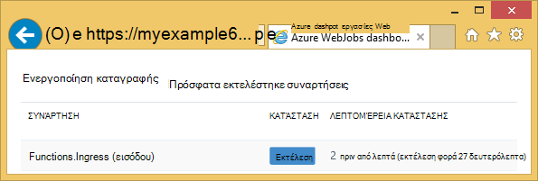
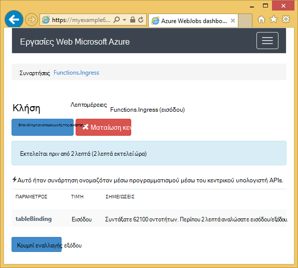
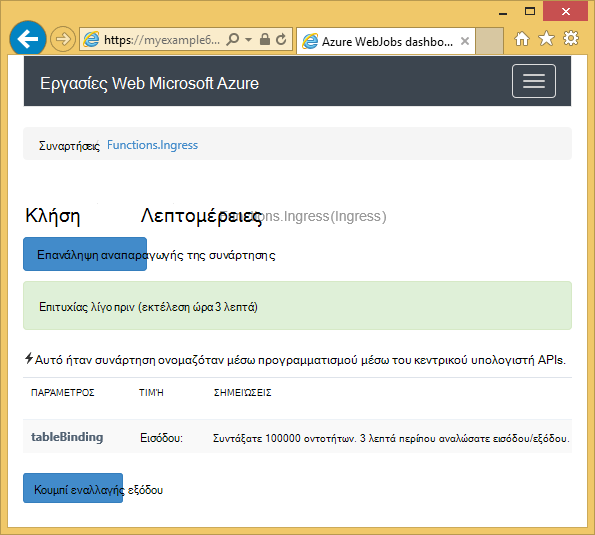

<properties
    pageTitle="Γρήγορα αποτελέσματα με το Azure χώρου αποθήκευσης και του Visual Studio συνδεδεμένες υπηρεσίες (WebJob έργα)"
    description="Πώς μπορείτε να ξεκινήσετε τη χρήση χώρος αποθήκευσης πινάκων του Azure σε ένα έργο Azure WebJobs στο Visual Studio μετά τη σύνδεση με ένα λογαριασμό χώρου αποθήκευσης χρησιμοποιώντας το Visual Studio συνδεδεμένες υπηρεσίες"
    services="storage"
    documentationCenter=""
    authors="TomArcher"
    manager="douge"
    editor=""/>

<tags
    ms.service="storage"
    ms.workload="web"
    ms.tgt_pltfrm="vs-getting-started"
    ms.devlang="na"
    ms.topic="article"
    ms.date="07/18/2016"
    ms.author="tarcher"/>

# Γρήγορα αποτελέσματα με το Azure χώρου αποθήκευσης (Azure WebJob έργα)

[AZURE.INCLUDE [storage-try-azure-tools-tables](../../includes/storage-try-azure-tools-tables.md)]

## Επισκόπηση

Αυτό το άρθρο παρέχει C# δείγματα κώδικα που εμφανίζουν δείχνουν πώς μπορείτε να χρησιμοποιήσετε την έκδοση Azure WebJobs SDK 1.x με την υπηρεσία αποθήκευσης πινάκων του Azure. Τα δείγματα κώδικα, χρησιμοποιήστε την έκδοση [WebJobs SDK](../app-service-web/websites-dotnet-webjobs-sdk.md) 1.x.

Η υπηρεσία αποθήκευσης πίνακα Azure σάς επιτρέπει να αποθηκεύσετε μεγάλες ποσότητες δομημένα δεδομένα. Η υπηρεσία είναι μια αποθήκευσης δεδομένων NoSQL που δέχεται κλήσεις με έλεγχο ταυτότητας από εντός και εκτός του Azure cloud. Azure πίνακες είναι ιδανικά για την αποθήκευση δομημένες, μη σχεσιακών δεδομένων.  Για περισσότερες πληροφορίες, ανατρέξτε στο θέμα [Γρήγορα αποτελέσματα με το χώρο αποθήκευσης πινάκων του Azure μέσω .NET](storage-dotnet-how-to-use-tables.md#create-a-table) .

Ορισμένα από τα τμήματα κώδικα εμφανίζουν το χαρακτηριστικό **πίνακα** που χρησιμοποιείται σε συναρτήσεις που ονομάζονται με μη αυτόματο τρόπο, αυτό σημαίνει ότι δεν χρησιμοποιώντας ένα από τα χαρακτηριστικά έναυσμα.

## Πώς μπορείτε να προσθέσετε οντοτήτων σε πίνακα

Για να προσθέσετε οντοτήτων σε έναν πίνακα, χρησιμοποιήστε το χαρακτηριστικό **πίνακα** με μια **ICollector<T> ** ή **IAsyncCollector<T> ** παραμέτρου όπου **T** Καθορίζει το σχήμα των οντοτήτων που θέλετε να προσθέσετε. Η κατασκευή χαρακτηριστικού μεταφέρει παραμέτρου συμβολοσειράς που καθορίζει το όνομα του πίνακα.

Το παρακάτω δείγμα κώδικα προσθέτει οντοτήτων **άτομο** σε έναν πίνακα με το όνομα *εισόδου*.

        [NoAutomaticTrigger]
        public static void IngressDemo(
            [Table("Ingress")] ICollector<Person> tableBinding)
        {
            for (int i = 0; i < 100000; i++)
            {
                tableBinding.Add(
                    new Person() {
                        PartitionKey = "Test",
                        RowKey = i.ToString(),
                        Name = "Name" }
                    );
            }
        }

Συνήθως ο τύπος που χρησιμοποιείτε με το **ICollector** προέρχεται από **TableEntity** ή υλοποιεί **ITableEntity**, αλλά δεν είναι απαραίτητο να. Οποιαδήποτε από τις ακόλουθες κλάσεις **άτομο που** λειτουργούν με τον κώδικα που εμφανίζεται στην προηγούμενη μέθοδο **εισόδου** .

        public class Person : TableEntity
        {
            public string Name { get; set; }
        }

        public class Person
        {
            public string PartitionKey { get; set; }
            public string RowKey { get; set; }
            public string Name { get; set; }
        }

Εάν θέλετε να εργαστείτε απευθείας με την αποθήκευση Azure API, μπορείτε να προσθέσετε μια παράμετρο **CloudStorageAccount** στην υπογραφή μεθόδου.

## Παρακολούθηση σε πραγματικό χρόνο

Επειδή συναρτήσεις δεδομένων εισόδου διαδικασίας συχνά μεγάλους όγκους δεδομένων, τον πίνακα εργαλείων WebJobs SDK παρέχει δεδομένα σε πραγματικό χρόνο παρακολούθησης. Στην ενότητα **Ενεργοποίηση καταγραφής** σάς ενημερώνει εάν η συνάρτηση εκτελείται ακόμη.

Η σελίδα **Λεπτομέρειες κλήσης** αναφέρει την πρόοδο της συνάρτησης (αριθμός οντοτήτων γραμμένο) ενώ εκτελείται και σας δίνει την ευκαιρία να ματαιώσετε το.

Όταν ολοκληρωθεί η συνάρτηση, τη σελίδα **Λεπτομερειών κλήση** αναφέρει τον αριθμό των γραμμών που έχουν εγγραφεί.

## Μάθετε πώς να διαβάζετε πολλών οντοτήτων από έναν πίνακα

Για να διαβάσετε έναν πίνακα, χρησιμοποιήστε το χαρακτηριστικό **πίνακα** με μια **IQueryable<T> ** παραμέτρου στον τύπο **T** προέρχεται από **TableEntity** ή υλοποιεί **ITableEntity**.

Το παρακάτω δείγμα κώδικα διαβάζει και καταγράφει όλες τις γραμμές από τον πίνακα **εισόδου** :

        public static void ReadTable(
            [Table("Ingress")] IQueryable<Person> tableBinding,
            TextWriter logger)
        {
            var query = from p in tableBinding select p;
            foreach (Person person in query)
            {
                logger.WriteLine("PK:{0}, RK:{1}, Name:{2}",
                    person.PartitionKey, person.RowKey, person.Name);
            }
        }

### Μάθετε πώς να διαβάζετε μία οντότητα από έναν πίνακα

Υπάρχει κατασκευή χαρακτηριστικό **πίνακα** με δύο πρόσθετες παραμέτρους που σας επιτρέπουν να καθορίσετε τα διαμερίσματα κλειδί και κλειδί γραμμής, όταν θέλετε να συνδέσετε με ένα ενιαίο πίνακα οντότητα.

Το παρακάτω δείγμα κώδικα διαβάζει μια γραμμή του πίνακα για ένα **άτομο** οντότητα που βασίζεται σε διαμερίσματα κλειδί και γραμμή τιμές κλειδιού λάβατε σε ένα μήνυμα ουρά:  

        public static void ReadTableEntity(
            [QueueTrigger("inputqueue")] Person personInQueue,
            [Table("persontable","{PartitionKey}", "{RowKey}")] Person personInTable,
            TextWriter logger)
        {
            if (personInTable == null)
            {
                logger.WriteLine("Person not found: PK:{0}, RK:{1}",
                        personInQueue.PartitionKey, personInQueue.RowKey);
            }
            else
            {
                logger.WriteLine("Person found: PK:{0}, RK:{1}, Name:{2}",
                        personInTable.PartitionKey, personInTable.RowKey, personInTable.Name);
            }
        }

Δεν διαθέτει την κλάση **άτομο** σε αυτό το παράδειγμα για την υλοποίηση της **ITableEntity**.

## Πώς μπορείτε να χρησιμοποιήσετε το API αποθήκευσης .NET απευθείας για να εργαστείτε με έναν πίνακα

Μπορείτε επίσης να χρησιμοποιήσετε το χαρακτηριστικό **πίνακα** με ένα αντικείμενο **CloudTable** για περισσότερη ευελιξία στο θέμα εργασία με έναν πίνακα.

Το παρακάτω δείγμα κώδικα χρησιμοποιεί ένα αντικείμενο **CloudTable** για να προσθέσετε μία οντότητα στον πίνακα *εισόδου* .

        public static void UseStorageAPI(
            [Table("Ingress")] CloudTable tableBinding,
            TextWriter logger)
        {
            var person = new Person()
                {
                    PartitionKey = "Test",
                    RowKey = "100",
                    Name = "Name"
                };
            TableOperation insertOperation = TableOperation.Insert(person);
            tableBinding.Execute(insertOperation);
        }

Για περισσότερες πληροφορίες σχετικά με τη χρήση του αντικειμένου **CloudTable** , ανατρέξτε στο θέμα [Γρήγορα αποτελέσματα με το χώρο αποθήκευσης πινάκων του Azure μέσω .NET](storage-dotnet-how-to-use-tables.md).

## Σχετικά θέματα που καλύπτονται από το άρθρο διαδικασιών ουρές

Για πληροφορίες σχετικά με τον τρόπο χειρισμού των επεξεργασία πίνακα ενεργοποίησε με ένα μήνυμα ουρά ή για σενάρια WebJobs SDK όχι συγκεκριμένα πίνακα επεξεργασίας, ανατρέξτε στο θέμα [Γρήγορα αποτελέσματα με το χώρο αποθήκευσης ουρά Azure και του Visual Studio συνδεδεμένες υπηρεσίες (WebJob έργα)](vs-storage-webjobs-getting-started-queues.md).

## Επόμενα βήματα

Σε αυτό το άρθρο παρέχει δείγματα κώδικα που δείχνουν τον τρόπο χειρισμού των συνηθισμένα σενάρια για την εργασία με πίνακες Azure. Για περισσότερες πληροφορίες σχετικά με τη χρήση Azure WebJobs και το SDK WebJobs, ανατρέξτε στο θέμα [Azure WebJobs τεκμηρίωση πόρους](http://go.microsoft.com/fwlink/?linkid=390226).
