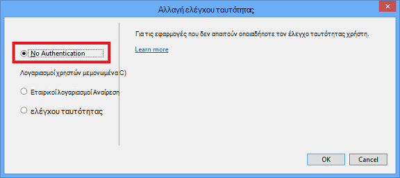

<properties
    pageTitle="Δημιουργία εικόνων σε markdown"
    description="Εξηγεί τον τρόπο για να δημιουργήσετε εικόνες σε markdown σύμφωνα με τις οδηγίες για το Azure αποθετήρια."
    services=""
    solutions=""
    documentationCenter=""
    authors="kenhoff"
    manager="ilanas"
    editor="tysonn"/>

<tags
    ms.service="contributor-guide"
    ms.devlang=""
    ms.topic="article"
    ms.tgt_pltfrm=""
    ms.workload=""
    ms.date="06/25/2015"
    ms.author="kenhoff" />

# <a name="create-images-in-markdown"></a>Δημιουργία εικόνων στο markdown

## <a name="image-folder-creation-and-link-syntax"></a>Εικόνα φακέλου δημιουργίας και σύνδεση σύνταξη

Για ένα νέο άρθρο, θα πρέπει να δημιουργήσετε ένα φάκελο στην εξής θέση:

    /articles/<service-directory>/media/<article-name>/

Για παράδειγμα:

    /articles/app-service/media/app-service-enterprise-multichannel-apps/

Αφού δημιουργήσετε το φάκελο και προστέθηκε εικόνες σε αυτό, χρησιμοποιήστε την ακόλουθη σύνταξη για να δημιουργήσετε εικόνες στο άρθρο σας:

```

```
Παράδειγμα:

Ανατρέξτε στο θέμα [το πρότυπο markdown](../markdown%20templates/markdown-template-for-new-articles.md) για ένα παράδειγμα.  Οι συνδέσεις αναφοράς εικόνας σε αυτό το πρότυπο markdown είναι σχεδιασμένα ώστε να είναι στο κάτω μέρος του προτύπου.

## <a name="guidelines-specific-to-azuremicrosoftcom"></a>Οδηγίες για azure.microsoft.com

Στιγμιότυπα οθόνης αυτήν τη στιγμή συνιστάται εάν δεν είναι δυνατό να συμπεριλάβετε βήματα αναπαραγωγής. Συντάξτε το περιεχόμενό σας, έτσι ώστε να αναμονή το περιεχόμενο χωρίς τα στιγμιότυπα οθόνης, εάν είναι απαραίτητο.

Χρησιμοποιήστε τις ακόλουθες οδηγίες κατά τη δημιουργία και συμπερίληψη art αρχείων:
- Δεν κοινή χρήση αρχείων art σε έγγραφα. Αντιγράψτε το αρχείο που χρειάζεστε και προσθήκη στο φάκελο πολυμέσων για το συγκεκριμένο θέμα. Κοινή χρήση μεταξύ αρχείων δεν συνιστάται, επειδή πρόκειται για εύκολη τη κατάργηση καταργηθεί περιεχομένου και εικόνων διατηρώντας το repo καθαρή.

- Μορφές αρχείων: Χρησιμοποιήστε αρχεία .png - είναι υψηλότερη ποιότητα και διατήρηση της ποιότητας τους κατά τη διαδικασία της μετάφρασης. Άλλες μορφές αρχείων δεν διατηρούν καθώς και την ποιότητα. Η μορφή .jpeg επιτρέπεται, αλλά δεν προτιμώμενη.  Δεν υπάρχει αρχεία GIF με κίνηση.

- Χρήση κόκκινα τετράγωνα του προεπιλεγμένου πλάτους που παρέχονται στη "Ζωγραφική" (5 px) για να τραβήξετε την προσοχή σε συγκεκριμένο στοιχεία στο στιγμιότυπα οθόνης.  

    Παράδειγμα:

    

- Πότε έχει νόημα, μην διστάσεις να περικόψετε εικόνες, ώστε τα στοιχεία του περιβάλλοντος εργασίας Χρήστη θα εμφανίζεται σε πλήρες μέγεθος. Βεβαιωθείτε ότι το περιβάλλον είναι απενεργοποιημένο στους χρήστες, μέσω.

- Αποφύγετε κενό διάστημα στο άκρα της στιγμιότυπα οθόνης. Εάν μπορείτε να περικόψετε ένα στιγμιότυπο οθόνης με τον τρόπο που αφήνει λευκό φόντο στα άκρα, προσθέστε ένα μεμονωμένο pixel γκρι περίγραμμα γύρω από την εικόνα.  Εάν χρησιμοποιείτε Ζωγραφική, χρησιμοποιήστε το πιο ανοιχτό γκρι στον της παλέτας χρωμάτων του προεπιλεγμένου (0xC3C3C3). Εάν χρησιμοποιείτε κάποια άλλα εφαρμογή γραφικών, το χρώμα RGB είναι R195, G195, 195. Μπορείτε να προσθέσετε εύκολα γκρι περίγραμμα γύρω από μια εικόνα στο Visio--για να το κάνετε αυτό, επιλέξτε την εικόνα, επιλέξτε γραμμή και βεβαιωθείτε ότι η έχει οριστεί το σωστό χρώμα και, στη συνέχεια, να αλλάξετε το πάχος γραμμής για να pt 1 1/2.  Στιγμιότυπα οθόνης θα πρέπει να έχει ένα περίγραμμα 1-pixel-wide γκρι λευκές περιοχές της το στιγμιότυπο οθόνης δεν θάμπωμα σε ιστοσελίδα.

    Παράδειγμα:

    
    
    Για ένα εργαλείο για να αυτοματοποιήσετε τη διαδικασία προσθήκης απαιτείται περιγράμματος σε εικόνες, ανατρέξτε στο θέμα [AddACOMBorder εργαλείο - πώς μπορείτε να αυτοματοποιήσετε τη διαδικασία προσθήκης απαιτείται 1 pixel γκρι περιγράμματος για να ACOM εικόνες](https://github.com/Azure/Azure-CSI-Content-Tools/tree/master/Tools/AddACOMImageBorder).

- Εννοιολογικές εικόνες με κενό διάστημα, δεν χρειάζεται γκρι περίγραμμα.  

    Παράδειγμα:

    

- Προσπαθήστε να μην κάνετε μια εικόνα που είναι πολύ μεγάλη.  Εικόνες θα είναι αυτόματα με αλλαγμένο μέγεθος εάν είναι πολύ μεγάλη. Ωστόσο, την αλλαγή μεγέθους μερικές φορές έχει ως αποτέλεσμα ασάφειας, επομένως συνιστάται να περιορίσετε το πλάτος των εικόνων σας για να 780 px και με μη αυτόματο τρόπο την αλλαγή μεγέθους εικόνων πριν από την υποβολή εάν είναι απαραίτητο.

- Εμφάνιση εξόδους εντολή στο στιγμιότυπα οθόνης.  Εάν το άρθρο περιλαμβάνει βήματα όταν ο χρήστης εργάζεται μέσα σε ένα κέλυφος, είναι χρήσιμο για να εμφανίσετε το αποτέλεσμα της εντολής στο στιγμιότυπα οθόνης. Σε αυτήν την περίπτωση, ο περιορισμός του πλάτους του κελύφους σε περίπου 72 χαρακτήρες γενικά εξασφαλίζει ότι την εικόνα σας θα παραμείνει εντός του 780 κατευθυντήριας γραμμής πλάτος px. Πριν κάνετε κάποια ένα στιγμιότυπο οθόνης του εξόδου, αλλάξτε το μέγεθος του παραθύρου έτσι ώστε να εμφανίζεται μόνο η σχετική εντολή και εξόδου (προαιρετικά με μια κενή γραμμή σε κάθε πλευρά).

- Λήψη ολόκληρου στιγμιότυπα οθόνης των windows, όταν είναι δυνατό. Κατά τη λήψη ένα στιγμιότυπο οθόνης από ένα παράθυρο προγράμματος περιήγησης, αλλάξτε το μέγεθος παραθύρου του προγράμματος περιήγησης για να 780 px ευρεία ή μικρότερη και διατήρηση του ύψους του παραθύρου του προγράμματος περιήγησης ως σύντομη όσο το δυνατόν πιο όπως που ταιριάζει με την εφαρμογή σας μέσα στο παράθυρο.

    Παράδειγμα:

    

- Να είστε προσεκτικοί με ποιες πληροφορίες είναι προέκυψε στο στιγμιότυπα οθόνης.  Δεν αποκαλύπτει πληροφορίες εσωτερικής εταιρείας ή προσωπικές πληροφορίες.

- Εννοιολογικά γραφικά ή διαγράμματα, χρησιμοποιήστε τα εικονίδια επίσημη στο Cloud και μεγάλες επιχειρήσεις και το εικονίδιο του συμβόλου σύνολο. Ένα σύνολο δημόσια είναι διαθέσιμη από την http://aka.ms/CnESymbols.

- Αντικαταστήστε δημόσια ή ιδιωτική πληροφορίες σε στιγμιότυπα οθόνης με το κείμενο κράτησης θέσης σε αγκύλες. Αυτό περιλαμβάνει τα ονόματα χρηστών, αναγνωριστικά συνδρομής και άλλες σχετικές πληροφορίες. Προσωπική ονομάτων μπορεί να αντικατασταθεί με μια [έγκριση fictious όνομα](https://aka.ms/ficticiousnames)(σύνδεση μόνο για υπαλλήλου). Μην χρησιμοποιείτε τη συμβουλή crayon ή δείκτη στη "Ζωγραφική" για να κρύβουν ή θάμπωμα προσωπικών ή προσωπικές πληροφορίες.

  Η παρακάτω εικόνα έχει ενημερωθεί σωστά για να αντικαταστήσετε το πραγματικό **Αναγνωριστικό συνδρομής** με σύμβολο κράτησης θέσης πληροφορίες:

  

### <a name="contributors-guide-links"></a>Οι συνεργάτες των συνδέσεων Οδηγός

- [Το άρθρο Επισκόπηση](./../README.md)
- [Ευρετήριο άρθρων με οδηγίες](./contributor-guide-index.md)
