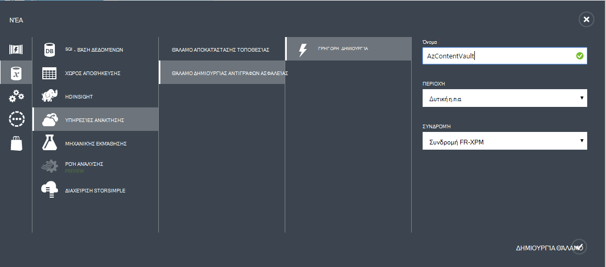

## Δημιουργία ενός αντιγράφου ασφαλείας θάλαμο
Να δημιουργήσετε αντίγραφα ασφαλείας αρχεία και δεδομένα από το Windows Server ή διαχείριση προστασίας δεδομένων (DPM) για να Azure ή κατά τη δημιουργία αντιγράφων ασφαλείας IaaS ΣΠΣ να Azure, πρέπει να δημιουργήσετε ένα αντίγραφο ασφαλείας θάλαμο στη γεωγραφική περιοχή όπου θέλετε να αποθηκεύσετε τα δεδομένα.

Ακολουθήστε τα παρακάτω βήματα θα σας καθοδηγήσει τη δημιουργία του θάλαμο που χρησιμοποιείται για την αποθήκευση αντιγράφων ασφαλείας.

1. Είσοδος στην [πύλη διαχείρισης](https://manage.windowsazure.com/)
2. Κάντε κλικ στην επιλογή **Δημιουργία** > **Υπηρεσίες δεδομένων** > **Υπηρεσίες ανάκτησης** > **Θάλαμο δημιουργίας αντιγράφων ασφαλείας** και επιλέξτε **Γρήγορης δημιουργίας**.

    

3. Για την παράμετρο **όνομα** , πληκτρολογήστε ένα φιλικό όνομα για τον προσδιορισμό του αντιγράφου ασφαλείας θάλαμο. Αυτό πρέπει να είναι μοναδικός για κάθε εγγραφή.

4. Για την παράμετρο **περιοχής** , επιλέξτε τη γεωγραφική περιοχή για το αντίγραφο ασφαλείας θάλαμο. Η επιλογή καθορίζει τη γεωγραφική περιοχή στην οποία αποστέλλονται τα δεδομένα αντιγράφου ασφαλείας σας. Επιλέγοντας μια γεωγραφική περιοχή Κλείσιμο για την τοποθεσία σας, μπορείτε να μειώσετε την αδράνεια δικτύου κατά τη δημιουργία αντιγράφων ασφαλείας για να Azure.

5. Κάντε κλικ στην επιλογή **Δημιουργία θάλαμο** για την ολοκλήρωση της ροής εργασίας. Ενδέχεται να χρειαστεί κάποιος χρόνος για το αντίγραφο ασφαλείας θάλαμο θα δημιουργηθεί. Για να ελέγξετε την κατάσταση, μπορείτε να παρακολουθείτε τις ειδοποιήσεις στο κάτω μέρος της πύλης.

    

6. Μετά τη δημιουργία του αντιγράφου ασφαλείας θάλαμο, ένα μήνυμα σας ενημερώνει για το θάλαμο δημιουργήθηκε με επιτυχία. Το θάλαμο επίσης εμφανίζεται στους πόρους για τις υπηρεσίες ανάκτησης ως **ενεργό**.

    

### Azure αντίγραφο ασφαλείας - επιλογές πλεονασμού αποθήκευσης

>[AZURE.IMPORTANT] Την καλύτερη δυνατή ώρα για τον προσδιορισμό της επιλογής πλεονασμού χώρου αποθήκευσης είναι αμέσως μετά τη δημιουργία θάλαμο και πριν από οποιοδήποτε μηχανές έχετε καταχωρήσει για να το θάλαμο. Όταν ένα στοιχείο έχει καταχωρηθεί για το θάλαμο, η επιλογή πλεονασμού χώρου αποθήκευσης είναι κλειδωμένο και δεν μπορεί να τροποποιηθεί.

Επιχειρηματικές ανάγκες σας πρέπει να προσδιορίσετε το χώρο αποθήκευσης πλεονασμού το χώρο αποθήκευσης παρασκηνίου Azure δημιουργίας αντιγράφων ασφαλείας. Εάν χρησιμοποιείτε Azure ως ένα τελικό σημείο πρωτεύον αποθήκευσης αντιγράφων ασφαλείας (π.χ. που δημιουργείτε αντίγραφα ασφαλείας σε Azure από ένα διακομιστή Windows), πρέπει να εξετάσετε επιλέγοντας (προεπιλογή) παν πλεονάζοντα επιλογή αποθήκευσης. Αυτό είναι ορατή στην περιοχή επιλογή **Ρύθμιση παραμέτρων** σας θάλαμο δημιουργίας αντιγράφων ασφαλείας.

#### Παν πλεονάζοντα χώρο αποθήκευσης (Εξοπλισμό)
Εξοπλισμό διατηρεί έξι αντίγραφα των δεδομένων σας. Με Εξοπλισμό, τα δεδομένα σας είναι αναπαραχθούν τρεις φορές μέσα στην κύρια περιοχή και αναπαράγεται επίσης τρεις φορές σε μια δευτερεύουσα περιοχή εκατοντάδες μίλια μακριά από την κύρια περιοχή, παρέχοντας το υψηλότερο επίπεδο διάρκεια ζωής. Σε περίπτωση αποτυχίας κατά την κύρια περιοχή, κατά την αποθήκευση των δεδομένων σε Εξοπλισμό, δημιουργία αντιγράφων ασφαλείας Azure εξασφαλίζει ότι τα δεδομένα σας είναι διαρκή σε δύο ξεχωριστές περιοχές.

#### Τοπικά πλεονάζοντα χώρο αποθήκευσης (LRS)
Τοπικά πλεονάζοντα χώρο αποθήκευσης (LRS) διατηρεί τρία αντίγραφα των δεδομένων σας. LRS αναπαράγεται τρεις φορές μέσα σε μια μεμονωμένη εγκατάσταση σε μία μόνο περιοχή. LRS προστατεύει τα δεδομένα σας από το κανονικό υλικού αποτυχίες, αλλά όχι από την αποτυχία της μια ολόκληρη Azure εγκατάστασης.

Εάν χρησιμοποιείτε Azure ως ένα τελικό σημείο τριτεύοντα αποθήκευσης αντιγράφων ασφαλείας (π.χ. χρησιμοποιείτε SCDPM για να έχετε ένα τοπικό αντίγραφο ασφαλείας αντιγράψετε εσωτερικής εγκατάστασης και η χρήση Azure για το διατήρησης μακροπρόθεσμη πρέπει), πρέπει να επιλέξετε τοπικά πλεονάζοντα χώρο αποθήκευσης από την επιλογή **Ρύθμιση παραμέτρων** σας θάλαμο δημιουργίας αντιγράφων ασφαλείας. Αυτό μεταφέρει προς τα κάτω το κόστος με την αποθήκευση δεδομένων στο Azure, ενώ παρέχει χαμηλότερο επίπεδο διάρκεια ζωής για τα δεδομένα που ενδέχεται να είναι αποδεκτή για τριτεύοντα αντίγραφα.

