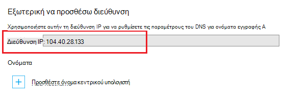

Χρησιμοποιείται η συστήματος ονομάτων τομέα (DNS) για να εντοπίσετε τους πόρους στο internet. Για παράδειγμα, όταν εισάγετε μια διεύθυνση web app στο πρόγραμμα περιήγησης, ή κάντε κλικ σε μια σύνδεση σε μια ιστοσελίδα, χρησιμοποιεί DNS για να μεταφράσετε τον τομέα σε μια διεύθυνση IP. Η διεύθυνση IP είναι sort των όπως μια διεύθυνση, αλλά δεν είναι πολύ human φιλικούς προς. Για παράδειγμα, είναι πιο εύκολο να θυμάστε ένα όνομα DNS όπως **contoso.com** από ό, τι να θυμάστε μια διεύθυνση IP όπως 192.168.1.88 ή 2001:0:4137:1f67:24a2:3888:9cce:fea3.

Το σύστημα DNS είναι με βάση *τις εγγραφές*. Εγγραφές συσχετίσετε ένα συγκεκριμένο *όνομα*, όπως **contoso.com**, με μια διεύθυνση IP ή ένα άλλο όνομα DNS. Όταν μια εφαρμογή, όπως ένα πρόγραμμα περιήγησης web, αναζητά ένα όνομα στο DNS, εντοπίζει την εγγραφή και χρησιμοποιεί ό, τι να δείχνει ως τη διεύθυνση. Εάν η τιμή που να οδηγεί στο είναι μια διεύθυνση IP, το πρόγραμμα περιήγησης θα χρησιμοποιήσει αυτήν την τιμή. Εάν να οδηγεί στο άλλο όνομα DNS, στη συνέχεια, την εφαρμογή διαθέτει για να το κάνετε ανάλυση ξανά. Ο τελικός όλα επίλυση ονομάτων θα τελειώνουν σε μια διεύθυνση IP.

Όταν δημιουργείτε μια εφαρμογή web στην υπηρεσία εφαρμογής, ένα όνομα DNS εκχωρείται αυτόματα στην εφαρμογή web. Αυτό το όνομα έχει τη μορφή ** &lt;yourwebappname&gt;. azurewebsites.net**. Υπάρχει επίσης μια εικονική διεύθυνση IP διαθέσιμη για χρήση κατά τη δημιουργία DNS των εγγραφών, ώστε να μπορείτε να δημιουργήσετε τις εγγραφές που οδηγεί το **. azurewebsites.net**, ή μπορείτε να ορίσετε τη διεύθυνση IP.

> [AZURE.NOTE] Η διεύθυνση IP της εφαρμογής web θα αλλάξει εάν διαγράψετε και δημιουργήστε ξανά την εφαρμογή web ή αλλάξτε τη λειτουργία πρόγραμμα εφαρμογής υπηρεσίας **δωρεάν** , αφού έχει οριστεί σε **βασικές**, **κοινή χρήση**ή **Τυπική**.

Υπάρχουν επίσης πολλούς τύπους εγγραφών, κάθε μία με τις δικές τους συναρτήσεις και τους περιορισμούς, αλλά για τις εφαρμογές web θα σας μόνο σας ενδιαφέρουν δύο, *Α* και *CNAME* εγγραφές.

###Εγγραφή διεύθυνσης (μια εγγραφή)

Μια εγγραφή A αντιστοιχίζει ένα τομέα, όπως **contoso.com** ή **www.contoso.com**, *ή έναν τομέα μπαλαντέρ* όπως ** \*. contoso.com**, σε μια διεύθυνση IP. Στην περίπτωση μια εφαρμογή web στην εφαρμογή υπηρεσίας, το εικονικό IP της υπηρεσίας ή μια συγκεκριμένη IP διεύθυνση που έχετε αγοράσει για την εφαρμογή web.

Τα κύρια πλεονεκτήματα της εγγραφής A επάνω σε μια εγγραφή CNAME είναι οι εξής:

* Μπορείτε να αντιστοιχίσετε έναν ριζικό τομέα όπως **contoso.com** σε διεύθυνση IP. πολλά μητρώα καταχώρησης ονομάτων μόνο επιτρέπουν αυτό χρησιμοποιώντας μια εγγραφών

* Μπορείτε να έχετε μία εγγραφή που χρησιμοποιεί ένα χαρακτήρα μπαλαντέρ, όπως ** \*. contoso.com**, που θα χειρισμού των αιτήσεων για πολλούς δευτερεύοντες τομείς όπως **mail.contoso.com**, **blogs.contoso.com**ή **www.contso.com**.

> [AZURE.NOTE] Εφόσον μια εγγραφή A έχει αντιστοιχιστεί σε μια στατική διεύθυνση IP, δεν μπορεί να επιλύσει αυτόματα τις αλλαγές στη διεύθυνση IP της εφαρμογής web. Παρέχεται μια διεύθυνση IP για χρήση με ένα εγγραφές όταν ρυθμίζετε τις παραμέτρους όνομα του προσαρμοσμένου τομέα για την εφαρμογή web; Ωστόσο, αυτή η τιμή ενδέχεται να αλλάξουν Εάν διαγράψετε και δημιουργήστε ξανά την εφαρμογή web ή να αλλάξετε την κατάσταση λειτουργίας πρόγραμμα εφαρμογής υπηρεσίας για να επιστρέψετε στην **δωρεάν**.

###Εγγραφή ψευδωνύμου (CNAME record)

Μια εγγραφή CNAME αντιστοιχίζει ένα *συγκεκριμένο* όνομα DNS, όπως **mail.contoso.com** ή **www.contoso.com**, σε ένα άλλο όνομα τομέα (κανονική). Στην περίπτωση εφαρμογής υπηρεσίας Web Apps, το όνομα τομέα κανονικής είναι το ** &lt;yourwebappname >. azurewebsites.net** το όνομα τομέα της εφαρμογής web. Μετά τη δημιουργία, την εγγραφή CNAME δημιουργεί ένα ψευδώνυμο για το ** &lt;yourwebappname >. azurewebsites.net** το όνομα του τομέα. Η εγγραφή CNAME επιλύει στη διεύθυνση IP του σας ** &lt;yourwebappname >. azurewebsites.net** ονόματος τομέα αυτόματα, ώστε να εάν αλλάξει τη διεύθυνση IP του web app, δεν χρειάζεται να κάνετε κάποια ενέργεια.

> [AZURE.NOTE] Ορισμένες μητρώα καταχώρησης ονομάτων τομέα μόνο σάς επιτρέπουν να αντιστοιχίσετε δευτερεύοντες τομείς, όταν χρησιμοποιείτε μια εγγραφή CNAME, όπως **www.contoso.com**και δεν ρίζας ονομάτων, όπως **contoso.com**. Για περισσότερες πληροφορίες σχετικά με τις εγγραφές CNAME, ανατρέξτε στην τεκμηρίωση που παρέχεται από το μητρώο καταχώρησης ονομάτων, <a href="http://en.wikipedia.org/wiki/CNAME_record">την καταχώρηση Wikipedia στην εγγραφή CNAME</a>ή το έγγραφο <a href="http://tools.ietf.org/html/rfc1035">IETF ονόματα τομέων – εφαρμογή και προδιαγραφές</a> .

###Συγκεκριμένες απαιτήσεις DNS εφαρμογής Web

Χρησιμοποιώντας μια εγγραφή A με τα Web Apps απαιτεί να πρώτα να δημιουργήσετε μία από τις ακόλουθες εγγραφές TXT:

* **Για τον ριζικό τομέα** - εγγραφής A DNS TXT του **@** να ** &lt;yourwebappname&gt;. azurewebsites.net**.

* **Για μια συγκεκριμένη υποτομέα** - A όνομα DNS του ** &lt;υποτομέα >** να ** &lt;yourwebappname&gt;. azurewebsites.net**. Για παράδειγμα, **ιστολόγια** αν είναι της εγγραφής A για **blogs.contoso.com**.

* **Για το χαρακτήρα μπαλαντέρ sub-dodmains** - εγγραφής A DNS TXT του *** να ** &lt;yourwebappname&gt;. azurewebsites.net**.

Αυτήν την εγγραφή TXT χρησιμοποιείται για να επιβεβαιώσετε ότι είστε ο κάτοχος του τομέα που προσπαθείτε να χρησιμοποιήσετε. Αυτό είναι εκτός από τη δημιουργία μια εγγραφή A που δείχνει προς την εικονική διεύθυνση IP της εφαρμογής web.

Μπορείτε να βρείτε τη διεύθυνση IP και **. azurewebsites.net** ονόματα για την εφαρμογή web της, ακολουθώντας τα παρακάτω βήματα:

1. Στο πρόγραμμα περιήγησης, ανοίξτε την [Πύλη Azure](https://portal.azure.com).

2. Στο το blade **Εφαρμογές Web** , κάντε κλικ στο όνομα της εφαρμογής web και, στη συνέχεια, επιλέξτε **προσαρμοσμένων τομέων** από το κάτω μέρος της σελίδας.

    

3. Στο το blade **προσαρμοσμένων τομέων** , θα δείτε την εικονική διεύθυνση IP. Αποθηκεύσετε αυτές τις πληροφορίες, όπως θα χρησιμοποιηθεί κατά τη δημιουργία εγγραφών DNS

    

    > [AZURE.NOTE] Δεν μπορείτε να χρησιμοποιήσετε προσαρμοσμένα ονόματα τομέα με μια εφαρμογή web **δωρεάν** και πρέπει να αναβαθμίσετε το πρόγραμμα εφαρμογής υπηρεσίας σε **κοινή χρήση**, **βασικές**, **τυπικό**ή σειρά **Premium** . Για περισσότερες πληροφορίες σχετικά με το πρόγραμμα της εφαρμογής υπηρεσίας τιμολόγησης βαθμίδες, συμπεριλαμβανομένου του τρόπου για να αλλάξετε τη σειρά τιμολόγησης της εφαρμογής web, δείτε [πώς μπορείτε να περιορίσετε το μέγεθος των εφαρμογών web](../articles/web-sites-scale.md).
