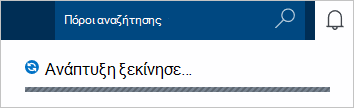
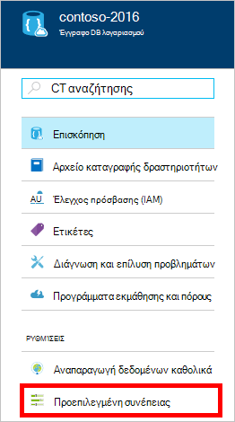
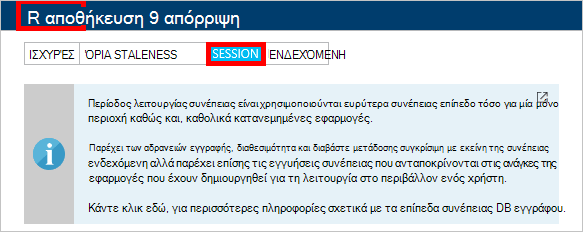

1.  Είσοδος στην [πύλη του Azure](https://portal.azure.com/).
2.  Στο Jumpbar το, κάντε κλικ στην επιλογή **Δημιουργία**, κάντε κλικ στην επιλογή **δεδομένα + χώρος αποθήκευσης**και, στη συνέχεια, κάντε κλικ στην επιλογή **DocumentDB (NoSQL)**.

      

3. Στο blade του **νέου λογαριασμού** , καθορίστε την επιθυμητή ρύθμιση παραμέτρων για το λογαριασμό DocumentDB.

    

    - Στο πλαίσιο **ID** , πληκτρολογήστε ένα όνομα για να αναγνωρίζετε το λογαριασμό DocumentDB.  Όταν επαληθευτεί το **Αναγνωριστικό** , εμφανίζεται ένα πράσινο σημάδι ελέγχου στο πλαίσιο **Αναγνωριστικό** . Η τιμή **Αναγνωριστικού** γίνεται το όνομα κεντρικού υπολογιστή μέσα σε URI. Το **Αναγνωριστικό** μπορεί να περιέχει μόνο πεζά γράμματα, αριθμούς και το '-' χαρακτήρας και πρέπει να είναι μεταξύ 3 και 50 χαρακτήρες. Σημείωση που *documents.azure.com* τοποθετείται δίπλα στο όνομα τελικού σημείου που επιλέγετε, το αποτέλεσμα της οποίας γίνεται το τελικό σημείο το λογαριασμό σας DocumentDB.

    - Στο πλαίσιο **NoSQL API** , επιλέξτε **DocumentDB**.  

    - Για **τη συνδρομή**, επιλέξτε τη συνδρομή Azure που θέλετε να χρησιμοποιήσετε για το λογαριασμό DocumentDB. Εάν ο λογαριασμός σας έχει μόνο μία συνδρομή, αυτόν το λογαριασμό είναι ενεργοποιημένη από προεπιλογή.

    - Στην **Ομάδα πόρων**, επιλέξτε ή δημιουργήστε μια ομάδα πόρων για το λογαριασμό σας DocumentDB.  Από προεπιλογή, δημιουργείται μια νέα ομάδα πόρων. Για περισσότερες πληροφορίες, ανατρέξτε στο θέμα [με την πύλη Azure για να διαχειριστείτε τους πόρους σας Azure](../articles/azure-portal/resource-group-portal.md).

    - Χρησιμοποιήστε **θέση** για να καθορίσετε τη γεωγραφική θέση στην οποία θέλετε να φιλοξενήσετε το λογαριασμό σας DocumentDB. 

4.  Όταν έχουν ρυθμιστεί οι παράμετροι των νέων επιλογών του DocumentDB λογαριασμού, κάντε κλικ στην επιλογή **Δημιουργία**. Για να ελέγξετε την κατάσταση της ανάπτυξης, επιλέξτε την ενότητα ειδοποιήσεις.  

      

    

5.  Αφού δημιουργηθεί ο λογαριασμός DocumentDB, είναι έτοιμη για χρήση με τις προεπιλεγμένες ρυθμίσεις. Η προεπιλεγμένη συνέπεια του λογαριασμού DocumentDB έχει οριστεί σε **περίοδο λειτουργίας**.  Μπορείτε να προσαρμόσετε το προεπιλεγμένο συνέπειας κάνοντας κλικ στην επιλογή **Προεπιλεγμένο συνέπειας** στο μενού του πόρου. Για να μάθετε περισσότερα σχετικά με τα επίπεδα συνέπειας που παρέχεται από DocumentDB, ανατρέξτε στο θέμα [συνέπειας επίπεδα στο DocumentDB](../articles/documentdb/documentdb-consistency-levels.md).

      

      

[How to: Create a DocumentDB account]: #Howto
[Next steps]: #NextSteps
[documentdb-manage]:../articles/documentdb/documentdb-manage.md
