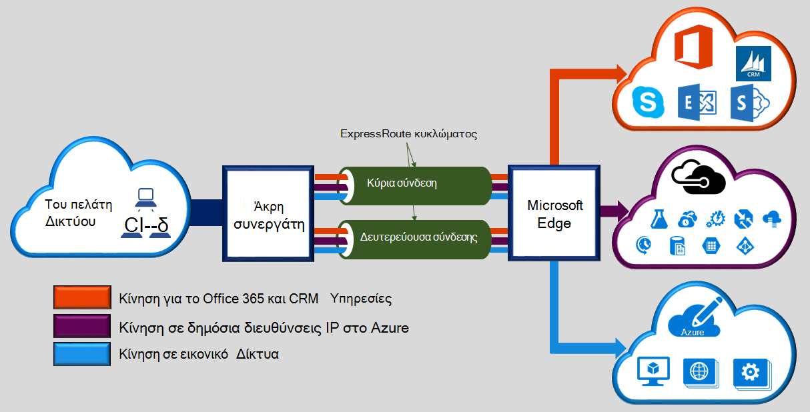

Microsoft Azure ExpressRoute σάς επιτρέπει να επεκτείνετε δίκτυά σας εσωτερικής εγκατάστασης στο cloud της Microsoft μέσω σύνδεσης αποκλειστικό ιδιωτικό διευκολυνθεί με μια υπηρεσία παροχής σύνδεσης. Με ExpressRoute, μπορείτε να δημιουργήσετε συνδέσεις με τις υπηρεσίες cloud της Microsoft, όπως το Windows Azure, Office 365 και CRM Online. Συνδεσιμότητα μπορεί να είναι από ένα οποιοδήποτε για οποιοδήποτε δίκτυο (IP VPN), το δίκτυο Ethernet από σημείο σε σημείο ή μια εικονική σταυρό σύνδεση μέσω μιας εταιρείας παροχής συνδεσιμότητας σε εγκατάσταση από κοινού θέση. ExpressRoute συνδέσεις δεν μεταβείτε μέσω του δημόσιου Internet. Αυτό σας επιτρέπει συνδέσεις ExpressRoute για να προσφέρουν περισσότερες αξιοπιστία, μεγαλύτερες ταχύτητες, των αδρανειών χαμηλότερη και υψηλότερη ασφάλεια από τις τυπικές συνδέσεις μέσω του Internet.  

